<!--
CO_OP_TRANSLATOR_METADATA:
{
  "original_hash": "ecbd9179a21edbaafaf114d47f09f3e3",
  "translation_date": "2025-05-09T17:56:23+00:00",
  "source_file": "md/02.Application/01.TextAndChat/Phi3/E2E_Phi-3-FineTuning_PromptFlow_Integration_AIFoundry.md",
  "language_code": "mr"
}
-->
# Azure AI Foundry मधील Prompt flow सह कस्टम Phi-3 मॉडेल्सचे फाइन-ट्यूनिंग आणि एकत्रीकरण

हा end-to-end (E2E) सॅम्पल Microsoft Tech Community मधील "[Fine-Tune and Integrate Custom Phi-3 Models with Prompt Flow in Azure AI Foundry](https://techcommunity.microsoft.com/t5/educator-developer-blog/fine-tune-and-integrate-custom-phi-3-models-with-prompt-flow-in/ba-p/4191726?WT.mc_id=aiml-137032-kinfeylo)" मार्गदर्शनावर आधारित आहे. यात Azure AI Foundry मध्ये Prompt flow सह कस्टम Phi-3 मॉडेल्सचे फाइन-ट्यूनिंग, डिप्लॉयमेंट आणि एकत्रीकरण कसे करायचे ते दाखवले आहे.  
E2E सॅम्पल "[Fine-Tune and Integrate Custom Phi-3 Models with Prompt Flow](./E2E_Phi-3-FineTuning_PromptFlow_Integration.md)" ज्यामध्ये लोकल मशीनवर कोड चालवण्याचा समावेश होता, त्याच्या उलट, हा ट्यूटोरियल पूर्णपणे Azure AI / ML Studio मध्ये मॉडेल फाइन-ट्यूनिंग आणि एकत्रीकरणावर लक्ष केंद्रित करतो.

## आढावा

या E2E सॅम्पलमध्ये, तुम्ही Phi-3 मॉडेलचे फाइन-ट्यूनिंग आणि Azure AI Foundry मध्ये Prompt flow सह एकत्रीकरण कसे करायचे हे शिकाल. Azure AI / ML Studio चा वापर करून, तुम्ही कस्टम AI मॉडेल्सच्या डिप्लॉयमेंट आणि वापरासाठी वर्कफ्लो तयार कराल. हा E2E सॅम्पल तीन परिदृश्यांमध्ये विभागलेला आहे:

**परिदृश्य 1: Azure संसाधने सेट करा आणि फाइन-ट्यूनिंगसाठी तयारी करा**

**परिदृश्य 2: Phi-3 मॉडेलचे फाइन-ट्यूनिंग करा आणि Azure Machine Learning Studio मध्ये डिप्लॉय करा**

**परिदृश्य 3: Prompt flow सह एकत्रीकरण करा आणि Azure AI Foundry मध्ये तुमच्या कस्टम मॉडेलसह चॅट करा**

खाली या E2E सॅम्पलचा एक आढावा दिला आहे.


### सामग्रीची यादी

1. **[परिदृश्य 1: Azure संसाधने सेट करा आणि फाइन-ट्यूनिंगसाठी तयारी करा](../../../../../../md/02.Application/01.TextAndChat/Phi3)**
    - [Azure Machine Learning Workspace तयार करा](../../../../../../md/02.Application/01.TextAndChat/Phi3)
    - [Azure Subscription मध्ये GPU कोटा विनंती करा](../../../../../../md/02.Application/01.TextAndChat/Phi3)
    - [भूमिका नियुक्ती जोडा](../../../../../../md/02.Application/01.TextAndChat/Phi3)
    - [प्रोजेक्ट सेट अप करा](../../../../../../md/02.Application/01.TextAndChat/Phi3)
    - [फाइन-ट्यूनिंगसाठी डेटासेट तयार करा](../../../../../../md/02.Application/01.TextAndChat/Phi3)

1. **[परिदृश्य 2: Phi-3 मॉडेल फाइन-ट्यून करा आणि Azure Machine Learning Studio मध्ये डिप्लॉय करा](../../../../../../md/02.Application/01.TextAndChat/Phi3)**
    - [Phi-3 मॉडेल फाइन-ट्यून करा](../../../../../../md/02.Application/01.TextAndChat/Phi3)
    - [फाइन-ट्यून केलेले Phi-3 मॉडेल डिप्लॉय करा](../../../../../../md/02.Application/01.TextAndChat/Phi3)

1. **[परिदृश्य 3: Prompt flow सह एकत्रीकरण करा आणि Azure AI Foundry मध्ये तुमच्या कस्टम मॉडेलसह चॅट करा](../../../../../../md/02.Application/01.TextAndChat/Phi3)**
    - [कस्टम Phi-3 मॉडेल Prompt flow सह एकत्र करा](../../../../../../md/02.Application/01.TextAndChat/Phi3)
    - [तुमच्या कस्टम Phi-3 मॉडेलसह चॅट करा](../../../../../../md/02.Application/01.TextAndChat/Phi3)

## परिदृश्य 1: Azure संसाधने सेट करा आणि फाइन-ट्यूनिंगसाठी तयारी करा

### Azure Machine Learning Workspace तयार करा

1. पोर्टल पेजच्या वरच्या **search bar** मध्ये *azure machine learning* टाइप करा आणि दिसणाऱ्या पर्यायांमधून **Azure Machine Learning** निवडा.

    

2. नेव्हिगेशन मेनूमधून **+ Create** निवडा.

3. नेव्हिगेशन मेनूमधून **New workspace** निवडा.

    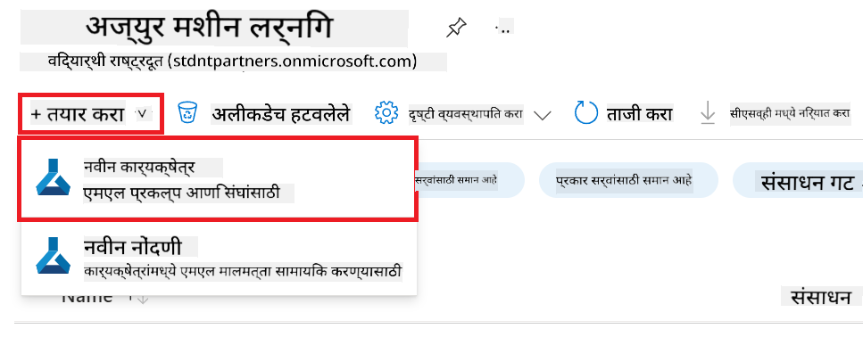

4. पुढील गोष्टी करा:

    - तुमचा Azure **Subscription** निवडा.
    - वापरण्यासाठी **Resource group** निवडा (आवश्यक असल्यास नवीन तयार करा).
    - **Workspace Name** प्रविष्ट करा. हे एक अद्वितीय नाव असावे.
    - वापरण्यासाठी **Region** निवडा.
    - वापरण्यासाठी **Storage account** निवडा (आवश्यक असल्यास नवीन तयार करा).
    - वापरण्यासाठी **Key vault** निवडा (आवश्यक असल्यास नवीन तयार करा).
    - वापरण्यासाठी **Application insights** निवडा (आवश्यक असल्यास नवीन तयार करा).
    - वापरण्यासाठी **Container registry** निवडा (आवश्यक असल्यास नवीन तयार करा).

    

5. **Review + Create** निवडा.

6. **Create** निवडा.

### Azure Subscription मध्ये GPU कोटा विनंती करा

या ट्यूटोरियलमध्ये, तुम्ही Phi-3 मॉडेल फाइन-ट्यून आणि डिप्लॉय करण्यासाठी GPU वापरणार आहात. फाइन-ट्यूनिंगसाठी तुम्ही *Standard_NC24ads_A100_v4* GPU वापराल, ज्यासाठी कोटा विनंती आवश्यक आहे. डिप्लॉयमेंटसाठी *Standard_NC6s_v3* GPU वापराल, ज्यासाठी देखील कोटा विनंती आवश्यक आहे.

> [!NOTE]
>
> फक्त Pay-As-You-Go सबस्क्रिप्शन्स (मानक सबस्क्रिप्शन प्रकार) GPU अलोकेशनसाठी पात्र आहेत; benefit subscriptions सध्या समर्थित नाहीत.
>

1. [Azure ML Studio](https://ml.azure.com/home?wt.mc_id=studentamb_279723) येथे भेट द्या.

1. *Standard NCADSA100v4 Family* कोटा विनंती करण्यासाठी पुढील कार्य करा:

    - डाव्या बाजूच्या टॅबमधून **Quota** निवडा.
    - वापरायची **Virtual machine family** निवडा. उदा., **Standard NCADSA100v4 Family Cluster Dedicated vCPUs**, ज्यात *Standard_NC24ads_A100_v4* GPU आहे.
    - नेव्हिगेशन मेनूमधून **Request quota** निवडा.

        

    - Request quota पृष्ठावर, तुम्हाला हवा असलेला **New cores limit** प्रविष्ट करा. उदा., 24.
    - Request quota पृष्ठावर, GPU कोटा विनंती करण्यासाठी **Submit** निवडा.

1. *Standard NCSv3 Family* कोटा विनंती करण्यासाठी पुढील कार्य करा:

    - डाव्या बाजूच्या टॅबमधून **Quota** निवडा.
    - वापरायची **Virtual machine family** निवडा. उदा., **Standard NCSv3 Family Cluster Dedicated vCPUs**, ज्यात *Standard_NC6s_v3* GPU आहे.
    - नेव्हिगेशन मेनूमधून **Request quota** निवडा.
    - Request quota पृष्ठावर, तुम्हाला हवा असलेला **New cores limit** प्रविष्ट करा. उदा., 24.
    - Request quota पृष्ठावर, GPU कोटा विनंती करण्यासाठी **Submit** निवडा.

### भूमिका नियुक्ती जोडा

तुमचे मॉडेल्स फाइन-ट्यून आणि डिप्लॉय करण्यासाठी, तुम्हाला प्रथम User Assigned Managed Identity (UAI) तयार करावी लागेल आणि तिला योग्य परवानग्या द्याव्या लागतील. ही UAI डिप्लॉयमेंट दरम्यान प्रमाणीकरणासाठी वापरली जाईल.

#### User Assigned Managed Identity(UAI) तयार करा

1. पोर्टल पेजच्या वरच्या **search bar** मध्ये *managed identities* टाइप करा आणि दिसणाऱ्या पर्यायांमधून **Managed Identities** निवडा.

    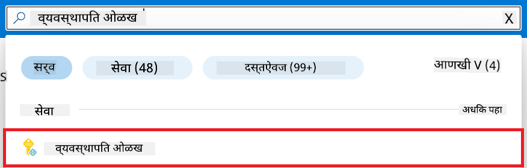

1. **+ Create** निवडा.

    

1. पुढील गोष्टी करा:

    - तुमचा Azure **Subscription** निवडा.
    - वापरायची **Resource group** निवडा (आवश्यक असल्यास नवीन तयार करा).
    - वापरायची **Region** निवडा.
    - **Name** प्रविष्ट करा. हे एक अद्वितीय नाव असावे.

    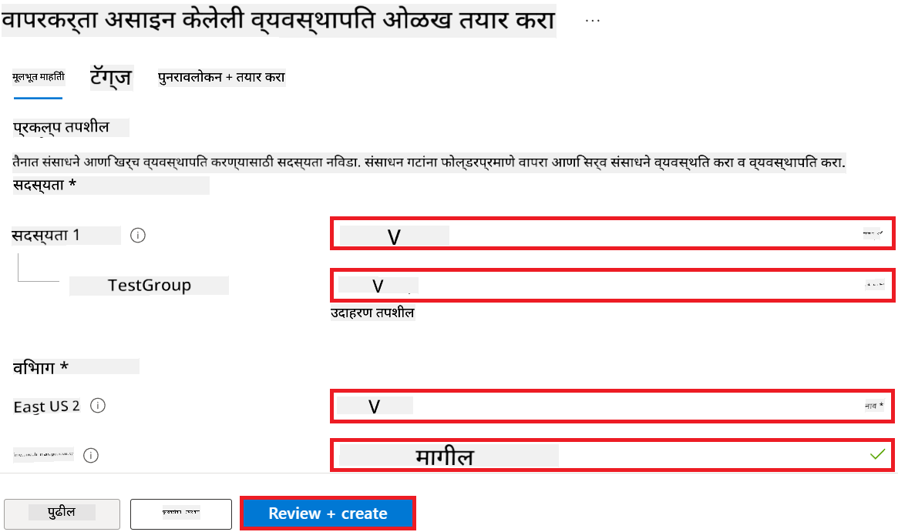

1. **Review + create** निवडा.

1. **+ Create** निवडा.

#### Managed Identity ला Contributor भूमिका नियुक्त करा

1. तुम्ही तयार केलेल्या Managed Identity रिसोर्सवर जा.

1. डाव्या बाजूच्या टॅबमधून **Azure role assignments** निवडा.

1. नेव्हिगेशन मेनूमधून **+Add role assignment** निवडा.

1. Add role assignment पृष्ठावर पुढील गोष्टी करा:
    - **Scope** म्हणून **Resource group** निवडा.
    - तुमचा Azure **Subscription** निवडा.
    - वापरायची **Resource group** निवडा.
    - **Role** म्हणून **Contributor** निवडा.

    

2. **Save** निवडा.

#### Managed Identity ला Storage Blob Data Reader भूमिका नियुक्त करा

1. पोर्टल पेजच्या वरच्या **search bar** मध्ये *storage accounts* टाइप करा आणि दिसणाऱ्या पर्यायांमधून **Storage accounts** निवडा.

    

1. Azure Machine Learning workspace सोबत असलेला storage account निवडा. उदा., *finetunephistorage*.

1. Add role assignment पृष्ठावर जाण्यासाठी पुढील कार्य करा:

    - तयार केलेल्या Azure Storage account वर जा.
    - डाव्या बाजूच्या टॅबमधून **Access Control (IAM)** निवडा.
    - नेव्हिगेशन मेनूमधून **+ Add** निवडा.
    - नेव्हिगेशन मेनूमधून **Add role assignment** निवडा.

    

1. Add role assignment पृष्ठावर पुढील कार्य करा:

    - Role पृष्ठावर, **search bar** मध्ये *Storage Blob Data Reader* टाइप करा आणि दिसणाऱ्या पर्यायांमधून **Storage Blob Data Reader** निवडा.
    - Role पृष्ठावर, **Next** निवडा.
    - Members पृष्ठावर, **Assign access to** म्हणून **Managed identity** निवडा.
    - Members पृष्ठावर, **+ Select members** निवडा.
    - Select managed identities पृष्ठावर, तुमचा Azure **Subscription** निवडा.
    - Select managed identities पृष्ठावर, **Managed identity** म्हणून **Manage Identity** निवडा.
    - Select managed identities पृष्ठावर, तुम्ही तयार केलेली Manage Identity निवडा. उदा., *finetunephi-managedidentity*.
    - Select managed identities पृष्ठावर, **Select** निवडा.

    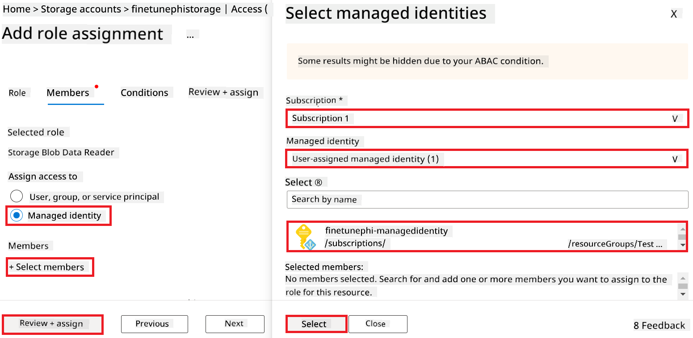

1. **Review + assign** निवडा.

#### Managed Identity ला AcrPull भूमिका नियुक्त करा

1. पोर्टल पेजच्या वरच्या **search bar** मध्ये *container registries* टाइप करा आणि दिसणाऱ्या पर्यायांमधून **Container registries** निवडा.

    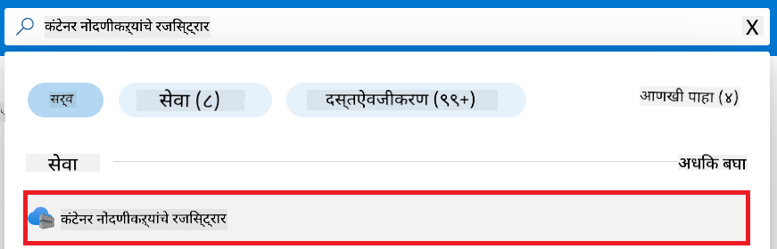

1. Azure Machine Learning workspace सोबत असलेला container registry निवडा. उदा., *finetunephicontainerregistry*

1. Add role assignment पृष्ठावर जाण्यासाठी पुढील कार्य करा:

    - डाव्या बाजूच्या टॅबमधून **Access Control (IAM)** निवडा.
    - नेव्हिगेशन मेनूमधून **+ Add** निवडा.
    - नेव्हिगेशन मेनूमधून **Add role assignment** निवडा.

1. Add role assignment पृष्ठावर पुढील कार्य करा:

    - Role पृष्ठावर, **search bar** मध्ये *AcrPull* टाइप करा आणि दिसणाऱ्या पर्यायांमधून **AcrPull** निवडा.
    - Role पृष्ठावर, **Next** निवडा.
    - Members पृष्ठावर, **Assign access to** म्हणून **Managed identity** निवडा.
    - Members पृष्ठावर, **+ Select members** निवडा.
    - Select managed identities पृष्ठावर, तुमचा Azure **Subscription** निवडा.
    - Select managed identities पृष्ठावर, **Managed identity** म्हणून **Manage Identity** निवडा.
    - Select managed identities पृष्ठावर, तुम्ही तयार केलेली Manage Identity निवडा. उदा., *finetunephi-managedidentity*.
    - Select managed identities पृष्ठावर, **Select** निवडा.
    - **Review + assign** निवडा.

### प्रोजेक्ट सेट अप करा

फाइन-ट्यूनिंगसाठी आवश्यक डेटासेट डाउनलोड करण्यासाठी, तुम्ही लोकल वातावरण सेट अप कराल.

या व्यायामात, तुम्ही:

- कामासाठी एक फोल्डर तयार कराल.
- एक virtual environment तयार कराल.
- आवश्यक पॅकेजेस इंस्टॉल कराल.
- डेटासेट डाउनलोड करण्यासाठी *download_dataset.py* फाइल तयार कराल.

#### कामासाठी फोल्डर तयार करा

1. टर्मिनल विंडो उघडा आणि खालील कमांड वापरून *finetune-phi* नावाचा फोल्डर तयार करा.

    ```console
    mkdir finetune-phi
    ```

2. टर्मिनलमध्ये खालील कमांड वापरून *finetune-phi* फोल्डरमध्ये जा.

    ```console
    cd finetune-phi
    ```

#### Virtual environment तयार करा

1. टर्मिनलमध्ये खालील कमांड वापरून *.venv* नावाचा virtual environment तयार करा.

    ```console
    python -m venv .venv
    ```

2. टर्मिनलमध्ये खालील कमांड वापरून virtual environment सक्रिय करा.

    ```console
    .venv\Scripts\activate.bat
    ```

> [!NOTE]
> जर यशस्वी झाले, तर कमांड प्रॉम्प्टच्या पुढे *(.venv)* दिसेल.

#### आवश्यक पॅकेजेस इंस्टॉल करा

1. टर्मिनलमध्ये खालील कमांड वापरून आवश्यक पॅकेजेस इंस्टॉल करा.

    ```console
    pip install datasets==2.19.1
    ```

#### `download_dataset.py` तयार करा

> [!NOTE]
> पूर्ण फोल्डर संरचना:
>
> ```text
> └── YourUserName
> .    └── finetune-phi
> .        └── download_dataset.py
> ```

1. **Visual Studio Code** उघडा.

1. मेनू बारमधून **File** निवडा.

1. **Open Folder** निवडा.

1. *finetune-phi* फोल्डर निवडा, जो *C:\Users\yourUserName\finetune-phi* या ठिकाणी आहे.

    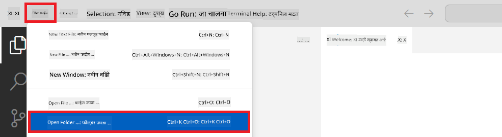

1. Visual Studio Code च्या डाव्या पॅनमध्ये, राईट-क्लिक करा आणि **New File** निवडून *download_dataset.py* नावाची नवीन फाइल तयार करा.

    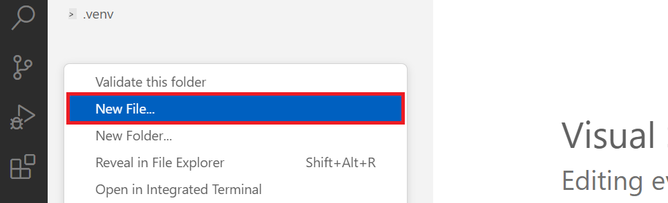

### फाइन-ट्यूनिंगसाठी डेटासेट तयार करा

या व्यायामात, तुम्ही *download_dataset.py* फाइल चालवून *ultrachat_200k* डेटासेट तुमच्या लोकल वातावरणात डाउनलोड कराल. नंतर या डेटासेटचा वापर Azure Machine Learning मध्ये Phi-3 मॉडेल फाइन-ट्यूनिंगसाठी कराल.

या व्यायामात, तुम्ही:

- *download_dataset.py* फाइलमध्ये डेटासेट डाउनलोड करण्यासाठी कोड जोडलात.
- *download_dataset.py* फाइल चालवून डेटासेट लोकल वातावरणात डाउनलोड केलं.

#### *download_dataset.py* वापरून डेटासेट डाउनलोड करा

1. Visual Studio Code मध्ये *download_dataset.py* फाइल उघडा.

1. खालील कोड *download_dataset.py* फाइलमध्ये जोडा.

    ```python
    import json
    import os
    from datasets import load_dataset

    def load_and_split_dataset(dataset_name, config_name, split_ratio):
        """
        Load and split a dataset.
        """
        # Load the dataset with the specified name, configuration, and split ratio
        dataset = load_dataset(dataset_name, config_name, split=split_ratio)
        print(f"Original dataset size: {len(dataset)}")
        
        # Split the dataset into train and test sets (80% train, 20% test)
        split_dataset = dataset.train_test_split(test_size=0.2)
        print(f"Train dataset size: {len(split_dataset['train'])}")
        print(f"Test dataset size: {len(split_dataset['test'])}")
        
        return split_dataset

    def save_dataset_to_jsonl(dataset, filepath):
        """
        Save a dataset to a JSONL file.
        """
        # Create the directory if it does not exist
        os.makedirs(os.path.dirname(filepath), exist_ok=True)
        
        # Open the file in write mode
        with open(filepath, 'w', encoding='utf-8') as f:
            # Iterate over each record in the dataset
            for record in dataset:
                # Dump the record as a JSON object and write it to the file
                json.dump(record, f)
                # Write a newline character to separate records
                f.write('\n')
        
        print(f"Dataset saved to {filepath}")

    def main():
        """
        Main function to load, split, and save the dataset.
        """
        # Load and split the ULTRACHAT_200k dataset with a specific configuration and split ratio
        dataset = load_and_split_dataset("HuggingFaceH4/ultrachat_200k", 'default', 'train_sft[:1%]')
        
        # Extract the train and test datasets from the split
        train_dataset = dataset['train']
        test_dataset = dataset['test']

        # Save the train dataset to a JSONL file
        save_dataset_to_jsonl(train_dataset, "data/train_data.jsonl")
        
        # Save the test dataset to a separate JSONL file
        save_dataset_to_jsonl(test_dataset, "data/test_data.jsonl")

    if __name__ == "__main__":
        main()

    ```

1. टर्मिनलमध्ये खालील कमांड वापरून स्क्रिप्ट चालवा आणि डेटासेट लोकल वातावरणात डाउनलोड करा.

    ```console
    python download_dataset.py
    ```

1. खात्री करा की डेटासेट्स यशस्वीपणे तुमच्या लोकल *finetune-phi/data* डायरेक्टरीमध्ये सेव्ह झाले आहेत.

> [!NOTE
1. भेट द्या [Azure ML Studio](https://ml.azure.com/home?wt.mc_id=studentamb_279723).

1. डाव्या बाजूच्या टॅबमधून **Compute** निवडा.

1. नेव्हिगेशन मेनूमधून **Compute clusters** निवडा.

1. **+ New** निवडा.

    

1. खालील कामे करा:

    - तुम्हाला वापरायचा **Region** निवडा.
    - **Virtual machine tier** ला **Dedicated** निवडा.
    - **Virtual machine type** ला **GPU** निवडा.
    - **Virtual machine size** फिल्टरमध्ये **Select from all options** निवडा.
    - **Virtual machine size** मध्ये **Standard_NC24ads_A100_v4** निवडा.

    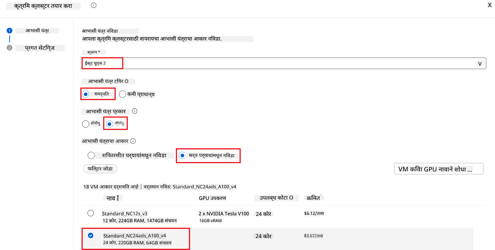

1. **Next** निवडा.

1. खालील कामे करा:

    - **Compute name** टाका. हे एक अद्वितीय नाव असावे.
    - **Minimum number of nodes** ला **0** निवडा.
    - **Maximum number of nodes** ला **1** निवडा.
    - **Idle seconds before scale down** ला **120** निवडा.

    

1. **Create** निवडा.

#### Phi-3 मॉडेलचे फाइन-ट्यून करा

1. भेट द्या [Azure ML Studio](https://ml.azure.com/home?wt.mc_id=studentamb_279723).

1. तुम्ही तयार केलेले Azure Machine Learning workspace निवडा.

    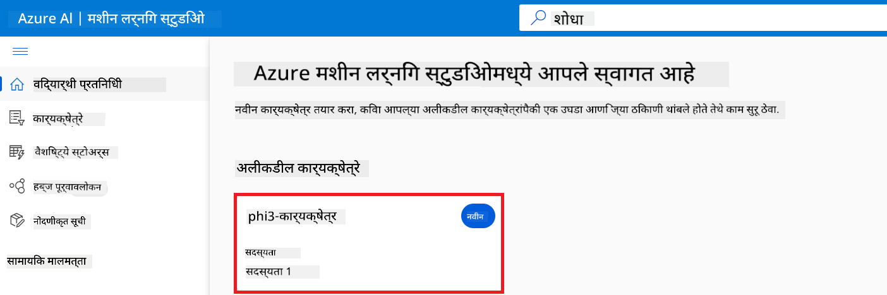

1. खालील कामे करा:

    - डाव्या बाजूच्या टॅबमधून **Model catalog** निवडा.
    - **search bar** मध्ये *phi-3-mini-4k* टाइप करा आणि दिसणाऱ्या पर्यायांमधून **Phi-3-mini-4k-instruct** निवडा.

    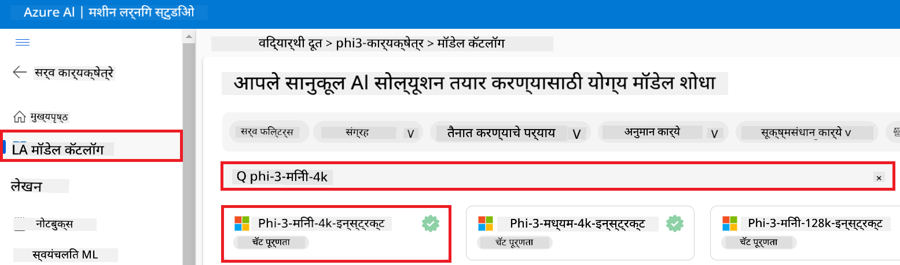

1. नेव्हिगेशन मेनूमधून **Fine-tune** निवडा.

    

1. खालील कामे करा:

    - **Select task type** ला **Chat completion** निवडा.
    - **+ Select data** वर क्लिक करून **Training data** अपलोड करा.
    - Validation data अपलोड प्रकारासाठी **Provide different validation data** निवडा.
    - **+ Select data** वर क्लिक करून **Validation data** अपलोड करा.

    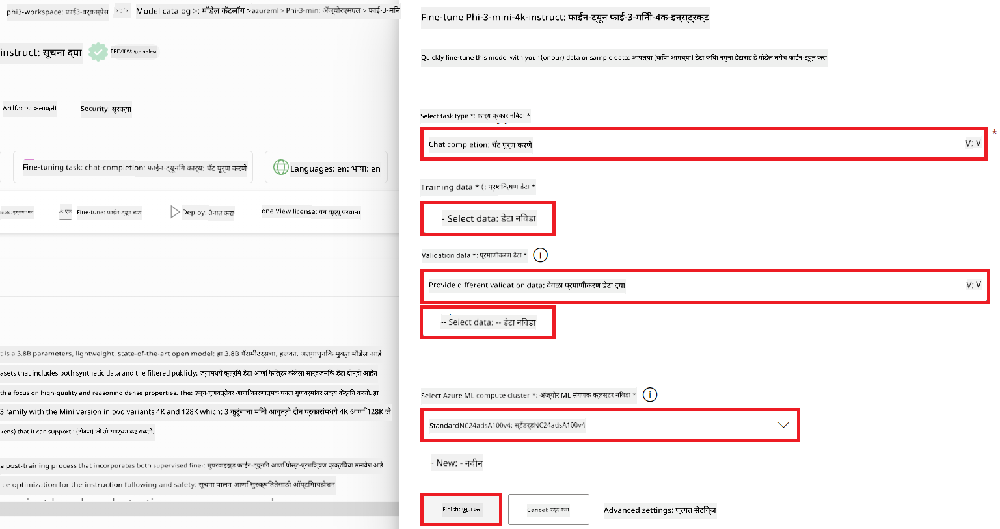

    > [!TIP]
    >
    > तुम्ही **Advanced settings** निवडून **learning_rate** आणि **lr_scheduler_type** सारख्या कॉन्फिगरेशन सानुकूल करू शकता, ज्यामुळे फाइन-ट्यूनिंग प्रक्रिया तुमच्या गरजेनुसार ऑप्टिमाइझ होईल.

1. **Finish** निवडा.

1. या व्यायामात, तुम्ही Azure Machine Learning वापरून Phi-3 मॉडेल यशस्वीरित्या फाइन-ट्यून केले. लक्षात ठेवा की फाइन-ट्यूनिंग प्रक्रियेस थोडा वेळ लागू शकतो. फाइन-ट्यूनिंग जॉब चालवल्यानंतर, त्याच्या पूर्ण होण्याची वाट पाहावी लागेल. तुम्ही Azure Machine Learning Workspace मधील डाव्या बाजूच्या Jobs टॅबमध्ये जॉबची स्थिती पाहू शकता. पुढील भागात, तुम्ही फाइन-ट्यून केलेले मॉडेल डिप्लॉय कराल आणि ते Prompt flow सोबत इंटिग्रेट कराल.

    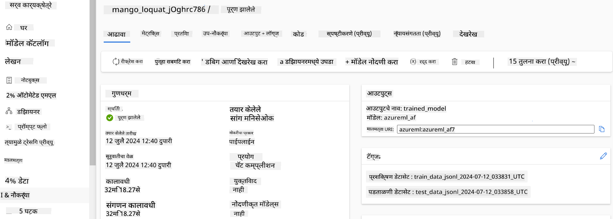

### फाइन-ट्यून केलेले Phi-3 मॉडेल डिप्लॉय करा

फाइन-ट्यून केलेले Phi-3 मॉडेल Prompt flow सोबत इंटिग्रेट करण्यासाठी, तुम्हाला मॉडेल डिप्लॉय करावे लागेल जेणेकरून ते रिअल-टाइम इनफरन्ससाठी उपलब्ध होईल. या प्रक्रियेत मॉडेल नोंदणी, ऑनलाइन एंडपॉइंट तयार करणे आणि मॉडेल डिप्लॉय करणे यांचा समावेश आहे.

या व्यायामात, तुम्ही:

- Azure Machine Learning workspace मध्ये फाइन-ट्यून केलेले मॉडेल नोंदणी कराल.
- ऑनलाइन एंडपॉइंट तयार कराल.
- नोंदणीकृत फाइन-ट्यून Phi-3 मॉडेल डिप्लॉय कराल.

#### फाइन-ट्यून केलेले मॉडेल नोंदणी करा

1. भेट द्या [Azure ML Studio](https://ml.azure.com/home?wt.mc_id=studentamb_279723).

1. तुम्ही तयार केलेले Azure Machine Learning workspace निवडा.

    

1. डाव्या बाजूच्या टॅबमधून **Models** निवडा.
1. **+ Register** निवडा.
1. **From a job output** निवडा.

    

1. तुम्ही तयार केलेला जॉब निवडा.

    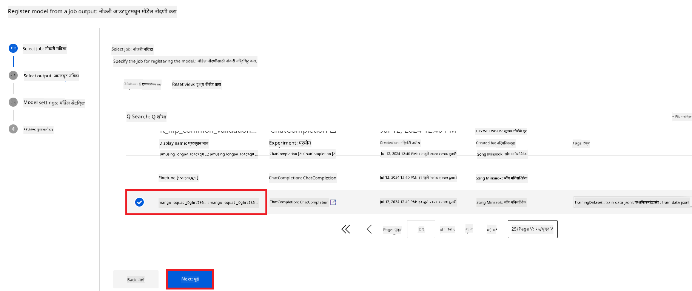

1. **Next** निवडा.

1. **Model type** ला **MLflow** निवडा.

1. खात्री करा की **Job output** निवडलेले आहे; ते आपोआप निवडले जाईल.

    

2. **Next** निवडा.

3. **Register** निवडा.

    

4. तुमचे नोंदणीकृत मॉडेल पाहण्यासाठी डाव्या बाजूच्या टॅबमधील **Models** मेनूवर जा.

    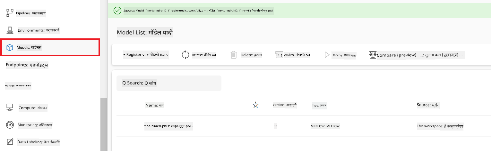

#### फाइन-ट्यून केलेले मॉडेल डिप्लॉय करा

1. तुम्ही तयार केलेल्या Azure Machine Learning workspace मध्ये जा.

1. डाव्या बाजूच्या टॅबमधून **Endpoints** निवडा.

1. नेव्हिगेशन मेनूमधून **Real-time endpoints** निवडा.

    

1. **Create** निवडा.

1. तुम्ही नोंदणीकृत केलेले मॉडेल निवडा.

    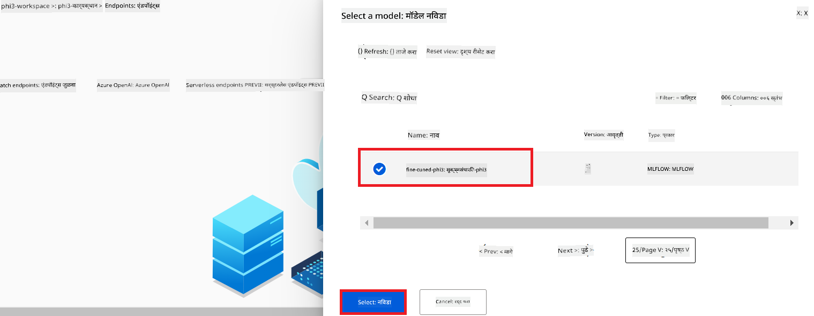

1. **Select** निवडा.

1. खालील कामे करा:

    - **Virtual machine** ला *Standard_NC6s_v3* निवडा.
    - वापरायची **Instance count** निवडा. उदाहरणार्थ, *1*.
    - **Endpoint** ला **New** निवडा जेणेकरून नवीन एंडपॉइंट तयार होईल.
    - **Endpoint name** टाका. हे एक अद्वितीय नाव असावे.
    - **Deployment name** टाका. हे एक अद्वितीय नाव असावे.

    

1. **Deploy** निवडा.

> [!WARNING]
> तुमच्या खात्यावर अतिरिक्त शुल्क लागू नये म्हणून, Azure Machine Learning workspace मधील तयार केलेला एंडपॉइंट नंतर नक्कीच डिलीट करा.
>

#### Azure Machine Learning Workspace मध्ये डिप्लॉयमेंटची स्थिती तपासा

1. तुम्ही तयार केलेल्या Azure Machine Learning workspace मध्ये जा.

1. डाव्या बाजूच्या टॅबमधून **Endpoints** निवडा.

1. तुम्ही तयार केलेला एंडपॉइंट निवडा.

    

1. या पानावर, तुम्ही डिप्लॉयमेंट प्रक्रियेदरम्यान एंडपॉइंट्स व्यवस्थापित करू शकता.

> [!NOTE]
> डिप्लॉयमेंट पूर्ण झाल्यावर, खात्री करा की **Live traffic** **100%** वर सेट आहे. जर तसे नसेल, तर **Update traffic** निवडून ट्रॅफिक सेटिंग्ज समायोजित करा. लक्षात ठेवा की ट्रॅफिक 0% वर असल्यास तुम्ही मॉडेलची चाचणी करू शकत नाही.
>
> 
>

## Scenario 3: Prompt flow सोबत इंटिग्रेट करा आणि Azure AI Foundry मध्ये तुमच्या कस्टम मॉडेलशी संवाद करा

### कस्टम Phi-3 मॉडेल Prompt flow सोबत इंटिग्रेट करा

तुमचे फाइन-ट्यून केलेले मॉडेल यशस्वीपणे डिप्लॉय केल्यानंतर, तुम्ही ते Prompt Flow सोबत इंटिग्रेट करू शकता जेणेकरून रिअल-टाइम ऍप्लिकेशन्समध्ये तुमचा मॉडेल वापरता येईल आणि कस्टम Phi-3 मॉडेलसह विविध संवादात्मक कामे करता येतील.

या व्यायामात, तुम्ही:

- Azure AI Foundry Hub तयार कराल.
- Azure AI Foundry Project तयार कराल.
- Prompt flow तयार कराल.
- फाइन-ट्यून केलेल्या Phi-3 मॉडेलसाठी कस्टम कनेक्शन जोडाल.
- Prompt flow सेटअप कराल जेणेकरून तुम्ही तुमच्या कस्टम Phi-3 मॉडेलशी संवाद साधू शकाल.

> [!NOTE]
> तुम्ही Azure ML Studio वापरून देखील Promptflow सोबत इंटिग्रेट करू शकता. Azure ML Studio मध्ये देखील त्याच इंटिग्रेशन प्रक्रियेचा वापर करता येतो.

#### Azure AI Foundry Hub तयार करा

Project तयार करण्यापूर्वी Hub तयार करणे आवश्यक आहे. Hub हा Resource Group सारखा असतो, ज्यामुळे तुम्ही Azure AI Foundry मध्ये अनेक Projects आयोजित आणि व्यवस्थापित करू शकता.

1. भेट द्या [Azure AI Foundry](https://ai.azure.com/?WT.mc_id=aiml-137032-kinfeylo).

1. डाव्या बाजूच्या टॅबमधून **All hubs** निवडा.

1. नेव्हिगेशन मेनूमधून **+ New hub** निवडा.

    

1. खालील कामे करा:

    - **Hub name** टाका. हे एक अद्वितीय नाव असावे.
    - तुमची Azure **Subscription** निवडा.
    - वापरण्यासाठी **Resource group** निवडा (गरज असल्यास नवीन तयार करा).
    - वापरायचा **Location** निवडा.
    - वापरण्यासाठी **Connect Azure AI Services** निवडा (गरज असल्यास नवीन तयार करा).
    - **Connect Azure AI Search** ला **Skip connecting** निवडा.

    

1. **Next** निवडा.

#### Azure AI Foundry Project तयार करा

1. तुम्ही तयार केलेल्या Hub मध्ये, डाव्या बाजूच्या टॅबमधून **All projects** निवडा.

1. नेव्हिगेशन मेनूमधून **+ New project** निवडा.

    

1. **Project name** टाका. हे एक अद्वितीय नाव असावे.

    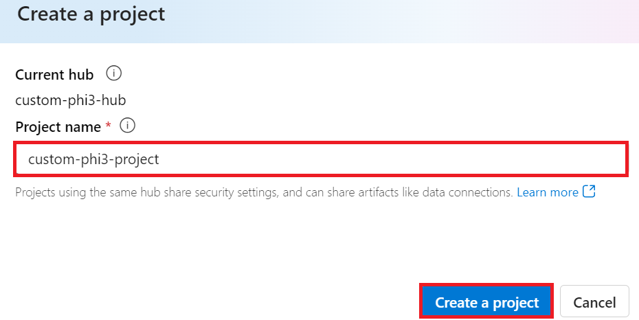

1. **Create a project** निवडा.

#### फाइन-ट्यून केलेल्या Phi-3 मॉडेलसाठी कस्टम कनेक्शन जोडा

तुमचा कस्टम Phi-3 मॉडेल Prompt flow सोबत इंटिग्रेट करण्यासाठी, तुम्हाला मॉडेलचा एंडपॉइंट आणि की कस्टम कनेक्शनमध्ये जतन करावी लागेल. यामुळे Prompt flow मध्ये तुमच्या कस्टम मॉडेलपर्यंत प्रवेश सुनिश्चित होतो.

#### फाइन-ट्यून केलेल्या Phi-3 मॉडेलसाठी api key आणि endpoint uri सेट करा

1. भेट द्या [Azure ML Studio](https://ml.azure.com/home?WT.mc_id=aiml-137032-kinfeylo).

1. तुम्ही तयार केलेल्या Azure Machine Learning workspace मध्ये जा.

1. डाव्या बाजूच्या टॅबमधून **Endpoints** निवडा.

    

1. तुम्ही तयार केलेला एंडपॉइंट निवडा.

    

1. नेव्हिगेशन मेनूमधून **Consume** निवडा.

1. तुमचा **REST endpoint** आणि **Primary key** कॉपी करा.


#### कस्टम कनेक्शन जोडा

1. [Azure AI Foundry](https://ai.azure.com/?WT.mc_id=aiml-137032-kinfeylo) ला भेट द्या.

1. तुम्ही तयार केलेल्या Azure AI Foundry प्रोजेक्टमध्ये जा.

1. तयार केलेल्या प्रोजेक्टमध्ये, डाव्या बाजूच्या टॅबमधून **Settings** निवडा.

1. **+ New connection** निवडा.

    

1. नेव्हिगेशन मेनूमधून **Custom keys** निवडा.

    

1. खालील कार्य करा:

    - **+ Add key value pairs** निवडा.
    - key name साठी **endpoint** टाका आणि Azure ML Studio मधून कॉपी केलेला endpoint value फील्डमध्ये पेस्ट करा.
    - पुन्हा **+ Add key value pairs** निवडा.
    - key name साठी **key** टाका आणि Azure ML Studio मधून कॉपी केलेला key value फील्डमध्ये पेस्ट करा.
    - keys जोडल्यानंतर, key लपवण्यासाठी **is secret** निवडा.

    

1. **Add connection** निवडा.

#### Prompt flow तयार करा

तुम्ही Azure AI Foundry मध्ये कस्टम कनेक्शन जोडले आहे. आता, खालील पायऱ्या वापरून Prompt flow तयार करूया. नंतर, तुम्ही हा Prompt flow कस्टम कनेक्शनशी जोडाल जेणेकरून fine-tuned मॉडेल Prompt flow मध्ये वापरता येईल.

1. तुम्ही तयार केलेल्या Azure AI Foundry प्रोजेक्टमध्ये जा.

1. डाव्या बाजूच्या टॅबमधून **Prompt flow** निवडा.

1. नेव्हिगेशन मेनूमधून **+ Create** निवडा.

    

1. नेव्हिगेशन मेनूमधून **Chat flow** निवडा.

    

1. वापरण्यासाठी **Folder name** टाका.

    

2. **Create** निवडा.

#### Prompt flow सेट करा तुमच्या कस्टम Phi-3 मॉडेलसह चॅट करण्यासाठी

तुम्हाला fine-tuned Phi-3 मॉडेल Prompt flow मध्ये इंटिग्रेट करायचे आहे. पण, उपलब्ध Prompt flow यासाठी तयार केलेले नाही. त्यामुळे, कस्टम मॉडेल इंटिग्रेशनसाठी Prompt flow पुन्हा डिझाइन करणे आवश्यक आहे.

1. Prompt flow मध्ये खालील कामे करा, जेणेकरून विद्यमान flow पुन्हा तयार करता येईल:

    - **Raw file mode** निवडा.
    - *flow.dag.yml* फाईलमधील सर्व कोड डिलीट करा.
    - खालील कोड *flow.dag.yml* फाईलमध्ये जोडा.

        ```yml
        inputs:
          input_data:
            type: string
            default: "Who founded Microsoft?"

        outputs:
          answer:
            type: string
            reference: ${integrate_with_promptflow.output}

        nodes:
        - name: integrate_with_promptflow
          type: python
          source:
            type: code
            path: integrate_with_promptflow.py
          inputs:
            input_data: ${inputs.input_data}
        ```

    - **Save** निवडा.

    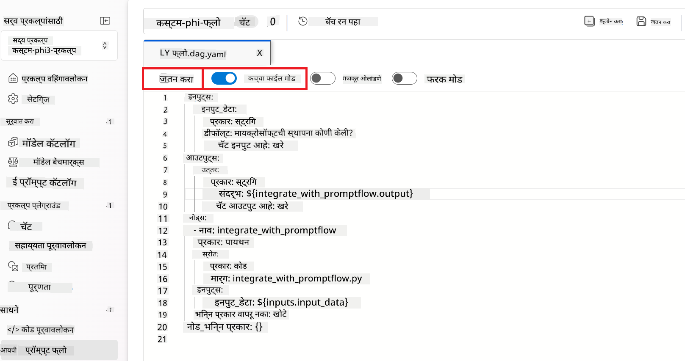

1. कस्टम Phi-3 मॉडेल Prompt flow मध्ये वापरण्यासाठी *integrate_with_promptflow.py* फाईलमध्ये खालील कोड जोडा.

    ```python
    import logging
    import requests
    from promptflow import tool
    from promptflow.connections import CustomConnection

    # Logging setup
    logging.basicConfig(
        format="%(asctime)s - %(levelname)s - %(name)s - %(message)s",
        datefmt="%Y-%m-%d %H:%M:%S",
        level=logging.DEBUG
    )
    logger = logging.getLogger(__name__)

    def query_phi3_model(input_data: str, connection: CustomConnection) -> str:
        """
        Send a request to the Phi-3 model endpoint with the given input data using Custom Connection.
        """

        # "connection" is the name of the Custom Connection, "endpoint", "key" are the keys in the Custom Connection
        endpoint_url = connection.endpoint
        api_key = connection.key

        headers = {
            "Content-Type": "application/json",
            "Authorization": f"Bearer {api_key}"
        }
        data = {
            "input_data": {
                "input_string": [
                    {"role": "user", "content": input_data}
                ],
                "parameters": {
                    "temperature": 0.7,
                    "max_new_tokens": 128
                }
            }
        }
        try:
            response = requests.post(endpoint_url, json=data, headers=headers)
            response.raise_for_status()
            
            # Log the full JSON response
            logger.debug(f"Full JSON response: {response.json()}")

            result = response.json()["output"]
            logger.info("Successfully received response from Azure ML Endpoint.")
            return result
        except requests.exceptions.RequestException as e:
            logger.error(f"Error querying Azure ML Endpoint: {e}")
            raise

    @tool
    def my_python_tool(input_data: str, connection: CustomConnection) -> str:
        """
        Tool function to process input data and query the Phi-3 model.
        """
        return query_phi3_model(input_data, connection)

    ```

    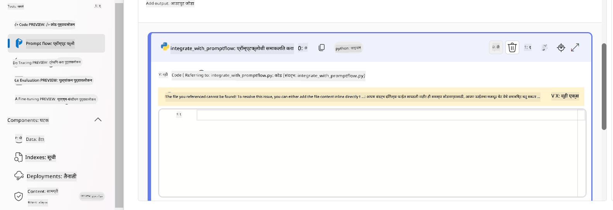

> [!NOTE]
> Azure AI Foundry मध्ये Prompt flow वापरण्याबाबत अधिक तपशीलवार माहिती साठी, तुम्ही [Prompt flow in Azure AI Foundry](https://learn.microsoft.com/azure/ai-studio/how-to/prompt-flow) पाहू शकता.

1. तुमच्या मॉडेलसह चॅट करण्यासाठी **Chat input**, **Chat output** निवडा.

    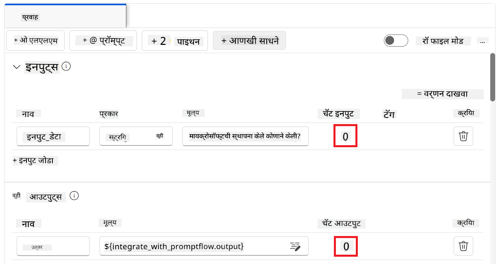

1. आता तुम्ही तुमच्या कस्टम Phi-3 मॉडेलशी चॅट करण्यास तयार आहात. पुढील व्यायामात, तुम्हाला Prompt flow सुरू करणे आणि fine-tuned Phi-3 मॉडेलशी कसे चॅट करायचे ते शिकवले जाईल.

> [!NOTE]
>
> पुन्हा तयार केलेला flow खालील चित्रासारखा दिसायला हवा:
>
> 
>

### तुमच्या कस्टम Phi-3 मॉडेलशी चॅट करा

आता जेव्हा तुम्ही तुमचे कस्टम Phi-3 मॉडेल fine-tune आणि Prompt flow मध्ये इंटिग्रेट केले आहे, तेव्हा तुम्ही त्याच्याशी संवाद साधण्यास तयार आहात. हा व्यायाम तुम्हाला Prompt flow वापरून मॉडेलशी चॅट सुरू करण्याची प्रक्रिया दाखवेल. या पायऱ्या फॉलो करून, तुम्ही तुमच्या fine-tuned Phi-3 मॉडेलच्या विविध कार्यांसाठी आणि संवादांसाठी पूर्णपणे वापर करू शकाल.

- Prompt flow वापरून तुमच्या कस्टम Phi-3 मॉडेलशी चॅट करा.

#### Prompt flow सुरू करा

1. Prompt flow सुरू करण्यासाठी **Start compute sessions** निवडा.

    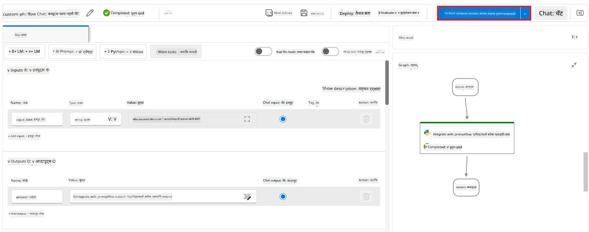

1. पॅरामीटर्स रिन्यू करण्यासाठी **Validate and parse input** निवडा.

    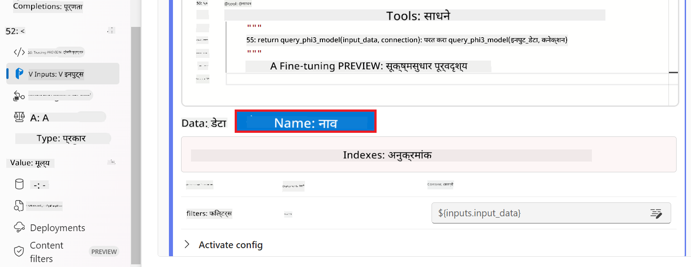

1. तुम्ही तयार केलेल्या कस्टम कनेक्शनचा **connection** चा **Value** निवडा. उदाहरणार्थ, *connection*.

    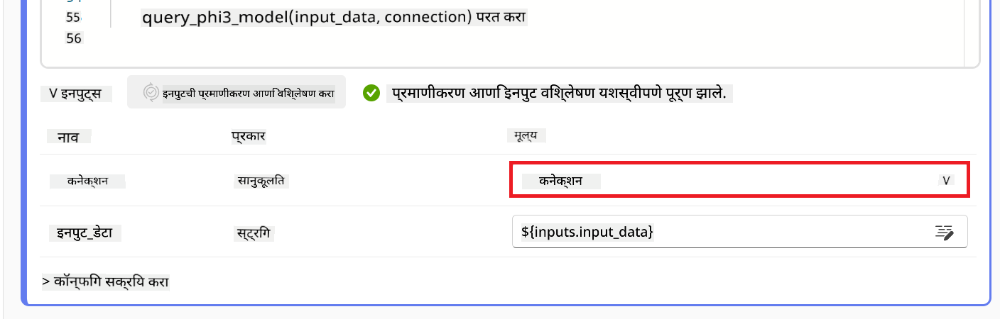

#### तुमच्या कस्टम मॉडेलशी चॅट करा

1. **Chat** निवडा.

    

1. खालीलप्रमाणे परिणाम दिसतील: आता तुम्ही तुमच्या कस्टम Phi-3 मॉडेलशी चॅट करू शकता. fine-tuning मध्ये वापरलेल्या डेटावर आधारित प्रश्न विचारण्याचा सल्ला दिला जातो.

    

**अस्वीकरण**:  
हा दस्तऐवज AI भाषांतर सेवा [Co-op Translator](https://github.com/Azure/co-op-translator) वापरून भाषांतरित केला आहे. आम्ही अचूकतेसाठी प्रयत्न करतो, तरी कृपया लक्षात ठेवा की स्वयंचलित भाषांतरांमध्ये चुका किंवा अचूकतेची कमतरता असू शकते. मूळ दस्तऐवज त्याच्या स्थानिक भाषेत अधिकृत स्रोत मानला पाहिजे. महत्त्वाच्या माहितीसाठी व्यावसायिक मानवी भाषांतर करण्याची शिफारस केली जाते. या भाषांतराच्या वापरामुळे उद्भवलेल्या कोणत्याही गैरसमजुती किंवा चुकीच्या अर्थलागी आम्ही जबाबदार नाही.