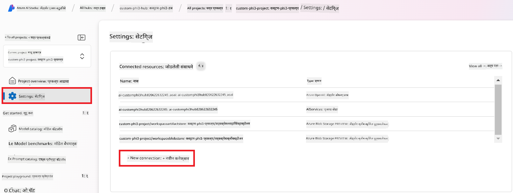

<!--
CO_OP_TRANSLATOR_METADATA:
{
  "original_hash": "ecbd9179a21edbaafaf114d47f09f3e3",
  "translation_date": "2025-07-17T01:17:18+00:00",
  "source_file": "md/02.Application/01.TextAndChat/Phi3/E2E_Phi-3-FineTuning_PromptFlow_Integration_AIFoundry.md",
  "language_code": "mr"
}
-->
# Azure AI Foundry मध्ये Prompt flow सह कस्टम Phi-3 मॉडेल्सचे फाइन-ट्यूनिंग आणि एकत्रीकरण

हा एंड-टू-एंड (E2E) नमुना Microsoft Tech Community मधील "[Fine-Tune and Integrate Custom Phi-3 Models with Prompt Flow in Azure AI Foundry](https://techcommunity.microsoft.com/t5/educator-developer-blog/fine-tune-and-integrate-custom-phi-3-models-with-prompt-flow-in/ba-p/4191726?WT.mc_id=aiml-137032-kinfeylo)" मार्गदर्शकावर आधारित आहे. यात Azure AI Foundry मध्ये Prompt flow सह कस्टम Phi-3 मॉडेल्सचे फाइन-ट्यूनिंग, तैनाती आणि एकत्रीकरण कसे करायचे हे समजावले आहे.  
स्थानिकरित्या कोड चालवण्यावर आधारित "[Fine-Tune and Integrate Custom Phi-3 Models with Prompt Flow](./E2E_Phi-3-FineTuning_PromptFlow_Integration.md)" या E2E नमुन्यापेक्षा वेगळे, हा ट्यूटोरियल पूर्णपणे Azure AI / ML Studio मध्ये तुमचे मॉडेल फाइन-ट्यून आणि एकत्रित करण्यावर लक्ष केंद्रित करतो.

## आढावा

या E2E नमुन्यात, तुम्ही Phi-3 मॉडेलचे फाइन-ट्यूनिंग कसे करायचे आणि Azure AI Foundry मध्ये Prompt flow सह ते कसे एकत्रित करायचे हे शिकाल. Azure AI / ML Studio चा वापर करून, तुम्ही कस्टम AI मॉडेल्सची तैनाती आणि वापर करण्यासाठी एक कार्यप्रवाह तयार कराल. हा E2E नमुना तीन परिस्थितींमध्ये विभागलेला आहे:

**परिस्थिती 1: Azure संसाधने सेट करा आणि फाइन-ट्यूनिंगसाठी तयारी करा**

**परिस्थिती 2: Phi-3 मॉडेलचे फाइन-ट्यूनिंग करा आणि Azure Machine Learning Studio मध्ये तैनात करा**

**परिस्थिती 3: Prompt flow सह एकत्रित करा आणि Azure AI Foundry मध्ये तुमच्या कस्टम मॉडेलशी संवाद साधा**

खाली या E2E नमुन्याचा आढावा दिला आहे.


### अनुक्रमणिका

1. **[परिस्थिती 1: Azure संसाधने सेट करा आणि फाइन-ट्यूनिंगसाठी तयारी करा](../../../../../../md/02.Application/01.TextAndChat/Phi3)**
    - [Azure Machine Learning Workspace तयार करा](../../../../../../md/02.Application/01.TextAndChat/Phi3)
    - [Azure Subscription मध्ये GPU कोटा विनंती करा](../../../../../../md/02.Application/01.TextAndChat/Phi3)
    - [भूमिका नियुक्ती जोडा](../../../../../../md/02.Application/01.TextAndChat/Phi3)
    - [प्रकल्प सेट करा](../../../../../../md/02.Application/01.TextAndChat/Phi3)
    - [फाइन-ट्यूनिंगसाठी डेटासेट तयार करा](../../../../../../md/02.Application/01.TextAndChat/Phi3)

1. **[परिस्थिती 2: Phi-3 मॉडेलचे फाइन-ट्यूनिंग करा आणि Azure Machine Learning Studio मध्ये तैनात करा](../../../../../../md/02.Application/01.TextAndChat/Phi3)**
    - [Phi-3 मॉडेलचे फाइन-ट्यूनिंग करा](../../../../../../md/02.Application/01.TextAndChat/Phi3)
    - [फाइन-ट्यून केलेले Phi-3 मॉडेल तैनात करा](../../../../../../md/02.Application/01.TextAndChat/Phi3)

1. **[परिस्थिती 3: Prompt flow सह एकत्रित करा आणि Azure AI Foundry मध्ये तुमच्या कस्टम मॉडेलशी संवाद साधा](../../../../../../md/02.Application/01.TextAndChat/Phi3)**
    - [कस्टम Phi-3 मॉडेल Prompt flow सह एकत्रित करा](../../../../../../md/02.Application/01.TextAndChat/Phi3)
    - [तुमच्या कस्टम Phi-3 मॉडेलशी संवाद साधा](../../../../../../md/02.Application/01.TextAndChat/Phi3)

## परिस्थिती 1: Azure संसाधने सेट करा आणि फाइन-ट्यूनिंगसाठी तयारी करा

### Azure Machine Learning Workspace तयार करा

1. पोर्टल पृष्ठाच्या वरच्या **शोध पट्टीत** *azure machine learning* टाइप करा आणि दिसणाऱ्या पर्यायांमधून **Azure Machine Learning** निवडा.

    

2. नेव्हिगेशन मेनूमधून **+ Create** निवडा.

3. नेव्हिगेशन मेनूमधून **New workspace** निवडा.

    

4. खालील कामे करा:

    - तुमचा Azure **Subscription** निवडा.
    - वापरण्यासाठी **Resource group** निवडा (गरज असल्यास नवीन तयार करा).
    - **Workspace Name** टाका. हे एक अद्वितीय नाव असावे.
    - वापरायचा **Region** निवडा.
    - वापरण्यासाठी **Storage account** निवडा (गरज असल्यास नवीन तयार करा).
    - वापरण्यासाठी **Key vault** निवडा (गरज असल्यास नवीन तयार करा).
    - वापरण्यासाठी **Application insights** निवडा (गरज असल्यास नवीन तयार करा).
    - वापरण्यासाठी **Container registry** निवडा (गरज असल्यास नवीन तयार करा).

    

5. **Review + Create** निवडा.

6. **Create** निवडा.

### Azure Subscription मध्ये GPU कोटा विनंती करा

या ट्यूटोरियलमध्ये, तुम्ही GPUs वापरून Phi-3 मॉडेलचे फाइन-ट्यूनिंग आणि तैनाती कशी करायची ते शिकाल. फाइन-ट्यूनिंगसाठी, तुम्ही *Standard_NC24ads_A100_v4* GPU वापराल, ज्यासाठी कोटा विनंती आवश्यक आहे. तैनातीसाठी, तुम्ही *Standard_NC6s_v3* GPU वापराल, ज्यासाठी देखील कोटा विनंती आवश्यक आहे.

> [!NOTE]
>
> फक्त Pay-As-You-Go सबस्क्रिप्शन्स (सामान्य सबस्क्रिप्शन प्रकार) GPU वाटपासाठी पात्र आहेत; लाभ सबस्क्रिप्शन्स सध्या समर्थित नाहीत.
>

1. [Azure ML Studio](https://ml.azure.com/home?wt.mc_id=studentamb_279723) येथे जा.

1. *Standard NCADSA100v4 Family* कोटा विनंती करण्यासाठी खालील कामे करा:

    - डाव्या बाजूच्या टॅबमधून **Quota** निवडा.
    - वापरण्यासाठी **Virtual machine family** निवडा. उदाहरणार्थ, *Standard NCADSA100v4 Family Cluster Dedicated vCPUs*, ज्यामध्ये *Standard_NC24ads_A100_v4* GPU आहे.
    - नेव्हिगेशन मेनूमधून **Request quota** निवडा.

        

    - Request quota पृष्ठावर, तुम्हाला हवे असलेले **New cores limit** टाका. उदाहरणार्थ, 24.
    - Request quota पृष्ठावर, GPU कोटा विनंती करण्यासाठी **Submit** निवडा.

1. *Standard NCSv3 Family* कोटा विनंती करण्यासाठी खालील कामे करा:

    - डाव्या बाजूच्या टॅबमधून **Quota** निवडा.
    - वापरण्यासाठी **Virtual machine family** निवडा. उदाहरणार्थ, *Standard NCSv3 Family Cluster Dedicated vCPUs*, ज्यामध्ये *Standard_NC6s_v3* GPU आहे.
    - नेव्हिगेशन मेनूमधून **Request quota** निवडा.
    - Request quota पृष्ठावर, तुम्हाला हवे असलेले **New cores limit** टाका. उदाहरणार्थ, 24.
    - Request quota पृष्ठावर, GPU कोटा विनंती करण्यासाठी **Submit** निवडा.

### भूमिका नियुक्ती जोडा

तुमचे मॉडेल्स फाइन-ट्यून आणि तैनात करण्यासाठी, तुम्हाला प्रथम User Assigned Managed Identity (UAI) तयार करावी लागेल आणि त्याला योग्य परवानग्या द्याव्या लागतील. ही UAI तैनाती दरम्यान प्रमाणीकरणासाठी वापरली जाईल.

#### User Assigned Managed Identity (UAI) तयार करा

1. पोर्टल पृष्ठाच्या वरच्या **शोध पट्टीत** *managed identities* टाइप करा आणि दिसणाऱ्या पर्यायांमधून **Managed Identities** निवडा.

    

1. **+ Create** निवडा.

    

1. खालील कामे करा:

    - तुमचा Azure **Subscription** निवडा.
    - वापरण्यासाठी **Resource group** निवडा (गरज असल्यास नवीन तयार करा).
    - वापरायचा **Region** निवडा.
    - **Name** टाका. हे एक अद्वितीय नाव असावे.

    

1. **Review + create** निवडा.

1. **+ Create** निवडा.

#### Managed Identity ला Contributor भूमिका नियुक्त करा

1. तुम्ही तयार केलेल्या Managed Identity संसाधनावर जा.

1. डाव्या बाजूच्या टॅबमधून **Azure role assignments** निवडा.

1. नेव्हिगेशन मेनूमधून **+Add role assignment** निवडा.

1. Add role assignment पृष्ठावर खालील कामे करा:
    - **Scope** म्हणून **Resource group** निवडा.
    - तुमचा Azure **Subscription** निवडा.
    - वापरण्यासाठी **Resource group** निवडा.
    - **Role** म्हणून **Contributor** निवडा.

    

2. **Save** निवडा.

#### Managed Identity ला Storage Blob Data Reader भूमिका नियुक्त करा

1. पोर्टल पृष्ठाच्या वरच्या **शोध पट्टीत** *storage accounts* टाइप करा आणि दिसणाऱ्या पर्यायांमधून **Storage accounts** निवडा.

    

1. तुम्ही तयार केलेल्या Azure Machine Learning workspace शी संबंधित स्टोरेज अकाउंट निवडा. उदाहरणार्थ, *finetunephistorage*.

1. Add role assignment पृष्ठावर जाण्यासाठी खालील कामे करा:

    - तुम्ही तयार केलेल्या Azure Storage अकाउंटवर जा.
    - डाव्या बाजूच्या टॅबमधून **Access Control (IAM)** निवडा.
    - नेव्हिगेशन मेनूमधून **+ Add** निवडा.
    - नेव्हिगेशन मेनूमधून **Add role assignment** निवडा.

    

1. Add role assignment पृष्ठावर खालील कामे करा:

    - Role पृष्ठावर, **search bar** मध्ये *Storage Blob Data Reader* टाइप करा आणि दिसणाऱ्या पर्यायांमधून **Storage Blob Data Reader** निवडा.
    - Role पृष्ठावर, **Next** निवडा.
    - Members पृष्ठावर, **Assign access to** म्हणून **Managed identity** निवडा.
    - Members पृष्ठावर, **+ Select members** निवडा.
    - Select managed identities पृष्ठावर, तुमचा Azure **Subscription** निवडा.
    - Select managed identities पृष्ठावर, **Managed identity** म्हणून **Manage Identity** निवडा.
    - Select managed identities पृष्ठावर, तुम्ही तयार केलेली Manage Identity निवडा. उदाहरणार्थ, *finetunephi-managedidentity*.
    - Select managed identities पृष्ठावर, **Select** निवडा.

    

1. **Review + assign** निवडा.

#### Managed Identity ला AcrPull भूमिका नियुक्त करा

1. पोर्टल पृष्ठाच्या वरच्या **शोध पट्टीत** *container registries* टाइप करा आणि दिसणाऱ्या पर्यायांमधून **Container registries** निवडा.

    

1. Azure Machine Learning workspace शी संबंधित कंटेनर रजिस्ट्री निवडा. उदाहरणार्थ, *finetunephicontainerregistry*

1. Add role assignment पृष्ठावर जाण्यासाठी खालील कामे करा:

    - डाव्या बाजूच्या टॅबमधून **Access Control (IAM)** निवडा.
    - नेव्हिगेशन मेनूमधून **+ Add** निवडा.
    - नेव्हिगेशन मेनूमधून **Add role assignment** निवडा.

1. Add role assignment पृष्ठावर खालील कामे करा:

    - Role पृष्ठावर, **search bar** मध्ये *AcrPull* टाइप करा आणि दिसणाऱ्या पर्यायांमधून **AcrPull** निवडा.
    - Role पृष्ठावर, **Next** निवडा.
    - Members पृष्ठावर, **Assign access to** म्हणून **Managed identity** निवडा.
    - Members पृष्ठावर, **+ Select members** निवडा.
    - Select managed identities पृष्ठावर, तुमचा Azure **Subscription** निवडा.
    - Select managed identities पृष्ठावर, **Managed identity** म्हणून **Manage Identity** निवडा.
    - Select managed identities पृष्ठावर, तुम्ही तयार केलेली Manage Identity निवडा. उदाहरणार्थ, *finetunephi-managedidentity*.
    - Select managed identities पृष्ठावर, **Select** निवडा.
    - **Review + assign** निवडा.

### प्रकल्प सेट करा

फाइन-ट्यूनिंगसाठी आवश्यक डेटासेट डाउनलोड करण्यासाठी, तुम्ही स्थानिक वातावरण सेट कराल.

या व्यायामात, तुम्ही

- कामासाठी एक फोल्डर तयार कराल.
- एक वर्चुअल वातावरण तयार कराल.
- आवश्यक पॅकेजेस इन्स्टॉल कराल.
- डेटासेट डाउनलोड करण्यासाठी *download_dataset.py* फाइल तयार कराल.

#### कामासाठी फोल्डर तयार करा

1. टर्मिनल विंडो उघडा आणि डीफॉल्ट पथात *finetune-phi* नावाचा फोल्डर तयार करण्यासाठी खालील आदेश टाइप करा.

    ```console
    mkdir finetune-phi
    ```

2. टर्मिनलमध्ये खालील आदेश टाइप करून तुम्ही तयार केलेल्या *finetune-phi* फोल्डरमध्ये जा.
#### व्हर्च्युअल एन्व्हायर्नमेंट तयार करा

1. तुमच्या टर्मिनलमध्ये खालील कमांड टाइप करा ज्यामुळे *.venv* नावाचा व्हर्च्युअल एन्व्हायर्नमेंट तयार होईल.

    ```console
    python -m venv .venv
    ```

2. व्हर्च्युअल एन्व्हायर्नमेंट सक्रिय करण्यासाठी टर्मिनलमध्ये खालील कमांड टाइप करा.

    ```console
    .venv\Scripts\activate.bat
    ```


> [!NOTE]
> जर ते यशस्वी झाले, तर कमांड प्रॉम्प्टच्या आधी *(.venv)* दिसेल.

#### आवश्यक पॅकेजेस इन्स्टॉल करा

1. आवश्यक पॅकेजेस इन्स्टॉल करण्यासाठी टर्मिनलमध्ये खालील कमांड टाइप करा.

    ```console
    pip install datasets==2.19.1
    ```

#### `download_dataset.py` तयार करा

> [!NOTE]
> पूर्ण फोल्डर स्ट्रक्चर:
>
> ```text
> └── YourUserName
> .    └── finetune-phi
> .        └── download_dataset.py
> ```

1. **Visual Studio Code** उघडा.

1. मेनू बारमधून **File** निवडा.

1. **Open Folder** निवडा.

1. *finetune-phi* फोल्डर निवडा जो तुम्ही तयार केला आहे, जो *C:\Users\yourUserName\finetune-phi* येथे आहे.

    

1. Visual Studio Code च्या डाव्या पॅनमध्ये, राईट-क्लिक करा आणि **New File** निवडा, नंतर *download_dataset.py* नावाचा नवीन फाइल तयार करा.

    

### फाइन-ट्यूनिंगसाठी डेटासेट तयार करा

या व्यायामात, तुम्ही *download_dataset.py* फाइल चालवून *ultrachat_200k* डेटासेट्स तुमच्या स्थानिक एन्व्हायर्नमेंटमध्ये डाउनलोड कराल. नंतर तुम्ही या डेटासेटचा वापर करून Azure Machine Learning मध्ये Phi-3 मॉडेल फाइन-ट्यून कराल.

या व्यायामात, तुम्ही:

- *download_dataset.py* फाइलमध्ये कोड जोडाल ज्यामुळे डेटासेट डाउनलोड होईल.
- *download_dataset.py* फाइल चालवून डेटासेट स्थानिक एन्व्हायर्नमेंटमध्ये डाउनलोड कराल.

#### *download_dataset.py* वापरून तुमचा डेटासेट डाउनलोड करा

1. Visual Studio Code मध्ये *download_dataset.py* फाइल उघडा.

1. *download_dataset.py* फाइलमध्ये खालील कोड जोडा.

    ```python
    import json
    import os
    from datasets import load_dataset

    def load_and_split_dataset(dataset_name, config_name, split_ratio):
        """
        Load and split a dataset.
        """
        # Load the dataset with the specified name, configuration, and split ratio
        dataset = load_dataset(dataset_name, config_name, split=split_ratio)
        print(f"Original dataset size: {len(dataset)}")
        
        # Split the dataset into train and test sets (80% train, 20% test)
        split_dataset = dataset.train_test_split(test_size=0.2)
        print(f"Train dataset size: {len(split_dataset['train'])}")
        print(f"Test dataset size: {len(split_dataset['test'])}")
        
        return split_dataset

    def save_dataset_to_jsonl(dataset, filepath):
        """
        Save a dataset to a JSONL file.
        """
        # Create the directory if it does not exist
        os.makedirs(os.path.dirname(filepath), exist_ok=True)
        
        # Open the file in write mode
        with open(filepath, 'w', encoding='utf-8') as f:
            # Iterate over each record in the dataset
            for record in dataset:
                # Dump the record as a JSON object and write it to the file
                json.dump(record, f)
                # Write a newline character to separate records
                f.write('\n')
        
        print(f"Dataset saved to {filepath}")

    def main():
        """
        Main function to load, split, and save the dataset.
        """
        # Load and split the ULTRACHAT_200k dataset with a specific configuration and split ratio
        dataset = load_and_split_dataset("HuggingFaceH4/ultrachat_200k", 'default', 'train_sft[:1%]')
        
        # Extract the train and test datasets from the split
        train_dataset = dataset['train']
        test_dataset = dataset['test']

        # Save the train dataset to a JSONL file
        save_dataset_to_jsonl(train_dataset, "data/train_data.jsonl")
        
        # Save the test dataset to a separate JSONL file
        save_dataset_to_jsonl(test_dataset, "data/test_data.jsonl")

    if __name__ == "__main__":
        main()

    ```

1. स्क्रिप्ट चालवण्यासाठी आणि डेटासेट स्थानिक एन्व्हायर्नमेंटमध्ये डाउनलोड करण्यासाठी टर्मिनलमध्ये खालील कमांड टाइप करा.

    ```console
    python download_dataset.py
    ```

1. खात्री करा की डेटासेट्स यशस्वीपणे तुमच्या स्थानिक *finetune-phi/data* डिरेक्टरीमध्ये सेव्ह झाले आहेत.

> [!NOTE]
>
> #### डेटासेट आकार आणि फाइन-ट्यूनिंग वेळ याबाबत नोंद
>
> या ट्युटोरियलमध्ये, तुम्ही डेटासेटचा फक्त 1% (`split='train[:1%]'`) वापरता. यामुळे डेटाचा आकार लक्षणीयरीत्या कमी होतो, ज्यामुळे अपलोड आणि फाइन-ट्यूनिंग दोन्ही प्रक्रिया जलद होतात. तुम्ही प्रशिक्षण वेळ आणि मॉडेल कार्यक्षमतेमध्ये योग्य संतुलन साधण्यासाठी हा टक्केवारी बदलू शकता. डेटासेटचा लहान भाग वापरल्यामुळे फाइन-ट्यूनिंगसाठी लागणारा वेळ कमी होतो, ज्यामुळे ट्युटोरियलसाठी प्रक्रिया अधिक सोपी होते.

## परिस्थिती 2: Phi-3 मॉडेल फाइन-ट्यून करा आणि Azure Machine Learning Studio मध्ये डिप्लॉय करा

### Phi-3 मॉडेल फाइन-ट्यून करा

या व्यायामात, तुम्ही Azure Machine Learning Studio मध्ये Phi-3 मॉडेल फाइन-ट्यून कराल.

या व्यायामात, तुम्ही:

- फाइन-ट्यूनिंगसाठी कंप्युटर क्लस्टर तयार कराल.
- Azure Machine Learning Studio मध्ये Phi-3 मॉडेल फाइन-ट्यून कराल.

#### फाइन-ट्यूनिंगसाठी कंप्युटर क्लस्टर तयार करा

1. [Azure ML Studio](https://ml.azure.com/home?wt.mc_id=studentamb_279723) ला भेट द्या.

1. डाव्या बाजूच्या टॅबमधून **Compute** निवडा.

1. नेव्हिगेशन मेनूमधून **Compute clusters** निवडा.

1. **+ New** निवडा.

    

1. खालील कामे करा:

    - तुम्हाला हवा असलेला **Region** निवडा.
    - **Virtual machine tier** म्हणून **Dedicated** निवडा.
    - **Virtual machine type** म्हणून **GPU** निवडा.
    - **Virtual machine size** फिल्टरमध्ये **Select from all options** निवडा.
    - **Virtual machine size** म्हणून **Standard_NC24ads_A100_v4** निवडा.

    

1. **Next** निवडा.

1. खालील कामे करा:

    - **Compute name** टाका. हे एक अद्वितीय नाव असावे.
    - **Minimum number of nodes** म्हणून **0** निवडा.
    - **Maximum number of nodes** म्हणून **1** निवडा.
    - **Idle seconds before scale down** म्हणून **120** निवडा.

    

1. **Create** निवडा.

#### Phi-3 मॉडेल फाइन-ट्यून करा

1. [Azure ML Studio](https://ml.azure.com/home?wt.mc_id=studentamb_279723) ला भेट द्या.

1. तुम्ही तयार केलेले Azure Machine Learning वर्कस्पेस निवडा.

    

1. खालील कामे करा:

    - डाव्या बाजूच्या टॅबमधून **Model catalog** निवडा.
    - **search bar** मध्ये *phi-3-mini-4k* टाइप करा आणि दिसणाऱ्या पर्यायांमधून **Phi-3-mini-4k-instruct** निवडा.

    

1. नेव्हिगेशन मेनूमधून **Fine-tune** निवडा.

    

1. खालील कामे करा:

    - **Select task type** म्हणून **Chat completion** निवडा.
    - **+ Select data** वर क्लिक करून **Training data** अपलोड करा.
    - Validation data अपलोड प्रकार म्हणून **Provide different validation data** निवडा.
    - **+ Select data** वर क्लिक करून **Validation data** अपलोड करा.

    

    > [!TIP]
    >
    > तुम्ही **Advanced settings** निवडून **learning_rate** आणि **lr_scheduler_type** सारख्या कॉन्फिगरेशन सानुकूलित करू शकता, ज्यामुळे फाइन-ट्यूनिंग प्रक्रिया तुमच्या गरजेनुसार अधिक प्रभावी होईल.

1. **Finish** निवडा.

1. या व्यायामात, तुम्ही Azure Machine Learning वापरून यशस्वीपणे Phi-3 मॉडेल फाइन-ट्यून केले. कृपया लक्षात ठेवा की फाइन-ट्यूनिंग प्रक्रियेस थोडा वेळ लागू शकतो. फाइन-ट्यूनिंग जॉब चालवल्यानंतर, त्याच्या पूर्ण होण्याची वाट पाहावी लागेल. तुम्ही Azure Machine Learning वर्कस्पेसच्या डाव्या बाजूच्या Jobs टॅबमध्ये जाऊन फाइन-ट्यूनिंग जॉबची स्थिती पाहू शकता. पुढील सिरीजमध्ये, तुम्ही फाइन-ट्यून केलेले मॉडेल डिप्लॉय कराल आणि ते Prompt flow सोबत इंटिग्रेट कराल.

    

### फाइन-ट्यून केलेले Phi-3 मॉडेल डिप्लॉय करा

फाइन-ट्यून केलेले Phi-3 मॉडेल Prompt flow सोबत इंटिग्रेट करण्यासाठी, तुम्हाला मॉडेल डिप्लॉय करावे लागेल जेणेकरून ते रिअल-टाइम इन्फरन्ससाठी उपलब्ध होईल. या प्रक्रियेत मॉडेल नोंदणी, ऑनलाइन एंडपॉइंट तयार करणे आणि मॉडेल डिप्लॉय करणे यांचा समावेश आहे.

या व्यायामात, तुम्ही:

- Azure Machine Learning वर्कस्पेसमध्ये फाइन-ट्यून केलेले मॉडेल नोंदणी कराल.
- ऑनलाइन एंडपॉइंट तयार कराल.
- नोंदणीकृत फाइन-ट्यून केलेले Phi-3 मॉडेल डिप्लॉय कराल.

#### फाइन-ट्यून केलेले मॉडेल नोंदणी करा

1. [Azure ML Studio](https://ml.azure.com/home?wt.mc_id=studentamb_279723) ला भेट द्या.

1. तुम्ही तयार केलेले Azure Machine Learning वर्कस्पेस निवडा.

    

1. डाव्या बाजूच्या टॅबमधून **Models** निवडा.
1. **+ Register** निवडा.
1. **From a job output** निवडा.

    

1. तुम्ही तयार केलेला जॉब निवडा.

    

1. **Next** निवडा.

1. **Model type** म्हणून **MLflow** निवडा.

1. खात्री करा की **Job output** निवडलेले आहे; हे आपोआप निवडले जाईल.

    

2. **Next** निवडा.

3. **Register** निवडा.

    

4. तुम्ही तुमचे नोंदणीकृत मॉडेल डाव्या बाजूच्या टॅबमधील **Models** मेनूमध्ये पाहू शकता.

    

#### फाइन-ट्यून केलेले मॉडेल डिप्लॉय करा

1. तुम्ही तयार केलेल्या Azure Machine Learning वर्कस्पेसमध्ये जा.

1. डाव्या बाजूच्या टॅबमधून **Endpoints** निवडा.

1. नेव्हिगेशन मेनूमधून **Real-time endpoints** निवडा.

    

1. **Create** निवडा.

1. तुम्ही नोंदणी केलेले मॉडेल निवडा.

    

1. **Select** निवडा.

1. खालील कामे करा:

    - **Virtual machine** म्हणून *Standard_NC6s_v3* निवडा.
    - तुम्हाला हवा असलेला **Instance count** निवडा. उदाहरणार्थ, *1*.
    - **Endpoint** म्हणून **New** निवडा जेणेकरून नवीन एंडपॉइंट तयार होईल.
    - **Endpoint name** टाका. हे एक अद्वितीय नाव असावे.
    - **Deployment name** टाका. हे एक अद्वितीय नाव असावे.

    

1. **Deploy** निवडा.

> [!WARNING]
> तुमच्या खात्यावर अतिरिक्त शुल्क टाळण्यासाठी, Azure Machine Learning वर्कस्पेसमधील तयार केलेला एंडपॉइंट नंतर नक्कीच डिलीट करा.
>

#### Azure Machine Learning वर्कस्पेसमध्ये डिप्लॉयमेंट स्थिती तपासा

1. तुम्ही तयार केलेल्या Azure Machine Learning वर्कस्पेसमध्ये जा.

1. डाव्या बाजूच्या टॅबमधून **Endpoints** निवडा.

1. तुम्ही तयार केलेला एंडपॉइंट निवडा.

    

1. या पृष्ठावर, तुम्ही डिप्लॉयमेंट प्रक्रियेदरम्यान एंडपॉइंट्स व्यवस्थापित करू शकता.

> [!NOTE]
> एकदा डिप्लॉयमेंट पूर्ण झाल्यावर, खात्री करा की **Live traffic** **100%** वर सेट आहे. जर तसे नसेल, तर **Update traffic** निवडून ट्रॅफिक सेटिंग्ज समायोजित करा. लक्षात ठेवा की ट्रॅफिक 0% वर असल्यास तुम्ही मॉडेलची चाचणी करू शकत नाही.
>
> 
>

## परिस्थिती 3: Prompt flow सोबत इंटिग्रेट करा आणि Azure AI Foundry मध्ये तुमच्या कस्टम मॉडेलशी चॅट करा

### कस्टम Phi-3 मॉडेल Prompt flow सोबत इंटिग्रेट करा

तुमचे फाइन-ट्यून केलेले मॉडेल यशस्वीपणे डिप्लॉय केल्यानंतर, तुम्ही ते Prompt Flow सोबत इंटिग्रेट करू शकता जेणेकरून तुमचा मॉडेल रिअल-टाइम अॅप्लिकेशन्समध्ये वापरता येईल, आणि तुमच्या कस्टम Phi-3 मॉडेलसह विविध इंटरऐक्टिव टास्क करता येतील.

या व्यायामात, तुम्ही:

- Azure AI Foundry Hub तयार कराल.
- Azure AI Foundry प्रोजेक्ट तयार कराल.
- Prompt flow तयार कराल.
- फाइन-ट्यून केलेल्या Phi-3 मॉडेलसाठी कस्टम कनेक्शन जोडा.
- Prompt flow सेटअप करून तुमच्या कस्टम Phi-3 मॉडेलशी चॅट करा.
> [!NOTE]
> तुम्ही Azure ML Studio वापरून Promptflow सह देखील एकत्रित करू शकता. त्याच एकत्रीकरण प्रक्रियेचा वापर Azure ML Studio मध्येही करता येतो.
#### Azure AI Foundry Hub तयार करा

प्रोजेक्ट तयार करण्यापूर्वी तुम्हाला एक Hub तयार करावा लागेल. Hub हे Resource Group प्रमाणे काम करते, ज्यामुळे तुम्ही Azure AI Foundry मध्ये अनेक प्रोजेक्ट्सचे आयोजन आणि व्यवस्थापन करू शकता.

1. [Azure AI Foundry](https://ai.azure.com/?WT.mc_id=aiml-137032-kinfeylo) येथे भेट द्या.

1. डाव्या बाजूच्या टॅबमधून **All hubs** निवडा.

1. नेव्हिगेशन मेनूमधून **+ New hub** निवडा.

    

1. खालील कामे करा:

    - **Hub name** टाका. हा एक अद्वितीय नाव असावा.
    - तुमची Azure **Subscription** निवडा.
    - वापरण्यासाठी **Resource group** निवडा (गरज असल्यास नवीन तयार करा).
    - वापरायची **Location** निवडा.
    - वापरण्यासाठी **Connect Azure AI Services** निवडा (गरज असल्यास नवीन तयार करा).
    - **Connect Azure AI Search** साठी **Skip connecting** निवडा.

    

1. **Next** निवडा.

#### Azure AI Foundry प्रोजेक्ट तयार करा

1. तुम्ही तयार केलेल्या Hub मध्ये, डाव्या बाजूच्या टॅबमधून **All projects** निवडा.

1. नेव्हिगेशन मेनूमधून **+ New project** निवडा.

    

1. **Project name** टाका. हा एक अद्वितीय नाव असावा.

    

1. **Create a project** निवडा.

#### fine-tuned Phi-3 मॉडेलसाठी कस्टम कनेक्शन जोडा

तुमच्या कस्टम Phi-3 मॉडेलला Prompt flow मध्ये एकत्रित करण्यासाठी, तुम्हाला मॉडेलचा endpoint आणि key कस्टम कनेक्शनमध्ये जतन करावा लागेल. या सेटअपमुळे Prompt flow मध्ये तुमच्या कस्टम Phi-3 मॉडेलचा वापर शक्य होतो.

#### fine-tuned Phi-3 मॉडेलचा api key आणि endpoint uri सेट करा

1. [Azure ML Studio](https://ml.azure.com/home?WT.mc_id=aiml-137032-kinfeylo) येथे भेट द्या.

1. तुम्ही तयार केलेल्या Azure Machine learning workspace मध्ये जा.

1. डाव्या बाजूच्या टॅबमधून **Endpoints** निवडा.

    

1. तुम्ही तयार केलेला endpoint निवडा.

    

1. नेव्हिगेशन मेनूमधून **Consume** निवडा.

1. तुमचा **REST endpoint** आणि **Primary key** कॉपी करा.

    

#### कस्टम कनेक्शन जोडा

1. [Azure AI Foundry](https://ai.azure.com/?WT.mc_id=aiml-137032-kinfeylo) येथे भेट द्या.

1. तुम्ही तयार केलेल्या Azure AI Foundry प्रोजेक्टमध्ये जा.

1. तयार केलेल्या प्रोजेक्टमध्ये, डाव्या बाजूच्या टॅबमधून **Settings** निवडा.

1. **+ New connection** निवडा.

    

1. नेव्हिगेशन मेनूमधून **Custom keys** निवडा.

    

1. खालील कामे करा:

    - **+ Add key value pairs** निवडा.
    - key name साठी **endpoint** टाका आणि Azure ML Studio मधून कॉपी केलेला endpoint value field मध्ये पेस्ट करा.
    - पुन्हा **+ Add key value pairs** निवडा.
    - key name साठी **key** टाका आणि Azure ML Studio मधून कॉपी केलेला key value field मध्ये पेस्ट करा.
    - keys जोडल्यावर, key उघड होऊ नये म्हणून **is secret** निवडा.

    

1. **Add connection** निवडा.

#### Prompt flow तयार करा

तुम्ही Azure AI Foundry मध्ये कस्टम कनेक्शन जोडले आहे. आता खालील पायऱ्यांद्वारे Prompt flow तयार करूया. नंतर, तुम्ही या Prompt flow ला कस्टम कनेक्शनशी जोडाल, ज्यामुळे तुम्ही fine-tuned मॉडेल Prompt flow मध्ये वापरू शकता.

1. तुम्ही तयार केलेल्या Azure AI Foundry प्रोजेक्टमध्ये जा.

1. डाव्या बाजूच्या टॅबमधून **Prompt flow** निवडा.

1. नेव्हिगेशन मेनूमधून **+ Create** निवडा.

    

1. नेव्हिगेशन मेनूमधून **Chat flow** निवडा.

    

1. वापरण्यासाठी **Folder name** टाका.

    

2. **Create** निवडा.

#### तुमच्या कस्टम Phi-3 मॉडेलसह Prompt flow सेट करा

तुम्हाला fine-tuned Phi-3 मॉडेल Prompt flow मध्ये एकत्रित करायचे आहे. मात्र, सध्याचा उपलब्ध Prompt flow यासाठी तयार केलेला नाही. त्यामुळे, तुम्हाला Prompt flow पुन्हा डिझाइन करावा लागेल जेणेकरून कस्टम मॉडेलची एकत्रिती शक्य होईल.

1. Prompt flow मध्ये, विद्यमान flow पुन्हा तयार करण्यासाठी खालील कामे करा:

    - **Raw file mode** निवडा.
    - *flow.dag.yml* फाईलमधील सर्व विद्यमान कोड हटवा.
    - खालील कोड *flow.dag.yml* फाईलमध्ये जोडा.

        ```yml
        inputs:
          input_data:
            type: string
            default: "Who founded Microsoft?"

        outputs:
          answer:
            type: string
            reference: ${integrate_with_promptflow.output}

        nodes:
        - name: integrate_with_promptflow
          type: python
          source:
            type: code
            path: integrate_with_promptflow.py
          inputs:
            input_data: ${inputs.input_data}
        ```

    - **Save** निवडा.

    

1. Prompt flow मध्ये कस्टम Phi-3 मॉडेल वापरण्यासाठी *integrate_with_promptflow.py* फाईलमध्ये खालील कोड जोडा.

    ```python
    import logging
    import requests
    from promptflow import tool
    from promptflow.connections import CustomConnection

    # Logging setup
    logging.basicConfig(
        format="%(asctime)s - %(levelname)s - %(name)s - %(message)s",
        datefmt="%Y-%m-%d %H:%M:%S",
        level=logging.DEBUG
    )
    logger = logging.getLogger(__name__)

    def query_phi3_model(input_data: str, connection: CustomConnection) -> str:
        """
        Send a request to the Phi-3 model endpoint with the given input data using Custom Connection.
        """

        # "connection" is the name of the Custom Connection, "endpoint", "key" are the keys in the Custom Connection
        endpoint_url = connection.endpoint
        api_key = connection.key

        headers = {
            "Content-Type": "application/json",
            "Authorization": f"Bearer {api_key}"
        }
        data = {
            "input_data": {
                "input_string": [
                    {"role": "user", "content": input_data}
                ],
                "parameters": {
                    "temperature": 0.7,
                    "max_new_tokens": 128
                }
            }
        }
        try:
            response = requests.post(endpoint_url, json=data, headers=headers)
            response.raise_for_status()
            
            # Log the full JSON response
            logger.debug(f"Full JSON response: {response.json()}")

            result = response.json()["output"]
            logger.info("Successfully received response from Azure ML Endpoint.")
            return result
        except requests.exceptions.RequestException as e:
            logger.error(f"Error querying Azure ML Endpoint: {e}")
            raise

    @tool
    def my_python_tool(input_data: str, connection: CustomConnection) -> str:
        """
        Tool function to process input data and query the Phi-3 model.
        """
        return query_phi3_model(input_data, connection)

    ```

    

> [!NOTE]
> Azure AI Foundry मध्ये Prompt flow वापरण्याबाबत अधिक सविस्तर माहितीकरिता, तुम्ही [Prompt flow in Azure AI Foundry](https://learn.microsoft.com/azure/ai-studio/how-to/prompt-flow) पाहू शकता.

1. तुमच्या मॉडेलशी चॅट करण्यासाठी **Chat input**, **Chat output** निवडा.

    

1. आता तुम्ही तुमच्या कस्टम Phi-3 मॉडेलशी चॅट करण्यास तयार आहात. पुढील व्यायामात, तुम्हाला Prompt flow कसे सुरू करायचे आणि fine-tuned Phi-3 मॉडेलशी कसे चॅट करायचे हे शिकवले जाईल.

> [!NOTE]
>
> पुन्हा तयार केलेला flow खालील चित्रासारखा दिसेल:
>
> 
>

### तुमच्या कस्टम Phi-3 मॉडेलशी चॅट करा

आता तुम्ही तुमचे कस्टम Phi-3 मॉडेल fine-tune करून Prompt flow मध्ये एकत्रित केले आहे, त्यामुळे तुम्ही त्याच्याशी संवाद साधण्यास तयार आहात. हा व्यायाम तुम्हाला Prompt flow वापरून मॉडेलशी संवाद कसा सुरू करायचा हे मार्गदर्शन करेल. या पायऱ्यांचे अनुसरण करून, तुम्ही तुमच्या fine-tuned Phi-3 मॉडेलच्या विविध कार्यांसाठी आणि संभाषणांसाठी पूर्णपणे वापर करू शकाल.

- Prompt flow वापरून तुमच्या कस्टम Phi-3 मॉडेलशी चॅट करा.

#### Prompt flow सुरू करा

1. Prompt flow सुरू करण्यासाठी **Start compute sessions** निवडा.

    

1. पॅरामीटर्स नूतनीकरणासाठी **Validate and parse input** निवडा.

    

1. तुम्ही तयार केलेल्या कस्टम कनेक्शनचा **connection** चा **Value** निवडा. उदाहरणार्थ, *connection*.

    

#### तुमच्या कस्टम मॉडेलशी चॅट करा

1. **Chat** निवडा.

    

1. खालीलप्रमाणे निकाल दिसतील: आता तुम्ही तुमच्या कस्टम Phi-3 मॉडेलशी चॅट करू शकता. fine-tuning साठी वापरलेल्या डेटावर आधारित प्रश्न विचारणे शिफारसीय आहे.

    

**अस्वीकरण**:  
हा दस्तऐवज AI अनुवाद सेवा [Co-op Translator](https://github.com/Azure/co-op-translator) वापरून अनुवादित केला आहे. आम्ही अचूकतेसाठी प्रयत्नशील असलो तरी, कृपया लक्षात घ्या की स्वयंचलित अनुवादांमध्ये चुका किंवा अचूकतेची कमतरता असू शकते. मूळ दस्तऐवज त्याच्या स्थानिक भाषेत अधिकृत स्रोत मानला जावा. महत्त्वाच्या माहितीसाठी व्यावसायिक मानवी अनुवाद करण्याची शिफारस केली जाते. या अनुवादाच्या वापरामुळे उद्भवणाऱ्या कोणत्याही गैरसमजुती किंवा चुकीच्या अर्थलागी आम्ही जबाबदार नाही.