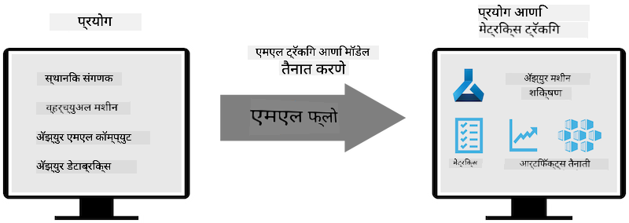
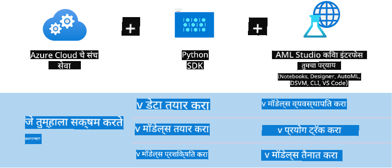

<!--
CO_OP_TRANSLATOR_METADATA:
{
  "original_hash": "f61c383bbf0c3dac97e43f833c258731",
  "translation_date": "2025-05-09T18:35:31+00:00",
  "source_file": "md/02.Application/01.TextAndChat/Phi3/E2E_Phi-3-MLflow.md",
  "language_code": "mr"
}
-->
# MLflow

[MLflow](https://mlflow.org/) हा एक ओपन-सोर्स प्लॅटफॉर्म आहे जो मशीन लर्निंगच्या संपूर्ण जीवनचक्राचे व्यवस्थापन करण्यासाठी डिझाइन केला आहे.


MLFlow चा वापर ML जीवनचक्राचे व्यवस्थापन करण्यासाठी केला जातो, ज्यात प्रयोग, पुनरुत्पादकता, तैनाती आणि केंद्रीय मॉडेल रजिस्ट्रेशनचा समावेश आहे. सध्या ML flow चार घटक प्रदान करतो.

- **MLflow Tracking:** प्रयोग, कोड, डेटा कॉन्फिग आणि निकाल नोंदवणे आणि क्वेरी करणे.
- **MLflow Projects:** डेटा सायन्स कोड अशा स्वरूपात पॅकेज करणे जे कोणत्याही प्लॅटफॉर्मवर रन पुनरुत्पादित करू शकते.
- **Mlflow Models:** मशीन लर्निंग मॉडेल्स विविध सर्व्हिंग वातावरणात तैनात करणे.
- **Model Registry:** मॉडेल्स एका केंद्रीय रेपॉझिटरीमध्ये संग्रहित, टॅगिंग आणि व्यवस्थापन करणे.

हे प्रयोग ट्रॅक करण्याची, कोड पुनरुत्पादक रनमध्ये पॅकेज करण्याची, तसेच मॉडेल्स शेअर आणि तैनात करण्याची क्षमता समाविष्ट करते. MLFlow Databricks मध्ये समाकलित आहे आणि विविध ML लायब्ररींसाठी समर्थन देते, त्यामुळे ते लायब्ररी-स्वतंत्र आहे. हे कोणत्याही मशीन लर्निंग लायब्ररीसह आणि कोणत्याही प्रोग्रामिंग भाषेत वापरता येते, कारण ते सोयीसाठी REST API आणि CLI प्रदान करते.



MLFlow चे मुख्य वैशिष्ट्ये:

- **Experiment Tracking:** पॅरामीटर्स आणि निकाल नोंदवणे आणि तुलना करणे.
- **Model Management:** विविध सर्व्हिंग आणि इन्फरन्स प्लॅटफॉर्मवर मॉडेल्स तैनात करणे.
- **Model Registry:** MLflow मॉडेल्सच्या जीवनचक्राचे सहकार्याने व्यवस्थापन, ज्यात व्हर्जनिंग आणि टॅगिंग समाविष्ट आहे.
- **Projects:** ML कोड शेअरिंग किंवा प्रॉडक्शनसाठी पॅकेज करणे.

MLFlow MLOps लूपला देखील समर्थन देते, ज्यात डेटा तयार करणे, मॉडेल नोंदणी आणि व्यवस्थापन, मॉडेल्स पॅकेजिंग, सेवा तैनाती आणि मॉनिटरिंग यांचा समावेश आहे. हे प्रोटोटाइपपासून प्रॉडक्शन वर्कफ्लोपर्यंत जाण्याची प्रक्रिया सुलभ करण्याचा प्रयत्न करते, विशेषतः क्लाउड आणि एज वातावरणात.

## E2E Scenario - Phi-3 साठी wrapper तयार करणे आणि MLFlow मॉडेल म्हणून वापरणे

या E2E उदाहरणात आपण Phi-3 लहान भाषा मॉडेल (SLM) च्या आजूबाजूला wrapper तयार करण्यासाठी दोन वेगवेगळ्या पद्धती दाखवू आणि नंतर ते MLFlow मॉडेल म्हणून स्थानिक किंवा क्लाउडमध्ये (उदा. Azure Machine Learning वर्कस्पेसमध्ये) चालवू.



| प्रोजेक्ट | वर्णन | स्थान |
| ------------ | ----------- | -------- |
| Transformer Pipeline | जर तुम्हाला HuggingFace मॉडेल MLFlow च्या experimental transformers flavour सह वापरायचे असेल तर Transformer Pipeline wrapper तयार करण्याचा सोपा पर्याय आहे. | [**TransformerPipeline.ipynb**](../../../../../../code/06.E2E/E2E_Phi-3-MLflow_TransformerPipeline.ipynb) |
| Custom Python Wrapper | लेखनाच्या वेळी, transformer pipeline ने ONNX फॉरमॅटमधील HuggingFace मॉडेलसाठी MLFlow wrapper जनरेशनला समर्थन दिले नव्हते, अगदी experimental optimum Python पॅकेजसहही. अशा परिस्थितीत, तुम्ही MLFlow मोडसाठी तुमचा स्वतःचा Python wrapper तयार करू शकता. | [**CustomPythonWrapper.ipynb**](../../../../../../code/06.E2E/E2E_Phi-3-MLflow_CustomPythonWrapper.ipynb) |

## प्रोजेक्ट: Transformer Pipeline

1. तुम्हाला MLFlow आणि HuggingFace कडून संबंधित Python पॅकेजेसची गरज भासेल:

    ``` Python
    import mlflow
    import transformers
    ```

2. नंतर, HuggingFace रजिस्ट्रिमध्ये लक्षित Phi-3 मॉडेलचा संदर्भ देऊन transformer pipeline सुरू करा. _Phi-3-mini-4k-instruct_ च्या मॉडेल कार्डनुसार, त्याचे टास्क “Text Generation” प्रकाराचे आहे:

    ``` Python
    pipeline = transformers.pipeline(
        task = "text-generation",
        model = "microsoft/Phi-3-mini-4k-instruct"
    )
    ```

3. आता तुम्ही Phi-3 मॉडेलचा transformer pipeline MLFlow फॉरमॅटमध्ये सेव्ह करू शकता आणि अतिरिक्त तपशील देऊ शकता जसे की लक्ष्य आर्टिफॅक्ट्स पथ, विशिष्ट मॉडेल कॉन्फिगरेशन सेटिंग्ज आणि इन्फरन्स API प्रकार:

    ``` Python
    model_info = mlflow.transformers.log_model(
        transformers_model = pipeline,
        artifact_path = "phi3-mlflow-model",
        model_config = model_config,
        task = "llm/v1/chat"
    )
    ```

## प्रोजेक्ट: Custom Python Wrapper

1. येथे आपण Microsoft चा [ONNX Runtime generate() API](https://github.com/microsoft/onnxruntime-genai) वापरू शकतो ONNX मॉडेलच्या इन्फरन्ससाठी आणि टोकन्स एनकोडिंग / डीकोडिंगसाठी. तुमच्या लक्षित कॉम्प्युटसाठी _onnxruntime_genai_ पॅकेज निवडा, खालील उदाहरण CPU वर लक्ष केंद्रित करते:

    ``` Python
    import mlflow
    from mlflow.models import infer_signature
    import onnxruntime_genai as og
    ```

1. आमच्या कस्टम क्लासमध्ये दोन मेथड्स आहेत: _load_context()_ जी Phi-3 Mini 4K Instruct चा **ONNX मॉडेल**, **generator parameters** आणि **tokenizer** इनिशियलाइझ करते; आणि _predict()_ जी दिलेल्या प्रॉम्प्टसाठी आउटपुट टोकन्स तयार करते:

    ``` Python
    class Phi3Model(mlflow.pyfunc.PythonModel):
        def load_context(self, context):
            # Retrieving model from the artifacts
            model_path = context.artifacts["phi3-mini-onnx"]
            model_options = {
                 "max_length": 300,
                 "temperature": 0.2,         
            }
        
            # Defining the model
            self.phi3_model = og.Model(model_path)
            self.params = og.GeneratorParams(self.phi3_model)
            self.params.set_search_options(**model_options)
            
            # Defining the tokenizer
            self.tokenizer = og.Tokenizer(self.phi3_model)
    
        def predict(self, context, model_input):
            # Retrieving prompt from the input
            prompt = model_input["prompt"][0]
            self.params.input_ids = self.tokenizer.encode(prompt)
    
            # Generating the model's response
            response = self.phi3_model.generate(self.params)
    
            return self.tokenizer.decode(response[0][len(self.params.input_ids):])
    ```

1. आता तुम्ही _mlflow.pyfunc.log_model()_ फंक्शन वापरून Phi-3 मॉडेलसाठी कस्टम Python wrapper (pickle फॉरमॅटमध्ये) जनरेट करू शकता, मूळ ONNX मॉडेल आणि आवश्यक अवलंबनांसह:

    ``` Python
    model_info = mlflow.pyfunc.log_model(
        artifact_path = artifact_path,
        python_model = Phi3Model(),
        artifacts = {
            "phi3-mini-onnx": "cpu_and_mobile/cpu-int4-rtn-block-32-acc-level-4",
        },
        input_example = input_example,
        signature = infer_signature(input_example, ["Run"]),
        extra_pip_requirements = ["torch", "onnxruntime_genai", "numpy"],
    )
    ```

## तयार केलेल्या MLFlow मॉडेल्सच्या सिग्नेचर्स

1. वरील Transformer Pipeline प्रोजेक्टच्या 3 नंबर टप्प्यात, आम्ही MLFlow मॉडेलचा टास्क “_llm/v1/chat_” असे सेट केले. अशा सूचनेमुळे OpenAI च्या Chat API शी सुसंगत मॉडेल API wrapper तयार होतो, खाली दाखवल्याप्रमाणे:

    ``` Python
    {inputs: 
      ['messages': Array({content: string (required), name: string (optional), role: string (required)}) (required), 'temperature': double (optional), 'max_tokens': long (optional), 'stop': Array(string) (optional), 'n': long (optional), 'stream': boolean (optional)],
    outputs: 
      ['id': string (required), 'object': string (required), 'created': long (required), 'model': string (required), 'choices': Array({finish_reason: string (required), index: long (required), message: {content: string (required), name: string (optional), role: string (required)} (required)}) (required), 'usage': {completion_tokens: long (required), prompt_tokens: long (required), total_tokens: long (required)} (required)],
    params: 
      None}
    ```

1. परिणामी, तुम्ही तुमचा प्रॉम्प्ट खालील स्वरूपात सबमिट करू शकता:

    ``` Python
    messages = [{"role": "user", "content": "What is the capital of Spain?"}]
    ```

1. नंतर, OpenAI API-सुसंगत पोस्ट-प्रोसेसिंग वापरा, उदा. _response[0][‘choices’][0][‘message’][‘content’]_, ज्यामुळे तुमचा आउटपुट असे काहीतरी दिसेल:

    ``` JSON
    Question: What is the capital of Spain?
    
    Answer: The capital of Spain is Madrid. It is the largest city in Spain and serves as the political, economic, and cultural center of the country. Madrid is located in the center of the Iberian Peninsula and is known for its rich history, art, and architecture, including the Royal Palace, the Prado Museum, and the Plaza Mayor.
    
    Usage: {'prompt_tokens': 11, 'completion_tokens': 73, 'total_tokens': 84}
    ```

1. वरील Custom Python Wrapper प्रोजेक्टच्या 3 नंबर टप्प्यात, आम्ही MLFlow पॅकेजला दिलेल्या इनपुट उदाहरणावरून मॉडेलची सिग्नेचर जनरेट करण्याची परवानगी दिली आहे. आमच्या MLFlow wrapper ची सिग्नेचर अशी दिसेल:

    ``` Python
    {inputs: 
      ['prompt': string (required)],
    outputs: 
      [string (required)],
    params: 
      None}
    ```

1. त्यामुळे, आमच्या प्रॉम्प्टमध्ये "prompt" dictionary की असणे आवश्यक आहे, खालीलप्रमाणे:

    ``` Python
    {"prompt": "<|system|>You are a stand-up comedian.<|end|><|user|>Tell me a joke about atom<|end|><|assistant|>",}
    ```

1. मॉडेलचे आउटपुट नंतर स्ट्रिंग फॉरमॅटमध्ये दिले जाईल:

    ``` JSON
    Alright, here's a little atom-related joke for you!
    
    Why don't electrons ever play hide and seek with protons?
    
    Because good luck finding them when they're always "sharing" their electrons!
    
    Remember, this is all in good fun, and we're just having a little atomic-level humor!
    ```

**अस्वीकरण**:  
हा दस्तऐवज AI भाषांतर सेवा [Co-op Translator](https://github.com/Azure/co-op-translator) वापरून भाषांतरित केला आहे. आम्ही अचूकतेसाठी प्रयत्न करतो, तरी कृपया लक्षात घ्या की स्वयंचलित भाषांतरांमध्ये चुका किंवा अचूकतेत त्रुटी असू शकतात. मूळ दस्तऐवज त्याच्या स्थानिक भाषेत अधिकृत स्रोत मानला जावा. महत्त्वाच्या माहितीकरिता, व्यावसायिक मानवी भाषांतर शिफारस केले जाते. या भाषांतराचा वापर करून झालेल्या कोणत्याही गैरसमज किंवा चुकीच्या अर्थसंग्रहासाठी आम्ही जबाबदार नाही.