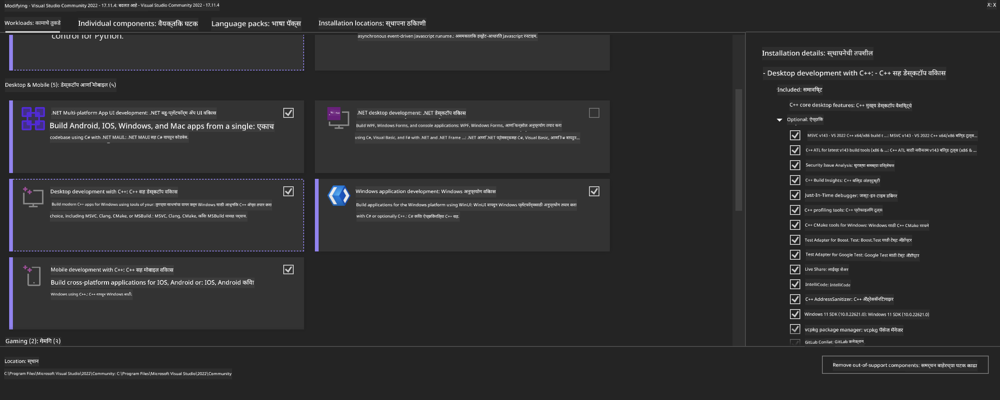
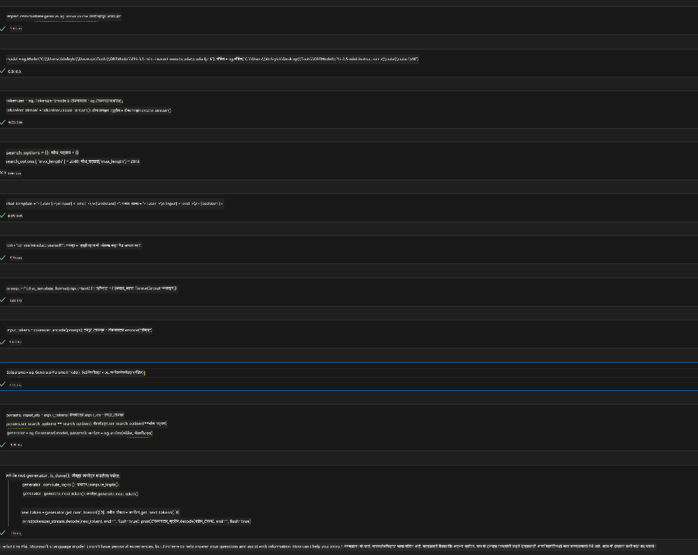
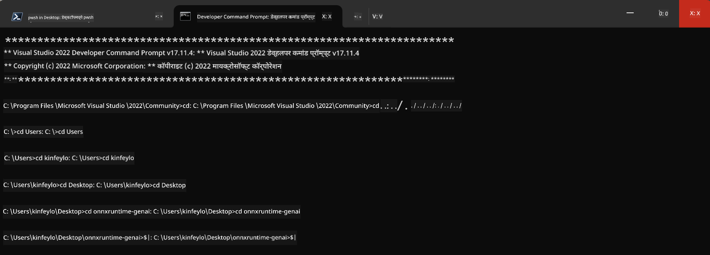

<!--
CO_OP_TRANSLATOR_METADATA:
{
  "original_hash": "b066fc29c1b2129df84e027cb75119ce",
  "translation_date": "2025-05-09T18:42:04+00:00",
  "source_file": "md/02.Application/01.TextAndChat/Phi3/ORTWindowGPUGuideline.md",
  "language_code": "mr"
}
-->
# **OnnxRuntime GenAI Windows GPU साठी मार्गदर्शक तत्त्वे**

हा मार्गदर्शक Windows वर GPU सह ONNX Runtime (ORT) सेटअप आणि वापरण्याच्या पायऱ्या देतो. तुमच्या मॉडेलसाठी GPU वेग वाढवण्यासाठी आणि कार्यक्षमता सुधारण्यासाठी हा मदत करतो.

हे दस्तऐवज खालील बाबींवर मार्गदर्शन करतो:

- पर्यावरण सेटअप: CUDA, cuDNN आणि ONNX Runtime सारख्या आवश्यक अवलंबनांची स्थापना कशी करावी याचे निर्देश.
- कॉन्फिगरेशन: GPU संसाधने प्रभावीपणे वापरण्यासाठी पर्यावरण आणि ONNX Runtime कसे कॉन्फिगर करावे.
- ऑप्टिमायझेशन टिप्स: सर्वोत्तम कार्यक्षमतेसाठी GPU सेटिंग्ज कसे सुधारायचे याबाबत सल्ला.

### **1. Python 3.10.x /3.11.8**

   ***Note*** Python पर्यावरणासाठी [miniforge](https://github.com/conda-forge/miniforge/releases/latest/download/Miniforge3-Windows-x86_64.exe) वापरण्याचा सल्ला दिला आहे

   ```bash

   conda create -n pydev python==3.11.8

   conda activate pydev

   ```

   ***Reminder*** जर तुम्ही आधी Python ONNX लायब्ररी काहीही इंस्टॉल केली असेल तर ती अनइंस्टॉल करा

### **2. winget वापरून CMake इंस्टॉल करा**

   ```bash

   winget install -e --id Kitware.CMake

   ```

### **3. Visual Studio 2022 - Desktop Development with C++ इंस्टॉल करा**

   ***Note*** जर तुम्हाला compile करायचे नसेल तर हा टप्पा वगळू शकता



### **4. NVIDIA ड्रायव्हर इंस्टॉल करा**

1. **NVIDIA GPU Driver**  [https://www.nvidia.com/en-us/drivers/](https://www.nvidia.com/en-us/drivers/)

2. **NVIDIA CUDA 12.4** [https://developer.nvidia.com/cuda-12-4-0-download-archive](https://developer.nvidia.com/cuda-12-4-0-download-archive)

3. **NVIDIA CUDNN 9.4**  [https://developer.nvidia.com/cudnn-downloads](https://developer.nvidia.com/cudnn-downloads)

***Reminder*** इंस्टॉलेशन प्रक्रियेत डिफॉल्ट सेटिंग्ज वापरा

### **5. NVIDIA पर्यावरण सेट करा**

NVIDIA CUDNN 9.4 चे lib, bin, include फोल्डर्स NVIDIA CUDA 12.4 च्या lib, bin, include मध्ये कॉपी करा

- *'C:\Program Files\NVIDIA\CUDNN\v9.4\bin\12.6'* येथील फाइल्स *'C:\Program Files\NVIDIA GPU Computing Toolkit\CUDA\v12.4\bin'* मध्ये कॉपी करा

- *'C:\Program Files\NVIDIA\CUDNN\v9.4\include\12.6'* येथील फाइल्स *'C:\Program Files\NVIDIA GPU Computing Toolkit\CUDA\v12.4\include'* मध्ये कॉपी करा

- *'C:\Program Files\NVIDIA\CUDNN\v9.4\lib\12.6'* येथील फाइल्स *'C:\Program Files\NVIDIA GPU Computing Toolkit\CUDA\v12.4\lib\x64'* मध्ये कॉपी करा

### **6. Phi-3.5-mini-instruct-onnx डाउनलोड करा**

   ```bash

   winget install -e --id Git.Git

   winget install -e --id GitHub.GitLFS

   git lfs install

   git clone https://huggingface.co/microsoft/Phi-3.5-mini-instruct-onnx

   ```

### **7. InferencePhi35Instruct.ipynb चालवा**

   [Notebook](../../../../../../code/09.UpdateSamples/Aug/ortgpu-phi35-instruct.ipynb) उघडा आणि चालवा



### **8. ORT GenAI GPU कंपाईल करा**

   ***Note*** 

   1. आधी सर्व onnx, onnxruntime आणि onnxruntime-genai अनइंस्टॉल करा

   ```bash

   pip list 
   
   ```

   नंतर सर्व onnxruntime लायब्ररी अनइंस्टॉल करा जसे की

   ```bash

   pip uninstall onnxruntime

   pip uninstall onnxruntime-genai

   pip uninstall onnxruntume-genai-cuda
   
   ```

   2. Visual Studio Extension सपोर्ट तपासा

   C:\Program Files\NVIDIA GPU Computing Toolkit\CUDA\v12.4\extras मध्ये पाहा की C:\Program Files\NVIDIA GPU Computing Toolkit\CUDA\v12.4\extras\visual_studio_integration आहे का.

   नसेल तर इतर CUDA toolkit ड्रायव्हर फोल्डर्स तपासा आणि visual_studio_integration फोल्डर आणि त्यातील सामग्री C:\Program Files\NVIDIA GPU Computing Toolkit\CUDA\v12.4\extras\visual_studio_integration मध्ये कॉपी करा

   - जर तुम्हाला कंपाईल करायचे नसेल तर हा टप्पा वगळू शकता

   ```bash

   git clone https://github.com/microsoft/onnxruntime-genai

   ```

   - [https://github.com/microsoft/onnxruntime/releases/download/v1.19.2/onnxruntime-win-x64-gpu-1.19.2.zip](https://github.com/microsoft/onnxruntime/releases/download/v1.19.2/onnxruntime-win-x64-gpu-1.19.2.zip) डाउनलोड करा

   - onnxruntime-win-x64-gpu-1.19.2.zip अनझिप करा, त्याचे नाव **ort** असे बदला आणि ort फोल्डर onnxruntime-genai मध्ये कॉपी करा

   - Windows Terminal वापरून Developer Command Prompt for VS 2022 मध्ये जा आणि onnxruntime-genai मध्ये जा



   - तुमच्या Python पर्यावरणासह ते कंपाईल करा

   ```bash

   cd onnxruntime-genai

   python build.py --use_cuda  --cuda_home "C:\Program Files\NVIDIA GPU Computing Toolkit\CUDA\v12.4" --config Release
 

   cd build/Windows/Release/Wheel

   pip install .whl

   ```

**अस्वीकरण**:  
हा दस्तऐवज AI अनुवाद सेवा [Co-op Translator](https://github.com/Azure/co-op-translator) वापरून अनुवादित केला आहे. आम्ही अचूकतेसाठी प्रयत्न करतो, तरी कृपया लक्षात ठेवा की स्वयंचलित अनुवादांमध्ये चुका किंवा अचूकतेत त्रुटी असू शकतात. मूळ दस्तऐवज त्याच्या स्थानिक भाषेत अधिकृत स्रोत मानला जावा. महत्त्वाची माहिती असल्यास व्यावसायिक मानवी अनुवाद शिफारसीय आहे. या अनुवादाच्या वापरामुळे उद्भवलेल्या कोणत्याही गैरसमजुती किंवा चुकीच्या अर्थलागी आम्ही जबाबदार नाही.