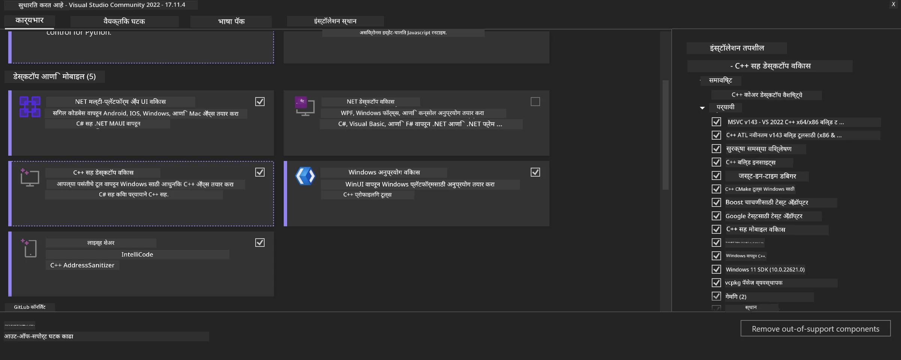
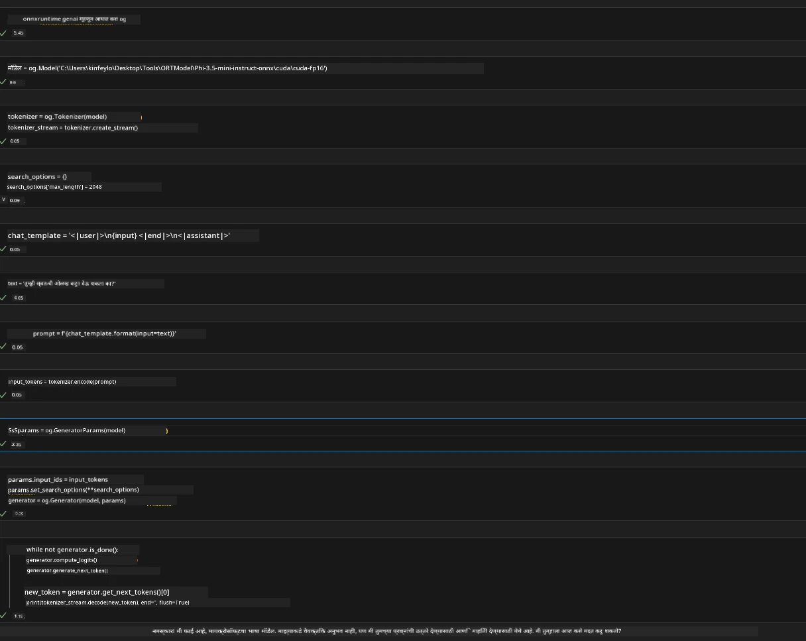
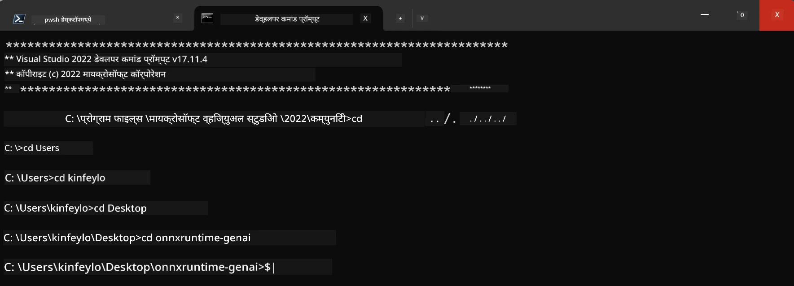

# **OnnxRuntime GenAI Windows GPU साठी मार्गदर्शक तत्त्वे**

हा मार्गदर्शक Windows वरील GPUs सह ONNX Runtime (ORT) सेटअप करण्याच्या आणि वापरण्याच्या स्टेप्स पुरवतो. आपले मॉडेल्ससाठी GPU एक्सलेरेशनचा लाभ घेण्यास हा तयार केला गेला आहे, ज्यामुळे कामगिरी आणि कार्यक्षमता सुधारते.

हा दस्तऐवज खालील मार्गदर्शन पुरवतो:

- पर्यावरण सेटअप: CUDA, cuDNN आणि ONNX Runtime सारख्या आवश्यक अवलंबनीयांच्या प्रतिष्ठापनावर सूचना.
- कॉन्फिगरेशन: GPU स्रोतांचा प्रभावी वापर करण्यासाठी पर्यावरण आणि ONNX Runtime कसे कॉन्फिगर करायचे.
- ऑप्टिमायझेशन टिप्स: सर्वोत्तम कामगिरीसाठी आपल्या GPU सेटिंग्ज कसे बरीचशी ठीक करायची यावर सल्ला.

### **1. Python 3.10.x /3.11.8**

   ***टीप*** आपले Python पर्यावरण म्हणून [miniforge](https://github.com/conda-forge/miniforge/releases/latest/download/Miniforge3-Windows-x86_64.exe) वापरण्याचा सल्ला दिला जातो

   ```bash

   conda create -n pydev python==3.11.8

   conda activate pydev

   ```

   ***स्मरणपत्र*** आपण Python ONNX लायब्ररी स्थापित केली असल्यास, कृपया ती अनइंस्टॉल करा

### **2. winget ने CMake स्थापित करा**


   ```bash

   winget install -e --id Kitware.CMake

   ```

### **3. Visual Studio 2022 - C++ सह डेस्कटॉप विकास स्थापित करा**

   ***टीप*** आपण संकलित करू इच्छित नसल्यास हा टप्पा वगळू शकता




### **4. NVIDIA ड्रायव्हर स्थापित करा**

1. **NVIDIA GPU ड्रायव्हर**  [https://www.nvidia.com/en-us/drivers/](https://www.nvidia.com/en-us/drivers/)

2. **NVIDIA CUDA 12.4** [https://developer.nvidia.com/cuda-12-4-0-download-archive](https://developer.nvidia.com/cuda-12-4-0-download-archive)

3. **NVIDIA CUDNN 9.4**  [https://developer.nvidia.com/cudnn-downloads](https://developer.nvidia.com/cudnn-downloads)

***स्मरणपत्र*** कृपया प्रतिष्ठापन प्रक्रियेसह डीफॉल्ट सेटिंग्ज वापरा 

### **5. NVIDIA पर्यावरण सेट करा**

NVIDIA CUDNN 9.4 lib,bin,include फाइल्स NVIDIA CUDA 12.4 lib,bin,include मध्ये कॉपी करा

- *'C:\Program Files\NVIDIA\CUDNN\v9.4\bin\12.6'* फाइल्स *'C:\Program Files\NVIDIA GPU Computing Toolkit\CUDA\v12.4\bin'* मध्ये कॉपी करा

- *'C:\Program Files\NVIDIA\CUDNN\v9.4\include\12.6'* फाइल्स *'C:\Program Files\NVIDIA GPU Computing Toolkit\CUDA\v12.4\include'* मध्ये कॉपी करा

- *'C:\Program Files\NVIDIA\CUDNN\v9.4\lib\12.6'* फाइल्स *'C:\Program Files\NVIDIA GPU Computing Toolkit\CUDA\v12.4\lib\x64'* मध्ये कॉपी करा


### **6. Phi-3.5-mini-instruct-onnx डाउनलोड करा**


   ```bash

   winget install -e --id Git.Git

   winget install -e --id GitHub.GitLFS

   git lfs install

   git clone https://huggingface.co/microsoft/Phi-3.5-mini-instruct-onnx

   ```

### **7. InferencePhi35Instruct.ipynb चालवा**

   [Notebook](../../../../code/09.UpdateSamples/Aug/ortgpu-phi35-instruct.ipynb) उघडा आणि चालवा





### **8. ORT GenAI GPU संकलित करा**


   ***टीप*** 
   
   1. कृपया प्रथम सर्व onnx, onnxruntime व onnxruntime-genai अनइंस्टॉल करा

   
   ```bash

   pip list 
   
   ```

   नंतर सर्व onnxruntime लायब्ररी अनइंस्टॉल करा उदा.


   ```bash

   pip uninstall onnxruntime

   pip uninstall onnxruntime-genai

   pip uninstall onnxruntume-genai-cuda
   
   ```

   2. Visual Studio विस्तार समर्थन तपासा 

   C:\Program Files\NVIDIA GPU Computing Toolkit\CUDA\v12.4\extras मध्ये तपासा की C:\Program Files\NVIDIA GPU Computing Toolkit\CUDA\v12.4\extras\visual_studio_integration आहे का. 
   
   आढळले नाही तर इतर CUDA टूलकिट ड्रायव्हर फोल्डर तपासा आणि visual_studio_integration फोल्डर आणि त्याचा सामग्री C:\Program Files\NVIDIA GPU Computing Toolkit\CUDA\v12.4\extras\visual_studio_integration मध्ये कॉपी करा


   - आपण संकलित करू इच्छित नसाल तर हा टप्पा वगळा


   ```bash

   git clone https://github.com/microsoft/onnxruntime-genai

   ```

   - [https://github.com/microsoft/onnxruntime/releases/download/v1.19.2/onnxruntime-win-x64-gpu-1.19.2.zip](https://github.com/microsoft/onnxruntime/releases/download/v1.19.2/onnxruntime-win-x64-gpu-1.19.2.zip) डाउनलोड करा

   - onnxruntime-win-x64-gpu-1.19.2.zip अनझिप करा, आणि त्याला **ort** असे नाव द्या, ort फोल्डर onnxruntime-genai मध्ये कॉपी करा

   - Windows Terminal वापरून, VS 2022 साठी Developer Command Prompt मध्ये जा आणि onnxruntime-genai मध्ये जा



   - आपले Python पर्यावरण वापरून ते संकलित करा

   
   ```bash

   cd onnxruntime-genai

   python build.py --use_cuda  --cuda_home "C:\Program Files\NVIDIA GPU Computing Toolkit\CUDA\v12.4" --config Release
 

   cd build/Windows/Release/Wheel

   pip install .whl

   ```

---

<!-- CO-OP TRANSLATOR DISCLAIMER START -->
**अस्वीकरण**:
हा दस्तऐवज AI भाषांतर सेवा [Co-op Translator](https://github.com/Azure/co-op-translator) चा वापर करून अनुवादित केला आहे. जरी आम्ही अचूकतेसाठी प्रयत्न करतो, तरी कृपया लक्षात घ्या की स्वयंचलित भाषांतरांमध्ये त्रुटी किंवा अचूकतेची कमतरता असू शकते. मूळ दस्तऐवज त्याच्या मूळ भाषेत अधिकृत स्रोत मानला पाहिजे. महत्त्वाची माहिती असल्यास, व्यावसायिक मानवी भाषांतराची शिफारस केली जाते. या भाषांतराच्या वापरामुळे उद्भवणाऱ्या कोणत्याही गैरसमज किंवा चुकीच्या अर्थलावणीसाठी आम्ही जबाबदार नाही.
<!-- CO-OP TRANSLATOR DISCLAIMER END -->