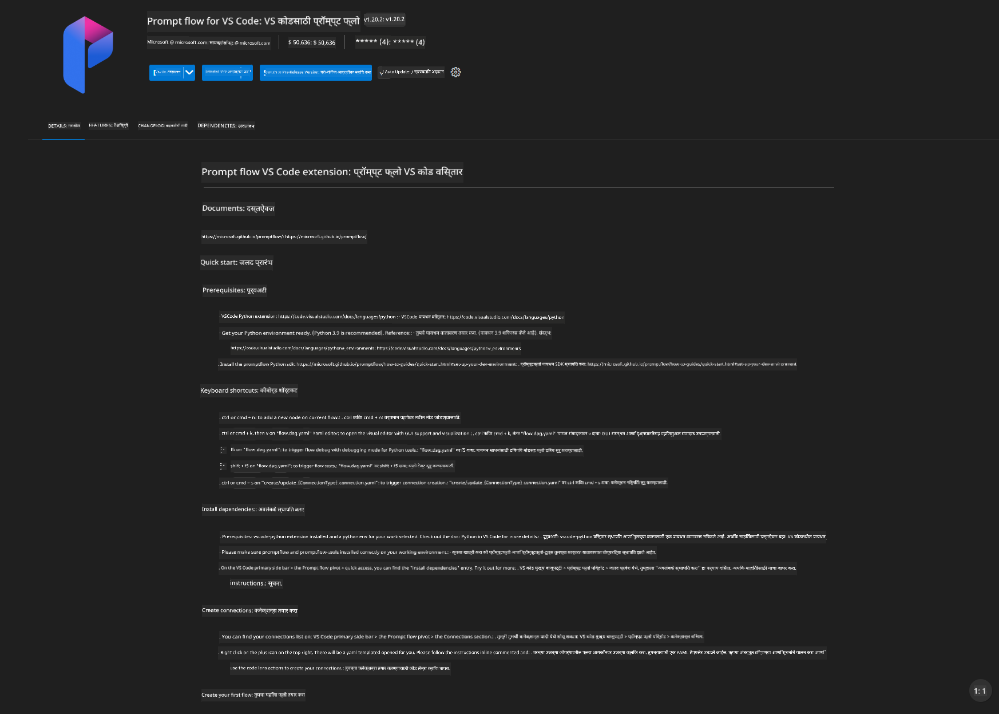
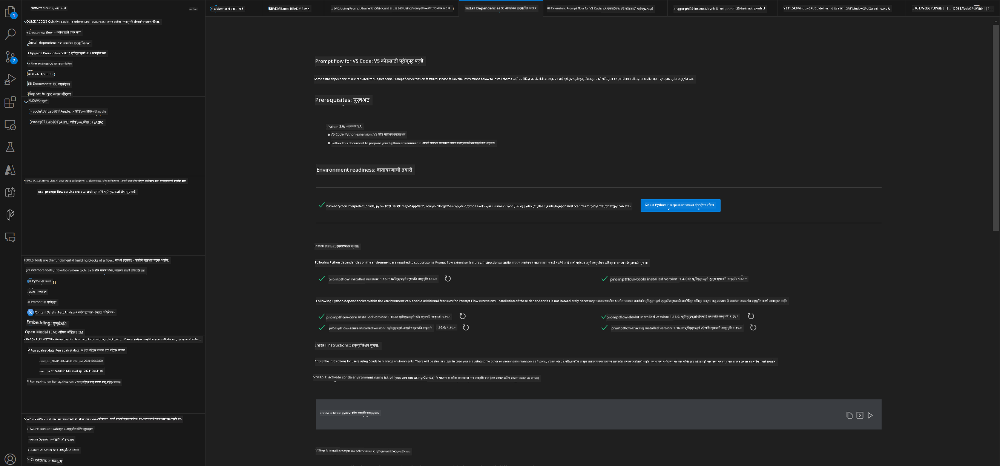
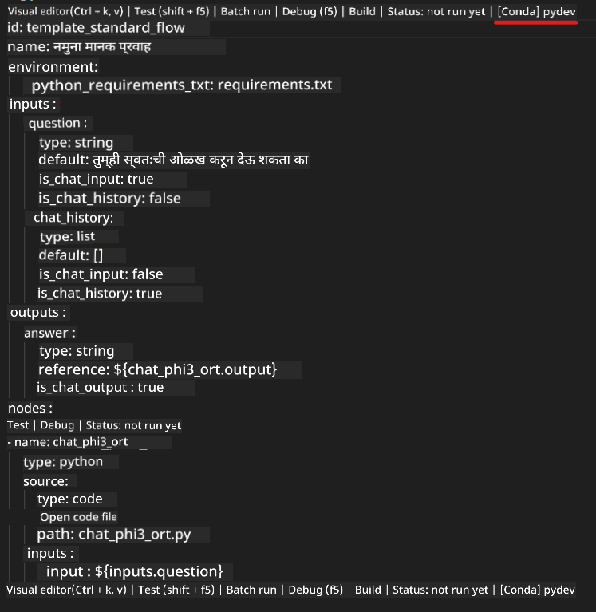
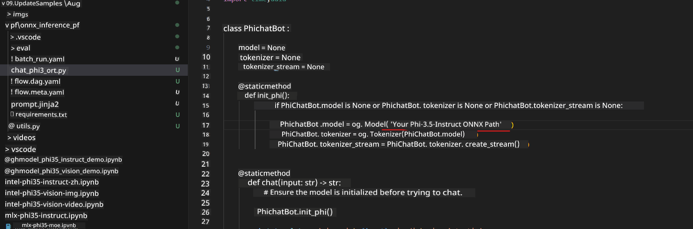
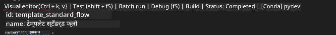
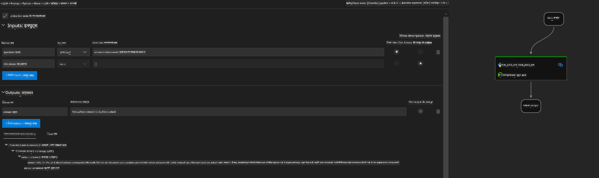
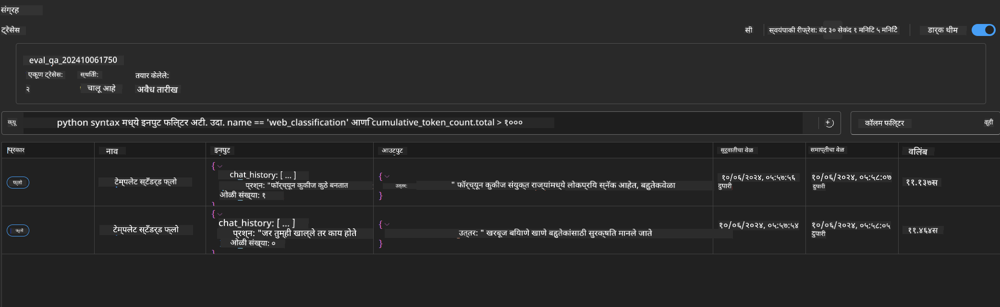

<!--
CO_OP_TRANSLATOR_METADATA:
{
  "original_hash": "92e7dac1e5af0dd7c94170fdaf6860fe",
  "translation_date": "2025-05-09T18:51:38+00:00",
  "source_file": "md/02.Application/01.TextAndChat/Phi3/UsingPromptFlowWithONNX.md",
  "language_code": "mr"
}
-->
# Windows GPU वापरून Phi-3.5-Instruct ONNX सह Prompt flow सोल्यूशन तयार करणे

खालील दस्तऐवज हा Phi-3 मॉडेल्सवर आधारित AI अॅप्लिकेशन्स विकसित करण्यासाठी ONNX (Open Neural Network Exchange) सह PromptFlow कसे वापरायचे याचा एक उदाहरण आहे.

PromptFlow ही एक विकास साधनांची साखळी आहे जी LLM-आधारित (Large Language Model) AI अॅप्लिकेशन्सच्या संपूर्ण विकास प्रक्रियेला सुरळीत करण्यासाठी डिझाइन केलेली आहे, कल्पना मांडणीपासून प्रोटोटायपिंग, चाचणी आणि मूल्यमापनापर्यंत.

PromptFlow आणि ONNX एकत्र केल्याने, विकासक हे करू शकतात:

- मॉडेल कार्यक्षमता ऑप्टिमाइझ करा: ONNX वापरून मॉडेलची कार्यक्षमता आणि तैनाती अधिक कार्यक्षम करा.
- विकास सोपा करा: PromptFlow वापरून वर्कफ्लो व्यवस्थापित करा आणि पुनरावृत्ती होणाऱ्या कामांना स्वयंचलित करा.
- सहकार्य वाढवा: एकसंध विकास वातावरण प्रदान करून टीम सदस्यांमधील सहकार्य सुलभ करा.

**Prompt flow** ही विकास साधनांची साखळी आहे जी LLM-आधारित AI अॅप्लिकेशन्सच्या संपूर्ण विकास प्रक्रियेला सुरळीत करते, कल्पना मांडणी, प्रोटोटायपिंग, चाचणी, मूल्यमापनापासून उत्पादन तैनाती आणि मॉनिटरिंगपर्यंत. हे prompt engineering खूप सोपे करते आणि तुम्हाला उत्पादन दर्जाच्या LLM अॅप्स तयार करण्यास मदत करते.

Prompt flow OpenAI, Azure OpenAI Service, आणि कस्टमायझेबल मॉडेल्स (Huggingface, लोकल LLM/SLM) शी कनेक्ट होऊ शकते. आम्हाला Phi-3.5 चा quantized ONNX मॉडेल लोकल अॅप्लिकेशन्ससाठी तैनात करायचा आहे. Prompt flow आपल्याला व्यवसायाची चांगली योजना आखण्यात आणि Phi-3.5 आधारित लोकल सोल्यूशन्स पूर्ण करण्यात मदत करू शकते. या उदाहरणात, आम्ही ONNX Runtime GenAI Library वापरून Windows GPU आधारित Prompt flow सोल्यूशन पूर्ण करू.

## **इंस्टॉलेशन**

### **Windows GPU साठी ONNX Runtime GenAI**

Windows GPU साठी ONNX Runtime GenAI सेट करण्यासाठी हा मार्गदर्शक वाचा [click here](./ORTWindowGPUGuideline.md)

### **VSCode मध्ये Prompt flow सेटअप करा**

1. Prompt flow VS Code Extension इन्स्टॉल करा



2. Prompt flow VS Code Extension इन्स्टॉल केल्यावर, एक्सटेंशनवर क्लिक करा आणि **Installation dependencies** निवडा, या मार्गदर्शकानुसार तुमच्या env मध्ये Prompt flow SDK इन्स्टॉल करा



3. [Sample Code](../../../../../../code/09.UpdateSamples/Aug/pf/onnx_inference_pf) डाउनलोड करा आणि VS Code मध्ये हा सॅम्पल उघडा


4. **flow.dag.yaml** उघडा आणि तुमचे Python env निवडा



   **chat_phi3_ort.py** उघडा आणि तुमचा Phi-3.5-instruct ONNX मॉडेलचा ठिकाण बदला



5. तुमचा prompt flow चालवा आणि टेस्ट करा

**flow.dag.yaml** उघडा आणि visual editor क्लिक करा



हे क्लिक केल्यावर, रन करा आणि टेस्ट करा



1. तुम्ही टर्मिनलमध्ये बॅच रन करू शकता आणि अधिक परिणाम पाहू शकता


```bash

pf run create --file batch_run.yaml --stream --name 'Your eval qa name'    

```

तुम्ही तुमच्या डीफॉल्ट ब्राउझरमध्ये निकाल पाहू शकता




**अस्वीकरण**:  
हा दस्तऐवज AI भाषांतर सेवा [Co-op Translator](https://github.com/Azure/co-op-translator) चा वापर करून भाषांतरित करण्यात आला आहे. आम्ही अचूकतेसाठी प्रयत्नशील आहोत, तरी कृपया लक्षात घ्या की स्वयंचलित भाषांतरांमध्ये चुका किंवा अचूकतेचा अभाव असू शकतो. मूळ दस्तऐवज त्याच्या स्थानिक भाषेत अधिकृत स्रोत मानला जावा. महत्त्वाच्या माहितीसाठी व्यावसायिक मानवी भाषांतर करण्याची शिफारस केली जाते. या भाषांतराच्या वापरामुळे उद्भवलेल्या कोणत्याही गैरसमजुती किंवा चुकीच्या अर्थ लावण्याबद्दल आम्ही जबाबदार नाही.