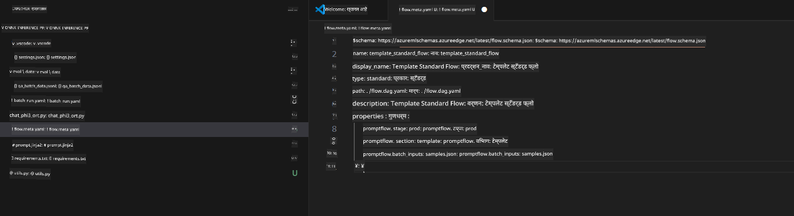
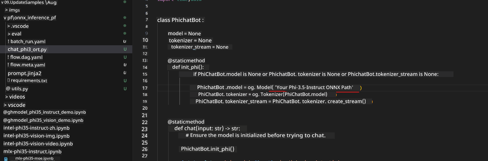
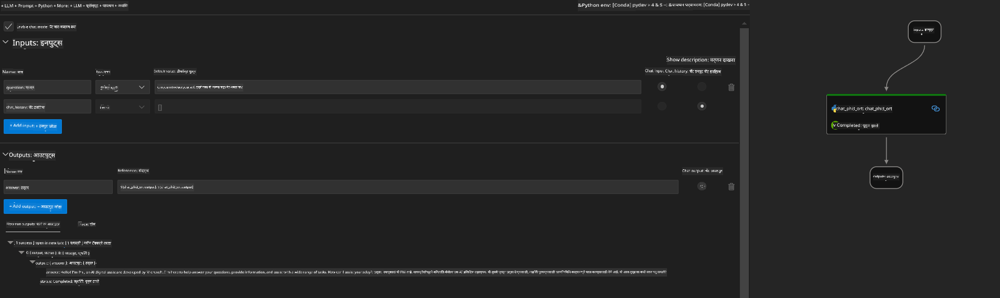

<!--
CO_OP_TRANSLATOR_METADATA:
{
  "original_hash": "92e7dac1e5af0dd7c94170fdaf6860fe",
  "translation_date": "2025-07-17T02:59:01+00:00",
  "source_file": "md/02.Application/01.TextAndChat/Phi3/UsingPromptFlowWithONNX.md",
  "language_code": "mr"
}
-->
# Windows GPU वापरून Phi-3.5-Instruct ONNX सह Prompt flow सोल्यूशन तयार करणे

खालील दस्तऐवज हे Phi-3 मॉडेल्सवर आधारित AI अॅप्लिकेशन्स विकसित करण्यासाठी ONNX (Open Neural Network Exchange) सह PromptFlow कसे वापरायचे याचे उदाहरण आहे.

PromptFlow ही LLM-आधारित (Large Language Model) AI अॅप्लिकेशन्सच्या संपूर्ण विकास चक्राला सुलभ करण्यासाठी तयार केलेली विकास साधनांची एक मालिका आहे, ज्यात कल्पना मांडणे, प्रोटोटायपिंग, चाचणी आणि मूल्यमापन यांचा समावेश आहे.

PromptFlow ला ONNX सह एकत्र करून, विकासक हे करू शकतात:

- मॉडेल कार्यक्षमता सुधारित करा: ONNX चा वापर करून मॉडेल इन्फरन्स आणि डिप्लॉयमेंट अधिक कार्यक्षम करा.
- विकास सुलभ करा: PromptFlow वापरून वर्कफ्लो व्यवस्थापित करा आणि पुनरावृत्ती होणाऱ्या कामांना स्वयंचलित करा.
- सहकार्य वाढवा: एकसंध विकास वातावरण प्रदान करून टीम सदस्यांमधील सहकार्य सुधारित करा.

**Prompt flow** ही LLM-आधारित AI अॅप्लिकेशन्सच्या संपूर्ण विकास चक्राला सुलभ करण्यासाठी तयार केलेली विकास साधनांची मालिका आहे, ज्यात कल्पना मांडणे, प्रोटोटायपिंग, चाचणी, मूल्यमापन, उत्पादन डिप्लॉयमेंट आणि मॉनिटरिंग यांचा समावेश आहे. हे prompt engineering खूप सोपे करते आणि तुम्हाला उत्पादन दर्जाच्या LLM अॅप्स तयार करण्यास मदत करते.

Prompt flow OpenAI, Azure OpenAI Service, आणि सानुकूल मॉडेल्स (Huggingface, स्थानिक LLM/SLM) शी कनेक्ट होऊ शकते. आम्हाला Phi-3.5 चा क्वांटाइज्ड ONNX मॉडेल स्थानिक अॅप्लिकेशन्समध्ये डिप्लॉय करायचा आहे. Prompt flow आम्हाला आमचा व्यवसाय चांगल्या प्रकारे नियोजित करण्यात आणि Phi-3.5 आधारित स्थानिक सोल्यूशन्स पूर्ण करण्यात मदत करू शकतो. या उदाहरणात, Windows GPU वर आधारित Prompt flow सोल्यूशन पूर्ण करण्यासाठी ONNX Runtime GenAI लायब्ररी एकत्रित केली जाईल.

## **इंस्टॉलेशन**

### **Windows GPU साठी ONNX Runtime GenAI**

Windows GPU साठी ONNX Runtime GenAI सेट करण्यासाठी हा मार्गदर्शक वाचा [click here](./ORTWindowGPUGuideline.md)

### **VSCode मध्ये Prompt flow सेटअप करा**

1. Prompt flow VS Code Extension इंस्टॉल करा


2. Prompt flow VS Code Extension इंस्टॉल केल्यानंतर, एक्सटेंशनवर क्लिक करा आणि **Installation dependencies** निवडा, या मार्गदर्शकानुसार तुमच्या पर्यावरणात Prompt flow SDK इंस्टॉल करा


3. [Sample Code](../../../../../../code/09.UpdateSamples/Aug/pf/onnx_inference_pf) डाउनलोड करा आणि VS Code मध्ये हा सॅम्पल उघडा



4. तुमचे Python पर्यावरण निवडण्यासाठी **flow.dag.yaml** उघडा


   तुमचा Phi-3.5-instruct ONNX मॉडेल स्थान बदलण्यासाठी **chat_phi3_ort.py** उघडा



5. तुमचा prompt flow चाचणीसाठी चालवा

**flow.dag.yaml** उघडा आणि visual editor वर क्लिक करा


यानंतर क्लिक करा आणि चाचणीसाठी चालवा



1. अधिक निकाल तपासण्यासाठी टर्मिनलमध्ये बॅच चालवू शकता

```bash

pf run create --file batch_run.yaml --stream --name 'Your eval qa name'    

```

तुम्ही तुमच्या डीफॉल्ट ब्राउझरमध्ये निकाल पाहू शकता


**अस्वीकरण**:  
हा दस्तऐवज AI अनुवाद सेवा [Co-op Translator](https://github.com/Azure/co-op-translator) वापरून अनुवादित केला आहे. आम्ही अचूकतेसाठी प्रयत्नशील असलो तरी, कृपया लक्षात घ्या की स्वयंचलित अनुवादांमध्ये चुका किंवा अचूकतेची कमतरता असू शकते. मूळ दस्तऐवज त्याच्या स्थानिक भाषेत अधिकृत स्रोत मानला जावा. महत्त्वाच्या माहितीसाठी व्यावसायिक मानवी अनुवाद शिफारसीय आहे. या अनुवादाच्या वापरामुळे उद्भवलेल्या कोणत्याही गैरसमजुती किंवा चुकीच्या अर्थलागी आम्ही जबाबदार नाही.