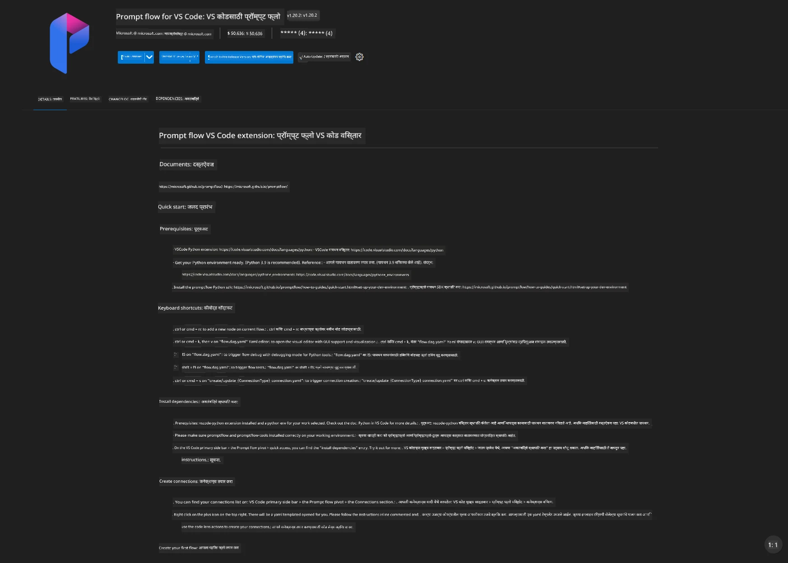
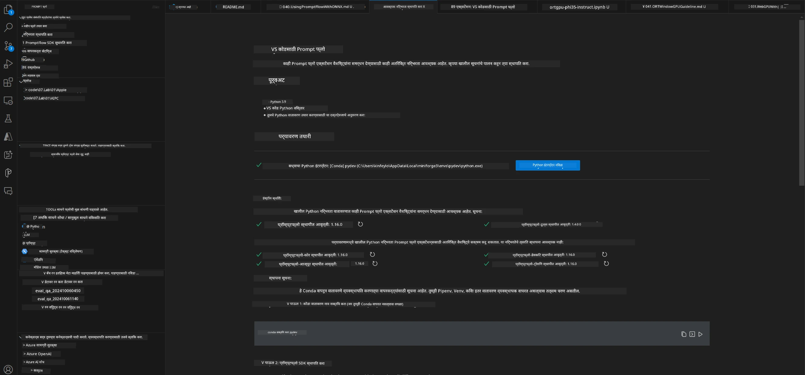
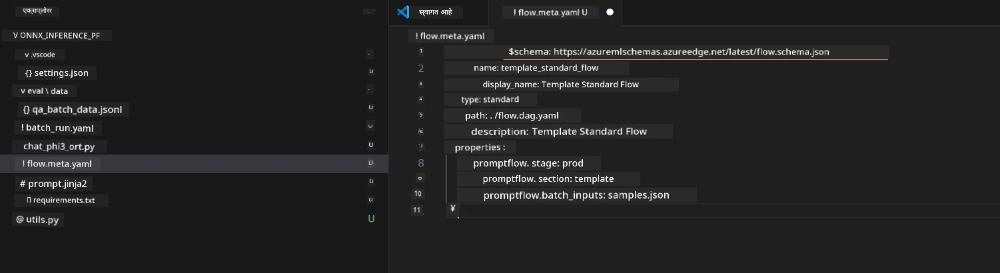
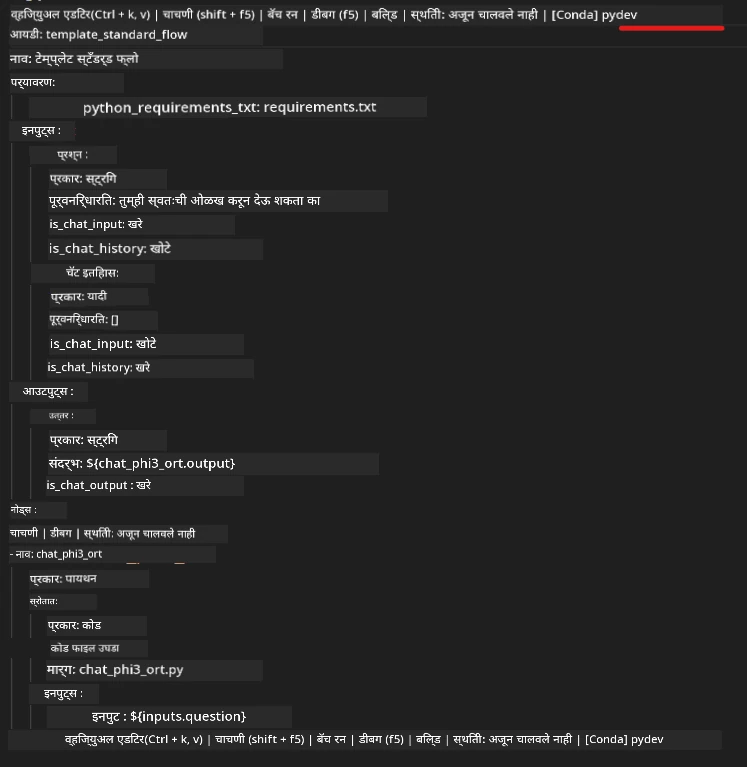
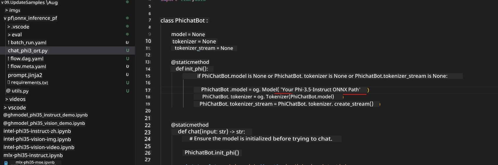
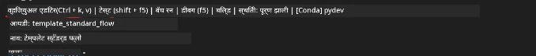
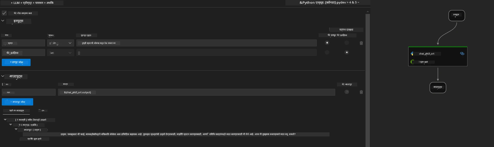
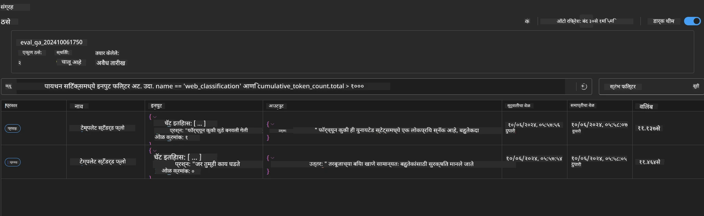

# Phi-3.5-Instruct ONNX सह Windows GPU वापरून Prompt flow सोल्युशन तयार करणे

खालील दस्तऐवज हे Phi-3 मॉडेल्सवर आधारित AI अनुप्रयोग विकसित करण्यासाठी ONNX (Open Neural Network Exchange) सह PromptFlow कसे वापरायचे याचे उदाहरण आहे.

PromptFlow हा LLM-आधारित (Large Language Model) AI अनुप्रयोगांच्या संपूर्ण विकास चक्राला सुलभ करण्यासाठी डिझाइन केलेल्या विकास साधनांचा संच आहे, ज्यामध्ये कल्पना निर्माण, प्रोटोटायपिंग, चाचणी आणि मूल्यमापन यांचा समावेश आहे.

PromptFlow सह ONNX एकत्रित करून, विकासक खालील गोष्टी करू शकतात:

- मॉडेल कामगिरी सुधारित करा: कार्यक्षम मॉडेल सूचक आणि तैनातीसाठी ONNX वापरा.
- विकास सुलभ करा: वर्कफ्लो व्यवस्थापित करण्यासाठी आणि पुनरावृत्त कामे स्वयंचलित करण्यासाठी PromptFlow वापरा.
- सहकार्य वाढवा: एकसंध विकास पर्यावरण प्रदान करून संघ सदस्यांमध्ये चांगले सहकार्य सुलभ करा.

**Prompt flow** हा LLM-आधारित AI अनुप्रयोगांच्या संपूर्ण विकास चक्राला सुलभ करण्यासाठी डिझाइन केलेल्या विकास साधनांचा संच आहे, ज्यामध्ये कल्पना, प्रोटोटायपिंग, चाचणी, मूल्यमापन, उत्पादन तैनाती आणि देखरेख यांचा समावेश आहे. हे प्रॉम्प्ट अभियांत्रिकी खूप सोपे करते आणि तुम्हाला उत्पादन दर्जाच्या LLM अनुप्रयोगांची निर्मिती करण्यास सक्षम करते.

Prompt flow OpenAI, Azure OpenAI सेवा, आणि सानुकूलित मॉडेल्स (Huggingface, स्थानिक LLM/SLM) शी कनेक्ट होऊ शकते. आम्हाला Phi-3.5 चा क्uantized ONNX मॉडेल स्थानिक अनुप्रयोगांमध्ये तैनात करायचा आहे. Prompt flow आम्हाला आमचा व्यवसाय चांगल्या प्रकारे नियोजित करण्यात आणि Phi-3.5 आधारित स्थानिक सोल्युशन्स पूर्ण करण्यात मदत करू शकतो. या उदाहरणात, Windows GPU वर आधारित Prompt flow सोल्युशन पूर्ण करण्यासाठी ONNX Runtime GenAI लायब्ररी एकत्र केली जाईल.

## **इंस्टॉलेशन**

### **Windows GPU साठी ONNX Runtime GenAI**

Windows GPU साठी ONNX Runtime GenAI सेट करण्यासाठी या मार्गदर्शिकेचा वाचन करा [येथे क्लिक करा](./ORTWindowGPUGuideline.md)

### **VSCode मध्ये Prompt flow सेट अप करा**

1. Prompt flow VS Code विस्तार इंस्टॉल करा



2. Prompt flow VS Code विस्तार इंस्टॉल केल्यानंतर, विस्तार क्लिक करा, आणि **Installation dependencies** निवडून या मार्गदर्शिकेनुसार तुमच्या पर्यावरणात Prompt flow SDK इंस्टॉल करा



3. [Sample Code](../../../../../../code/09.UpdateSamples/Aug/pf/onnx_inference_pf) डाउनलोड करा आणि VS Code मध्ये हा नमुना उघडा



4. **flow.dag.yaml** उघडा आणि तुमचे Python पर्यावरण निवडा



   **chat_phi3_ort.py** उघडा आणि तुमच्या Phi-3.5-instruct ONNX मॉडेलचे स्थान बदला



5. तुमचा prompt flow चाचणीसाठी चालवा

**flow.dag.yaml** उघडा आणि visual editor क्लिक करा



यावर क्लिक करा आणि चालवून चाचणी करा



1. अधिक परिणाम तपासण्यासाठी टर्मिनलमध्ये बॅच चालवू शकता


```bash

pf run create --file batch_run.yaml --stream --name 'Your eval qa name'    

```

तुम्ही तुमच्या डिफॉल्ट ब्राउझरमध्ये निकाल तपासू शकता




---

<!-- CO-OP TRANSLATOR DISCLAIMER START -->
**अस्वीकरण**:
हा दस्तऐवज AI भाषांतर सेवा [Co-op Translator](https://github.com/Azure/co-op-translator) चा वापर करून अनुवादित केला आहे. जरी आम्ही अचूकतेसाठी प्रयत्न करतो, तरी कृपया लक्षात घ्या की स्वयंचलित भाषांतरांमध्ये त्रुटी किंवा अचूकतेची कमतरता असू शकते. मूळ दस्तऐवज त्याच्या मूळ भाषेत अधिकृत स्रोत मानला पाहिजे. महत्त्वाची माहिती असल्यास, व्यावसायिक मानवी भाषांतराची शिफारस केली जाते. या भाषांतराच्या वापरामुळे उद्भवणाऱ्या कोणत्याही गैरसमज किंवा चुकीच्या अर्थलावणीसाठी आम्ही जबाबदार नाही.
<!-- CO-OP TRANSLATOR DISCLAIMER END -->