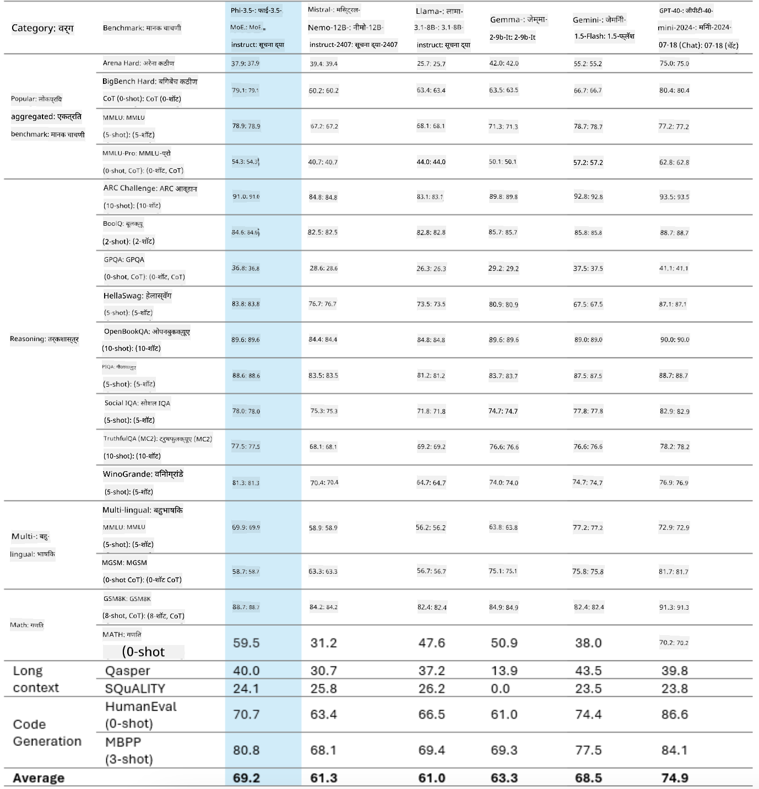
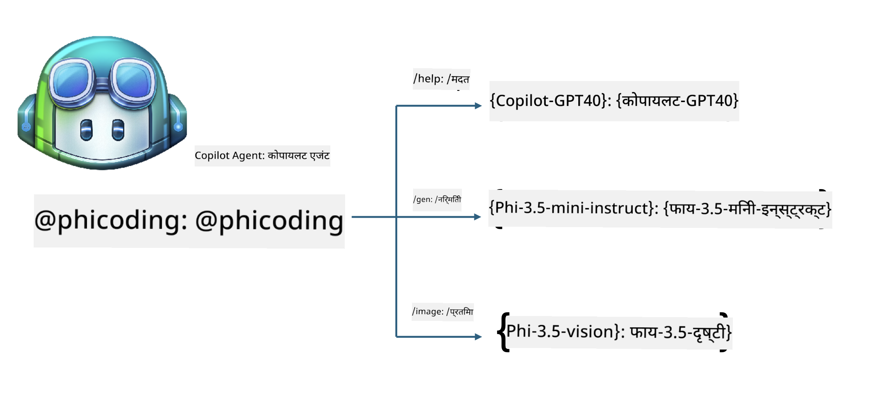
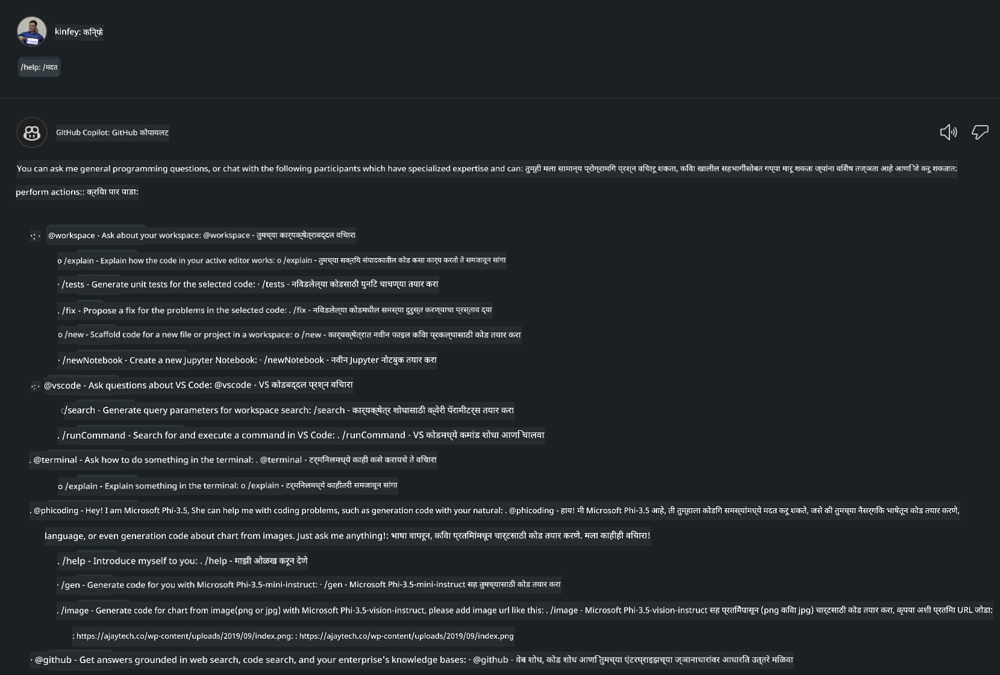
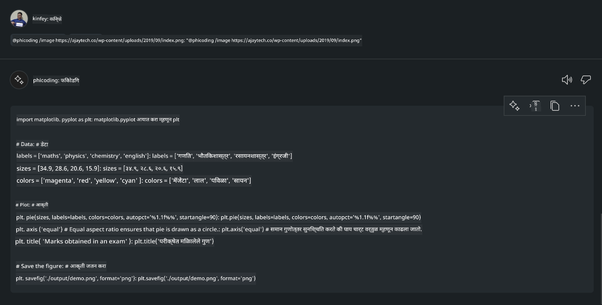

<!--
CO_OP_TRANSLATOR_METADATA:
{
  "original_hash": "35bf81388ac6917277b8d9a0c39bdc70",
  "translation_date": "2025-07-17T03:24:04+00:00",
  "source_file": "md/02.Application/02.Code/Phi3/CreateVSCodeChatAgentWithGitHubModels.md",
  "language_code": "mr"
}
-->
# **GitHub Models च्या Phi-3.5 सह तुमचा स्वतःचा Visual Studio Code Chat Copilot एजंट तयार करा**

तुम्ही Visual Studio Code Copilot वापरत आहात का? विशेषतः Chat मध्ये, तुम्ही वेगवेगळे एजंट वापरून Visual Studio Code मध्ये प्रोजेक्ट तयार करणे, लिहिणे आणि देखभाल करण्याची क्षमता वाढवू शकता. Visual Studio Code एक API प्रदान करते ज्यामुळे कंपन्या आणि व्यक्ती त्यांच्या व्यवसायानुसार वेगवेगळे एजंट तयार करू शकतात आणि त्यांच्या खासगी क्षेत्रांमध्ये त्यांची क्षमता वाढवू शकतात. या लेखात, आपण GitHub Models च्या **Phi-3.5-mini-instruct (128k)** आणि **Phi-3.5-vision-instruct (128k)** वर लक्ष केंद्रित करून तुमचा स्वतःचा Visual Studio Code एजंट तयार करू.

## **GitHub Models वरील Phi-3.5 बद्दल**

आपल्याला माहित आहे की Phi-3/3.5-mini-instruct, Phi-3/3.5 कुटुंबातील, कोड समजून घेण्याची आणि तयार करण्याची मजबूत क्षमता आहे, आणि Gemma-2-9b आणि Mistral-Nemo-12B-instruct-2407 पेक्षा त्यात फायदे आहेत.



नवीनतम GitHub Models आधीच Phi-3.5-mini-instruct (128k) आणि Phi-3.5-vision-instruct (128k) मॉडेल्सची उपलब्धता देतात. विकसक OpenAI SDK, Azure AI Inference SDK, आणि REST API द्वारे त्यांना वापरू शकतात.


***Note:*** येथे Azure AI Inference SDK वापरण्याची शिफारस केली जाते, कारण उत्पादन वातावरणात Azure Model Catalog सह ते अधिक चांगले स्विच करू शकते.

खालील परिणाम GitHub Models सोबत जोडल्यावर कोड जनरेशनच्या परिस्थितीत **Phi-3.5-mini-instruct (128k)** आणि **Phi-3.5-vision-instruct (128k)** चे आहेत, तसेच पुढील उदाहरणांसाठी तयारी दर्शवितात.

**Demo: GitHub Models Phi-3.5-mini-instruct (128k) कडून Prompt वरून कोड तयार करणे** ([या लिंकवर क्लिक करा](../../../../../../code/09.UpdateSamples/Aug/ghmodel_phi35_instruct_demo.ipynb))

**Demo: GitHub Models Phi-3.5-vision-instruct (128k) कडून प्रतिमेवरून कोड तयार करणे** ([या लिंकवर क्लिक करा](../../../../../../code/09.UpdateSamples/Aug/ghmodel_phi35_vision_demo.ipynb))


## **GitHub Copilot Chat Agent बद्दल**

GitHub Copilot Chat Agent वेगवेगळ्या प्रोजेक्ट परिस्थितींमध्ये कोडच्या आधारावर विविध कामे पूर्ण करू शकतो. या प्रणालीमध्ये चार एजंट आहेत: workspace, github, terminal, vscode


एजंटच्या नावास ‘@’ जोडून तुम्ही संबंधित काम पटकन पूर्ण करू शकता. उद्योगांसाठी, जर तुम्ही तुमच्या व्यवसायाशी संबंधित गरजा, कोडिंग, चाचणी तपशील, आणि प्रकाशन यांसारखे कंटेंट जोडले तर तुम्हाला GitHub Copilot वर आधारित अधिक सामर्थ्यशाली खासगी उद्योग फंक्शन्स मिळू शकतात.

Visual Studio Code Chat Agent ने आता अधिकृतपणे त्याचा API जारी केला आहे, ज्यामुळे उद्योग किंवा उद्योग विकासक वेगवेगळ्या सॉफ्टवेअर व्यवसाय परिसंस्थांवर आधारित एजंट विकसित करू शकतात. Visual Studio Code Extension Development च्या विकास पद्धतीवर आधारित, तुम्ही सहज Visual Studio Code Chat Agent API चा इंटरफेस वापरू शकता. आपण या प्रक्रियेवर आधारित विकास करू शकतो.


विकास परिस्थिती तृतीय-पक्ष मॉडेल API (जसे GitHub Models, Azure Model Catalog, आणि ओपन सोर्स मॉडेल्सवर आधारित स्वतःच्या सेवा) वापरण्याला समर्थन देते आणि GitHub Copilot द्वारे दिलेले gpt-35-turbo, gpt-4, आणि gpt-4o मॉडेल्स देखील वापरू शकते.

## **Phi-3.5 वर आधारित @phicoding एजंट जोडा**

आम्ही Phi-3.5 च्या प्रोग्रामिंग क्षमतांचा समावेश करून कोड लेखन, प्रतिमा जनरेशन कोड आणि इतर कामे पूर्ण करण्याचा प्रयत्न करतो. Phi-3.5 भोवती तयार केलेला एक एजंट - @PHI, खाली काही फंक्शन्स आहेत:

1. GitHub Copilot द्वारे दिलेल्या GPT-4o वर आधारित स्वतःची ओळख तयार करा **@phicoding /help** कमांड वापरून

2. **Phi-3.5-mini-instruct (128k)** वर आधारित वेगवेगळ्या प्रोग्रामिंग भाषांसाठी कोड तयार करा **@phicoding /gen** कमांड वापरून

3. **Phi-3.5-vision-instruct (128k)** आणि प्रतिमा पूर्णतेवर आधारित कोड तयार करा **@phicoding /image** कमांड वापरून



## **संबंधित पावले**

1. npm वापरून Visual Studio Code Extension विकास समर्थन स्थापित करा

```bash

npm install --global yo generator-code 

```

2. Visual Studio Code Extension प्लगइन तयार करा (Typescript विकास मोड वापरून, नाव phiext)

```bash

yo code 

```

3. तयार केलेला प्रोजेक्ट उघडा आणि package.json मध्ये बदल करा. येथे संबंधित सूचना आणि कॉन्फिगरेशन आहेत, तसेच GitHub Models ची कॉन्फिगरेशन. लक्षात ठेवा की येथे तुमचा GitHub Models टोकन जोडणे आवश्यक आहे.

```json

{
  "name": "phiext",
  "displayName": "phiext",
  "description": "",
  "version": "0.0.1",
  "engines": {
    "vscode": "^1.93.0"
  },
  "categories": [
    "AI",
    "Chat"
  ],
  "activationEvents": [],
  "enabledApiProposals": [
      "chatVariableResolver"
  ],
  "main": "./dist/extension.js",
  "contributes": {
    "chatParticipants": [
        {
            "id": "chat.phicoding",
            "name": "phicoding",
            "description": "Hey! I am Microsoft Phi-3.5, She can help me with coding problems, such as generation code with your natural language, or even generation code about chart from images. Just ask me anything!",
            "isSticky": true,
            "commands": [
                {
                    "name": "help",
                    "description": "Introduce myself to you"
                },
                {
                    "name": "gen",
                    "description": "Generate code for you with Microsoft Phi-3.5-mini-instruct"
                },
                {
                    "name": "image",
                    "description": "Generate code for chart from image(png or jpg) with Microsoft Phi-3.5-vision-instruct, please add image url like this : https://ajaytech.co/wp-content/uploads/2019/09/index.png"
                }
            ]
        }
    ],
    "commands": [
        {
            "command": "phicoding.namesInEditor",
            "title": "Use Microsoft Phi 3.5 in Editor"
        }
    ],
    "configuration": {
      "type": "object",
      "title": "githubmodels",
      "properties": {
        "githubmodels.endpoint": {
          "type": "string",
          "default": "https://models.inference.ai.azure.com",
          "description": "Your GitHub Models Endpoint",
          "order": 0
        },
        "githubmodels.api_key": {
          "type": "string",
          "default": "Your GitHub Models Token",
          "description": "Your GitHub Models Token",
          "order": 1
        },
        "githubmodels.phi35instruct": {
          "type": "string",
          "default": "Phi-3.5-mini-instruct",
          "description": "Your Phi-35-Instruct Model",
          "order": 2
        },
        "githubmodels.phi35vision": {
          "type": "string",
          "default": "Phi-3.5-vision-instruct",
          "description": "Your Phi-35-Vision Model",
          "order": 3
        }
      }
    }
  },
  "scripts": {
    "vscode:prepublish": "npm run package",
    "compile": "webpack",
    "watch": "webpack --watch",
    "package": "webpack --mode production --devtool hidden-source-map",
    "compile-tests": "tsc -p . --outDir out",
    "watch-tests": "tsc -p . -w --outDir out",
    "pretest": "npm run compile-tests && npm run compile && npm run lint",
    "lint": "eslint src",
    "test": "vscode-test"
  },
  "devDependencies": {
    "@types/vscode": "^1.93.0",
    "@types/mocha": "^10.0.7",
    "@types/node": "20.x",
    "@typescript-eslint/eslint-plugin": "^8.3.0",
    "@typescript-eslint/parser": "^8.3.0",
    "eslint": "^9.9.1",
    "typescript": "^5.5.4",
    "ts-loader": "^9.5.1",
    "webpack": "^5.94.0",
    "webpack-cli": "^5.1.4",
    "@vscode/test-cli": "^0.0.10",
    "@vscode/test-electron": "^2.4.1"
  },
  "dependencies": {
    "@types/node-fetch": "^2.6.11",
    "node-fetch": "^3.3.2",
    "@azure-rest/ai-inference": "latest",
    "@azure/core-auth": "latest",
    "@azure/core-sse": "latest"
  }
}


```

4. src/extension.ts मध्ये बदल करा

```typescript

// The module 'vscode' contains the VS Code extensibility API
// Import the module and reference it with the alias vscode in your code below
import * as vscode from 'vscode';
import ModelClient from "@azure-rest/ai-inference";
import { AzureKeyCredential } from "@azure/core-auth";


interface IPhiChatResult extends vscode.ChatResult {
    metadata: {
        command: string;
    };
}


const MODEL_SELECTOR: vscode.LanguageModelChatSelector = { vendor: 'copilot', family: 'gpt-4o' };

function isValidImageUrl(url: string): boolean {
    const regex = /^(https?:\/\/.*\.(?:png|jpg))$/i;
    return regex.test(url);
}
  

// This method is called when your extension is activated
// Your extension is activated the very first time the command is executed
export function activate(context: vscode.ExtensionContext) {

    const codinghandler: vscode.ChatRequestHandler = async (request: vscode.ChatRequest, context: vscode.ChatContext, stream: vscode.ChatResponseStream, token: vscode.CancellationToken): Promise<IPhiChatResult> => {


        const config : any = vscode.workspace.getConfiguration('githubmodels');
        const endPoint: string = config.get('endpoint');
        const apiKey: string = config.get('api_key');
        const phi35instruct: string = config.get('phi35instruct');
        const phi35vision: string = config.get('phi35vision');
        
        if (request.command === 'help') {

            const content = "Welcome to Coding assistant with Microsoft Phi-3.5"; 
            stream.progress(content);


            try {
                const [model] = await vscode.lm.selectChatModels(MODEL_SELECTOR);
                if (model) {
                    const messages = [
                        vscode.LanguageModelChatMessage.User("Please help me express this content in a humorous way: I am a programming assistant who can help you convert natural language into code and generate code based on the charts in the images. output format like this : Hey I am Phi ......")
                    ];
                    const chatResponse = await model.sendRequest(messages, {}, token);
                    for await (const fragment of chatResponse.text) {
                        stream.markdown(fragment);
                    }
                }
            } catch(err) {
                console.log(err);
            }


            return { metadata: { command: 'help' } };

        }

        
        if (request.command === 'gen') {

            const content = "Welcome to use phi-3.5 to generate code";

            stream.progress(content);

            const client = new ModelClient(endPoint, new AzureKeyCredential(apiKey));

            const response = await client.path("/chat/completions").post({
              body: {
                messages: [
                  { role:"system", content: "You are a coding assistant.Help answer all code generation questions." },
                  { role:"user", content: request.prompt }
                ],
                model: phi35instruct,
                temperature: 0.4,
                max_tokens: 1000,
                top_p: 1.
              }
            });

            stream.markdown(response.body.choices[0].message.content);

            return { metadata: { command: 'gen' } };

        }


        
        if (request.command === 'image') {


            const content = "Welcome to use phi-3.5 to generate code from image(png or jpg),image url like this:https://ajaytech.co/wp-content/uploads/2019/09/index.png";

            stream.progress(content);

            if (!isValidImageUrl(request.prompt)) {
                stream.markdown('Please provide a valid image URL');
                return { metadata: { command: 'image' } };
            }
            else
            {

                const client = new ModelClient(endPoint, new AzureKeyCredential(apiKey));
    
                const response = await client.path("/chat/completions").post({
                    body: {
                      messages: [
                        { role: "system", content: "You are a helpful assistant that describes images in details." },
                        { role: "user", content: [
                            { type: "text", text: "Please generate code according to the chart in the picture according to the following requirements\n1. Keep all information in the chart, including data and text\n2. Do not generate additional information that is not included in the chart\n3. Please extract data from the picture, do not generate it from csv\n4. Please save the regenerated chart as a chart and save it to ./output/demo.png"},
                            { type: "image_url", image_url: {url: request.prompt}
                            }
                          ]
                        }
                      ],
                      model: phi35vision,
                      temperature: 0.4,
                      max_tokens: 2048,
                      top_p: 1.
                    }
                  });
    
                
                stream.markdown(response.body.choices[0].message.content);
    
                return { metadata: { command: 'image' } };
            }


        }


        return { metadata: { command: '' } };
    };


    const phi_ext = vscode.chat.createChatParticipant("chat.phicoding", codinghandler);

    phi_ext.iconPath = new vscode.ThemeIcon('sparkle');


    phi_ext.followupProvider = {
        provideFollowups(result: IPhiChatResult, context: vscode.ChatContext, token: vscode.CancellationToken) {
            return [{
                prompt: 'Let us coding with Phi-3.5 😋😋😋😋',
                label: vscode.l10n.t('Enjoy coding with Phi-3.5'),
                command: 'help'
            } satisfies vscode.ChatFollowup];
        }
    };

    context.subscriptions.push(phi_ext);
}

// This method is called when your extension is deactivated
export function deactivate() {}


```

6. चालवा

***/help***



***@phicoding /help***


***@phicoding /gen***


***@phicoding /image***



तुम्ही नमुना कोड डाउनलोड करू शकता :[click](../../../../../../code/09.UpdateSamples/Aug/vscode)

## **संसाधने**

1. GitHub Models साठी साइन अप करा [https://gh.io/models](https://gh.io/models)

2. Visual Studio Code Extension Development बद्दल शिका [https://code.visualstudio.com/api/get-started/your-first-extension](https://code.visualstudio.com/api/get-started/your-first-extension)

3. Visual Studio Code Copilot Chat API बद्दल शिका [https://code.visualstudio.com/api/extension-guides/chat](https://code.visualstudio.com/api/extension-guides/chat)

**अस्वीकरण**:  
हा दस्तऐवज AI अनुवाद सेवा [Co-op Translator](https://github.com/Azure/co-op-translator) वापरून अनुवादित केला आहे. आम्ही अचूकतेसाठी प्रयत्नशील असलो तरी, कृपया लक्षात घ्या की स्वयंचलित अनुवादांमध्ये चुका किंवा अचूकतेची कमतरता असू शकते. मूळ दस्तऐवज त्याच्या स्थानिक भाषेत अधिकृत स्रोत मानला जावा. महत्त्वाच्या माहितीसाठी व्यावसायिक मानवी अनुवाद करण्याची शिफारस केली जाते. या अनुवादाच्या वापरामुळे उद्भवणाऱ्या कोणत्याही गैरसमजुती किंवा चुकीच्या अर्थलागी आम्ही जबाबदार नाही.