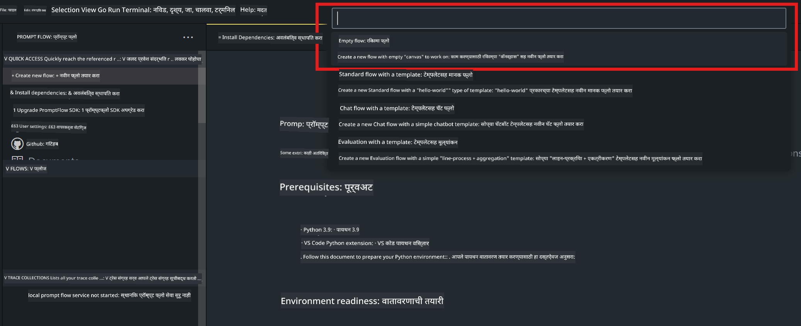
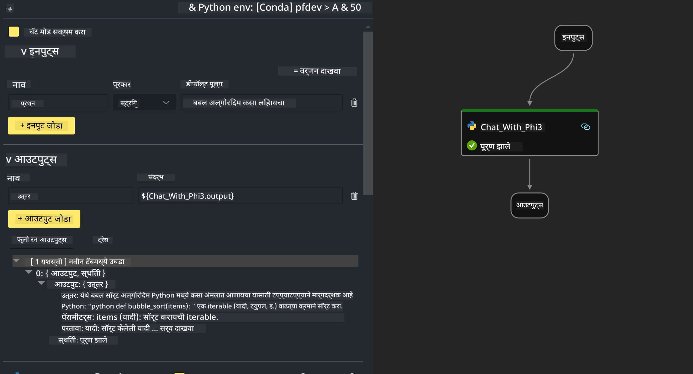

<!--
CO_OP_TRANSLATOR_METADATA:
{
  "original_hash": "bc29f7fe7fc16bed6932733eac8c81b8",
  "translation_date": "2025-07-17T03:56:37+00:00",
  "source_file": "md/02.Application/02.Code/Phi3/VSCodeExt/HOL/AIPC/02.PromptflowWithNPU.md",
  "language_code": "mr"
}
-->
# **Lab 2 - AIPC मध्ये Phi-3-mini सह Prompt flow चालवा**

## **Prompt flow म्हणजे काय**

Prompt flow ही LLM-आधारित AI अनुप्रयोगांच्या संपूर्ण विकास चक्राला सुलभ करण्यासाठी तयार केलेली विकास साधनांची एक मालिका आहे, ज्यात कल्पना निर्माण, प्रोटोटायपिंग, चाचणी, मूल्यांकन, उत्पादन तैनाती आणि देखरेख यांचा समावेश आहे. हे prompt engineering खूप सोपे करते आणि तुम्हाला उत्पादन दर्जाच्या LLM अॅप्स तयार करण्यास मदत करते.

Prompt flow वापरून तुम्ही करू शकता:

- LLMs, prompts, Python कोड आणि इतर साधने एकत्र करून एक कार्यान्वित होणारा workflow तयार करा.

- तुमच्या flows चे डिबगिंग आणि पुनरावृत्ती करा, विशेषतः LLMs सोबतच्या संवादात सहजतेने.

- तुमच्या flows चे मूल्यांकन करा, मोठ्या डेटासेटसह गुणवत्ता आणि कार्यक्षमता मोजा.

- तुमच्या CI/CD प्रणालीमध्ये चाचणी आणि मूल्यांकन समाकलित करा जेणेकरून flow ची गुणवत्ता सुनिश्चित करता येईल.

- तुमचे flows निवडलेल्या सेवा प्लॅटफॉर्मवर तैनात करा किंवा तुमच्या अॅपच्या कोड बेसमध्ये सहजपणे समाकलित करा.

- (ऐच्छिक पण अत्यंत शिफारस केलेले) Azure AI मधील Prompt flow च्या क्लाउड आवृत्तीचा वापर करून तुमच्या टीमसोबत सहकार्य करा.

## **AIPC म्हणजे काय**

AI PC मध्ये CPU, GPU आणि NPU असतो, ज्यापैकी प्रत्येकाला विशिष्ट AI वेग वाढवण्याच्या क्षमता असतात. NPU म्हणजे neural processing unit, एक विशेष प्रकारचा वेग वाढवणारा जो AI आणि मशीन लर्निंग (ML) कार्ये थेट तुमच्या PC वरच हाताळतो, म्हणजे डेटा क्लाउडमध्ये पाठवण्याची गरज नाही. GPU आणि CPU देखील हे काम करू शकतात, पण NPU कमी वीज वापरून AI गणनांसाठी विशेष उपयुक्त आहे. AI PC हा आपल्या संगणकांच्या कार्यपद्धतीत एक मूलभूत बदल दर्शवतो. हा पूर्वी अस्तित्वात नसलेल्या समस्येचा उपाय नाही, तर रोजच्या PC वापरासाठी मोठा सुधारणा आहे.

तर हे कसे काम करते? जनरेटिव्ह AI आणि मोठ्या प्रमाणावर सार्वजनिक डेटावर प्रशिक्षित मोठ्या भाषा मॉडेल्स (LLMs) च्या तुलनेत, तुमच्या PC वर होणारे AI जवळजवळ प्रत्येक स्तरावर अधिक सुलभ आहे. संकल्पना समजायला सोपी आहे, आणि कारण ते तुमच्या डेटावर प्रशिक्षित आहे, क्लाउडमध्ये प्रवेश न करता, फायदे अधिक त्वरित आणि व्यापक लोकांसाठी आकर्षक आहेत.

लवकरच, AI PC च्या जगात वैयक्तिक सहाय्यक आणि लहान AI मॉडेल्स थेट तुमच्या PC वर चालतील, तुमचा डेटा वापरून वैयक्तिक, खाजगी, अधिक सुरक्षित AI सुधारणा देण्यासाठी – जसे की बैठकांचे मिनिट्स घेणे, फँटेसी फुटबॉल लीग आयोजित करणे, फोटो आणि व्हिडिओ संपादनासाठी स्वयंचलित सुधारणा करणे, किंवा कुटुंब पुनर्मिलनासाठी प्रत्येकाच्या आगमन आणि प्रस्थान वेळांनुसार परिपूर्ण प्रवास आराखडा तयार करणे.

## **AIPC वर जनरेशन कोड फ्लोज तयार करणे**

***Note*** ：जर तुम्ही पर्यावरण स्थापना पूर्ण केलेली नसेल, तर कृपया [Lab 0 -Installations](./01.Installations.md) येथे भेट द्या

1. Visual Studio Code मध्ये Prompt flow Extension उघडा आणि एक रिकामा flow प्रोजेक्ट तयार करा



2. Inputs आणि Outputs पॅरामीटर्स जोडा आणि नवीन flow म्हणून Python कोड जोडा



तुम्ही तुमचा flow तयार करण्यासाठी या रचनेचा (flow.dag.yaml) संदर्भ घेऊ शकता

```yaml

inputs:
  question:
    type: string
    default: how to write Bubble Algorithm
outputs:
  answer:
    type: string
    reference: ${Chat_With_Phi3.output}
nodes:
- name: Chat_With_Phi3
  type: python
  source:
    type: code
    path: Chat_With_Phi3.py
  inputs:
    question: ${inputs.question}


```

3. ***Chat_With_Phi3.py*** मध्ये कोड जोडा

```python


from promptflow.core import tool

# import torch
from transformers import AutoTokenizer, pipeline,TextStreamer
import intel_npu_acceleration_library as npu_lib

import warnings

import asyncio
import platform

class Phi3CodeAgent:
    
    model = None
    tokenizer = None
    text_streamer = None
    
    model_id = "microsoft/Phi-3-mini-4k-instruct"

    @staticmethod
    def init_phi3():
        
        if Phi3CodeAgent.model is None or Phi3CodeAgent.tokenizer is None or Phi3CodeAgent.text_streamer is None:
            Phi3CodeAgent.model = npu_lib.NPUModelForCausalLM.from_pretrained(
                                    Phi3CodeAgent.model_id,
                                    torch_dtype="auto",
                                    dtype=npu_lib.int4,
                                    trust_remote_code=True
                                )
            Phi3CodeAgent.tokenizer = AutoTokenizer.from_pretrained(Phi3CodeAgent.model_id)
            Phi3CodeAgent.text_streamer = TextStreamer(Phi3CodeAgent.tokenizer, skip_prompt=True)

    

    @staticmethod
    def chat_with_phi3(prompt):
        
        Phi3CodeAgent.init_phi3()

        messages = "<|system|>You are a AI Python coding assistant. Please help me to generate code in Python.The answer only genertated Python code, but any comments and instructions do not need to be generated<|end|><|user|>" + prompt +"<|end|><|assistant|>"


        generation_args = {
            "max_new_tokens": 1024,
            "return_full_text": False,
            "temperature": 0.3,
            "do_sample": False,
            "streamer": Phi3CodeAgent.text_streamer,
        }

        pipe = pipeline(
            "text-generation",
            model=Phi3CodeAgent.model,
            tokenizer=Phi3CodeAgent.tokenizer,
            # **generation_args
        )

        result = ''

        with warnings.catch_warnings():
            warnings.simplefilter("ignore")
            response = pipe(messages, **generation_args)
            result =response[0]['generated_text']
            return result


@tool
def my_python_tool(question: str) -> str:
    if platform.system() == 'Windows':
        asyncio.set_event_loop_policy(asyncio.WindowsSelectorEventLoopPolicy())
    return Phi3CodeAgent.chat_with_phi3(question)


```

4. तुम्ही flow चे डिबग किंवा रन करून जनरेशन कोड योग्य आहे की नाही हे तपासू शकता


5. टर्मिनलमध्ये विकास API म्हणून flow चालवा

```

pf flow serve --source ./ --port 8080 --host localhost   

```

तुम्ही हे Postman / Thunder Client मध्ये तपासू शकता

### **Note**

1. पहिल्या वेळी चालवायला जास्त वेळ लागतो. Hugging face CLI वापरून phi-3 मॉडेल डाउनलोड करण्याची शिफारस केली जाते.

2. Intel NPU च्या मर्यादित संगणकीय क्षमतेचा विचार करता, Phi-3-mini-4k-instruct वापरणे शिफारसीय आहे.

3. आम्ही Intel NPU Acceleration वापरून INT4 रूपांतरणासाठी क्वांटायझेशन करतो, पण सेवा पुन्हा चालवायची असल्यास cache आणि nc_workshop फोल्डर्स हटवावे लागतील.

## **संसाधने**

1. Promptflow बद्दल शिका [https://microsoft.github.io/promptflow/](https://microsoft.github.io/promptflow/)

2. Intel NPU Acceleration बद्दल शिका [https://github.com/intel/intel-npu-acceleration-library](https://github.com/intel/intel-npu-acceleration-library)

3. नमुना कोड, डाउनलोड करा [Local NPU Agent Sample Code](../../../../../../../../../code/07.Lab/01/AIPC)

**अस्वीकरण**:  
हा दस्तऐवज AI अनुवाद सेवा [Co-op Translator](https://github.com/Azure/co-op-translator) वापरून अनुवादित केला आहे. आम्ही अचूकतेसाठी प्रयत्नशील असलो तरी, कृपया लक्षात घ्या की स्वयंचलित अनुवादांमध्ये चुका किंवा अचूकतेची कमतरता असू शकते. मूळ दस्तऐवज त्याच्या स्थानिक भाषेत अधिकृत स्रोत मानला जावा. महत्त्वाच्या माहितीसाठी व्यावसायिक मानवी अनुवाद करण्याची शिफारस केली जाते. या अनुवादाच्या वापरामुळे उद्भवलेल्या कोणत्याही गैरसमजुती किंवा चुकीच्या अर्थलागी आम्ही जबाबदार नाही.