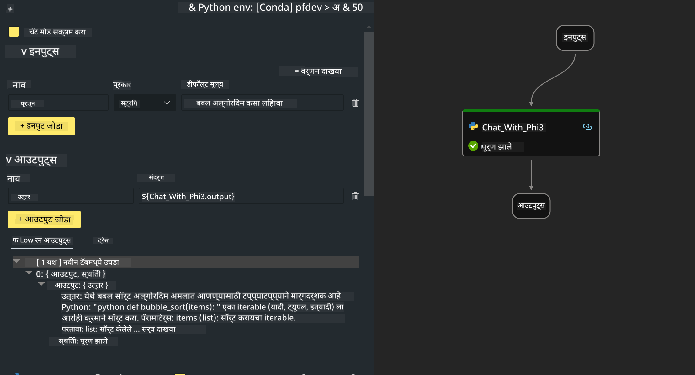
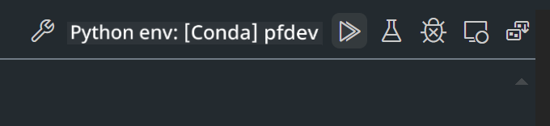

<!--
CO_OP_TRANSLATOR_METADATA:
{
  "original_hash": "bc29f7fe7fc16bed6932733eac8c81b8",
  "translation_date": "2025-05-09T19:22:05+00:00",
  "source_file": "md/02.Application/02.Code/Phi3/VSCodeExt/HOL/AIPC/02.PromptflowWithNPU.md",
  "language_code": "mr"
}
-->
# **Lab 2 - Phi-3-mini सह AIPC मध्ये Prompt flow चालवा**

## **Prompt flow काय आहे**

Prompt flow ही LLM-आधारित AI अॅप्लिकेशन्सच्या संपूर्ण विकास प्रक्रियेस सुलभ करण्यासाठी तयार केलेली विकास साधनांची एक मालिका आहे, ज्यात कल्पना तयार करणे, प्रोटोटायपिंग, चाचणी, मूल्यमापन, उत्पादनात तैनाती आणि देखरेख यांचा समावेश आहे. हे prompt engineering खूप सोपे करते आणि तुम्हाला उत्पादन दर्जाच्या LLM अॅप्स तयार करण्यास मदत करते.

Prompt flow वापरून तुम्ही करू शकता:

- LLMs, prompts, Python कोड आणि इतर साधनांना एक executable workflow मध्ये लिंक करणारे flows तयार करा.

- तुमचे flows डिबग आणि सुधारित करा, विशेषतः LLMs सोबतची संवाद सहजपणे हाताळा.

- मोठ्या डेटासेटसह तुमच्या flows चे मूल्यमापन करा, गुणवत्ता आणि कार्यक्षमता मोजा.

- चाचणी आणि मूल्यमापन तुमच्या CI/CD प्रणालीमध्ये समाकलित करा ज्यामुळे flow ची गुणवत्ता सुनिश्चित होते.

- तुमचे flows तुम्हाला हवे असलेल्या सर्व्हिंग प्लॅटफॉर्मवर तैनात करा किंवा तुमच्या अॅपच्या कोडबेसमध्ये सहजपणे समाकलित करा.

- (ऐच्छिक पण अत्यंत शिफारस केलेले) Azure AI मधील Prompt flow च्या क्लाउड आवृत्तीचा वापर करून तुमच्या टीमसोबत सहकार्य करा.

## **AIPC काय आहे**

AI PC मध्ये CPU, GPU आणि NPU असतात, ज्यापैकी प्रत्येकाची AI गती वाढवण्याची खास क्षमता असते. NPU म्हणजे neural processing unit, हा एक खास प्रकारचा अॅक्सेलरेटर आहे जो AI आणि ML कामे तुमच्या PC वरच पार पाडतो, म्हणजे डेटा क्लाऊडवर पाठवण्याची गरज नाही. GPU आणि CPU देखील हे काम करू शकतात, पण NPU कमी वीज वापरून AI गणना करण्यासाठी विशेष उपयुक्त आहे. AI PC हे आपल्या संगणकांच्या कार्यपद्धतीत एक मूलभूत बदल दर्शवते. हा एखाद्या आधी अस्तित्वात नसलेल्या समस्येचा उपाय नाही, तर रोजच्या संगणक वापरासाठी मोठ्या सुधारणा आणणारा आहे.

तर ते कसे काम करते? जनरेटिव्ह AI आणि मोठ्या LLMs च्या तुलनेत, जे प्रचंड सार्वजनिक डेटावर प्रशिक्षित आहेत, AI जे तुमच्या PC वर चालेल ते जवळजवळ प्रत्येक स्तरावर अधिक सुलभ आहे. ही कल्पना समजायला सोपी आहे आणि कारण ते तुमच्या डेटावर प्रशिक्षित आहे, क्लाऊडमध्ये जाण्याची गरज नाही, त्यामुळे फायदे अधिक त्वरीत आणि विस्तृत लोकसंख्येसाठी आकर्षक आहेत.

लवकरच, AI PC मध्ये वैयक्तिक सहाय्यक आणि छोटे AI मॉडेल्स थेट तुमच्या PC वर चालतील, तुमचा डेटा वापरून वैयक्तिक, खाजगी आणि अधिक सुरक्षित AI सुधारणा देतील ज्या तुम्ही दररोज करता – बैठकांचे मिनिट्स घेणे, fantasy football league आयोजित करणे, फोटो आणि व्हिडिओ संपादनासाठी स्वयंचलित सुधारणा, किंवा कुटुंबाच्या पुनर्मिलनासाठी प्रत्येकाच्या आगमन आणि प्रस्थान वेळांनुसार परिपूर्ण प्रवास आराखडा तयार करणे.

## **AIPC वर जनरेशन कोड फ्लोज तयार करणे**

***Note*** ：जर तुम्ही अजून पर्यंत पर्यावरण स्थापना पूर्ण केले नसेल, तर कृपया [Lab 0 -Installations](./01.Installations.md) पहा

1. Visual Studio Code मध्ये Prompt flow Extension उघडा आणि एक रिकामा flow प्रोजेक्ट तयार करा


2. Inputs आणि Outputs पॅरामीटर्स जोडा आणि नवीन flow म्हणून Python Code जोडा



तुम्ही flow तयार करण्यासाठी या रचनेचा (flow.dag.yaml) संदर्भ घेऊ शकता

```yaml

inputs:
  question:
    type: string
    default: how to write Bubble Algorithm
outputs:
  answer:
    type: string
    reference: ${Chat_With_Phi3.output}
nodes:
- name: Chat_With_Phi3
  type: python
  source:
    type: code
    path: Chat_With_Phi3.py
  inputs:
    question: ${inputs.question}


```

3. ***Chat_With_Phi3.py*** मध्ये कोड जोडा

```python


from promptflow.core import tool

# import torch
from transformers import AutoTokenizer, pipeline,TextStreamer
import intel_npu_acceleration_library as npu_lib

import warnings

import asyncio
import platform

class Phi3CodeAgent:
    
    model = None
    tokenizer = None
    text_streamer = None
    
    model_id = "microsoft/Phi-3-mini-4k-instruct"

    @staticmethod
    def init_phi3():
        
        if Phi3CodeAgent.model is None or Phi3CodeAgent.tokenizer is None or Phi3CodeAgent.text_streamer is None:
            Phi3CodeAgent.model = npu_lib.NPUModelForCausalLM.from_pretrained(
                                    Phi3CodeAgent.model_id,
                                    torch_dtype="auto",
                                    dtype=npu_lib.int4,
                                    trust_remote_code=True
                                )
            Phi3CodeAgent.tokenizer = AutoTokenizer.from_pretrained(Phi3CodeAgent.model_id)
            Phi3CodeAgent.text_streamer = TextStreamer(Phi3CodeAgent.tokenizer, skip_prompt=True)

    

    @staticmethod
    def chat_with_phi3(prompt):
        
        Phi3CodeAgent.init_phi3()

        messages = "<|system|>You are a AI Python coding assistant. Please help me to generate code in Python.The answer only genertated Python code, but any comments and instructions do not need to be generated<|end|><|user|>" + prompt +"<|end|><|assistant|>"


        generation_args = {
            "max_new_tokens": 1024,
            "return_full_text": False,
            "temperature": 0.3,
            "do_sample": False,
            "streamer": Phi3CodeAgent.text_streamer,
        }

        pipe = pipeline(
            "text-generation",
            model=Phi3CodeAgent.model,
            tokenizer=Phi3CodeAgent.tokenizer,
            # **generation_args
        )

        result = ''

        with warnings.catch_warnings():
            warnings.simplefilter("ignore")
            response = pipe(messages, **generation_args)
            result =response[0]['generated_text']
            return result


@tool
def my_python_tool(question: str) -> str:
    if platform.system() == 'Windows':
        asyncio.set_event_loop_policy(asyncio.WindowsSelectorEventLoopPolicy())
    return Phi3CodeAgent.chat_with_phi3(question)


```

4. Debug किंवा Run मधून flow चाचणी करा, जनरेशन कोड योग्य आहे का ते तपासा



5. टर्मिनलमध्ये flow ला विकास API म्हणून चालवा

```

pf flow serve --source ./ --port 8080 --host localhost   

```

Postman / Thunder Client मध्ये तुम्ही याची चाचणी करू शकता

### **Note**

1. पहिल्या रनला खूप वेळ लागतो. Hugging face CLI कडून phi-3 मॉडेल डाउनलोड करणे शिफारसीय आहे.

2. Intel NPU ची मर्यादित गणनाशक्ती लक्षात घेता, Phi-3-mini-4k-instruct वापरणे सुचवले आहे.

3. Intel NPU Acceleration वापरून INT4 क्वांटायझेशन केले आहे, पण सेवेची पुन्हा सुरूवात करताना cache आणि nc_workshop फोल्डर्स हटवावे लागतात.

## **संसाधने**

1. Promptflow शिकण्यासाठी [https://microsoft.github.io/promptflow/](https://microsoft.github.io/promptflow/)

2. Intel NPU Acceleration बद्दल जाणून घेण्यासाठी [https://github.com/intel/intel-npu-acceleration-library](https://github.com/intel/intel-npu-acceleration-library)

3. नमुना कोड, डाउनलोड करा [Local NPU Agent Sample Code](../../../../../../../../../code/07.Lab/01/AIPC)

**सूचना**:  
हा दस्तऐवज AI भाषांतर सेवा [Co-op Translator](https://github.com/Azure/co-op-translator) वापरून भाषांतरित केला आहे. आम्ही अचूकतेसाठी प्रयत्नशील असलो तरी, कृपया लक्षात ठेवा की स्वयंचलित भाषांतरांमध्ये चुका किंवा अचूकतेच्या त्रुटी असू शकतात. मूळ दस्तऐवज त्याच्या स्थानिक भाषेत अधिकृत स्रोत मानला पाहिजे. महत्त्वाच्या माहितीसाठी व्यावसायिक मानवी भाषांतर शिफारसीय आहे. या भाषांतराच्या वापरामुळे उद्भवलेल्या कोणत्याही गैरसमजुती किंवा चुकीसाठी आम्ही जबाबदार नाही.