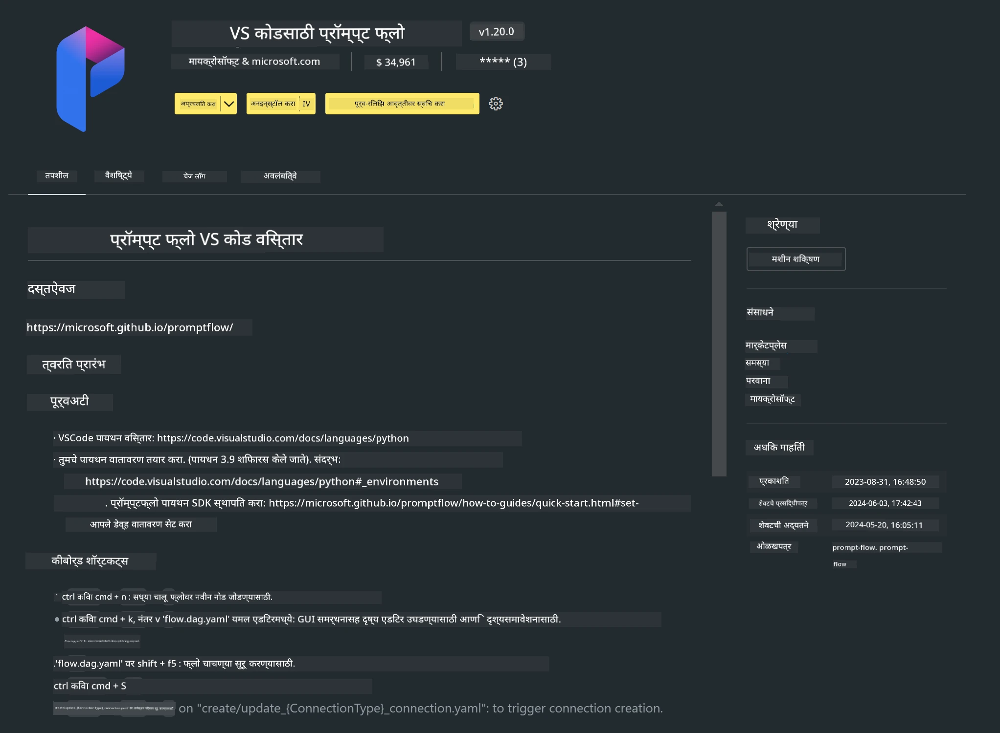

# **Lab 0 - स्थापना**

जेव्हा आपण Lab मध्ये प्रवेश करतो, तेव्हा संबंधित वातावरण कॉन्फिगर करणे आवश्यक असते :


### **1. Python 3.11+**

आपल्या Python वातावरणासाठी miniforge वापरणे शिफारसीय आहे

miniforge कॉन्फिगर करण्यासाठी, कृपया [https://github.com/conda-forge/miniforge](https://github.com/conda-forge/miniforge) येथे पहा

miniforge कॉन्फिगर केल्यानंतर, Power Shell मध्ये खालील कमांड चालवा

```bash

conda create -n pyenv python==3.11.8 -y

conda activate pyenv

```


### **2. Prompt flow SDK इंस्टॉल करा**

Lab 1 मध्ये आपण Prompt flow वापरतो, त्यामुळे आपल्याला Prompt flow SDK कॉन्फिगर करणे आवश्यक आहे.

```bash

pip install promptflow --upgrade

```

promptflow sdk तपासण्यासाठी ही कमांड वापरू शकता


```bash

pf --version

```

### **3. Visual Studio Code मध्ये Prompt flow Extension इंस्टॉल करा**



### **4. Apple चे MLX Framework**

MLX हे Apple सिलिकॉनवर मशीन लर्निंग संशोधनासाठी एक array framework आहे, जे Apple मशीन लर्निंग संशोधनाद्वारे विकसित केले गेले आहे. आपण **Apple MLX framework** वापरून Apple Silicon सह LLM / SLM वेगवान करू शकता. अधिक जाणून घेण्यासाठी, आपण [https://github.com/microsoft/PhiCookBook/blob/main/md/01.Introduction/03/MLX_Inference.md](https://github.com/microsoft/PhiCookBook/blob/main/md/01.Introduction/03/MLX_Inference.md) वाचू शकता.

bash मध्ये MLX framework लायब्ररी इंस्टॉल करा


```bash

pip install mlx-lm

```


### **5. इतर Python लायब्ररी**

requirements.txt तयार करा आणि खालील सामग्री जोडा

```txt

notebook
numpy 
scipy 
scikit-learn 
matplotlib 
pandas 
pillow 
graphviz

```


### **6. NVM इंस्टॉल करा**

Powershell मध्ये nvm इंस्टॉल करा


```bash

brew install nvm

```

nodejs 18.20 इंस्टॉल करा


```bash

nvm install 18.20.0

nvm use 18.20.0

```

### **7. Visual Studio Code Development Support इंस्टॉल करा**


```bash

npm install --global yo generator-code

```

अभिनंदन! आपण SDK यशस्वीपणे कॉन्फिगर केले आहे. पुढे, hands-on टप्प्यांकडे जा.

**अस्वीकरण**:  
हा दस्तऐवज AI अनुवाद सेवा [Co-op Translator](https://github.com/Azure/co-op-translator) वापरून अनुवादित केला आहे. आम्ही अचूकतेसाठी प्रयत्नशील असलो तरी, कृपया लक्षात घ्या की स्वयंचलित अनुवादांमध्ये चुका किंवा अचूकतेची कमतरता असू शकते. मूळ दस्तऐवज त्याच्या स्थानिक भाषेत अधिकृत स्रोत मानला जावा. महत्त्वाच्या माहितीसाठी व्यावसायिक मानवी अनुवाद करण्याची शिफारस केली जाते. या अनुवादाच्या वापरामुळे उद्भवलेल्या कोणत्याही गैरसमजुती किंवा चुकीच्या अर्थलागी आम्ही जबाबदार नाही.