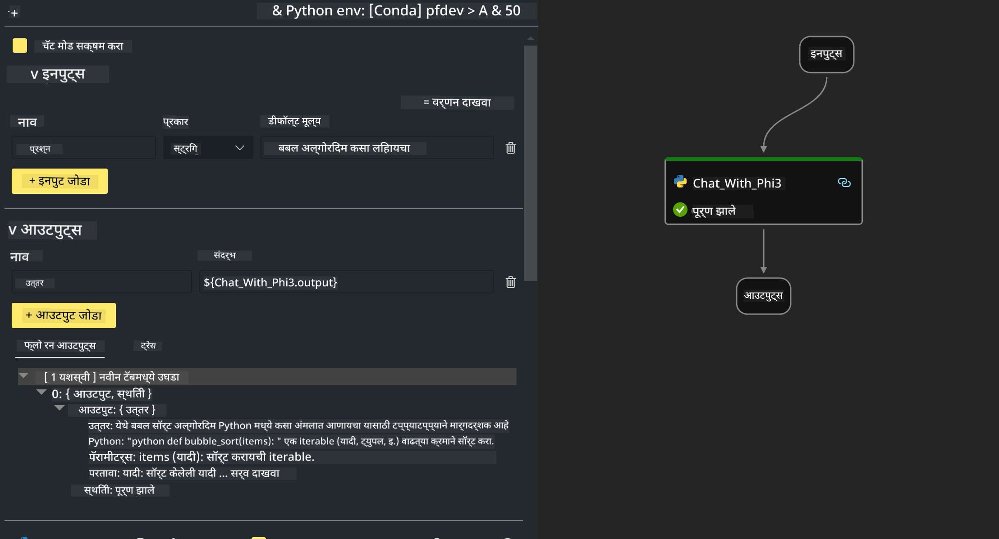

<!--
CO_OP_TRANSLATOR_METADATA:
{
  "original_hash": "3dbbf568625b1ee04b354c2dc81d3248",
  "translation_date": "2025-07-17T04:24:39+00:00",
  "source_file": "md/02.Application/02.Code/Phi3/VSCodeExt/HOL/Apple/02.PromptflowWithMLX.md",
  "language_code": "mr"
}
-->
# **Lab 2 - Phi-3-mini सह AIPC मध्ये Prompt flow चालवा**

## **Prompt flow म्हणजे काय**

Prompt flow ही LLM-आधारित AI अॅप्लिकेशन्सच्या संपूर्ण विकास चक्राला सुलभ करण्यासाठी तयार केलेली विकास साधनांची एक मालिका आहे, ज्यात कल्पना निर्माण, प्रोटोटायपिंग, चाचणी, मूल्यमापन, उत्पादन तैनाती आणि निरीक्षण यांचा समावेश आहे. हे prompt engineering खूप सोपे करते आणि तुम्हाला उत्पादन दर्जाच्या LLM अॅप्स तयार करण्यास मदत करते.

Prompt flow वापरून तुम्ही करू शकता:

- LLMs, prompts, Python कोड आणि इतर साधने एकत्र करून एक executable workflow तयार करा.

- तुमच्या flows चे डिबगिंग आणि पुनरावृत्ती करा, विशेषतः LLMs सोबतच्या संवादात सहजतेने.

- तुमच्या flows चे मूल्यमापन करा, मोठ्या डेटासेटसह गुणवत्ता आणि कार्यक्षमता मोजा.

- तुमच्या CI/CD प्रणालीमध्ये चाचणी आणि मूल्यमापन समाकलित करा जेणेकरून flow ची गुणवत्ता सुनिश्चित करता येईल.

- तुमचे flows तुम्ही निवडलेल्या सर्व्हिंग प्लॅटफॉर्मवर तैनात करा किंवा तुमच्या अॅपच्या कोड बेसमध्ये सहजपणे समाकलित करा.

- (ऐच्छिक पण अत्यंत शिफारस केलेले) Azure AI मधील Prompt flow च्या क्लाउड आवृत्तीचा वापर करून तुमच्या टीमसोबत सहकार्य करा.

## **Apple Silicon वर जनरेशन कोड फ्लोज तयार करणे**

***Note*** ：जर तुम्ही पर्यावरण स्थापना पूर्ण केले नसेल, तर कृपया [Lab 0 -Installations](./01.Installations.md) पहा

1. Visual Studio Code मध्ये Prompt flow Extension उघडा आणि एक रिकामा flow प्रोजेक्ट तयार करा


2. Inputs आणि Outputs पॅरामीटर्स जोडा आणि नवीन flow म्हणून Python Code जोडा



तुम्ही तुमचा flow तयार करण्यासाठी या रचनेचा (flow.dag.yaml) संदर्भ घेऊ शकता

```yaml

inputs:
  prompt:
    type: string
    default: Write python code for Fibonacci serie. Please use markdown as output
outputs:
  result:
    type: string
    reference: ${gen_code_by_phi3.output}
nodes:
- name: gen_code_by_phi3
  type: python
  source:
    type: code
    path: gen_code_by_phi3.py
  inputs:
    prompt: ${inputs.prompt}


```

3. phi-3-mini चे क्वांटिफाय करा

आम्हाला स्थानिक उपकरणांवर SLM चांगल्या प्रकारे चालवायचे आहे. सामान्यतः, आम्ही मॉडेलचे क्वांटिफिकेशन करतो (INT4, FP16, FP32)

```bash

python -m mlx_lm.convert --hf-path microsoft/Phi-3-mini-4k-instruct

```

**Note:** डीफॉल्ट फोल्डर mlx_model आहे

4. ***Chat_With_Phi3.py*** मध्ये कोड जोडा

```python


from promptflow import tool

from mlx_lm import load, generate


# The inputs section will change based on the arguments of the tool function, after you save the code
# Adding type to arguments and return value will help the system show the types properly
# Please update the function name/signature per need
@tool
def my_python_tool(prompt: str) -> str:

    model_id = './mlx_model_phi3_mini'

    model, tokenizer = load(model_id)

    # <|user|>\nWrite python code for Fibonacci serie. Please use markdown as output<|end|>\n<|assistant|>

    response = generate(model, tokenizer, prompt="<|user|>\n" + prompt  + "<|end|>\n<|assistant|>", max_tokens=2048, verbose=True)

    return response


```

4. तुम्ही Debug किंवा Run मधून flow ची चाचणी करू शकता, जनरेशन कोड योग्य आहे की नाही ते तपासण्यासाठी


5. टर्मिनलमध्ये विकास API म्हणून flow चालवा

```

pf flow serve --source ./ --port 8080 --host localhost   

```

तुम्ही हे Postman / Thunder Client मध्ये चाचणी करू शकता

### **Note**

1. पहिल्या वेळी चालवायला जास्त वेळ लागतो. Hugging face CLI वापरून phi-3 मॉडेल डाउनलोड करणे शिफारसीय आहे.

2. Intel NPU च्या मर्यादित संगणकीय क्षमतेचा विचार करता, Phi-3-mini-4k-instruct वापरणे शिफारसीय आहे.

3. आम्ही INT4 रूपांतरणासाठी Intel NPU Acceleration वापरतो, पण सेवा पुन्हा चालवायची असल्यास cache आणि nc_workshop फोल्डर्स हटवावे लागतील.

## **संसाधने**

1. Promptflow बद्दल जाणून घ्या [https://microsoft.github.io/promptflow/](https://microsoft.github.io/promptflow/)

2. Intel NPU Acceleration बद्दल जाणून घ्या [https://github.com/intel/intel-npu-acceleration-library](https://github.com/intel/intel-npu-acceleration-library)

3. नमुना कोड, डाउनलोड करा [Local NPU Agent Sample Code](../../../../../../../../../code/07.Lab/01/AIPC/local-npu-agent)

**अस्वीकरण**:  
हा दस्तऐवज AI अनुवाद सेवा [Co-op Translator](https://github.com/Azure/co-op-translator) वापरून अनुवादित केला आहे. आम्ही अचूकतेसाठी प्रयत्नशील असलो तरी, कृपया लक्षात घ्या की स्वयंचलित अनुवादांमध्ये चुका किंवा अचूकतेचा अभाव असू शकतो. मूळ दस्तऐवज त्याच्या स्थानिक भाषेत अधिकृत स्रोत मानला जावा. महत्त्वाच्या माहितीसाठी व्यावसायिक मानवी अनुवाद करण्याची शिफारस केली जाते. या अनुवादाच्या वापरामुळे उद्भवलेल्या कोणत्याही गैरसमजुती किंवा चुकीच्या अर्थलागी आम्ही जबाबदार नाही.