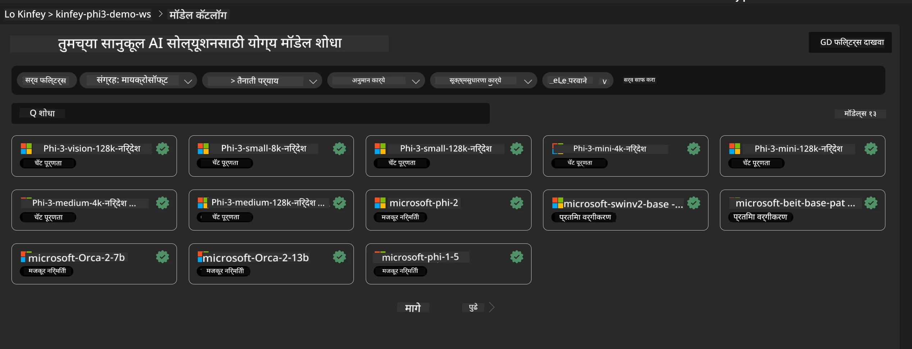

# **लॅब 3 - Azure Machine Learning Service वर Phi-3-vision तैनात करा**

आपण स्थानिक कोडच्या उत्पादन तैनातीसाठी NPU वापरतो, आणि नंतर त्याद्वारे PHI-3-VISION ची क्षमता आणू इच्छितो जेणेकरून चित्रांपासून कोड तयार करता येईल.

या परिचयात, आपण Azure Machine Learning Service मध्ये Model As Service Phi-3 Vision सेवा लवकर तयार करू शकतो.

***Note***： Phi-3 Vision ला जलद गतीने सामग्री तयार करण्यासाठी संगणकीय शक्तीची गरज असते. यासाठी आम्हाला क्लाउड संगणकीय शक्तीची मदत आवश्यक आहे.


### **1. Azure Machine Learning Service तयार करा**

आपल्याला Azure Portal मध्ये Azure Machine Learning Service तयार करावी लागेल. कसे करायचे ते जाणून घेण्यासाठी, कृपया हा दुवा पहा [https://learn.microsoft.com/azure/machine-learning/quickstart-create-resources?view=azureml-api-2](https://learn.microsoft.com/azure/machine-learning/quickstart-create-resources?view=azureml-api-2)


### **2. Azure Machine Learning Service मध्ये Phi-3 Vision निवडा**




### **3. Azure मध्ये Phi-3-Vision तैनात करा**


### **4. Postman मध्ये Endpoint चाचणी करा**


***Note***

1. पाठवायच्या पॅरामीटर्समध्ये Authorization, azureml-model-deployment, आणि Content-Type असणे आवश्यक आहे. हे मिळवण्यासाठी तैनातीची माहिती तपासा.

2. पॅरामीटर्स पाठवण्यासाठी, Phi-3-Vision ला प्रतिमेचा दुवा पाठवावा लागतो. कृपया GPT-4-Vision पद्धत पहा, जसे की

```json

{
  "input_data":{
    "input_string":[
      {
        "role":"user",
        "content":[ 
          {
            "type": "text",
            "text": "You are a Python coding assistant.Please create Python code for image "
          },
          {
              "type": "image_url",
              "image_url": {
                "url": "https://ajaytech.co/wp-content/uploads/2019/09/index.png"
              }
          }
        ]
      }
    ],
    "parameters":{
          "temperature": 0.6,
          "top_p": 0.9,
          "do_sample": false,
          "max_new_tokens": 2048
    }
  }
}

```

3. Post पद्धतीने **/score** कॉल करा

**अभिनंदन**! आपण जलद PHI-3-VISION तैनाती पूर्ण केली आहे आणि चित्रांपासून कोड तयार करण्याचा प्रयत्न केला आहे. पुढे, आपण NPU आणि क्लाउड्सच्या संयोजनाने अनुप्रयोग तयार करू शकतो.

**अस्वीकरण**:  
हा दस्तऐवज AI अनुवाद सेवा [Co-op Translator](https://github.com/Azure/co-op-translator) वापरून अनुवादित केला आहे. आम्ही अचूकतेसाठी प्रयत्नशील असलो तरी, कृपया लक्षात घ्या की स्वयंचलित अनुवादांमध्ये चुका किंवा अचूकतेची कमतरता असू शकते. मूळ दस्तऐवज त्याच्या स्थानिक भाषेत अधिकृत स्रोत मानला जावा. महत्त्वाच्या माहितीसाठी व्यावसायिक मानवी अनुवाद करण्याची शिफारस केली जाते. या अनुवादाच्या वापरामुळे उद्भवलेल्या कोणत्याही गैरसमजुती किंवा चुकीच्या अर्थलागी आम्ही जबाबदार नाही.