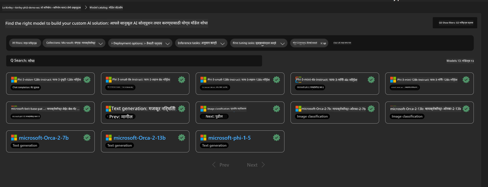
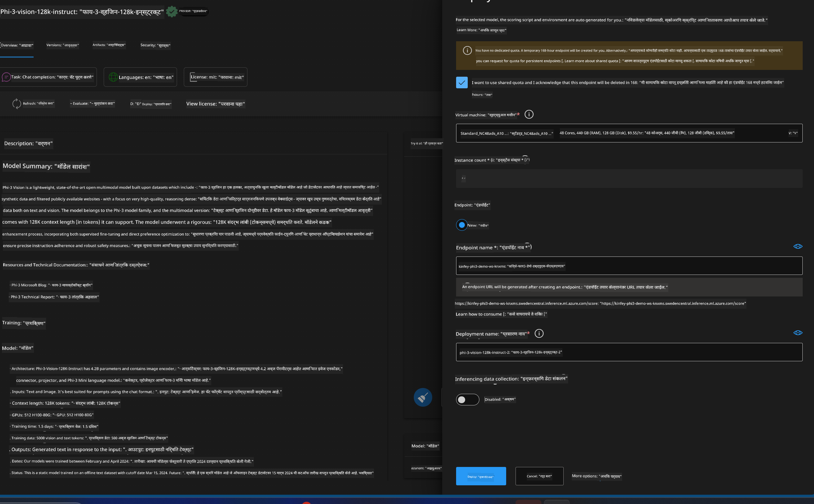
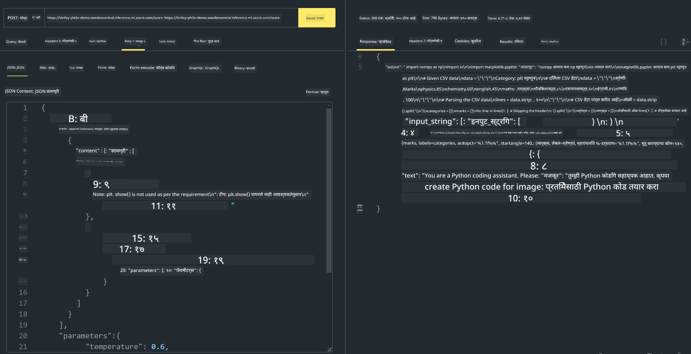

<!--
CO_OP_TRANSLATOR_METADATA:
{
  "original_hash": "20cb4e6ac1686248e8be913ccf6c2bc2",
  "translation_date": "2025-05-09T19:42:34+00:00",
  "source_file": "md/02.Application/02.Code/Phi3/VSCodeExt/HOL/Apple/03.DeployPhi3VisionOnAzure.md",
  "language_code": "mr"
}
-->
# **Lab 3 - Azure Machine Learning Service वर Phi-3-vision डिप्लॉय करा**

आम्ही NPU वापरून लोकल कोडचे उत्पादन डिप्लॉयमेंट पूर्ण करतो, आणि नंतर त्याद्वारे PHI-3-VISION ची क्षमता आणू इच्छितो जेणेकरून चित्रांमधून कोड तयार करता येईल.

या परिचयात, आपण Azure Machine Learning Service मध्ये Model As Service Phi-3 Vision सेवा लवकरात लवकर तयार करू शकतो.

***Note***： Phi-3 Vision ला वेगाने कंटेंट जनरेट करण्यासाठी गणनाशक्तीची गरज असते. यासाठी आम्हाला क्लाउड कंप्युटिंग पॉवरची मदत हवी असते.


### **1. Azure Machine Learning Service तयार करा**

आपल्याला Azure Portal मध्ये Azure Machine Learning Service तयार करावी लागेल. कशी तयार करायची हे जाणून घेण्यासाठी, कृपया हा लिंक पहा [https://learn.microsoft.com/azure/machine-learning/quickstart-create-resources?view=azureml-api-2](https://learn.microsoft.com/azure/machine-learning/quickstart-create-resources?view=azureml-api-2)


### **2. Azure Machine Learning Service मध्ये Phi-3 Vision निवडा**




### **3. Azure मध्ये Phi-3-Vision डिप्लॉय करा**





### **4. Postman मध्ये Endpoint ची चाचणी करा**





***Note***

1. पाठवायच्या पॅरामीटर्समध्ये Authorization, azureml-model-deployment, आणि Content-Type असणे आवश्यक आहे. हे मिळवण्यासाठी तुम्हाला डिप्लॉयमेंट माहिती तपासावी लागेल.

2. पॅरामीटर्स पाठवण्यासाठी, Phi-3-Vision ला image link पाठवावी लागते. पॅरामीटर्स कसे पाठवायचे यासाठी GPT-4-Vision चा संदर्भ घ्या, जसे की

```json

{
  "input_data":{
    "input_string":[
      {
        "role":"user",
        "content":[ 
          {
            "type": "text",
            "text": "You are a Python coding assistant.Please create Python code for image "
          },
          {
              "type": "image_url",
              "image_url": {
                "url": "https://ajaytech.co/wp-content/uploads/2019/09/index.png"
              }
          }
        ]
      }
    ],
    "parameters":{
          "temperature": 0.6,
          "top_p": 0.9,
          "do_sample": false,
          "max_new_tokens": 2048
    }
  }
}

```

3. Post पद्धतीने **/score** कॉल करा

**अभिनंदन**! तुम्ही PHI-3-VISION चे जलद डिप्लॉयमेंट पूर्ण केले आणि चित्रांमधून कोड तयार करण्याचा प्रयत्न केला. पुढे, आपण NPU आणि क्लाउडच्या संयोजनाने अॅप्लिकेशन्स तयार करू शकतो.

**अस्वीकरण**:  
हा दस्तऐवज AI अनुवाद सेवा [Co-op Translator](https://github.com/Azure/co-op-translator) चा वापर करून अनुवादित केला आहे. आम्ही अचूकतेसाठी प्रयत्न करतो, पण कृपया लक्षात ठेवा की स्वयंचलित अनुवादांमध्ये चुका किंवा अपूर्णता असू शकते. मूळ दस्तऐवज त्याच्या स्थानिक भाषेत अधिकृत स्रोत मानला पाहिजे. महत्त्वाच्या माहितीसाठी व्यावसायिक मानवी अनुवाद करण्याची शिफारस केली जाते. या अनुवादाचा वापर करून झालेल्या कोणत्याही गैरसमजुती किंवा चुकीसाठी आम्ही जबाबदार नाही.