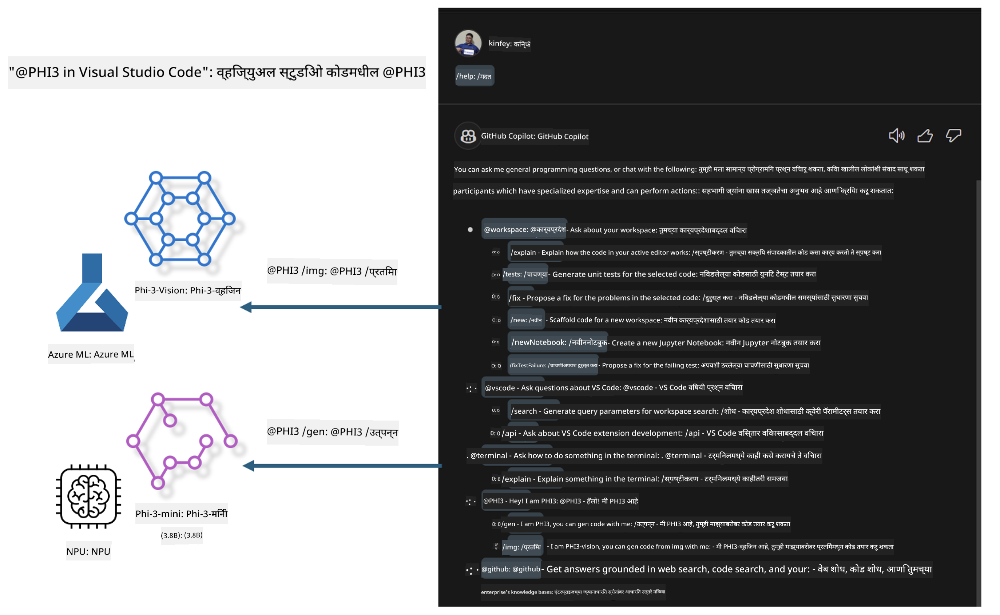

<!--
CO_OP_TRANSLATOR_METADATA:
{
  "original_hash": "00b7a699de8ac405fa821f4c0f7fc0ab",
  "translation_date": "2025-05-09T19:11:00+00:00",
  "source_file": "md/02.Application/02.Code/Phi3/VSCodeExt/README.md",
  "language_code": "mr"
}
-->
# **Microsoft Phi-3 कुटुंबासह आपला स्वतःचा Visual Studio Code GitHub Copilot Chat तयार करा**

GitHub Copilot Chat मधील workspace agent वापरला आहे का? आपला स्वतःचा टीमचा कोड एजंट तयार करू इच्छिता का? हा हँड्स-ऑन लॅब खुल्या स्रोत मॉडेलचा वापर करून एंटरप्राइझ स्तरावरील कोड बिझनेस एजंट तयार करण्याचा प्रयत्न करतो.

## **पायाभूत माहिती**

### **Microsoft Phi-3 का निवडायचा**

Phi-3 हा एक कुटुंब मालिका आहे, ज्यामध्ये phi-3-mini, phi-3-small, आणि phi-3-medium यांचा समावेश आहे, जे वेगवेगळ्या प्रशिक्षण पॅरामीटर्सवर आधारित आहेत जसे की मजकूर निर्मिती, संवाद पूर्ण करणे आणि कोड निर्मिती. तसेच Vision आधारित phi-3-vision देखील आहे. हे एंटरप्राइझ किंवा विविध टीम्ससाठी ऑफलाइन जनरेटिव्ह AI सोल्यूशन्स तयार करण्यासाठी योग्य आहे.

शिफारस केलेला वाचन दुवा [https://github.com/microsoft/PhiCookBook/blob/main/md/01.Introduction/01/01.PhiFamily.md](https://github.com/microsoft/PhiCookBook/blob/main/md/01.Introduction/01/01.PhiFamily.md)

### **Microsoft GitHub Copilot Chat**

GitHub Copilot Chat एक्स्टेंशन तुम्हाला एक चॅट इंटरफेस देते ज्याद्वारे तुम्ही GitHub Copilot सोबत संवाद साधू शकता आणि थेट VS Code मध्ये कोडिंग संबंधित प्रश्नांची उत्तरे मिळवू शकता, ज्यासाठी तुम्हाला दस्तऐवज किंवा ऑनलाइन फोरम शोधण्याची गरज नाही.

Copilot Chat मध्ये सिंटॅक्स हायलाइटिंग, इंडेंटेशन आणि इतर फॉरमॅटिंग वैशिष्ट्यांचा वापर करून उत्तर अधिक स्पष्ट करता येते. वापरकर्त्याच्या प्रश्नाच्या प्रकारानुसार, उत्तरामध्ये संदर्भ म्हणून वापरलेली फाइल्स किंवा दस्तऐवजांचे दुवे, किंवा VS Code ची कार्यक्षमता वापरण्यासाठी बटणे असू शकतात.

- Copilot Chat तुमच्या विकासक प्रवाहात समाकलित होते आणि जिथे गरज तिथे मदत करते:

- संपादक किंवा टर्मिनलमधून थेट इनलाइन चॅट संभाषण सुरू करा जेव्हा तुम्ही कोडिंग करत असाल

- Chat दृश्य वापरा जेथे AI सहाय्यक बाजूला आहे आणि कधीही मदत करू शकतो

- Quick Chat सुरू करा आणि लवकर प्रश्न विचारा, नंतर पुन्हा तुमच्या कामात मग्न व्हा

GitHub Copilot Chat विविध परिस्थितींमध्ये वापरू शकता, जसे की:

- समस्येचे सर्वोत्तम निराकरण कसे करावे यावर कोडिंग प्रश्नांची उत्तरे देणे

- दुसऱ्याच्या कोडचे स्पष्टीकरण देणे आणि सुधारणा सुचवणे

- कोड सुधारणा सुचवणे

- युनिट टेस्ट केस तयार करणे

- कोड दस्तऐवज तयार करणे

शिफारस केलेला वाचन दुवा [https://code.visualstudio.com/docs/copilot/copilot-chat](https://code.visualstudio.com/docs/copilot/copilot-chat?WT.mc_id=aiml-137032-kinfeylo)

### **Microsoft GitHub Copilot Chat @workspace**

Copilot Chat मध्ये **@workspace** चा संदर्भ देऊन तुम्ही तुमच्या संपूर्ण कोडबेसबद्दल प्रश्न विचारू शकता. प्रश्नावरून, Copilot संबंधित फाइल्स आणि चिन्हे बुद्धिमत्तेने शोधून त्याचा संदर्भ उत्तरात दुवे आणि कोड उदाहरणे म्हणून देतो.

तुमच्या प्रश्नाला उत्तर देण्यासाठी, **@workspace** त्या स्रोतांमधून शोध घेतो जेव्हा विकसक VS Code मध्ये कोडबेसमध्ये नेव्हिगेट करतो तेव्हा वापरतो:

- वर्कस्पेसमधील सर्व फाइल्स, .gitignore फाइलने दुर्लक्षित केल्या गेलेल्या फाइल्स वगळता

- फोल्डर आणि फाइल नावांसह डिरेक्टरी स्ट्रक्चर

- GitHub चा कोड शोध निर्देशांक, जर वर्कस्पेस GitHub रिपॉझिटरी असेल आणि कोड शोधाद्वारे अनुक्रमित असेल तर

- वर्कस्पेसमधील चिन्हे आणि व्याख्याने

- सध्या निवडलेला मजकूर किंवा सक्रिय संपादकातील दृश्यमान मजकूर

टीप: जर तुम्ही दुर्लक्षित फाइल उघडली असेल किंवा त्यातील मजकूर निवडला असेल तर .gitignore दुर्लक्षित केला जात नाही.

शिफारस केलेला वाचन दुवा [[https://code.visualstudio.com/docs/copilot/copilot-chat](https://code.visualstudio.com/docs/copilot/workspace-context?WT.mc_id=aiml-137032-kinfeylo)]

## **या लॅबबद्दल अधिक जाणून घ्या**

GitHub Copilot ने एंटरप्राइझच्या प्रोग्रामिंग कार्यक्षमतेत मोठी सुधारणा केली आहे, आणि प्रत्येक एंटरप्राइझ GitHub Copilot च्या संबंधित फंक्शन्स सानुकूलित करू इच्छिते. अनेक एंटरप्राइझने त्यांच्या स्वतःच्या व्यवसाय परिस्थिती आणि खुल्या स्रोत मॉडेलवर आधारित GitHub Copilot सारख्या कस्टम एक्स्टेंशन्स तयार केल्या आहेत. एंटरप्राइझसाठी, कस्टम एक्स्टेंशन्स नियंत्रित करणे सोपे असते, पण यामुळे वापरकर्ता अनुभवावर परिणाम होतो. GitHub Copilot सामान्य परिस्थिती आणि व्यावसायिकतेमध्ये अधिक सक्षम असल्याने, जर अनुभव सुसंगत ठेवता आला तर एंटरप्राइझसाठी स्वतःचा कस्टम एक्स्टेंशन तयार करणे चांगले राहील. GitHub Copilot Chat एंटरप्राइझसाठी चॅट अनुभव वाढवण्यासाठी संबंधित API पुरवते. सुसंगत अनुभव राखणे आणि सानुकूलित फंक्शन्स असणे हा चांगला वापरकर्ता अनुभव आहे.

हा लॅब मुख्यतः Phi-3 मॉडेलचा वापर करून स्थानिक NPU आणि Azure हायब्रिडसह GitHub Copilot Chat मध्ये कस्टम एजंट ***@PHI3*** तयार करतो, जे एंटरप्राइझ डेव्हलपर्सना कोड जनरेशन***(@PHI3 /gen)*** आणि प्रतिमांवर आधारित कोड जनरेट करण्यास ***(@PHI3 /img)*** मदत करते.

### ***टीप:***

हा लॅब सध्या Intel CPU आणि Apple Silicon च्या AIPC मध्ये राबवला जात आहे. आम्ही Qualcomm NPU ची आवृत्ती पुढे अपडेट करत राहू.

## **लॅब**

| नाव | वर्णन | AIPC | Apple |
| ------------ | ----------- | -------- |-------- |
| Lab0 - Installations(✅) | संबंधित वातावरण आणि इंस्टॉलेशन टूल्स कॉन्फिगर आणि इन्स्टॉल करा | [Go](./HOL/AIPC/01.Installations.md) |[Go](./HOL/Apple/01.Installations.md) |
| Lab1 - Run Prompt flow with Phi-3-mini (✅) | AIPC / Apple Silicon सह स्थानिक NPU वापरून Phi-3-mini द्वारे कोड जनरेशन तयार करा | [Go](./HOL/AIPC/02.PromptflowWithNPU.md) |  [Go](./HOL/Apple/02.PromptflowWithMLX.md) |
| Lab2 - Deploy Phi-3-vision on Azure Machine Learning Service(✅) | Azure Machine Learning Service च्या Model Catalog मधील Phi-3-vision प्रतिमा डिप्लॉय करून कोड जनरेट करा | [Go](./HOL/AIPC/03.DeployPhi3VisionOnAzure.md) |[Go](./HOL/Apple/03.DeployPhi3VisionOnAzure.md) |
| Lab3 - Create a @phi-3 agent in GitHub Copilot Chat(✅)  | GitHub Copilot Chat मध्ये कस्टम Phi-3 एजंट तयार करा जे कोड जनरेशन, ग्राफ जनरेशन कोड, RAG इत्यादी पूर्ण करते | [Go](./HOL/AIPC/04.CreatePhi3AgentInVSCode.md) | [Go](./HOL/Apple/04.CreatePhi3AgentInVSCode.md) |
| Sample Code (✅)  | सॅम्पल कोड डाउनलोड करा | [Go](../../../../../../../code/07.Lab/01/AIPC) | [Go](../../../../../../../code/07.Lab/01/Apple) |

## **संसाधने**

1. Phi-3 Cookbook [https://github.com/microsoft/Phi-3CookBook](https://github.com/microsoft/Phi-3CookBook)

2. GitHub Copilot बद्दल अधिक जाणून घ्या [https://learn.microsoft.com/training/paths/copilot/](https://learn.microsoft.com/training/paths/copilot/?WT.mc_id=aiml-137032-kinfeylo)

3. GitHub Copilot Chat बद्दल अधिक जाणून घ्या [https://learn.microsoft.com/training/paths/accelerate-app-development-using-github-copilot/](https://learn.microsoft.com/training/paths/accelerate-app-development-using-github-copilot/?WT.mc_id=aiml-137032-kinfeylo)

4. GitHub Copilot Chat API बद्दल अधिक जाणून घ्या [https://code.visualstudio.com/api/extension-guides/chat](https://code.visualstudio.com/api/extension-guides/chat?WT.mc_id=aiml-137032-kinfeylo)

5. Azure AI Foundry बद्दल अधिक जाणून घ्या [https://learn.microsoft.com/training/paths/create-custom-copilots-ai-studio/](https://learn.microsoft.com/training/paths/create-custom-copilots-ai-studio/?WT.mc_id=aiml-137032-kinfeylo)

6. Azure AI Foundry च्या Model Catalog बद्दल अधिक जाणून घ्या [https://learn.microsoft.com/azure/ai-studio/how-to/model-catalog-overview](https://learn.microsoft.com/azure/ai-studio/how-to/model-catalog-overview)

**अस्वीकरण**:  
हा दस्तऐवज AI अनुवाद सेवा [Co-op Translator](https://github.com/Azure/co-op-translator) वापरून अनुवादित केला आहे. आम्ही अचूकतेसाठी प्रयत्नशील असलो तरी, कृपया लक्षात ठेवा की स्वयंचलित अनुवादांमध्ये चुका किंवा अचूकतेचा अभाव असू शकतो. मूळ दस्तऐवज त्याच्या स्थानिक भाषेत अधिकृत स्रोत मानला जावा. महत्त्वाच्या माहितीसाठी व्यावसायिक मानवी अनुवादाची शिफारस केली जाते. या अनुवादाच्या वापरामुळे झालेल्या कोणत्याही गैरसमजुती किंवा चुकीच्या अर्थ लावणीबद्दल आम्ही जबाबदार नाही.