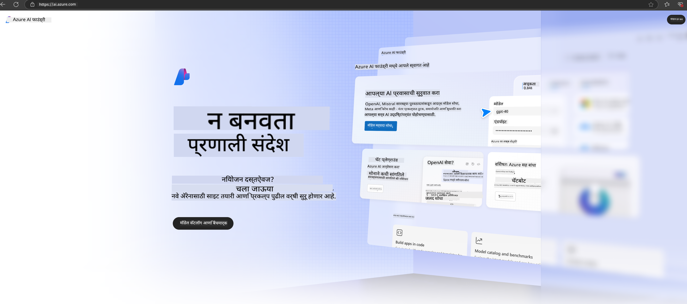

<!--
CO_OP_TRANSLATOR_METADATA:
{
  "original_hash": "3a1e48b628022485aac989c9f733e792",
  "translation_date": "2025-05-09T20:10:00+00:00",
  "source_file": "md/02.QuickStart/AzureAIFoundry_QuickStart.md",
  "language_code": "mr"
}
-->
# **Azure AI Foundry मध्ये Phi-3 चा वापर**

Generative AI च्या विकासामुळे, वेगवेगळ्या LLM आणि SLM, एंटरप्राइझ डेटा इंटिग्रेशन, फाइन-ट्यूनिंग/RAG ऑपरेशन्स, आणि LLM व SLM एकत्र केल्यानंतर विविध एंटरप्राइझ व्यवसायांचे मूल्यमापन करण्यासाठी एकसंध प्लॅटफॉर्म वापरण्याची अपेक्षा आहे, ज्यामुळे जनरेटिव्ह AI आधारित स्मार्ट अॅप्लिकेशन्स अधिक प्रभावीपणे राबवता येतील. [Azure AI Foundry](https://ai.azure.com) ही एंटरप्राइझ स्तरावरील जनरेटिव्ह AI अॅप्लिकेशन प्लॅटफॉर्म आहे.

Azure AI Foundry सह, तुम्ही मोठ्या भाषा मॉडेल (LLM) च्या प्रतिसादांचे मूल्यमापन करू शकता आणि prompt flow वापरून prompt अॅप्लिकेशन कॉम्पोनंट्सचे आयोजन करू शकता ज्यामुळे कार्यक्षमता वाढते. हे प्लॅटफॉर्म प्रूफ ऑफ कॉन्सेप्टपासून पूर्ण उत्पादनात सहजतेने रूपांतर करण्यासाठी स्केलेबिलिटी प्रदान करते. सतत मॉनिटरिंग आणि सुधारणा दीर्घकालीन यशासाठी मदत करतात.

आम्ही Azure AI Foundry वर Phi-3 मॉडेल पटकन सोप्या स्टेप्सद्वारे डिप्लॉय करू शकतो, आणि नंतर Azure AI Foundry चा वापर करून Phi-3 संबंधित Playground/Chat, फाइन-ट्यूनिंग, मूल्यमापन इत्यादी कामे पूर्ण करू शकतो.

## **1. तयारी**

जर तुमच्या मशीनवर आधीच [Azure Developer CLI](https://learn.microsoft.com/azure/developer/azure-developer-cli/overview?WT.mc_id=aiml-138114-kinfeylo) इन्स्टॉल असेल, तर या टेम्पलेटचा वापर नवीन डायरेक्टरीमध्ये हा कमांड चालवण्याइतका सोपा आहे.

## मॅन्युअल तयार करणे

Microsoft Azure AI Foundry प्रोजेक्ट आणि हब तयार करणे तुमच्या AI कामाचे आयोजन आणि व्यवस्थापन करण्याचा उत्तम मार्ग आहे. सुरुवात करण्यासाठी खालील स्टेप-बाय-स्टेप मार्गदर्शक आहे:

### Azure AI Foundry मध्ये प्रोजेक्ट तयार करणे

1. **Azure AI Foundry वर जा**: Azure AI Foundry पोर्टलमध्ये साइन इन करा.
2. **प्रोजेक्ट तयार करा**:
   - जर तुम्ही एखाद्या प्रोजेक्टमध्ये असाल, तर पानाच्या वरच्या डाव्या कोपर्‍यातील "Azure AI Foundry" निवडा ज्यामुळे होम पेजवर जाल.
   - "+ Create project" निवडा.
   - प्रोजेक्टसाठी नाव द्या.
   - जर तुमच्याकडे हब असेल, तर तो डिफॉल्टने निवडलेला असेल. जर तुमच्याकडे एकापेक्षा जास्त हबसाठी प्रवेश असेल, तर ड्रॉपडाऊनमधून दुसरा हब निवडू शकता. नवीन हब तयार करायचा असल्यास "Create new hub" निवडा आणि नाव द्या.
   - "Create" निवडा.

### Azure AI Foundry मध्ये हब तयार करणे

1. **Azure AI Foundry वर जा**: तुमच्या Azure खात्याने साइन इन करा.
2. **हब तयार करा**:
   - डाव्या मेनूमधून Management center निवडा.
   - "All resources" निवडा, नंतर "+ New project" च्या बाजूला असलेल्या खालील बाणावर क्लिक करा आणि "+ New hub" निवडा.
   - "Create a new hub" संवादात तुमच्या हबसाठी नाव द्या (उदा. contoso-hub) आणि इतर फील्ड्स इच्छेनुसार बदला.
   - "Next" निवडा, माहिती तपासा आणि नंतर "Create" वर क्लिक करा.

अधिक तपशीलांसाठी अधिकृत [Microsoft दस्तऐवज](https://learn.microsoft.com/azure/ai-studio/how-to/create-projects) पाहू शकता.

यशस्वी निर्मितीनंतर, तुम्ही [ai.azure.com](https://ai.azure.com/) वरून तयार केलेल्या स्टुडिओमध्ये प्रवेश करू शकता.

एका AI Foundry मध्ये एकापेक्षा जास्त प्रोजेक्ट असू शकतात. AI Foundry मध्ये प्रोजेक्ट तयार करा आणि तयारी करा.

Azure AI Foundry [QuickStarts](https://learn.microsoft.com/azure/ai-studio/quickstarts/get-started-code) तयार करा.

## **2. Azure AI Foundry मध्ये Phi मॉडेल डिप्लॉय करा**

प्रोजेक्टच्या Explore पर्यायावर क्लिक करा, Model Catalog मध्ये जा आणि Phi-3 निवडा

Phi-3-mini-4k-instruct निवडा

Phi-3-mini-4k-instruct मॉडेल डिप्लॉय करण्यासाठी 'Deploy' वर क्लिक करा

> [!NOTE]
>
> डिप्लॉय करताना तुम्ही कॉम्प्युटिंग पॉवर निवडू शकता

## **3. Azure AI Foundry मध्ये Playground Chat Phi**

डिप्लॉयमेंट पेजवर जा, Playground निवडा, आणि Azure AI Foundry च्या Phi-3 सोबत चॅट करा

## **4. Azure AI Foundry मधून मॉडेल डिप्लॉय करणे**

Azure Model Catalog मधून मॉडेल डिप्लॉय करण्यासाठी, खालील स्टेप्स फॉलो करा:

- Azure AI Foundry मध्ये साइन इन करा.
- Azure AI Foundry च्या मॉडेल कॅटलॉगमधून डिप्लॉय करायचे मॉडेल निवडा.
- मॉडेलच्या Details पेजवर Deploy निवडा आणि नंतर Serverless API with Azure AI Content Safety निवडा.
- तुमच्या प्रोजेक्टची निवड करा ज्यामध्ये तुम्हाला मॉडेल डिप्लॉय करायचे आहे. Serverless API वापरण्यासाठी, तुमच्या वर्कस्पेसला East US 2 किंवा Sweden Central क्षेत्रात असणे आवश्यक आहे. Deployment नाव सानुकूलित करू शकता.
- डिप्लॉयमेंट विजार्डमध्ये Pricing आणि terms वाचा ज्यामुळे किंमत आणि वापर अटी समजतील.
- Deploy निवडा. डिप्लॉयमेंट तयार होईपर्यंत थांबा आणि तुम्हाला Deployments पेजवर रीडायरेक्ट केले जाईल.
- Open in playground निवडा आणि मॉडेलशी संवाद सुरू करा.
- Deployments पेजवर परत जा, डिप्लॉयमेंट निवडा आणि endpoint चा Target URL आणि Secret Key लक्षात ठेवा, जे तुम्ही कॉल करून completions तयार करण्यासाठी वापरू शकता.
- Endpoint ची माहिती, URL आणि access keys नेहमी Build टॅबमध्ये Components सेक्शनमधील Deployments निवडून पाहू शकता.

> [!NOTE]
> कृपया लक्षात ठेवा की या स्टेप्ससाठी तुमच्या अकाउंटला Resource Group वर Azure AI Developer रोल परवानग्या असणे आवश्यक आहे.

## **5. Azure AI Foundry मध्ये Phi API वापरणे**

https://{Your project name}.region.inference.ml.azure.com/swagger.json या URL ला Postman GET द्वारे एक्सेस करू शकता आणि Key सोबत वापरून दिलेल्या इंटरफेसेसची माहिती मिळवू शकता.

तुम्हाला विनंतीचे पॅरामिटर्स तसेच प्रतिसादाचे पॅरामिटर्स खूप सोप्या पद्धतीने मिळतील.

**अस्वीकरण**:  
हा दस्तऐवज AI भाषांतर सेवा [Co-op Translator](https://github.com/Azure/co-op-translator) चा वापर करून भाषांतरित करण्यात आला आहे. आम्ही अचूकतेसाठी प्रयत्नशील असलो तरी, कृपया लक्षात घ्या की स्वयंचलित भाषांतरांमध्ये चुका किंवा अचूकतेत त्रुटी असू शकतात. मूळ दस्तऐवज त्याच्या स्थानिक भाषेत अधिकृत स्रोत मानला जावा. महत्त्वाची माहिती असल्यास, व्यावसायिक मानवी भाषांतर करण्याचा सल्ला दिला जातो. या भाषांतराचा वापर केल्यामुळे उद्भवणाऱ्या कोणत्याही गैरसमजुती किंवा चुकीच्या अर्थ लावण्याबद्दल आम्ही जबाबदार नाही.