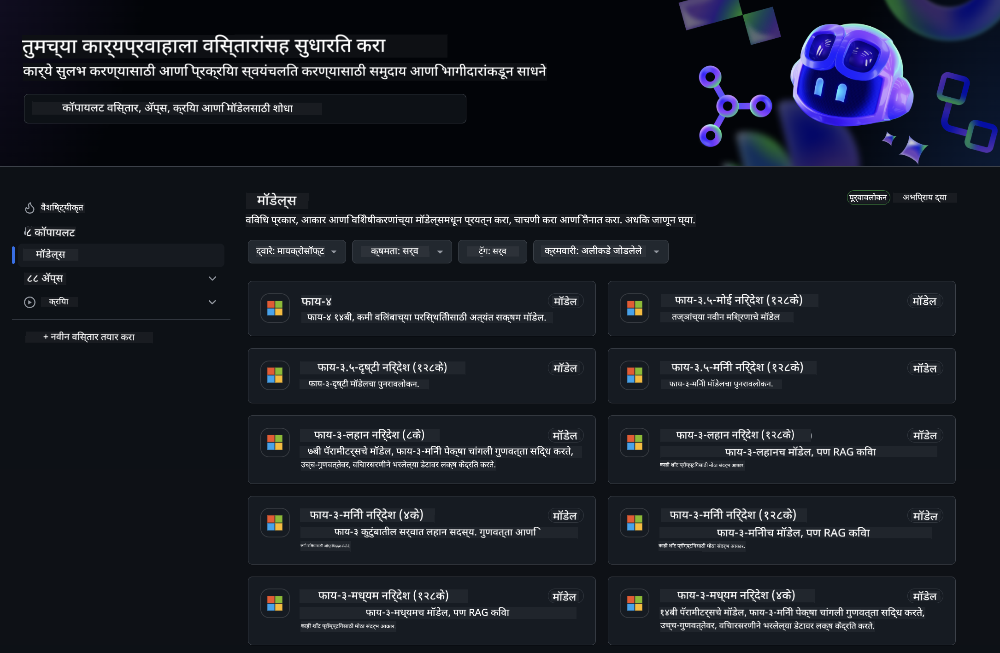
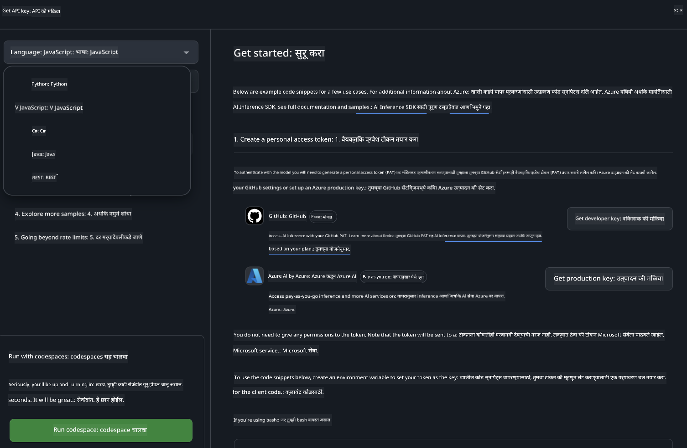
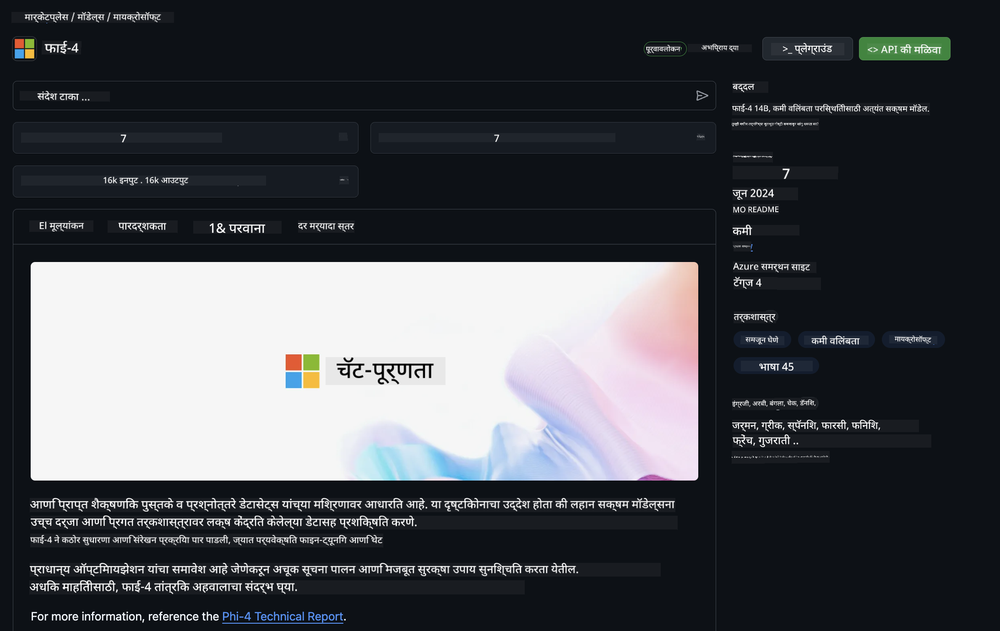

<!--
CO_OP_TRANSLATOR_METADATA:
{
  "original_hash": "5113634b77370af6790f9697d5d7de90",
  "translation_date": "2025-07-17T05:34:09+00:00",
  "source_file": "md/02.QuickStart/GitHubModel_QuickStart.md",
  "language_code": "mr"
}
-->
## GitHub Models - मर्यादित सार्वजनिक बीटा

[GitHub Models](https://github.com/marketplace/models) मध्ये आपले स्वागत आहे! Azure AI वर होस्ट केलेल्या AI मॉडेल्सचा शोध घेण्यासाठी सर्व काही तयार आहे.



GitHub Models वर उपलब्ध मॉडेल्सबद्दल अधिक माहितीसाठी, [GitHub Model Marketplace](https://github.com/marketplace/models) पहा.

## उपलब्ध मॉडेल्स

प्रत्येक मॉडेलसाठी एक समर्पित प्लेग्राउंड आणि नमुना कोड उपलब्ध आहे.


### GitHub Model Catalog मधील Phi-3 मॉडेल्स

[Phi-3-Medium-128k-Instruct](https://github.com/marketplace/models/azureml/Phi-3-medium-128k-instruct)

[Phi-3-medium-4k-instruct](https://github.com/marketplace/models/azureml/Phi-3-medium-4k-instruct)

[Phi-3-mini-128k-instruct](https://github.com/marketplace/models/azureml/Phi-3-mini-128k-instruct)

[Phi-3-mini-4k-instruct](https://github.com/marketplace/models/azureml/Phi-3-mini-4k-instruct)

[Phi-3-small-128k-instruct](https://github.com/marketplace/models/azureml/Phi-3-small-128k-instruct)

[Phi-3-small-8k-instruct](https://github.com/marketplace/models/azureml/Phi-3-small-8k-instruct)

## सुरुवात कशी करावी

आपल्यासाठी चालवायला तयार काही मूलभूत उदाहरणे आहेत. ती samples निर्देशिकेत सापडतील. आपली आवडती भाषा थेट वापरायची असल्यास, खालील भाषांमध्ये उदाहरणे उपलब्ध आहेत:

- Python
- JavaScript
- cURL

नमुने आणि मॉडेल्स चालवण्यासाठी एक समर्पित Codespaces Environment देखील आहे.



## नमुना कोड

खाली काही वापर प्रकरणांसाठी उदाहरण कोड स्निपेट्स दिले आहेत. Azure AI Inference SDK बद्दल अधिक माहितीसाठी, संपूर्ण दस्तऐवज आणि नमुने पहा.

## सेटअप

1. वैयक्तिक प्रवेश टोकन तयार करा  
टोकनसाठी कोणतीही परवानगी देण्याची गरज नाही. लक्षात ठेवा की टोकन Microsoft सेवेकडे पाठवले जाईल.

खालील कोड स्निपेट्स वापरण्यासाठी, आपल्या टोकनला क्लायंट कोडसाठी की म्हणून सेट करण्यासाठी पर्यावरणीय चल तयार करा.

जर आपण bash वापरत असाल:  
```
export GITHUB_TOKEN="<your-github-token-goes-here>"
```  
जर आपण powershell मध्ये असाल:  

```
$Env:GITHUB_TOKEN="<your-github-token-goes-here>"
```  

जर आपण Windows command prompt वापरत असाल:  

```
set GITHUB_TOKEN=<your-github-token-goes-here>
```  

## Python नमुना

### अवलंबित्वे इन्स्टॉल करा  
pip वापरून Azure AI Inference SDK इन्स्टॉल करा (आवश्यक: Python >=3.8):

```
pip install azure-ai-inference
```  
### मूलभूत कोड नमुना चालवा

हा नमुना chat completion API ला मूलभूत कॉल कसा करायचा हे दाखवतो. तो GitHub AI मॉडेल inference endpoint आणि आपला GitHub टोकन वापरत आहे. कॉल समक्रमित आहे.

```
import os
from azure.ai.inference import ChatCompletionsClient
from azure.ai.inference.models import SystemMessage, UserMessage
from azure.core.credentials import AzureKeyCredential

endpoint = "https://models.inference.ai.azure.com"
# Replace Model_Name 
model_name = "Phi-3-small-8k-instruct"
token = os.environ["GITHUB_TOKEN"]

client = ChatCompletionsClient(
    endpoint=endpoint,
    credential=AzureKeyCredential(token),
)

response = client.complete(
    messages=[
        SystemMessage(content="You are a helpful assistant."),
        UserMessage(content="What is the capital of France?"),
    ],
    model=model_name,
    temperature=1.,
    max_tokens=1000,
    top_p=1.
)

print(response.choices[0].message.content)
```

### बहु-चरण संभाषण चालवा

हा नमुना chat completion API सह बहु-चरण संभाषण कसे करायचे हे दाखवतो. चॅट अॅप्लिकेशनसाठी मॉडेल वापरताना, त्या संभाषणाचा इतिहास व्यवस्थापित करणे आणि नवीनतम संदेश मॉडेलला पाठवणे आवश्यक आहे.

```
import os
from azure.ai.inference import ChatCompletionsClient
from azure.ai.inference.models import AssistantMessage, SystemMessage, UserMessage
from azure.core.credentials import AzureKeyCredential

token = os.environ["GITHUB_TOKEN"]
endpoint = "https://models.inference.ai.azure.com"
# Replace Model_Name
model_name = "Phi-3-small-8k-instruct"

client = ChatCompletionsClient(
    endpoint=endpoint,
    credential=AzureKeyCredential(token),
)

messages = [
    SystemMessage(content="You are a helpful assistant."),
    UserMessage(content="What is the capital of France?"),
    AssistantMessage(content="The capital of France is Paris."),
    UserMessage(content="What about Spain?"),
]

response = client.complete(messages=messages, model=model_name)

print(response.choices[0].message.content)
```

### आउटपुट स्ट्रीम करा

चांगल्या वापरकर्ता अनुभवासाठी, मॉडेलचा प्रतिसाद स्ट्रीम करायचा आहे जेणेकरून पहिला टोकन लवकर दिसेल आणि लांब प्रतिसादासाठी वाट पाहावी लागणार नाही.

```
import os
from azure.ai.inference import ChatCompletionsClient
from azure.ai.inference.models import SystemMessage, UserMessage
from azure.core.credentials import AzureKeyCredential

token = os.environ["GITHUB_TOKEN"]
endpoint = "https://models.inference.ai.azure.com"
# Replace Model_Name
model_name = "Phi-3-small-8k-instruct"

client = ChatCompletionsClient(
    endpoint=endpoint,
    credential=AzureKeyCredential(token),
)

response = client.complete(
    stream=True,
    messages=[
        SystemMessage(content="You are a helpful assistant."),
        UserMessage(content="Give me 5 good reasons why I should exercise every day."),
    ],
    model=model_name,
)

for update in response:
    if update.choices:
        print(update.choices[0].delta.content or "", end="")

client.close()
```

## JavaScript

### अवलंबित्वे इन्स्टॉल करा

Node.js इन्स्टॉल करा.

खालील ओळी कॉपी करा आणि आपल्या फोल्डरमध्ये package.json नावाच्या फाईलमध्ये जतन करा.

```
{
  "type": "module",
  "dependencies": {
    "@azure-rest/ai-inference": "latest",
    "@azure/core-auth": "latest",
    "@azure/core-sse": "latest"
  }
}
```

टीप: @azure/core-sse फक्त तेव्हाच आवश्यक आहे जेव्हा आपण chat completions चा प्रतिसाद स्ट्रीम करता.

या फोल्डरमध्ये टर्मिनल उघडा आणि npm install चालवा.

खालील प्रत्येक कोड स्निपेटसाठी, सामग्री sample.js नावाच्या फाईलमध्ये कॉपी करा आणि node sample.js ने चालवा.

### मूलभूत कोड नमुना चालवा

हा नमुना chat completion API ला मूलभूत कॉल कसा करायचा हे दाखवतो. तो GitHub AI मॉडेल inference endpoint आणि आपला GitHub टोकन वापरत आहे. कॉल समक्रमित आहे.

```
import ModelClient from "@azure-rest/ai-inference";
import { AzureKeyCredential } from "@azure/core-auth";

const token = process.env["GITHUB_TOKEN"];
const endpoint = "https://models.inference.ai.azure.com";
// Update your modelname
const modelName = "Phi-3-small-8k-instruct";

export async function main() {

  const client = new ModelClient(endpoint, new AzureKeyCredential(token));

  const response = await client.path("/chat/completions").post({
    body: {
      messages: [
        { role:"system", content: "You are a helpful assistant." },
        { role:"user", content: "What is the capital of France?" }
      ],
      model: modelName,
      temperature: 1.,
      max_tokens: 1000,
      top_p: 1.
    }
  });

  if (response.status !== "200") {
    throw response.body.error;
  }
  console.log(response.body.choices[0].message.content);
}

main().catch((err) => {
  console.error("The sample encountered an error:", err);
});
```

### बहु-चरण संभाषण चालवा

हा नमुना chat completion API सह बहु-चरण संभाषण कसे करायचे हे दाखवतो. चॅट अॅप्लिकेशनसाठी मॉडेल वापरताना, त्या संभाषणाचा इतिहास व्यवस्थापित करणे आणि नवीनतम संदेश मॉडेलला पाठवणे आवश्यक आहे.

```
import ModelClient from "@azure-rest/ai-inference";
import { AzureKeyCredential } from "@azure/core-auth";

const token = process.env["GITHUB_TOKEN"];
const endpoint = "https://models.inference.ai.azure.com";
// Update your modelname
const modelName = "Phi-3-small-8k-instruct";

export async function main() {

  const client = new ModelClient(endpoint, new AzureKeyCredential(token));

  const response = await client.path("/chat/completions").post({
    body: {
      messages: [
        { role: "system", content: "You are a helpful assistant." },
        { role: "user", content: "What is the capital of France?" },
        { role: "assistant", content: "The capital of France is Paris." },
        { role: "user", content: "What about Spain?" },
      ],
      model: modelName,
    }
  });

  if (response.status !== "200") {
    throw response.body.error;
  }

  for (const choice of response.body.choices) {
    console.log(choice.message.content);
  }
}

main().catch((err) => {
  console.error("The sample encountered an error:", err);
});
```

### आउटपुट स्ट्रीम करा

चांगल्या वापरकर्ता अनुभवासाठी, मॉडेलचा प्रतिसाद स्ट्रीम करायचा आहे जेणेकरून पहिला टोकन लवकर दिसेल आणि लांब प्रतिसादासाठी वाट पाहावी लागणार नाही.

```
import ModelClient from "@azure-rest/ai-inference";
import { AzureKeyCredential } from "@azure/core-auth";
import { createSseStream } from "@azure/core-sse";

const token = process.env["GITHUB_TOKEN"];
const endpoint = "https://models.inference.ai.azure.com";
// Update your modelname
const modelName = "Phi-3-small-8k-instruct";

export async function main() {

  const client = new ModelClient(endpoint, new AzureKeyCredential(token));

  const response = await client.path("/chat/completions").post({
    body: {
      messages: [
        { role: "system", content: "You are a helpful assistant." },
        { role: "user", content: "Give me 5 good reasons why I should exercise every day." },
      ],
      model: modelName,
      stream: true
    }
  }).asNodeStream();

  const stream = response.body;
  if (!stream) {
    throw new Error("The response stream is undefined");
  }

  if (response.status !== "200") {
    stream.destroy();
    throw new Error(`Failed to get chat completions, http operation failed with ${response.status} code`);
  }

  const sseStream = createSseStream(stream);

  for await (const event of sseStream) {
    if (event.data === "[DONE]") {
      return;
    }
    for (const choice of (JSON.parse(event.data)).choices) {
        process.stdout.write(choice.delta?.content ?? ``);
    }
  }
}

main().catch((err) => {
  console.error("The sample encountered an error:", err);
});
```

## REST

### मूलभूत कोड नमुना चालवा

खालील शेलमध्ये पेस्ट करा:

```
curl -X POST "https://models.inference.ai.azure.com/chat/completions" \
    -H "Content-Type: application/json" \
    -H "Authorization: Bearer $GITHUB_TOKEN" \
    -d '{
        "messages": [
            {
                "role": "system",
                "content": "You are a helpful assistant."
            },
            {
                "role": "user",
                "content": "What is the capital of France?"
            }
        ],
        "model": "Phi-3-small-8k-instruct"
    }'
```

### बहु-चरण संभाषण चालवा

chat completion API कॉल करा आणि चॅट इतिहास पाठवा:

```
curl -X POST "https://models.inference.ai.azure.com/chat/completions" \
    -H "Content-Type: application/json" \
    -H "Authorization: Bearer $GITHUB_TOKEN" \
    -d '{
        "messages": [
            {
                "role": "system",
                "content": "You are a helpful assistant."
            },
            {
                "role": "user",
                "content": "What is the capital of France?"
            },
            {
                "role": "assistant",
                "content": "The capital of France is Paris."
            },
            {
                "role": "user",
                "content": "What about Spain?"
            }
        ],
        "model": "Phi-3-small-8k-instruct"
    }'
```

### आउटपुट स्ट्रीम करा

हे endpoint कॉल करून प्रतिसाद स्ट्रीम करण्याचे उदाहरण आहे.

```
curl -X POST "https://models.inference.ai.azure.com/chat/completions" \
    -H "Content-Type: application/json" \
    -H "Authorization: Bearer $GITHUB_TOKEN" \
    -d '{
        "messages": [
            {
                "role": "system",
                "content": "You are a helpful assistant."
            },
            {
                "role": "user",
                "content": "Give me 5 good reasons why I should exercise every day."
            }
        ],
        "stream": true,
        "model": "Phi-3-small-8k-instruct"
    }'
```

## GitHub Models साठी मोफत वापर आणि दर मर्यादा



[प्लेग्राउंड आणि मोफत API वापरासाठी दर मर्यादा](https://docs.github.com/en/github-models/prototyping-with-ai-models#rate-limits) आपल्याला मॉडेल्ससह प्रयोग करण्यास आणि आपले AI अॅप्लिकेशन प्रोटोटाइप करण्यास मदत करण्यासाठी आहेत. या मर्यादेपलीकडे वापरासाठी, आणि आपले अॅप्लिकेशन स्केल करण्यासाठी, आपल्याला Azure खात्यातून संसाधने प्रदान करावी लागतील आणि GitHub वैयक्तिक प्रवेश टोकनऐवजी तिथून प्रमाणीकरण करावे लागेल. आपल्या कोडमध्ये इतर काहीही बदल करण्याची गरज नाही. Azure AI मध्ये मोफत स्तराच्या मर्यादेपलीकडे जाण्यासाठी हा दुवा वापरा.

### सूचना

मॉडेलशी संवाद साधताना लक्षात ठेवा की आपण AI सह प्रयोग करत आहात, त्यामुळे सामग्रीतील चुका होऊ शकतात.

ही सुविधा विविध मर्यादांखाली (जसे की प्रति मिनिट विनंत्या, प्रति दिवस विनंत्या, विनंतीतील टोकन्स, आणि एकाच वेळी विनंत्या) कार्य करते आणि उत्पादन वापरासाठी डिझाइन केलेली नाही.

GitHub Models Azure AI Content Safety वापरते. GitHub Models अनुभवाचा भाग म्हणून हे फिल्टर्स बंद करता येत नाहीत. जर आपण पैसे भरून सेवा वापरत असाल, तर कृपया आपल्या सामग्री फिल्टर्स आपल्या गरजेनुसार कॉन्फिगर करा.

ही सेवा GitHub च्या प्री-रिलीज अटींअंतर्गत आहे.

**अस्वीकरण**:  
हा दस्तऐवज AI अनुवाद सेवा [Co-op Translator](https://github.com/Azure/co-op-translator) वापरून अनुवादित केला आहे. आम्ही अचूकतेसाठी प्रयत्नशील असलो तरी, कृपया लक्षात घ्या की स्वयंचलित अनुवादांमध्ये चुका किंवा अचूकतेची कमतरता असू शकते. मूळ दस्तऐवज त्याच्या स्थानिक भाषेत अधिकृत स्रोत मानला जावा. महत्त्वाच्या माहितीसाठी व्यावसायिक मानवी अनुवाद करण्याची शिफारस केली जाते. या अनुवादाच्या वापरामुळे उद्भवणाऱ्या कोणत्याही गैरसमजुती किंवा चुकीच्या अर्थलागी आम्ही जबाबदार नाही.