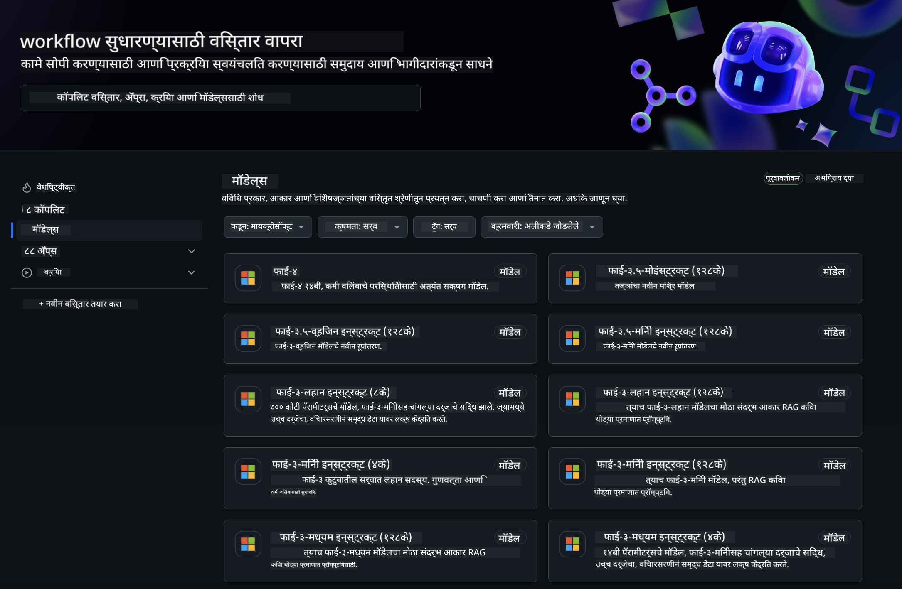

<!--
CO_OP_TRANSLATOR_METADATA:
{
  "original_hash": "5113634b77370af6790f9697d5d7de90",
  "translation_date": "2025-05-09T20:16:10+00:00",
  "source_file": "md/02.QuickStart/GitHubModel_QuickStart.md",
  "language_code": "mr"
}
-->
## GitHub मॉडेल्स - लिमिटेड पब्लिक बीटा

[GitHub Models](https://github.com/marketplace/models) मध्ये तुमचे स्वागत आहे! Azure AI वर होस्ट केलेले AI मॉडेल्स एक्सप्लोर करण्यासाठी सर्व काही तयार आहे.



GitHub Models वर उपलब्ध मॉडेल्स विषयी अधिक माहितीसाठी, [GitHub Model Marketplace](https://github.com/marketplace/models) पाहा

## उपलब्ध मॉडेल्स

प्रत्येक मॉडेलसाठी समर्पित प्लेग्राउंड आणि सॅम्पल कोड उपलब्ध आहे


### GitHub Model Catalog मधील Phi-3 मॉडेल्स

[Phi-3-Medium-128k-Instruct](https://github.com/marketplace/models/azureml/Phi-3-medium-128k-instruct)

[Phi-3-medium-4k-instruct](https://github.com/marketplace/models/azureml/Phi-3-medium-4k-instruct)

[Phi-3-mini-128k-instruct](https://github.com/marketplace/models/azureml/Phi-3-mini-128k-instruct)

[Phi-3-mini-4k-instruct](https://github.com/marketplace/models/azureml/Phi-3-mini-4k-instruct)

[Phi-3-small-128k-instruct](https://github.com/marketplace/models/azureml/Phi-3-small-128k-instruct)

[Phi-3-small-8k-instruct](https://github.com/marketplace/models/azureml/Phi-3-small-8k-instruct)

## सुरूवात कशी करावी

तुमच्यासाठी काही बेसिक उदाहरणे तयार आहेत जी तुम्ही चालवू शकता. ती samples डिरेक्टरीमध्ये मिळतील. जर तुम्हाला तुमच्या आवडत्या भाषेकडे थेट जायचे असेल, तर खालील भाषांमध्ये उदाहरणे आहेत:

- Python
- JavaScript
- cURL

सॅम्पल्स आणि मॉडेल्स चालवण्यासाठी एक समर्पित Codespaces Environment देखील आहे.


## सॅम्पल कोड

खाली काही उपयोगाच्या बाबतीत उदाहरणे दिली आहेत. Azure AI Inference SDK बद्दल अधिक माहितीसाठी, पूर्ण दस्तऐवज आणि सॅम्पल्स पाहा.

## सेटअप

1. पर्सनल अॅक्सेस टोकन तयार करा  
टोकनसाठी कोणतीही परवानगी देण्याची गरज नाही. लक्षात ठेवा की टोकन Microsoft सेवेपर्यंत पाठवले जाईल.

खालील कोड स्निपेट्स वापरण्यासाठी, तुमचा टोकन क्लायंट कोडसाठी की म्हणून सेट करण्यासाठी पर्यावरण चल तयार करा.

जर तुम्ही bash वापरत असाल:  
```
export GITHUB_TOKEN="<your-github-token-goes-here>"
```  
जर तुम्ही powershell मध्ये असाल:  

```
$Env:GITHUB_TOKEN="<your-github-token-goes-here>"
```  

जर तुम्ही Windows कमांड प्रॉम्प्ट वापरत असाल:  

```
set GITHUB_TOKEN=<your-github-token-goes-here>
```  

## Python सॅम्पल

### Dependencies इन्स्टॉल करा  
pip वापरून Azure AI Inference SDK इन्स्टॉल करा (आवश्यक: Python >=3.8):  

```
pip install azure-ai-inference
```  
### बेसिक कोड सॅम्पल चालवा

हा सॅम्पल chat completion API ला बेसिक कॉल कसा करायचा ते दाखवतो. GitHub AI मॉडेल इन्फरन्स एंडपॉइंट आणि तुमचा GitHub टोकन वापरला जात आहे. कॉल सिंक्रोनस आहे.

```
import os
from azure.ai.inference import ChatCompletionsClient
from azure.ai.inference.models import SystemMessage, UserMessage
from azure.core.credentials import AzureKeyCredential

endpoint = "https://models.inference.ai.azure.com"
# Replace Model_Name 
model_name = "Phi-3-small-8k-instruct"
token = os.environ["GITHUB_TOKEN"]

client = ChatCompletionsClient(
    endpoint=endpoint,
    credential=AzureKeyCredential(token),
)

response = client.complete(
    messages=[
        SystemMessage(content="You are a helpful assistant."),
        UserMessage(content="What is the capital of France?"),
    ],
    model=model_name,
    temperature=1.,
    max_tokens=1000,
    top_p=1.
)

print(response.choices[0].message.content)
```

### मल्टी-टर्न संभाषण चालवा

हा सॅम्पल chat completion API सह मल्टी-टर्न संभाषण कसे करायचे ते दाखवतो. चॅट अॅपसाठी मॉडेल वापरताना, तुम्हाला त्या संभाषणाचा इतिहास सांभाळावा लागेल आणि नवीनतम संदेश मॉडेलला पाठवावे लागतील.

```
import os
from azure.ai.inference import ChatCompletionsClient
from azure.ai.inference.models import AssistantMessage, SystemMessage, UserMessage
from azure.core.credentials import AzureKeyCredential

token = os.environ["GITHUB_TOKEN"]
endpoint = "https://models.inference.ai.azure.com"
# Replace Model_Name
model_name = "Phi-3-small-8k-instruct"

client = ChatCompletionsClient(
    endpoint=endpoint,
    credential=AzureKeyCredential(token),
)

messages = [
    SystemMessage(content="You are a helpful assistant."),
    UserMessage(content="What is the capital of France?"),
    AssistantMessage(content="The capital of France is Paris."),
    UserMessage(content="What about Spain?"),
]

response = client.complete(messages=messages, model=model_name)

print(response.choices[0].message.content)
```

### आउटपुट स्ट्रीम करा

चांगल्या वापरकर्ता अनुभवासाठी, तुम्हाला मॉडेलचा प्रतिसाद स्ट्रीम करायचा आहे जेणेकरून पहिला टोकन लवकर दिसेल आणि लांब प्रतिसादाची वाट पाहावी लागणार नाही.

```
import os
from azure.ai.inference import ChatCompletionsClient
from azure.ai.inference.models import SystemMessage, UserMessage
from azure.core.credentials import AzureKeyCredential

token = os.environ["GITHUB_TOKEN"]
endpoint = "https://models.inference.ai.azure.com"
# Replace Model_Name
model_name = "Phi-3-small-8k-instruct"

client = ChatCompletionsClient(
    endpoint=endpoint,
    credential=AzureKeyCredential(token),
)

response = client.complete(
    stream=True,
    messages=[
        SystemMessage(content="You are a helpful assistant."),
        UserMessage(content="Give me 5 good reasons why I should exercise every day."),
    ],
    model=model_name,
)

for update in response:
    if update.choices:
        print(update.choices[0].delta.content or "", end="")

client.close()
```

## JavaScript

### Dependencies इन्स्टॉल करा

Node.js इन्स्टॉल करा.

खालील ओळी कॉपी करा आणि तुमच्या फोल्डरमध्ये package.json नावाच्या फाइलमध्ये सेव्ह करा.

```
{
  "type": "module",
  "dependencies": {
    "@azure-rest/ai-inference": "latest",
    "@azure/core-auth": "latest",
    "@azure/core-sse": "latest"
  }
}
```

टीप: @azure/core-sse फक्त तेव्हाच आवश्यक आहे जेव्हा तुम्ही chat completions चा प्रतिसाद स्ट्रीम करता.

या फोल्डरमध्ये टर्मिनल उघडा आणि npm install चालवा.

खालील प्रत्येक कोड स्निपेटसाठी, कंटेंट sample.js नावाच्या फाइलमध्ये कॉपी करा आणि node sample.js वापरून चालवा.

### बेसिक कोड सॅम्पल चालवा

हा सॅम्पल chat completion API ला बेसिक कॉल कसा करायचा ते दाखवतो. GitHub AI मॉडेल इन्फरन्स एंडपॉइंट आणि तुमचा GitHub टोकन वापरला जात आहे. कॉल सिंक्रोनस आहे.

```
import ModelClient from "@azure-rest/ai-inference";
import { AzureKeyCredential } from "@azure/core-auth";

const token = process.env["GITHUB_TOKEN"];
const endpoint = "https://models.inference.ai.azure.com";
// Update your modelname
const modelName = "Phi-3-small-8k-instruct";

export async function main() {

  const client = new ModelClient(endpoint, new AzureKeyCredential(token));

  const response = await client.path("/chat/completions").post({
    body: {
      messages: [
        { role:"system", content: "You are a helpful assistant." },
        { role:"user", content: "What is the capital of France?" }
      ],
      model: modelName,
      temperature: 1.,
      max_tokens: 1000,
      top_p: 1.
    }
  });

  if (response.status !== "200") {
    throw response.body.error;
  }
  console.log(response.body.choices[0].message.content);
}

main().catch((err) => {
  console.error("The sample encountered an error:", err);
});
```

### मल्टी-टर्न संभाषण चालवा

हा सॅम्पल chat completion API सह मल्टी-टर्न संभाषण कसे करायचे ते दाखवतो. चॅट अॅपसाठी मॉडेल वापरताना, तुम्हाला त्या संभाषणाचा इतिहास सांभाळावा लागेल आणि नवीनतम संदेश मॉडेलला पाठवावे लागतील.

```
import ModelClient from "@azure-rest/ai-inference";
import { AzureKeyCredential } from "@azure/core-auth";

const token = process.env["GITHUB_TOKEN"];
const endpoint = "https://models.inference.ai.azure.com";
// Update your modelname
const modelName = "Phi-3-small-8k-instruct";

export async function main() {

  const client = new ModelClient(endpoint, new AzureKeyCredential(token));

  const response = await client.path("/chat/completions").post({
    body: {
      messages: [
        { role: "system", content: "You are a helpful assistant." },
        { role: "user", content: "What is the capital of France?" },
        { role: "assistant", content: "The capital of France is Paris." },
        { role: "user", content: "What about Spain?" },
      ],
      model: modelName,
    }
  });

  if (response.status !== "200") {
    throw response.body.error;
  }

  for (const choice of response.body.choices) {
    console.log(choice.message.content);
  }
}

main().catch((err) => {
  console.error("The sample encountered an error:", err);
});
```

### आउटपुट स्ट्रीम करा

चांगल्या वापरकर्ता अनुभवासाठी, तुम्हाला मॉडेलचा प्रतिसाद स्ट्रीम करायचा आहे जेणेकरून पहिला टोकन लवकर दिसेल आणि लांब प्रतिसादाची वाट पाहावी लागणार नाही.

```
import ModelClient from "@azure-rest/ai-inference";
import { AzureKeyCredential } from "@azure/core-auth";
import { createSseStream } from "@azure/core-sse";

const token = process.env["GITHUB_TOKEN"];
const endpoint = "https://models.inference.ai.azure.com";
// Update your modelname
const modelName = "Phi-3-small-8k-instruct";

export async function main() {

  const client = new ModelClient(endpoint, new AzureKeyCredential(token));

  const response = await client.path("/chat/completions").post({
    body: {
      messages: [
        { role: "system", content: "You are a helpful assistant." },
        { role: "user", content: "Give me 5 good reasons why I should exercise every day." },
      ],
      model: modelName,
      stream: true
    }
  }).asNodeStream();

  const stream = response.body;
  if (!stream) {
    throw new Error("The response stream is undefined");
  }

  if (response.status !== "200") {
    stream.destroy();
    throw new Error(`Failed to get chat completions, http operation failed with ${response.status} code`);
  }

  const sseStream = createSseStream(stream);

  for await (const event of sseStream) {
    if (event.data === "[DONE]") {
      return;
    }
    for (const choice of (JSON.parse(event.data)).choices) {
        process.stdout.write(choice.delta?.content ?? ``);
    }
  }
}

main().catch((err) => {
  console.error("The sample encountered an error:", err);
});
```

## REST

### बेसिक कोड सॅम्पल चालवा

खालील शेलमध्ये पेस्ट करा:

```
curl -X POST "https://models.inference.ai.azure.com/chat/completions" \
    -H "Content-Type: application/json" \
    -H "Authorization: Bearer $GITHUB_TOKEN" \
    -d '{
        "messages": [
            {
                "role": "system",
                "content": "You are a helpful assistant."
            },
            {
                "role": "user",
                "content": "What is the capital of France?"
            }
        ],
        "model": "Phi-3-small-8k-instruct"
    }'
```

### मल्टी-टर्न संभाषण चालवा

chat completion API कॉल करा आणि चॅट इतिहास पाठवा:

```
curl -X POST "https://models.inference.ai.azure.com/chat/completions" \
    -H "Content-Type: application/json" \
    -H "Authorization: Bearer $GITHUB_TOKEN" \
    -d '{
        "messages": [
            {
                "role": "system",
                "content": "You are a helpful assistant."
            },
            {
                "role": "user",
                "content": "What is the capital of France?"
            },
            {
                "role": "assistant",
                "content": "The capital of France is Paris."
            },
            {
                "role": "user",
                "content": "What about Spain?"
            }
        ],
        "model": "Phi-3-small-8k-instruct"
    }'
```

### आउटपुट स्ट्रीम करा

हे एंडपॉइंट कॉल करून प्रतिसाद स्ट्रीम करण्याचे उदाहरण आहे.

```
curl -X POST "https://models.inference.ai.azure.com/chat/completions" \
    -H "Content-Type: application/json" \
    -H "Authorization: Bearer $GITHUB_TOKEN" \
    -d '{
        "messages": [
            {
                "role": "system",
                "content": "You are a helpful assistant."
            },
            {
                "role": "user",
                "content": "Give me 5 good reasons why I should exercise every day."
            }
        ],
        "stream": true,
        "model": "Phi-3-small-8k-instruct"
    }'
```

## GitHub Models साठी मोफत वापर आणि दर मर्यादा


[प्लेग्राउंड आणि मोफत API वापरासाठी दर मर्यादा](https://docs.github.com/en/github-models/prototyping-with-ai-models#rate-limits) तुम्हाला मॉडेल्सची चाचणी करण्यासाठी आणि AI अॅप्लिकेशन प्रोटोटाइप करण्यासाठी मदत करतात. या मर्यादेपलीकडे वापरासाठी, आणि तुमचे अॅप्लिकेशन स्केल करण्यासाठी, तुम्हाला Azure अकाउंटमधून संसाधने प्राव्हिजन करावी लागतील आणि तिथून प्रमाणित करावे लागेल, GitHub पर्सनल अॅक्सेस टोकनऐवजी. तुमच्या कोडमध्ये काहीही बदल करण्याची गरज नाही. मोफत टियर मर्यादेपलीकडे जाण्यासाठी Azure AI मध्ये कसे करायचे ते जाणून घेण्यासाठी हा दुवा वापरा.

### सूचना

मॉडेलशी संवाद साधताना लक्षात ठेवा की तुम्ही AI शी प्रयोग करत आहात, त्यामुळे चुकीचे किंवा अयोग्य कंटेंट येऊ शकतो.

ही सुविधा विविध मर्यादांखाली (जसे की प्रति मिनिट विनंत्या, प्रति दिवस विनंत्या, प्रति विनंती टोकन्स, आणि एकाच वेळी विनंत्या) कार्य करते आणि उत्पादन वापरासाठी तयार केलेली नाही.

GitHub Models मध्ये Azure AI Content Safety वापरले जाते. GitHub Models अनुभवाचा भाग म्हणून हे फिल्टर्स बंद करता येत नाहीत. जर तुम्ही पैसे भरून सेवा वापरत असाल, तर कृपया तुमच्या गरजेनुसार कंटेंट फिल्टर्स कॉन्फिगर करा.

ही सेवा GitHub च्या प्री-रिलीज अटींअंतर्गत आहे.

**अस्वीकरण**:  
हा दस्तऐवज AI अनुवाद सेवा [Co-op Translator](https://github.com/Azure/co-op-translator) वापरून अनुवादित केला आहे. आम्ही अचूकतेसाठी प्रयत्न करतो, तरी कृपया लक्षात ठेवा की स्वयंचलित अनुवादांमध्ये चुका किंवा अचूकतेची कमतरता असू शकते. मूळ दस्तऐवज त्याच्या मूळ भाषेत अधिकृत स्रोत मानला जावा. महत्त्वाच्या माहितीसाठी व्यावसायिक मानवी अनुवादाची शिफारस केली जाते. या अनुवादाच्या वापरामुळे उद्भवणाऱ्या कोणत्याही गैरसमजुतींसाठी किंवा चुकीच्या अर्थ लावण्यांसाठी आम्ही जबाबदार नाही.