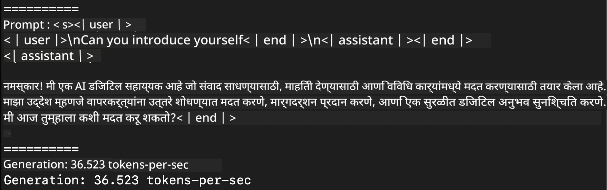
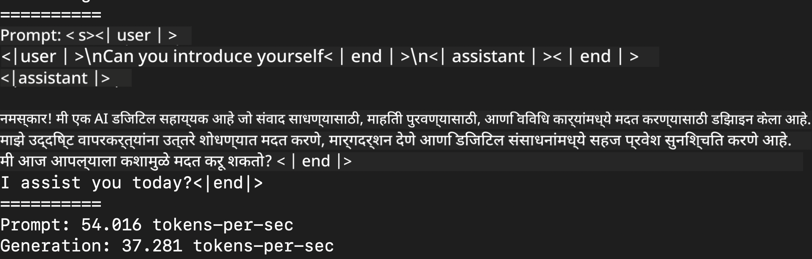
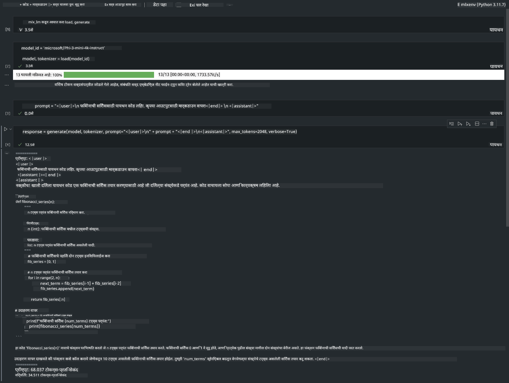

<!--
CO_OP_TRANSLATOR_METADATA:
{
  "original_hash": "dcb656f3d206fc4968e236deec5d4384",
  "translation_date": "2025-05-09T22:30:46+00:00",
  "source_file": "md/03.FineTuning/03.Inference/MLX_Inference.md",
  "language_code": "mr"
}
-->
# **Inference Phi-3 with Apple MLX Framework**

## **MLX Framework म्हणजे काय**

MLX हा Apple सिलिकॉनवर मशीन लर्निंग संशोधनासाठी तयार केलेला एक array फ्रेमवर्क आहे, जो Apple मशीन लर्निंग संशोधनाद्वारे सादर केला गेला आहे.

MLX मशीन लर्निंग संशोधकांसाठी मशीन लर्निंग संशोधकांनी डिझाइन केलेला आहे. हा फ्रेमवर्क वापरण्यास सोपा असण्याचा उद्देश आहे, पण तरीही मॉडेल ट्रेनिंग आणि डिप्लॉयमेंटसाठी कार्यक्षम आहे. फ्रेमवर्कचा डिझाइन संकल्पनात्मकदृष्ट्या सोपा आहे. संशोधकांना MLX सहजपणे विस्तारण्यास आणि सुधारण्यास मदत करण्यासाठी आम्ही हे तयार केले आहे, ज्यामुळे नवीन कल्पना लवकरच एक्सप्लोर करता येतील.

LLMs Apple सिलिकॉन डिव्हाइसेसवर MLX द्वारे जलद चालवता येतात, आणि मॉडेल्स स्थानिकपणे खूप सोप्या पद्धतीने रन करता येतात.

## **MLX वापरून Phi-3-mini चे inference कसे करावे**

### **1. आपले MLX वातावरण सेट करा**

1. Python 3.11.x
2. MLX लायब्ररी इन्स्टॉल करा

```bash

pip install mlx-lm

```

### **2. टर्मिनलमध्ये MLX वापरून Phi-3-mini चालवा**

```bash

python -m mlx_lm.generate --model microsoft/Phi-3-mini-4k-instruct --max-token 2048 --prompt  "<|user|>\nCan you introduce yourself<|end|>\n<|assistant|>"

```

परिणाम (माझे वातावरण Apple M1 Max, 64GB आहे)



### **3. टर्मिनलमध्ये MLX वापरून Phi-3-mini चे क्वांटायझेशन करा**

```bash

python -m mlx_lm.convert --hf-path microsoft/Phi-3-mini-4k-instruct

```

***Note：*** मॉडेल mlx_lm.convert वापरून क्वांटायझेशन करता येते, आणि डीफॉल्ट क्वांटायझेशन INT4 आहे. या उदाहरणात Phi-3-mini ला INT4 मध्ये क्वांटायझ केले आहे.

मॉडेल mlx_lm.convert वापरून क्वांटायझ करता येते, आणि डीफॉल्ट क्वांटायझेशन INT4 आहे. या उदाहरणात Phi-3-mini ला INT4 मध्ये क्वांटायझ केल्यानंतर ते डीफॉल्ट डायरेक्टरी ./mlx_model मध्ये सेव्ह होईल.

MLX वापरून क्वांटायझ केलेले मॉडेल टर्मिनलमधून टेस्ट करू शकतो.

```bash

python -m mlx_lm.generate --model ./mlx_model/ --max-token 2048 --prompt  "<|user|>\nCan you introduce yourself<|end|>\n<|assistant|>"

```

परिणाम असा आहे



### **4. Jupyter Notebook मध्ये MLX वापरून Phi-3-mini चालवा**



***Note:*** कृपया हा sample वाचा [click this link](../../../../../code/03.Inference/MLX/MLX_DEMO.ipynb)

## **संसाधने**

1. Apple MLX Framework बद्दल जाणून घ्या [https://ml-explore.github.io](https://ml-explore.github.io/mlx/build/html/index.html)

2. Apple MLX GitHub Repo [https://github.com/ml-explore](https://github.com/ml-explore)

**अस्वीकरण**:  
हा दस्तऐवज AI भाषांतर सेवा [Co-op Translator](https://github.com/Azure/co-op-translator) वापरून भाषांतरित केला आहे. आम्ही अचूकतेसाठी प्रयत्नशील असलो तरी, कृपया लक्षात घ्या की स्वयंचलित भाषांतरांमध्ये चुका किंवा अचूकतेच्या त्रुटी असू शकतात. मूळ दस्तऐवज त्याच्या स्थानिक भाषेत अधिकृत स्रोत मानला पाहिजे. महत्त्वाच्या माहितीकरिता, व्यावसायिक मानवी भाषांतर शिफारस केली जाते. या भाषांतराच्या वापरामुळे उद्भवणाऱ्या कोणत्याही गैरसमजुती किंवा चुकीच्या अर्थलागी आम्ही जबाबदार नाही.