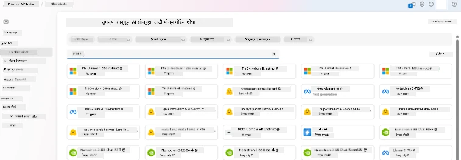
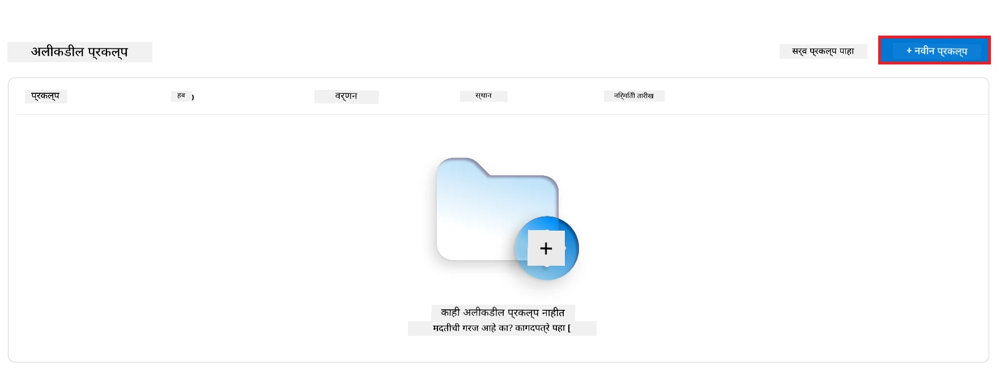
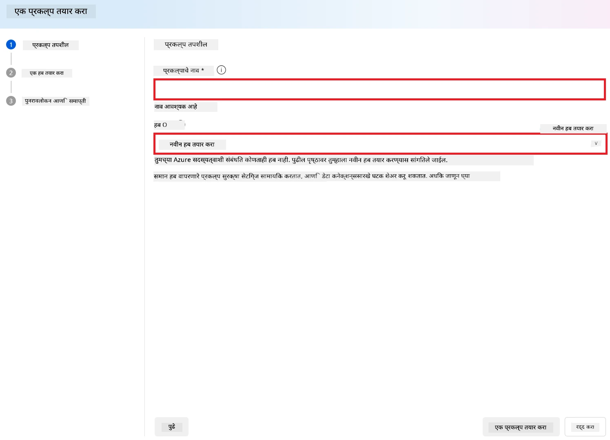
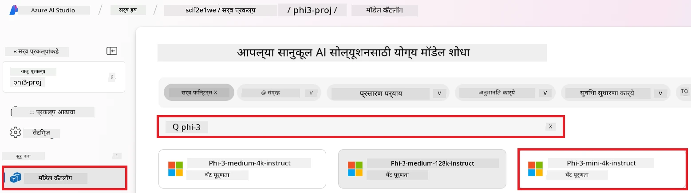
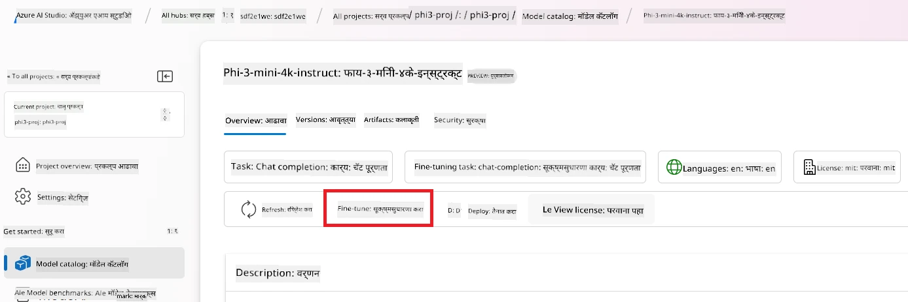
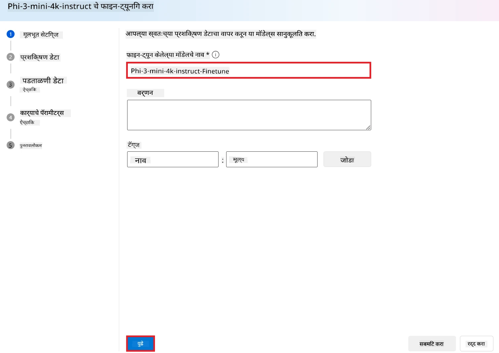
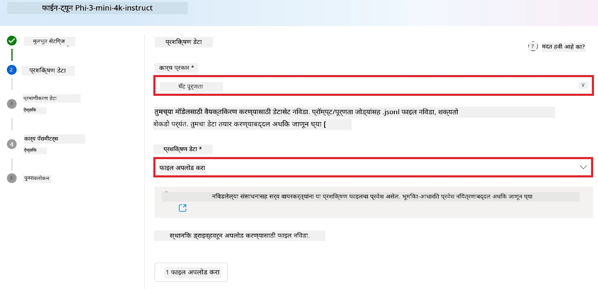
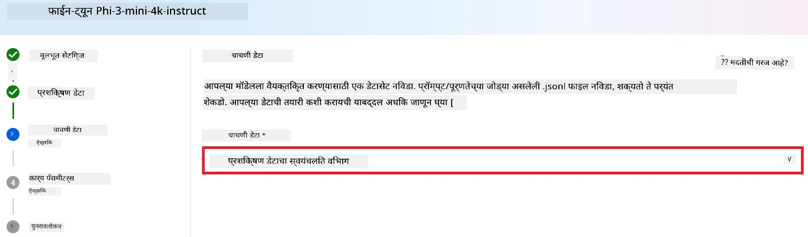
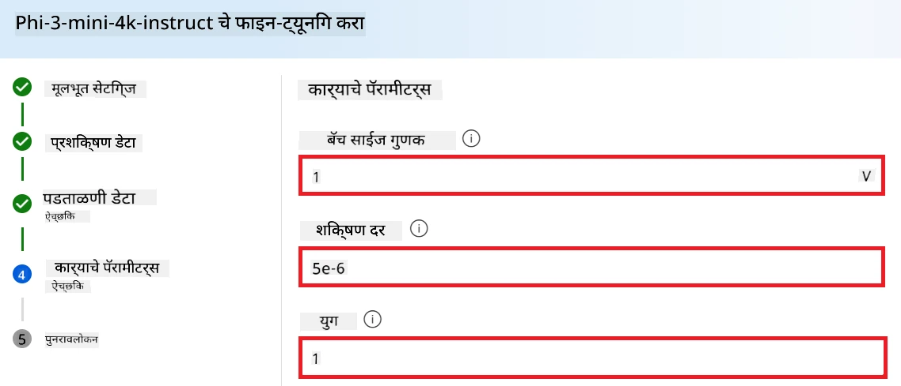
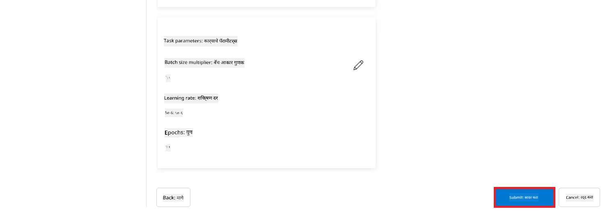

# Azure AI Foundry सह Phi-3 चे फाइन-ट्यूनिंग

चला पाहूया Microsoft च्या Phi-3 Mini भाषा मॉडेलचे Azure AI Foundry वापरून कसे फाइन-ट्यून करता येते. फाइन-ट्यूनिंगमुळे तुम्ही Phi-3 Mini ला विशिष्ट कामांसाठी सानुकूलित करू शकता, ज्यामुळे ते अधिक सामर्थ्यशाली आणि संदर्भानुसार समजूतदार बनते.

## विचार करण्यासारखे मुद्दे

- **क्षमता:** कोणती मॉडेल्स फाइन-ट्यून करता येतात? बेस मॉडेलला कोणत्या कामांसाठी फाइन-ट्यून करता येते?
- **खर्च:** फाइन-ट्यूनिंगसाठी किंमत कशी आहे?
- **सानुकूलता:** बेस मॉडेलमध्ये कितपत बदल करता येतो – आणि कोणत्या प्रकारे?
- **सुविधा:** फाइन-ट्यूनिंग प्रत्यक्षात कशी होते – मला कस्टम कोड लिहावा लागतो का? माझे स्वतःचे कम्प्युटर आणावे लागते का?
- **सुरक्षा:** फाइन-ट्यून केलेल्या मॉडेल्समध्ये सुरक्षा धोके असू शकतात – अनपेक्षित हानीपासून संरक्षणासाठी कोणतेही गार्डरेल्स आहेत का?



## फाइन-ट्यूनिंगसाठी तयारी

### पूर्वअट

> [!NOTE]
> Phi-3 कुटुंबातील मॉडेल्ससाठी, पे-एज-यू-गो मॉडेल फाइन-ट्यूनिंगची सुविधा फक्त **East US 2** प्रदेशात तयार केलेल्या हब्ससाठी उपलब्ध आहे.

- Azure सदस्यता. जर तुमच्याकडे Azure सदस्यता नसेल, तर सुरू करण्यासाठी [पेड Azure खाते](https://azure.microsoft.com/pricing/purchase-options/pay-as-you-go) तयार करा.

- एक [AI Foundry प्रोजेक्ट](https://ai.azure.com?WT.mc_id=aiml-138114-kinfeylo).
- Azure रोल-आधारित प्रवेश नियंत्रण (Azure RBAC) वापरून Azure AI Foundry मधील ऑपरेशन्ससाठी प्रवेश दिला जातो. या लेखातील पायऱ्या पार पाडण्यासाठी तुमच्या वापरकर्त्याच्या खात्याला __Azure AI Developer रोल__ रिसोर्स ग्रुपवर असणे आवश्यक आहे.

### सदस्यता प्रदाता नोंदणी

सदस्यता `Microsoft.Network` रिसोर्स प्रदात्यासाठी नोंदणीकृत आहे का ते तपासा.

1. [Azure पोर्टल](https://portal.azure.com) मध्ये साइन इन करा.
2. डाव्या मेनूमधून **Subscriptions** निवडा.
3. वापरायची सदस्यता निवडा.
4. डाव्या मेनूमधून **AI project settings** > **Resource providers** निवडा.
5. **Microsoft.Network** रिसोर्स प्रदात्यांच्या यादीत आहे का ते तपासा. नसेल तर जोडा.

### डेटा तयारी

तुमच्या मॉडेलचे फाइन-ट्यूनिंग करण्यासाठी प्रशिक्षण आणि पडताळणी डेटा तयार करा. तुमच्या प्रशिक्षण आणि पडताळणी डेटासेटमध्ये इनपुट आणि आउटपुट उदाहरणे असतात ज्याद्वारे तुम्हाला मॉडेल कसे काम करावे हे सांगता येते.

तुमच्या सर्व प्रशिक्षण उदाहरणांनी अपेक्षित स्वरूप पाळले पाहिजे. प्रभावी फाइन-ट्यूनिंगसाठी, संतुलित आणि विविधतेने भरलेला डेटासेट असणे आवश्यक आहे.

यामध्ये डेटा संतुलन राखणे, विविध परिस्थितींचा समावेश करणे, आणि प्रशिक्षण डेटा वेळोवेळी सुधारित करणे यांचा समावेश होतो, ज्यामुळे मॉडेलचे उत्तर अधिक अचूक आणि संतुलित होते.

वेगवेगळ्या मॉडेल प्रकारांसाठी प्रशिक्षण डेटाचा वेगळा स्वरूप आवश्यक असतो.

### चॅट पूर्णता

तुम्ही वापरणारा प्रशिक्षण आणि पडताळणी डेटा **JSON Lines (JSONL)** स्वरूपात असणे आवश्यक आहे. `Phi-3-mini-128k-instruct` साठी फाइन-ट्यूनिंग डेटासेट चॅट पूर्णता API वापरल्या जाणाऱ्या संभाषणात्मक स्वरूपात असणे आवश्यक आहे.

### उदाहरण फाइल स्वरूप

```json
    {"messages": [{"role": "system", "content": "You are an Xbox customer support agent whose primary goal is to help users with issues they are experiencing with their Xbox devices. You are friendly and concise. You only provide factual answers to queries, and do not provide answers that are not related to Xbox."}, {"role": "user", "content": "Is Xbox better than PlayStation?"}, {"role": "assistant", "content": "I apologize, but I cannot provide personal opinions. My primary job is to assist you with any issues related to your Xbox device. Do you have any Xbox-related issues that need addressing?"}]}
    {"messages": [{"role": "system", "content": "You are an Xbox customer support agent whose primary goal is to help users with issues they are experiencing with their Xbox devices. You are friendly and concise. You only provide factual answers to queries, and do not provide answers that are not related to Xbox."}, {"role": "user", "content": "Can I play PC games on my Xbox?"}, {"role": "assistant", "content": "While Xbox consoles don't natively support PC games, they can play an array of Xbox games, many of which are also available on PC. Can I assist you with finding games compatible with your Xbox device?"}]}
    {"messages": [{"role": "system", "content": "You are an Xbox customer support agent whose primary goal is to help users with issues they are experiencing with their Xbox devices. You are friendly and concise. You only provide factual answers to queries, and do not provide answers that are not related to Xbox."}, {"role": "user", "content": "I'm having trouble connecting my Xbox to the Wi-Fi."}, {"role": "assistant", "content": "No worries, let's go through the network settings on your Xbox. Can you please tell me what happens when you try to connect it to the Wi-Fi?"}]}
```

समर्थित फाइल प्रकार JSON Lines आहे. फाइल्स डिफॉल्ट डेटास्टोअरमध्ये अपलोड केल्या जातात आणि तुमच्या प्रोजेक्टमध्ये उपलब्ध होतात.

## Azure AI Foundry सह Phi-3 चे फाइन-ट्यूनिंग

Azure AI Foundry तुम्हाला मोठ्या भाषा मॉडेल्सना तुमच्या वैयक्तिक डेटासेटनुसार सानुकूलित करण्याची परवानगी देते, ज्याला फाइन-ट्यूनिंग म्हणतात. फाइन-ट्यूनिंगमुळे विशिष्ट कामांसाठी आणि अनुप्रयोगांसाठी सानुकूलन आणि ऑप्टिमायझेशन शक्य होते. यामुळे कार्यक्षमता सुधारते, खर्च कमी होतो, विलंब कमी होतो आणि आउटपुट अधिक अनुरूप होतात.


### नवीन प्रोजेक्ट तयार करा

1. [Azure AI Foundry](https://ai.azure.com) मध्ये साइन इन करा.

2. Azure AI Foundry मध्ये नवीन प्रोजेक्ट तयार करण्यासाठी **+New project** निवडा.

    

3. खालील कामे करा:

    - प्रोजेक्टचा **Hub name** द्या. तो अनन्य (unique) असावा.
    - वापरण्यासाठी **Hub** निवडा (गरज असल्यास नवीन तयार करा).

    

4. नवीन हब तयार करण्यासाठी खालील कामे करा:

    - **Hub name** द्या. तो अनन्य असावा.
    - तुमची Azure **Subscription** निवडा.
    - वापरण्यासाठी **Resource group** निवडा (गरज असल्यास नवीन तयार करा).
    - वापरण्यासाठी **Location** निवडा.
    - वापरण्यासाठी **Connect Azure AI Services** निवडा (गरज असल्यास नवीन तयार करा).
    - **Connect Azure AI Search** साठी **Skip connecting** निवडा.

    

5. **Next** निवडा.
6. **Create a project** निवडा.

### डेटा तयारी

फाइन-ट्यूनिंगपूर्वी, तुमच्या कामाशी संबंधित डेटासेट गोळा करा किंवा तयार करा, जसे की चॅट सूचना, प्रश्न-उत्तर जोड्या, किंवा इतर संबंधित मजकूर डेटा. हा डेटा स्वच्छ करा, अनावश्यक गोष्टी काढा, गहाळ मूल्ये हाताळा आणि मजकूर टोकनाइझ करा.

### Azure AI Foundry मध्ये Phi-3 मॉडेल्सचे फाइन-ट्यूनिंग

> [!NOTE]
> Phi-3 मॉडेल्सचे फाइन-ट्यूनिंग सध्या East US 2 मध्ये असलेल्या प्रोजेक्ट्समध्ये समर्थित आहे.

1. डाव्या बाजूच्या टॅबमधून **Model catalog** निवडा.

2. **search bar** मध्ये *phi-3* टाइप करा आणि वापरायचे phi-3 मॉडेल निवडा.

    

3. **Fine-tune** निवडा.

    

4. **Fine-tuned model name** प्रविष्ट करा.

    

5. **Next** निवडा.

6. खालील कामे करा:

    - **task type** म्हणून **Chat completion** निवडा.
    - वापरायचा **Training data** निवडा. तुम्ही Azure AI Foundry च्या डेटामधून किंवा तुमच्या स्थानिक वातावरणातून अपलोड करू शकता.

    

7. **Next** निवडा.

8. वापरायचा **Validation data** अपलोड करा किंवा **Automatic split of training data** निवडा.

    

9. **Next** निवडा.

10. खालील कामे करा:

    - वापरायचा **Batch size multiplier** निवडा.
    - वापरायचा **Learning rate** निवडा.
    - वापरायचा **Epochs** निवडा.

    

11. फाइन-ट्यूनिंग प्रक्रिया सुरू करण्यासाठी **Submit** निवडा.

    

12. एकदा तुमचे मॉडेल फाइन-ट्यून झाले की, स्थिती **Completed** म्हणून दर्शविली जाईल, खालील चित्रात दाखवल्याप्रमाणे. आता तुम्ही मॉडेल डिप्लॉय करू शकता आणि ते तुमच्या स्वतःच्या अनुप्रयोगात, प्लेग्राउंडमध्ये किंवा प्रॉम्प्ट फ्लो मध्ये वापरू शकता. अधिक माहितीसाठी पाहा [Azure AI Foundry सह Phi-3 कुटुंबातील लहान भाषा मॉडेल्स कसे डिप्लॉय करायचे](https://learn.microsoft.com/azure/ai-studio/how-to/deploy-models-phi-3?tabs=phi-3-5&pivots=programming-language-python).

    

> [!NOTE]
> Phi-3 चे फाइन-ट्यूनिंगबाबत अधिक सविस्तर माहितीकरिता कृपया भेट द्या [Azure AI Foundry मध्ये Phi-3 मॉडेल्सचे फाइन-ट्यूनिंग](https://learn.microsoft.com/azure/ai-studio/how-to/fine-tune-phi-3?tabs=phi-3-mini).

## तुमच्या फाइन-ट्यून केलेल्या मॉडेल्सची साफसफाई

तुम्ही [Azure AI Foundry](https://ai.azure.com) मधील फाइन-ट्यूनिंग मॉडेल यादीतून किंवा मॉडेल तपशील पृष्ठावरून फाइन-ट्यून केलेले मॉडेल हटवू शकता. फाइन-ट्यूनिंग पृष्ठावरून हटवायचे मॉडेल निवडा आणि नंतर Delete बटणावर क्लिक करा.

> [!NOTE]
> जर तुमच्या कस्टम मॉडेलचे डिप्लॉयमेंट अस्तित्वात असेल तर तुम्ही ते डिलीट करू शकत नाही. प्रथम तुमचे मॉडेल डिप्लॉयमेंट हटवावे लागेल, त्यानंतरच कस्टम मॉडेल डिलीट करता येईल.

## खर्च आणि कोटा

### Phi-3 मॉडेल्ससाठी सेवा म्हणून फाइन-ट्यूनिंगचे खर्च आणि कोटा

Phi मॉडेल्स जे सेवा म्हणून फाइन-ट्यून केलेले आहेत, ते Microsoft द्वारे ऑफर केले जातात आणि Azure AI Foundry मध्ये वापरासाठी एकत्रित केलेले आहेत. तुम्ही [डिप्लॉय](https://learn.microsoft.com/azure/ai-studio/how-to/deploy-models-phi-3?tabs=phi-3-5&pivots=programming-language-python) करताना किंवा मॉडेल्सचे फाइन-ट्यूनिंग करताना किंमत पाहू शकता, जी डिप्लॉयमेंट विजार्डमधील Pricing and terms टॅबमध्ये दिलेली आहे.

## कंटेंट फिल्टरिंग

पे-एज-यू-गो सेवेसह डिप्लॉय केलेल्या मॉडेल्सना Azure AI Content Safety द्वारे संरक्षित केले जाते. रिअल-टाइम एंडपॉइंट्सवर डिप्लॉय केल्यावर तुम्ही या क्षमतेपासून बाहेर राहू शकता. Azure AI Content Safety सक्षम असताना, प्रॉम्प्ट आणि पूर्णता दोन्ही हानिकारक सामग्री शोधण्यासाठी आणि प्रतिबंधित करण्यासाठी वर्गीकरण मॉडेल्सच्या समूहातून जातात. कंटेंट फिल्टरिंग सिस्टम इनपुट प्रॉम्प्ट्स आणि आउटपुट पूर्णतांमध्ये संभाव्य हानिकारक सामग्रीच्या विशिष्ट वर्गांवर लक्ष ठेवते आणि त्यानुसार कारवाई करते. अधिक जाणून घ्या [Azure AI Content Safety](https://learn.microsoft.com/azure/ai-studio/concepts/content-filtering).

**फाइन-ट्यूनिंग कॉन्फिगरेशन**

हायपरपॅरामीटर्स: लर्निंग रेट, बॅच साईज, आणि प्रशिक्षण इपॉक्सची संख्या यांसारखे हायपरपॅरामीटर्स ठरवा.

**लॉस फंक्शन**

तुमच्या कामासाठी योग्य लॉस फंक्शन निवडा (उदा. क्रॉस-एंट्रॉपी).

**ऑप्टिमायझर**

प्रशिक्षणादरम्यान ग्रेडियंट अपडेटसाठी ऑप्टिमायझर निवडा (उदा. Adam).

**फाइन-ट्यूनिंग प्रक्रिया**

- प्री-ट्रेंड मॉडेल लोड करा: Phi-3 Mini चा चेकपॉइंट लोड करा.
- कस्टम लेयर्स जोडा: कामानुसार विशिष्ट लेयर्स जोडा (उदा. चॅट सूचनांसाठी वर्गीकरण हेड).

**मॉडेल प्रशिक्षण**

तयार केलेल्या डेटासेटसह मॉडेल फाइन-ट्यून करा. प्रशिक्षण प्रगतीवर लक्ष ठेवा आणि आवश्यकतेनुसार हायपरपॅरामीटर्स समायोजित करा.

**मूल्यमापन आणि पडताळणी**

पडताळणी सेट: तुमचा डेटा प्रशिक्षण आणि पडताळणी सेटमध्ये विभाजित करा.

**कार्यक्षमता मूल्यांकन**

मॉडेलची कार्यक्षमता मोजण्यासाठी अचूकता, F1-स्कोर किंवा पर्प्लेक्सिटी सारखे मेट्रिक्स वापरा.

## फाइन-ट्यून केलेले मॉडेल जतन करा

**चेकपॉइंट**

भविष्यातील वापरासाठी फाइन-ट्यून केलेला मॉडेल चेकपॉइंट जतन करा.

## डिप्लॉयमेंट

- वेब सेवा म्हणून डिप्लॉय करा: तुमचे फाइन-ट्यून केलेले मॉडेल Azure AI Foundry मध्ये वेब सेवा म्हणून डिप्लॉय करा.
- एंडपॉइंटची चाचणी करा: डिप्लॉय केलेल्या एंडपॉइंटवर चाचणी प्रश्न पाठवून त्याची कार्यक्षमता तपासा.

## पुनरावृत्ती आणि सुधारणा

पुनरावृत्ती करा: जर कार्यक्षमता समाधानकारक नसेल, तर हायपरपॅरामीटर्स समायोजित करा, अधिक डेटा जोडा किंवा अतिरिक्त इपॉक्ससाठी फाइन-ट्यून करा.

## निरीक्षण आणि सुधारणा

मॉडेलच्या वर्तनावर सतत लक्ष ठेवा आणि आवश्यकतेनुसार सुधारणा करा.

## सानुकूलित करा आणि विस्तार करा

कस्टम कामे: Phi-3 Mini चा वापर चॅट सूचनांव्यतिरिक्त इतर विविध कामांसाठीही फाइन-ट्यून करता येतो. इतर वापर प्रकरणे शोधा!
प्रयोग करा: कार्यक्षमता वाढवण्यासाठी वेगवेगळ्या आर्किटेक्चर, लेयर संयोजन आणि तंत्रांचा प्रयोग करा.

> [!NOTE]
> फाइन-ट्यूनिंग ही एक पुनरावृत्ती प्रक्रिया आहे. प्रयोग करा, शिका आणि तुमच्या विशिष्ट कामासाठी सर्वोत्तम निकाल मिळवण्यासाठी मॉडेल अनुकूलित करा!

**अस्वीकरण**:  
हा दस्तऐवज AI अनुवाद सेवा [Co-op Translator](https://github.com/Azure/co-op-translator) वापरून अनुवादित केला आहे. आम्ही अचूकतेसाठी प्रयत्नशील असलो तरी, कृपया लक्षात घ्या की स्वयंचलित अनुवादांमध्ये चुका किंवा अचूकतेचा अभाव असू शकतो. मूळ दस्तऐवज त्याच्या स्थानिक भाषेत अधिकृत स्रोत मानला जावा. महत्त्वाच्या माहितीसाठी व्यावसायिक मानवी अनुवाद करण्याची शिफारस केली जाते. या अनुवादाच्या वापरामुळे उद्भवलेल्या कोणत्याही गैरसमजुती किंवा चुकीच्या अर्थलागी आम्ही जबाबदार नाही.