<!--
CO_OP_TRANSLATOR_METADATA:
{
  "original_hash": "c1559c5af6caccf6f623fd43a6b3a9a3",
  "translation_date": "2025-05-09T20:28:08+00:00",
  "source_file": "md/03.FineTuning/FineTuning_AIFoundry.md",
  "language_code": "mr"
}
-->
# Azure AI Foundry सह Phi-3 चे फाइन-ट्युनिंग

चला पाहूया Microsoft च्या Phi-3 Mini भाषा मॉडेलचे Azure AI Foundry वापरून फाइन-ट्युनिंग कसे करायचे. फाइन-ट्युनिंगमुळे तुम्ही Phi-3 Mini ला विशिष्ट कामांसाठी सानुकूलित करू शकता, ज्यामुळे ते आणखी सामर्थ्यशाली आणि संदर्भानुसार अधिक संवेदनशील बनते.

## विचार करण्याच्या बाबी

- **क्षमता:** कोणती मॉडेल्स फाइन-ट्युन करण्यायोग्य आहेत? बेस मॉडेलला कोणत्या कामांसाठी फाइन-ट्युन करता येते?
- **खर्च:** फाइन-ट्युनिंगसाठी किंमतीचा मॉडेल काय आहे?
- **सानुकूलता:** बेस मॉडेलमध्ये मी कितपत बदल करू शकतो – आणि कशा प्रकारे?
- **सुलभता:** फाइन-ट्युनिंग प्रत्यक्षात कशी होते – मला कस्टम कोड लिहावा लागेल का? माझ्या स्वतःच्या संगणकीय संसाधनांचा वापर करावा लागेल का?
- **सुरक्षा:** फाइन-ट्युन केलेल्या मॉडेल्समध्ये सुरक्षा जोखमी असू शकतात – अनपेक्षित हानीपासून संरक्षणासाठी काही प्रतिबंध आहेत का?

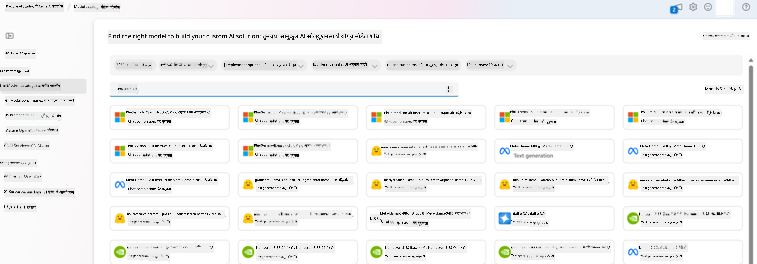

## फाइन-ट्युनिंगसाठी तयारी

### पूर्वअट

> [!NOTE]
> Phi-3 कुटुंबातील मॉडेल्ससाठी, पे-एज-यू-गो फाइन-ट्युनिंग ऑफरिंग फक्त **East US 2** प्रदेशात तयार केलेल्या हब्ससाठी उपलब्ध आहे.

- Azure सदस्यत्व. तुमच्याकडे Azure सदस्यत्व नसेल तर, सुरुवात करण्यासाठी [पेड Azure खाते](https://azure.microsoft.com/pricing/purchase-options/pay-as-you-go) तयार करा.

- एक [AI Foundry प्रोजेक्ट](https://ai.azure.com?WT.mc_id=aiml-138114-kinfeylo).
- Azure रोल-आधारित प्रवेश नियंत्रण (Azure RBAC) वापरून Azure AI Foundry मधील ऑपरेशन्ससाठी प्रवेश दिला जातो. या लेखातील टप्पे पार पाडण्यासाठी तुमच्या वापरकर्त्याच्या खात्याला __Azure AI Developer रोल__ रिसोर्स ग्रुपवर असणे आवश्यक आहे.

### सदस्यत्व प्रदाता नोंदणी

सदस्यत्व `Microsoft.Network` रिसोर्स प्रोव्हायडरला नोंदणीकृत आहे का ते तपासा.

1. [Azure पोर्टल](https://portal.azure.com) मध्ये साइन इन करा.
1. डाव्या मेनूमधून **Subscriptions** निवडा.
1. वापरायचे सदस्यत्व निवडा.
1. डाव्या मेनूमधून **AI project settings** > **Resource providers** निवडा.
1. यादीत **Microsoft.Network** आहे का ते तपासा. नसेल तर ते जोडा.

### डेटा तयारी

तुमच्या मॉडेलचे फाइन-ट्युनिंग करण्यासाठी प्रशिक्षण आणि प्रमाणीकरण डेटा तयार करा. तुमच्या प्रशिक्षण आणि प्रमाणीकरण डेटासेटमध्ये तुम्हाला हवे तसे मॉडेल कसे काम करावे यासाठी इनपुट आणि आउटपुट उदाहरणे असावीत.

तुमच्या सर्व प्रशिक्षण उदाहरणांनी अपेक्षित स्वरूप अनुसरावे हे सुनिश्चित करा. मॉडेल प्रभावीपणे फाइन-ट्युन करण्यासाठी संतुलित आणि विविध डेटासेट असणे आवश्यक आहे.

यामध्ये डेटा संतुलन राखणे, विविध परिस्थितींचा समावेश करणे, आणि प्रशिक्षण डेटा वेळोवेळी सुधारत राहणे यांचा समावेश होतो, ज्यामुळे अधिक अचूक आणि संतुलित मॉडेल प्रतिसाद मिळतात.

वेगवेगळ्या मॉडेल प्रकारांसाठी प्रशिक्षण डेटाचा वेगळा फॉरमॅट आवश्यक असतो.

### Chat Completion

तुम्ही वापरणारा प्रशिक्षण आणि प्रमाणीकरण डेटा **नक्कीच** JSON Lines (JSONL) फॉरमॅटमध्ये असावा. `Phi-3-mini-128k-instruct` साठी फाइन-ट्युनिंग डेटासेट हा Chat completions API द्वारे वापरल्या जाणाऱ्या संवादात्मक फॉरमॅटमध्ये असणे आवश्यक आहे.

### उदाहरण फाइल फॉरमॅट

```json
    {"messages": [{"role": "system", "content": "You are an Xbox customer support agent whose primary goal is to help users with issues they are experiencing with their Xbox devices. You are friendly and concise. You only provide factual answers to queries, and do not provide answers that are not related to Xbox."}, {"role": "user", "content": "Is Xbox better than PlayStation?"}, {"role": "assistant", "content": "I apologize, but I cannot provide personal opinions. My primary job is to assist you with any issues related to your Xbox device. Do you have any Xbox-related issues that need addressing?"}]}
    {"messages": [{"role": "system", "content": "You are an Xbox customer support agent whose primary goal is to help users with issues they are experiencing with their Xbox devices. You are friendly and concise. You only provide factual answers to queries, and do not provide answers that are not related to Xbox."}, {"role": "user", "content": "Can I play PC games on my Xbox?"}, {"role": "assistant", "content": "While Xbox consoles don't natively support PC games, they can play an array of Xbox games, many of which are also available on PC. Can I assist you with finding games compatible with your Xbox device?"}]}
    {"messages": [{"role": "system", "content": "You are an Xbox customer support agent whose primary goal is to help users with issues they are experiencing with their Xbox devices. You are friendly and concise. You only provide factual answers to queries, and do not provide answers that are not related to Xbox."}, {"role": "user", "content": "I'm having trouble connecting my Xbox to the Wi-Fi."}, {"role": "assistant", "content": "No worries, let's go through the network settings on your Xbox. Can you please tell me what happens when you try to connect it to the Wi-Fi?"}]}
```

समर्थित फाइल प्रकार JSON Lines आहे. फाइल्स डिफॉल्ट डेटास्टोअरमध्ये अपलोड केल्या जातात आणि तुमच्या प्रोजेक्टमध्ये उपलब्ध होतात.

## Azure AI Foundry सह Phi-3 चे फाइन-ट्युनिंग

Azure AI Foundry तुम्हाला मोठ्या भाषा मॉडेल्सना तुमच्या वैयक्तिक डेटासेटनुसार सानुकूल करण्याची संधी देते, ज्याला फाइन-ट्युनिंग म्हणतात. फाइन-ट्युनिंगमुळे विशिष्ट कामांसाठी सानुकूलता आणि ऑप्टिमायझेशन शक्य होते. यामुळे कामगिरी सुधारते, खर्च कमी होतो, विलंब कमी होतो आणि आउटपुट्स तुमच्या गरजेनुसार तयार होतात.

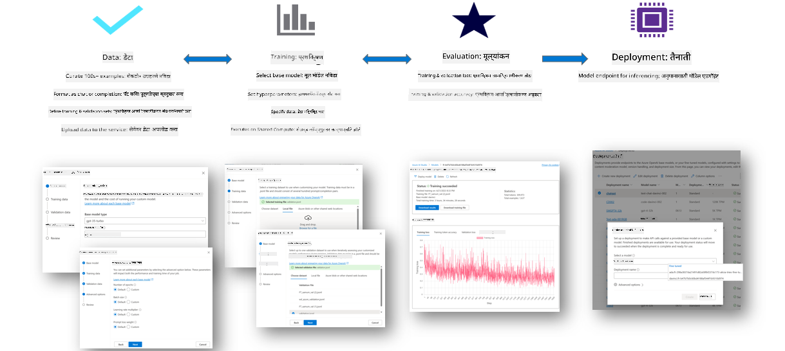

### नवीन प्रोजेक्ट तयार करा

1. [Azure AI Foundry](https://ai.azure.com) मध्ये साइन इन करा.

1. Azure AI Foundry मध्ये नवीन प्रोजेक्ट तयार करण्यासाठी **+New project** निवडा.

    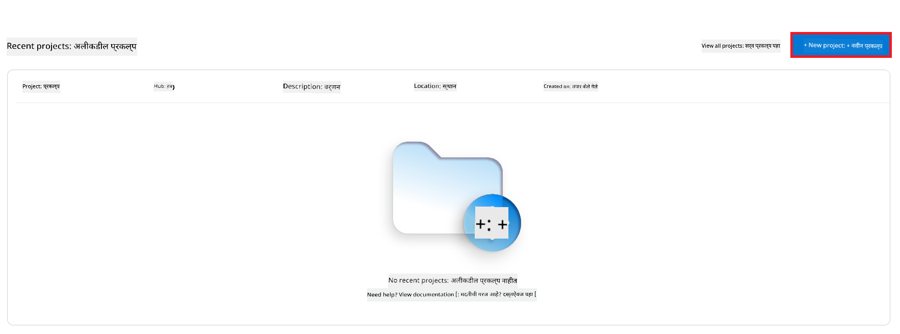

1. पुढील टास्क पूर्ण करा:

    - प्रोजेक्टचा **Hub name** द्या. तो युनिक असावा.
    - वापरायचा **Hub** निवडा (जर आवश्यक असेल तर नवीन तयार करा).

    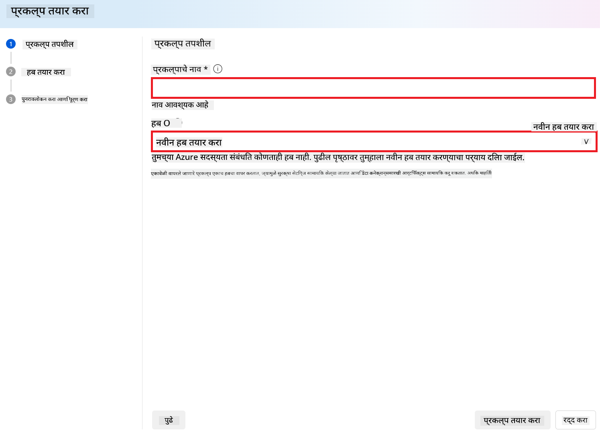

1. नवीन हब तयार करण्यासाठी पुढील टास्क पूर्ण करा:

    - **Hub name** द्या. तो युनिक असावा.
    - तुमचे Azure **Subscription** निवडा.
    - वापरायचा **Resource group** निवडा (नवीन तयार करायचा असल्यास).
    - वापरायचे **Location** निवडा.
    - वापरायचे **Connect Azure AI Services** निवडा (नवीन तयार करायचा असल्यास).
    - **Connect Azure AI Search** मध्ये **Skip connecting** निवडा.

    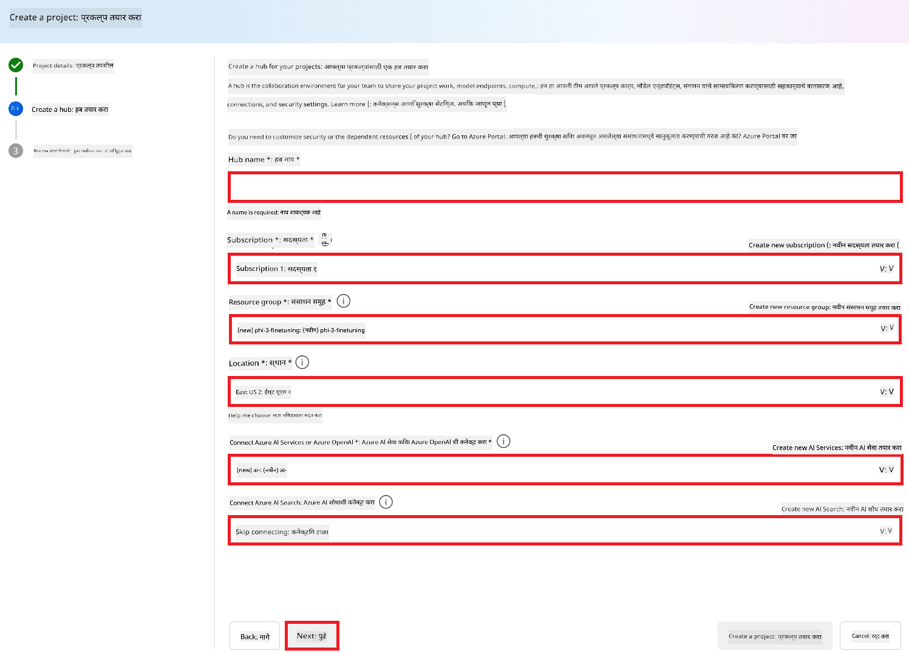

1. **Next** निवडा.
1. **Create a project** निवडा.

### डेटा तयारी

फाइन-ट्युनिंगपूर्वी, तुमच्या कामाशी संबंधित डेटा गोळा करा किंवा तयार करा, जसे की चॅट सूचनां, प्रश्न-उत्तर जोड्या किंवा इतर संबंधित मजकूर डेटा. या डेटामध्ये आवाज कमी करा, हरवलेले मूल्ये हाताळा, आणि मजकूर टोकनायझेशन करा.

### Azure AI Foundry मध्ये Phi-3 मॉडेल्सचे फाइन-ट्युनिंग करा

> [!NOTE]
> Phi-3 मॉडेल्सचे फाइन-ट्युनिंग सध्या फक्त East US 2 मध्ये असलेल्या प्रोजेक्ट्समध्ये समर्थित आहे.

1. डाव्या बाजूला असलेल्या टॅबमधून **Model catalog** निवडा.

1. **search bar** मध्ये *phi-3* टाइप करा आणि वापरायचा phi-3 मॉडेल निवडा.

    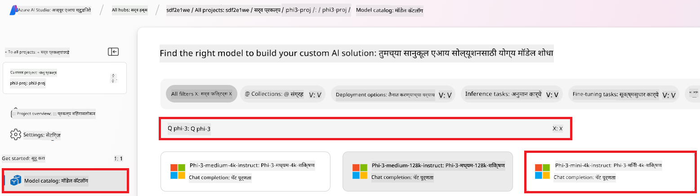

1. **Fine-tune** निवडा.

    

1. **Fine-tuned model name** टाका.

    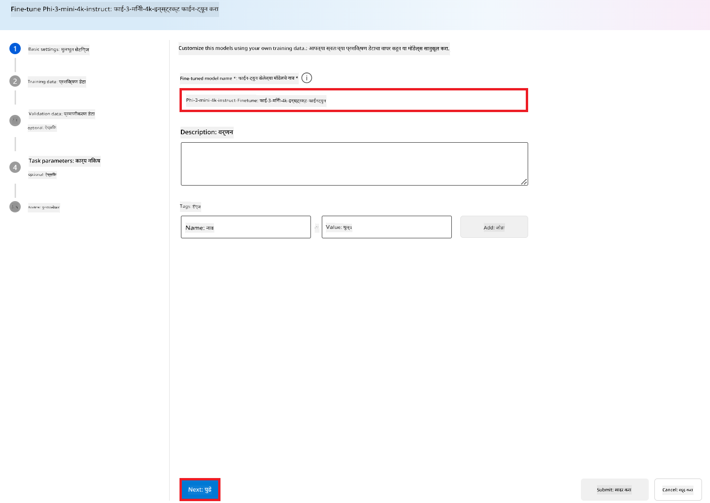

1. **Next** निवडा.

1. पुढील टास्क पूर्ण करा:

    - **task type** मध्ये **Chat completion** निवडा.
    - वापरायचा **Training data** निवडा. तुम्ही Azure AI Foundry च्या डेटातून किंवा तुमच्या स्थानिक वातावरणातून अपलोड करू शकता.

    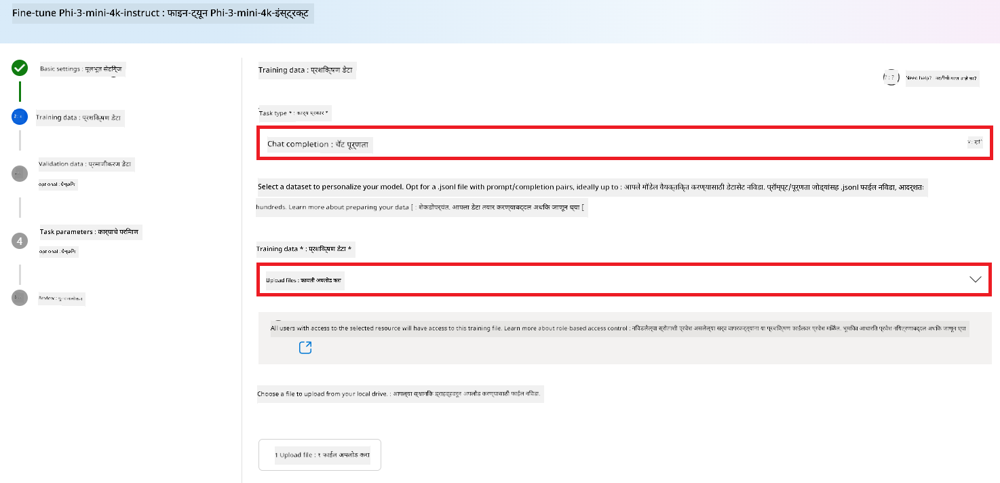

1. **Next** निवडा.

1. वापरायचा **Validation data** अपलोड करा, किंवा **Automatic split of training data** निवडा.

    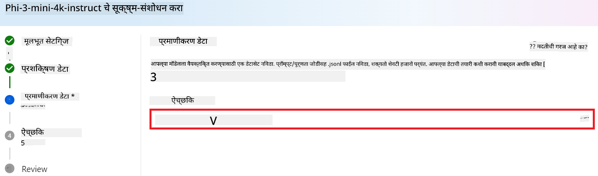

1. **Next** निवडा.

1. पुढील टास्क पूर्ण करा:

    - वापरायचा **Batch size multiplier** निवडा.
    - वापरायचा **Learning rate** निवडा.
    - वापरायचे **Epochs** निवडा.

    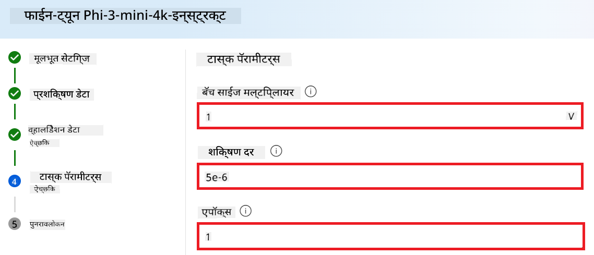

1. फाइन-ट्युनिंग प्रक्रिया सुरू करण्यासाठी **Submit** निवडा.

    

1. एकदा तुमचे मॉडेल फाइन-ट्युन झाले की, स्थिती **Completed** म्हणून दर्शवली जाईल, खालील चित्राप्रमाणे. आता तुम्ही मॉडेल तैनात करू शकता आणि ते तुमच्या स्वतःच्या अॅप्लिकेशनमध्ये, प्लेग्राउंडमध्ये किंवा प्रॉम्प्ट फ्लोमध्ये वापरू शकता. अधिक माहितीसाठी, पहा [How to deploy Phi-3 family of small language models with Azure AI Foundry](https://learn.microsoft.com/azure/ai-studio/how-to/deploy-models-phi-3?tabs=phi-3-5&pivots=programming-language-python).

    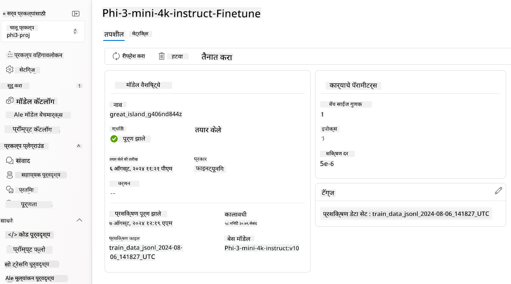

> [!NOTE]
> Phi-3 च्या फाइन-ट्युनिंगबाबत अधिक सविस्तर माहितीकरिता, भेट द्या [Fine-tune Phi-3 models in Azure AI Foundry](https://learn.microsoft.com/azure/ai-studio/how-to/fine-tune-phi-3?tabs=phi-3-mini).

## तुमच्या फाइन-ट्युन केलेल्या मॉडेल्सची साफसफाई करा

तुम्ही फाइन-ट्युन केलेले मॉडेल Azure AI Foundry मध्ये फाइन-ट्युनिंग मॉडेल यादीतून किंवा मॉडेल तपशील पृष्ठावरून हटवू शकता. फाइन-ट्युन केलेले मॉडेल निवडा आणि Delete बटण दाबून ते हटवा.

> [!NOTE]
> जर तुमच्या कस्टम मॉडेलवर तैनाती अस्तित्वात असेल, तर तुम्ही ते काढू शकत नाही. कस्टम मॉडेल हटवण्यापूर्वी त्याची तैनाती हटवावी लागेल.

## खर्च आणि कोटा

### Phi-3 मॉडेल्ससाठी सेवा म्हणून फाइन-ट्युनिंगचे खर्च आणि कोटा

Phi मॉडेल्स, जे सेवा म्हणून फाइन-ट्युन केले जातात, ते Microsoft द्वारे पुरवले जातात आणि Azure AI Foundry मध्ये एकत्रित आहेत. मॉडेल्स तैनात करताना किंवा फाइन-ट्युन करताना किंमतींची माहिती तुम्हाला [deploying](https://learn.microsoft.com/azure/ai-studio/how-to/deploy-models-phi-3?tabs=phi-3-5&pivots=programming-language-python) किंवा फाइन-ट्युनिंग विझार्डमधील Pricing and terms टॅबमध्ये मिळेल.

## कंटेंट फिल्टरिंग

पे-एज-यू-गो सेवा म्हणून तैनात केलेल्या मॉडेल्सना Azure AI Content Safety द्वारे संरक्षण दिले जाते. रिअल-टाइम एंडपॉइंट्सवर तैनात करताना तुम्ही ही सुविधा निवडून टाकू शकता. Azure AI Content Safety सक्षम असताना, प्रॉम्प्ट आणि कम्प्लीशन दोन्ही एकत्रित वर्गीकरण मॉडेल्सद्वारे तपासले जातात, जे हानिकारक कंटेंटची ओळख करून त्याला प्रतिबंधित करतात. कंटेंट फिल्टरिंग सिस्टम संभाव्य हानिकारक कंटेंटच्या विशिष्ट श्रेणींवर लक्ष ठेवते आणि इनपुट प्रॉम्प्ट्स व आउटपुट कम्प्लीशन्सवर आवश्यक ती कारवाई करते. अधिक जाणून घेण्यासाठी पाहा [Azure AI Content Safety](https://learn.microsoft.com/azure/ai-studio/concepts/content-filtering).

**फाइन-ट्युनिंग कॉन्फिगरेशन**

हायपरपॅरामिटर्स: लर्निंग रेट, बॅच साईज, आणि ट्रेनिंग एपोक्सची संख्या यांसारखे हायपरपॅरामिटर्स ठरवा.

**लॉस फंक्शन**

तुमच्या कामासाठी योग्य लॉस फंक्शन निवडा (उदा. क्रॉस-एंट्रोपी).

**ऑप्टिमायझर**

ट्रेनिंग दरम्यान ग्रेडियंट अपडेटसाठी ऑप्टिमायझर निवडा (उदा. Adam).

**फाइन-ट्युनिंग प्रक्रिया**

- प्री-ट्रेन केलेले मॉडेल लोड करा: Phi-3 Mini चे चेकपॉइंट लोड करा.
- कस्टम लेयर्स जोडा: कामासाठी विशिष्ट लेयर्स जोडा (उदा. चॅट सूचनांसाठी क्लासिफिकेशन हेड).

**मॉडेल ट्रेन करा**

तयार केलेल्या डेटासेटसह मॉडेल फाइन-ट्युन करा. ट्रेनिंग प्रगतीवर लक्ष ठेवा आणि आवश्यकतेनुसार हायपरपॅरामिटर्स समायोजित करा.

**मूल्यांकन आणि प्रमाणीकरण**

प्रमाणीकरण सेट: तुमचा डेटा ट्रेनिंग आणि प्रमाणीकरण सेटमध्ये विभागा.

**कामगिरीचे मूल्यांकन करा**

मॉडेलची कामगिरी मोजण्यासाठी अचूकता, F1-स्कोर किंवा पर्प्लेक्सिटी सारखे मेट्रिक्स वापरा.

## फाइन-ट्युन केलेले मॉडेल जतन करा

**चेकपॉइंट**

फ्यूचर वापरासाठी फाइन-ट्युन केलेले मॉडेल चेकपॉइंट जतन करा.

## तैनाती

- वेब सेवा म्हणून तैनात करा: तुमचे फाइन-ट्युन केलेले मॉडेल Azure AI Foundry मध्ये वेब सेवा म्हणून तैनात करा.
- एंडपॉइंट तपासा: तैनात केलेल्या एंडपॉइंटवर टेस्ट क्वेरीज पाठवून त्याची कार्यक्षमता तपासा.

## पुनरावृत्ती करा आणि सुधारणा करा

पुन्हा प्रयत्न करा: जर कामगिरी समाधानकारक नसेल तर हायपरपॅरामिटर्स समायोजित करा, अधिक डेटा जोडा किंवा अधिक एपोक्ससाठी फाइन-ट्युन करा.

## मॉनिटर करा आणि सुधारित करा

मॉडेलच्या वर्तनावर सतत लक्ष ठेवा आणि आवश्यकतेनुसार सुधारणा करा.

## सानुकूल करा आणि विस्तृत करा

कस्टम टास्क्स: Phi-3 Mini चॅट सूचनांव्यतिरिक्त इतर कामांसाठीही फाइन-ट्युन करता येतो. इतर वापर प्रकरणे शोधा!
प्रयोग करा: वेगवेगळ्या आर्किटेक्चर, लेयर कॉम्बिनेशन्स आणि तंत्रांचा वापर करून कामगिरी सुधारण्याचा प्रयत्न करा.

> [!NOTE]
> फाइन-ट्युनिंग ही पुनरावृत्तीची प्रक्रिया आहे. प्रयोग करा, शिका आणि तुमच्या विशिष्ट कामासाठी सर्वोत्तम निकाल मिळवण्यासाठी मॉडेल अनुकूल करा!

**अस्वीकरण**:  
हा दस्तऐवज AI अनुवाद सेवा [Co-op Translator](https://github.com/Azure/co-op-translator) चा वापर करून अनुवादित केला आहे. आम्ही अचूकतेसाठी प्रयत्न करतो, तरी कृपया लक्षात ठेवा की स्वयंचलित अनुवादांमध्ये चुका किंवा अचूकतेच्या त्रुटी असू शकतात. मूळ दस्तऐवज त्याच्या मूळ भाषेत अधिकृत स्रोत मानला जावा. महत्त्वाच्या माहितीसाठी व्यावसायिक मानवी अनुवादाची शिफारस केली जाते. या अनुवादाच्या वापरामुळे झालेल्या कोणत्याही गैरसमजुती किंवा चुकीच्या अर्थलाभांसाठी आम्ही जबाबदार नाही.