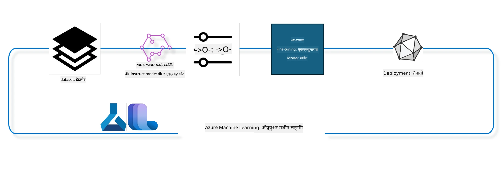

## Azure ML सिस्टम रजिस्ट्रीमधील chat-completion कॉम्पोनंट्स वापरून मॉडेलचे फाइन ट्यूनिंग कसे करायचे

या उदाहरणात आपण ultrachat_200k डेटासेट वापरून Phi-3-mini-4k-instruct मॉडेलचे 2 लोकांदरम्यान संभाषण पूर्ण करण्यासाठी फाइन ट्यूनिंग करू.



हे उदाहरण तुम्हाला Azure ML SDK आणि Python वापरून फाइन ट्यूनिंग कसे करायचे तसेच नंतर फाइन ट्यून केलेले मॉडेल रिअल टाइम इन्फरन्ससाठी ऑनलाइन endpoint वर कसे डिप्लॉय करायचे ते दाखवेल.

### प्रशिक्षण डेटा

आपण ultrachat_200k डेटासेट वापरणार आहोत. हे UltraChat डेटासेटचा खूप फिल्टर केलेला आवृत्ती आहे आणि Zephyr-7B-β, एक अत्याधुनिक 7b चॅट मॉडेल प्रशिक्षित करण्यासाठी वापरले गेले.

### मॉडेल

आपण Phi-3-mini-4k-instruct मॉडेल वापरणार आहोत, जे दाखवेल की वापरकर्ता chat-completion कार्यासाठी मॉडेल कसे फाइनट्यून करू शकतो. जर आपण हे नोटबुक एखाद्या विशिष्ट मॉडेल कार्डमधून उघडले असेल, तर त्या विशिष्ट मॉडेलचे नाव जरूर बदला.

### कार्ये

- फाइन ट्यून करण्यासाठी एक मॉडेल निवडा.  
- प्रशिक्षण डेटा निवडा आणि पाहा.  
- फाइन ट्यूनिंग जॉब कॉन्फिगर करा.  
- फाइन ट्यूनिंग जॉब रन करा.  
- प्रशिक्षण आणि मूल्यांकन मेट्रिक्स पुनरावलोकन करा.  
- फाइन ट्यून केलेले मॉडेल नोंदणी करा.  
- रिअल टाइम इन्फरन्ससाठी फाइन ट्यून मॉडेल डिप्लॉय करा.  
- संसाधने साफ करा.  

## 1. पूर्वअटी सेट करा

- आवश्यक असलेली डिपेंडेंसी इंस्टॉल करा  
- AzureML वर्कस्पेसशी कनेक्ट करा. अधिक जाणून घेण्यासाठी set up SDK authentication पाहा. खाली <WORKSPACE_NAME>, <RESOURCE_GROUP> आणि <SUBSCRIPTION_ID> बदला.  
- azureml सिस्टम रजिस्ट्रीशी कनेक्ट करा  
- स्वैच्छिक प्रयोग नाव सेट करा  
- कंप्युट तपासा किंवा तयार करा.

> [!NOTE]  
> गरजेनुसार एक GPU नोडमध्ये अनेक GPU कार्ड्स असू शकतात. उदाहरणार्थ, Standard_NC24rs_v3 च्या एका नोडमध्ये 4 NVIDIA V100 GPUs असतात तर Standard_NC12s_v3 मध्ये 2 NVIDIA V100 GPUs असतात. यासाठी आवश्यक माहिती docs मध्ये पहा. gpus_per_node या पॅरामीटरमध्ये GPU कार्ड्सची संख्या सेट केली जाते. योग्य प्रमाणात सेट केल्यास नोडमधील सर्व GPUs उपयुक्त होतील. शिफारस केलेले GPU compute SKUs येथे आणि येथे पाहा.

### Python लायब्रऱ्या

खालील सेल चालवून डिपेंडेंसी इंस्टॉल करा. नवीन एन्व्हायर्नमेंटमध्ये चालवत असल्यास हा पर्यायी नाही.

```bash
pip install azure-ai-ml
pip install azure-identity
pip install datasets==2.9.0
pip install mlflow
pip install azureml-mlflow
```
  
### Azure ML शी संवाद साधणे

1. हा Python स्क्रिप्ट Azure Machine Learning (Azure ML) सेवा सह संवाद साधण्यासाठी वापरला जातो. याचे वर्णन:

    - azure.ai.ml, azure.identity, आणि azure.ai.ml.entities या पॅकेजमधील आवश्यक मॉड्युल्स आयात करतो. तसेच time मॉड्युल आयात करतो.

    - DefaultAzureCredential() वापरून प्रमाणीकरण करण्याचा प्रयत्न करतो, ज्यामुळे Azure क्लाउडमध्ये अ‍ॅप्लिकेशन्स त्वरीत विकसित करता येतात. अयशस्वी झाल्यास InteractiveBrowserCredential() वापरून इंटरऍक्टिव लॉगिन पुकार येतो.

    - नंतर from_config पद्धत वापरून MLClient चे उदाहरण बनवण्याचा प्रयत्न होतो, जी config.json वर आधारित कॉन्फिगरेशन वाचते. अयशस्वी झाल्यास subscription_id, resource_group_name, workspace_name देऊन MLClient तयार करते.

    - दुसरे MLClient उदाहरण "azureml" नावाच्या Azure ML रजिस्ट्रीसाठी तयार करते. ही रजिस्ट्री जिथे मॉडेल्स, फाइन-ट्यूनिंग पाइपलाइन्स, आणि एन्व्हायर्नमेंट्स साठवले जातात.

    - experiment_name हा "chat_completion_Phi-3-mini-4k-instruct" असतो.

    - सद्य वेळेचा (epoch पासून सेकंदात, फ्लोटिंग पॉईंट नंबर म्हणून) पूर्णांकात रूपांतर करून एक अद्वितीय टाईमस्टॅम्प तयार करतो ज्याचा वापर नाव आणि व्हर्जन तयार करताना केला जाऊ शकतो.

    ```python
    # Azure ML आणि Azure Identity कडून आवश्यक मॉड्यूल आयात करा
    from azure.ai.ml import MLClient
    from azure.identity import (
        DefaultAzureCredential,
        InteractiveBrowserCredential,
    )
    from azure.ai.ml.entities import AmlCompute
    import time  # time मॉड्यूल आयात करा
    
    # DefaultAzureCredential वापरून प्रमाणीकरण करण्याचा प्रयत्न करा
    try:
        credential = DefaultAzureCredential()
        credential.get_token("https://management.azure.com/.default")
    except Exception as ex:  # DefaultAzureCredential अयशस्वी झाल्यास, InteractiveBrowserCredential वापरा
        credential = InteractiveBrowserCredential()
    
    # डीफॉल्ट कॉन्फिग फाइल वापरून MLClient चा एक उदाहरण तयार करण्याचा प्रयत्न करा
    try:
        workspace_ml_client = MLClient.from_config(credential=credential)
    except:  # जर ते अपयशी ठरले, तर तपशील हाताने देऊन MLClient चे उदाहरण तयार करा
        workspace_ml_client = MLClient(
            credential,
            subscription_id="<SUBSCRIPTION_ID>",
            resource_group_name="<RESOURCE_GROUP>",
            workspace_name="<WORKSPACE_NAME>",
        )
    
    # "azureml" नावाच्या Azure ML रेजिस्ट्रीसाठी दुसरे MLClient चे उदाहरण तयार करा
    # या रेजिस्ट्रीमध्ये मॉडेल्स, फाईन-ट्यूनिंग पाइपलाइन्स आणि वातावरणे संग्रहित केली जातात
    registry_ml_client = MLClient(credential, registry_name="azureml")
    
    # प्रयोगाचे नाव सेट करा
    experiment_name = "chat_completion_Phi-3-mini-4k-instruct"
    
    # एक अद्वितीय टाईमस्टँप तयार करा जो नावांसाठी आणि आवृत्त्यांसाठी वापरला जाऊ शकतो ज्यांना अद्वितीय असणे आवश्यक आहे
    timestamp = str(int(time.time()))
    ```
  
## 2. फाइन ट्यूनिंगसाठी फाउंडेशन मॉडेल निवडा

1. Phi-3-mini-4k-instruct हा 3.8B पॅरामीटर्सचा हलका, अत्याधुनिक खुला मॉडेल आहे जो Phi-2 साठी वापरलेल्या डेटासेट्सवर आधारित आहे. हा Phi-3 मॉडेल कुटुंबातील आहे, आणि Mini आवृत्तीमध्ये 4K आणि 128K दोन व्हेरिअंट्स आहेत ज्यांचा संदर्भ लांब दृष्टीक्षेप (tokens) यावर आहे. आपल्याला याला फाइनट्यून करावे लागेल जेणेकरून तो आपल्या कार्यासाठी उपयुक्त होईल. AzureML Studio मधील Model Catalog मध्ये ह्या मॉडेल्सना "chat-completion" कार्यानुसार फिल्टर करून शोधू शकता. या उदाहरणात Phi-3-mini-4k-instruct मॉडेल वापरले आहे. जर आपण हा नोटबुक वेगळ्या मॉडेलनुसार सुरू केला असेल, तर मॉडेलचे नाव आणि व्हर्जन तदनुसार बदला.

> [!NOTE]  
> मॉडेलचा id ही एक मालमत्ता आहे जी फाइन ट्यूनिंग जॉबमध्ये इनपुट म्हणून दिली जाते. हा id AzureML Studio Model Catalog मधील मॉडेल तपशील पृष्ठावरील Asset ID फील्डमध्ये देखील सापडतो.

2. हा Python स्क्रिप्ट Azure Machine Learning (Azure ML) सेवा शी संवाद साधतो. याची तपशिलवार रूपरेषा:

    - model_name ला "Phi-3-mini-4k-instruct" असा सेट करतो.

    - registry_ml_client च्या models प्रॉपर्टीच्या get मेथडद्वारे Azure ML रजिस्ट्रीमधून दिलेल्या नावाचा सर्वात नवीन व्हर्जन प्राप्त करतो. get मेथडला दोन आर्ग्युमेंट्स दिले जातात: मॉडेलचे नाव आणि लेबल ज्याद्वारे नवीनतम व्हर्जन आणायचे आहे हे सांगितले जाते.

    - कन्सोलमध्ये एक संदेश छापतो ज्यामध्ये फाइन-ट्यूनिंगसाठी वापरणार्‍या मॉडेलचे नाव, व्हर्जन व id दाखवले जाते. format मेथड वापरून हे मूल्ये साझा केली जातात. हे मूल्ये foundation_model ऑब्जेक्टच्याप्रॉपर्टीज म्हणून उपलब्ध आहेत.

    ```python
    # मॉडेल नाव सेट करा
    model_name = "Phi-3-mini-4k-instruct"
    
    # Azure ML रजिस्ट्रीमधून मॉडेलचा नवीनतम आवृत्ती मिळवा
    foundation_model = registry_ml_client.models.get(model_name, label="latest")
    
    # मॉडेल नाव, आवृत्ती आणि आयडी मुद्रित करा
    # ही माहिती ट्रॅकिंग आणि डिबगिंगसाठी उपयुक्त आहे
    print(
        "\n\nUsing model name: {0}, version: {1}, id: {2} for fine tuning".format(
            foundation_model.name, foundation_model.version, foundation_model.id
        )
    )
    ```
  
## 3. जॉबसाठी वापरायचा कंप्युट तयार करा

फाइनट्यून जॉब फक्त GPU कंप्युटसह चालतो. कंप्युटचे आकार मॉडेलच्या आकारावर अवलंबून असतात आणि योग्य कंप्युट निवडणे अनेक वेळा कठीण ठरते. या सेलमध्ये योग्य कंप्युट निवडण्यासाठी मार्गदर्शन आहे.

> [!NOTE]  
> खाली सांगितलेले कंप्युट्स अत्यंत ऑप्टिमाइझ केलेल्या सेटिंगसह कार्य करतात. कॉन्फिगरेशनमध्ये कोणतीही बदल Cuda Out Of Memory एरर होण्यास कारणीभूत ठरू शकतात. अशा परिस्थितीत कंप्युटचे आकार अधिक मोठे करण्याचा प्रयत्न करा.

> [!NOTE]  
> compute_cluster_size निवडताना खात्री करा कि कंप्युट तुमच्या रिसोर्स ग्रुपमध्ये उपलब्ध आहे. जो कंप्युट उपलब्ध नसेल त्यासाठी प्रवेशासाठी विनंती करू शकता.

### फाइन ट्यूनिंग सपोर्टसाठी मॉडेल तपासणे

1. Python स्क्रिप्ट Azure ML मॉडेलशी संवाद साधत आहे. त्याची रूपरेषा:

    - ast मॉड्युल आयात करतो, जो Python ची ऍब्स्ट्रॅक्ट सिन्टॅक्स ट्री प्रक्रिया करण्यासाठी वापरला जातो.

    - foundation_model ऑब्जेक्टमध्ये finetune_compute_allow_list नावाचा टॅग आहे का ते तपासतो. Azure ML मधील टॅग्स हे की-वॅल्यु युग्म असतात जे मॉडेल्स फिल्टर व सॉर्ट करण्यासाठी वापरले जातात.

    - जर finetune_compute_allow_list टॅग अस्तित्वात असेल, तर त्याचा स्ट्रिंग व्हॅल्यु सुरक्षितपणे Python लिस्टमध्ये रूपांतरित करतो (ast.literal_eval वापरून) आणि त्या लिस्टला computes_allow_list ला सेट करतो. त्यानंतर संदेश छापतो की कंप्युट त्या लिस्टमधून तयार करावा.

    - जर टॅग नसेल, तर computes_allow_list ला None सेट करतो आणि टॅग मॉडेलमध्ये नसल्याचे संदेश कंसोलवर छापतो.

    - सारांश म्हणजे, हा स्क्रिप्ट मॉडेलच्या मेटाडेटामध्ये विशिष्ट टॅग शोधतो, त्याच्या व्हॅल्युलाई लिस्टमध्ये रूपांतरित करतो आणि वापरकर्त्याला फीडबॅक देतो.

    ```python
    # Python abstract syntax grammar च्या झाडांचे प्रक्रिया करण्यासाठी फंक्शन्स पुरवणारे ast मॉड्यूल इम्पोर्ट करा
    import ast
    
    # मॉडेलच्या टॅग्समध्ये 'finetune_compute_allow_list' टॅग आहे का ते तपासा
    if "finetune_compute_allow_list" in foundation_model.tags:
        # जर टॅग असेल, तर ast.literal_eval वापरून टॅगचे मूल्य (string) सुरक्षितपणे Python यादीमध्ये पार्स करा
        computes_allow_list = ast.literal_eval(
            foundation_model.tags["finetune_compute_allow_list"]
        )  # string ला python यादीमध्ये रूपांतरित करा
        # यादीतून एक compute तयार करावे याचा संदेश प्रिंट करा
        print(f"Please create a compute from the above list - {computes_allow_list}")
    else:
        # जर टॅग नसेल, तर computes_allow_list ला None सेट करा
        computes_allow_list = None
        # 'finetune_compute_allow_list' टॅग मॉडेलच्या टॅग्सचा भाग नाही याचा संदेश प्रिंट करा
        print("`finetune_compute_allow_list` is not part of model tags")
    ```
  
### कंप्युट इन्स्टन्स तपासणी

1. हा Python स्क्रिप्ट Azure ML सेवेतील कंप्युट इन्स्टन्सवर अनेक तपासण्या करतो. याचे वर्णन:

    - compute_cluster नावाच्या कंप्युट इन्स्टन्सला वर्कस्पेस मधून प्राप्त करण्याचा प्रयत्न करतो. provisioning_state "failed" असेल तर ValueError उडवतो.

    - computes_allow_list None नसल्यास, सर्व लिस्टमधील कंप्युट आकार लोअरकेस करतो आणि सध्याच्या कंप्युट इन्स्टन्सच्या आकाराची तुलना लिस्टमधील आकारांशी करतो. नसल्यास ValueError देते.

    - computes_allow_list None असल्यास, कंप्युट आकार काही अनुपयोगी GPU VM आकारांच्या यादीत आहे का तपासतो. असल्यास ValueError देतो.

    - वर्कस्पेसमधील उपलब्ध सर्व कंप्युट साईजेसची यादी मिळवतो आणि प्रत्येकावरून पुढे जातो. सध्याच्या कंप्युट आकाराशी जुळणारा आकार सापडल्यास त्या कंप्युटसाठी GPU संख्या मिळवून gpu_count_found ला True करतो.

    - gpu_count_found True असल्यास ते GPU संख्या छापतो. False असल्यास ValueError उडवतो.

    - सारांश: हा स्क्रिप्ट Azure ML वर्कस्पेसमधील कंप्युटचे provisioning स्थिती, आकार आणि GPU संख्या यांची तपासणी करतो.

    ```python
    # अपवाद संदेश मुद्रित करा
    print(e)
    # कार्यक्षेत्रात संगणकीय आकार उपलब्ध नसेल तर ValueError उचला
    raise ValueError(
        f"WARNING! Compute size {compute_cluster_size} not available in workspace"
    )
    
    # Azure ML कार्यक्षेत्रातून संगणकीय उदाहरण प्राप्त करा
    compute = workspace_ml_client.compute.get(compute_cluster)
    # संगणकीय उदाहरणाची provisioning स्थिती "अपयशी" आहे का ते तपासा
    if compute.provisioning_state.lower() == "failed":
        # provisioning स्थिती "अपयशी" असल्यास ValueError उचला
        raise ValueError(
            f"Provisioning failed, Compute '{compute_cluster}' is in failed state. "
            f"please try creating a different compute"
        )
    
    # computes_allow_list None नाही याची तपासणी करा
    if computes_allow_list is not None:
        # computes_allow_list मधील सर्व संगणकीय आकार लहान अक्षरात रूपांतरित करा
        computes_allow_list_lower_case = [x.lower() for x in computes_allow_list]
        # संगणकीय उदाहरणाचा आकार computes_allow_list_lower_case मध्ये आहे का ते तपासा
        if compute.size.lower() not in computes_allow_list_lower_case:
            # संगणकीय उदाहरणाचा आकार computes_allow_list_lower_case मध्ये नसेल तर ValueError उचला
            raise ValueError(
                f"VM size {compute.size} is not in the allow-listed computes for finetuning"
            )
    else:
        # असमर्थित GPU VM आकारांची यादी व्याख्यित करा
        unsupported_gpu_vm_list = [
            "standard_nc6",
            "standard_nc12",
            "standard_nc24",
            "standard_nc24r",
        ]
        # संगणकीय उदाहरणाचा आकार unsupported_gpu_vm_list मध्ये आहे का ते तपासा
        if compute.size.lower() in unsupported_gpu_vm_list:
            # संगणकीय उदाहरणाचा आकार unsupported_gpu_vm_list मध्ये असल्यास ValueError उचला
            raise ValueError(
                f"VM size {compute.size} is currently not supported for finetuning"
            )
    
    # संगणकीय उदाहरणातील GPU ची संख्या आढळली आहे का हे तपासण्यासाठी एक झंडा सुरु करा
    gpu_count_found = False
    # कार्यक्षेत्रातील सर्व उपलब्ध संगणकीय आकारांची यादी प्राप्त करा
    workspace_compute_sku_list = workspace_ml_client.compute.list_sizes()
    available_sku_sizes = []
    # उपलब्ध संगणकीय आकारांच्या यादीवर पुनरावृत्ती करा
    for compute_sku in workspace_compute_sku_list:
        available_sku_sizes.append(compute_sku.name)
        # संगणकीय आकाराचे नाव संगणकीय उदाहरणाच्या आकाराशी जुळते का ते तपासा
        if compute_sku.name.lower() == compute.size.lower():
            # जर तसे असेल तर त्या संगणकीय आकारासाठी GPU ची संख्या प्राप्त करा आणि gpu_count_found True करा
            gpus_per_node = compute_sku.gpus
            gpu_count_found = True
    # जर gpu_count_found True असेल तर संगणकीय उदाहरणातील GPU ची संख्या मुद्रित करा
    if gpu_count_found:
        print(f"Number of GPU's in compute {compute.size}: {gpus_per_node}")
    else:
        # जर gpu_count_found False असेल तर ValueError उचला
        raise ValueError(
            f"Number of GPU's in compute {compute.size} not found. Available skus are: {available_sku_sizes}."
            f"This should not happen. Please check the selected compute cluster: {compute_cluster} and try again."
        )
    ```
  
## 4. मॉडेल फाइन-ट्यून करण्यासाठी डेटासेट निवडा

1. आपण ultrachat_200k डेटासेट वापरणार आहोत. या डेटासेटमध्ये चार भाग आहेत, जे Supervised fine-tuning (sft) साठी योग्य आहेत. Generation ranking (gen). प्रत्येक भागातील उदाहरणांची संख्या खालीलप्रमाणे आहे:

    ```bash
    train_sft test_sft  train_gen  test_gen
    207865  23110  256032  28304
    ```
  
1. पुढील काही सेल बेसिक डेटा तयारीसाठी आहेत:

### काही डेटा रकाने पहा

आपल्याला हा नमुना वेगाने चालवायचा आहे, म्हणून train_sft, test_sft फाइल्स ज्या आधीच फिल्टर केलेल्या ओळींपैकी 5% डेटा ठेवीत आहेत त्यांना सेव्ह करा. यामुळे फाइन ट्यून केलेल्या मॉडेलची अचूकता कमी असेल, त्यामुळे त्याचा रिअल वर्ल्ड वापर टाळावा.
download-dataset.py स्क्रिप्ट ultrachat_200k डेटासेट डाउनलोड करण्यासाठी व डेटासेट फाइनट्यून पाइपलाइन कॉम्पोनंट फॉरमॅटमध्ये रूपांतर करण्यासाठी वापरली जाते. तसेच, डेटासेट मोठा असल्याने येथे केवळ भाग उपलब्ध आहे.

1. खालील स्क्रिप्ट केवळ डेटाचा 5% डाउनलोड करते. हा टक्केवारी dataset_split_pc पॅरामीटर बदलून वाढवू शकता.

> [!NOTE]  
> काही भाषा मॉडेल्सचे वेगवेगळे भाषा कोड्स असतात आणि त्यामुळे डेटासेटमधील कॉलम नावे ते प्रतिबिंबित करणे आवश्यक आहे.

1. डेटा कसा दिसावा याचा उदाहरण:

चॅट-कम्प्लिशन डेटासेट parquet फॉरमॅटमध्ये संग्रहित आहे ज्यामध्ये प्रत्येक नोंदीचा स्कीमा पुढीलप्रमाणे आहे:

    - हा JSON (JavaScript Object Notation) दस्तऐवज आहे जो लोकप्रिय डेटा एक्सचेंज स्वरूप आहे. हे executable कोड नाही, परंतु डेटा साठवण्याचा आणि घेऊन जाण्याचा मार्ग आहे. त्याची रचना:

    - "prompt": हा की एक स्ट्रिंग आहे ज्यामध्ये AI सहाय्यकाला दिलेला प्रश्न किंवा कार्य असते.

    - "messages": हा की ऑब्जेक्ट्सची यादी धरतो. प्रत्येक ऑब्जेक्ट वापरकर्ता आणि AI सहाय्यक यांच्यातील संवादातील एक संदेश दर्शवितो. प्रत्येक संदेश ऑब्जेक्टमध्ये दोन कीज आहेत:

    - "content": हा की संदेशाचा मजकूर असतो.  
    - "role": हा की संदेश पाठवणाऱ्या व्यक्तीची भूमिका दर्शवतो, "user" किंवा "assistant".  
    - "prompt_id": हा की प्रॉम्प्टची अनन्य ओळख दाखवतो.

1. या विशिष्ट JSON दस्तऐवजात, एक संभाषण दर्शवले आहे जिथे वापरकर्ता AI सहाय्यकाला dystopian कथा साठी नायक निर्माण करण्यास सांगतो. सहाय्यक प्रतिसाद देतो, नंतर वापरकर्ता अधिक तपशील विचारतो. सहाय्यक अधिक तपशील देण्यास सहमत होतो. हे संपूर्ण संभाषण विशिष्ट प्रॉम्प्ट id शी संबंधित आहे.

    ```python
    {
        // The task or question posed to an AI assistant
        "prompt": "Create a fully-developed protagonist who is challenged to survive within a dystopian society under the rule of a tyrant. ...",
        
        // An array of objects, each representing a message in a conversation between a user and an AI assistant
        "messages":[
            {
                // The content of the user's message
                "content": "Create a fully-developed protagonist who is challenged to survive within a dystopian society under the rule of a tyrant. ...",
                // The role of the entity that sent the message
                "role": "user"
            },
            {
                // The content of the assistant's message
                "content": "Name: Ava\n\n Ava was just 16 years old when the world as she knew it came crashing down. The government had collapsed, leaving behind a chaotic and lawless society. ...",
                // The role of the entity that sent the message
                "role": "assistant"
            },
            {
                // The content of the user's message
                "content": "Wow, Ava's story is so intense and inspiring! Can you provide me with more details.  ...",
                // The role of the entity that sent the message
                "role": "user"
            }, 
            {
                // The content of the assistant's message
                "content": "Certainly! ....",
                // The role of the entity that sent the message
                "role": "assistant"
            }
        ],
        
        // A unique identifier for the prompt
        "prompt_id": "d938b65dfe31f05f80eb8572964c6673eddbd68eff3db6bd234d7f1e3b86c2af"
    }
    ```
  
### डेटा डाउनलोड करा

1. हा Python स्क्रिप्ट download-dataset.py नावाच्या हेल्पर स्क्रिप्टचा वापर करून डेटासेट डाउनलोड करण्यासाठी आहे. याचे वर्णन:

    - os मॉड्युल आयात करतो, जे ऑपरेटिंग सिस्टमवर आधारित कार्ये करण्यासाठी पोर्टेबल सुविधा देतो.

    - os.system फंक्शन वापरून download-dataset.py स्क्रिप्ट खालील कमांड लाइन आर्ग्युमेंटसह चालवतो: डाउनलोडसाठी डेटासेट HuggingFaceH4/ultrachat_200k, डाउनलोड डायरेक्टरी ultrachat_200k_dataset, आणि डेटासेटचा 5% हिस्सा वापरावा अशी सूचना. os.system कमांडचे परतावा exit_status मध्ये साठवतो.

    - exit_status 0 नसल्यास (यूनिक्स प्रमाणे 0 यश दर्शवते) Exception उडवतो ज्यामध्ये डेटासेट डाउनलोड करताना त्रुटी असल्याचे संदेश आहे.

    - सारांश: ही स्क्रिप्ट हेल्पर स्क्रिप्ट वापरून डेटासेट डाउनलोड करते आणि त्रुटी असल्यास अपवाद उडवते.

    ```python
    # os मॉड्यूल आयात करा, जे ऑपरेटिंग सिस्टमवर अवलंबून कार्यक्षमता वापरण्याचा मार्ग प्रदान करते
    import os
    
    # os.system फंक्शन वापरा जेणेकरून download-dataset.py स्क्रिप्ट विशिष्ट कमांड-लाइन आर्ग्युमेंटसह शेलमध्ये चालवता येईल
    # आर्ग्युमेंट्समध्ये डाउनलोड करायचा डेटासेट (HuggingFaceH4/ultrachat_200k), ते डाउनलोड करण्यासाठी डायरेक्टरी (ultrachat_200k_dataset), आणि डेटासेटचा विभागणी टक्केवारी (5) निर्दिष्ट केली आहे
    # os.system फंक्शन त्याने चालवलेल्या कमांडचा exit status परत देते; हा status exit_status व्हेरिएबलमध्ये संग्रहित केला जातो
    exit_status = os.system(
        "python ./download-dataset.py --dataset HuggingFaceH4/ultrachat_200k --download_dir ultrachat_200k_dataset --dataset_split_pc 5"
    )
    
    # तपासा की exit_status 0 नाही
    # Unix-प्रकारच्या ऑपरेटिंग सिस्टममध्ये, exit status 0 सहसा कमांड यशस्वी झाल्याचे सूचित करते, तर इतर कोणताही नंबर त्रुटी दर्शवतो
    # जर exit_status 0 नसेल, तर डेटासेट डाउनलोड करताना त्रुटी असल्याचे संदेशासह Exception उभा करा
    if exit_status != 0:
        raise Exception("Error downloading dataset")
    ```
  
### DataFrame मध्ये डेटा लोड करणे

1. हा Python स्क्रिप्ट JSON Lines फाइल pandas DataFrame मध्ये लोड करतो आणि पहिल्या 5 रकाने दाखवतो. याचे वर्णन:

    - pandas लायब्ररी आयात करतो, जी डेटा मॅनिप्युलेशन व विश्लेषणासाठी शक्तिशाली आहे.

    - pandas च्या डिस्प्ले ऑप्शन्ससाठी जास्तीत जास्त कॉलम रुंदी 0 सेट करतो, ज्यामुळे पूर्ण टेक्स्ट दाखवला जातो, टंकन होणार नाही जेव्हा DataFrame कन्सोलवर मुद्रित होईल.
    - हे pd.read_json फंक्शन वापरून ultrachat_200k_dataset निर्देशिकेमधील train_sft.jsonl फाइल DataFrame मध्ये लोड करते. lines=True हा आर्ग्युमेंट सूचित करतो की फाइल JSON Lines फॉरमॅटमध्ये आहे, जिथे प्रत्येक ओळ एक स्वतंत्र JSON ऑब्जेक्ट असते.

    - हे head मेथड वापरून DataFrame च्या पहिल्या 5 रांग दाखवते. जर DataFrame मध्ये 5 पेक्षा कमी रांगा असतील, तर ते सर्व रांगा दाखवेल.

    - सारांशात, हा स्क्रिप्ट JSON Lines फाइल DataFrame मध्ये लोड करीत आहे आणि संपूर्ण कॉलम मजकूरासह पहिल्या 5 रांगा दाखवत आहे.
    
    ```python
    # पॅंडस लायब्ररी आयात करा, जी एक शक्तिशाली डेटा मॅनिप्युलेशन आणि विश्लेषण लायब्ररी आहे
    import pandas as pd
    
    # पॅंडसच्या डिस्प्ले पर्यायांसाठी कमाल स्तंभ रुंदी 0 सेट करा
    # याचा अर्थ असा की DataFrame छापल्यावर प्रत्येक स्तंभाचा पूर्ण मजकूर त्रुटीशिवाय दर्शविला जाईल
    pd.set_option("display.max_colwidth", 0)
    
    # pd.read_json फंक्शन वापरून ultrachat_200k_dataset निर्देशिकेतील train_sft.jsonl फाइल DataFrame मध्ये लोड करा
    # lines=True या आर्ग्युमेंटचा अर्थ फाइल JSON Lines फॉरमॅटमध्ये आहे, जिथे प्रत्येक ओळ स्वतंत्र JSON ऑब्जेक्ट असते
    df = pd.read_json("./ultrachat_200k_dataset/train_sft.jsonl", lines=True)
    
    # head मेथड वापरून DataFrame चे पहिले 5 रेकॉर्ड दाखवा
    # जर DataFrame मध्ये 5 पेक्षा कमी रेकॉर्ड असतील, तर ते सर्व दाखवले जातील
    df.head()
    ```

## 5. मॉडेल आणि डेटा इनपुट म्हणून वापरून फाइन ट्युनिंग जॉब सबमिट करा

चॅट-कंप्लीशन पाईपलाईन घटक वापरणारा जॉब तयार करा. फाइन ट्युनिंगसाठी समर्थित सर्व पॅरामीटर्सबद्दल अधिक जाणून घ्या.

### फाइनट्युन पॅरामीटर्स परिभाषित करा

1. फाइनट्युन पॅरामीटर्स दोन वर्गांमध्ये विभागले जाऊ शकतात - प्रशिक्षण पॅरामीटर्स, ऑप्टिमायझेशन पॅरामीटर्स

1. प्रशिक्षण पॅरामीटर्स प्रशिक्षणाच्या पैलूंना परिभाषित करतात जसे की -

    - वापरायचा ऑप्टिमायझर, शेड्युलर
    - फाइनट्युन ऑप्टिमायझेसाठी मेट्रिक
    - प्रशिक्षण स्टेप्सची संख्या, बॅच साईज वगैरे
    - ऑप्टिमायझेशन पॅरामीटर्स GPU मेमरी ऑप्टिमायझ करण्यास आणि संगणकीय संसाधने प्रभावीपणे वापरण्यात मदत करतात.

1. खाली काही पॅरामीटर्स दिले आहेत जे या वर्गात मोडतात. ऑप्टिमायझेशन पॅरामीटर्स प्रत्येक मॉडेलसाठी भिन्न असतात आणि मॉडेलसह पॅकेज्ड असतात जेणेकरून या फरकांना हाताळता येईल.

    - डीपस्पीड आणि LoRA सक्षम करा
    - मिश्रित प्रिसिजन प्रशिक्षण सक्षम करा
    - मल्टीनोड प्रशिक्षण सक्षम करा

> [!NOTE]
> पर्यवेक्षित फाइनट्युनिंगमुळे संरेखण गमावणे किंवा भयानक विसरणे उद्भवू शकते. आम्ही शिफारस करतो की आपण या समस्येची तपासणी करा आणि फाइनट्युनिंगनंतर संरेखण पायरी चालवा.

### फाइन ट्युनिंग पॅरामीटर्स

1. हा Python स्क्रिप्ट मशीन लर्निंग मॉडेलचे फाइन-ट्युनिंगसाठी पॅरामीटर्स सेट करत आहे. खाली याचे तपशील दिलेले आहेत:

    - तो प्रशिक्षणाच्या डीफॉल्ट पॅरामीटर्स सेट करतो जसे की प्रशिक्षण इपॉक्सची संख्या, प्रशिक्षण व मूल्यांकनासाठी बॅच साईज, लर्निंग रेट, आणि लर्निंग रेट शेड्युलर प्रकार.

    - तो डीफॉल्ट ऑप्टिमायझेशन पॅरामीटर्स सेट करतो जसे की Layer-wise Relevance Propagation (LoRa) आणि DeepSpeed लागू करायचे की नाही, आणि DeepSpeed टप्पा.

    - तो प्रशिक्षण आणि ऑप्टिमायझेशन पॅरामीटर्स एकत्र करून finetune_parameters नावाच्या एकच डिक्शनरी बनवतो.

    - तो तपासतो की foundation_model कडे काही मॉडेल-विशिष्ट डीफॉल्ट पॅरामीटर्स आहेत का. असल्यास, तो एक चेतावणी मेसेज प्रिंट करतो आणि finetune_parameters डिक्शनरी मध्ये ते मॉडेल-विशिष्ट डीफॉल्ट्स अपडेट करतो. ast.literal_eval फंक्शन वापरून मॉडेल-विशिष्ट डीफॉल्ट्स स्ट्रिंगपासून Python डिक्शनरीमध्ये रूपांतर केले जातात.

    - तो अंतिम फाइन-ट्युनिंग पॅरामीटर्स प्रिंट करतो जे रनसाठी वापरले जातील.

    - सारांशात, हे स्क्रिप्ट मशीन लर्निंग मॉडेलच्या फाइन-ट्युनिंगसाठी पॅरामीटर्स सेट करीत आहे आणि त्या पॅरामीटर्स प्रदर्शित करत आहे, ज्यामध्ये डीफॉल्ट पॅरामीटर्सवर मॉडेल-विशिष्ट पॅरामीटर्स ओव्हरराईड करता येतात.

    ```python
    # प्रशिक्षणाचे डीफॉल्ट पॅरामीटर्स सेट करा जसे की प्रशिक्षणाच्या युगांची संख्या, प्रशिक्षण आणि मूल्यमापनासाठी बॅच आकार, शिक्षण दर, आणि शिक्षण दरांचे नियोजन करणारा प्रकार
    training_parameters = dict(
        num_train_epochs=3,
        per_device_train_batch_size=1,
        per_device_eval_batch_size=1,
        learning_rate=5e-6,
        lr_scheduler_type="cosine",
    )
    
    # डीफॉल्ट ऑप्टिमायझेशन पॅरामीटर्स सेट करा जसे की Layer-wise Relevance Propagation (LoRa) आणि DeepSpeed लागू करायचे आहे का आणि DeepSpeed चे टप्पा
    optimization_parameters = dict(
        apply_lora="true",
        apply_deepspeed="true",
        deepspeed_stage=2,
    )
    
    # प्रशिक्षण आणि ऑप्टिमायझेशन पॅरामीटर्स एकत्र करून finetune_parameters नावाच्या एकाच डिक्शनरीमध्ये सेट करा
    finetune_parameters = {**training_parameters, **optimization_parameters}
    
    # तपासा की foundation_model मध्ये कोणतेही मॉडेल-विशिष्ट डीफॉल्ट पॅरामीटर्स आहेत का
    # असल्यास, चेतावणी संदेश छापा आणि finetune_parameters डिक्शनरीमध्ये हे मॉडेल-विशिष्ट डीफॉल्ट अपडेट करा
    # ast.literal_eval फंक्शनचा वापर मॉडेल-विशिष्ट डीफॉल्ट्स स्ट्रिंगमधून पायथन डिक्शनरीमध्ये रूपांतर करण्यासाठी केला जातो
    if "model_specific_defaults" in foundation_model.tags:
        print("Warning! Model specific defaults exist. The defaults could be overridden.")
        finetune_parameters.update(
            ast.literal_eval(  # स्ट्रिंगला पायथन डिक्शनरीमध्ये रूपांतर करा
                foundation_model.tags["model_specific_defaults"]
            )
        )
    
    # रनसाठी वापरल्या जाणाऱ्या अंतिम फाइन-ट्यूनिंग पॅरामीटर्स सेट छापा
    print(
        f"The following finetune parameters are going to be set for the run: {finetune_parameters}"
    )
    ```

### प्रशिक्षण पाईपलाईन

1. हा Python स्क्रिप्ट मशीन लर्निंग प्रशिक्षण पाईपलाईनसाठी डिस्प्ले नाव तयार करण्यासाठी एक फंक्शन परिभाषित करतो, आणि नंतर त्या फंक्शनला कॉल करून डिस्प्ले नाव जनरेट करून प्रिंट करतो. खाली त्याचा तपशील आहे:

1. get_pipeline_display_name फंक्शन परिभाषित केले आहे. हे फंक्शन प्रशिक्षण पाईपलाईनशी संबंधित विविध पॅरामीटर्सवर आधारित डिस्प्ले नाव तयार करते.

1. फंक्शनमध्ये, एकूण बॅच साईजची गणना केली जाते जे प्रति-डिव्हाइस बॅच साईज, ग्रेडियंट अक्युम्युलेशन स्टेप्स, प्रति नोड GPU संख्या, आणि फाइन-ट्युनिंगसाठी वापरल्या जाणार्‍या नोड्सच्या संख्येची गुणाकार करून मिळते.

1. इतर पॅरामीटर्स जसे की लर्निंग रेट शेड्युलर प्रकार, DeepSpeed लागू आहे का, DeepSpeed टप्पा, Layer-wise Relevance Propagation (LoRa) लागू आहे का, ठेवायच्या मॉडेल चेकपॉइंट्सची मर्यादा, आणि कमाल सिक्वेंस लांबी मिळवली जाते.

1. तो एक स्ट्रिंग तयार करतो ज्यात हे सर्व पॅरामीटर्स हायफनने विभाजित केलेले असतात. जर DeepSpeed किंवा LoRa लागू असेल, तर स्ट्रिंगमध्ये "ds" आणि DeepSpeed टप्पा किंवा "lora" समाविष्ट केले जाते. नसेल तर "nods" किंवा "nolora" समाविष्ट केले जाते.

1. फंक्शन हा स्ट्रिंग परत करते, जी प्रशिक्षण पाईपलाईनसाठी डिस्प्ले नाव म्हणून काम करते.

1. फंक्शन परिभाषित केल्यानंतर ते कॉल करून डिस्प्ले नाव जनरेट केले जाते आणि नंतर ते प्रिंट केले जाते.

1. सारांशात, हा स्क्रिप्ट विविध पॅरामीटर्सवर आधारित मशीन लर्निंग प्रशिक्षण पाईपलाईनसाठी डिस्प्ले नाव तयार करीत आहे आणि ते प्रिंट करत आहे.

    ```python
    # प्रशिक्षण पाइपलाइनसाठी डिस्प्ले नाव निर्माण करण्यासाठी फंक्शन परिभाषित करा
    def get_pipeline_display_name():
        # प्रति-डिव्हाइस बॅच आकार, ग्रेडियंट संचयन टप्प्यांची संख्या, प्रति नोड GPU ची संख्या आणि फाइन-ट्यूनिंगसाठी वापरलेल्या नोडांची संख्या यांचा गुणाकार करून एकूण बॅच आकार मोजा
        batch_size = (
            int(finetune_parameters.get("per_device_train_batch_size", 1))
            * int(finetune_parameters.get("gradient_accumulation_steps", 1))
            * int(gpus_per_node)
            * int(finetune_parameters.get("num_nodes_finetune", 1))
        )
        # शिक्षण दर शेड्युलरचा प्रकार मिळवा
        scheduler = finetune_parameters.get("lr_scheduler_type", "linear")
        # डीपस्पीड लागू केला आहे का ते मिळवा
        deepspeed = finetune_parameters.get("apply_deepspeed", "false")
        # डीपस्पीड टप्पा मिळवा
        ds_stage = finetune_parameters.get("deepspeed_stage", "2")
        # डीपस्पीड लागू असल्यास, डिस्प्ले नावात डीपस्पीड टप्पा पुढे ठेवून "ds" समाविष्ट करा; नसेल तर "nods" समाविष्ट करा
        if deepspeed == "true":
            ds_string = f"ds{ds_stage}"
        else:
            ds_string = "nods"
        # लेयर-वाइज रिलिव्हन्स प्रोपेगेशन (LoRa) लागू आहे का ते मिळवा
        lora = finetune_parameters.get("apply_lora", "false")
        # LoRa लागू असल्यास, डिस्प्ले नावात "lora" समाविष्ट करा; नसेल तर "nolora" समाविष्ट करा
        if lora == "true":
            lora_string = "lora"
        else:
            lora_string = "nolora"
        # ठेवण्यासाठी मॉडेल चेकपॉइंटची मर्यादा मिळवा
        save_limit = finetune_parameters.get("save_total_limit", -1)
        # कमाल सिक्वेन्स लांबी मिळवा
        seq_len = finetune_parameters.get("max_seq_length", -1)
        # सर्व या परिमाणांना हायफनने वेगळे करून डिस्प्ले नाव तयार करा
        return (
            model_name
            + "-"
            + "ultrachat"
            + "-"
            + f"bs{batch_size}"
            + "-"
            + f"{scheduler}"
            + "-"
            + ds_string
            + "-"
            + lora_string
            + f"-save_limit{save_limit}"
            + f"-seqlen{seq_len}"
        )
    
    # डिस्प्ले नाव तयार करण्यासाठी फंक्शन कॉल करा
    pipeline_display_name = get_pipeline_display_name()
    # डिस्प्ले नाव छापा
    print(f"Display name used for the run: {pipeline_display_name}")
    ```

### पाईपलाईन सेटिंग्ज

हा Python स्क्रिप्ट Azure Machine Learning SDK वापरून मशीन लर्निंग पाईपलाईन परिभाषित आणि कॉन्फिगर करत आहे. खाली त्याचा तपशील आहे:

1. Azure AI ML SDK मधील आवश्यक मोड्यूल्स इम्पोर्ट केले जातात.

1. रजिस्ट्रीमधून "chat_completion_pipeline" नावाचा पाईपलाईन घटक प्राप्त केला जातो.

1. `@pipeline` डेकोरेटर वापरून आणि `create_pipeline` फंक्शनने पाईपलाईन जॉब परिभाषित केला जातो. पाईपलाईनचे नाव `pipeline_display_name` असे सेट केलेले आहे.

1. `create_pipeline` फंक्शनमध्ये, मिळवलेल्या पाईपलाईन घटकास बरेच पॅरामीटर्ससह इनिशियलाइझ केले जाते, ज्यात मॉडेल पाथ, विविध टप्प्यांसाठी कम्प्युट क्लस्टर्स, प्रशिक्षण आणि चाचणीसाठी डेटासेट विभाजन, फाइन-ट्युनिंगसाठी GPU ची संख्या, आणि इतर फाइन-ट्युनिंग पॅरामीटर्स समाविष्ट आहेत.

1. फाइन-ट्युनिंग जॉबचे आउटपुट पाईपलाईन जॉबच्या आउटपुटशी मॅप केले जाते. हे फाइन-ट्युन केलेला मॉडेल सहज नोंदणीसाठी केले जाते, जे मॉडेल ऑनलाइन किंवा बॅच एंडपॉईंटवर डेप्लॉय करण्यासाठी आवश्यक आहे.

1. `create_pipeline` फंक्शन कॉल करून पाईपलाईनची एक उदाहरण तयार केली जाते.

1. पाईपलाईनचे `force_rerun` सेटिंग `True` केली जाते, म्हणजे मागील जॉबमधील कॅश केलेले परिणाम वापरले जाणार नाहीत.

1. पाईपलाईनचे `continue_on_step_failure` सेटिंग `False` केली जाते, म्हणजे कोणताही टप्पा अयशस्वी झाल्यास पाईपलाईन थांबेल.

1. सारांशात, हा स्क्रिप्ट Azure Machine Learning SDK वापरून चॅट कंप्लीशन टास्कसाठी मशीन लर्निंग पाईपलाईन परिभाषित आणि कॉन्फिगर करीत आहे.

    ```python
    # Azure AI ML SDK मधून आवश्यक मॉड्युल्स इम्पोर्ट करा
    from azure.ai.ml.dsl import pipeline
    from azure.ai.ml import Input
    
    # रजिस्ट्रीमधून "chat_completion_pipeline" नावाचा पाइपलाइन घटक आणा
    pipeline_component_func = registry_ml_client.components.get(
        name="chat_completion_pipeline", label="latest"
    )
    
    # @pipeline डेकोरेटर आणि create_pipeline फंक्शन वापरून पाइपलाइन जॉब परिभाषित करा
    # पाइपलाइनचे नाव pipeline_display_name असे सेट केले आहे
    @pipeline(name=pipeline_display_name)
    def create_pipeline():
        # आणलेल्या पाइपलाइन घटकाची विविध पॅरामीटर्ससह सुरुवात करा
        # यात मॉडेलचा मार्ग, वेगवेगळ्या स्टेजसाठी compute क्लस्टर्स, प्रशिक्षण आणि चाचणीसाठी dataset splits, fine-tuning साठी GPU ची संख्या आणि इतर fine-tuning पॅरामीटर्स समाविष्ट आहेत
        chat_completion_pipeline = pipeline_component_func(
            mlflow_model_path=foundation_model.id,
            compute_model_import=compute_cluster,
            compute_preprocess=compute_cluster,
            compute_finetune=compute_cluster,
            compute_model_evaluation=compute_cluster,
            # dataset splits पॅरामीटर्सशी मॅप करा
            train_file_path=Input(
                type="uri_file", path="./ultrachat_200k_dataset/train_sft.jsonl"
            ),
            test_file_path=Input(
                type="uri_file", path="./ultrachat_200k_dataset/test_sft.jsonl"
            ),
            # प्रशिक्षण सेटिंग्ज
            number_of_gpu_to_use_finetuning=gpus_per_node,  # compute मध्ये उपलब्ध GPU च्या संख्येनुसार सेट करा
            **finetune_parameters
        )
        return {
            # fine tuning जॉबचे आउटपुट पाइपलाइन जॉबच्या आउटपुटशी मॅप करा
            # हे असे करण्यासाठी आहे जेणेकरून आपण सहजपणे fine tuned मॉडेल नोंदणी करू शकू
            # मॉडेल नोंदणी ऑनलाइन किंवा बॅच endpoint वर मॉडेल तैनात करण्यासाठी आवश्यक आहे
            "trained_model": chat_completion_pipeline.outputs.mlflow_model_folder
        }
    
    # create_pipeline फंक्शन कॉल करून पाइपलाइनची एखादी उदाहरण तयार करा
    pipeline_object = create_pipeline()
    
    # मागील जॉबमधील केशेड परिणामांचा वापर करू नका
    pipeline_object.settings.force_rerun = True
    
    # step failure वर continue सेटिंग False करा
    # याचा अर्थ जर कोणताही स्टेप अयशस्वी झाला तर पाइपलाइन थांबेल
    pipeline_object.settings.continue_on_step_failure = False
    ```

### जॉब सबमिट करा

1. हा Python स्क्रिप्ट एक मशीन लर्निंग पाईपलाईन जॉब Azure Machine Learning वर्कस्पेसमध्ये सबमिट करीत आहे आणि नंतर जॉब पूर्ण होईपर्यंत थांबतो. खाली तपशील आहे:

    - तो workspace_ml_client मधील jobs ऑब्जेक्टचा create_or_update मेथड कॉल करून पाईपलाईन जॉब सबमिट करतो. चालवायची पाईपलाईन pipeline_object ने निर्दिष्ट केली आहे, आणि जॉब चालणारा experiment experiment_name ने निर्दिष्ट केलेले आहे.

    - नंतर तो workspace_ml_client मधील jobs ऑब्जेक्टचा stream मेथड कॉल करून पाईपलाईन जॉब पूर्ण होईपर्यंत थांबतो. थांबायचा जॉब pipeline_job ऑब्जेक्टच्या name अॅट्रिब्यूटद्वारे निर्दिष्ट केलेला आहे.

    - सारांशात, हा स्क्रिप्ट Azure Machine Learning वर्कस्पेसमध्ये मशीन लर्निंग पाईपलाईन जॉब सबमिट करीत आहे आणि नंतर जॉब पूर्ण होईपर्यंत थांबतो.

    ```python
    # Azure मशीन लर्निंग वर्कस्पेसवर पाइपलाइन जॉब सबमिट करा
    # चालवायची पाइपलाइन pipeline_object द्वारा निर्दिष्ट केली आहे
    # ज्या प्रयोगाखाली जॉब चालतो तो experiment_name द्वारा निर्दिष्ट आहे
    pipeline_job = workspace_ml_client.jobs.create_or_update(
        pipeline_object, experiment_name=experiment_name
    )
    
    # पाइपलाइन जॉब पूर्ण होईपर्यंत थांबा
    # थांबण्याचा जॉब pipeline_job ऑब्जेक्टच्या नाव गुणधर्माद्वारे निर्दिष्ट केला आहे
    workspace_ml_client.jobs.stream(pipeline_job.name)
    ```

## 6. फाइन ट्युन केलेले मॉडेल वर्कस्पेसशी नोंदणी करा

आपण फाइन ट्युनिंग जॉबच्या आउटपुटमधून मॉडेल नोंदणी करू. हे फाइन ट्युन केलेल्या मॉडेल आणि फाइन ट्युनिंग जॉब यामध्ये लाइनिज ट्रॅक करेल. फाइन ट्युनिंग जॉब आधिक, फाउंडेशन मॉडेल, डेटा आणि प्रशिक्षण कोडशी लाइनिज ट्रॅक करतो.

### ML मॉडेल नोंदणी

1. हा Python स्क्रिप्ट Azure Machine Learning पाईपलाईनमध्ये प्रशिक्षित केलेला मशीन लर्निंग मॉडेल नोंदणी करत आहे. खाली त्याचा तपशील:

    - Azure AI ML SDK मधील आवश्यक मोड्यूल्स इम्पोर्ट करतात.

    - pipeline जॉबमधून प्रशिक्षित_model आउटपुट उपलब्ध आहे का ते तपासण्यासाठी workspace_ml_client मधील jobs ऑब्जेक्टचा get मेथड कॉल करतो आणि त्याचा outputs अॅट्रिब्यूट ऍक्सेस करतो.

    - pipeline जॉबचे नाव आणि आउटपुटचे नाव ("trained_model") वापरून प्रशिक्षित मॉडेलचा पाथ तयार करतो.

    - मॉडेलचे नाव मूळ नावात "-ultrachat-200k" जोडून आणि कोणतेही स्लॅश हायफन्समध्ये बदलून फाइन-ट्युन केलेल्या मॉडेलचे नाव परिभाषित करतो.

    - Model ऑब्जेक्ट तयार करून नोंदणीसाठी तयार होतो, ज्यात मॉडेलचा पाथ, मॉडेलचा प्रकार (MLflow मॉडेल), मॉडेलचे नाव व आवृत्ती, आणि मॉडेलचे वर्णन समाविष्ट आहे.

    - workspace_ml_client मधील models ऑब्जेक्टचा create_or_update मेथड कॉल करून Model ऑब्जेक्टसह मॉडेल नोंदणी करतो.

    - नोंदणी केलेला मॉडेल प्रिंट करतो.

1. सारांशात, हा स्क्रिप्ट Azure Machine Learning पाईपलाईनमध्ये प्रशिक्षित मशीन लर्निंग मॉडेल नोंदणी करीत आहे.
    
    ```python
    # Azure AI ML SDK मधून आवश्यक मॉड्यूल्स आयात करा
    from azure.ai.ml.entities import Model
    from azure.ai.ml.constants import AssetTypes
    
    # `trained_model` आउटपुट पाइपलाइन नोकरीतून उपलब्ध आहे का ते तपासा
    print("pipeline job outputs: ", workspace_ml_client.jobs.get(pipeline_job.name).outputs)
    
    # पाइपलाइन नोकरीच्या नावाने आणि आउटपुटच्या नावाने ("trained_model") स्ट्रिंग फॉरमॅट करून प्रशिक्षित मॉडेलचा मार्ग तयार करा
    model_path_from_job = "azureml://jobs/{0}/outputs/{1}".format(
        pipeline_job.name, "trained_model"
    )
    
    # मूळ मॉडेल नावावर "-ultrachat-200k" जोडून आणि कोणतेही स्लॅश हायफनमध्ये बदलून फाइन-ट्यून केलेल्या मॉडेलचे नाव परिभाषित करा
    finetuned_model_name = model_name + "-ultrachat-200k"
    finetuned_model_name = finetuned_model_name.replace("/", "-")
    
    print("path to register model: ", model_path_from_job)
    
    # विविध पॅरामीटरांसह Model ऑब्जेक्ट तयार करून मॉडेल नोंदणीसाठी तयार व्हा
    # यामध्ये मॉडेलचा मार्ग, मॉडेलचा प्रकार (MLflow मॉडेल), मॉडेलचे नाव आणि आवृत्ती, तसेच मॉडेलचे वर्णन यांचा समावेश आहे
    prepare_to_register_model = Model(
        path=model_path_from_job,
        type=AssetTypes.MLFLOW_MODEL,
        name=finetuned_model_name,
        version=timestamp,  # आवृत्ती संघर्ष टाळण्यासाठी टाइमस्टॅम्प आवृत्ती म्हणून वापरा
        description=model_name + " fine tuned model for ultrachat 200k chat-completion",
    )
    
    print("prepare to register model: \n", prepare_to_register_model)
    
    # Model ऑब्जेक्टला आर्ग्युमेंट म्हणून देऊन workspace_ml_client च्या models ऑब्जेक्टच्या create_or_update मेथडद्वारे मॉडेल नोंदवा
    registered_model = workspace_ml_client.models.create_or_update(
        prepare_to_register_model
    )
    
    # नोंदणी केलेले मॉडेल प्रिंट करा
    print("registered model: \n", registered_model)
    ```

## 7. फाइन ट्युन केलेले मॉडेल ऑनलाइन एंडपॉईंटवर तैनात करा

ऑनलाइन एंडपॉईंट्स टिकाऊ REST API देतात जे मॉडेल वापरणाऱ्या अॅप्लिकेशन्ससह एकत्रित करता येते.

### एंडपॉईंट व्यवस्थापन

1. हा Python स्क्रिप्ट Azure Machine Learning मध्ये नोंदणीकृत मॉडेलसाठी मॅनेज केलेला ऑनलाइन एंडपॉईंट तयार करत आहे. खाली तपशील:

    - Azure AI ML SDK मधील आवश्यक मोड्यूल्स इम्पोर्ट करतो.

    - "ultrachat-completion-" या स्ट्रिंगनंतर एक टाइमस्टॅम्प जोडून ऑनलाइन एंडपॉईंटसाठी एक अद्वितीय नाव परिभाषित करतो.

    - ManagedOnlineEndpoint ऑब्जेक्ट तयार करून ऑनलाइन एंडपॉईंट तयार करण्यासाठी तयार होतो, ज्यामध्ये एंडपॉईंटचे नाव, वर्णन, आणि ऑथेंटिकेशन मोड ("key") समाविष्ट आहेत.

    - workspace_ml_client मधील begin_create_or_update मेथड कॉल करून ManagedOnlineEndpoint ऑब्जेक्टसह ऑनलाइन एंडपॉईंट तयार करतो आणि wait मेथडने तयार होण्याची प्रक्रिया पूर्ण होईपर्यंत थांबतो.

1. सारांशात, हा स्क्रिप्ट Azure Machine Learning मध्ये नोंदणीकृत मॉडेलसाठी मॅनेज केलेला ऑनलाइन एंडपॉईंट तयार करत आहे.

    ```python
    # Azure AI ML SDK मधून आवश्यक मॉड्यूल्स आयात करा
    from azure.ai.ml.entities import (
        ManagedOnlineEndpoint,
        ManagedOnlineDeployment,
        ProbeSettings,
        OnlineRequestSettings,
    )
    
    # "ultrachat-completion-" या स्ट्रिंगमध्ये टाइमस्टॅम्प जोडून ऑनलाइन एंडपॉइंटसाठी अद्वितीय नाव ठरवा
    online_endpoint_name = "ultrachat-completion-" + timestamp
    
    # विविध पॅरामीटर्ससह ManagedOnlineEndpoint ऑब्जेक्ट तयार करून ऑनलाइन एंडपॉइंट तयार करण्यासाठी तयारी करा
    # यात एंडपॉइंटचे नाव, एंडपॉइंटचे वर्णन आणि प्रमाणीकरण मोड ("key") यांचा समावेश आहे
    endpoint = ManagedOnlineEndpoint(
        name=online_endpoint_name,
        description="Online endpoint for "
        + registered_model.name
        + ", fine tuned model for ultrachat-200k-chat-completion",
        auth_mode="key",
    )
    
    # ManagedOnlineEndpoint ऑब्जेक्टच्या आर्ग्युमेंटसह workspace_ml_client च्या begin_create_or_update मेथडला कॉल करून ऑनलाइन एंडपॉइंट तयार करा
    # नंतर wait मेथड कॉल करून तयार होण्याच्या प्रक्रियेची प्रतीक्षा करा
    workspace_ml_client.begin_create_or_update(endpoint).wait()
    ```

> [!NOTE]
> येथे तुम्हाला तैनातीसाठी समर्थित SKU यादी मिळू शकते - [Managed online endpoints SKU list](https://learn.microsoft.com/azure/machine-learning/reference-managed-online-endpoints-vm-sku-list)

### ML मॉडेल तैनात करणे

1. हा Python स्क्रिप्ट Azure Machine Learning मधील मॅनेज केलेल्या ऑनलाइन एंडपॉईंटवर नोंदणीकृत मशीन लर्निंग मॉडेल तैनात करत आहे. खाली तपशील:

    - तो ast मॉड्यूल आयात करतो, जे Python च्या सारांश वाक्यरचनांच्या झाडांवर प्रक्रिया करण्यासाठी फंक्शन्स देते.

    - तैनातीसाठी इनस्टन्स प्रकार "Standard_NC6s_v3" सेट करतो.

    - foundation_model मध्ये inference_compute_allow_list टॅग आहे का ते तपासतो. असल्यास, त्याचा स्ट्रिंगमधून पायथन यादीत रूपांतर करतो आणि inference_computes_allow_list ला असाइन करतो. नसेल तर inference_computes_allow_list None सेट करतो.

    - तो तपासतो की दिलेला इनस्टन्स प्रकार allow list मध्ये आहे का. नसेल तर वापरकर्त्याला allow list मधील कोणताही इनस्टन्स प्रकार निवडण्याचा संदेश प्रिंट करतो.

    - ManagedOnlineDeployment ऑब्जेक्ट तयार करून तैनातीसाठी तयार होतो, ज्यात तैनातिंगचे नाव, एंडपॉईंटचे नाव, मॉडेलचा आयडी, इनस्टन्स प्रकार व संख्या, liveness probe सेटिंग्ज, आणि विनंती सेटिंग्ज समाविष्ट आहेत.

    - workspace_ml_client मधील begin_create_or_update मेथड कॉल करून ManagedOnlineDeployment ऑब्जेक्टसह तैनाती तयार करतो आणि wait मेथडने तयार होण्याची प्रक्रिया पूर्ण होईपर्यंत थांबतो.

    - एंडपॉईंटचा ट्राफिक "demo" तैनातीकडे 100% निर्देशित करतो.

    - workspace_ml_client मधील begin_create_or_update मेथड कॉल करून एंडपॉईंट अपडेट करतो आणि result मेथड कॉल करून अपडेट प्रक्रिया पूर्ण होईपर्यंत थांबतो.

1. सारांशात, हा स्क्रिप्ट Azure Machine Learning मधील नोंदणीकृत मशीन लर्निंग मॉडेल मॅनेज केलेल्या ऑनलाइन एंडपॉईंटवर तैनात करत आहे.

    ```python
    # ast मॉड्यूल आयात करा, जे Python सारांश व्याकरणाच्या वृक्षांची प्रक्रिया करण्यासाठी कार्ये प्रदान करते
    import ast
    
    # डिप्लॉयमेंटसाठी उदाहरण प्रकार सेट करा
    instance_type = "Standard_NC6s_v3"
    
    # तपासा की `inference_compute_allow_list` टॅग फाउंडेशन मॉडेलमध्ये आहे का
    if "inference_compute_allow_list" in foundation_model.tags:
        # जर असेल, तर टॅग मूल्य स्ट्रिंगमधून Python यादीमध्ये रूपांतरित करा आणि त्याला `inference_computes_allow_list` म्हणून नियुक्त करा
        inference_computes_allow_list = ast.literal_eval(
            foundation_model.tags["inference_compute_allow_list"]
        )
        print(f"Please create a compute from the above list - {computes_allow_list}")
    else:
        # जर नसेल, तर `inference_computes_allow_list` ला `None` सेट करा
        inference_computes_allow_list = None
        print("`inference_compute_allow_list` is not part of model tags")
    
    # तपासा की निर्दिष्ट केलेला उदाहरण प्रकार अनुमत यादीमध्ये आहे का
    if (
        inference_computes_allow_list is not None
        and instance_type not in inference_computes_allow_list
    ):
        print(
            f"`instance_type` is not in the allow listed compute. Please select a value from {inference_computes_allow_list}"
        )
    
    # विविध पॅरामीटर्ससह `ManagedOnlineDeployment` ऑब्जेक्ट तयार करून डिप्लॉयमेंट तयार करण्याची तयारी करा
    demo_deployment = ManagedOnlineDeployment(
        name="demo",
        endpoint_name=online_endpoint_name,
        model=registered_model.id,
        instance_type=instance_type,
        instance_count=1,
        liveness_probe=ProbeSettings(initial_delay=600),
        request_settings=OnlineRequestSettings(request_timeout_ms=90000),
    )
    
    # `workspace_ml_client` च्या `begin_create_or_update` पद्धतीला `ManagedOnlineDeployment` ऑब्जेक्टसह कॉल करून डिप्लॉयमेंट तयार करा
    # नंतर `wait` पद्धत कॉल करून तयार होण्याची प्रक्रिया पूर्ण होईपर्यंत प्रतीक्षा करा
    workspace_ml_client.online_deployments.begin_create_or_update(demo_deployment).wait()
    
    # एंडपॉइंटचा ट्रॅफिक 100% ट्रॅफिक "demo" डिप्लॉयमेंटकडे निर्देशित करण्यासाठी सेट करा
    endpoint.traffic = {"demo": 100}
    
    # `workspace_ml_client` च्या `begin_create_or_update` पद्धतीला `endpoint` ऑब्जेक्टसह कॉल करून एंडपॉइंट अपडेट करा
    # नंतर `result` पद्धत कॉल करून अपडेट ऑपरेशन पूर्ण होईपर्यंत प्रतीक्षा करा
    workspace_ml_client.begin_create_or_update(endpoint).result()
    ```

## 8. नमुना डेटासह एंडपॉईंटची चाचणी करा

आपण चाचणी डेटासेटमधून काही नमुना डेटा घेऊन ऑनलाइन एंडपॉईंटवर इनफरन्ससाठी सबमिट करू. नंतर स्कोअर केलेले लेबल आणि ग्राउंड ट्रूथ लेबल एकत्र दाखवू.

### निकाल वाचणे

1. हा Python स्क्रिप्ट JSON Lines फाइल pandas DataFrame मध्ये वाचतो, एक यादृच्छिक नमुना घेतो, आणि इंडेक्स रीसेट करतो. खाली तपशील:

    - ./ultrachat_200k_dataset/test_gen.jsonl फाइल pandas DataFrame मध्ये वाचली जाते. read_json फंक्शन lines=True आर्ग्युमेंटसह वापरले जाते कारण फाइल JSON Lines फॉरमॅटमध्ये आहे जिथे प्रत्येक ओळ स्वतंत्र JSON ऑब्जेक्ट असते.

    - DataFrame मधून 1 यादृच्छिक ओळ निवडली जाते. sample फंक्शन n=1 आर्ग्युमेंटसह वापरले जाते.

    - DataFrameचा इंडेक्स reset_index फंक्शनसह drop=True आर्ग्युमेंट देऊन रीसेट केला जातो, ज्यामुळे मूळ इंडेक्स गळून टाकला जातो आणि नवीन पूर्णांक इंडेक्स येतो.

    - head फंक्शनला आर्ग्युमेंट 2 देऊन DataFrame च्या पहिल्या 2 रांगा दाखवल्या जातात. पण नमुना नंतर DataFrame मध्ये फक्त एकच रांग असल्याने फक्त तो एक रांग दाखवेल.

1. सारांशात, हा स्क्रिप्ट JSON Lines फाइल pandas DataFrame मध्ये वाचतो, 1 यादृच्छिक रांग घेतो, इंडेक्स रीसेट करतो, आणि पहिली रांग दाखवतो.
    
    ```python
    # pandas लायब्ररी आयात करा
    import pandas as pd
    
    # './ultrachat_200k_dataset/test_gen.jsonl' JSON Lines फाइल pandas DataFrame मध्ये वाचा
    # 'lines=True' आर्ग्युमेंट सूचित करतो की फाइल JSON Lines स्वरूपात आहे, जिथे प्रत्येक ओळ स्वतंत्र JSON ऑब्जेक्ट आहे
    test_df = pd.read_json("./ultrachat_200k_dataset/test_gen.jsonl", lines=True)
    
    # DataFrame मधून 1 रँडम नमुना घ्या
    # 'n=1' आर्ग्युमेंट निवडण्यासाठी रँडम ओळींची संख्या निर्दिष्ट करतो
    test_df = test_df.sample(n=1)
    
    # DataFrame ची अनुक्रमणिका रीसेट करा
    # 'drop=True' आर्ग्युमेंट सूचित करतो की मूळ अनुक्रमणिका नष्ट करावी आणि डिफॉल्ट पूर्णांक मूल्यांची नवीन अनुक्रमणिका घालावी
    # 'inplace=True' आर्ग्युमेंट सूचित करतो की DataFrame थेट सुधारित केली जावी (नवीन ऑब्जेक्ट न तयार करता)
    test_df.reset_index(drop=True, inplace=True)
    
    # DataFrame च्या पहिल्या 2 ओळी दाखवा
    # तथापि, नमुना घेण्याच्या नंतर DataFrame मध्ये फक्त एकच ओळ असल्यामुळे, हे केवळ ती एकच ओळ दाखवेल
    test_df.head(2)
    ```

### JSON ऑब्जेक्ट तयार करा

1. हा Python स्क्रिप्ट विशिष्ट पॅरामीटर्ससह JSON ऑब्जेक्ट तयार करीत आहे आणि तो फाइलमध्ये जतन करीत आहे. खाली तपशील: 

    - json मॉड्यूल इम्पोर्ट करतो, जे JSON डेटासोबत काम करण्यासाठी फंक्शन्स पुरवते.
- मशीन लर्निंग मॉडेलसाठी पॅरामीटर्स दर्शविणाऱ्या कळा आणि मूल्यांसह parameters नावाने एक शब्दकोश तयार करतो. या कळा "temperature", "top_p", "do_sample", आणि "max_new_tokens" आहेत, आणि त्यांच्या अनुक्रमे मूल्ये 0.6, 0.9, True, आणि 200 आहेत.

- input_data आणि params या दोन कळांसह दुसरा test_json नावाचा शब्दकोश तयार करतो. "input_data" चे मूल्य एक दुसरा शब्दकोश आहे ज्यात "input_string" आणि "parameters" या कळा आहेत. "input_string" चे मूल्य test_df DataFrame मधील पहिला संदेश असलेल्या यादीनंतर आहे. "parameters" चे मूल्य आधी तयार केलेल्या parameters शब्दकोशासारखे आहे. "params" चे मूल्य रिक्त शब्दकोश आहे.

- sample_score.json नावाचा एक फाईल उघडतो

    ```python
    # JSON डेटा सोबत कार्य करण्यासाठी फंक्शन्स पुरविणारा json मॉड्यूल आयात करा
    import json
    
    # मशीन लर्निंग मॉडेलसाठी पॅरामीटर्स दर्शविणाऱ्या की आणि व्हॅल्यूजसह `parameters` नावाचा डिक्शनरी तयार करा
    # कीज "temperature", "top_p", "do_sample" आणि "max_new_tokens" आहेत, आणि त्यांच्या अनुक्रमे व्हॅल्यूस 0.6, 0.9, True, आणि 200 आहेत
    parameters = {
        "temperature": 0.6,
        "top_p": 0.9,
        "do_sample": True,
        "max_new_tokens": 200,
    }
    
    # दोन कींसह `test_json` नावाचा आणखी एक डिक्शनरी तयार करा: "input_data" आणि "params"
    # "input_data" ची व्हॅल्यू म्हणजे आणखी एक डिक्शनरी ज्यात की आहेत "input_string" आणि "parameters"
    # "input_string" ची व्हॅल्यू म्हणजे `test_df` DataFrame मधील पहिला मेसेज असणारी लिस्ट
    # "parameters" ची व्हॅल्यू म्हणजे पूर्वी तयार केलेला `parameters` डिक्शनरी
    # "params" ची व्हॅल्यू रिकामी डिक्शनरी आहे
    test_json = {
        "input_data": {
            "input_string": [test_df["messages"][0]],
            "parameters": parameters,
        },
        "params": {},
    }
    
    # `./ultrachat_200k_dataset` निर्देशिकेत `sample_score.json` नावाचा फाइल लिखाणासाठी उघडा
    with open("./ultrachat_200k_dataset/sample_score.json", "w") as f:
        # `json.dump` फंक्शन वापरून `test_json` डिक्शनरी JSON स्वरूपात फाईलवर लिहा
        json.dump(test_json, f)
    ```

### एनपॉइंट कॉल करणे

1. हा Python स्क्रिप्ट Azure मशीन लर्निंगमधील ऑनलाइन एनपॉइंट कॉल करून JSON फाईल स्कोअर करत आहे. हे काय करते याचे विहंगावलोकन:

    - workspace_ml_client ऑब्जेक्टच्या online_endpoints प्रॉपर्टीचा invoke मेथड कॉल करतो. हा मेथड ऑनलाइन एनपॉइंटवर विनंती पाठवून उत्तर मिळविण्यासाठी वापरला जातो.

    - endpoint_name आणि deployment_name हे आर्ग्युमेंट्स वापरून एनपॉइंटचे नाव आणि डिप्लॉयमेंट निर्दिष्ट करतो. या प्रकरणात, एनपॉइंट नाव online_endpoint_name व्हेरिएबलमध्ये संग्रहित आहे आणि डिप्लॉयमेंट नाव "demo" आहे.

    - request_file आर्ग्युमेंट वापरून स्कोअर करायच्या JSON फाईलचा मार्ग निर्दिष्ट करतो. या प्रकरणात, फाईलचे नाव ./ultrachat_200k_dataset/sample_score.json आहे.

    - एनपॉइंटकडून उत्तर response व्हेरिएबलमध्ये संग्रहित करतो.

    - कच्चे उत्तर प्रिंट करतो.

1. सारांश, हा स्क्रिप्ट Azure मशीन लर्निंगमधील ऑनलाइन एनपॉइंट कॉल करून JSON फाईल स्कोअर करतो आणि उत्तर प्रिंट करतो.

    ```python
    # Azure Machine Learning मधील ऑनलाइन एंडपॉइंटला `sample_score.json` फाईल स्कोअर करण्यासाठी कॉल करा
    # `workspace_ml_client` ऑब्जेक्टच्या `online_endpoints` प्रॉपर्टीचा `invoke` पद्धत वापरून ऑनलाइन एंडपॉइंटला विनंती पाठवली जाते आणि प्रतिसाद मिळविला जातो
    # `endpoint_name` आर्ग्युमेंट एंडपॉइंटचे नाव निर्दिष्ट करते, जे `online_endpoint_name` व्हेरिएबलमध्ये संग्रहित आहे
    # `deployment_name` आर्ग्युमेंट डिप्लॉयमेंटचे नाव निर्दिष्ट करते, जे "demo" आहे
    # `request_file` आर्ग्युमेंट स्कोअर करण्यासाठी JSON फाईलचा मार्ग निर्दिष्ट करतो, जो `./ultrachat_200k_dataset/sample_score.json` आहे
    response = workspace_ml_client.online_endpoints.invoke(
        endpoint_name=online_endpoint_name,
        deployment_name="demo",
        request_file="./ultrachat_200k_dataset/sample_score.json",
    )
    
    # एंडपॉइंटकडून मिळालेला कच्चा प्रतिसाद प्रिंट करा
    print("raw response: \n", response, "\n")
    ```

## 9. ऑनलाइन एनपॉइंट हटवा

1. ऑनलाइन एनपॉइंट हटवण्यास विसरू नका, नाहीतर एनपॉइंट वापरलेल्या कॉम्प्युटसाठी बिलिंग मीटर चालू राहील. हा Python कोड Azure मशीन लर्निंगमधील ऑनलाइन एनपॉइंट हटवत आहे. याचे विहंगावलोकन:

    - workspace_ml_client ऑब्जेक्टच्या online_endpoints प्रॉपर्टीचा begin_delete मेथड कॉल करतो. हा मेथड ऑनलाइन एनपॉइंट हटवण्यास सुरुवात करतो.

    - हटवायच्या एनपॉइंटचे नाव name आर्ग्युमेंटने निर्दिष्ट करतो. या प्रकरणात, एनपॉइंट नाव online_endpoint_name व्हेरिएबलमध्ये आहे.

    - wait मेथड कॉल करून हटवण्याची प्रक्रिया पूर्ण होईपर्यंत थांबतो. ही ब्लॉकिंग ऑपरेशन आहे, म्हणजे हटवण्याची प्रक्रिया पूर्ण होईपर्यंत स्क्रिप्ट पुढे जात नाही.

    - सारांश, हा कोड लाइन Azure मशीन लर्निंगमधील ऑनलाइन एनपॉइंट हटवण्यास सुरुवात करतो आणि ऑपरेशन पूर्ण होईपर्यंत थांबतो.

    ```python
    # Azure मशीन लर्निंगमधून ऑनलाइन एंडपॉइंट हटवा
    # `workspace_ml_client` ऑब्जेक्टच्या `online_endpoints` प्रॉपर्टीचा `begin_delete` मेथड वापरून ऑनलाइन एंडपॉइंट हटवण्याची प्रक्रिया सुरू केली जाते
    # `name` आर्ग्युमेंटमध्ये हटवायच्या एंडपॉइंटचे नाव दिले आहे, जे `online_endpoint_name` व्हेरिएबलमध्ये साठवलेले आहे
    # हटवण्याची प्रक्रिया पूर्ण होईपर्यंत थांबण्यासाठी `wait` मेथड कॉल केली जाते. ही एक ब्लॉकिंग ऑपरेशन आहे, म्हणजे हटवणं पूर्ण होईपर्यंत स्क्रिप्ट पुढे जाणार नाही
    workspace_ml_client.online_endpoints.begin_delete(name=online_endpoint_name).wait()
    ```

---

<!-- CO-OP TRANSLATOR DISCLAIMER START -->
**अस्वीकरण**:
हा दस्तऐवज AI अनुवाद सेवा [Co-op Translator](https://github.com/Azure/co-op-translator) वापरून भाषांतरित केला आहे. आम्ही अचूकतेसाठी प्रयत्नशील असलो तरी, कृपया लक्षात ठेवा की स्वयंचलित अनुवादांमध्ये चुका किंवा अचूकतेचा अभाव असू शकतो. मूळ दस्तऐवज त्याच्या स्थानिक भाषेत अधिकृत स्रोत मानला पाहिजे. अत्यंत महत्त्वाच्या माहितीकरिता व्यावसायिक मानवी अनुवादाची शिफारस केली जाते. या अनुवादाचा वापर केल्यामुळे झालेल्या कोणत्याही गैरसमजुती किंवा चुकीच्या अर्थलागी आम्ही जबाबदार नाही आहोत.
<!-- CO-OP TRANSLATOR DISCLAIMER END -->