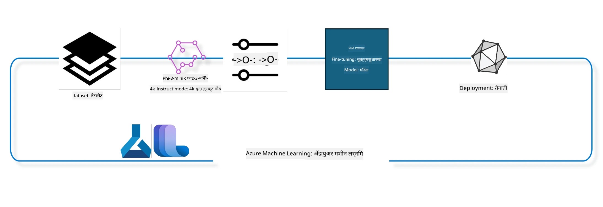

## Azure ML सिस्टम रजिस्ट्ररीमधील chat-completion घटकांचा वापर करून मॉडेलचे फाइन-ट्युनिंग कसे करावे

या उदाहरणात आपण ultrachat_200k डेटासेट वापरून Phi-3-mini-4k-instruct मॉडेलचे दोन लोकांमधील संभाषण पूर्ण करण्यासाठी फाइन ट्युनिंग करणार आहोत.



हे उदाहरण तुम्हाला Azure ML SDK आणि Python वापरून फाइन ट्युनिंग कसे करायचे आणि नंतर फाइन ट्युन केलेले मॉडेल ऑनलाइन एन्डपॉइंटवर रिअल टाइम इन्फरन्ससाठी कसे डिप्लॉय करायचे ते दाखवेल.

### प्रशिक्षण डेटा

आपण ultrachat_200k डेटासेट वापरणार आहोत. हे UltraChat डेटासेटचे खूप फिल्टर केलेले आवृत्ती आहे आणि Zephyr-7B-β, एक आघाडीचे 7b चॅट मॉडेल प्रशिक्षित करण्यासाठी वापरले गेले आहे.

### मॉडेल

आपण Phi-3-mini-4k-instruct मॉडेल वापरू जे वापरकर्त्यास चॅट-कंप्लेशन टास्कसाठी मॉडेल फाइनट्यून कसे करावे हे दाखवेल. जर तुम्ही हा नोटबुक एखाद्या विशिष्ट मॉडेल कार्डवरून उघडला असेल तर त्या विशिष्ट मॉडेलच्या नावाने बदला.

### कार्ये

- फाइन ट्युनिंगसाठी मॉडेल निवडा.
- प्रशिक्षण डेटा निवडा आणि तपासा.
- फाइन ट्युनिंग जॉब कॉन्फिगर करा.
- फाइन ट्युनिंग जॉब चालवा.
- प्रशिक्षण आणि मूल्यांकन मेट्रिक्स पुनरावलोकन करा.
- फाइन ट्युन केलेले मॉडेल नोंदणी करा.
- फाइन ट्युन केलेले मॉडेल रिअल टाइम इन्फरन्ससाठी डिप्लॉय करा.
- संसाधने स्वच्छ करा.

## 1. पूर्वअट सेटअप करा

- अवलंबित्वे इंस्टॉल करा
- AzureML वर्कस्पेसशी कनेक्ट करा. सेटअप SDK प्रमाणीकरण येथे अधिक जाणून घ्या. खाली <WORKSPACE_NAME>, <RESOURCE_GROUP> आणि <SUBSCRIPTION_ID> बदला.
- azureml सिस्टम रजिस्ट्ररीशी कनेक्ट करा
- एक पर्यायी प्रयोग नाव सेट करा
- कॉम्प्युट तपासा किंवा तयार करा.

> [!NOTE]
> आवश्यकतेनुसार एकच GPU नोडमध्ये एकाधिक GPU कार्ड असू शकतात. उदाहरणार्थ, Standard_NC24rs_v3 च्या एका नोडमध्ये 4 NVIDIA V100 GPU आहेत तर Standard_NC12s_v3 मध्ये 2 NVIDIA V100 GPU आहेत. याबाबतच्या माहितीसाठी दस्तऐवज पहा. दर नोड GPU कार्ड्सची संख्या खाली दिलेल्या gpus_per_node या पॅराममध्ये सेट केली जाते. योग्य रीतीने सेट केल्यास नोडमधील सर्व GPU चा वापर सुनिश्चित होईल. शिफारस केलेले GPU कॉम्प्युट SKU इथे आणि इथे पाहू शकता.

### Python लायब्ररी

खालील सेल चालवून अवलंबित्वे इंस्टॉल करा. नवीन वातावरणात चालवताना हा पर्यायी टप्पा नाही.

```bash
pip install azure-ai-ml
pip install azure-identity
pip install datasets==2.9.0
pip install mlflow
pip install azureml-mlflow
```

### Azure ML सह संवाद

1. हा Python स्क्रिप्ट Azure Machine Learning (Azure ML) सेवा सोबत संवाद करत आहे. हे काय करते त्याचे सारांश:

    - azure.ai.ml, azure.identity आणि azure.ai.ml.entities या पॅकेजमधून आवश्यक मॉड्यूल्स आयात करते. तसेच time मॉड्यूल आयात करते.

    - DefaultAzureCredential() वापरून प्रमाणीकरण करण्याचा प्रयत्न करते, जे Azure क्लाउडमध्ये जलद अॅप्स तयार करण्यासाठी सोप्पे प्रमाणीकरण प्रदान करते. जर हे अयशस्वी झाले तर InteractiveBrowserCredential() वापरते जे इंटरॅक्टिव लॉगिन प्रॉम्प्ट देते.

    - नंतर from_config पद्धती वापरून MLClient चे उदाहरण तयार करण्याचा प्रयत्न करते, जे config.json या डीफॉल्ट कॉन्फिग फाइलमधून कॉन्फिग वाचते. जर हे अयशस्वी झाले तर subscription_id, resource_group_name आणि workspace_name मनually देऊन MLClient चे एक उदाहरण तयार करते.

    - दुसरे MLClient उदाहरण तयार करते, जे Azure ML रजिस्ट्ररीसाठी आहे ज्याचे नाव "azureml" आहे. ही रजिस्ट्ररी तेथे मॉडेल्स, फाइन-ट्युनिंग पाइपलाइन आणि एन्व्हायर्नमेंट्स संग्रहित असतात.

    - experiment_name "chat_completion_Phi-3-mini-4k-instruct" सेट करते.

    - सध्याच्या वेळेचा टाइमस्टँप (सेकंदांत, फ्लोटिंग पॉइंट संख्या) पूर्णांकात बदली करून नंतर स्ट्रिंग मध्ये रूपांतरित करते. हा यूनिक टाइमस्टँप नावं व आवृत्त्यांसाठी वापरता येतो.

    ```python
    # Azure ML आणि Azure Identity मधील आवश्यक मोड्यूल आयात करा
    from azure.ai.ml import MLClient
    from azure.identity import (
        DefaultAzureCredential,
        InteractiveBrowserCredential,
    )
    from azure.ai.ml.entities import AmlCompute
    import time  # time मॉड्यूल आयात करा
    
    # DefaultAzureCredential वापरून प्रमाणीकरण करण्याचा प्रयत्न करा
    try:
        credential = DefaultAzureCredential()
        credential.get_token("https://management.azure.com/.default")
    except Exception as ex:  # जर DefaultAzureCredential अयशस्वी झाला तर InteractiveBrowserCredential वापरा
        credential = InteractiveBrowserCredential()
    
    # डीफॉल्ट कॉन्फिग फाइल वापरून MLClient उदाहरण तयार करण्याचा प्रयत्न करा
    try:
        workspace_ml_client = MLClient.from_config(credential=credential)
    except:  # जर ते अयशस्वी झाले तर तपशील मनually प्रदान करून MLClient उदाहरण तयार करा
        workspace_ml_client = MLClient(
            credential,
            subscription_id="<SUBSCRIPTION_ID>",
            resource_group_name="<RESOURCE_GROUP>",
            workspace_name="<WORKSPACE_NAME>",
        )
    
    # "azureml" नावाच्या Azure ML रजिस्ट्रीसाठी दुसरे MLClient उदाहरण तयार करा
    # हे रजिस्ट्री मॉडेल्स, फाईन-ट्यूनिंग पाईपलाइन्स आणि वातावरण साठवण्याचे ठिकाण आहे
    registry_ml_client = MLClient(credential, registry_name="azureml")
    
    # प्रयोगाचे नाव सेट करा
    experiment_name = "chat_completion_Phi-3-mini-4k-instruct"
    
    # अद्वितीय नाव आणि आवृत्तीसाठी वापरता येणारा अद्वितीय टाइमस्टँप तयार करा
    timestamp = str(int(time.time()))
    ```

## 2. फाइन ट्यूनिंगसाठी फाउंडेशन मॉडेल निवडा

1. Phi-3-mini-4k-instruct हा 3.8B पॅरामिटर्सचा, हलका, आघाडीचा खुला मॉडेल आहे जो Phi-2 साठी वापरलेल्या डेटासेटवर आधारित आहे. हे मॉडेल Phi-3 मॉडेल कुटुंबाचा भाग आहे, आणि मिनी आवृत्तीमध्ये 4K आणि 128K दोन प्रकार आहेत, ज्या टिकन्स आवृत्तींचा संदर्भ आहेत. आपले विशिष्ट उद्दिष्टासाठी हे मॉडेल फाइनट्यून करणे आवश्यक आहे. आपल्याला AzureML स्टुडिओतील मॉडेल कॅटलॉगमध्ये चॅट-कंप्लेशन टास्कनुसार हे मॉडेल ब्राउझ करता येतात. या उदाहरणात, Phi-3-mini-4k-instruct मॉडेल वापरले आहे. जर आपण हा नोटबुक दुसर्‍या मॉडेलसाठी उघडला असेल तर संबंधित मॉडेल नाव आणि आवृत्ती बदला.

> [!NOTE]
> मॉडेलची आयडी ही फाइन ट्युनिंग जॉबसाठी इन्पुट म्हणून दिली जाते. ही AzureML स्टुडिओ मॉडेल कॅटलॉगमधील मॉडेल तपशील पानातील Asset ID फील्डमध्येही उपलब्ध आहे.

2. हा Python स्क्रिप्ट Azure ML सेवा सोबत संवाद साधत आहे. ते काय करते त्याचा सारांश:

    - model_name ला "Phi-3-mini-4k-instruct" सेट करते.

    - registry_ml_client चे models प्रॉपर्टी वापरून Azure ML रजिस्ट्ररीतील या नावाचा नवीनतम आवृत्तीचा मॉडेल प्राप्त करण्यासाठी get मेथड वापरते. get मेथडला दोन आर्ग्युमेंट्स दिले जातात: मॉडेलचे नाव आणि लेबल ज्यात नवीनतम आवृत्ती मिळेल.

    - कन्सोलवर संदेश प्रिंट करते ज्यात फाइन-ट्युनिंगसाठी वापरल्या जाणार्‍या मॉडेलचे नाव, आवृत्ती आणि आयडी दाखवले आहेत. string.format मेथड मॉडेलचे नाव, आवृत्ती आणि आयडी संदेशात घालते. हे माहिती foundation_model च्या प्रॉपर्टीजद्वारे मिळते.

    ```python
    # मॉडेलचे नाव सेट करा
    model_name = "Phi-3-mini-4k-instruct"
    
    # Azure ML नोंदणीकडून मॉडेलचा नवीनतम आवृत्ती मिळवा
    foundation_model = registry_ml_client.models.get(model_name, label="latest")
    
    # मॉडेलचे नाव, आवृत्ती आणि आयडी प्रिंट करा
    # ही माहिती ट्रॅकिंग आणि डिबगिंगसाठी उपयुक्त आहे
    print(
        "\n\nUsing model name: {0}, version: {1}, id: {2} for fine tuning".format(
            foundation_model.name, foundation_model.version, foundation_model.id
        )
    )
    ```

## 3. जॉबसाठी वापरता येणारा कॉम्प्युट तयार करा

फाइनट्युन जॉब GPU कॉम्प्युटवरच काम करतो. कॉम्प्युटचा आकार मॉडेलच्या आकारावर अवलंबून असतो आणि योग्य कॉम्प्युट निवडणे बहुधा कठीण असते. या सेलमध्ये वापरकर्त्यास योग्य कॉम्प्युट निवडण्यासाठी मार्गदर्शन केले आहे.

> [!NOTE]
> खालील कॉम्प्युट्स अत्यंत ऑप्टिमाईज्ड कॉन्फिगरेशनसह कार्य करतात. कॉन्फिगरेशनमध्ये बदल केल्यास Cuda Out Of Memory त्रुटी येऊ शकते. अशा परिस्थितीत कॉम्प्युटला मोठ्या आकाराचे अपग्रेड करा.

> [!NOTE]
> compute_cluster_size निवडताना खात्री करा की कॉम्प्युट आपल्या रिसोर्स ग्रुपमध्ये उपलब्ध आहे. जर कॉम्प्युट उपलब्ध नसेल तर कॉम्प्युट संसाधनांसाठी प्रवेश मागणी करू शकता.

### फाइन ट्युनिंग सपोर्टसाठी मॉडेल तपासणे

1. हा Python स्क्रिप्ट Azure ML मॉडेल सोबत संवाद करतो. याचा सारांश:

    - ast मॉड्यूल आयात करतो, जे Python च्या abstract syntax grammar ची प्रक्रिया करण्यासाठी वापरले जाते.

    - foundation_model ऑब्जेक्टमध्ये finetune_compute_allow_list नावाचा टॅग आहे का ते तपासतो. Azure ML मध्ये टॅग म्हणजे key-value जोड्या ज्या मॉडेल फिल्टर आणि सॉर्ट करण्यासाठी वापरल्या जातात.

    - जर finetune_compute_allow_list टॅग अस्तित्वात असेल तर ast.literal_eval वापरून स्ट्रिंगमधील यादीत रूपांतरित करतो व computes_allow_list मध्ये ठेवतो. यानंतर लिहितो की यादीनुसार कॉम्प्युट तयार करायची आहे.

    - जर हा टॅग नसेल तर computes_allow_list None सेट करतो आणि लिहितो की हा टॅग मॉडेलच्या टॅग्समध्ये नाही.

    - संक्षेपात, हा स्क्रिप्ट मॉडेलच्या मेटाडेटामध्ये विशिष्ट टॅग तपासतो, त्याचे मूल्य यादीत रूपांतरित करतो (जर असले तर), आणि वापरकर्त्यास माहिती देतो.

    ```python
    # Python abstract syntax grammar च्या वृक्षांचे प्रक्रिया करण्यासाठी कार्ये प्रदान करणारे ast मॉड्यूल आयात करा
    import ast
    
    # मॉडेलच्या टॅगमध्ये 'finetune_compute_allow_list' टॅग आहे का ते तपासा
    if "finetune_compute_allow_list" in foundation_model.tags:
        # जर टॅग अस्तित्वात असेल, तर ast.literal_eval चा वापर करून टॅगच्या मूल्याचे (स्ट्रिंग) सुरक्षितपणे Python यादीत रूपांतर करा
        computes_allow_list = ast.literal_eval(
            foundation_model.tags["finetune_compute_allow_list"]
        )  # स्ट्रिंगला python यादीमध्ये रूपांतर करा
        # यादीतून एक compute तयार करावा याचा संदेश छापा
        print(f"Please create a compute from the above list - {computes_allow_list}")
    else:
        # जर टॅग अस्तित्वात नसेल, तर computes_allow_list ला None सेट करा
        computes_allow_list = None
        # 'finetune_compute_allow_list' टॅग मॉडेलच्या टॅगचा भाग नाही याचा संदेश छापा
        print("`finetune_compute_allow_list` is not part of model tags")
    ```

### कॉम्प्युट इंस्टेंस तपासणी

1. हा Python स्क्रिप्ट Azure ML सेवा सोबत संवाद करत कॉम्प्युट इंस्टेंससाठी विविध तपासण्या करतो. सारांश:

    - compute_cluster नावाने सेवेत असलेला कॉम्प्युट इंस्टेंस प्राप्त करण्याचा प्रयत्न करतो. provisioning स्थिती "failed" असल्यास ValueError फेकतो.

    - computes_allow_list != None असल्यास, लिस्टमधील सर्व कॉम्प्युट साइज नीचरेखी (lowercase) करतो आणि चालू कॉम्प्युट साइजची तुलना करतो. नसेल तर ValueError फेकतो.

    - computes_allow_list None असल्यास, कॉम्प्युट साइज अनसपोर्टेड GPU VM आकारांमध्ये आहे का ते तपासतो. असल्यास ValueError फेकतो.

    - वर्कस्पेसमधील उपलब्ध सर्व कॉम्प्युट साइजची यादी प्राप्त करतो, आणि प्रत्येक साईजच्या GPUs ची संख्या तपासून तपासणी करतो.

    - जर GPUs ची संख्या आढळली तर प्रिंट करतो, नाहीतर ValueError फेकतो.

    - सारांश, हा स्क्रिप्ट वर्कस्पेसमधील कॉम्प्युट इंस्टेंसच्या provisioning स्थिती, कॉम्प्युट साइज परवानगी किंवा नाकारलेले साइज आणि GPUs ची संख्या तपासतो.
    
    ```python
    # अपवाद संदेश मुद्रित करा
    print(e)
    # कार्यक्षेत्रात गणना आकार उपलब्ध नसल्यास ValueError उचला
    raise ValueError(
        f"WARNING! Compute size {compute_cluster_size} not available in workspace"
    )
    
    # Azure ML कार्यक्षेत्रातून गणना उदाहरण प्राप्त करा
    compute = workspace_ml_client.compute.get(compute_cluster)
    # तपासा की गणना उदाहरणाची provisioning स्थिती "अपयशी" आहे का
    if compute.provisioning_state.lower() == "failed":
        # provisioning स्थिती "अपयशी" असल्यास ValueError उचला
        raise ValueError(
            f"Provisioning failed, Compute '{compute_cluster}' is in failed state. "
            f"please try creating a different compute"
        )
    
    # तपासा की computes_allow_list None नाही
    if computes_allow_list is not None:
        # computes_allow_list मधील सर्व गणना आकार लहान अक्षरांमध्ये रुपांतर करा
        computes_allow_list_lower_case = [x.lower() for x in computes_allow_list]
        # तपासा की गणना उदाहरणाचा आकार computes_allow_list_lower_case मध्ये आहे का
        if compute.size.lower() not in computes_allow_list_lower_case:
            # गणना उदाहरणाचा आकार computes_allow_list_lower_case मध्ये नसेल तर ValueError उचला
            raise ValueError(
                f"VM size {compute.size} is not in the allow-listed computes for finetuning"
            )
    else:
        # अयोग्य GPU VM आकारांची यादी परिभाषित करा
        unsupported_gpu_vm_list = [
            "standard_nc6",
            "standard_nc12",
            "standard_nc24",
            "standard_nc24r",
        ]
        # तपासा की गणना उदाहरणाचा आकार unsupported_gpu_vm_list मध्ये आहे का
        if compute.size.lower() in unsupported_gpu_vm_list:
            # गणना उदाहरणाचा आकार unsupported_gpu_vm_list मध्ये असल्यास ValueError उचला
            raise ValueError(
                f"VM size {compute.size} is currently not supported for finetuning"
            )
    
    # गणना उदाहरणातील GPU ची संख्या आढळली आहे की नाही हे तपासण्यासाठी एक ध्वज प्रारंभ करा
    gpu_count_found = False
    # कार्यक्षेत्रातील सर्व उपलब्ध गणना आकारांची यादी मिळवा
    workspace_compute_sku_list = workspace_ml_client.compute.list_sizes()
    available_sku_sizes = []
    # उपलब्ध गणना आकारांच्या यादीवर पुनरावृत्ती करा
    for compute_sku in workspace_compute_sku_list:
        available_sku_sizes.append(compute_sku.name)
        # तपासा की गणना आकाराचे नाव गणना उदाहरणाच्या आकाराशी जुळते का
        if compute_sku.name.lower() == compute.size.lower():
            # जर तसे असेल, तर त्या गणना आकारासाठी GPU ची संख्या मिळवा आणि gpu_count_found True करा
            gpus_per_node = compute_sku.gpus
            gpu_count_found = True
    # जर gpu_count_found True असेल, तर गणना उदाहरणातील GPU ची संख्या मुद्रित करा
    if gpu_count_found:
        print(f"Number of GPU's in compute {compute.size}: {gpus_per_node}")
    else:
        # जर gpu_count_found False असेल तर ValueError उचला
        raise ValueError(
            f"Number of GPU's in compute {compute.size} not found. Available skus are: {available_sku_sizes}."
            f"This should not happen. Please check the selected compute cluster: {compute_cluster} and try again."
        )
    ```

## 4. फाइन-ट्युनिंगसाठी डेटासेट निवडा

1. आपण ultrachat_200k डेटासेट वापरत आहोत. या डेटासेटमध्ये चार विभाग आहेत, जे सुपरवाइज्ड फाइन-ट्युनिंगसाठी (sft) योग्य आहेत.
Generation ranking (gen). प्रत्येक विभागातील उदाहरणांची संख्या खालील प्रमाणे दाखवलेली आहे:

    ```bash
    train_sft test_sft  train_gen  test_gen
    207865  23110  256032  28304
    ```

1. पुढील काही सेल्स फाइन ट्युनिंगसाठी मूलभूत डेटा तयारी दर्शवितात:

### काही डेटा रकाने भासवणे

हा नमुना लवकर चालवायचा आहे, म्हणून आधीच ट्रिम केलेल्या ओळींपैकी 5% असलेले train_sft, test_sft फाइल्स जतन करा. याचा अर्थ फाइन ट्युन केलेल्या मॉडेलची अचूकता कमी असेल, म्हणून त्याचा प्रत्यक्ष वापर केला जाऊ नये.
download-dataset.py स्क्रिप्ट ultrachat_200k डेटासेट डाऊनलोड करून फाइनट्युन पाइपलाइन कंपोनंट उपयुक्त फॉरमॅटमध्ये ट्रान्सफॉर्म करते. डेटासेट मोठा असल्याने आपण केवळ त्याचा भागच वापरतो.

1. खालील स्क्रिप्ट केवळ डेटाचा 5% डाऊनलोड करते. dataset_split_pc पॅराम बदलून हा टक्केवारी वाढवू शकता.

> [!NOTE]
> काही भाषा मॉडेल्सचे वेगळे भाषा कोड असल्याने डेटासेटमधील कॉलम नावे त्यानुसार असावीत.

1. डेटा कसा दिसायला हवा याचा उदाहरण खाली आहे:
चॅट-कंप्लेशन डेटासेट पारकेट फॉरमॅटमध्ये साठवलेला आहे ज्यामध्ये प्रत्येक एन्ट्री खालील स्कीमाने लिहिलेली आहे:

    - हा JSON (JavaScript Object Notation) डॉक्युमेंट आहे, जो लोकप्रिय डेटा विनिमय फॉरमॅट आहे. हे executable कोड नाही, तर डेटा साठवण्यासाठी आणि वाहतुकीसाठी मार्ग आहे. याची रचना खालीलप्रमाणे:

    - "prompt": हा की एक स्ट्रिंग मूल्य धारण करतो जे AI सहाय्याकडे विचारलेला कार्य किंवा प्रश्न आहे.

    - "messages": हा की ऑब्जेक्ट्सची अरे (array) आहे. प्रत्येक ऑब्जेक्ट वापरकर्ता आणि AI सहाय्यक यांच्यातील संभाषणातील संदेश आहे. प्रत्येक संदेश ऑब्जेक्टमध्ये दोन की आहेत:

    - "content": संदेशाचा मजकूर असलेला स्ट्रिंग मूल्य.
    - "role": संदेश पाठवणाऱ्या घटकाची भूमिका, "user" किंवा "assistant" असू शकते.
    - "prompt_id": प्रॉम्प्टचा अनन्य ओळखपत्र असलेला स्ट्रिंग मूल्य.

1. या विशिष्ट JSON डॉक्युमेंटमध्ये एक संभाषण दाखवले आहे जिथे वापरकर्ता AI सहाय्यकाला एक dystopian कथा साठी नायक तयार करण्यास सांगतो. सहाय्यक प्रतिसाद देतो आणि वापरकर्ता अधिक तपशीलांची मागणी करतो. सहाय्यक अधिक माहिती देण्यास सहमत होतो. संपूर्ण संभाषण विशिष्ट प्रॉम्प्ट आयडीशी संबंधित आहे.

    ```python
    {
        // The task or question posed to an AI assistant
        "prompt": "Create a fully-developed protagonist who is challenged to survive within a dystopian society under the rule of a tyrant. ...",
        
        // An array of objects, each representing a message in a conversation between a user and an AI assistant
        "messages":[
            {
                // The content of the user's message
                "content": "Create a fully-developed protagonist who is challenged to survive within a dystopian society under the rule of a tyrant. ...",
                // The role of the entity that sent the message
                "role": "user"
            },
            {
                // The content of the assistant's message
                "content": "Name: Ava\n\n Ava was just 16 years old when the world as she knew it came crashing down. The government had collapsed, leaving behind a chaotic and lawless society. ...",
                // The role of the entity that sent the message
                "role": "assistant"
            },
            {
                // The content of the user's message
                "content": "Wow, Ava's story is so intense and inspiring! Can you provide me with more details.  ...",
                // The role of the entity that sent the message
                "role": "user"
            }, 
            {
                // The content of the assistant's message
                "content": "Certainly! ....",
                // The role of the entity that sent the message
                "role": "assistant"
            }
        ],
        
        // A unique identifier for the prompt
        "prompt_id": "d938b65dfe31f05f80eb8572964c6673eddbd68eff3db6bd234d7f1e3b86c2af"
    }
    ```

### डेटा डाऊनलोड करा

1. हा Python स्क्रिप्ट download-dataset.py नावाच्या सहायक स्क्रिप्टचा वापर करून डेटासेट डाऊनलोड करण्यासाठी आहे. ते काय करते याचा सारांश:

    - os मॉड्यूल आयात करते, जे ऑपरेटिंग सिस्टमवर अवलंबून कार्यांसाठी पोर्टेबल प्रवेश देते.

    - os.system वापरून शेलमध्ये download-dataset.py स्क्रिप्ट चालवतो, ज्यामध्ये dataset (HuggingFaceH4/ultrachat_200k), डाउनलोड डायरेक्टरी (ultrachat_200k_dataset), आणि डेटासेटचा विभाग टक्केवारीत (5) दिली जाते. os.system आदेशाची एग्झिट स्टेटस मिळवतो आणि exit_status मध्ये ठेवतो.

    - exit_status जर 0 नाही तर नोंदवतो की डेटासेट डाऊनलोडमध्ये त्रुटी झाली आहे आणि Exception उचलतो.

    - संक्षेपात, हा स्क्रिप्ट डेटासेट डाऊनलोडसाठी आदेश चालवतो आणि अयशस्वी झाल्यास अपवाद निर्माण करतो.
    
    ```python
    # ऑपरेटिंग सिस्टीमवर अवलंबून कार्यक्षमता वापरण्याचा मार्ग प्रदान करणारा os मॉड्यूल आयात करा
    import os
    
    # os.system फंक्शन वापरून विशिष्ट कमांड-लाइन आर्ग्युमेंटसह shell मध्ये download-dataset.py स्क्रिप्ट चालवा
    # आर्ग्युमेंटस डेटा सेट डाउनलोड करण्यासाठी (HuggingFaceH4/ultrachat_200k), डाउनलोड करण्यासाठी डिरेक्टरी (ultrachat_200k_dataset), आणि डेटा सेट विभाजित करण्याचा टक्केवारी (5) नमूद करतात
    # os.system फंक्शन चालवलेल्या कमांडचा exit status परतवते; हा status exit_status व्हेरिएबलमध्ये साठवला जातो
    exit_status = os.system(
        "python ./download-dataset.py --dataset HuggingFaceH4/ultrachat_200k --download_dir ultrachat_200k_dataset --dataset_split_pc 5"
    )
    
    # exit_status 0 नाही का ते तपासा
    # Unix-प्रकारच्या ऑपरेटिंग सिस्टीममध्ये, exit status 0 म्हणजे कमांड यशस्वी झाला आहे, तर इतर कोणताही नंबर त्रुटी दर्शवतो
    # जर exit_status 0 नसेल, तर डेटा सेट डाउनलोड करताना त्रुटी असल्याचा संदेश असलेली Exception उचलावी
    if exit_status != 0:
        raise Exception("Error downloading dataset")
    ```

### डेटा DataFrame मध्ये लोड करणे
1. हा Python स्क्रिप्ट JSON Lines फाइल pandas DataFrame मध्ये लोड करत आहे आणि पहिल्या 5 रकान्यांना दाखवत आहे. हे काय करते याचे विवरण इथे आहे:

    - हे pandas लायब्ररी आयात करते, जी डेटा मॅनिप्युलेशन आणि विश्लेषणासाठी एक शक्तिशाली लायब्ररी आहे.

    - हे pandas च्या डिस्प्ले पर्यायांसाठी कमाल कॉलम रुंदी 0 सेट करते. याचा अर्थ असा की प्रत्येक कॉलमचा पूर्ण मजकूर DataFrame प्रिंट करताना कापला जाणार नाही.

    - हे pd.read_json फंक्शन वापरून ultrachat_200k_dataset फोल्डरमधील train_sft.jsonl फाइल DataFrame मध्ये लोड करते. lines=True हा argument दाखवतो की फाइल JSON Lines स्वरूपात आहे, जिथे प्रत्येक ओळ स्वतंत्र JSON ऑब्जेक्ट आहे.

    - हे head मेथड वापरून DataFrame च्या पहिल्या 5 रकान्यांना दर्शवते. जर DataFrame मध्ये 5 पेक्षा कमी रकाने असतील, तर ती सर्व दाखवेल.

    - एकूणच, हा स्क्रिप्ट JSON Lines फाइल DataFrame मध्ये लोड करतो आणि पूर्ण कॉलम मजकूरासह पहिल्या 5 रकान्यांना दाखवतो.
    
    ```python
    # जोरदार डेटा हेरफेर आणि विश्लेषणासाठी वापरली जाणारी pandas लायब्ररी आयात करा
    import pandas as pd
    
    # pandas च्या प्रदर्शन पर्यायांसाठी कमाल स्तंभ रुंदी 0 सेट करा
    # याचा अर्थ असा की DataFrame छापल्यानंतर प्रत्येक स्तंभाचा पूर्ण मजकूर कापल्याविना दाखविला जाईल
    pd.set_option("display.max_colwidth", 0)
    
    # pd.read_json फंक्शनचा वापर करून ultrachat_200k_dataset डिरेक्टरीमधील train_sft.jsonl फाइल DataFrame मध्ये लोड करा
    # lines=True ही आर्ग्युमेंट दाखवते की फाइल JSON Lines फॉर्मॅटमध्ये आहे, जिथे प्रत्येक ओळ वेगळा JSON ऑब्जेक्ट आहे
    df = pd.read_json("./ultrachat_200k_dataset/train_sft.jsonl", lines=True)
    
    # DataFrame च्या पहिल्या 5 रकान्या दाखवण्यासाठी head मेथड वापरा
    # जर DataFrame मध्ये 5 पेक्षा कमी रकाने असतील तर ती सर्व दाखवली जातील
    df.head()
    ```

## 5. मॉडेल आणि डेटा इनपुट म्हणून वापरून फाइन ट्युनिंग जॉब सबमिट करा

chat-completion पाइपलाईन कॉम्पोनंट वापरणारा जॉब तयार करा. फाइन ट्युनिंगसाठी समर्थन केलेले सर्व पॅरामीटर्स जाणून घ्या.

### फाइनट्यून पॅरामीटर्स परिभाषित करा

1. फाइनट्यून पॅरामीटर्स दोन वर्गांमध्ये विभागले जाऊ शकतात - प्रशिक्षण पॅरामीटर्स, ऑप्टिमायझेशन पॅरामीटर्स

1. प्रशिक्षण पॅरामीटर्स हे प्रशिक्षणाशी संबंधित बाबी निश्चित करतात जसे की -

    - वापरण्याचा ऑप्टिमायझर, शेड्युलर
    - फाइनट्यून सुधारण्यासाठी मेट्रिक
    - प्रशिक्षण चरणांची संख्या आणि बॅच साईज वगैरे
    - ऑप्टिमायझेशन पॅरामीटर्स GPU मेमरी ऑप्टिमायझ करण्यास आणि संगणकीय संसाधने प्रभावी वापरण्यास मदत करतात.

1. खाली काही पॅरामीटर्स आहेत जे या वर्गात मोडतात. ऑप्टिमायझेशन पॅरामीटर्स प्रत्येक मॉडेलसाठी वेगळे असतात आणि मॉडेलसोबत पॅक केलेले असतात जी या फरकांना हाताळण्यासाठी.

    - deepspeed आणि LoRA सक्षम करा
    - मिक्स्ड प्रिसिजन प्रशिक्षण सक्षम करा
    - मल्टीनोड प्रशिक्षण सक्षम करा

> [!NOTE]
> देखरेखीखालील फाइनट्यूनिंग अलाइनमेंट गमावण्याचा किंवा भयंकर विसर पडण्याचा परिणाम होऊ शकतो. आम्ही या समस्येची तपासणी आणि फाइनट्यूनिंगनंतर अलाइनमेंट स्टेज चालवण्याचा सल्ला देतो.

### फाइनट्यूनिंग पॅरामीटर्स

1. हा Python स्क्रिप्ट मशीन लर्निंग मॉडेल फाइनट्यून करण्यासाठी पॅरामीटर्स सेट करत आहे. हे काय करते याचे विवरण इथे आहे:

    - हे डिफॉल्ट प्रशिक्षण पॅरामीटर्स सेट करते जसे की प्रशिक्षण कालावधी, प्रशिक्षण आणि मूल्यांकनासाठी बॅच साईज, शिक्षण दर, आणि शिक्षण दर शेड्युलर प्रकार.

    - डिफॉल्ट ऑप्टिमायझेशन पॅरामीटर्स सेट करतो जसे की Layer-wise Relevance Propagation (LoRa) आणि DeepSpeed लागू करायचा की नाही, आणि DeepSpeed स्टेज.

    - प्रशिक्षण आणि ऑप्टिमायझेशन पॅरामीटर्स एका शब्दकोशात एकत्र करतो ज्याला finetune_parameters म्हणतात.

    - तपासतो की foundation_model कडे कोणते तरी मॉडेल-विशिष्ट डिफॉल्ट पॅरामीटर्स आहेत का. असल्यास, चेतावणी संदेश छापतो आणि finetune_parameters मध्ये मॉडेल-विशिष्ट डिफॉल्ट्स अपडेट करतो. ast.literal_eval फंक्शन वापरून स्ट्रिंगमधील मॉडेल-विशिष्ट डिफॉल्ट्स Python डिक्शनरीमध्ये रूपांतरित करतो.

    - शेवटी वापरण्यासाठी फाइन-ट्युनिंग पॅरामीटर्सचे संच छापतो.

    - एकूणात, हा स्क्रिप्ट मशीन लर्निंग मॉडेल फाइनट्यूनसाठी पॅरामीटर्स सेट करतो आणि दाखवतो, आणि डिफॉल्ट पॅरामीटर्सवर मॉडेल-विशिष्ट पॅरामीटर्स ओव्हरराइड करण्याची क्षमता देते.

    ```python
    # प्रशिक्षणाच्या पूर्वनिर्धारित पॅरामीटर्सची मांडणी करा जसे की प्रशिक्षण एपोक्सची संख्या, प्रशिक्षण आणि मूल्यांकनासाठी बॅच साइज, शिक्षण दर, आणि शिक्षण दर अनुसूचक प्रकार
    training_parameters = dict(
        num_train_epochs=3,
        per_device_train_batch_size=1,
        per_device_eval_batch_size=1,
        learning_rate=5e-6,
        lr_scheduler_type="cosine",
    )
    
    # पूर्वनिर्धारित ऑप्टिमायझेशन पॅरामीटर्स ठरवा जसे की लेयर-वाइज रिलिव्हन्स प्रॉपगेशन (LoRa) आणि DeepSpeed लागू करायचे आहे का, आणि DeepSpeed टप्पा
    optimization_parameters = dict(
        apply_lora="true",
        apply_deepspeed="true",
        deepspeed_stage=2,
    )
    
    # प्रशिक्षण आणि ऑप्टिमायझेशन पॅरामीटर्स एकत्र करून finetune_parameters नावाच्या एका डिक्शनरीमध्ये ठेवा
    finetune_parameters = {**training_parameters, **optimization_parameters}
    
    # foundation_model कडे काही मॉडेल-विशिष्ट पूर्वनिर्धारित पॅरामीटर्स आहेत का ते तपासा
    # असल्यास, एक इशारा संदेश दाखवा आणि finetune_parameters डिक्शनरीमध्ये हे मॉडेल-विशिष्ट पूर्वनिर्धारित अपडेट करा
    # ast.literal_eval फंक्शन्सचा वापर मॉडेल-विशिष्ट पूर्वनिर्धारित स्ट्रिंगपासून Python डिक्शनरीमध्ये रूपांतर करण्यासाठी केला जातो
    if "model_specific_defaults" in foundation_model.tags:
        print("Warning! Model specific defaults exist. The defaults could be overridden.")
        finetune_parameters.update(
            ast.literal_eval(  # स्ट्रिंगला Python डिक्शनरीमध्ये रूपांतर करा
                foundation_model.tags["model_specific_defaults"]
            )
        )
    
    # चालवण्यासाठी वापरल्या जाणार्‍या अंतिम सलगी करणाऱ्या पॅरामीटर्सची छपाई करा
    print(
        f"The following finetune parameters are going to be set for the run: {finetune_parameters}"
    )
    ```

### प्रशिक्षण पाइपलाइन

1. हा Python स्क्रिप्ट प्रशिक्षण पाइपलाइनसाठी डिस्प्ले नाव तयार करण्याचे फंक्शन परिभाषित करतो आणि नंतर ते फंक्शन कॉल करून डिस्प्ले नाव तयार आणि छापतो. हे काय करते याचे विवरण:

1. get_pipeline_display_name फंक्शन परिभाषित केले गेले आहे. हे फंक्शन प्रशिक्षण पाइपलाइनशी संबंधित विविध पॅरामीटर्सवर आधारित डिस्प्ले नाव तयार करते.

1. फंक्शनच्या आत, तो एकूण बॅच साईज कॅल्क्युलेट करतो per-device बॅच साईज, ग्रॅडीयंट अ‍ॅक्युम्युलेशन स्टेप्स, प्रति नोड GPU संख्या, आणि फाइनट्यूनिंगसाठी वापरल्या जाणार्‍या नोड्सची संख्या गुणाकार करून.

1. इतर पॅरामीटर्स मिळवतो जसे शिक्षण दर शेड्युलर प्रकार, DeepSpeed लागू केला आहे का, DeepSpeed स्टेज, LoRa लागू केला आहे का, मॉडेल चेकपॉईंट्सची मर्यादा, आणि कमाल सिक्वेन्स लांबी.

1. या सर्व पॅरामीटर्ससह एक स्ट्रिंग तयार करतो ज्यामध्ये हायफनने वेगळे केलेले पॅरामीटर्स असतात. जर DeepSpeed किंवा LoRa लागू असेल तर स्ट्रिंगमध्ये अनुक्रमे "ds" नंतर DeepSpeed स्टेज किंवा "lora" समाविष्ट असतो. अन्यथा "nods" किंवा "nolora" यात समाविष्ट असतात.

1. फंक्शन हा स्ट्रिंग परत करतो जो प्रशिक्षण पाइपलाइनसाठी डिस्प्ले नाव म्हणून काम करतो.

1. फंक्शन परिभाषित केल्यानंतर, ते कॉल करून डिस्प्ले नाव तयार करते आणि ते छापते.

1. एकूणच, हा स्क्रिप्ट विविध पॅरामीटर्सवर आधारित मशीन लर्निंग प्रशिक्षण पाइपलाइनसाठी डिस्प्ले नाव तयार करतो आणि ते छापतो.

    ```python
    # प्रशिक्षण पाइपलाइनसाठी डिस्प्ले नाव तयार करण्यासाठी एक फंक्शन परिभाषित करा
    def get_pipeline_display_name():
        # प्रति-डिव्हाइस बॅच साईझ, ग्रॅडियंट संकलन चरणांची संख्या, प्रति नोड GPU ची संख्या आणि फाईन-ट्युनिंगसाठी वापरल्या जाणार्या नोड्सची संख्या यांना गुणाकार करून एकूण बॅच साईझ मोजा
        batch_size = (
            int(finetune_parameters.get("per_device_train_batch_size", 1))
            * int(finetune_parameters.get("gradient_accumulation_steps", 1))
            * int(gpus_per_node)
            * int(finetune_parameters.get("num_nodes_finetune", 1))
        )
        # शिक्षण दर नियोजकाचा प्रकार मिळवा
        scheduler = finetune_parameters.get("lr_scheduler_type", "linear")
        # DeepSpeed लागू केले आहे का ते मिळवा
        deepspeed = finetune_parameters.get("apply_deepspeed", "false")
        # DeepSpeed टप्पा मिळवा
        ds_stage = finetune_parameters.get("deepspeed_stage", "2")
        # जर DeepSpeed लागू असेल तर डिस्प्ले नावात "ds" आणि त्यानंतर DeepSpeed टप्पा समाविष्ट करा; नसल्यास "nods" समाविष्ट करा
        if deepspeed == "true":
            ds_string = f"ds{ds_stage}"
        else:
            ds_string = "nods"
        # लेयर-वार रीलेव्हन्स प्रॉपगेशन (LoRa) लागू आहे का ते मिळवा
        lora = finetune_parameters.get("apply_lora", "false")
        # जर LoRa लागू असेल तर डिस्प्ले नावात "lora" समाविष्ट करा; नसल्यास "nolora" समाविष्ट करा
        if lora == "true":
            lora_string = "lora"
        else:
            lora_string = "nolora"
        # ठेवायच्या मॉडेल चेकपॉइंट्सच्या संख्येची मर्यादा मिळवा
        save_limit = finetune_parameters.get("save_total_limit", -1)
        # जास्तीत जास्त सिक्वेन्स लांबी मिळवा
        seq_len = finetune_parameters.get("max_seq_length", -1)
        # सर्व या पॅरामीटर्सना हायफन वापरून जोडून डिस्प्ले नाव तयार करा
        return (
            model_name
            + "-"
            + "ultrachat"
            + "-"
            + f"bs{batch_size}"
            + "-"
            + f"{scheduler}"
            + "-"
            + ds_string
            + "-"
            + lora_string
            + f"-save_limit{save_limit}"
            + f"-seqlen{seq_len}"
        )
    
    # डिस्प्ले नाव तयार करण्यासाठी फंक्शन कॉल करा
    pipeline_display_name = get_pipeline_display_name()
    # डिस्प्ले नाव प्रिंट करा
    print(f"Display name used for the run: {pipeline_display_name}")
    ```

### पाइपलाइन कॉन्फिगर करणे

हा Python स्क्रिप्ट Azure Machine Learning SDK वापरून मशीन लर्निंग पाइपलाइन परिभाषित आणि कॉन्फिगर करतो. हे काय करते याचे विवरण इथे आहे:

1. आवश्यक मॉड्युल्स Azure AI ML SDK मधून आयात करतो.

1. रजिस्ट्रिमधून "chat_completion_pipeline" नावाचा पाइपलाइन कॉम्पोनंट प्राप्त करतो.

1. `@pipeline` डेकोरेटर आणि `create_pipeline` फंक्शनने पाइपलाइन जॉब परिभाषित करतो. पाइपलाइनचे नाव `pipeline_display_name` सेट केलेले आहे.

1. `create_pipeline` फंक्शनमध्ये, प्राप्त झालेल्या पाइपलाइन कॉम्पोनंटसाठी विविध पॅरामीटर्ससह इनिशियलाइझ करतो ज्यामध्ये मॉडेल पाथ, विविध स्टेजसाठी कॉम्प्युट क्लस्टर्स, प्रशिक्षण आणि चाचणीसाठी डेटा सेट्स, फाइन-ट्यूनिंगसाठी वापरल्या जाणाऱ्या GPU ची संख्या, आणि इतर फाइन-ट्यूनिंग पॅरामीटर्स.

1. फाइन-ट्यूनिंग जॉबचा आउटपुट पाइपलाइन जॉबच्या आउटपुटशी मॅप करतो. यामुळे फाइन-ट्यून केलेला मॉडेल सहजपणे रजिस्टर केला जाऊ शकतो, जे ऑनलाइन किंवा बॅच एंडपॉइंटवर मॉडेल तैनात करण्यासाठी आवश्यक आहे.

1. `create_pipeline` फंक्शन कॉल करून पाइपलाइनची उदाहरण तयार करतो.

1. पाइपलाइनची `force_rerun` सेटिंग `True` करतो, म्हणजे मागील जॉबच्या कॅशेड निकालांचा वापर केला जाणार नाही.

1. पाइपलाइनची `continue_on_step_failure` सेटिंग `False` करतो, म्हणजे कोणताही टप्पा अयशस्वी झाल्यास पाइपलाइन थांबेल.

1. एकूणच, हा स्क्रिप्ट Azure Machine Learning SDK वापरून चॅट कंप्लीशन टास्कसाठी मशीन लर्निंग पाइपलाइन परिभाषित आणि कॉन्फिगर करतो.

    ```python
    # Azure AI ML SDK मधून आवश्यक मॉड्यूल आयात करा
    from azure.ai.ml.dsl import pipeline
    from azure.ai.ml import Input
    
    # रजिस्ट्रिकडून "chat_completion_pipeline" नावाचा पाईपलाइन कॉम्पोनंट मिळवा
    pipeline_component_func = registry_ml_client.components.get(
        name="chat_completion_pipeline", label="latest"
    )
    
    # @pipeline डेकोरेटर आणि create_pipeline फंक्शनचा वापर करून पाईपलाइन जॉब परिभाषित करा
    # पाईपलाइनचे नाव pipeline_display_name असे सेट केले आहे
    @pipeline(name=pipeline_display_name)
    def create_pipeline():
        # विविध पॅरामीटर्ससह मिळवलेल्या पाईपलाइन कॉम्पोनंटला इनिशियलाइझ करा
        # यात मॉडेलचा मार्ग, वेगवेगळ्या टप्प्यांसाठी कम्प्युट क्लस्टर्स, प्रशिक्षण आणि चाचणीसाठी डेटासेट विभागणी, फाइन-ट्यूनिंगसाठी GPU ची संख्या आणि इतर फाइन-ट्यूनिंग पॅरामीटर्स समाविष्ट आहेत
        chat_completion_pipeline = pipeline_component_func(
            mlflow_model_path=foundation_model.id,
            compute_model_import=compute_cluster,
            compute_preprocess=compute_cluster,
            compute_finetune=compute_cluster,
            compute_model_evaluation=compute_cluster,
            # डेटासेट विभागणा पॅरामीटर्सशी मॅप करा
            train_file_path=Input(
                type="uri_file", path="./ultrachat_200k_dataset/train_sft.jsonl"
            ),
            test_file_path=Input(
                type="uri_file", path="./ultrachat_200k_dataset/test_sft.jsonl"
            ),
            # प्रशिक्षण सेटिंग्ज
            number_of_gpu_to_use_finetuning=gpus_per_node,  # कम्प्युटमध्ये उपलब्ध GPU च्या संख्येप्रमाणे सेट करा
            **finetune_parameters
        )
        return {
            # फाइन-ट्यूनिंग जॉबच्या आउटपुटला पाईपलाइन जॉबसह मॅप करा
            # जेणेकरून आपण फाइन-ट्यून केलेले मॉडेल सहज नोंदवू शकू
            # मॉडेल नोंदणी आवश्यक आहे जेणेकरून मॉडेल ऑनलाइन किंवा बॅच एंडपॉइंटवर डिप्लॉय करता येईल
            "trained_model": chat_completion_pipeline.outputs.mlflow_model_folder
        }
    
    # create_pipeline फंक्शन कॉल करून पाईपलाइनचा एक उदाहरण तयार करा
    pipeline_object = create_pipeline()
    
    # मागील जॉब्समधील कॅश केलेले निकाल वापरू नका
    pipeline_object.settings.force_rerun = True
    
    # स्टेप फेल झाल्यास पुढे जाण्याचा पर्याय False करा
    # याचा अर्थ कोणतीही स्टेप फेल झाल्यास पाईपलाइन थांबेल
    pipeline_object.settings.continue_on_step_failure = False
    ```

### जॉब सबमिट करा

1. हा Python स्क्रिप्ट Azure Machine Learning वर्कस्पेसमध्ये मशीन लर्निंग पाइपलाइन जॉब सबमिट करतो आणि नंतर जॉब पूर्ण होईपर्यंत थांबतो. हे काय करते याचे विवरण:

    - workspace_ml_client मधील jobs ऑब्जेक्टचा create_or_update मेथड कॉल करून पाइपलाइन जॉब सबमिट करतो. चालवायच्या पाइपलाइनसाठी pipeline_object दिलेले आहे आणि जॉब experiment_name अंतर्गत चालवला जातो.

    - नंतर workspace_ml_client मधील jobs ऑब्जेक्टचा stream मेथड कॉल करून पाइपलाइन जॉब पूर्ण होईपर्यंत थांबतो. थांबण्याचा जॉब pipeline_job ऑब्जेक्टच्या name अ‍ॅट्रीब्यूटने निर्धारित केला आहे.

    - एकूणच, हा स्क्रिप्ट Azure Machine Learning वर्कस्पेस मध्ये मशीन लर्निंग पाइपलाइन जॉब सबमिट करतो आणि जॉब पूर्ण होईपर्यंत थांबतो.

    ```python
    # Azure मशीन लर्निंग कार्यक्षेत्रात पाईपलाइन जॉब सबमिट करा
    # चालवायची पाईपलाइन pipeline_object ने निर्दिष्ट केली आहे
    # ज्या प्रयोगाअंतर्गत जॉब चालवला जातो तो experiment_name ने निर्दिष्ट करतो
    pipeline_job = workspace_ml_client.jobs.create_or_update(
        pipeline_object, experiment_name=experiment_name
    )
    
    # पाईपलाइन जॉब पूर्ण होईपर्यंत थांबा
    # थांबायचा जॉब pipeline_job ऑब्जेक्टच्या name गुणधर्माने निर्दिष्ट केला आहे
    workspace_ml_client.jobs.stream(pipeline_job.name)
    ```

## 6. फाइन ट्यून केलेला मॉडेल वर्कस्पेसमध्ये नोंदणी करा

फाइन ट्यूनिंग जॉबच्या आउटपुटमधून मॉडेल रजिस्टर करू. हे फाइन ट्यून केलेल्या मॉडेल आणि फाइन ट्यूनिंग जॉब यांच्यातील लिनेएज ट्रॅक करेल. फाइन ट्यूनिंग जॉब पुढे फाउंडेशन मॉडेल, डेटा आणि प्रशिक्षण कोडशी लिनेएज ट्रॅक करतो.

### एमएल मॉडेल नोंदणी

1. हा Python स्क्रिप्ट Azure Machine Learning पाइपलाइनमध्ये प्रशिक्षित मशीन लर्निंग मॉडेल नोंदणी करत आहे. हे काय करते याचे विवरण:

    - आवश्यक मॉड्युल्स Azure AI ML SDK मधून आयात करतो.

    - workspace_ml_client मधील jobs ऑब्जेक्टचा get मेथड कॉल करून आणि त्याच्या outputs अ‍ॅट्रीब्यूटला ऍक्सेस करून trained_model आउटपुट उपलब्ध आहे का ते तपासतो.

    - pipeline_job नाव आणि आउटपुट नाव ("trained_model") चा वापर करून प्रशिक्षित मॉडेलचा पाथ तयार करतो.

    - मूळ मॉडेल नावामध्ये "-ultrachat-200k" जोडून आणि स्लॅशेस हायफनने बदलून फाइन-ट्यून केलेल्या मॉडेलसाठी नाव परिभाषित करतो.

    - Model ऑब्जेक्ट तयार करून मॉडेल नोंदणीसाठी तयार होतो ज्यामध्ये मॉडेलचा पाथ, मॉडेल प्रकार (MLflow मॉडेल), मॉडेलचे नाव आणि आवृत्ती, आणि मॉडेलचे वर्णन यांचा समावेश आहे.

    - workspace_ml_client मधील models ऑब्जेक्टवर create_or_update मेथड कॉल करून Model ऑब्जेक्टसह मॉडेल नोंदणी करतो.

    - नोंदणीकृत मॉडेल छापतो.

1. एकूणच, हा स्क्रिप्ट Azure Machine Learning पाइपलाइनमध्ये प्रशिक्षित मशीन लर्निंग मॉडेल नोंदणी करतो.
    
    ```python
    # Azure AI ML SDK मधून आवश्यक मॉड्युल आयात करा
    from azure.ai.ml.entities import Model
    from azure.ai.ml.constants import AssetTypes
    
    # pipeline job मधून `trained_model` आउटपुट उपलब्ध आहे का ते तपासा
    print("pipeline job outputs: ", workspace_ml_client.jobs.get(pipeline_job.name).outputs)
    
    # pipeline job च्या नावाने आणि आउटपुटच्या नावाने ("trained_model") स्ट्रिंग फॉरमॅट करून प्रशिक्षित मॉडेलसाठी पाथ तयार करा
    model_path_from_job = "azureml://jobs/{0}/outputs/{1}".format(
        pipeline_job.name, "trained_model"
    )
    
    # मूळ मॉडेलच्या नावास "-ultrachat-200k" जोडून आणि कोणत्याही स्लॅशेसना हायफन्सने बदलून फाइन-ट्यून केलेल्या मॉडेलचे नाव निश्चित करा
    finetuned_model_name = model_name + "-ultrachat-200k"
    finetuned_model_name = finetuned_model_name.replace("/", "-")
    
    print("path to register model: ", model_path_from_job)
    
    # विविध पॅरामीटर्ससह Model ऑब्जेक्ट तयार करून मॉडेल नोंदणीसाठी तयारी करा
    # यामध्ये मॉडेलचा पाथ, मॉडेलचा प्रकार (MLflow मॉडेल), मॉडेलचे नाव आणि आवृत्ती, तसेच मॉडेलचे वर्णन यांचा समावेश आहे
    prepare_to_register_model = Model(
        path=model_path_from_job,
        type=AssetTypes.MLFLOW_MODEL,
        name=finetuned_model_name,
        version=timestamp,  # आवृत्तीच्या संघर्षापासून बचाव करण्यासाठी timestamp आवृत्ती म्हणून वापरा
        description=model_name + " fine tuned model for ultrachat 200k chat-completion",
    )
    
    print("prepare to register model: \n", prepare_to_register_model)
    
    # workspace_ml_client मधील models ऑब्जेक्टच्या create_or_update मेथडला Model ऑब्जेक्टच्या арг्युमेंटसह कॉल करून मॉडेल नोंदवा
    registered_model = workspace_ml_client.models.create_or_update(
        prepare_to_register_model
    )
    
    # नोंदणीकृत मॉडेल प्रिंट करा
    print("registered model: \n", registered_model)
    ```

## 7. फाइन ट्यून केलेला मॉडेल ऑनलाइन एंडपॉइंटवर तैनात करा

ऑनलाइन एंडपॉइंट्स एक टिकाऊ REST API देतात जे मॉडेल वापरणाऱ्या अनुप्रयोगांसह एकत्रित करता येते.

### एंडपॉइंट व्यवस्थापित करा

1. हा Python स्क्रिप्ट Azure Machine Learning मध्ये नोंदणीकृत मॉडेलसाठी मॅनेज्ड ऑनलाइन एंडपॉइंट तयार करतो. हे काय करते याचे विवरण:

    - आवश्यक मॉड्युल्स Azure AI ML SDK मधून आयात करतो.

    - "ultrachat-completion-" या स्ट्रिंगला टाइमस्टॅम्प जोडून ऑनलाइन एंडपॉइंटसाठी एक अनोखे नाव परिभाषित करतो.

    - ManagedOnlineEndpoint ऑब्जेक्ट तयार करून ऑनलाइन एंडपॉइंट तयार करण्यासाठी तयार होतो ज्यामध्ये एंडपॉइंटचे नाव, वर्णन, आणि प्रमाणीकरण मोड ("key") यांचा समावेश आहे.

    - workspace_ml_client वर begin_create_or_update मेथड कॉल करून ManagedOnlineEndpoint ऑब्जेक्टसह ऑनलाइन एंडपॉइंट तयार करतो आणि नंतर wait मेथड कॉल करून तयार होईपर्यंत थांबतो.

1. एकूणच, हा स्क्रिप्ट Azure Machine Learning मध्ये नोंदणीकृत मॉडेलसाठी मॅनेज्ड ऑनलाइन एंडपॉइंट तयार करतो.

    ```python
    # Azure AI ML SDK मधून आवश्यक मॉड्यूल्स इम्पोर्ट करा
    from azure.ai.ml.entities import (
        ManagedOnlineEndpoint,
        ManagedOnlineDeployment,
        ProbeSettings,
        OnlineRequestSettings,
    )
    
    # "ultrachat-completion-" स्ट्रिंगनंतर टाइमस्टँप जोडून ऑनलाइन एंडपॉइंटसाठी एक अद्वितीय नाव ठरवा
    online_endpoint_name = "ultrachat-completion-" + timestamp
    
    # विविध पॅरामिटर्ससह ManagedOnlineEndpoint ऑब्जेक्ट तयार करून ऑनलाइन एंडपॉइंट तयार करण्यास तयार व्हा
    # यामध्ये एंडपॉइंटचे नाव, एंडपॉइंटचे वर्णन आणि ऑथेंटिकेशन मोड ("key") यांचा समावेश आहे
    endpoint = ManagedOnlineEndpoint(
        name=online_endpoint_name,
        description="Online endpoint for "
        + registered_model.name
        + ", fine tuned model for ultrachat-200k-chat-completion",
        auth_mode="key",
    )
    
    # ManagedOnlineEndpoint ऑब्जेक्टसह workspace_ml_client च्या begin_create_or_update मेथडला कॉल करून ऑनलाइन एंडपॉइंट तयार करा
    # नंतर wait मेथड कॉल करून तयार होण्याच्या ऑपरेशन्सची वाट पाहा
    workspace_ml_client.begin_create_or_update(endpoint).wait()
    ```

> [!NOTE]
> येथे तैनातीसाठी समर्थन केलेल्या SKU ची यादी पाहू शकता - [Managed online endpoints SKU list](https://learn.microsoft.com/azure/machine-learning/reference-managed-online-endpoints-vm-sku-list)

### ML मॉडेल तैनात करणे

1. हा Python स्क्रिप्ट नोंदणीकृत मशीन लर्निंग मॉडेल Azure Machine Learning मधील मॅनेज्ड ऑनलाइन एंडपॉइंटवर तैनात करत आहे. हे काय करते याचे विवरण:

    - ast मॉड्युल आयात करतो, जे Python च्या abstract syntax grammar चे ट्री प्रोसेस करण्यासाठी फंक्शन्स पुरवतो.

    - तैनातीसाठी instance type "Standard_NC6s_v3" सेट करतो.

    - तपासतो की foundation model मध्ये inference_compute_allow_list टॅग आहे का. असल्यास, टॅगचे मूल्य स्ट्रिंगमधून Python सूचीमध्ये रूपांतरित करतो आणि inference_computes_allow_list मध्ये ठेवतो. नसेल तर त्याला None सेट करतो.

    - तपासतो की दिलेले instance type allow list मध्ये आहे का. नसल्यास, वापरकर्त्याला allow list मधून instance type निवडण्याचा संदेश छापतो.

    - ManagedOnlineDeployment ऑब्जेक्ट तयार करून deployment तयार करण्यासाठी तयार होतो ज्यामध्ये deployment नाव, endpoint नाव, मॉडेल ID, instance type आणि count, liveness probe सेटिंग्ज, आणि request सेटिंग्ज यांचा समावेश आहे.

    - workspace_ml_client वर begin_create_or_update मेथड कॉल करून ManagedOnlineDeployment ऑब्जेक्टसह तैनात करतो आणि नंतर wait मेथड कॉल करून तैनात होईपर्यंत थांबतो.

    - एंडपॉइंटचे ट्रॅफिक 100% "demo" deployment कडे directs करतो.

    - workspace_ml_client वर begin_create_or_update मेथड कॉल करून एंडपॉइंट अपडेट करतो आणि नंतर result मेथड कॉल करून अपडेट पूर्ण होईपर्यंत थांबतो.

1. एकूणच, हा स्क्रिप्ट Azure Machine Learning मध्ये नोंदणीकृत मशीन लर्निंग मॉडेल मॅनेज्ड ऑनलाइन एंडपॉइंटवर तैनात करतो.

    ```python
    # ast मॉड्यूल आयात करा, जे Python सारांश व्याकरणाच्या वृक्षांचे प्रक्रिया करण्यासाठी कार्ये प्रदान करते
    import ast
    
    # डिप्लॉयमेंटसाठी इन्स्टन्स प्रकार सेट करा
    instance_type = "Standard_NC6s_v3"
    
    # तपासा की `inference_compute_allow_list` टॅग फाउंडेशन मॉडेलमध्ये आहे का
    if "inference_compute_allow_list" in foundation_model.tags:
        # असल्यास, टॅग मूल्य स्ट्रिंगमधून Python यादीत रूपांतरित करा आणि `inference_computes_allow_list` ला सेट करा
        inference_computes_allow_list = ast.literal_eval(
            foundation_model.tags["inference_compute_allow_list"]
        )
        print(f"Please create a compute from the above list - {computes_allow_list}")
    else:
        # नसल्यास, `inference_computes_allow_list` ला `None` सेट करा
        inference_computes_allow_list = None
        print("`inference_compute_allow_list` is not part of model tags")
    
    # तपासा की निर्दिष्ट इन्स्टन्स प्रकार परवानगी यादीमध्ये आहे का
    if (
        inference_computes_allow_list is not None
        and instance_type not in inference_computes_allow_list
    ):
        print(
            f"`instance_type` is not in the allow listed compute. Please select a value from {inference_computes_allow_list}"
        )
    
    # विविध पॅरामीटर्ससह `ManagedOnlineDeployment` ऑब्जेक्ट तयार करून डिप्लॉयमेंट तयार करण्यासाठी तयार व्हा
    demo_deployment = ManagedOnlineDeployment(
        name="demo",
        endpoint_name=online_endpoint_name,
        model=registered_model.id,
        instance_type=instance_type,
        instance_count=1,
        liveness_probe=ProbeSettings(initial_delay=600),
        request_settings=OnlineRequestSettings(request_timeout_ms=90000),
    )
    
    # `ManagedOnlineDeployment` ऑब्जेक्टला आर्ग्युमेंट म्हणून देऊन `workspace_ml_client` च्या `begin_create_or_update` पद्धतीने डिप्लॉयमेंट तयार करा
    # मग `wait` पद्धती कॉल करून तयार होण्याची प्रक्रिया पूर्ण होईपर्यंत प्रतीक्षा करा
    workspace_ml_client.online_deployments.begin_create_or_update(demo_deployment).wait()
    
    # एंडपॉइंटचा ट्रॅफिक 100% "demo" डिप्लॉयमेंटकडे मार्गदर्शित करण्यासाठी सेट करा
    endpoint.traffic = {"demo": 100}
    
    # `endpoint` ऑब्जेक्ट आर्ग्युमेंट म्हणून देऊन `workspace_ml_client` च्या `begin_create_or_update` पद्धतीने एंडपॉइंट अपडेट करा
    # मग `result` पद्धती कॉल करून अपडेट होण्याची प्रक्रिया पूर्ण होईपर्यंत प्रतीक्षा करा
    workspace_ml_client.begin_create_or_update(endpoint).result()
    ```

## 8. नमुना डेटासह एंडपॉइंटची चाचणी करा

टेस्ट डेटासेटमधून काही नमुना डेटा आणून ऑनलाइन एंडपॉइंटवर इनफरन्ससाठी सबमिट करू. नंतर स्कोर्ड लेबल्स आणि ग्राउंड ट्रूथ लेबल्स एकत्र दाखवू.

### निकाल वाचणे

1. हा Python स्क्रिप्ट JSON Lines फाइल pandas DataFrame मध्ये वाचतो, यादृच्छिक नमुना घेतो, आणि इंडेक्स रीसेट करतो. हे काय करते याचे विवरण:

    - ./ultrachat_200k_dataset/test_gen.jsonl फाइल pandas DataFrame मध्ये वाचतो. read_json फंक्शन lines=True argument सह वापरले गेले आहे कारण फाइल JSON Lines स्वरूपात आहे, जिथे प्रत्येक ओळ स्वतंत्र JSON ऑब्जेक्ट आहे.

    - DataFrame मधून 1 ओळीचा यादृच्छिक नमुना घेतो. sample फंक्शन n=1 argument सह वापरले आहे ज्याने यादृच्छिक रकान्यांची संख्या निर्दिष्ट केली आहे.

    - DataFrame चा इंडेक्स रीसेट करतो. reset_index फंक्शन drop=True argument सह वापरले आहे जे मूळ इंडेक्स काढून नवीन डिफॉल्ट पूर्णांक इंडेक्स बनवतो.

    - head फंक्शन 2 argument सह वापरून DataFrame मधील पहिल्या 2 रकान्यांना दर्शवतो. परंतु एकदा नमुना घेतल्यावर DataFrame मध्ये एकच रकाणा असल्याने फक्त तोच रकाणा दाखवेल.

1. एकत्रितपणे, हा स्क्रिप्ट JSON Lines फाइल pandas DataFrame मध्ये वाचतो, 1 रकाण्याचा यादृच्छिक नमुना घेतो, इंडेक्स रीसेट करतो, आणि पहिला रकाणा दाखवतो.
    
    ```python
    # पांडा लायब्ररी आयात करा
    import pandas as pd
    
    # JSON Lines फाइल './ultrachat_200k_dataset/test_gen.jsonl' पांडास DataFrame मध्ये वाचा
    # 'lines=True' हा अर्ग्युमेंट सूचित करतो की फाइल JSON Lines स्वरूपात आहे, ज्यात प्रत्येक ओळ वेगळी JSON वस्तू आहे
    test_df = pd.read_json("./ultrachat_200k_dataset/test_gen.jsonl", lines=True)
    
    # DataFrame मधून 1 पंक्तीची यादृच्छिक नमुना घ्या
    # 'n=1' हा अर्ग्युमेंट निवडायच्या यादृच्छिक पंक्तींची संख्या निर्दिष्ट करतो
    test_df = test_df.sample(n=1)
    
    # DataFrame चा इंडेक्स रीसेट करा
    # 'drop=True' हा अर्ग्युमेंट सूचित करतो की मूळ इंडेक्स काढून टाकायला हवा आणि नवीन डिफॉल्ट पूर्णांक मूल्यासह बदलायचा आहे
    # 'inplace=True' हा अर्ग्युमेंट सूचित करतो की DataFrame स्थानिकरीत्या (नवीन ऑब्जेक्ट न तयार करता) सुधारायचा आहे
    test_df.reset_index(drop=True, inplace=True)
    
    # DataFrame मधील पहिले 2 पंक्ती प्रदर्शित करा
    # तथापि, नमुना घेण्याच्या नंतर DataFrame मध्ये फक्त एकच पंक्ती असल्याने, हे फक्त तीच एक पंक्ती दर्शवेल
    test_df.head(2)
    ```

### JSON ऑब्जेक्ट तयार करा
1. हा Python स्क्रिप्ट विशिष्ट पॅरामीटर्स असलेला JSON ऑब्जेक्ट तयार करत आहे आणि ते फायलीत जतन करत आहे. हे काय करत आहे त्याचे स्पष्टीकरण येथे आहे:

    - तो json मॉड्यूल इम्पोर्ट करतो, जे JSON डेटासह कार्य करण्यासाठी फंक्शन्स पुरवते.

    - तो parameters नावाचा एक शब्दकोश तयार करतो ज्यामध्ये मशीन लर्निंग मॉडेलसाठी पॅरामीटर्स दर्शवणारे की आणि मूल्ये असतात. की म्हणजे "temperature", "top_p", "do_sample", आणि "max_new_tokens", आणि त्यांची संबंधित मूल्ये अनुक्रमे 0.6, 0.9, True, आणि 200 आहेत.

    - तो आणखी एक test_json नावाचा शब्दकोश तयार करतो ज्यामध्ये दोन की आहेत: "input_data" आणि "params". "input_data" ची मूल्ये आणखी एका शब्दकोशात आहेत ज्यात की "input_string" आणि "parameters" आहेत. "input_string" ची मूल्ये test_df DataFrame मधील पहिला संदेश असलेल्या यादी आहेत. "parameters" ची मूल्ये पूर्वी तयार केलेल्या parameters शब्दकोशात आहे. "params" ची मूल्ये रिक्त शब्दकोश आहेत.

    - तो sample_score.json नावाची एक फाइल उघडतो
    
    ```python
    # JSON डेटा सह काम करण्यासाठी कार्ये प्रदान करणारा json मॉड्यूल आयात करा
    import json
    
    # मशीन लर्निंग मॉडेलसाठी पॅरामीटर्स दर्शवणाऱ्या की आणि मूल्यांसह `parameters` नावाचा एक शब्दकोश तयार करा
    # की "temperature", "top_p", "do_sample", आणि "max_new_tokens" आहेत, आणि त्यांची अनुक्रमे मूल्ये 0.6, 0.9, True, आणि 200 आहेत
    parameters = {
        "temperature": 0.6,
        "top_p": 0.9,
        "do_sample": True,
        "max_new_tokens": 200,
    }
    
    # "input_data" आणि "params" या दोन की असलेला दुसरा शब्दकोश `test_json` तयार करा
    # "input_data" ची किंमत दुसरा शब्दकोश आहे ज्यात की "input_string" आणि "parameters" आहेत
    # "input_string" ची किंमत `test_df` DataFrame मधील पहिला संदेश असलेली यादी आहे
    # "parameters" ची किंमत अगोदर तयार केलेला `parameters` शब्दकोश आहे
    # "params" ची किंमत रिक्त शब्दकोश आहे
    test_json = {
        "input_data": {
            "input_string": [test_df["messages"][0]],
            "parameters": parameters,
        },
        "params": {},
    }
    
    # `./ultrachat_200k_dataset` निर्देशिकेमधील `sample_score.json` नावाचा फाईल लेखन मोडमध्ये उघडा
    with open("./ultrachat_200k_dataset/sample_score.json", "w") as f:
        # `json.dump` फंक्शन वापरून `test_json` शब्दकोश JSON स्वरूपात फाइलमध्ये लिहा
        json.dump(test_json, f)
    ```

### एंडपॉईंट कॉल करणे

1. हा Python स्क्रिप्ट Azure Machine Learning मध्ये ऑनलाइन एंडपॉईंट कॉल करतो जेणेकरून JSON फाइलचे स्कोअर मिळवता येईल. हे काय करत आहे त्याचे स्पष्टीकरण येथे आहे:

    - तो workspace_ml_client ऑब्जेक्टच्या online_endpoints प्रॉपर्टीचा invoke मेथड कॉल करतो. हा मेथड ऑनलाइन एंडपॉईंटवर विनंती पाठविण्यासाठी आणि प्रतिसाद प्राप्त करण्यासाठी वापरला जातो.

    - तो endpoint_name आणि deployment_name यादीने एंडपॉईंटचे नाव आणि डिप्लॉयमेंट निर्दिष्ट करतो. या प्रकरणात, एंडपॉईंटचे नाव online_endpoint_name या व्हेरिएबलमध्ये संग्रहित आहे आणि डिप्लॉयमेंटचे नाव "demo" आहे.

    - तो request_file या आर्ग्युमेंटने स्कोअर करण्यासाठी JSON फाइलचा पाथ निर्दिष्ट करतो. या प्रकरणात, फाइलचा पाथ ./ultrachat_200k_dataset/sample_score.json आहे.

    - एंडपॉईंटकडून मिळालेला प्रतिसाद response व्हेरिएबलमध्ये साठवतो.

    - तो रॉ प्रतिसाद प्रिंट करतो.

1. सारांशात, हा स्क्रिप्ट Azure Machine Learning मध्ये ऑनलाइन एंडपॉईंट कॉल करतो जेणेकरून JSON फाइलचे स्कोअर मिळवता येईल आणि प्रतिसाद प्रिंट करतो.

    ```python
    # Azure मशीन लर्निंगमधील ऑनलाइन एंडपॉइंटला कॉल करा जेणेकरून `sample_score.json` फाईलचे स्कोअर घेता येईल
    # `workspace_ml_client` ऑब्जेक्टच्या `online_endpoints` प्रॉपर्टीचा `invoke` मेथड वापरून ऑनलाइन एंडपॉइंटला विनंती पाठवली जाते आणि प्रतिसाद मिळतो
    # `endpoint_name` आर्ग्युमेंट एंडपॉइंटचे नाव निर्दिष्ट करते, जे `online_endpoint_name` व्हेरिएबलमध्ये साठवलेले आहे
    # `deployment_name` आर्ग्युमेंट डिप्लॉयमेंटचे नाव निर्दिष्ट करते, जे "demo" आहे
    # `request_file` आर्ग्युमेंट स्कोअर करावयाच्या JSON फाईलचा पथ दर्शवितो, जो `./ultrachat_200k_dataset/sample_score.json` आहे
    response = workspace_ml_client.online_endpoints.invoke(
        endpoint_name=online_endpoint_name,
        deployment_name="demo",
        request_file="./ultrachat_200k_dataset/sample_score.json",
    )
    
    # एंडपॉइंटकडून मिळालेला ताजी उत्तर मुद्रित करा
    print("raw response: \n", response, "\n")
    ```

## 9. ऑनलाइन एंडपॉईंट हटवा

1. ऑनलाइन एंडपॉईंट नक्की हटवायला विसरू नका, अन्यथा तुम्ही एंडपॉईंटद्वारे वापरलेल्या कम्प्यूटसाठी बिले अजूनही चालू ठेवाल. ही Python कोडची ओळ Azure Machine Learning मध्ये ऑनलाइन एंडपॉईंट हटवत आहे. हे काय करत आहे त्याचे स्पष्टीकरण येथे आहे:

    - तो workspace_ml_client ऑब्जेक्टच्या online_endpoints प्रॉपर्टीचा begin_delete मेथड कॉल करतो. हा मेथड ऑनलाइन एंडपॉईंटची हटवण्याची प्रक्रिया सुरू करण्यासाठी वापरला जातो.

    - तो name आर्ग्युमेंटने हटवायच्या एंडपॉईंटचे नाव निर्दिष्ट करतो. या प्रकरणात, एंडपॉईंटचे नाव online_endpoint_name या व्हेरिएबलमध्ये संग्रहित आहे.

    - तो wait मेथड कॉल करतो जेणेकरून हटवण्याची प्रक्रिया पूर्ण होईपर्यंत थांबेल. हे एक ब्लॉकिंग ऑपरेशन आहे, म्हणजे स्क्रिप्ट पुढे सुरू राहणार नाही जोपर्यंत हटवण्याची प्रक्रिया पूर्ण होत नाही.

    - सारांशात, हि कोड ओळ Azure Machine Learning मध्ये ऑनलाइन एंडपॉईंट हटवण्यास सुरुवात करते आणि ऑपरेशन पूर्ण होईपर्यंत थांबते.

    ```python
    # Azure मशीन लर्निंग मधील ऑनलाइन एंडपॉइंट हटवा
    # `workspace_ml_client` ऑब्जेक्टच्या `online_endpoints` प्रॉपर्टीचा `begin_delete` मेथड ऑनलाइन एंडपॉइंट हटविणे सुरू करण्यासाठी वापरला जातो
    # `name` आर्ग्युमेंट हटवायच्या एंडपॉइंटचे नाव निर्दिष्ट करते, जे `online_endpoint_name` व्हेरिएबलमध्ये साठवलेले असते
    # `wait` मेथड हटवण्याच्या ऑपरेशनच्या पूर्ण होण्याची वाट पाहण्यासाठी कॉल केली जाते. हा एक ब्लॉकिंग ऑपरेशन आहे, म्हणजे हटवणे पूर्ण होईपर्यंत स्क्रिप्ट पुढे जाण्यास प्रतिबंधित करेल
    workspace_ml_client.online_endpoints.begin_delete(name=online_endpoint_name).wait()
    ```

---

<!-- CO-OP TRANSLATOR DISCLAIMER START -->
**सूचना**:
हा दस्तऐवज AI अनुवाद सेवा [Co-op Translator](https://github.com/Azure/co-op-translator) वापरून अनुवादित केला आहे. आम्ही अचूकतेसाठी प्रयत्नशील आहोत, तरी कृपया लक्षात घ्या की स्वयंचलित अनुवादांमध्ये चुका किंवा अचूकतेची कमतरता असू शकते. मूळ दस्तऐवज त्याच्या स्थानिक भाषेत अधिकृत स्रोत मानला पाहिजे. महत्त्वाची माहिती साठी व्यावसायिक मानव अनुवादाची शिफारस केली जाते. या अनुवादाच्या वापरामुळे उद्भवणाऱ्या कोणत्याही गैरसमजूती किंवा चुकीच्या अर्थांबद्दल आम्ही जबाबदार नाही.
<!-- CO-OP TRANSLATOR DISCLAIMER END -->