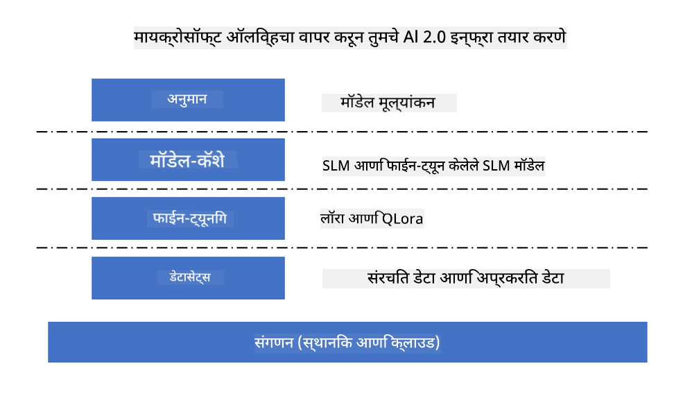
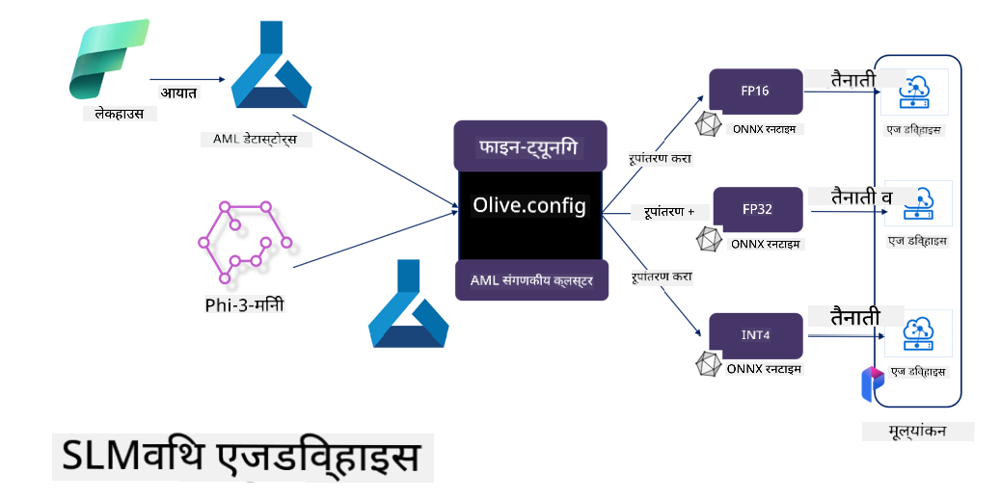

<!--
CO_OP_TRANSLATOR_METADATA:
{
  "original_hash": "5764be88ad2eb4f341e742eb8f14fab1",
  "translation_date": "2025-05-09T20:49:19+00:00",
  "source_file": "md/03.FineTuning/FineTuning_MicrosoftOlive.md",
  "language_code": "mr"
}
-->
# **Microsoft Olive सह Phi-3 चे फाइन-ट्यूनिंग**

[Olive](https://github.com/microsoft/OLive?WT.mc_id=aiml-138114-kinfeylo) हा एक सोपा वापरण्यासाठी हार्डवेअर-जाणणारा मॉडेल ऑप्टिमायझेशन टूल आहे, जो मॉडेल कंप्रेशन, ऑप्टिमायझेशन आणि कंपायलेशन यातील उद्योगातील आघाडीच्या तंत्रांचा एकत्रित वापर करतो.

हा मशीन लर्निंग मॉडेल्सचे ऑप्टिमायझेशन करण्याचा प्रोसेस सुलभ करण्यासाठी डिझाइन केला आहे, ज्यामुळे ते विशिष्ट हार्डवेअर आर्किटेक्चरचा जास्तीत जास्त कार्यक्षम वापर करू शकतात.

तुम्ही क्लाऊड-आधारित अ‍ॅप्लिकेशन्सवर काम करत असाल किंवा एज डिव्हाइसेसवर, Olive तुम्हाला तुमचे मॉडेल्स सहज आणि प्रभावीपणे ऑप्टिमाइझ करण्याची संधी देते.

## मुख्य वैशिष्ट्ये:
- Olive हवे असलेल्या हार्डवेअर टार्गेटसाठी ऑप्टिमायझेशन तंत्रे एकत्र करते आणि ऑटोमेट करते.
- एकाच ऑप्टिमायझेशन तंत्र सर्व परिस्थितींना लागू होत नसल्यामुळे, Olive उद्योग तज्ञांना त्यांचे नवकल्पना जोडण्याची मुभा देतो.

## अभियांत्रिकी मेहनत कमी करा:
- डेव्हलपर्सना अनेक हार्डवेअर विक्रेता-विशिष्ट टूलचेन शिकावे लागतात आणि वापरावे लागतात जेणेकरून प्रशिक्षित मॉडेल्स तैनात करण्यासाठी तयार करता येतील.
- Olive या अनुभवाला सोपे करतो आणि इच्छित हार्डवेअरसाठी ऑप्टिमायझेशन तंत्रे ऑटोमेट करून सुलभ करतो.

## तयार-उपयोग E2E ऑप्टिमायझेशन सोल्यूशन:

एकत्रित तंत्रे संयोजित आणि ट्यून करून, Olive एकत्रित एंड-टू-एंड ऑप्टिमायझेशन सोल्यूशन प्रदान करतो.
तो अचूकता आणि लेटन्सी सारख्या बंधनांना लक्षात घेऊन मॉडेल्स ऑप्टिमाइझ करतो.

## Microsoft Olive वापरून फाइन-ट्यूनिंग

Microsoft Olive हा एक अतिशय सोपा वापरता येणारा ओपन सोर्स मॉडेल ऑप्टिमायझेशन टूल आहे जो जनरेटिव्ह आर्टिफिशियल इंटेलिजन्सच्या क्षेत्रात फाइन-ट्यूनिंग आणि संदर्भ दोन्ही कव्हर करू शकतो. यासाठी फक्त सोपी कॉन्फिगरेशन आवश्यक आहे, ज्यामध्ये ओपन सोर्स लहान भाषा मॉडेल्स आणि संबंधित रनटाइम एन्व्हायर्नमेंट्स (AzureML / लोकल GPU, CPU, DirectML) यांचा वापर करून तुम्ही ऑटोमॅटिक ऑप्टिमायझेशनद्वारे मॉडेलचे फाइन-ट्यूनिंग किंवा संदर्भ पूर्ण करू शकता, आणि क्लाऊडवर किंवा एज डिव्हाइसेसवर तैनात करण्यासाठी सर्वोत्तम मॉडेल शोधू शकता. हे उद्योगांना त्यांच्या स्वतःच्या उद्योग विशिष्ट मॉडेल्स ऑन-प्रिमायसेस आणि क्लाऊडवर तयार करण्याची परवानगी देते.



## Microsoft Olive सह Phi-3 फाइन ट्यूनिंग



## Phi-3 Olive नमुना कोड आणि उदाहरण
या उदाहरणात तुम्ही Olive वापरून:

- LoRA अ‍ॅडॉप्टर फाइन-ट्यून करून वाक्यांशांना Sad, Joy, Fear, Surprise मध्ये वर्गीकृत कराल.
- अ‍ॅडॉप्टरचे वजन बेस मॉडेलमध्ये मर्ज कराल.
- मॉडेलला int4 मध्ये ऑप्टिमाइझ आणि क्वांटाइज कराल.

[Sample Code](../../code/03.Finetuning/olive-ort-example/README.md)

### Microsoft Olive सेटअप करा

Microsoft Olive ची इंस्टॉलेशन खूप सोपी आहे, आणि CPU, GPU, DirectML, तसेच Azure ML साठी देखील स्थापित केली जाऊ शकते.

```bash
pip install olive-ai
```

जर तुम्हाला ONNX मॉडेल CPU वर चालवायचा असेल, तर तुम्ही वापरू शकता

```bash
pip install olive-ai[cpu]
```

जर तुम्हाला ONNX मॉडेल GPU वर चालवायचा असेल, तर तुम्ही वापरू शकता

```python
pip install olive-ai[gpu]
```

जर तुम्हाला Azure ML वापरायचा असेल, तर वापरा

```python
pip install git+https://github.com/microsoft/Olive#egg=olive-ai[azureml]
```

**सूचना**
OS ची गरज : Ubuntu 20.04 / 22.04 

### **Microsoft Olive चा Config.json**

इंस्टॉलेशन नंतर, तुम्ही Config फाइलद्वारे वेगवेगळ्या मॉडेल-विशिष्ट सेटिंग्ज कॉन्फिगर करू शकता, ज्यात डेटा, कंप्यूटिंग, ट्रेनिंग, डिप्लॉयमेंट आणि मॉडेल जनरेशन यांचा समावेश आहे.

**1. डेटा**

Microsoft Olive वर, लोकल डेटा आणि क्लाऊड डेटा दोन्हीवर ट्रेनिंग सपोर्ट आहे, आणि सेटिंग्जमध्ये कॉन्फिगर केले जाऊ शकते.

*लोकल डेटा सेटिंग्ज*

तुम्ही फाइन-ट्यूनिंगसाठी ट्रेन करावयाचा डेटा सेट सोप्या पद्धतीने सेट करू शकता, सहसा json फॉरमॅटमध्ये, आणि डेटा टेम्पलेटसह जुळवून घेऊ शकता. हे मॉडेलच्या गरजेनुसार समायोजित करणे आवश्यक आहे (उदा. Microsoft Phi-3-mini साठी आवश्यक फॉरमॅटमध्ये जुळवणे. जर इतर मॉडेल्स असतील, तर त्यानुसार फाइन-ट्यूनिंगसाठी आवश्यक फॉरमॅट पाहा)

```json

    "data_configs": [
        {
            "name": "dataset_default_train",
            "type": "HuggingfaceContainer",
            "load_dataset_config": {
                "params": {
                    "data_name": "json", 
                    "data_files":"dataset/dataset-classification.json",
                    "split": "train"
                }
            },
            "pre_process_data_config": {
                "params": {
                    "dataset_type": "corpus",
                    "text_cols": [
                            "phrase",
                            "tone"
                    ],
                    "text_template": "### Text: {phrase}\n### The tone is:\n{tone}",
                    "corpus_strategy": "join",
                    "source_max_len": 2048,
                    "pad_to_max_len": false,
                    "use_attention_mask": false
                }
            }
        }
    ],
```

**क्लाऊड डेटा स्रोत सेटिंग्ज**

Azure AI Studio/Azure Machine Learning Service च्या डाटास्टोअरला लिंक करून क्लाऊडमधील डेटा वापरू शकता, आणि Microsoft Fabric आणि Azure Data च्या माध्यमातून वेगवेगळ्या डेटा स्रोतांना Azure AI Studio/Azure Machine Learning Service मध्ये आणू शकता, ज्यामुळे फाइन-ट्यूनिंगसाठी डेटा सपोर्ट मिळतो.

```json

    "data_configs": [
        {
            "name": "dataset_default_train",
            "type": "HuggingfaceContainer",
            "load_dataset_config": {
                "params": {
                    "data_name": "json", 
                    "data_files": {
                        "type": "azureml_datastore",
                        "config": {
                            "azureml_client": {
                                "subscription_id": "Your Azure Subscrition ID",
                                "resource_group": "Your Azure Resource Group",
                                "workspace_name": "Your Azure ML Workspaces name"
                            },
                            "datastore_name": "workspaceblobstore",
                            "relative_path": "Your train_data.json Azure ML Location"
                        }
                    },
                    "split": "train"
                }
            },
            "pre_process_data_config": {
                "params": {
                    "dataset_type": "corpus",
                    "text_cols": [
                            "Question",
                            "Best Answer"
                    ],
                    "text_template": "<|user|>\n{Question}<|end|>\n<|assistant|>\n{Best Answer}\n<|end|>",
                    "corpus_strategy": "join",
                    "source_max_len": 2048,
                    "pad_to_max_len": false,
                    "use_attention_mask": false
                }
            }
        }
    ],
    
```

**2. कंप्यूटिंग कॉन्फिगरेशन**

जर तुम्हाला लोकल वापरायचे असेल, तर थेट लोकल डेटा रिसोर्सेस वापरू शकता. जर Azure AI Studio / Azure Machine Learning Service चा वापर करायचा असेल, तर संबंधित Azure पॅरामीटर्स, कंप्यूटिंग पॉवरचे नाव इत्यादी कॉन्फिगर करावे लागतात.

```json

    "systems": {
        "aml": {
            "type": "AzureML",
            "config": {
                "accelerators": ["gpu"],
                "hf_token": true,
                "aml_compute": "Your Azure AI Studio / Azure Machine Learning Service Compute Name",
                "aml_docker_config": {
                    "base_image": "Your Azure AI Studio / Azure Machine Learning Service docker",
                    "conda_file_path": "conda.yaml"
                }
            }
        },
        "azure_arc": {
            "type": "AzureML",
            "config": {
                "accelerators": ["gpu"],
                "aml_compute": "Your Azure AI Studio / Azure Machine Learning Service Compute Name",
                "aml_docker_config": {
                    "base_image": "Your Azure AI Studio / Azure Machine Learning Service docker",
                    "conda_file_path": "conda.yaml"
                }
            }
        }
    },
```

***सूचना***

Azure AI Studio/Azure Machine Learning Service वर कंटेनरद्वारे चालवल्यामुळे आवश्यक एन्व्हायर्नमेंट कॉन्फिगरेशन करणे गरजेचे आहे. हे conda.yaml एन्व्हायर्नमेंटमध्ये कॉन्फिगर केले जाते.

```yaml

name: project_environment
channels:
  - defaults
dependencies:
  - python=3.8.13
  - pip=22.3.1
  - pip:
      - einops
      - accelerate
      - azure-keyvault-secrets
      - azure-identity
      - bitsandbytes
      - datasets
      - huggingface_hub
      - peft
      - scipy
      - sentencepiece
      - torch>=2.2.0
      - transformers
      - git+https://github.com/microsoft/Olive@jiapli/mlflow_loading_fix#egg=olive-ai[gpu]
      - --extra-index-url https://aiinfra.pkgs.visualstudio.com/PublicPackages/_packaging/ORT-Nightly/pypi/simple/ 
      - ort-nightly-gpu==1.18.0.dev20240307004
      - --extra-index-url https://aiinfra.pkgs.visualstudio.com/PublicPackages/_packaging/onnxruntime-genai/pypi/simple/
      - onnxruntime-genai-cuda

    

```

**3. तुमचा SLM निवडा**

तुम्ही Hugging Face वरून थेट मॉडेल वापरू शकता, किंवा Azure AI Studio / Azure Machine Learning च्या Model Catalog सोबत थेट जोडून वापरायचा मॉडेल निवडू शकता. खालील कोड उदाहरणात Microsoft Phi-3-mini वापरले आहे.

जर तुमच्याकडे मॉडेल लोकली असेल, तर हा मार्ग वापरा

```json

    "input_model":{
        "type": "PyTorchModel",
        "config": {
            "hf_config": {
                "model_name": "model-cache/microsoft/phi-3-mini",
                "task": "text-generation",
                "model_loading_args": {
                    "trust_remote_code": true
                }
            }
        }
    },
```

जर तुम्हाला Azure AI Studio / Azure Machine Learning Service मधील मॉडेल वापरायचा असेल, तर हा मार्ग वापरा

```json

    "input_model":{
        "type": "PyTorchModel",
        "config": {
            "model_path": {
                "type": "azureml_registry_model",
                "config": {
                    "name": "microsoft/Phi-3-mini-4k-instruct",
                    "registry_name": "azureml-msr",
                    "version": "11"
                }
            },
             "model_file_format": "PyTorch.MLflow",
             "hf_config": {
                "model_name": "microsoft/Phi-3-mini-4k-instruct",
                "task": "text-generation",
                "from_pretrained_args": {
                    "trust_remote_code": true
                }
            }
        }
    },
```

**सूचना:**
आम्हाला Azure AI Studio / Azure Machine Learning Service सोबत एकत्रित होणे आवश्यक आहे, त्यामुळे मॉडेल सेट करताना आवृत्ती क्रमांक आणि संबंधित नावांचा संदर्भ घ्या.

Azure वरील सर्व मॉडेल्स PyTorch.MLflow मध्ये सेट करणे आवश्यक आहे.

तुमच्याकडे Hugging Face खाते असणे आणि Azure AI Studio / Azure Machine Learning च्या Key value शी की बाइंड करणे आवश्यक आहे.

**4. अल्गोरिदम**

Microsoft Olive मध्ये Lora आणि QLora फाइन-ट्यूनिंग अल्गोरिदम चांगल्या प्रकारे एन्कॅप्स्युलेट केलेले आहेत. तुम्हाला फक्त काही संबंधित पॅरामीटर्स कॉन्फिगर करायचे आहेत. येथे मी QLora चे उदाहरण घेतले आहे.

```json
        "lora": {
            "type": "LoRA",
            "config": {
                "target_modules": [
                    "o_proj",
                    "qkv_proj"
                ],
                "double_quant": true,
                "lora_r": 64,
                "lora_alpha": 64,
                "lora_dropout": 0.1,
                "train_data_config": "dataset_default_train",
                "eval_dataset_size": 0.3,
                "training_args": {
                    "seed": 0,
                    "data_seed": 42,
                    "per_device_train_batch_size": 1,
                    "per_device_eval_batch_size": 1,
                    "gradient_accumulation_steps": 4,
                    "gradient_checkpointing": false,
                    "learning_rate": 0.0001,
                    "num_train_epochs": 3,
                    "max_steps": 10,
                    "logging_steps": 10,
                    "evaluation_strategy": "steps",
                    "eval_steps": 187,
                    "group_by_length": true,
                    "adam_beta2": 0.999,
                    "max_grad_norm": 0.3
                }
            }
        },
```

जर तुम्हाला क्वांटायझेशन कन्व्हर्शन करायचा असेल, तर Microsoft Olive मुख्य शाखा onnxruntime-genai पद्धतला आधीच सपोर्ट करते. तुम्ही तुमच्या गरजेनुसार सेट करू शकता:

1. अ‍ॅडॉप्टरचे वजन बेस मॉडेलमध्ये मर्ज करा  
2. ModelBuilder वापरून आवश्यक प्रिसिजनसह मॉडेल onnx मॉडेलमध्ये रूपांतर करा

उदा. क्वांटाइज्ड INT4 मध्ये रूपांतर करणे

```json

        "merge_adapter_weights": {
            "type": "MergeAdapterWeights"
        },
        "builder": {
            "type": "ModelBuilder",
            "config": {
                "precision": "int4"
            }
        }
```

**सूचना**  
- जर तुम्ही QLoRA वापरत असाल, तर सध्या ONNXRuntime-genai चा क्वांटायझेशन कन्व्हर्शन सपोर्ट नाही.  
- येथे नमूद करणे गरजेचे आहे की तुम्ही वरील पायऱ्या तुमच्या गरजेनुसार सेट करू शकता. वरील सर्व पायऱ्या पूर्णपणे कॉन्फिगर करणे आवश्यक नाही. तुमच्या गरजेनुसार, तुम्ही फक्त अल्गोरिदमच्या पायऱ्या वापरू शकता, फाइन-ट्यूनिंगशिवायही. शेवटी संबंधित इंजिन कॉन्फिगर करणे आवश्यक आहे.

```json

    "engine": {
        "log_severity_level": 0,
        "host": "aml",
        "target": "aml",
        "search_strategy": false,
        "execution_providers": ["CUDAExecutionProvider"],
        "cache_dir": "../model-cache/models/phi3-finetuned/cache",
        "output_dir" : "../model-cache/models/phi3-finetuned"
    }
```

**5. फाइन-ट्यूनिंग पूर्ण**

कमांड लाईनवर, olive-config.json च्या डायरेक्टरीमध्ये खालीलप्रमाणे चालवा

```bash
olive run --config olive-config.json  
```

**अस्वीकरण**:  
हा दस्तऐवज AI भाषांतर सेवा [Co-op Translator](https://github.com/Azure/co-op-translator) वापरून भाषांतरित केला आहे. आम्ही अचूकतेसाठी प्रयत्न करतो, तरी कृपया लक्षात ठेवा की स्वयंचलित भाषांतरांमध्ये चुका किंवा अचूकतेच्या त्रुटी असू शकतात. मूळ दस्तऐवज त्याच्या स्थानिक भाषेत अधिकृत स्रोत मानला जावा. महत्त्वाच्या माहितीसाठी व्यावसायिक मानवी भाषांतर करण्याची शिफारस केली जाते. या भाषांतराच्या वापरामुळे उद्भवलेल्या कोणत्याही गैरसमजुती किंवा चुकीच्या अर्थाने आम्ही जबाबदार नाही.