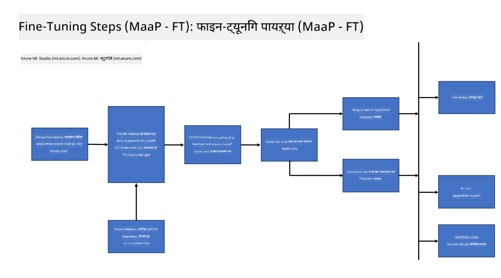

<!--
CO_OP_TRANSLATOR_METADATA:
{
  "original_hash": "cb5648935f63edc17e95ce38f23adc32",
  "translation_date": "2025-07-17T08:25:05+00:00",
  "source_file": "md/03.FineTuning/FineTuning_Scenarios.md",
  "language_code": "mr"
}
-->
## फाइन ट्यूनिंग परिस्थिती

**प्लॅटफॉर्म** यात Azure AI Foundry, Azure Machine Learning, AI Tools, Kaito, आणि ONNX Runtime यांसारख्या विविध तंत्रज्ञानांचा समावेश आहे.

**इन्फ्रास्ट्रक्चर** यात CPU आणि FPGA यांचा समावेश आहे, जे फाइन-ट्यूनिंग प्रक्रियेसाठी आवश्यक आहेत. या तंत्रज्ञानांसाठीचे चिन्हे मी तुम्हाला दाखवतो.

**टूल्स आणि फ्रेमवर्क** यात ONNX Runtime आणि ONNX Runtime यांचा समावेश आहे. या तंत्रज्ञानांसाठीची चिन्हे मी तुम्हाला दाखवतो.
[ONNX Runtime आणि ONNX Runtime साठी चिन्हे इथे घाला]

मायक्रोसॉफ्ट तंत्रज्ञानांसह फाइन-ट्यूनिंग प्रक्रियेत विविध घटक आणि टूल्स असतात. या तंत्रज्ञानांना समजून घेऊन आणि वापरून आपण आपल्या अॅप्लिकेशन्सचे प्रभावीपणे फाइन-ट्यूनिंग करू शकतो आणि चांगले उपाय तयार करू शकतो.

## मॉडेल अ‍ॅज सर्व्हिस

होस्टेड फाइन-ट्यूनिंग वापरून मॉडेल फाइन-ट्यून करा, ज्यासाठी कम्प्युट तयार करण्याची किंवा व्यवस्थापित करण्याची गरज नाही.

Phi-3-mini आणि Phi-3-medium मॉडेलसाठी सर्व्हरलेस फाइन-ट्यूनिंग उपलब्ध आहे, ज्यामुळे डेव्हलपर्सना क्लाउड आणि एज परिस्थितीसाठी मॉडेल्स जलद आणि सोप्या पद्धतीने सानुकूलित करता येतात, कम्प्युटची व्यवस्था न करता. तसेच, Phi-3-small आता Models-as-a-Service ऑफरिंगद्वारे उपलब्ध आहे, ज्यामुळे डेव्हलपर्सना AI विकास लवकर आणि सोप्या पद्धतीने सुरू करता येतो, underlying infrastructure व्यवस्थापित न करता.

## मॉडेल अ‍ॅज अ प्लॅटफॉर्म

वापरकर्ते स्वतःचा कम्प्युट व्यवस्थापित करून आपले मॉडेल फाइन-ट्यून करतात.

[Fine Tuning Sample](https://github.com/Azure/azureml-examples/blob/main/sdk/python/foundation-models/system/finetune/chat-completion/chat-completion.ipynb)

## फाइन ट्यूनिंग परिस्थिती

| | | | | | | |
|-|-|-|-|-|-|-|
|परिस्थिती|LoRA|QLoRA|PEFT|DeepSpeed|ZeRO|DORA|
|पूर्व-प्रशिक्षित LLMs विशिष्ट कार्ये किंवा क्षेत्रांसाठी अनुकूल करणे|होय|होय|होय|होय|होय|होय|
|NLP कार्यांसाठी फाइन-ट्यूनिंग जसे की टेक्स्ट वर्गीकरण, नामित घटक ओळख, आणि मशीन ट्रान्सलेशन|होय|होय|होय|होय|होय|होय|
|QA कार्यांसाठी फाइन-ट्यूनिंग|होय|होय|होय|होय|होय|होय|
|चॅटबॉट्समध्ये मानवीसारखे प्रतिसाद तयार करण्यासाठी फाइन-ट्यूनिंग|होय|होय|होय|होय|होय|होय|
|संगीत, कला किंवा इतर सर्जनशीलतेसाठी फाइन-ट्यूनिंग|होय|होय|होय|होय|होय|होय|
|संगणकीय आणि आर्थिक खर्च कमी करणे|होय|होय|नाही|होय|होय|नाही|
|मेमरी वापर कमी करणे|नाही|होय|नाही|होय|होय|होय|
|कार्यक्षम फाइन-ट्यूनिंगसाठी कमी पॅरामीटर्स वापरणे|नाही|होय|होय|नाही|नाही|होय|
|डेटा पॅरालेलिझमचा मेमरी-कार्यक्षम प्रकार जो उपलब्ध GPU उपकरणांच्या एकत्रित GPU मेमरीचा वापर करतो|नाही|नाही|नाही|होय|होय|होय|

## फाइन ट्यूनिंग कामगिरी उदाहरणे

**अस्वीकरण**:  
हा दस्तऐवज AI अनुवाद सेवा [Co-op Translator](https://github.com/Azure/co-op-translator) वापरून अनुवादित केला आहे. आम्ही अचूकतेसाठी प्रयत्नशील असलो तरी, कृपया लक्षात घ्या की स्वयंचलित अनुवादांमध्ये चुका किंवा अचूकतेची कमतरता असू शकते. मूळ दस्तऐवज त्याच्या स्थानिक भाषेत अधिकृत स्रोत मानला जावा. महत्त्वाच्या माहितीसाठी व्यावसायिक मानवी अनुवाद करण्याची शिफारस केली जाते. या अनुवादाच्या वापरामुळे उद्भवणाऱ्या कोणत्याही गैरसमजुती किंवा चुकीच्या अर्थलागी आम्ही जबाबदार नाही.