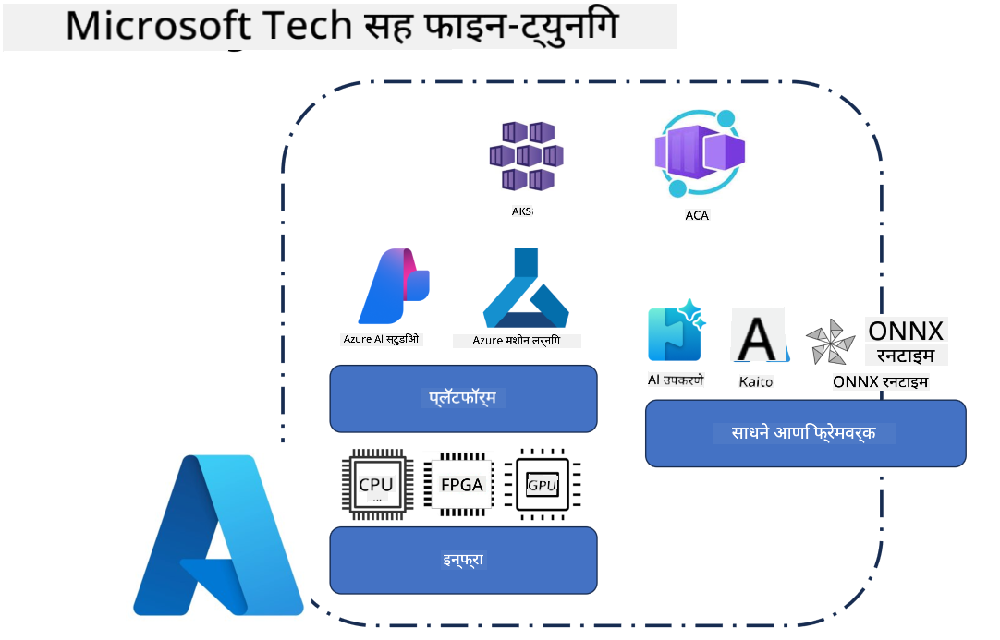
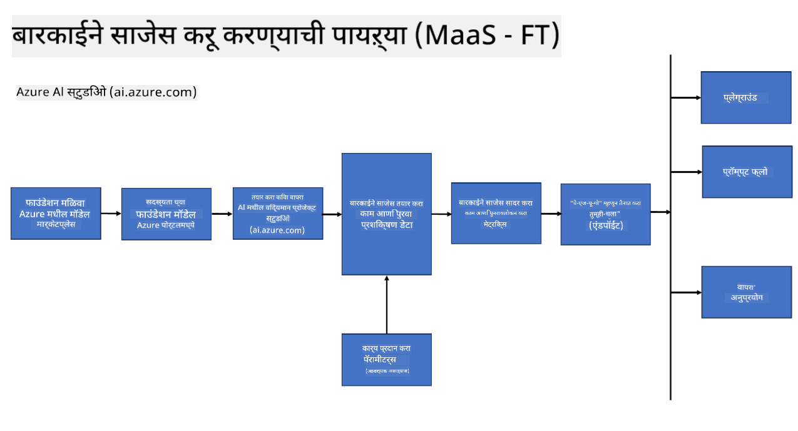
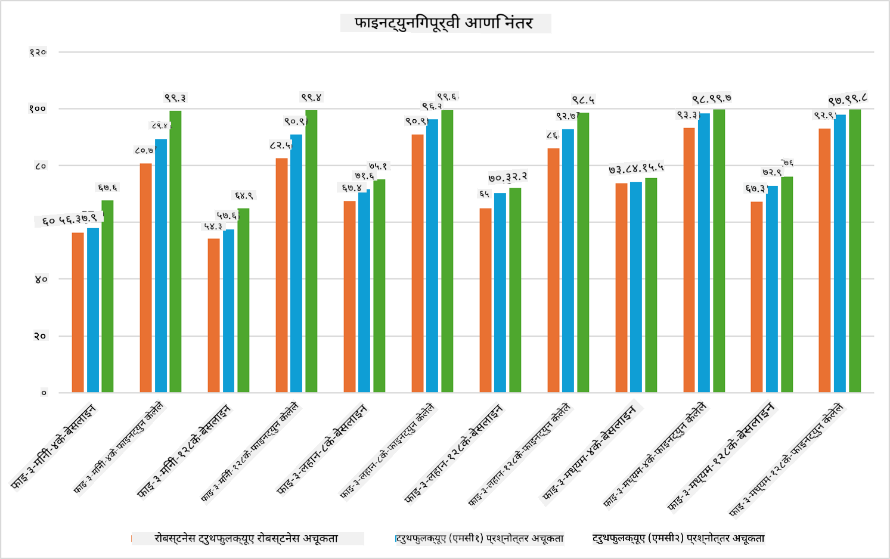

<!--
CO_OP_TRANSLATOR_METADATA:
{
  "original_hash": "cb5648935f63edc17e95ce38f23adc32",
  "translation_date": "2025-05-09T21:54:15+00:00",
  "source_file": "md/03.FineTuning/FineTuning_Scenarios.md",
  "language_code": "mr"
}
-->
## फाइन ट्यूनिंग परिस्थिती

**प्लॅटफॉर्म** यात Azure AI Foundry, Azure Machine Learning, AI Tools, Kaito, आणि ONNX Runtime सारख्या विविध तंत्रज्ञानांचा समावेश आहे.

**इन्फ्रास्ट्रक्चर** यात CPU आणि FPGA यांचा समावेश आहे, जे फाइन-ट्यूनिंग प्रक्रियेसाठी अत्यावश्यक आहेत. प्रत्येक तंत्रज्ञानासाठीच्या आयकॉन दाखवतो.

**टूल्स & फ्रेमवर्क** यात ONNX Runtime आणि ONNX Runtime यांचा समावेश आहे. प्रत्येक तंत्रज्ञानासाठी आयकॉन दाखवतो.
[Insert icons for ONNX Runtime and ONNX Runtime]

Microsoft तंत्रज्ञानांसह फाइन-ट्यूनिंग प्रक्रियेत विविध घटक आणि साधने असतात. या तंत्रज्ञानांचा समजून आणि वापर करून, आपण आमच्या अॅप्लिकेशन्सना प्रभावीपणे फाइन-ट्यून करू शकतो आणि चांगले सोल्यूशन्स तयार करू शकतो.

## मॉडेल एज सर्व्हिस

होस्टेड फाइन-ट्यूनिंग वापरून मॉडेल फाइन-ट्यून करा, ज्यासाठी कॉम्प्युट तयार करणे आणि व्यवस्थापन करणे आवश्यक नाही.

Phi-3-mini आणि Phi-3-medium मॉडेलसाठी सर्व्हरलेस फाइन-ट्यूनिंग उपलब्ध आहे, ज्यामुळे डेव्हलपर्सना क्लाउड आणि एज परिस्थितीसाठी मॉडेल्स जलद आणि सोप्या पद्धतीने सानुकूलित करता येतात, कॉम्प्युटची व्यवस्था न करता. तसेच, Phi-3-small आता Models-as-a-Service ऑफरिंगद्वारे उपलब्ध आहे, ज्यामुळे डेव्हलपर्सना AI विकास लवकर आणि सोप्या पद्धतीने सुरू करता येतो, कोणत्याही इन्फ्रास्ट्रक्चर व्यवस्थापनाशिवाय.

## मॉडेल एज अ प्लॅटफॉर्म

वापरकर्ते स्वतःचा कॉम्प्युट व्यवस्थापित करून त्यांचे मॉडेल फाइन-ट्यून करतात.

[Fine Tuning Sample](https://github.com/Azure/azureml-examples/blob/main/sdk/python/foundation-models/system/finetune/chat-completion/chat-completion.ipynb)

## फाइन ट्यूनिंग परिस्थिती

| | | | | | | |
|-|-|-|-|-|-|-|
|परिस्थिती|LoRA|QLoRA|PEFT|DeepSpeed|ZeRO|DORA|
|पूर्व-प्रशिक्षित LLMs विशिष्ट कामे किंवा क्षेत्रांसाठी जुळविणे|होय|होय|होय|होय|होय|होय|
|NLP कामांसाठी फाइन-ट्यूनिंग जसे की टेक्स्ट वर्गीकरण, नामित घटक ओळख, आणि मशीन ट्रान्सलेशन|होय|होय|होय|होय|होय|होय|
|QA कामांसाठी फाइन-ट्यूनिंग|होय|होय|होय|होय|होय|होय|
|चॅटबॉट्समध्ये मानवीसारखे प्रतिसाद तयार करण्यासाठी फाइन-ट्यूनिंग|होय|होय|होय|होय|होय|होय|
|संगीत, कला, किंवा इतर सर्जनशीलतेसाठी फाइन-ट्यूनिंग|होय|होय|होय|होय|होय|होय|
|गणनात्मक आणि आर्थिक खर्च कमी करणे|होय|होय|नाही|होय|होय|नाही|
|मेमरी वापर कमी करणे|नाही|होय|नाही|होय|होय|होय|
|कमी पॅरामिटर्स वापरून कार्यक्षम फाइनट्यूनिंग|नाही|होय|होय|नाही|नाही|होय|
|डेटा पॅरालेलिझमची मेमरी-कार्यक्षम पद्धत जी उपलब्ध GPU डिव्हाइसच्या एकूण GPU मेमरीपर्यंत प्रवेश देते|नाही|नाही|नाही|होय|होय|होय|

## फाइन ट्यूनिंग कामगिरी उदाहरणे

**अस्वीकरण**:  
हा दस्तऐवज AI अनुवाद सेवा [Co-op Translator](https://github.com/Azure/co-op-translator) वापरून अनुवादित केला आहे. आम्ही अचूकतेसाठी प्रयत्न करतो, तरी कृपया लक्षात ठेवा की स्वयंचलित अनुवादांमध्ये चुका किंवा अचूकतेत त्रुटी असू शकतात. मूळ दस्तऐवज त्याच्या स्थानिक भाषेत अधिकृत स्रोत मानला पाहिजे. महत्त्वाच्या माहितीकरिता व्यावसायिक मानवी अनुवाद शिफारस केला जातो. या अनुवादाच्या वापरामुळे होणाऱ्या कोणत्याही गैरसमजुती किंवा चुकीच्या अर्थलागी आम्ही जबाबदार नाही.