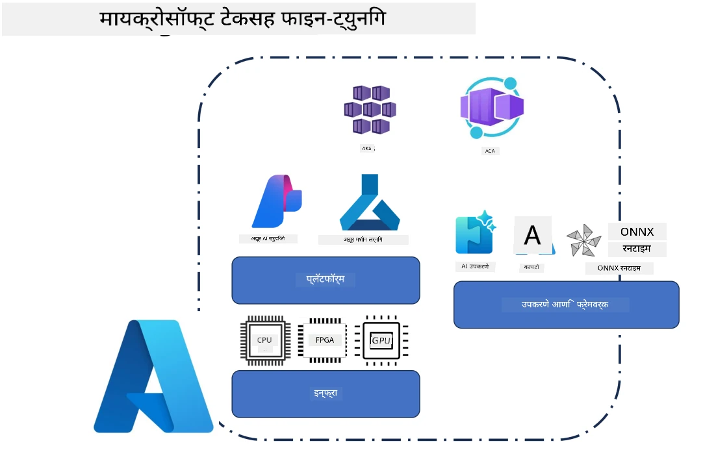
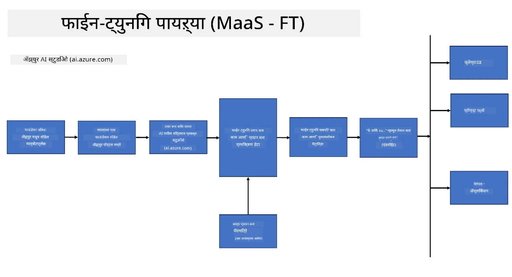
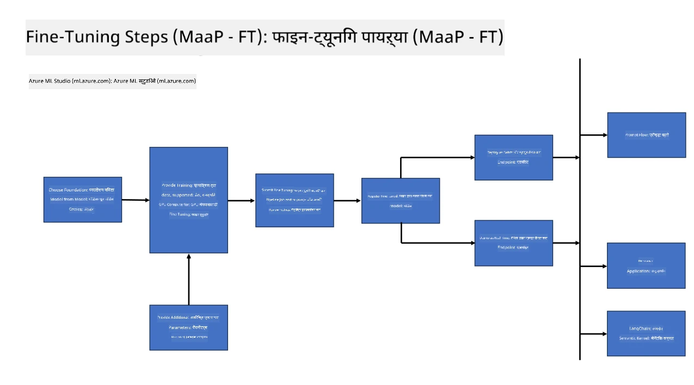
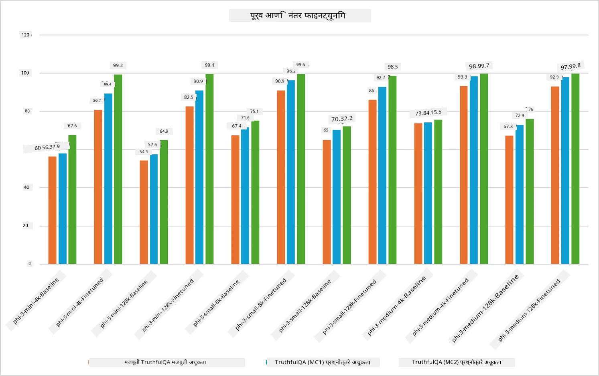

## फाईन ट्यूनिंग सीनारिओ

ही विभाग Microsoft Foundry आणि Azure वातावरणांमधील फाईन-ट्यूनिंग सीनारिओचा आढावा देते, ज्यामध्ये वितरण मॉडेल्स, पायाभूत अवयव आणि सामान्यतः वापरल्या जाणार्‍या ऑप्टिमायझेशन तंत्रांचा समावेश आहे.

**प्लॅटफॉर्म**  
यामध्ये Microsoft Foundry (पूर्वी Azure AI Foundry म्हणून ओळखले जाते) आणि Azure मशीन लर्निंग सारख्या व्यवस्थापित सेवा आहेत, ज्या मॉडेल व्यवस्थापन, संघटना, प्रायोगिक ट्रॅकिंग आणि वितरण वर्कफ्लोज प्रदान करतात.

**पायाभूत अवयव**  
फाईन-ट्यूनिंगसाठी स्केलेबल संगणन स्रोत आवश्यक आहेत. Azure वातावरणांमध्ये, यामध्ये बहुधा GPU-आधारित वर्च्युअल मशीन आणि हलक्या कामांसाठी CPU स्रोत तसेच डेटासेट आणि चेकपॉइंटसाठी स्केलेबल स्टोरेजचा समावेश असतो.

**साधने आणि फ्रेमवर्क**  
फाईन-ट्यूनिंग वर्कफ्लोज सहसा Hugging Face Transformers, DeepSpeed, आणि PEFT (परिमाण-कार्यक्षम फाईन-ट्यूनिंग) सारख्या फ्रेमवर्क आणि ऑप्टिमायझेशन लायब्ररींवर अवलंबून असतात.

Microsoft तंत्रज्ञानांसह फाईन-ट्यूनिंग प्रक्रिया प्लॅटफॉर्म सेवा, संगणन पायाभूत अवयव आणि प्रशिक्षण फ्रेमवर्क पर्यंत पसरलेली आहे. या घटकांची कार्यप्रणाली समजून घेऊन, विकसक मूळ मॉडेल्सना विशिष्ट कार्ये आणि उत्पादन सीनारिओसाठी प्रभावीपणे अनुकूल करू शकतात.

## सेवा म्हणून मॉडेल

होस्टेड फाईन-ट्यूनिंग वापरून मॉडेलचे फाईन-ट्यून करा, संगणन तयार करणे आणि व्यवस्थापित करण्याची गरज नाही.

सर्व्हरलेस फाईन-ट्यूनिंग आता Phi-3, Phi-3.5, आणि Phi-4 मॉडेल कुटुंबांसाठी उपलब्ध आहे, ज्यामुळे विकसकांना क्लाउड आणि एज सीनारिओसाठी मॉडेल्स त्वरीत आणि सहज सानुकूल करण्याची परवानगी मिळते, संगणन नियोजन न करता.

## प्लॅटफॉर्म म्हणून मॉडेल

वापरकर्ते स्वतःची संगणन व्यवस्थापित करतात जेणेकरुन त्यांचे मॉडेल फाईन-ट्यून करू शकतील.

[Fine Tuning Sample](https://github.com/Azure/azureml-examples/blob/main/sdk/python/foundation-models/system/finetune/chat-completion/chat-completion.ipynb)

## फाईन-ट्यूनिंग तंत्रांची तुळना

|सिनारिओ|LoRA|QLoRA|PEFT|DeepSpeed|ZeRO|DoRA|
|---|---|---|---|---|---|---|
|पूर्व-प्रशिक्षित LLMs विशिष्ट कार्ये किंवा क्षेत्रांसाठी अनुकूल करणे|होय|होय|होय|होय|होय|होय|
|टेक्स्ट वर्गीकरण, नामवाचक ओळख आणि मशीन भाषांतरण यांसारख्या NLP कार्यांसाठी फाईन-ट्यूनिंग|होय|होय|होय|होय|होय|होय|
|QA कार्यांसाठी फाईन-ट्यूनिंग|होय|होय|होय|होय|होय|होय|
|चॅटबॉटमध्ये मानवीसारखे प्रतिसाद निर्माण करण्यासाठी फाईन-ट्यूनिंग|होय|होय|होय|होय|होय|होय|
|संगीत, कला किंवा इतर सर्जनशीलतेच्या प्रकारांसाठी फाईन-ट्यूनिंग|होय|होय|होय|होय|होय|होय|
|संगणकीय व आर्थिक खर्च कमी करणे|होय|होय|होय|होय|होय|होय|
|संग्रहण वापर कमी करणे|होय|होय|होय|होय|होय|होय|
|कार्यक्षम फाईन-ट्यूनिंगसाठी कमी परिमाणांचा वापर|होय|होय|होय|नाही|नाही|होय|
|डेटा समानांतरतेचा स्मृती-कुशल प्रकार जो सर्व GPU उपकरणांच्या एकत्रित GPU स्मृतीपर्यंत प्रवेश देते|नाही|नाही|नाही|होय|होय|नाही|

> [!NOTE]
> LoRA, QLoRA, PEFT, आणि DoRA हे परिमाण-कार्यक्षम फाईन-ट्यूनिंग पद्धती आहेत, तर DeepSpeed आणि ZeRO वितरित प्रशिक्षण आणि स्मृती ऑप्टिमायझेशनवर लक्ष केंद्रित करतात.

## फाईन ट्यूनिंग कार्यक्षमता उदाहरणे

---

<!-- CO-OP TRANSLATOR DISCLAIMER START -->
**संबंधित सूचना**:  
हा दस्तऐवज AI अनुवाद सेवा [Co-op Translator](https://github.com/Azure/co-op-translator) चा वापर करून अनुवादित केला आहे. आम्ही अचूकतेसाठी प्रयत्न करतो, तरी कृपया लक्षात ठेवा की स्वयंचलित अनुवादांमध्ये चूका किंवा असमर्थता आढळू शकते. मूळ दस्तऐवज त्याच्या स्थानिक भाषेत अधिकृत स्रोत मानला जावा. महत्त्वपूर्ण माहितीसाठी व्यावसायिक मानवी अनुवाद करण्याची शिफारस केली जाते. या अनुवादाच्या वापरामुळे होणाऱ्या कोणत्याही गैरसमजुती किंवा चुकांसाठी आम्ही जबाबदार नाही.
<!-- CO-OP TRANSLATOR DISCLAIMER END -->