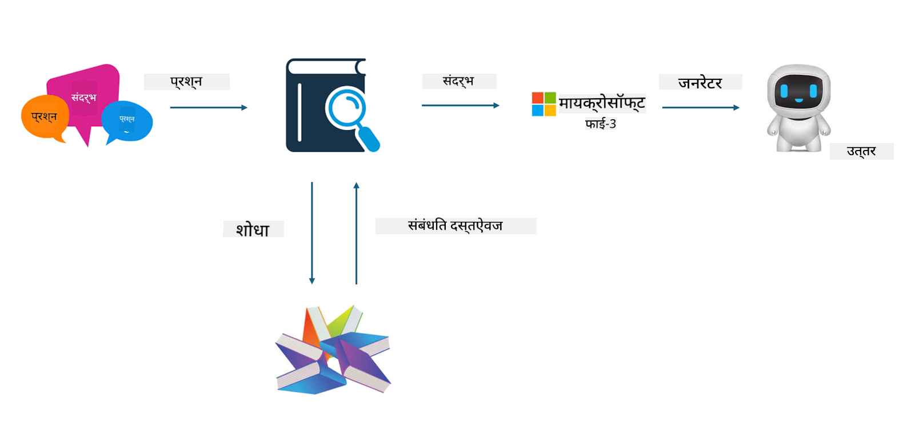

<!--
CO_OP_TRANSLATOR_METADATA:
{
  "original_hash": "e4e010400c2918557b36bb932a14004c",
  "translation_date": "2025-05-09T22:14:45+00:00",
  "source_file": "md/03.FineTuning/FineTuning_vs_RAG.md",
  "language_code": "mr"
}
-->
## Finetuning vs RAG

## Retrieval Augmented Generation

RAG म्हणजे डेटा रिट्रीव्हल + टेक्स्ट जनरेशन. एंटरप्राइजमधील स्ट्रक्चर्ड आणि अनस्ट्रक्चर्ड डेटा व्हेक्टर डेटाबेसमध्ये साठवले जातात. संबंधित कंटेंट शोधताना, संबंधित सारांश आणि कंटेंट शोधून त्यातून एक संदर्भ तयार केला जातो, आणि LLM/SLM ची टेक्स्ट कंप्लीशन क्षमता वापरून कंटेंट जनरेट केला जातो.

## RAG Process

## Fine-tuning
Fine-tuning म्हणजे एखाद्या मॉडेलमध्ये सुधारणा करणे. यासाठी मॉडेल अल्गोरिदमपासून सुरुवात करण्याची गरज नाही, पण डेटा सतत जमा करत राहावा लागतो. जर तुम्हाला इंडस्ट्री अप्लिकेशन्समध्ये अधिक अचूक टर्मिनॉलॉजी आणि भाषिक अभिव्यक्ती हवी असेल, तर fine-tuning हा उत्तम पर्याय आहे. पण तुमचा डेटा वारंवार बदलत असेल, तर fine-tuning करणे जास्त गुंतागुंतीचे होऊ शकते.

## How to choose
जर आमच्या उत्तरात बाह्य डेटाचा समावेश करणे आवश्यक असेल, तर RAG हा सर्वोत्तम पर्याय आहे.

जर तुम्हाला स्थिर आणि अचूक इंडस्ट्री ज्ञान द्यायचे असेल, तर fine-tuning चांगला पर्याय ठरेल. RAG संबंधित कंटेंट ओढण्यावर भर देते पण तज्ञांच्या सूक्ष्म फरकांमध्ये नेहमीच अचूक ठरू शकत नाही.

Fine-tuning साठी उच्च दर्जाचा डेटा सेट आवश्यक आहे, आणि जर डेटा फक्त कमी प्रमाणात असेल, तर फार फरक पडणार नाही. RAG अधिक लवचीक आहे.
Fine-tuning हा एक ब्लॅक बॉक्स आहे, एक मेटाफिजिक्ससारखा, आणि त्याचा अंतर्गत यंत्रणा समजून घेणे कठीण आहे. पण RAG मुळे डेटा कुठून आला हे शोधणे सोपे होते, ज्यामुळे hallucinations किंवा कंटेंट त्रुटी प्रभावीपणे सुधारता येतात आणि अधिक पारदर्शकता मिळते.

**अस्वीकरण**:  
हा दस्तऐवज AI भाषांतर सेवा [Co-op Translator](https://github.com/Azure/co-op-translator) वापरून भाषांतरित केला आहे. आम्ही अचूकतेसाठी प्रयत्न करतो, तरी कृपया लक्षात घ्या की स्वयंचलित भाषांतरांमध्ये चुका किंवा अचूकतेची कमतरता असू शकते. मूळ दस्तऐवज त्याच्या स्थानिक भाषेत अधिकृत स्रोत मानला जावा. महत्त्वाच्या माहितीसाठी व्यावसायिक मानवी भाषांतर शिफारस केली जाते. या भाषांतराच्या वापरामुळे झालेल्या कोणत्याही गैरसमजुती किंवा चुकीच्या अर्थलागी आम्ही जबाबदार नाही.