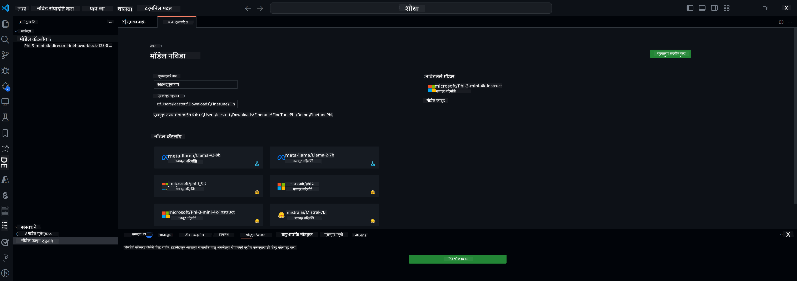

<!--
CO_OP_TRANSLATOR_METADATA:
{
  "original_hash": "c2bc0950f44919ac75a88c1a871680c2",
  "translation_date": "2025-07-17T09:07:28+00:00",
  "source_file": "md/03.FineTuning/Finetuning_VSCodeaitoolkit.md",
  "language_code": "mr"
}
-->
## VS Code साठी AI Toolkit मध्ये आपले स्वागत आहे

[AI Toolkit for VS Code](https://github.com/microsoft/vscode-ai-toolkit/tree/main) Azure AI Studio Catalog आणि Hugging Face सारख्या इतर कॅटलॉगमधील विविध मॉडेल्स एकत्र आणते. हे टूलकिट जनरेटिव्ह AI साधने आणि मॉडेल्स वापरून AI अॅप्स तयार करण्यासाठी सामान्य विकास कार्ये सुलभ करते:
- मॉडेल शोध आणि प्लेग्राउंडसह सुरुवात करा.
- स्थानिक संगणकीय संसाधने वापरून मॉडेल फाइन-ट्यूनिंग आणि इन्फरन्स.
- Azure संसाधने वापरून रिमोट फाइन-ट्यूनिंग आणि इन्फरन्स.

[VSCode साठी AI Toolkit इंस्टॉल करा](https://marketplace.visualstudio.com/items?itemName=ms-windows-ai-studio.windows-ai-studio)



**[Private Preview]** Azure Container Apps साठी एक-क्लिक प्रोव्हिजनिंग जे क्लाउडमध्ये मॉडेल फाइन-ट्यूनिंग आणि इन्फरन्स चालवते.

चला आता तुमच्या AI अॅप विकासात पुढे जाऊया:

- [VS Code साठी AI Toolkit मध्ये आपले स्वागत आहे](../../../../md/03.FineTuning)
- [स्थानिक विकास](../../../../md/03.FineTuning)
  - [तयारी](../../../../md/03.FineTuning)
  - [Conda सक्रिय करा](../../../../md/03.FineTuning)
  - [फक्त बेस मॉडेल फाइन-ट्यूनिंग](../../../../md/03.FineTuning)
  - [मॉडेल फाइन-ट्यूनिंग आणि इन्फरन्स](../../../../md/03.FineTuning)
  - [मॉडेल फाइन-ट्यूनिंग](../../../../md/03.FineTuning)
  - [Microsoft Olive](../../../../md/03.FineTuning)
  - [फाइन ट्यूनिंग नमुने आणि संसाधने](../../../../md/03.FineTuning)
- [**\[Private Preview\]** रिमोट विकास](../../../../md/03.FineTuning)
  - [पूर्वअट](../../../../md/03.FineTuning)
  - [रिमोट विकास प्रोजेक्ट सेटअप](../../../../md/03.FineTuning)
  - [Azure संसाधने प्रोव्हिजन करा](../../../../md/03.FineTuning)
  - [\[ऐच्छिक\] Azure Container App Secret मध्ये Huggingface टोकन जोडा](../../../../md/03.FineTuning)
  - [फाइन-ट्यूनिंग चालवा](../../../../md/03.FineTuning)
  - [इन्फरन्स एंडपॉइंट प्रोव्हिजन करा](../../../../md/03.FineTuning)
  - [इन्फरन्स एंडपॉइंट डिप्लॉय करा](../../../../md/03.FineTuning)
  - [प्रगत वापर](../../../../md/03.FineTuning)

## स्थानिक विकास
### तयारी

1. होस्टवर NVIDIA ड्रायव्हर इन्स्टॉल आहे याची खात्री करा.
2. जर तुम्ही HF वापरून डेटासेट वापरत असाल तर `huggingface-cli login` चालवा.
3. `Olive` की सेटिंग्ज स्मृती वापरावर परिणाम करणाऱ्या कोणत्याही गोष्टींसाठी स्पष्टीकरणे.

### Conda सक्रिय करा
आम्ही WSL वातावरण वापरत असल्याने आणि ते शेअर केलेले असल्याने तुम्हाला Conda वातावरण मॅन्युअली सक्रिय करावे लागेल. या टप्प्यानंतर तुम्ही फाइन-ट्यूनिंग किंवा इन्फरन्स चालवू शकता.

```bash
conda activate [conda-env-name] 
```

### फक्त बेस मॉडेल फाइन-ट्यूनिंग
फाइन-ट्यूनिंग न करता फक्त बेस मॉडेल वापरून पाहण्यासाठी Conda सक्रिय केल्यानंतर हा कमांड चालवा.

```bash
cd inference

# Web browser interface allows to adjust a few parameters like max new token length, temperature and so on.
# User has to manually open the link (e.g. http://0.0.0.0:7860) in a browser after gradio initiates the connections.
python gradio_chat.py --baseonly
```

### मॉडेल फाइन-ट्यूनिंग आणि इन्फरन्स

एकदा डेव्ह कंटेनरमध्ये वर्कस्पेस उघडल्यानंतर, टर्मिनल उघडा (डिफॉल्ट पथ प्रोजेक्ट रूट आहे), नंतर खालील कमांड चालवा ज्यामुळे निवडलेल्या डेटासेटवर LLM फाइन-ट्यून होईल.

```bash
python finetuning/invoke_olive.py 
```

चेकपॉइंट्स आणि अंतिम मॉडेल `models` फोल्डरमध्ये जतन केले जातील.

नंतर फाइन-ट्यून केलेल्या मॉडेलसह `console`, `web browser` किंवा `prompt flow` मध्ये चॅट्सद्वारे इन्फरन्स चालवा.

```bash
cd inference

# Console interface.
python console_chat.py

# Web browser interface allows to adjust a few parameters like max new token length, temperature and so on.
# User has to manually open the link (e.g. http://127.0.0.1:7860) in a browser after gradio initiates the connections.
python gradio_chat.py
```

VS Code मध्ये `prompt flow` वापरण्यासाठी, कृपया या [Quick Start](https://microsoft.github.io/promptflow/how-to-guides/quick-start.html) कडे पहा.

### मॉडेल फाइन-ट्यूनिंग

तुमच्या डिव्हाइसवर GPU उपलब्धतेनुसार खालील मॉडेल डाउनलोड करा.

QLoRA वापरून स्थानिक फाइन-ट्यूनिंग सत्र सुरू करण्यासाठी, आमच्या कॅटलॉगमधून तुम्हाला हवे असलेले मॉडेल निवडा.
| प्लॅटफॉर्म | GPU उपलब्ध | मॉडेल नाव | आकार (GB) |
|---------|---------|--------|--------|
| Windows | होय | Phi-3-mini-4k-**directml**-int4-awq-block-128-onnx | 2.13GB |
| Linux | होय | Phi-3-mini-4k-**cuda**-int4-onnx | 2.30GB |
| Windows<br>Linux | नाही | Phi-3-mini-4k-**cpu**-int4-rtn-block-32-acc-level-4-onnx | 2.72GB |

**_टीप_** मॉडेल डाउनलोड करण्यासाठी तुम्हाला Azure Account ची गरज नाही.

Phi3-mini (int4) मॉडेलचा आकार सुमारे 2GB-3GB आहे. तुमच्या नेटवर्क स्पीडनुसार डाउनलोड होण्यासाठी काही मिनिटे लागू शकतात.

प्रोजेक्ट नाव आणि स्थान निवडून सुरुवात करा.
नंतर मॉडेल कॅटलॉगमधून मॉडेल निवडा. तुम्हाला प्रोजेक्ट टेम्पलेट डाउनलोड करण्यासाठी विचारले जाईल. नंतर "Configure Project" क्लिक करून विविध सेटिंग्ज समायोजित करू शकता.

### Microsoft Olive

आम्ही [Olive](https://microsoft.github.io/Olive/why-olive.html) वापरतो जे आमच्या कॅटलॉगमधील PyTorch मॉडेलवर QLoRA फाइन-ट्यूनिंग चालवते. सर्व सेटिंग्ज पूर्वनिर्धारित मूल्यांसह असतात जे स्मृतीचा कार्यक्षम वापर करून स्थानिक फाइन-ट्यूनिंग प्रक्रियेसाठी ऑप्टिमाइझ केलेले आहेत, पण ते तुमच्या परिस्थितीनुसार समायोजित करता येतात.

### फाइन ट्यूनिंग नमुने आणि संसाधने

- [फाइन ट्यूनिंग सुरूवातीसाठी मार्गदर्शक](https://learn.microsoft.com/windows/ai/toolkit/toolkit-fine-tune)
- [HuggingFace Dataset सह फाइन ट्यूनिंग](https://github.com/microsoft/vscode-ai-toolkit/blob/main/archive/walkthrough-hf-dataset.md)
- [साध्या डेटासेटसह फाइन ट्यूनिंग](https://github.com/microsoft/vscode-ai-toolkit/blob/main/archive/walkthrough-simple-dataset.md)

## **[Private Preview]** रिमोट विकास

### पूर्वअट

1. तुमच्या रिमोट Azure Container App वातावरणात मॉडेल फाइन-ट्यूनिंग चालवण्यासाठी, खात्री करा की तुमच्या सबस्क्रिप्शनमध्ये पुरेशी GPU क्षमता आहे. तुमच्या अॅप्लिकेशनसाठी आवश्यक क्षमता मागवण्यासाठी [support ticket](https://azure.microsoft.com/support/create-ticket/) सबमिट करा. [GPU क्षमतेबद्दल अधिक माहिती](https://learn.microsoft.com/azure/container-apps/workload-profiles-overview)
2. जर तुम्ही HuggingFace वर खाजगी डेटासेट वापरत असाल, तर खात्री करा की तुमच्याकडे [HuggingFace खाते](https://huggingface.co/?WT.mc_id=aiml-137032-kinfeylo) आहे आणि [एक्सेस टोकन तयार केलेले](https://huggingface.co/docs/hub/security-tokens?WT.mc_id=aiml-137032-kinfeylo) आहे.
3. VS Code साठी AI Toolkit मध्ये Remote Fine-tuning आणि Inference फीचर फ्लॅग सक्षम करा:
   1. *File -> Preferences -> Settings* मध्ये VS Code सेटिंग्ज उघडा.
   2. *Extensions* मध्ये जाऊन *AI Toolkit* निवडा.
   3. *"Enable Remote Fine-tuning And Inference"* पर्याय निवडा.
   4. प्रभावी होण्यासाठी VS Code रीलोड करा.

- [रिमोट फाइन ट्यूनिंग](https://github.com/microsoft/vscode-ai-toolkit/blob/main/archive/remote-finetuning.md)

### रिमोट विकास प्रोजेक्ट सेटअप
1. कमांड पॅलेटमध्ये `AI Toolkit: Focus on Resource View` चालवा.
2. *Model Fine-tuning* मध्ये जाऊन मॉडेल कॅटलॉग उघडा. तुमच्या प्रोजेक्टसाठी नाव द्या आणि तुमच्या मशीनवर स्थान निवडा. नंतर *"Configure Project"* बटण दाबा.
3. प्रोजेक्ट कॉन्फिगरेशन
    1. *"Fine-tune locally"* पर्याय सक्षम करू नका.
    2. Olive कॉन्फिगरेशन सेटिंग्ज पूर्वनिर्धारित मूल्यांसह दिसतील. आवश्यकतेनुसार या सेटिंग्ज समायोजित करा आणि भरा.
    3. *Generate Project* वर जा. हा टप्पा WSL वापरतो आणि नवीन Conda वातावरण तयार करतो, भविष्यातील अपडेटसाठी Dev Containers ची तयारी करतो.
4. *"Relaunch Window In Workspace"* क्लिक करून तुमचा रिमोट विकास प्रोजेक्ट उघडा.

> **टीप:** प्रोजेक्ट सध्या AI Toolkit for VS Code मध्ये स्थानिक किंवा रिमोटपणे चालतो. जर तुम्ही प्रोजेक्ट तयार करताना *"Fine-tune locally"* निवडले, तर तो फक्त WSL मध्ये चालेल आणि रिमोट विकास शक्य होणार नाही. जर तुम्ही *"Fine-tune locally"* सक्षम केले नाही, तर प्रोजेक्ट फक्त रिमोट Azure Container App वातावरणातच मर्यादित राहील.

### Azure संसाधने प्रोव्हिजन करा
रिमोट फाइन-ट्यूनिंगसाठी Azure संसाधने प्रोव्हिजन करण्यासाठी, कमांड पॅलेटमधून `AI Toolkit: Provision Azure Container Apps job for fine-tuning` चालवा.

आउटपुट चॅनेलमध्ये दिसणाऱ्या लिंकद्वारे प्रोव्हिजन प्रगतीवर लक्ष ठेवा.

### [ऐच्छिक] Azure Container App Secret मध्ये Huggingface टोकन जोडा
जर तुम्ही खाजगी HuggingFace डेटासेट वापरत असाल, तर HuggingFace टोकन पर्यावरण चल म्हणून सेट करा, ज्यामुळे Hugging Face Hub वर मॅन्युअल लॉगिनची गरज नाही.
हे `AI Toolkit: Add Azure Container Apps Job secret for fine-tuning` कमांड वापरून करू शकता. या कमांडमध्ये तुम्ही गुपित नाव [`HF_TOKEN`](https://huggingface.co/docs/huggingface_hub/package_reference/environment_variables#hftoken) म्हणून सेट करू शकता आणि तुमचा Hugging Face टोकन गुपित मूल्य म्हणून वापरू शकता.

### फाइन-ट्यूनिंग चालवा
रिमोट फाइन-ट्यूनिंग जॉब सुरू करण्यासाठी `AI Toolkit: Run fine-tuning` कमांड चालवा.

सिस्टम आणि कन्सोल लॉग पाहण्यासाठी, आउटपुट पॅनेलमधील लिंक वापरून Azure पोर्टलवर जा (अधिक माहिती [View and Query Logs on Azure](https://aka.ms/ai-toolkit/remote-provision#view-and-query-logs-on-azure)). किंवा, VSCode आउटपुट पॅनेलमध्ये थेट कन्सोल लॉग पाहण्यासाठी `AI Toolkit: Show the running fine-tuning job streaming logs` कमांड चालवा.
> **टीप:** संसाधने अपुरी असल्यामुळे जॉब रांगेत असू शकतो. जर लॉग दिसत नसेल, तर `AI Toolkit: Show the running fine-tuning job streaming logs` कमांड पुन्हा चालवा, थोडा वेळ थांबा आणि पुन्हा कमांड चालवा जेणेकरून स्ट्रीमिंग लॉगशी पुन्हा कनेक्ट होईल.

या प्रक्रियेदरम्यान, QLoRA फाइन-ट्यूनिंगसाठी वापरले जाईल आणि इन्फरन्ससाठी मॉडेलसाठी LoRA अडॅप्टर्स तयार करतील.
फाइन-ट्यूनिंगचे निकाल Azure Files मध्ये संग्रहित केले जातील.

### इन्फरन्स एंडपॉइंट प्रोव्हिजन करा
रिमोट वातावरणात अडॅप्टर्स प्रशिक्षित झाल्यानंतर, मॉडेलशी संवाद साधण्यासाठी सोपी Gradio अॅप्लिकेशन वापरा.
फाइन-ट्यूनिंग प्रक्रियेसारखेच, रिमोट इन्फरन्ससाठी Azure संसाधने सेट करण्यासाठी कमांड पॅलेटमधून `AI Toolkit: Provision Azure Container Apps for inference` चालवा.

डिफॉल्टनुसार, सबस्क्रिप्शन आणि रिसोर्स ग्रुप फाइन-ट्यूनिंगसाठी वापरलेल्या प्रमाणेच असावेत. इन्फरन्ससाठी तोच Azure Container App Environment वापरला जाईल आणि फाइन-ट्यूनिंग दरम्यान Azure Files मध्ये संग्रहित मॉडेल आणि मॉडेल अडॅप्टर वापरले जातील.

### इन्फरन्स एंडपॉइंट डिप्लॉय करा
जर तुम्हाला इन्फरन्स कोड सुधारायचा असेल किंवा इन्फरन्स मॉडेल पुन्हा लोड करायचे असेल, तर `AI Toolkit: Deploy for inference` कमांड चालवा. हे तुमचा नवीनतम कोड Azure Container App सोबत सिंक्रोनाइझ करेल आणि रेप्लिका रीस्टार्ट करेल.

डिप्लॉयमेंट यशस्वी झाल्यानंतर, VSCode नोटिफिकेशनमध्ये दिसणाऱ्या "*Go to Inference Endpoint*" बटणावर क्लिक करून इन्फरन्स API वापरू शकता. किंवा वेब API एंडपॉइंट `ACA_APP_ENDPOINT` मध्ये `./infra/inference.config.json` आणि आउटपुट पॅनेलमध्ये सापडेल. आता तुम्ही या एंडपॉइंटचा वापर करून मॉडेलचे मूल्यांकन करू शकता.

### प्रगत वापर
AI Toolkit सह रिमोट विकासाबद्दल अधिक माहितीसाठी, [Fine-Tuning models remotely](https://aka.ms/ai-toolkit/remote-provision) आणि [Inferencing with the fine-tuned model](https://aka.ms/ai-toolkit/remote-inference) दस्तऐवज पहा.

**अस्वीकरण**:  
हा दस्तऐवज AI अनुवाद सेवा [Co-op Translator](https://github.com/Azure/co-op-translator) वापरून अनुवादित केला आहे. आम्ही अचूकतेसाठी प्रयत्नशील असलो तरी, कृपया लक्षात घ्या की स्वयंचलित अनुवादांमध्ये चुका किंवा अचूकतेची कमतरता असू शकते. मूळ दस्तऐवज त्याच्या स्थानिक भाषेत अधिकृत स्रोत मानला जावा. महत्त्वाच्या माहितीसाठी व्यावसायिक मानवी अनुवाद करण्याची शिफारस केली जाते. या अनुवादाच्या वापरामुळे उद्भवणाऱ्या कोणत्याही गैरसमजुती किंवा चुकीच्या अर्थलागी आम्ही जबाबदार नाही.