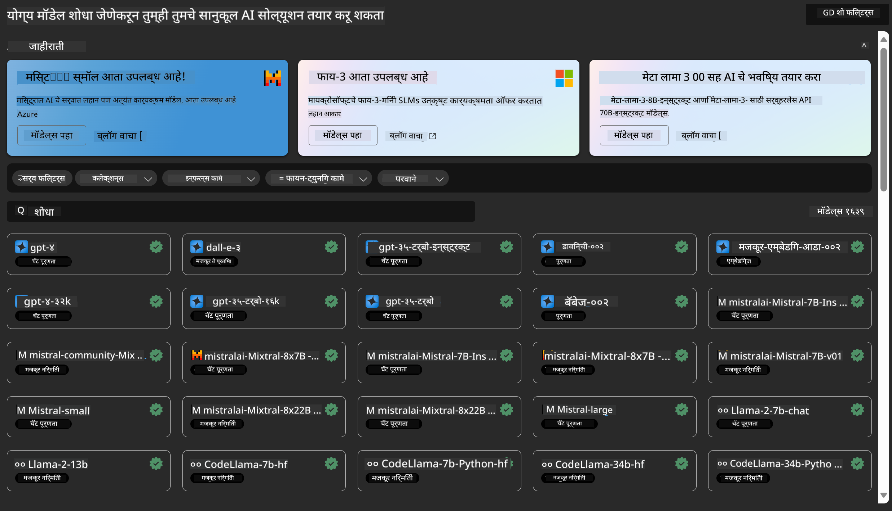
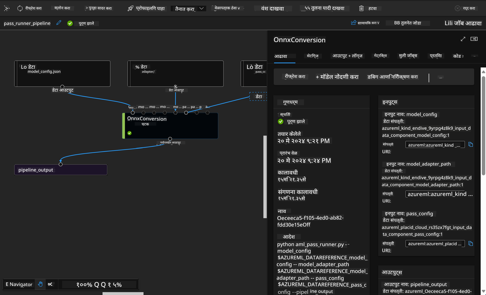

<!--
CO_OP_TRANSLATOR_METADATA:
{
  "original_hash": "7fe541373802e33568e94e13226d463c",
  "translation_date": "2025-05-09T22:18:06+00:00",
  "source_file": "md/03.FineTuning/Introduce_AzureML.md",
  "language_code": "mr"
}
-->
# **Azure Machine Learning Service ची ओळख**

[Azure Machine Learning](https://ml.azure.com?WT.mc_id=aiml-138114-kinfeylo) ही एक क्लाऊड सेवा आहे जी मशीन लर्निंग (ML) प्रोजेक्टच्या जीवनचक्राला वेग देण्यासाठी आणि व्यवस्थापित करण्यासाठी वापरली जाते.

ML व्यावसायिक, डेटा सायंटिस्ट आणि इंजिनिअर त्यांच्या दैनंदिन कामांमध्ये याचा वापर करू शकतात:

- मॉडेल्स ट्रेन आणि डिप्लॉय करणे.
- मशीन लर्निंग ऑपरेशन्स (MLOps) व्यवस्थापित करणे.
- तुम्ही Azure Machine Learning मध्ये मॉडेल तयार करू शकता किंवा PyTorch, TensorFlow, किंवा scikit-learn सारख्या ओपन-सोर्स प्लॅटफॉर्मवर तयार केलेले मॉडेल वापरू शकता.
- MLOps टूल्स तुम्हाला मॉडेल्सचे मॉनिटरिंग, रीट्रेनिंग आणि रिडिप्लॉयमेंट करण्यास मदत करतात.

## Azure Machine Learning कोणासाठी आहे?

**डेटा सायंटिस्ट आणि ML इंजिनिअर**

ते त्यांच्या दैनंदिन कामांमध्ये गती आणण्यासाठी आणि स्वयंचलित करण्यासाठी टूल्स वापरू शकतात.
Azure ML मध्ये न्याय्यतेसाठी, स्पष्टतेसाठी, ट्रॅकिंगसाठी आणि ऑडिटसाठी सुविधा उपलब्ध आहेत.

**अॅप्लिकेशन डेव्हलपर्स**

ते मॉडेल्सना अॅप्लिकेशन्स किंवा सेवांमध्ये सहजपणे इंटिग्रेट करू शकतात.

**प्लॅटफॉर्म डेव्हलपर्स**

त्यांच्याकडे Azure Resource Manager API द्वारे समर्थित मजबूत टूलसेट उपलब्ध आहे.
हे टूल्स प्रगत ML टूलिंग तयार करण्यास मदत करतात.

**एंटरप्रायझेस**

Microsoft Azure क्लाऊडवर काम करताना, एंटरप्रायझेसना परिचित सुरक्षा आणि रोल-आधारित ऍक्सेस कंट्रोलचा फायदा मिळतो.
प्रोजेक्ट्स सेटअप करून संरक्षित डेटा आणि विशिष्ट ऑपरेशन्सवर नियंत्रण ठेवता येते.

## टीममधील प्रत्येकासाठी उत्पादकता
ML प्रोजेक्ट्ससाठी विविध कौशल्य असलेल्या टीमची गरज असते.

Azure ML तुम्हाला खालील गोष्टी करण्याची सुविधा देते:
- तुमच्या टीमसोबत शेअर केलेल्या नोटबुक्स, कम्प्युट रिसोर्सेस, सर्व्हरलेस कम्प्युट, डेटा आणि एन्व्हायर्नमेंट्सद्वारे सहकार्य करा.
- न्याय्यतेसाठी, स्पष्टतेसाठी, ट्रॅकिंगसाठी आणि ऑडिटसाठी मॉडेल्स विकसित करा जे lineage आणि audit compliance आवश्यकतांसाठी उपयुक्त आहेत.
- ML मॉडेल्स जलद आणि सहजपणे स्केलवर डिप्लॉय करा आणि MLOps च्या मदतीने त्यांचे व्यवस्थापन आणि नियंत्रण करा.
- अंतर्निर्मित गव्हर्नन्स, सुरक्षा आणि अनुपालनासह कुठेही मशीन लर्निंग वर्कलोड्स चालवा.

## क्रॉस-कंपॅटिबल प्लॅटफॉर्म टूल्स

ML टीममधील कोणताही सदस्य त्याच्या पसंतीनुसार टूल्स वापरू शकतो.
तुम्ही जलद प्रयोग, हायपरपॅरामीटर ट्यूनिंग, पाइपलाइन तयार करणे किंवा इनफरन्स मॅनेज करत असाल, तुम्ही परिचित इंटरफेस वापरू शकता जसे की:
- Azure Machine Learning Studio
- Python SDK (v2)
- Azure CLI (v2)
- Azure Resource Manager REST APIs

मॉडेल्स सुधारताना आणि विकास चक्रात सहकार्य करताना, तुम्ही Azure Machine Learning स्टुडिओ UI मध्ये अॅसेट्स, रिसोर्सेस आणि मेट्रिक्स शेअर आणि शोधू शकता.

## **Azure ML मधील LLM/SLM**

Azure ML मध्ये LLM/SLM संबंधित अनेक फंक्शन्स जोडले आहेत, जे LLMOps आणि SLMOps एकत्र करून एंटरप्रायझ साठी एक व्यापक जनरेटिव्ह आर्टिफिशियल इंटेलिजेंस तंत्रज्ञान प्लॅटफॉर्म तयार करतात.

### **मॉडेल कॅटलॉग**

एंटरप्रायझ वापरकर्ते वेगवेगळ्या व्यवसायिक परिस्थितीनुसार विविध मॉडेल्स Model Catalog द्वारे डिप्लॉय करू शकतात, आणि Model as Service म्हणून एंटरप्रायझ डेव्हलपर्स किंवा वापरकर्त्यांसाठी सेवा पुरवू शकतात.

Azure Machine Learning स्टुडिओमधील Model Catalog हे विविध मॉडेल्स शोधण्यासाठी आणि वापरण्यासाठी केंद्र आहे, जे तुम्हाला जनरेटिव्ह AI अॅप्लिकेशन्स तयार करण्यास मदत करतात. या कॅटलॉगमध्ये Azure OpenAI service, Mistral, Meta, Cohere, Nvidia, Hugging Face यांसारख्या मॉडेल प्रदात्यांचे शेकडो मॉडेल्स आहेत, ज्यात Microsoft कडून प्रशिक्षित मॉडेल्सही आहेत. Microsoft व्यतिरिक्त इतर प्रदात्यांचे मॉडेल्स Non-Microsoft Products म्हणून ओळखले जातात आणि Microsoft च्या Product Terms नुसार त्यांचे नियम लागू होतात.

### **जॉब पाइपलाइन**

मशीन लर्निंग पाइपलाइनचा मुख्य भाग म्हणजे पूर्ण मशीन लर्निंग कामाला अनेक टप्प्यांमध्ये विभागणे. प्रत्येक टप्पा स्वतंत्रपणे विकसित, ऑप्टिमाइझ, कॉन्फिगर आणि ऑटोमेट करता येणारा घटक असतो. टप्पे चांगल्या प्रकारे परिभाषित इंटरफेसद्वारे जोडलेले असतात. Azure Machine Learning पाइपलाइन सेवा सर्व टप्प्यांमधील अवलंबित्वे आपोआप सांभाळते.

SLM / LLM चे फाइन-ट्यूनिंग करताना, आपण Pipeline द्वारे डेटा, ट्रेनिंग आणि जनरेशन प्रक्रियेचे व्यवस्थापन करू शकतो.

### **प्रॉम्प्ट फ्लो**

Azure Machine Learning प्रॉम्प्ट फ्लो वापरण्याचे फायदे  
Azure Machine Learning प्रॉम्प्ट फ्लो वापरकर्त्यांना कल्पना पासून प्रयोग आणि शेवटी उत्पादनासाठी तयार LLM-आधारित अॅप्लिकेशन्सपर्यंत पोहोचण्यात मदत करतो:

**प्रॉम्प्ट इंजिनिअरिंगची लवचिकता**

- इंटरएक्टिव्ह ऑथरिंग अनुभव: Azure Machine Learning प्रॉम्प्ट फ्लो फ्लोच्या संरचनेचे दृश्यात्मक सादरीकरण देतो, ज्यामुळे वापरकर्त्यांना त्यांचे प्रोजेक्ट समजणे आणि नेव्हिगेट करणे सोपे होते. तसेच, प्रभावी फ्लो विकास आणि डिबगिंगसाठी नोटबुकसारखा कोडिंग अनुभव देखील उपलब्ध आहे.
- प्रॉम्प्ट ट्यूनिंगसाठी विविध पर्याय: वापरकर्ते अनेक प्रॉम्प्ट व्हेरिएंट तयार करू शकतात आणि त्यांची तुलना करू शकतात, ज्यामुळे पुनरावृत्ती सुधारणा प्रक्रिया सुलभ होते.

- मूल्यांकन: अंतर्निर्मित मूल्यांकन फ्लोज वापरकर्त्यांना त्यांच्या प्रॉम्प्ट्स आणि फ्लोजची गुणवत्ता आणि प्रभावीपणा तपासण्यास मदत करतात.

- सर्वसमावेशक संसाधने: Azure Machine Learning प्रॉम्प्ट फ्लो मध्ये अंतर्निहित टूल्स, सॅम्पल्स आणि टेम्प्लेट्सची लायब्ररी आहे, जी विकासासाठी सुरुवात म्हणून वापरली जाऊ शकते, ज्यामुळे सर्जनशीलता वाढते आणि प्रक्रिया वेगवान होते.

**LLM-आधारित अॅप्लिकेशन्ससाठी एंटरप्रायझ तयार**

- सहकार्य: Azure Machine Learning प्रॉम्प्ट फ्लो टीम सहकार्याला प्रोत्साहन देतो, ज्यामुळे अनेक वापरकर्ते प्रॉम्प्ट इंजिनिअरिंग प्रोजेक्ट्सवर एकत्र काम करू शकतात, ज्ञान शेअर करू शकतात आणि व्हर्जन कंट्रोल राखू शकतात.

- सर्वसमावेशक प्लॅटफॉर्म: Azure Machine Learning प्रॉम्प्ट फ्लो संपूर्ण प्रॉम्प्ट इंजिनिअरिंग प्रक्रिया सुलभ करतो, विकास, मूल्यांकन, डिप्लॉयमेंट आणि मॉनिटरिंगपर्यंत. वापरकर्ते सहजपणे त्यांच्या फ्लोजना Azure Machine Learning endpoints म्हणून डिप्लॉय करू शकतात आणि त्यांची कामगिरी रिअल-टाइममध्ये मॉनिटर करू शकतात, ज्यामुळे उत्तम ऑपरेशन आणि सातत्यपूर्ण सुधारणा शक्य होते.

- Azure Machine Learning एंटरप्रायझ रेडीनेस सोल्यूशन्स: प्रॉम्प्ट फ्लो Azure Machine Learning च्या मजबूत एंटरप्रायझ रेडीनेस सोल्यूशन्सचा लाभ घेतो, जो सुरक्षित, स्केलेबल आणि विश्वासार्ह पाया पुरवतो फ्लोजच्या विकास, प्रयोग आणि डिप्लॉयमेंटसाठी.

Azure Machine Learning प्रॉम्प्ट फ्लो सह, वापरकर्ते त्यांच्या प्रॉम्प्ट इंजिनिअरिंग कौशल्यांना मुक्त करू शकतात, प्रभावीपणे सहकार्य करू शकतात, आणि यशस्वी LLM-आधारित अॅप्लिकेशन विकास आणि डिप्लॉयमेंटसाठी एंटरप्रायझ दर्जाच्या सोल्यूशन्सचा वापर करू शकतात.

Azure ML च्या संगणकीय शक्ती, डेटा आणि वेगवेगळ्या घटकांचा वापर करून, एंटरप्रायझ डेव्हलपर्स सहजपणे त्यांचे स्वतःचे आर्टिफिशियल इंटेलिजेंस अॅप्लिकेशन्स तयार करू शकतात.

**अस्वीकरण**:  
हा दस्तऐवज AI भाषांतर सेवा [Co-op Translator](https://github.com/Azure/co-op-translator) वापरून भाषांतरित केला आहे. आम्ही अचूकतेसाठी प्रयत्नशील असलो तरी, कृपया लक्षात ठेवा की स्वयंचलित भाषांतरांमध्ये चुका किंवा अचूकतेच्या त्रुटी असू शकतात. मूळ दस्तऐवज त्याच्या मूळ भाषेत अधिकृत स्रोत मानला जावा. महत्त्वाच्या माहितीसाठी व्यावसायिक मानवी भाषांतर शिफारसीय आहे. या भाषांतराच्या वापरामुळे उद्भवणाऱ्या कोणत्याही गैरसमज किंवा चुकीच्या अर्थ लावल्याबद्दल आम्ही जबाबदार नाही.