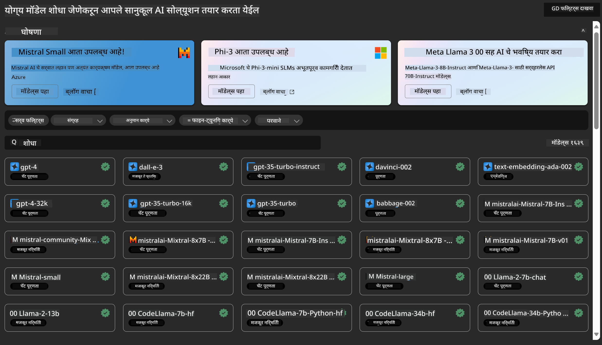
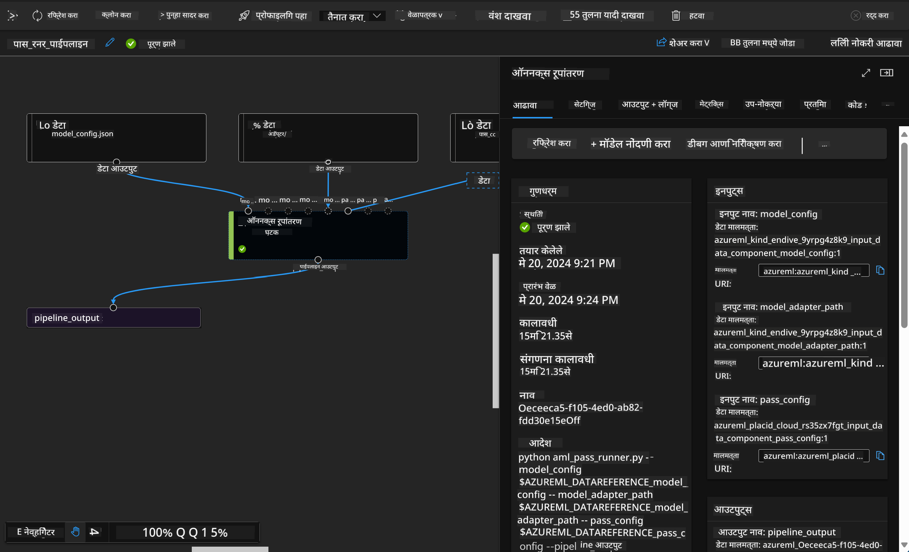

<!--
CO_OP_TRANSLATOR_METADATA:
{
  "original_hash": "7fe541373802e33568e94e13226d463c",
  "translation_date": "2025-07-17T09:38:47+00:00",
  "source_file": "md/03.FineTuning/Introduce_AzureML.md",
  "language_code": "mr"
}
-->
# **Azure Machine Learning सेवा परिचय**

[Azure Machine Learning](https://ml.azure.com?WT.mc_id=aiml-138114-kinfeylo) ही मशीन लर्निंग (ML) प्रकल्पाच्या जीवनचक्राला वेग देण्यासाठी आणि व्यवस्थापित करण्यासाठी क्लाउड सेवा आहे.

ML व्यावसायिक, डेटा शास्त्रज्ञ आणि अभियंते त्यांच्या दैनंदिन कार्यप्रवाहात याचा वापर करू शकतात:

- मॉडेल्स प्रशिक्षण द्या आणि तैनात करा.
- मशीन लर्निंग ऑपरेशन्स (MLOps) व्यवस्थापित करा.
- तुम्ही Azure Machine Learning मध्ये मॉडेल तयार करू शकता किंवा PyTorch, TensorFlow, किंवा scikit-learn सारख्या ओपन-सोर्स प्लॅटफॉर्मवर तयार केलेले मॉडेल वापरू शकता.
- MLOps साधने तुम्हाला मॉडेल्सचे निरीक्षण, पुनःप्रशिक्षण आणि पुनःतैनाती करण्यात मदत करतात.

## Azure Machine Learning कोणासाठी आहे?

**डेटा शास्त्रज्ञ आणि ML अभियंते**

ते त्यांच्या दैनंदिन कार्यप्रवाहांना वेग देण्यासाठी आणि स्वयंचलित करण्यासाठी साधने वापरू शकतात.
Azure ML न्याय्यतेसाठी, स्पष्टीकरणासाठी, ट्रॅकिंगसाठी आणि ऑडिटसाठी वैशिष्ट्ये प्रदान करते.

**अ‍ॅप्लिकेशन डेव्हलपर्स:**

ते मॉडेल्सना अ‍ॅप्लिकेशन्स किंवा सेवांमध्ये सहजपणे एकत्र करू शकतात.

**प्लॅटफॉर्म डेव्हलपर्स**

त्यांना Azure Resource Manager APIs द्वारे समर्थित मजबूत साधन संच उपलब्ध आहे.
हे साधने प्रगत ML टूलिंग तयार करण्यास अनुमती देतात.

**उद्योग**

Microsoft Azure क्लाउडमध्ये काम करताना, उद्योगांना परिचित सुरक्षा आणि भूमिका-आधारित प्रवेश नियंत्रणाचा फायदा होतो.
संरक्षित डेटा आणि विशिष्ट ऑपरेशन्सवर प्रवेश नियंत्रित करण्यासाठी प्रकल्प सेट करा.

## टीममधील प्रत्येकासाठी उत्पादकता
ML प्रकल्पांमध्ये विविध कौशल्य असलेली टीम आवश्यक असते जी तयार करणे आणि देखभाल करणे शक्य करते.

Azure ML तुम्हाला खालील गोष्टी करण्यासाठी साधने देते:
- सामायिक नोटबुक्स, संगणकीय संसाधने, सर्व्हरलेस संगणक, डेटा आणि वातावरणाद्वारे तुमच्या टीमसोबत सहकार्य करा.
- न्याय्यतेसाठी, स्पष्टीकरणासाठी, ट्रॅकिंगसाठी आणि ऑडिटसाठी मॉडेल विकसित करा जे वंशावळी आणि ऑडिट अनुपालन आवश्यकतांची पूर्तता करतात.
- ML मॉडेल्स जलद आणि सहजपणे प्रमाणात तैनात करा, आणि MLOps सह त्यांचे व्यवस्थापन आणि शासन प्रभावीपणे करा.
- अंतर्निर्मित शासन, सुरक्षा आणि अनुपालनासह कुठेही मशीन लर्निंग कार्यभार चालवा.

## क्रॉस-कंपॅटिबल प्लॅटफॉर्म टूल्स

ML टीममधील कोणताही सदस्य त्याच्या पसंतीच्या साधनांचा वापर करून काम पूर्ण करू शकतो.
तुम्ही जलद प्रयोग करत असाल, हायपरपॅरामीटर ट्यूनिंग करत असाल, पाइपलाइन तयार करत असाल किंवा इनफरन्सेस व्यवस्थापित करत असाल, तुम्ही परिचित इंटरफेस वापरू शकता जसे की:
- Azure Machine Learning Studio
- Python SDK (v2)
- Azure CLI (v2)
- Azure Resource Manager REST APIs

तुम्ही मॉडेल्स सुधारत असताना आणि विकास चक्रात सहकार्य करत असताना, तुम्ही Azure Machine Learning स्टुडिओ UI मध्ये मालमत्ता, संसाधने आणि मेट्रिक्स शेअर आणि शोधू शकता.

## **Azure ML मधील LLM/SLM**

Azure ML ने अनेक LLM/SLM-संबंधित फंक्शन्स जोडले आहेत, जे LLMOps आणि SLMOps एकत्र करून एंटरप्राइझ-व्यापी जनरेटिव्ह आर्टिफिशियल इंटेलिजन्स तंत्रज्ञान प्लॅटफॉर्म तयार करतात.

### **मॉडेल कॅटलॉग**

एंटरप्राइझ वापरकर्ते वेगवेगळ्या व्यवसाय परिस्थितीनुसार मॉडेल्स तैनात करू शकतात आणि एंटरप्राइझ डेव्हलपर्स किंवा वापरकर्त्यांसाठी Model as Service म्हणून सेवा पुरवू शकतात.

Azure Machine Learning स्टुडिओमधील मॉडेल कॅटलॉग हे विविध मॉडेल्स शोधण्यासाठी आणि वापरण्यासाठी केंद्र आहे जे तुम्हाला जनरेटिव्ह AI अ‍ॅप्लिकेशन्स तयार करण्यास मदत करतात. मॉडेल कॅटलॉगमध्ये Azure OpenAI सेवा, Mistral, Meta, Cohere, Nvidia, Hugging Face यांसारख्या मॉडेल पुरवठादारांकडून शेकडो मॉडेल्स आहेत, ज्यात Microsoft द्वारे प्रशिक्षित मॉडेल्सही आहेत. Microsoft व्यतिरिक्त पुरवठादारांकडून मिळालेली मॉडेल्स Microsoft च्या उत्पादन अटींनुसार Non-Microsoft Products म्हणून ओळखली जातात आणि त्या मॉडेलसह दिलेल्या अटींनुसार वापरल्या जातात.

### **जॉब पाइपलाइन**

मशीन लर्निंग पाइपलाइनचा मुख्य भाग म्हणजे संपूर्ण मशीन लर्निंग कार्याला अनेक टप्प्यांमध्ये विभागणे. प्रत्येक टप्पा हा स्वतंत्रपणे विकसित, ऑप्टिमाइझ, कॉन्फिगर आणि स्वयंचलित केला जाऊ शकणारा व्यवस्थापनीय घटक असतो. टप्पे चांगल्या प्रकारे परिभाषित इंटरफेसद्वारे जोडलेले असतात. Azure Machine Learning पाइपलाइन सेवा पाइपलाइन टप्प्यांमधील सर्व अवलंबित्वे आपोआप समन्वयित करते.

SLM / LLM च्या फाइन-ट्यूनिंगमध्ये, आपण पाइपलाइनद्वारे आपला डेटा, प्रशिक्षण आणि जनरेशन प्रक्रिया व्यवस्थापित करू शकतो.

### **प्रॉम्प्ट फ्लो**

Azure Machine Learning प्रॉम्प्ट फ्लो वापरण्याचे फायदे  
Azure Machine Learning प्रॉम्प्ट फ्लो वापरकर्त्यांना कल्पनांपासून प्रयोगांपर्यंत आणि अखेरीस उत्पादन-तयार LLM-आधारित अ‍ॅप्लिकेशन्सपर्यंत जाण्यास मदत करणारे अनेक फायदे देते:

**प्रॉम्प्ट इंजिनिअरिंगची लवचिकता**

- संवादात्मक लेखन अनुभव: Azure Machine Learning प्रॉम्प्ट फ्लो फ्लोच्या रचनेचे दृश्यात्मक प्रतिनिधित्व देते, ज्यामुळे वापरकर्त्यांना त्यांच्या प्रकल्पांना सहज समजून घेणे आणि नेव्हिगेट करणे शक्य होते. तसेच, प्रभावी फ्लो विकास आणि डीबगिंगसाठी नोटबुकसारखा कोडिंग अनुभव देखील उपलब्ध आहे.
- प्रॉम्प्ट ट्यूनिंगसाठी विविध प्रकार: वापरकर्ते अनेक प्रॉम्प्ट प्रकार तयार करू शकतात आणि त्यांची तुलना करू शकतात, ज्यामुळे पुनरावृत्ती सुधारणा प्रक्रिया सुलभ होते.

**मूल्यांकन:** अंतर्निर्मित मूल्यांकन फ्लो वापरकर्त्यांना त्यांच्या प्रॉम्प्ट्स आणि फ्लोची गुणवत्ता आणि कार्यक्षमता तपासण्यास मदत करतात.

**संपूर्ण संसाधने:** Azure Machine Learning प्रॉम्प्ट फ्लोमध्ये अंतर्निर्मित साधने, नमुने आणि टेम्पलेट्सचा ग्रंथालय आहे, जे विकासासाठी प्रारंभिक बिंदू म्हणून काम करतात, सर्जनशीलता वाढवतात आणि प्रक्रियेला वेग देतात.

**LLM-आधारित अ‍ॅप्लिकेशन्ससाठी एंटरप्राइझ तयारी**

- सहकार्य: Azure Machine Learning प्रॉम्प्ट फ्लो टीम सहकार्याला समर्थन देते, ज्यामुळे अनेक वापरकर्ते प्रॉम्प्ट इंजिनिअरिंग प्रकल्पांवर एकत्र काम करू शकतात, ज्ञान शेअर करू शकतात आणि आवृत्ती नियंत्रण राखू शकतात.
- सर्व-इन-वन प्लॅटफॉर्म: Azure Machine Learning प्रॉम्प्ट फ्लो संपूर्ण प्रॉम्प्ट इंजिनिअरिंग प्रक्रिया सुलभ करते, विकास, मूल्यांकन, तैनाती आणि निरीक्षणापर्यंत. वापरकर्ते सहजपणे त्यांच्या फ्लोना Azure Machine Learning एंडपॉइंट्स म्हणून तैनात करू शकतात आणि त्यांची कामगिरी रिअल-टाइममध्ये पाहू शकतात, ज्यामुळे ऑपरेशन उत्कृष्ट राहते आणि सतत सुधारणा होते.
- Azure Machine Learning एंटरप्राइझ रेडीनेस सोल्यूशन्स: प्रॉम्प्ट फ्लो Azure Machine Learning च्या मजबूत एंटरप्राइझ रेडीनेस सोल्यूशन्सचा लाभ घेतो, जे सुरक्षित, प्रमाणात वाढणारे आणि विश्वासार्ह आधार प्रदान करतात फ्लोच्या विकास, प्रयोग आणि तैनातीसाठी.

Azure Machine Learning प्रॉम्प्ट फ्लो वापरून, वापरकर्ते त्यांच्या प्रॉम्प्ट इंजिनिअरिंगची लवचिकता मुक्त करू शकतात, प्रभावीपणे सहकार्य करू शकतात आणि यशस्वी LLM-आधारित अ‍ॅप्लिकेशन विकास आणि तैनातीसाठी एंटरप्राइझ-ग्रेड सोल्यूशन्सचा लाभ घेऊ शकतात.

Azure ML च्या संगणकीय शक्ती, डेटा आणि विविध घटकांना एकत्र करून, एंटरप्राइझ डेव्हलपर्स सहजपणे त्यांच्या स्वतःच्या आर्टिफिशियल इंटेलिजन्स अ‍ॅप्लिकेशन्स तयार करू शकतात.

**अस्वीकरण**:  
हा दस्तऐवज AI अनुवाद सेवा [Co-op Translator](https://github.com/Azure/co-op-translator) वापरून अनुवादित केला आहे. आम्ही अचूकतेसाठी प्रयत्नशील असलो तरी, कृपया लक्षात घ्या की स्वयंचलित अनुवादांमध्ये चुका किंवा अचूकतेची कमतरता असू शकते. मूळ दस्तऐवज त्याच्या स्थानिक भाषेत अधिकृत स्रोत मानला जावा. महत्त्वाच्या माहितीसाठी व्यावसायिक मानवी अनुवाद करण्याची शिफारस केली जाते. या अनुवादाच्या वापरामुळे उद्भवलेल्या कोणत्याही गैरसमजुती किंवा चुकीच्या अर्थलागी आम्ही जबाबदार नाही.