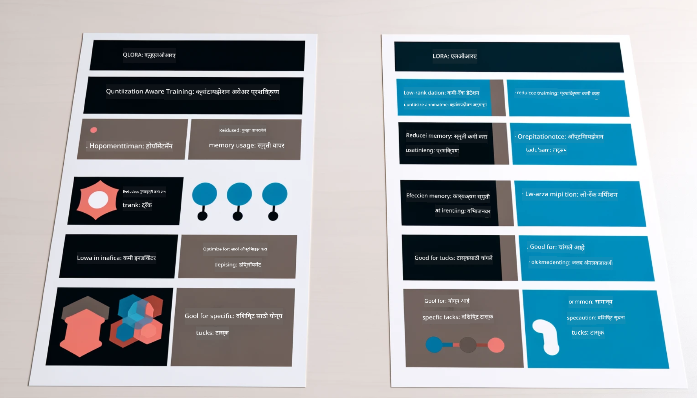

<!--
CO_OP_TRANSLATOR_METADATA:
{
  "original_hash": "743d7e9cb9c4e8ea642d77bee657a7fa",
  "translation_date": "2025-05-09T22:25:18+00:00",
  "source_file": "md/03.FineTuning/LetPhi3gotoIndustriy.md",
  "language_code": "mr"
}
-->
# **Phi-3 ला उद्योग तज्ञ बनवा**

Phi-3 मॉडेलला उद्योगात वापरण्यासाठी, तुम्हाला उद्योगातील व्यवसाय डेटा Phi-3 मॉडेलमध्ये जोडावा लागेल. आपल्याकडे दोन वेगवेगळे पर्याय आहेत, पहिला म्हणजे RAG (Retrieval Augmented Generation) आणि दुसरा Fine Tuning.

## **RAG विरुद्ध Fine-Tuning**

### **Retrieval Augmented Generation**

RAG म्हणजे डेटा रिट्रीवल + टेक्स्ट जनरेशन. उद्योगाचा संरचित आणि असंरचित डेटा व्हेक्टर डेटाबेसमध्ये संग्रहित केला जातो. संबंधित सामग्री शोधताना, संबंधित सारांश आणि सामग्री शोधून एक संदर्भ तयार केला जातो, आणि LLM/SLM च्या टेक्स्ट पूर्ण करण्याच्या क्षमतेसह एकत्र करून सामग्री तयार केली जाते.

### **Fine-tuning**

Fine-tuning म्हणजे एखाद्या विशिष्ट मॉडेलमध्ये सुधारणा करणे. यासाठी मॉडेल अल्गोरिदमपासून सुरुवात करावी लागत नाही, पण डेटा सतत जमा करणे आवश्यक असते. जर तुम्हाला उद्योगातील वापरासाठी अधिक अचूक शब्दावली आणि भाषेची अभिव्यक्ती हवी असेल, तर fine-tuning हा चांगला पर्याय आहे. पण जर तुमचा डेटा वारंवार बदलत असेल, तर fine-tuning गुंतागुंतीचे होऊ शकते.

### **कसे निवडायचे**

1. जर आपल्या उत्तरासाठी बाह्य डेटाची गरज असेल, तर RAG हा सर्वोत्तम पर्याय आहे.

2. जर तुम्हाला स्थिर आणि अचूक उद्योग ज्ञान हवे असेल, तर fine-tuning हा चांगला पर्याय आहे. RAG संबंधित सामग्री ओढण्यावर भर देते पण नेहमीच तज्ज्ञतेच्या सूक्ष्मतेवर बसणार नाही.

3. Fine-tuning साठी उच्च-गुणवत्तेचा डेटा सेट आवश्यक आहे, आणि जर डेटा कमी प्रमाणात असेल तर त्याचा फारसा फरक पडत नाही. RAG अधिक लवचिक आहे.

4. Fine-tuning एक ब्लॅक बॉक्स आहे, एक गूढता, आणि त्याच्या अंतर्गत यंत्रणेचे समजणे कठीण आहे. पण RAG द्वारे डेटा स्रोत शोधणे सोपे होते, ज्यामुळे hallucinations किंवा सामग्रीतील चुका प्रभावीपणे सुधारता येतात आणि अधिक पारदर्शकता मिळते.

### **परिस्थिती**

1. खासगी उद्योगांना विशिष्ट व्यावसायिक शब्दावली आणि अभिव्यक्ती आवश्यक असते, ***Fine-tuning*** हा सर्वोत्तम पर्याय आहे.

2. QA सिस्टम, ज्यात विविध ज्ञान बिंदूंचे संयोजन आवश्यक आहे, ***RAG*** हा सर्वोत्तम पर्याय आहे.

3. स्वयंचलित व्यवसाय प्रक्रियेचे संयोजन ***RAG + Fine-tuning*** हा सर्वोत्तम पर्याय आहे.

## **RAG कसा वापरायचा**

व्हेक्टर डेटाबेस म्हणजे डेटा गणिती स्वरूपात संग्रहित करण्याचा एक प्रकार. व्हेक्टर डेटाबेसमुळे मशीन लर्निंग मॉडेल्सना मागील इनपुट लक्षात ठेवणे सोपे होते, ज्यामुळे शोध, शिफारसी, आणि टेक्स्ट जनरेशन सारख्या वापरासाठी मशीन लर्निंग वापरता येते. डेटा अचूक जुळणीऐवजी साम्य मेट्रिक्सवर आधारित ओळखला जातो, ज्यामुळे संगणकीय मॉडेल्सना डेटाचा संदर्भ समजतो.

व्हेक्टर डेटाबेस हा RAG साध्य करण्यासाठी महत्त्वाचा आहे. आपण text-embedding-3, jina-ai-embedding सारख्या व्हेक्टर मॉडेल्सद्वारे डेटा व्हेक्टर स्वरूपात रूपांतरित करू शकतो.

RAG अॅप्लिकेशन तयार करण्याबद्दल अधिक जाणून घ्या [https://github.com/microsoft/Phi-3CookBook](https://github.com/microsoft/Phi-3CookBook?WT.mc_id=aiml-138114-kinfeylo) 

## **Fine-tuning कसा वापरायचा**

Fine-tuning मध्ये सामान्यत: वापरले जाणारे अल्गोरिदम म्हणजे Lora आणि QLora. कसे निवडायचे?
- [या सॅम्पल नोटबुकसह अधिक जाणून घ्या](../../../../code/04.Finetuning/Phi_3_Inference_Finetuning.ipynb)
- [Python FineTuning सॅम्पलचे उदाहरण](../../../../code/04.Finetuning/FineTrainingScript.py)

### **Lora आणि QLora**

LoRA (Low-Rank Adaptation) आणि QLoRA (Quantized Low-Rank Adaptation) दोन्ही Parameter Efficient Fine Tuning (PEFT) वापरून मोठ्या भाषा मॉडेल्स (LLMs) ला फाइन-ट्यून करण्याच्या तंत्रज्ञानाचा भाग आहेत. PEFT तंत्रज्ञान पारंपरिक पद्धतींपेक्षा अधिक कार्यक्षमतेने मॉडेल्स ट्रेन करण्यासाठी डिझाइन केले आहे.

LoRA हा एक स्वतंत्र फाइन-ट्यूनिंग तंत्र आहे जो वजन अद्यतन मॅट्रिक्सवर लो-रँक अ‍ॅप्रॉक्सिमेशन लागू करून मेमरी वापर कमी करतो. तो जलद प्रशिक्षण वेळ देतो आणि पारंपरिक फाइन-ट्यूनिंग पद्धतींशी जवळपास समान कार्यक्षमता राखतो.

QLoRA हा LoRA चा विस्तारित प्रकार आहे जो मेमरी वापर आणखी कमी करण्यासाठी क्वांटायझेशन तंत्रज्ञान वापरतो. QLoRA प्री-ट्रेन केलेल्या LLM मधील वजनांच्या पॅरामीटर्सना 4-बिट प्रिसिजनमध्ये क्वांटाइज करतो, जे LoRA पेक्षा अधिक मेमरी कार्यक्षम आहे. मात्र, अतिरिक्त क्वांटायझेशन आणि डी-क्वांटायझेशन टप्प्यांमुळे QLoRA प्रशिक्षण LoRA पेक्षा सुमारे 30% मंदगतीने होते.

QLoRA क्वांटायझेशन दरम्यान उद्भवलेल्या चुका दुरुस्त करण्यासाठी LoRA चा वापर अ‍ॅक्सेसरी म्हणून करतो. QLoRA तुलनेने लहान, सहज उपलब्ध GPUs वर अब्जावधी पॅरामीटर्स असलेल्या मोठ्या मॉडेल्सचे फाइन-ट्यूनिंग सक्षम करतो. उदाहरणार्थ, QLoRA 70B पॅरामीटर मॉडेल जे 36 GPUs ची गरज असते, ते फाइन-ट्यून करू शकतो फक्त 2 GPUs वापरून.

**अस्वीकरण**:  
हा दस्तऐवज AI अनुवाद सेवा [Co-op Translator](https://github.com/Azure/co-op-translator) वापरून अनुवादित केला आहे. आम्ही अचूकतेसाठी प्रयत्न करतो, तरी कृपया लक्षात घ्या की स्वयंचलित अनुवादांमध्ये चुका किंवा अचूकतेचा अभाव असू शकतो. मूळ दस्तऐवज त्याच्या स्थानिक भाषेत अधिकृत स्रोत मानला पाहिजे. महत्त्वाची माहिती असल्यास, व्यावसायिक मानवी अनुवाद शिफारसीय आहे. या अनुवादाच्या वापरामुळे उद्भवलेल्या कोणत्याही गैरसमजुती किंवा चुकीच्या अर्थसंग्रहासाठी आम्ही जबाबदार नाही.