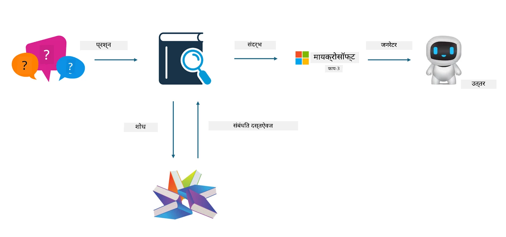

<!--
CO_OP_TRANSLATOR_METADATA:
{
  "original_hash": "743d7e9cb9c4e8ea642d77bee657a7fa",
  "translation_date": "2025-07-17T09:54:33+00:00",
  "source_file": "md/03.FineTuning/LetPhi3gotoIndustriy.md",
  "language_code": "mr"
}
-->
# **Phi-3 ला उद्योग तज्ञ बनवा**

Phi-3 मॉडेलला उद्योगात वापरण्यासाठी, तुम्हाला उद्योगाच्या व्यवसाय डेटा Phi-3 मॉडेलमध्ये जोडावा लागेल. यासाठी आपल्याकडे दोन पर्याय आहेत, पहिले म्हणजे RAG (Retrieval Augmented Generation) आणि दुसरे म्हणजे Fine Tuning.

## **RAG विरुद्ध Fine-Tuning**

### **Retrieval Augmented Generation**

RAG म्हणजे डेटा पुनर्प्राप्ती + मजकूर निर्मिती. एंटरप्राइझचे संरचित आणि असंरचित डेटा व्हेक्टर डेटाबेसमध्ये संग्रहित केले जातात. संबंधित सामग्री शोधताना, संबंधित सारांश आणि सामग्री शोधून एक संदर्भ तयार केला जातो, आणि LLM/SLM च्या मजकूर पूर्ण करण्याच्या क्षमतेसह एकत्र करून सामग्री तयार केली जाते.

### **Fine-tuning**

Fine-tuning म्हणजे एखाद्या विशिष्ट मॉडेलमध्ये सुधारणा करणे. यासाठी मॉडेल अल्गोरिदमपासून सुरुवात करण्याची गरज नाही, पण डेटा सतत जमा करावा लागतो. जर तुम्हाला उद्योगातील अचूक शब्दसंग्रह आणि भाषेची अभिव्यक्ती हवी असेल, तर fine-tuning हा चांगला पर्याय आहे. पण जर तुमचा डेटा वारंवार बदलत असेल, तर fine-tuning गुंतागुंतीचे होऊ शकते.

### **कसे निवडावे**

1. जर आपल्या उत्तरासाठी बाह्य डेटाची गरज असेल, तर RAG हा सर्वोत्तम पर्याय आहे.

2. जर तुम्हाला स्थिर आणि अचूक उद्योग ज्ञान हवे असेल, तर fine-tuning चांगला पर्याय आहे. RAG संबंधित सामग्री ओढण्यावर भर देतो पण नेहमीच तज्ञांच्या सूक्ष्म फरकांवर अचूक ठरू शकत नाही.

3. Fine-tuning साठी उच्च दर्जाचा डेटा सेट आवश्यक आहे, आणि जर डेटा कमी प्रमाणात असेल तर फार फरक पडणार नाही. RAG अधिक लवचिक आहे.

4. Fine-tuning हा एक ब्लॅक बॉक्स आहे, ज्याचा अंतर्गत यंत्रणा समजणे कठीण आहे. पण RAG मुळे डेटा स्रोत शोधणे सोपे होते, ज्यामुळे hallucinations किंवा सामग्रीतील चुका प्रभावीपणे सुधारता येतात आणि अधिक पारदर्शकता मिळते.

### **परिस्थिती**

1. विशिष्ट व्यावसायिक शब्दसंग्रह आणि अभिव्यक्ती आवश्यक असलेल्या उभ्या उद्योगांसाठी, ***Fine-tuning*** सर्वोत्तम पर्याय आहे.

2. QA प्रणालीसाठी, ज्यात विविध ज्ञान बिंदूंचा समावेश असतो, ***RAG*** सर्वोत्तम पर्याय आहे.

3. स्वयंचलित व्यवसाय प्रवाहाच्या संयोजनासाठी ***RAG + Fine-tuning*** सर्वोत्तम पर्याय आहे.

## **RAG कसे वापरावे**

व्हेक्टर डेटाबेस म्हणजे गणिती स्वरूपात संग्रहित डेटा. व्हेक्टर डेटाबेस मशीन लर्निंग मॉडेल्सना मागील इनपुट लक्षात ठेवणे सोपे करतात, ज्यामुळे शोध, शिफारसी आणि मजकूर निर्मिती सारख्या वापरासाठी मशीन लर्निंगचा वापर करता येतो. डेटा अचूक जुळणीऐवजी सादृश्यता मेट्रिक्सवर आधारित ओळखला जातो, ज्यामुळे संगणक मॉडेल्सना डेटाचा संदर्भ समजतो.

व्हेक्टर डेटाबेस RAG साठी महत्त्वाचा आहे. आपण text-embedding-3, jina-ai-embedding सारख्या व्हेक्टर मॉडेल्सद्वारे डेटाला व्हेक्टर स्वरूपात रूपांतरित करू शकतो.

RAG अॅप्लिकेशन तयार करण्याबद्दल अधिक जाणून घ्या [https://github.com/microsoft/Phi-3CookBook](https://github.com/microsoft/Phi-3CookBook?WT.mc_id=aiml-138114-kinfeylo)

## **Fine-tuning कसे वापरावे**

Fine-tuning मध्ये सामान्यतः वापरले जाणारे अल्गोरिदम म्हणजे Lora आणि QLora. कसे निवडावे?
- [या नमुना नोटबुकसह अधिक जाणून घ्या](../../../../code/04.Finetuning/Phi_3_Inference_Finetuning.ipynb)
- [Python FineTuning नमुन्याचे उदाहरण](../../../../code/04.Finetuning/FineTrainingScript.py)

### **Lora आणि QLora**

LoRA (Low-Rank Adaptation) आणि QLoRA (Quantized Low-Rank Adaptation) हे दोन्ही Parameter Efficient Fine Tuning (PEFT) वापरून मोठ्या भाषा मॉडेल्स (LLMs) चे fine-tune करण्यासाठी वापरले जाणारे तंत्र आहेत. PEFT तंत्र पारंपरिक पद्धतींपेक्षा अधिक कार्यक्षमतेने मॉडेल्स प्रशिक्षणासाठी डिझाइन केलेले आहेत.

LoRA ही एक स्वतंत्र fine-tuning तंत्र आहे जी वजन अद्यतन मॅट्रिक्सवर कमी-रँक अंदाज लावून मेमरी वापर कमी करते. यामुळे प्रशिक्षण जलद होते आणि पारंपरिक fine-tuning पद्धतींच्या जवळपास कामगिरी राखली जाते.

QLoRA ही LoRA ची विस्तारित आवृत्ती आहे जी मेमरी वापर आणखी कमी करण्यासाठी क्वांटायझेशन तंत्र वापरते. QLoRA पूर्व-प्रशिक्षित LLM मधील वजन पॅरामीटर्सची अचूकता 4-बिटपर्यंत क्वांटायझ करते, जी LoRA पेक्षा अधिक मेमरी कार्यक्षम आहे. मात्र, अतिरिक्त क्वांटायझेशन आणि डी-क्वांटायझेशन टप्प्यांमुळे QLoRA प्रशिक्षण LoRA पेक्षा सुमारे 30% हळू होते.

QLoRA क्वांटायझेशनमुळे निर्माण झालेल्या चुका दुरुस्त करण्यासाठी LoRA वापरते. QLoRA तुलनेने लहान, सहज उपलब्ध GPU वर अब्जावधी पॅरामीटर्स असलेल्या मोठ्या मॉडेल्सचे fine-tuning सक्षम करते. उदाहरणार्थ, QLoRA 70B पॅरामीटर मॉडेलचे fine-tuning 36 GPU वापरून करू शकते, पण फक्त 2 GPU वापरून...

**अस्वीकरण**:  
हा दस्तऐवज AI अनुवाद सेवा [Co-op Translator](https://github.com/Azure/co-op-translator) वापरून अनुवादित केला आहे. आम्ही अचूकतेसाठी प्रयत्नशील असलो तरी, कृपया लक्षात घ्या की स्वयंचलित अनुवादांमध्ये चुका किंवा अचूकतेची कमतरता असू शकते. मूळ दस्तऐवज त्याच्या स्थानिक भाषेत अधिकृत स्रोत मानला जावा. महत्त्वाच्या माहितीसाठी व्यावसायिक मानवी अनुवाद करण्याची शिफारस केली जाते. या अनुवादाच्या वापरामुळे उद्भवलेल्या कोणत्याही गैरसमजुती किंवा चुकीच्या अर्थलागी आम्ही जबाबदार नाही.