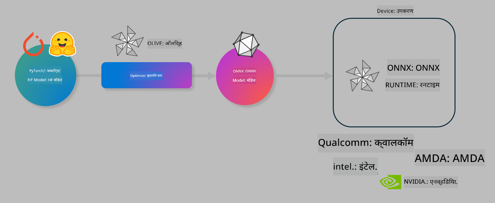

<!--
CO_OP_TRANSLATOR_METADATA:
{
  "original_hash": "6bbe47de3b974df7eea29dfeccf6032b",
  "translation_date": "2025-05-09T22:34:32+00:00",
  "source_file": "md/03.FineTuning/olive-lab/readme.md",
  "language_code": "mr"
}
-->
# लॅब. ऑन-डिव्हाइस इन्फरन्ससाठी AI मॉडेल्स ऑप्टिमाइझ करा

## परिचय

> [!IMPORTANT]  
> या लॅबसाठी **Nvidia A10 किंवा A100 GPU** आणि संबंधित ड्रायव्हर्स व CUDA टूलकिट (आवृत्ती 12+) इंस्टॉल केलेले असणे आवश्यक आहे.

> [!NOTE]  
> ही लॅब **35 मिनिटांची** असून OLIVE वापरून ऑन-डिव्हाइस इन्फरन्ससाठी मॉडेल्स ऑप्टिमाइझ करण्याच्या मुख्य संकल्पनांचा प्रत्यक्ष अनुभव देईल.

## शिकण्याचे उद्दिष्टे

या लॅबच्या शेवटी, तुम्ही OLIVE वापरून खालील गोष्टी करू शकाल:

- AWQ क्वांटायझेशन पद्धत वापरून AI मॉडेल क्वांटायझ करणे.
- विशिष्ट कार्यासाठी AI मॉडेल फाईन-ट्यून करणे.
- ONNX Runtime वर कार्यक्षम ऑन-डिव्हाइस इन्फरन्ससाठी LoRA अ‍ॅडॉप्टर्स (फाईन-ट्यून केलेले मॉडेल) तयार करणे.

### Olive म्हणजे काय

Olive (*O*NNX *live*) हे एक मॉडेल ऑप्टिमायझेशन टूलकिट आहे ज्यास CLI सोबत दिले आहे, जे तुम्हाला ONNX runtime +++https://onnxruntime.ai+++ साठी गुणवत्ता आणि कार्यक्षमतेसह मॉडेल्स वितरित करण्यास मदत करते.



Olive मध्ये इनपुट सामान्यतः PyTorch किंवा Hugging Face मॉडेल असतो आणि आउटपुट एक ऑप्टिमाइझ केलेले ONNX मॉडेल असते जे ONNX runtime चालणाऱ्या डिव्हाइसवर (डिप्लॉयमेंट टार्गेट) चालवले जाते. Olive हार्डवेअर विक्रेते जसे Qualcomm, AMD, Nvidia किंवा Intel कडून मिळणाऱ्या AI एक्सेलेरेटर (NPU, GPU, CPU) साठी डिप्लॉयमेंट टार्गेटसाठी मॉडेल ऑप्टिमाइझ करतो.

Olive एक *वर्कफ्लो* चालवतो, जो साखळीने क्रमबद्ध केलेल्या वेगवेगळ्या मॉडेल ऑप्टिमायझेशन टास्क्सना म्हणतात *पासेस* - उदाहरणार्थ: मॉडेल कंप्रेशन, ग्राफ कॅप्चर, क्वांटायझेशन, ग्राफ ऑप्टिमायझेशन. प्रत्येक पासमध्ये काही पॅरामीटर्स असतात जे सर्वोत्तम मेट्रिक्स (जसे अचूकता आणि लेटन्सी) साधण्यासाठी ट्यून करता येतात, जे संबंधित इव्हॅल्युएटरने मूल्यांकन केले जातात. Olive एक सर्च स्ट्रॅटेजी वापरतो ज्यात सर्च अल्गोरिदमने प्रत्येक पास किंवा पासेसचा सेट एकावेळी ऑटो-ट्यून केला जातो.

#### Olive चे फायदे

- ग्राफ ऑप्टिमायझेशन, कंप्रेशन आणि क्वांटायझेशनसाठी विविध तंत्रे वापरून मॅन्युअल प्रयोग करण्याचा त्रास आणि वेळ कमी करा. तुमच्या गुणवत्ता आणि कार्यक्षमतेच्या अटी ठरवा आणि Olive आपल्यासाठी सर्वोत्तम मॉडेल आपोआप शोधेल.
- क्वांटायझेशन, कंप्रेशन, ग्राफ ऑप्टिमायझेशन आणि फाईनट्यूनिंग मधील अत्याधुनिक तंत्रांसह **40+ अंगभूत मॉडेल ऑप्टिमायझेशन घटक**.
- सामान्य मॉडेल ऑप्टिमायझेशन टास्कसाठी सोपा CLI. उदाहरणार्थ, olive quantize, olive auto-opt, olive finetune.
- मॉडेल पॅकेजिंग आणि डिप्लॉयमेंट अंगभूत.
- **मल्टी LoRA सर्व्हिंग** साठी मॉडेल तयार करण्याचा आधार.
- YAML/JSON वापरून वर्कफ्लोज तयार करा ज्याद्वारे मॉडेल ऑप्टिमायझेशन आणि डिप्लॉयमेंट टास्क्सचे आयोजन करता येते.
- **Hugging Face** आणि **Azure AI** इंटिग्रेशन.
- खर्च वाचवण्यासाठी अंगभूत **कॅशिंग** यंत्रणा.

## लॅब सूचना

> [!NOTE]  
> कृपया खात्री करा की तुम्ही Azure AI Hub आणि प्रोजेक्ट प्रोव्हिजन केले आहे आणि Lab 1 प्रमाणे तुमचा A100 कॉम्प्युट सेटअप केला आहे.

### Step 0: तुमच्या Azure AI Compute शी कनेक्ट व्हा

तुम्ही **VS Code** मधील रिमोट फीचर वापरून Azure AI Compute शी कनेक्ट व्हाल.

1. तुमचा **VS Code** डेस्कटॉप अ‍ॅप्लिकेशन उघडा:  
2. **Shift+Ctrl+P** वापरून **command palette** उघडा  
3. कमांड पॅलेटमध्ये शोधा **AzureML - remote: Connect to compute instance in New Window**  
4. स्क्रीनवरील सूचना फॉलो करा ज्यात Azure Subscription, Resource Group, Project आणि Lab 1 मध्ये सेट केलेले Compute नाव निवडावे लागेल.  
5. एकदा Azure ML Compute नोडशी कनेक्ट झाल्यावर, तो **Visual Code च्या खालच्या डाव्या कोपऱ्यात** दिसेल `><Azure ML: Compute Name`

### Step 1: हा रेपो क्लोन करा

VS Code मध्ये, **Ctrl+J** वापरून नवीन टर्मिनल उघडा आणि हा रेपो क्लोन करा:

टर्मिनलमध्ये प्रॉम्प्ट दिसेल

```
azureuser@computername:~/cloudfiles/code$ 
```  
सोल्यूशन क्लोन करा  

```bash
cd ~/localfiles
git clone https://github.com/microsoft/phi-3cookbook.git
```

### Step 2: VS Code मध्ये फोल्डर उघडा

संबंधित फोल्डरमध्ये VS Code उघडण्यासाठी टर्मिनलमध्ये खालील कमांड चालवा, जी नवीन विंडो उघडेल:

```bash
code phi-3cookbook/code/04.Finetuning/Olive-lab
```

किंवा तुम्ही **File** > **Open Folder** निवडून फोल्डर उघडू शकता.

### Step 3: Dependencies

VS Code मधील Azure AI Compute Instance मध्ये टर्मिनल उघडा (टीप: **Ctrl+J**) आणि खालील कमांड्स चालवून dependencies इंस्टॉल करा:

```bash
conda create -n olive-ai python=3.11 -y
conda activate olive-ai
pip install -r requirements.txt
az extension remove -n azure-cli-ml
az extension add -n ml
```

> [!NOTE]  
> सर्व dependencies इंस्टॉल होण्यासाठी सुमारे 5 मिनिटे लागतील.

या लॅबमध्ये तुम्ही Azure AI Model कॅटलॉगमध्ये मॉडेल डाउनलोड आणि अपलोड कराल. मॉडेल कॅटलॉगमध्ये प्रवेशासाठी, Azure मध्ये लॉगिन करा:

```bash
az login
```

> [!NOTE]  
> लॉगिन करताना तुम्हाला तुमची subscription निवडण्यास सांगितले जाईल. या लॅबसाठी दिलेली subscription निवडा याची खात्री करा.

### Step 4: Olive कमांड्स चालवा

VS Code मधील Azure AI Compute Instance मध्ये टर्मिनल उघडा (टीप: **Ctrl+J**) आणि `olive-ai` कोंडा एन्व्हायर्नमेंट अ‍ॅक्टिवेट करा:

```bash
conda activate olive-ai
```

नंतर खालील Olive कमांड्स टर्मिनलमध्ये चालवा.

1. **डेटा तपासा:** या उदाहरणात, तुम्ही Phi-3.5-Mini मॉडेल फाईन-ट्यून करणार आहात जे प्रवास संबंधित प्रश्नांना उत्तरे देण्यासाठी खास तयार होईल. खालील कोड JSON lines फॉरमॅटमधील डेटासेटचे पहिले काही रेकॉर्ड दाखवतो:

   ```bash
    head data/data_sample_travel.jsonl
    ```

1. **मॉडेल क्वांटायझ करा:** ट्रेनिंगपूर्वी, खालील कमांड वापरून Active Aware Quantization (AWQ) +++https://arxiv.org/abs/2306.00978+++ तंत्र वापरून मॉडेल क्वांटायझ करा. AWQ मॉडेलचे वेट्स क्वांटायझ करताना इन्फरन्स दरम्यान निर्माण होणाऱ्या अ‍ॅक्टिव्हेशन्सचा विचार करते. यामुळे क्वांटायझेशन प्रक्रियेत अ‍ॅक्टिव्हेशन्समधील डेटा वितरण लक्षात घेतले जाते, ज्यामुळे पारंपरिक वेट क्वांटायझेशन पद्धतींपेक्षा अचूकता जास्त चांगली राखली जाते.

   ```bash
    olive quantize \
       --model_name_or_path microsoft/Phi-3.5-mini-instruct \
       --trust_remote_code \
       --algorithm awq \
       --output_path models/phi/awq \
       --log_level 1
    ```

   AWQ क्वांटायझेशन पूर्ण होण्यासाठी **सुमारे 8 मिनिटे** लागतात, ज्यामुळे मॉडेलचा आकार **सुमारे 7.5GB वरून 2.5GB पर्यंत कमी होतो**.

   या लॅबमध्ये, आम्ही दाखवत आहोत की Hugging Face मधील मॉडेल्स (उदा. `microsoft/Phi-3.5-mini-instruct`). However, Olive also allows you to input models from the Azure AI catalog by updating the `model_name_or_path` argument to an Azure AI asset ID (for example:  `azureml://registries/azureml/models/Phi-3.5-mini-instruct/versions/4`). 

1. **Train the model:** Next, the `olive finetune` कमांड क्वांटायझ केलेले मॉडेल फाईनट्यून करते. क्वांटायझेशन नंतर नव्हे तर फाईनट्यूनिंगपूर्वी केल्याने अचूकता सुधारते कारण फाईनट्यूनिंग क्वांटायझेशनमुळे झालेला काहीसा नुकसान भरून काढतो.

   ```bash
    olive finetune \
        --method lora \
        --model_name_or_path models/phi/awq \
        --data_files "data/data_sample_travel.jsonl" \
        --data_name "json" \
        --text_template "<|user|>\n{prompt}<|end|>\n<|assistant|>\n{response}<|end|>" \
        --max_steps 100 \
        --output_path ./models/phi/ft \
        --log_level 1
    ```

   फाईनट्यूनिंग (100 स्टेप्ससह) पूर्ण होण्यासाठी **सुमारे 6 मिनिटे** लागतात.

1. **ऑप्टिमाइझ करा:** मॉडेल ट्रेन झाल्यानंतर, Olive च्या `auto-opt` command, which will capture the ONNX graph and automatically perform a number of optimizations to improve the model performance for CPU by compressing the model and doing fusions. It should be noted, that you can also optimize for other devices such as NPU or GPU by just updating the `--device` and `--provider` arguments वापरून मॉडेल ऑप्टिमाइझ करा - परंतु या लॅबसाठी CPU वापरू.

   ```bash
    olive auto-opt \
       --model_name_or_path models/phi/ft/model \
       --adapter_path models/phi/ft/adapter \
       --device cpu \
       --provider CPUExecutionProvider \
       --use_ort_genai \
       --output_path models/phi/onnx-ao \
       --log_level 1
    ```

   ऑप्टिमायझेशन पूर्ण होण्यासाठी **सुमारे 5 मिनिटे** लागतात.

### Step 5: मॉडेल इन्फरन्स जलद चाचणी

मॉडेल इन्फरन्स तपासण्यासाठी, तुमच्या फोल्डरमध्ये **app.py** नावाचा Python फाइल तयार करा आणि खालील कोड कॉपी-पेस्ट करा:

```python
import onnxruntime_genai as og
import numpy as np

print("loading model and adapters...", end="", flush=True)
model = og.Model("models/phi/onnx-ao/model")
adapters = og.Adapters(model)
adapters.load("models/phi/onnx-ao/model/adapter_weights.onnx_adapter", "travel")
print("DONE!")

tokenizer = og.Tokenizer(model)
tokenizer_stream = tokenizer.create_stream()

params = og.GeneratorParams(model)
params.set_search_options(max_length=100, past_present_share_buffer=False)
user_input = "what is the best thing to see in chicago"
params.input_ids = tokenizer.encode(f"<|user|>\n{user_input}<|end|>\n<|assistant|>\n")

generator = og.Generator(model, params)

generator.set_active_adapter(adapters, "travel")

print(f"{user_input}")

while not generator.is_done():
    generator.compute_logits()
    generator.generate_next_token()

    new_token = generator.get_next_tokens()[0]
    print(tokenizer_stream.decode(new_token), end='', flush=True)

print("\n")
```

कोड चालवण्यासाठी:

```bash
python app.py
```

### Step 6: मॉडेल Azure AI मध्ये अपलोड करा

मॉडेल Azure AI मॉडेल रेपॉजिटरीमध्ये अपलोड केल्याने ते तुमच्या विकास टीममधील इतर सदस्यांसोबत शेअर करता येते आणि मॉडेलची आवृत्ती नियंत्रण सुलभ होते. मॉडेल अपलोड करण्यासाठी खालील कमांड चालवा:

> [!NOTE]  
> `{}` placeholders with the name of your resource group and Azure AI Project Name. 

To find your resource group `"resourceGroup"` आणि Azure AI प्रोजेक्ट नाव अपडेट करा, नंतर खालील कमांड चालवा

```
az ml workspace show
```

किंवा +++ai.azure.com+++ येथे जाऊन **management center** > **project** > **overview** निवडा

`{}` प्लेसहोल्डर्स तुमच्या resource group आणि Azure AI प्रोजेक्ट नावाने अपडेट करा.

```bash
az ml model create \
    --name ft-for-travel \
    --version 1 \
    --path ./models/phi/onnx-ao \
    --resource-group {RESOURCE_GROUP_NAME} \
    --workspace-name {PROJECT_NAME}
```

त्यानंतर तुम्ही तुमचा अपलोड केलेला मॉडेल पाहू शकता आणि https://ml.azure.com/model/list येथे मॉडेल डिप्लॉय करू शकता.

**अस्वीकरण**:  
हा दस्तऐवज AI अनुवाद सेवा [Co-op Translator](https://github.com/Azure/co-op-translator) वापरून अनुवादित केला आहे. आम्ही अचूकतेसाठी प्रयत्न करतो, परंतु कृपया लक्षात ठेवा की स्वयंचलित अनुवादांमध्ये चुका किंवा अचूकतेत त्रुटी असू शकतात. मूळ दस्तऐवज त्याच्या स्थानिक भाषेत अधिकृत स्रोत मानला पाहिजे. महत्त्वाच्या माहितीसाठी व्यावसायिक मानवी अनुवादाची शिफारस केली जाते. या अनुवादाच्या वापरामुळे होणाऱ्या कोणत्याही गैरसमजुती किंवा चुकीच्या अर्थलागीसाठी आम्ही जबाबदार नाही.