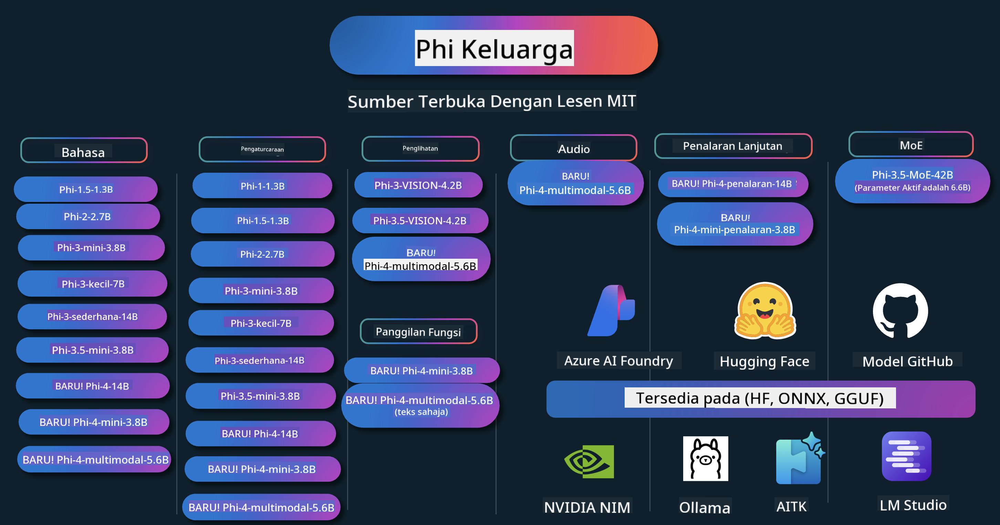

<!--
CO_OP_TRANSLATOR_METADATA:
{
  "original_hash": "1cab9282e04f2e1c388a38dca7763c16",
  "translation_date": "2025-05-09T04:06:00+00:00",
  "source_file": "README.md",
  "language_code": "ms"
}
-->
# Phi Cookbook: דוגמאות מעשיות עם דגמי Phi של מיקרוסופט

Phi היא סדרת דגמי AI בקוד פתוח שפותחה על ידי מיקרוסופט.

Phi כיום הוא המודל הקטן (SLM) החזק והיעיל ביותר מבחינת עלות, עם ביצועים טובים מאוד במבחני שפה מרובים, היגיון, יצירת טקסט/שיחה, קידוד, תמונות, אודיו ותרחישים נוספים.

ניתן לפרוס את Phi בענן או במכשירי קצה, וניתן לבנות בקלות יישומי AI גנרטיביים עם כוח מחשוב מוגבל.

עקבו אחרי השלבים הבאים כדי להתחיל להשתמש במשאבים אלו:
1. **פוצלו את המאגר**: לחצו על 
2. **שכפלו את המאגר**:   `git clone https://github.com/microsoft/PhiCookBook.git`
3. [**הצטרפו לקהילת Microsoft AI ב-Discord ופגשו מומחים ומפתחים אחרים**](https://discord.com/invite/ByRwuEEgH4?WT.mc_id=aiml-137032-kinfeylo)

## 🌐 תמיכה בריבוי שפות

### נתמך דרך GitHub Action (אוטומטי ותמיד מעודכן)

[צרפתית](../fr/README.md) | [ספרדית](../es/README.md) | [גרמנית](../de/README.md) | [רוסית](../ru/README.md) | [ערבית](../ar/README.md) | [פרסית (פארסי)](../fa/README.md) | [אורדו](../ur/README.md) | [סינית (מפושטת)](../zh/README.md) | [סינית (מסורתית, מקאו)](../mo/README.md) | [סינית (מסורתית, הונג קונג)](../hk/README.md) | [סינית (מסורתית, טייוואן)](../tw/README.md) | [יפנית](../ja/README.md) | [קוריאנית](../ko/README.md) | [הינדי](../hi/README.md)

### נתמך דרך CLI
## Jadual Kandungan

- Pengenalan
- [ברוכים הבאים למשפחת Phi](./md/01.Introduction/01/01.PhiFamily.md)
  - [הגדרת הסביבה שלך](./md/01.Introduction/01/01.EnvironmentSetup.md)
  - [הבנת טכנולוגיות מפתח](./md/01.Introduction/01/01.Understandingtech.md)
  - [בטיחות AI עבור דגמי Phi](./md/01.Introduction/01/01.AISafety.md)
  - [תמיכה בחומרה של Phi](./md/01.Introduction/01/01.Hardwaresupport.md)
  - [דגמי Phi וזמינות בפלטפורמות שונות](./md/01.Introduction/01/01.Edgeandcloud.md)
  - [שימוש ב-Guidance-ai ו-Phi](./md/01.Introduction/01/01.Guidance.md)
  - [GitHub Marketplace Models](https://github.com/marketplace/models)
  - [Azure AI Model Catalog](https://ai.azure.com)

- הפעלת Phi בסביבות שונות
    -  [Hugging face](./md/01.Introduction/02/01.HF.md)
    -  [GitHub Models](./md/01.Introduction/02/02.GitHubModel.md)
    -  [Azure AI Foundry Model Catalog](./md/01.Introduction/02/03.AzureAIFoundry.md)
    -  [Ollama](./md/01.Introduction/02/04.Ollama.md)
    -  [AI Toolkit VSCode (AITK)](./md/01.Introduction/02/05.AITK.md)
    -  [NVIDIA NIM](./md/01.Introduction/02/06.NVIDIA.md)

- הפעלת Phi Family
    - [הפעלת Phi ב-iOS](./md/01.Introduction/03/iOS_Inference.md)
    - [הפעלת Phi ב-Android](./md/01.Introduction/03/Android_Inference.md)
    - [הפעלת Phi ב-Jetson](./md/01.Introduction/03/Jetson_Inference.md)
    - [הפעלת Phi ב-AI PC](./md/01.Introduction/03/AIPC_Inference.md)
    - [הפעלת Phi עם Apple MLX Framework](./md/01.Introduction/03/MLX_Inference.md)
    - [הפעלת Phi בשרת מקומי](./md/01.Introduction/03/Local_Server_Inference.md)
    - [הפעלת Phi בשרת מרוחק באמצעות AI Toolkit](./md/01.Introduction/03/Remote_Interence.md)
    - [הפעלת Phi עם Rust](./md/01.Introduction/03/Rust_Inference.md)
    - [הפעלת Phi--Vision במחשב מקומי](./md/01.Introduction/03/Vision_Inference.md)
    - [הפעלת Phi עם Kaito AKS, מכולות Azure (תמיכה רשמית)](./md/01.Introduction/03/Kaito_Inference.md)
-  [כימות Phi Family](./md/01.Introduction/04/QuantifyingPhi.md)
    - [כימות Phi-3.5 / 4 באמצעות llama.cpp](./md/01.Introduction/04/UsingLlamacppQuantifyingPhi.md)
    - [כימות Phi-3.5 / 4 באמצעות הרחבות Generative AI ל-onnxruntime](./md/01.Introduction/04/UsingORTGenAIQuantifyingPhi.md)
    - [כימות Phi-3.5 / 4 באמצעות Intel OpenVINO](./md/01.Introduction/04/UsingIntelOpenVINOQuantifyingPhi.md)
    - [כימות Phi-3.5 / 4 באמצעות Apple MLX Framework](./md/01.Introduction/04/UsingAppleMLXQuantifyingPhi.md)

-  הערכת Phi
- [Response AI](./md/01.Introduction/05/ResponsibleAI.md)
    - [Azure AI Foundry for Evaluation](./md/01.Introduction/05/AIFoundry.md)
    - [Using Promptflow for Evaluation](./md/01.Introduction/05/Promptflow.md)
 
- RAG עם Azure AI Search
    - [כיצד להשתמש ב-Phi-4-mini ו-Phi-4-multimodal(RAG) עם Azure AI Search](https://github.com/microsoft/PhiCookBook/blob/main/code/06.E2E/E2E_Phi-4-RAG-Azure-AI-Search.ipynb)

- דוגמאות לפיתוח יישומי Phi
  - יישומי טקסט ושיחה
    - דוגמאות Phi-4 🆕
      - [📓] [שיחה עם מודל Phi-4-mini ONNX](./md/02.Application/01.TextAndChat/Phi4/ChatWithPhi4ONNX/README.md)
      - [שיחה עם מודל Phi-4 מקומי ONNX ב-.NET](../../md/04.HOL/dotnet/src/LabsPhi4-Chat-01OnnxRuntime)
      - [אפליקציית שיחה קונסול .NET עם Phi-4 ONNX באמצעות Semantic Kernel](../../md/04.HOL/dotnet/src/LabsPhi4-Chat-02SK)
    - דוגמאות Phi-3 / 3.5
      - [צ׳טבוט מקומי בדפדפן המשתמש ב-Phi3, ONNX Runtime Web ו-WebGPU](https://github.com/microsoft/onnxruntime-inference-examples/tree/main/js/chat)
      - [OpenVino Chat](./md/02.Application/01.TextAndChat/Phi3/E2E_OpenVino_Chat.md)
      - [מודלים מרובים - אינטראקציה בין Phi-3-mini ו-OpenAI Whisper](./md/02.Application/01.TextAndChat/Phi3/E2E_Phi-3-mini_with_whisper.md)
      - [MLFlow - בניית עטיפה ושימוש ב-Phi-3 עם MLFlow](./md//02.Application/01.TextAndChat/Phi3/E2E_Phi-3-MLflow.md)
      - [אופטימיזציית מודל - כיצד לאופטם את מודל Phi-3-min עבור ONNX Runtime Web עם Olive](https://github.com/microsoft/Olive/tree/main/examples/phi3)
      - [אפליקציית WinUI3 עם Phi-3 mini-4k-instruct-onnx](https://github.com/microsoft/Phi3-Chat-WinUI3-Sample/)
      - [דוגמת אפליקציית רשימות עם מודלים מרובים ב-WinUI3 מופעלת על ידי AI](https://github.com/microsoft/ai-powered-notes-winui3-sample)
      - [כיוונון עדין ואינטגרציה של מודלים מותאמים אישית Phi-3 עם Prompt flow](./md/02.Application/01.TextAndChat/Phi3/E2E_Phi-3-FineTuning_PromptFlow_Integration.md)
      - [כיוונון עדין ואינטגרציה של מודלים מותאמים אישית Phi-3 עם Prompt flow ב-Azure AI Foundry](./md/02.Application/01.TextAndChat/Phi3/E2E_Phi-3-FineTuning_PromptFlow_Integration_AIFoundry.md)
      - [הערכת מודל Phi-3 / Phi-3.5 מכוונן עדין ב-Azure AI Foundry עם דגש על עקרונות Responsible AI של מיקרוסופט](./md/02.Application/01.TextAndChat/Phi3/E2E_Phi-3-Evaluation_AIFoundry.md)
      - [📓] [דוגמת חיזוי שפה Phi-3.5-mini-instruct (סינית/אנגלית)](../../md/02.Application/01.TextAndChat/Phi3/phi3-instruct-demo.ipynb)
      - [צ׳טבוט RAG עם Phi-3.5-Instruct ו-WebGPU](./md/02.Application/01.TextAndChat/Phi3/WebGPUWithPhi35Readme.md)
      - [שימוש ב-GPU של Windows ליצירת פתרון Prompt flow עם Phi-3.5-Instruct ONNX](./md/02.Application/01.TextAndChat/Phi3/UsingPromptFlowWithONNX.md)
      - [שימוש ב-Microsoft Phi-3.5 tflite ליצירת אפליקציית Android](./md/02.Application/01.TextAndChat/Phi3/UsingPhi35TFLiteCreateAndroidApp.md)
      - [דוגמת שאלות ותשובות ב-.NET המשתמשת במודל ONNX מקומי Phi-3 עם Microsoft.ML.OnnxRuntime](../../md/04.HOL/dotnet/src/LabsPhi301)
      - [אפליקציית שיחה קונסול .NET עם Semantic Kernel ו-Phi-3](../../md/04.HOL/dotnet/src/LabsPhi302)

  - דוגמאות מבוססות קוד של Azure AI Inference SDK
    - דוגמאות Phi-4 🆕
      - [📓] [יצירת קוד פרויקט באמצעות Phi-4-multimodal](./md/02.Application/02.Code/Phi4/GenProjectCode/README.md)
    - דוגמאות Phi-3 / 3.5
      - [בנה את סוכן השיחה GitHub Copilot שלך ב-Visual Studio Code עם משפחת Microsoft Phi-3](./md/02.Application/02.Code/Phi3/VSCodeExt/README.md)
      - [צור סוכן שיחה ב-Visual Studio Code עם Phi-3.5 באמצעות דגמי GitHub](./md/02.Application/02.Code/Phi3/CreateVSCodeChatAgentWithGitHubModels.md)

  - דוגמאות למחשבה מתקדמת
    - דוגמאות Phi-4 🆕
      - [📓] [דוגמאות ל-Phi-4-mini-reasoning או Phi-4-reasoning](./md/02.Application/03.AdvancedReasoning/Phi4/AdvancedResoningPhi4mini/README.md)
      - [📓] [כיוונון עדין של Phi-4-mini-reasoning עם Microsoft Olive](../../md/02.Application/03.AdvancedReasoning/Phi4/AdvancedResoningPhi4mini/olive_ft_phi_4_reasoning_with_medicaldata.ipynb)
      - [📓] [כיוונון עדין של Phi-4-mini-reasoning עם Apple MLX](../../md/02.Application/03.AdvancedReasoning/Phi4/AdvancedResoningPhi4mini/mlx_ft_phi_4_reasoning_with_medicaldata.ipynb)
      - [📓] [Phi-4-mini-reasoning עם דגמי GitHub](../../md/02.Application/02.Code/Phi4r/github_models_inference.ipynb)
- [📓] [Phi-4-mini reasoning עם דגמי Azure AI Foundry](../../md/02.Application/02.Code/Phi4r/azure_models_inference.ipynb)
  - הדגמות
      - [הדגמות Phi-4-mini המארחות ב-Hugging Face Spaces](https://huggingface.co/spaces/microsoft/phi-4-mini?WT.mc_id=aiml-137032-kinfeylo)
      - [הדגמות Phi-4-multimodal המארחות ב-Hugginge Face Spaces](https://huggingface.co/spaces/microsoft/phi-4-multimodal?WT.mc_id=aiml-137032-kinfeylo)
  - דוגמאות ויזואליות
    - דוגמאות Phi-4 🆕
      - [📓] [שימוש ב-Phi-4-multimodal לקריאת תמונות ויצירת קוד](./md/02.Application/04.Vision/Phi4/CreateFrontend/README.md) 
    - דוגמאות Phi-3 / 3.5
      -  [📓][Phi-3-vision - טקסט מתמונה לטקסט](../../md/02.Application/04.Vision/Phi3/E2E_Phi-3-vision-image-text-to-text-online-endpoint.ipynb)
      - [Phi-3-vision-ONNX](https://onnxruntime.ai/docs/genai/tutorials/phi3-v.html)
      - [📓][Phi-3-vision CLIP Embedding](../../md/02.Application/04.Vision/Phi3/E2E_Phi-3-vision-image-text-to-text-online-endpoint.ipynb)
      - [DEMO: מיחזור Phi-3](https://github.com/jennifermarsman/PhiRecycling/)
      - [Phi-3-vision - עוזר שפה חזותית עם Phi3-Vision ו-OpenVINO](https://docs.openvino.ai/nightly/notebooks/phi-3-vision-with-output.html)
      - [Phi-3 Vision Nvidia NIM](./md/02.Application/04.Vision/Phi3/E2E_Nvidia_NIM_Vision.md)
      - [Phi-3 Vision OpenVino](./md/02.Application/04.Vision/Phi3/E2E_OpenVino_Phi3Vision.md)
      - [📓][דוגמת Phi-3.5 Vision עם פריימים מרובים או תמונות מרובות](../../md/02.Application/04.Vision/Phi3/phi3-vision-demo.ipynb)
      - [מודל ONNX מקומי של Phi-3 Vision עם Microsoft.ML.OnnxRuntime .NET](../../md/04.HOL/dotnet/src/LabsPhi303)
      - [מודל ONNX מקומי מבוסס תפריט של Phi-3 Vision עם Microsoft.ML.OnnxRuntime .NET](../../md/04.HOL/dotnet/src/LabsPhi304)

  - דוגמאות אודיו
    - דוגמאות Phi-4 🆕
      - [📓] [חילוץ תמלילי אודיו עם Phi-4-multimodal](./md/02.Application/05.Audio/Phi4/Transciption/README.md)
      - [📓] [דוגמת אודיו Phi-4-multimodal](../../md/02.Application/05.Audio/Phi4/Siri/demo.ipynb)
      - [📓] [דוגמת תרגום דיבור עם Phi-4-multimodal](../../md/02.Application/05.Audio/Phi4/Translate/demo.ipynb)
      - [אפליקציית קונסול .NET שמשתמשת ב-Phi-4-multimodal לניתוח קובץ אודיו ויצירת תמליל](../../md/04.HOL/dotnet/src/LabsPhi4-MultiModal-02Audio)

  - דוגמאות MOE
    - דוגמאות Phi-3 / 3.5
      - [📓] [דוגמת Phi-3.5 Mixture of Experts Models (MoEs) למדיה חברתית](../../md/02.Application/06.MoE/Phi3/phi3_moe_demo.ipynb)
      - [📓] [בניית Pipeline של Retrieval-Augmented Generation (RAG) עם NVIDIA NIM Phi-3 MOE, Azure AI Search ו-LlamaIndex](../../md/02.Application/06.MoE/Phi3/azure-ai-search-nvidia-rag.ipynb)
  - דוגמאות קריאת פונקציות
    - דוגמאות Phi-4 🆕
      -  [📓] [שימוש בקריאת פונקציות עם Phi-4-mini](./md/02.Application/07.FunctionCalling/Phi4/FunctionCallingBasic/README.md)
      -  [📓] [שימוש בקריאת פונקציות ליצירת סוכנים מרובים עם Phi-4-mini](../../md/02.Application/07.FunctionCalling/Phi4/Multiagents/Phi_4_mini_multiagent.ipynb)
      -  [📓] [שימוש בקריאת פונקציות עם Ollama](../../md/02.Application/07.FunctionCalling/Phi4/Ollama/ollama_functioncalling.ipynb)
  - דוגמאות מיקס מודאלי
    - דוגמאות Phi-4 🆕
      -  [📓] [שימוש ב-Phi-4-multimodal כעיתונאי טכנולוגיה](../../md/02.Application/08.Multimodel/Phi4/TechJournalist/phi_4_mm_audio_text_publish_news.ipynb)
      - [אפליקציית קונסול .NET שמשתמשת ב-Phi-4-multimodal לניתוח תמונות](../../md/04.HOL/dotnet/src/LabsPhi4-MultiModal-01Images)

- דוגמאות כיוונון עדין של Phi
  - [תסריטי כיוונון עדין](./md/03.FineTuning/FineTuning_Scenarios.md)
  - [כיוונון עדין מול RAG](./md/03.FineTuning/FineTuning_vs_RAG.md)
  - [כיוונון עדין - להפוך את Phi-3 למומחה תעשייתי](./md/03.FineTuning/LetPhi3gotoIndustriy.md)
  - [כיוונון עדין של Phi-3 עם AI Toolkit ל-VS Code](./md/03.FineTuning/Finetuning_VSCodeaitoolkit.md)
  - [כיוונון עדין של Phi-3 עם Azure Machine Learning Service](./md/03.FineTuning/Introduce_AzureML.md)
- [כיוונון עדין של Phi-3 עם Lora](./md/03.FineTuning/FineTuning_Lora.md)
  - [כיוונון עדין של Phi-3 עם QLora](./md/03.FineTuning/FineTuning_Qlora.md)
  - [כיוונון עדין של Phi-3 עם Azure AI Foundry](./md/03.FineTuning/FineTuning_AIFoundry.md)
  - [כיוונון עדין של Phi-3 עם Azure ML CLI/SDK](./md/03.FineTuning/FineTuning_MLSDK.md)
  - [כיוונון עדין עם Microsoft Olive](./md/03.FineTuning/FineTuning_MicrosoftOlive.md)
  - [כיוונון עדין עם Microsoft Olive Hands-On Lab](./md/03.FineTuning/olive-lab/readme.md)
  - [כיוונון עדין של Phi-3-vision עם Weights and Bias](./md/03.FineTuning/FineTuning_Phi-3-visionWandB.md)
  - [כיוונון עדין של Phi-3 עם Apple MLX Framework](./md/03.FineTuning/FineTuning_MLX.md)
  - [כיוונון עדין של Phi-3-vision (תמיכה רשמית)](./md/03.FineTuning/FineTuning_Vision.md)
  - [כיוונון עדין של Phi-3 עם Kaito AKS, מכולות Azure (תמיכה רשמית)](./md/03.FineTuning/FineTuning_Kaito.md)
  - [כיוונון עדין של Phi-3 ו-3.5 Vision](https://github.com/2U1/Phi3-Vision-Finetune)

- מעבדת עבודה מעשית
  - [חקירת מודלים מתקדמים: LLMs, SLMs, פיתוח מקומי ועוד](https://github.com/microsoft/aitour-exploring-cutting-edge-models)
  - [שחרור הפוטנציאל של NLP: כיוונון עדין עם Microsoft Olive](https://github.com/azure/Ignite_FineTuning_workshop)

- מאמרים ומחקרים אקדמיים
  - [Textbooks Are All You Need II: דוח טכני על phi-1.5](https://arxiv.org/abs/2309.05463)
  - [דוח טכני על Phi-3: מודל שפה חזק שניתן להריץ במכשיר הנייד שלך](https://arxiv.org/abs/2404.14219)
  - [דוח טכני על Phi-4](https://arxiv.org/abs/2412.08905)
  - [דוח טכני על Phi-4-Mini: מודלים רב-מודליים קומפקטיים אך רבי עוצמה באמצעות Mixture-of-LoRAs](https://arxiv.org/abs/2503.01743)
  - [אופטימיזציה של מודלים קטנים לפונקציות קריאה בתוך הרכב](https://arxiv.org/abs/2501.02342)
  - [(WhyPHI) כיוונון עדין של PHI-3 למענה על שאלות רב-ברירתיות: שיטות, תוצאות ואתגרים](https://arxiv.org/abs/2501.01588)
  - [דוח טכני על Phi-4-reasoning](https://www.microsoft.com/en-us/research/wp-content/uploads/2025/04/phi_4_reasoning.pdf)
  - [דוח טכני על Phi-4-mini-reasoning](https://huggingface.co/microsoft/Phi-4-mini-reasoning/blob/main/Phi-4-Mini-Reasoning.pdf)

## שימוש במודלים של Phi

### Phi ב-Azure AI Foundry

ניתן ללמוד כיצד להשתמש ב-Microsoft Phi וכיצד לבנות פתרונות מקצה לקצה במכשירים שונים. כדי להתנסות בעצמך, התחל לשחק עם המודלים ולבצע התאמות אישיות של Phi לסצנריו שלך באמצעות [קטלוג המודלים של Azure AI Foundry](https://aka.ms/phi3-azure-ai). ניתן ללמוד עוד ב-Getting Started עם [Azure AI Foundry](/md/02.QuickStart/AzureAIFoundry_QuickStart.md)

**Playground**  
לכל מודל יש סביבת playground ייעודית לבדיקת המודל ב-[Azure AI Playground](https://aka.ms/try-phi3).

### Phi במודלים של GitHub

ניתן ללמוד כיצד להשתמש ב-Microsoft Phi וכיצד לבנות פתרונות מקצה לקצה במכשירים שונים. כדי להתנסות בעצמך, התחל לשחק עם המודל ולבצע התאמות אישיות של Phi לסצנריו שלך באמצעות [קטלוג המודלים ב-GitHub](https://github.com/marketplace/models?WT.mc_id=aiml-137032-kinfeylo). ניתן ללמוד עוד ב-Getting Started עם [GitHub Model Catalog](/md/02.QuickStart/GitHubModel_QuickStart.md)

**Playground**  
לכל מודל יש [playground ייעודי לבדיקת המודל](/md/02.QuickStart/GitHubModel_QuickStart.md).

### Phi ב-Hugging Face

ניתן גם למצוא את המודל ב-[Hugging Face](https://huggingface.co/microsoft)

**Playground**  
[Hugging Chat playground](https://huggingface.co/chat/models/microsoft/Phi-3-mini-4k-instruct)

## AI אחראי

Microsoft מחויבת לסייע ללקוחותינו להשתמש במוצרי ה-AI שלנו באופן אחראי, לשתף את הלמידות שלנו ולבנות שותפויות מבוססות אמון באמצעות כלים כמו Transparency Notes ו-Impact Assessments. משאבים רבים זמינים ב-[https://aka.ms/RAI](https://aka.ms/RAI).  
הגישה של Microsoft ל-AI אחראי מבוססת על עקרונות ה-AI שלנו הכוללים הגינות, אמינות ובטיחות, פרטיות ואבטחה, הכללה, שקיפות ואחריות.
Large-scale natural language, image, and speech models - like the ones used in this sample - can potentially behave in ways that are unfair, unreliable, or offensive, in turn causing harms. Please consult the [Azure OpenAI service Transparency note](https://learn.microsoft.com/legal/cognitive-services/openai/transparency-note?tabs=text) to be informed about risks and limitations.

The recommended approach to mitigating these risks is to include a safety system in your architecture that can detect and prevent harmful behavior. [Azure AI Content Safety](https://learn.microsoft.com/azure/ai-services/content-safety/overview) provides an independent layer of protection, able to detect harmful user-generated and AI-generated content in applications and services. Azure AI Content Safety includes text and image APIs that allow you to detect material that is harmful. Within Azure AI Foundry, the Content Safety service allows you to view, explore and try out sample code for detecting harmful content across different modalities. The following [quickstart documentation](https://learn.microsoft.com/azure/ai-services/content-safety/quickstart-text?tabs=visual-studio%2Clinux&pivots=programming-language-rest) guides you through making requests to the service.

Another aspect to take into account is the overall application performance. With multi-modal and multi-models applications, we consider performance to mean that the system performs as you and your users expect, including not generating harmful outputs. It's important to assess the performance of your overall application using [Performance and Quality and Risk and Safety evaluators](https://learn.microsoft.com/azure/ai-studio/concepts/evaluation-metrics-built-in). You also have the ability to create and evaluate with [custom evaluators](https://learn.microsoft.com/azure/ai-studio/how-to/develop/evaluate-sdk#custom-evaluators).

You can evaluate your AI application in your development environment using the [Azure AI Evaluation SDK](https://microsoft.github.io/promptflow/index.html). Given either a test dataset or a target, your generative AI application generations are quantitatively measured with built-in evaluators or custom evaluators of your choice. To get started with the azure ai evaluation sdk to evaluate your system, you can follow the [quickstart guide](https://learn.microsoft.com/azure/ai-studio/how-to/develop/flow-evaluate-sdk). Once you execute an evaluation run, you can [visualize the results in Azure AI Foundry](https://learn.microsoft.com/azure/ai-studio/how-to/evaluate-flow-results).

## Trademarks

This project may contain trademarks or logos for projects, products, or services. Authorized use of Microsoft trademarks or logos is subject to and must follow [Microsoft's Trademark & Brand Guidelines](https://www.microsoft.com/legal/intellectualproperty/trademarks/usage/general).  
Use of Microsoft trademarks or logos in modified versions of this project must not cause confusion or imply Microsoft sponsorship. Any use of third-party trademarks or logos are subject to those third-party's policies.

**Penafian**:  
Dokumen ini telah diterjemahkan menggunakan perkhidmatan terjemahan AI [Co-op Translator](https://github.com/Azure/co-op-translator). Walaupun kami berusaha untuk ketepatan, sila maklum bahawa terjemahan automatik mungkin mengandungi kesilapan atau ketidaktepatan. Dokumen asal dalam bahasa asalnya harus dianggap sebagai sumber yang sahih. Untuk maklumat kritikal, terjemahan profesional oleh manusia adalah disyorkan. Kami tidak bertanggungjawab atas sebarang salah faham atau salah tafsir yang timbul daripada penggunaan terjemahan ini.