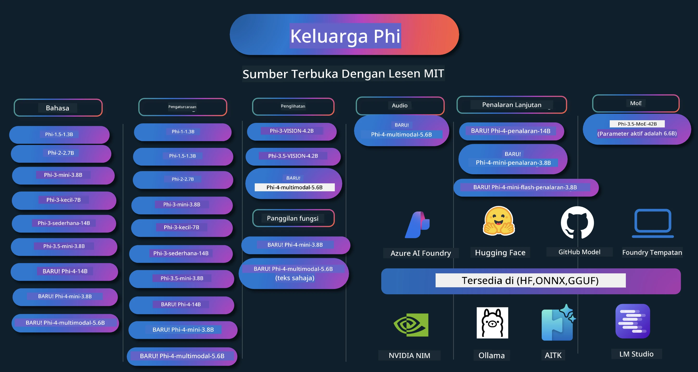

# Phi Cookbook: Contoh Praktikal dengan Model Phi Microsoft

[](https://codespaces.new/microsoft/phicookbook)
[](https://vscode.dev/redirect?url=vscode://ms-vscode-remote.remote-containers/cloneInVolume?url=https://github.com/microsoft/phicookbook)

[](https://GitHub.com/microsoft/phicookbook/graphs/contributors/?WT.mc_id=aiml-137032-kinfeylo)
[](https://GitHub.com/microsoft/phicookbook/issues/?WT.mc_id=aiml-137032-kinfeylo)
[](https://GitHub.com/microsoft/phicookbook/pulls/?WT.mc_id=aiml-137032-kinfeylo)
[](http://makeapullrequest.com?WT.mc_id=aiml-137032-kinfeylo)

[](https://GitHub.com/microsoft/phicookbook/watchers/?WT.mc_id=aiml-137032-kinfeylo)
[](https://GitHub.com/microsoft/phicookbook/network/?WT.mc_id=aiml-137032-kinfeylo)
[](https://GitHub.com/microsoft/phicookbook/stargazers/?WT.mc_id=aiml-137032-kinfeylo)

[](https://discord.com/invite/ByRwuEEgH4)

Phi adalah satu siri model AI sumber terbuka yang dibangunkan oleh Microsoft.

Phi kini adalah model bahasa kecil (SLM) yang paling kuat dan berkesan dari segi kos, dengan penanda aras yang sangat baik dalam pelbagai bahasa, penaakulan, penjanaan teks/sembang, pengkodan, imej, audio dan senario lain.

Anda boleh menyebarkan Phi ke awan atau ke peranti tepi, dan anda boleh dengan mudah membina aplikasi AI generatif dengan kuasa pengkomputeran terhad.

Ikuti langkah ini untuk mula menggunakan sumber ini:
1. **Fork Repositori**: Klik [](https://GitHub.com/microsoft/phicookbook/network/?WT.mc_id=aiml-137032-kinfeylo)
2. **Clone Repositori**: `git clone https://github.com/microsoft/PhiCookBook.git`
3. [**Sertai Komuniti Discord AI Microsoft dan temui pakar serta pembangun lain**](https://discord.com/invite/ByRwuEEgH4?WT.mc_id=aiml-137032-kinfeylo)



### 🌐 Sokongan Pelbagai Bahasa

#### Disokong melalui GitHub Action (Automatik & Sentiasa Dikemas Kini)

<!-- CO-OP TRANSLATOR LANGUAGES TABLE START -->
[Arab](../ar/README.md) | [Bengali](../bn/README.md) | [Bulgaria](../bg/README.md) | [Burma (Myanmar)](../my/README.md) | [Cina (Ringkas)](../zh-CN/README.md) | [Cina (Tradisional, Hong Kong)](../zh-HK/README.md) | [Cina (Tradisional, Macau)](../zh-MO/README.md) | [Cina (Tradisional, Taiwan)](../zh-TW/README.md) | [Croatia](../hr/README.md) | [Czech](../cs/README.md) | [Denmark](../da/README.md) | [Belanda](../nl/README.md) | [Estonia](../et/README.md) | [Finland](../fi/README.md) | [Perancis](../fr/README.md) | [Jerman](../de/README.md) | [Greek](../el/README.md) | [Ibrani](../he/README.md) | [Hindi](../hi/README.md) | [Hungarian](../hu/README.md) | [Indonesia](../id/README.md) | [Itali](../it/README.md) | [Jepun](../ja/README.md) | [Kannada](../kn/README.md) | [Korea](../ko/README.md) | [Lithuania](../lt/README.md) | [Melayu](./README.md) | [Malayalam](../ml/README.md) | [Marathi](../mr/README.md) | [Nepali](../ne/README.md) | [Pidgin Nigeria](../pcm/README.md) | [Norwegian](../no/README.md) | [Parsi (Farsi)](../fa/README.md) | [Poland](../pl/README.md) | [Portugis (Brazil)](../pt-BR/README.md) | [Portugis (Portugal)](../pt-PT/README.md) | [Punjabi (Gurmukhi)](../pa/README.md) | [Romania](../ro/README.md) | [Rusia](../ru/README.md) | [Serbia (Cyrillic)](../sr/README.md) | [Slovak](../sk/README.md) | [Slovenian](../sl/README.md) | [Sepanyol](../es/README.md) | [Swahili](../sw/README.md) | [Sweden](../sv/README.md) | [Tagalog (Filipino)](../tl/README.md) | [Tamil](../ta/README.md) | [Telugu](../te/README.md) | [Thai](../th/README.md) | [Turki](../tr/README.md) | [Ukraine](../uk/README.md) | [Urdu](../ur/README.md) | [Vietnam](../vi/README.md)

> **Lebih Suka Clone Secara Tempatan?**

> Repositori ini termasuk lebih 50 terjemahan bahasa yang meningkatkan saiz muat turun dengan ketara. Untuk clone tanpa terjemahan, gunakan sparse checkout:
> ```bash
> git clone --filter=blob:none --sparse https://github.com/microsoft/PhiCookBook.git
> cd PhiCookBook
> git sparse-checkout set --no-cone '/*' '!translations' '!translated_images'
> ```
> Ini memberikan anda semua yang anda perlukan untuk menyelesaikan kursus dengan muat turun yang jauh lebih pantas.
<!-- CO-OP TRANSLATOR LANGUAGES TABLE END -->

## Jadual Kandungan

- Pengenalan
  - [Selamat Datang ke Keluarga Phi](./md/01.Introduction/01/01.PhiFamily.md)
  - [Menyiapkan Persekitaran Anda](./md/01.Introduction/01/01.EnvironmentSetup.md)
  - [Memahami Teknologi Utama](./md/01.Introduction/01/01.Understandingtech.md)
  - [Keselamatan AI untuk Model Phi](./md/01.Introduction/01/01.AISafety.md)
  - [Sokongan Perkakasan Phi](./md/01.Introduction/01/01.Hardwaresupport.md)
  - [Model Phi & Ketersediaan merentasi platform](./md/01.Introduction/01/01.Edgeandcloud.md)
  - [Menggunakan Guidance-ai dan Phi](./md/01.Introduction/01/01.Guidance.md)
  - [Model Pasaran GitHub](https://github.com/marketplace/models)
  - [Katalog Model Azure AI](https://ai.azure.com)

- Inferens Phi dalam persekitaran berbeza
    -  [Hugging face](./md/01.Introduction/02/01.HF.md)
    -  [Model GitHub](./md/01.Introduction/02/02.GitHubModel.md)
    -  [Katalog Model Azure AI Foundry](./md/01.Introduction/02/03.AzureAIFoundry.md)
    -  [Ollama](./md/01.Introduction/02/04.Ollama.md)
    -  [AI Toolkit VSCode (AITK)](./md/01.Introduction/02/05.AITK.md)
    -  [NVIDIA NIM](./md/01.Introduction/02/06.NVIDIA.md)
    -  [Foundry Lokal](./md/01.Introduction/02/07.FoundryLocal.md)

- Inferens Keluarga Phi
    - [Inferens Phi pada iOS](./md/01.Introduction/03/iOS_Inference.md)
    - [Inferens Phi pada Android](./md/01.Introduction/03/Android_Inference.md)
    - [Inferens Phi pada Jetson](./md/01.Introduction/03/Jetson_Inference.md)
    - [Inferens Phi pada PC AI](./md/01.Introduction/03/AIPC_Inference.md)
    - [Inferens Phi dengan Rangka Kerja Apple MLX](./md/01.Introduction/03/MLX_Inference.md)
    - [Inferens Phi pada Pelayan Tempatan](./md/01.Introduction/03/Local_Server_Inference.md)
    - [Inferens Phi pada Pelayan Jauh menggunakan AI Toolkit](./md/01.Introduction/03/Remote_Interence.md)
    - [Inferens Phi dengan Rust](./md/01.Introduction/03/Rust_Inference.md)
    - [Inferens Phi--Vision secara Tempatan](./md/01.Introduction/03/Vision_Inference.md)
    - [Inferens Phi dengan Kaito AKS, Azure Containers (sokongan rasmi)](./md/01.Introduction/03/Kaito_Inference.md)
-  [Mengkuantifikasi Keluarga Phi](./md/01.Introduction/04/QuantifyingPhi.md)
    - [Mengkuantifikasi Phi-3.5 / 4 menggunakan llama.cpp](./md/01.Introduction/04/UsingLlamacppQuantifyingPhi.md)
    - [Mengkuantifikasi Phi-3.5 / 4 menggunakan sambungan Generative AI untuk onnxruntime](./md/01.Introduction/04/UsingORTGenAIQuantifyingPhi.md)
    - [Mengkuantifikasi Phi-3.5 / 4 menggunakan Intel OpenVINO](./md/01.Introduction/04/UsingIntelOpenVINOQuantifyingPhi.md)
    - [Mengkuantifikasi Phi-3.5 / 4 menggunakan Rangka Kerja Apple MLX](./md/01.Introduction/04/UsingAppleMLXQuantifyingPhi.md)

-  Penilaian Phi
    - [AI Bertanggungjawab](./md/01.Introduction/05/ResponsibleAI.md)
    - [Azure AI Foundry untuk Penilaian](./md/01.Introduction/05/AIFoundry.md)
    - [Menggunakan Promptflow untuk Penilaian](./md/01.Introduction/05/Promptflow.md)
 
- RAG dengan Azure AI Search
    - [Cara menggunakan Phi-4-mini dan Phi-4-multimodal (RAG) dengan Azure AI Search](https://github.com/microsoft/PhiCookBook/blob/main/code/06.E2E/E2E_Phi-4-RAG-Azure-AI-Search.ipynb)

- Contoh pembangunan aplikasi Phi
  - Aplikasi Teks & Sembang
    - Sampel Phi-4 🆕
      - [📓] [Sembang Dengan Model Phi-4-mini ONNX](./md/02.Application/01.TextAndChat/Phi4/ChatWithPhi4ONNX/README.md)
      - [Sembang dengan Model ONNX tempatan Phi-4 .NET](../../md/04.HOL/dotnet/src/LabsPhi4-Chat-01OnnxRuntime)
      - [Aplikasi Konsol Sembang .NET dengan Phi-4 ONNX menggunakan Sementic Kernel](../../md/04.HOL/dotnet/src/LabsPhi4-Chat-02SK)
    - Sampel Phi-3 / 3.5
      - [Chatbot Tempatan dalam penyemak imbas menggunakan Phi3, ONNX Runtime Web dan WebGPU](https://github.com/microsoft/onnxruntime-inference-examples/tree/main/js/chat)
      - [Sembang OpenVino](./md/02.Application/01.TextAndChat/Phi3/E2E_OpenVino_Chat.md)
      - [Model Pelbagai - Interaktif Phi-3-mini dan OpenAI Whisper](./md/02.Application/01.TextAndChat/Phi3/E2E_Phi-3-mini_with_whisper.md)
      - [MLFlow - Membina pembungkus dan menggunakan Phi-3 dengan MLFlow](./md//02.Application/01.TextAndChat/Phi3/E2E_Phi-3-MLflow.md)
      - [Pengoptimuman Model - Cara mengoptimumkan model Phi-3-min untuk ONNX Runtime Web dengan Olive](https://github.com/microsoft/Olive/tree/main/examples/phi3)
      - [Aplikasi WinUI3 dengan Phi-3 mini-4k-instruct-onnx](https://github.com/microsoft/Phi3-Chat-WinUI3-Sample/)
      -[Contoh Aplikasi Nota Berkuasa AI Model Pelbagai WinUI3](https://github.com/microsoft/ai-powered-notes-winui3-sample)
      - [Melatih Halus dan Mengintegrasi model Phi-3 tersuai dengan Prompt flow](./md/02.Application/01.TextAndChat/Phi3/E2E_Phi-3-FineTuning_PromptFlow_Integration.md)
      - [Melatih Halus dan Mengintegrasi model Phi-3 tersuai dengan Prompt flow dalam Azure AI Foundry](./md/02.Application/01.TextAndChat/Phi3/E2E_Phi-3-FineTuning_PromptFlow_Integration_AIFoundry.md)
      - [Menilai Model Phi-3 / Phi-3.5 Halus Latih dalam Azure AI Foundry Fokus kepada Prinsip AI Bertanggungjawab Microsoft](./md/02.Application/01.TextAndChat/Phi3/E2E_Phi-3-Evaluation_AIFoundry.md)
      - [📓] [Contoh ramalan bahasa Phi-3.5-mini-instruct (Cina/Inggeris)](./md/02.Application/01.TextAndChat/Phi3/phi3-instruct-demo.ipynb)
      - [Phi-3.5-Instruct WebGPU RAG Chatbot](./md/02.Application/01.TextAndChat/Phi3/WebGPUWithPhi35Readme.md)
      - [Menggunakan Windows GPU untuk mencipta penyelesaian Prompt flow dengan Phi-3.5-Instruct ONNX](./md/02.Application/01.TextAndChat/Phi3/UsingPromptFlowWithONNX.md)
      - [Menggunakan Microsoft Phi-3.5 tflite untuk mencipta aplikasi Android](./md/02.Application/01.TextAndChat/Phi3/UsingPhi35TFLiteCreateAndroidApp.md)
      - [Contoh Q&A .NET menggunakan model ONNX Phi-3 tempatan menggunakan Microsoft.ML.OnnxRuntime](../../md/04.HOL/dotnet/src/LabsPhi301)
      - [Aplikasi sembang konsol .NET dengan Semantic Kernel dan Phi-3](../../md/04.HOL/dotnet/src/LabsPhi302)

  - Contoh Kod SDK Inferens Azure AI  
    - Contoh Phi-4 🆕
      - [📓] [Menjana kod projek menggunakan Phi-4-multimodal](./md/02.Application/02.Code/Phi4/GenProjectCode/README.md)
    - Contoh Phi-3 / 3.5
      - [Bina Visual Studio Code GitHub Copilot Chat anda sendiri dengan Keluarga Microsoft Phi-3](./md/02.Application/02.Code/Phi3/VSCodeExt/README.md)
      - [Cipta Ejen Copilot Sembang Visual Studio Code anda sendiri dengan Phi-3.5 oleh Model GitHub](/md/02.Application/02.Code/Phi3/CreateVSCodeChatAgentWithGitHubModels.md)

  - Contoh Penalaran Lanjutan
    - Contoh Phi-4 🆕
      - [📓] [Contoh Phi-4-mini-reasoning atau Phi-4-reasoning](./md/02.Application/03.AdvancedReasoning/Phi4/AdvancedResoningPhi4mini/README.md)
      - [📓] [Melatih halus Phi-4-mini-reasoning dengan Microsoft Olive](./md/02.Application/03.AdvancedReasoning/Phi4/AdvancedResoningPhi4mini/olive_ft_phi_4_reasoning_with_medicaldata.ipynb)
      - [📓] [Melatih halus Phi-4-mini-reasoning dengan Apple MLX](./md/02.Application/03.AdvancedReasoning/Phi4/AdvancedResoningPhi4mini/mlx_ft_phi_4_reasoning_with_medicaldata.ipynb)
      - [📓] [Phi-4-mini-reasoning dengan Model GitHub](./md/02.Application/02.Code/Phi4r/github_models_inference.ipynb)
      - [📓] [Phi-4-mini-reasoning dengan Model Azure AI Foundry](./md/02.Application/02.Code/Phi4r/azure_models_inference.ipynb)
  - Demo
      - [Demo Phi-4-mini dihoskan di Hugging Face Spaces](https://huggingface.co/spaces/microsoft/phi-4-mini?WT.mc_id=aiml-137032-kinfeylo)
      - [Demo Phi-4-multimodal dihoskan di Hugginge Face Spaces](https://huggingface.co/spaces/microsoft/phi-4-multimodal?WT.mc_id=aiml-137032-kinfeylo)
  - Contoh Visi
    - Contoh Phi-4 🆕
      - [📓] [Gunakan Phi-4-multimodal untuk membaca imej dan menjana kod](./md/02.Application/04.Vision/Phi4/CreateFrontend/README.md) 
    - Contoh Phi-3 / 3.5
      -  [📓][Phi-3-vision-Teks imej ke teks](./md/02.Application/04.Vision/Phi3/E2E_Phi-3-vision-image-text-to-text-online-endpoint.ipynb)
      - [Phi-3-vision-ONNX](https://onnxruntime.ai/docs/genai/tutorials/phi3-v.html)
      - [📓][Phi-3-vision CLIP Embedding](./md/02.Application/04.Vision/Phi3/E2E_Phi-3-vision-image-text-to-text-online-endpoint.ipynb)
      - [DEMO: Kitar Semula Phi-3](https://github.com/jennifermarsman/PhiRecycling/)
      - [Phi-3-vision - Pembantu bahasa visual - dengan Phi3-Vision dan OpenVINO](https://docs.openvino.ai/nightly/notebooks/phi-3-vision-with-output.html)
      - [Phi-3 Vision Nvidia NIM](./md/02.Application/04.Vision/Phi3/E2E_Nvidia_NIM_Vision.md)
      - [Phi-3 Vision OpenVino](./md/02.Application/04.Vision/Phi3/E2E_OpenVino_Phi3Vision.md)
      - [📓][Phi-3.5 Vision contoh pelbagai bingkai atau pelbagai imej](./md/02.Application/04.Vision/Phi3/phi3-vision-demo.ipynb)
      - [Model ONNX Tempatan Phi-3 Vision menggunakan Microsoft.ML.OnnxRuntime .NET](../../md/04.HOL/dotnet/src/LabsPhi303)
      - [Model ONNX Tempatan Phi-3 Vision berasaskan menu menggunakan Microsoft.ML.OnnxRuntime .NET](../../md/04.HOL/dotnet/src/LabsPhi304)

  - Contoh Matematik
    -  Contoh Phi-4-Mini-Flash-Reasoning-Instruct 🆕 [Demo Matematik dengan Phi-4-Mini-Flash-Reasoning-Instruct](./md/02.Application/09.Math/MathDemo.ipynb)

  - Contoh Audio
    - Contoh Phi-4 🆕
      - [📓] [Mengekstrak transkrip audio menggunakan Phi-4-multimodal](./md/02.Application/05.Audio/Phi4/Transciption/README.md)
      - [📓] [Contoh Audio Phi-4-multimodal](./md/02.Application/05.Audio/Phi4/Siri/demo.ipynb)
      - [📓] [Contoh Terjemahan Ucapan Phi-4-multimodal](./md/02.Application/05.Audio/Phi4/Translate/demo.ipynb)
      - [Aplikasi konsol .NET menggunakan Phi-4-multimodal Audio untuk menganalisis fail audio dan menjana transkrip](../../md/04.HOL/dotnet/src/LabsPhi4-MultiModal-02Audio)

  - Contoh MOE
    - Contoh Phi-3 / 3.5
      - [📓] [Model Campuran Pakar Phi-3.5 (MoEs) Contoh Media Sosial](./md/02.Application/06.MoE/Phi3/phi3_moe_demo.ipynb)
      - [📓] [Membina Paip Penghasilan Diperkuat Pengambilalihan (RAG) dengan NVIDIA NIM Phi-3 MOE, Azure AI Search, dan LlamaIndex](./md/02.Application/06.MoE/Phi3/azure-ai-search-nvidia-rag.ipynb)
      - 
  - Contoh Panggilan Fungsi
    - Contoh Phi-4 🆕
      -  [📓] [Menggunakan Panggilan Fungsi Dengan Phi-4-mini](./md/02.Application/07.FunctionCalling/Phi4/FunctionCallingBasic/README.md)
      -  [📓] [Menggunakan Panggilan Fungsi untuk membuat multi ejen Dengan Phi-4-mini](./md/02.Application/07.FunctionCalling/Phi4/Multiagents/Phi_4_mini_multiagent.ipynb)
      -  [📓] [Menggunakan Panggilan Fungsi dengan Ollama](./md/02.Application/07.FunctionCalling/Phi4/Ollama/ollama_functioncalling.ipynb)
      -  [📓] [Menggunakan Panggilan Fungsi dengan ONNX](./md/02.Application/07.FunctionCalling/Phi4/ONNX/onnx_parallel_functioncalling.ipynb)
  - Contoh Campuran Multimodal
    - Contoh Phi-4 🆕
      -  [📓] [Menggunakan Phi-4-multimodal sebagai wartawan Teknologi](./md/02.Application/08.Multimodel/Phi4/TechJournalist/phi_4_mm_audio_text_publish_news.ipynb)
      - [Aplikasi konsol .NET menggunakan Phi-4-multimodal untuk menganalisis imej](../../md/04.HOL/dotnet/src/LabsPhi4-MultiModal-01Images)

- Melatih Halus Contoh Phi
  - [Senario Melatih Halus](./md/03.FineTuning/FineTuning_Scenarios.md)
  - [Melatih Halus vs RAG](./md/03.FineTuning/FineTuning_vs_RAG.md)
  - [Melatih Halus Biarkan Phi-3 menjadi pakar industri](./md/03.FineTuning/LetPhi3gotoIndustriy.md)
  - [Melatih Halus Phi-3 dengan AI Toolkit untuk VS Code](./md/03.FineTuning/Finetuning_VSCodeaitoolkit.md)
  - [Melatih Halus Phi-3 dengan Azure Machine Learning Service](./md/03.FineTuning/Introduce_AzureML.md)
  - [Melatih Halus Phi-3 dengan Lora](./md/03.FineTuning/FineTuning_Lora.md)
  - [Melatih Halus Phi-3 dengan QLora](./md/03.FineTuning/FineTuning_Qlora.md)
  - [Melatih Halus Phi-3 dengan Azure AI Foundry](./md/03.FineTuning/FineTuning_AIFoundry.md)
  - [Melatih Halus Phi-3 dengan Azure ML CLI/SDK](./md/03.FineTuning/FineTuning_MLSDK.md)
  - [Melatih Halus dengan Microsoft Olive](./md/03.FineTuning/FineTuning_MicrosoftOlive.md)
  - [Makmal Praktikal Melatih Halus dengan Microsoft Olive](./md/03.FineTuning/olive-lab/readme.md)
  - [Melatih Halus Phi-3-vision dengan Weights and Bias](./md/03.FineTuning/FineTuning_Phi-3-visionWandB.md)
  - [Melatih Halus Phi-3 dengan Rangka Kerja Apple MLX](./md/03.FineTuning/FineTuning_MLX.md)
  - [Melatih Halus Phi-3-vision (sokongan rasmi)](./md/03.FineTuning/FineTuning_Vision.md)
  - [Melatih Halus Phi-3 dengan Kaito AKS, Azure Containers (Sokongan rasmi)](./md/03.FineTuning/FineTuning_Kaito.md)
  - [Melatih Halus Phi-3 dan 3.5 Vision](https://github.com/2U1/Phi3-Vision-Finetune)

- Makmal Praktikal
  - [Meneroka model terkini: LLM, SLM, pembangunan tempatan dan banyak lagi](https://github.com/microsoft/aitour-exploring-cutting-edge-models)
  - [Membuka Potensi NLP: Melatih Halus dengan Microsoft Olive](https://github.com/azure/Ignite_FineTuning_workshop)

- Kertas dan Penerbitan Penyelidikan Akademik
  - [Buku Teks Adalah Semua Yang Anda Perlukan II: laporan teknikal phi-1.5](https://arxiv.org/abs/2309.05463)
  - [Laporan Teknikal Phi-3: Model Bahasa Berkemampuan Tinggi Secara Tempatan di Telefon Anda](https://arxiv.org/abs/2404.14219)
  - [Laporan Teknikal Phi-4](https://arxiv.org/abs/2412.08905)
  - [Laporan Teknikal Phi-4-Mini: Model Bahasa Multimodal Kompak Namun Berkuasa melalui Mixture-of-LoRAs](https://arxiv.org/abs/2503.01743)
  - [Mengoptimumkan Model Bahasa Kecil untuk Panggilan Fungsi Dalam Kenderaan](https://arxiv.org/abs/2501.02342)
  - [(WhyPHI) Penyempurnaan PHI-3 untuk Menjawab Soalan Pilihan Berganda: Metodologi, Keputusan, dan Cabaran](https://arxiv.org/abs/2501.01588)
  - [Laporan Teknikal Phi-4-penalaran](https://www.microsoft.com/en-us/research/wp-content/uploads/2025/04/phi_4_reasoning.pdf)
  - [Laporan Teknikal Phi-4-mini-penalaran](https://huggingface.co/microsoft/Phi-4-mini-reasoning/blob/main/Phi-4-Mini-Reasoning.pdf)

## Menggunakan Model Phi

### Phi di Azure AI Foundry

Anda boleh belajar cara menggunakan Microsoft Phi dan cara membina penyelesaian E2E dalam peranti perkakasan anda yang berbeza. Untuk mengalami Phi sendiri, mulakan dengan bermain dengan model dan menyesuaikan Phi untuk senario anda menggunakan [Katalog Model Azure AI Foundry Azure AI](https://aka.ms/phi3-azure-ai) anda boleh belajar lebih lanjut di Memulakan dengan [Azure AI Foundry](/md/02.QuickStart/AzureAIFoundry_QuickStart.md)

**Playground**  
Setiap model mempunyai playground khusus untuk menguji model [Azure AI Playground](https://aka.ms/try-phi3).

### Phi di Model GitHub

Anda boleh belajar cara menggunakan Microsoft Phi dan cara membina penyelesaian E2E dalam peranti perkakasan anda yang berbeza. Untuk mengalami Phi sendiri, mulakan dengan bermain dengan model dan menyesuaikan Phi untuk senario anda menggunakan [Katalog Model GitHub](https://github.com/marketplace/models?WT.mc_id=aiml-137032-kinfeylo) anda boleh belajar lebih lanjut di Memulakan dengan [Katalog Model GitHub](/md/02.QuickStart/GitHubModel_QuickStart.md)

**Playground**  
Setiap model mempunyai [playground khusus untuk menguji model](/md/02.QuickStart/GitHubModel_QuickStart.md).

### Phi di Hugging Face

Anda juga boleh mencari model di [Hugging Face](https://huggingface.co/microsoft)

**Playground**  
 [Playground Hugging Chat](https://huggingface.co/chat/models/microsoft/Phi-3-mini-4k-instruct)

## 🎒 Kursus Lain

Pasukan kami menghasilkan kursus lain! Lihat:

<!-- CO-OP TRANSLATOR OTHER COURSES START -->
### LangChain
[](https://aka.ms/langchain4j-for-beginners)
[](https://aka.ms/langchainjs-for-beginners?WT.mc_id=m365-94501-dwahlin)
[](https://github.com/microsoft/langchain-for-beginners?WT.mc_id=m365-94501-dwahlin)
---

### Azure / Edge / MCP / Ejen
[](https://github.com/microsoft/AZD-for-beginners?WT.mc_id=academic-105485-koreyst)
[](https://github.com/microsoft/edgeai-for-beginners?WT.mc_id=academic-105485-koreyst)
[](https://github.com/microsoft/mcp-for-beginners?WT.mc_id=academic-105485-koreyst)
[](https://github.com/microsoft/ai-agents-for-beginners?WT.mc_id=academic-105485-koreyst)

---
 
### Siri AI Generatif
[](https://github.com/microsoft/generative-ai-for-beginners?WT.mc_id=academic-105485-koreyst)
[-9333EA?style=for-the-badge&labelColor=E5E7EB&color=9333EA)](https://github.com/microsoft/Generative-AI-for-beginners-dotnet?WT.mc_id=academic-105485-koreyst)
[-C084FC?style=for-the-badge&labelColor=E5E7EB&color=C084FC)](https://github.com/microsoft/generative-ai-for-beginners-java?WT.mc_id=academic-105485-koreyst)
[-E879F9?style=for-the-badge&labelColor=E5E7EB&color=E879F9)](https://github.com/microsoft/generative-ai-with-javascript?WT.mc_id=academic-105485-koreyst)

---
 
### Pembelajaran Teras
[](https://aka.ms/ml-beginners?WT.mc_id=academic-105485-koreyst)
[](https://aka.ms/datascience-beginners?WT.mc_id=academic-105485-koreyst)
[](https://aka.ms/ai-beginners?WT.mc_id=academic-105485-koreyst)
[](https://github.com/microsoft/Security-101?WT.mc_id=academic-96948-sayoung)
[](https://aka.ms/webdev-beginners?WT.mc_id=academic-105485-koreyst)
[](https://aka.ms/iot-beginners?WT.mc_id=academic-105485-koreyst)
[](https://github.com/microsoft/xr-development-for-beginners?WT.mc_id=academic-105485-koreyst)

---
 
### Siri Copilot
[](https://aka.ms/GitHubCopilotAI?WT.mc_id=academic-105485-koreyst)
[](https://github.com/microsoft/mastering-github-copilot-for-dotnet-csharp-developers?WT.mc_id=academic-105485-koreyst)
[](https://github.com/microsoft/CopilotAdventures?WT.mc_id=academic-105485-koreyst)
<!-- CO-OP TRANSLATOR OTHER COURSES END -->

## AI Bertanggungjawab

Microsoft komited untuk membantu pelanggan kami menggunakan produk AI kami secara bertanggungjawab, berkongsi pembelajaran kami, dan membina perkongsian berasaskan kepercayaan melalui alat seperti Nota Ketelusan dan Penilaian Impak. Banyak sumber ini boleh didapati di [https://aka.ms/RAI](https://aka.ms/RAI).  
Pendekatan Microsoft terhadap AI bertanggungjawab berteraskan prinsip AI kami iaitu keadilan, kebolehpercayaan dan keselamatan, privasi dan keselamatan, keterangkuman, ketelusan, dan akauntabiliti.

Model bahasa berskala besar, imej, dan ucapan - seperti yang digunakan dalam sampel ini - berpotensi berkelakuan dengan cara yang tidak adil, tidak boleh dipercayai, atau menyinggung, yang boleh menyebabkan kemudaratan. Sila rujuk [Nota Ketelusan perkhidmatan Azure OpenAI](https://learn.microsoft.com/legal/cognitive-services/openai/transparency-note?tabs=text) untuk maklumat mengenai risiko dan had.

Pendekatan yang disyorkan untuk mengurangkan risiko ini adalah dengan memasukkan sistem keselamatan dalam seni bina anda yang dapat mengesan dan menghalang tingkah laku berbahaya. [Keselamatan Kandungan Azure AI](https://learn.microsoft.com/azure/ai-services/content-safety/overview) menyediakan lapisan perlindungan bebas, yang mampu mengesan kandungan berbahaya yang dijana pengguna dan AI dalam aplikasi dan perkhidmatan. Keselamatan Kandungan Azure AI termasuk API teks dan imej yang membolehkan anda mengesan bahan yang berbahaya. Dalam Azure AI Foundry, perkhidmatan Keselamatan Kandungan membolehkan anda melihat, meneroka dan mencuba contoh kod untuk mengesan kandungan berbahaya merentasi pelbagai modaliti. Dokumentasi [quickstart berikut](https://learn.microsoft.com/azure/ai-services/content-safety/quickstart-text?tabs=visual-studio%2Clinux&pivots=programming-language-rest) membimbing anda cara membuat permintaan ke perkhidmatan tersebut.
Satu lagi aspek yang perlu diambil kira ialah prestasi keseluruhan aplikasi. Dengan aplikasi multi-modal dan multi-model, kami menganggap prestasi bermaksud sistem beroperasi seperti yang anda dan pengguna anda jangkakan, termasuk tidak menghasilkan output yang merbahaya. Adalah penting untuk menilai prestasi keseluruhan aplikasi anda menggunakan [Penilai Prestasi dan Kualiti dan Risiko dan Keselamatan](https://learn.microsoft.com/azure/ai-studio/concepts/evaluation-metrics-built-in). Anda juga mempunyai keupayaan untuk mencipta dan menilai dengan [penilai tersuai](https://learn.microsoft.com/azure/ai-studio/how-to/develop/evaluate-sdk#custom-evaluators).

Anda boleh menilai aplikasi AI anda dalam persekitaran pembangunan anda menggunakan [Azure AI Evaluation SDK](https://microsoft.github.io/promptflow/index.html). Dengan dataset ujian atau sasaran, generasi aplikasi AI generatif anda diukur secara kuantitatif dengan penilai terbina dalam atau penilai tersuai pilihan anda. Untuk memulakan dengan azure ai evaluation sdk bagi menilai sistem anda, anda boleh mengikuti [panduan permulaan pantas](https://learn.microsoft.com/azure/ai-studio/how-to/develop/flow-evaluate-sdk). Setelah anda melaksanakan sesi penilaian, anda boleh [memvisualisasikan keputusan dalam Azure AI Foundry](https://learn.microsoft.com/azure/ai-studio/how-to/evaluate-flow-results).

## Tanda Dagangan

Projek ini mungkin mengandungi tanda dagangan atau logo untuk projek, produk, atau perkhidmatan. Penggunaan tanda dagangan atau logo Microsoft yang sah adalah tertakluk kepada dan mesti mengikuti [Garis Panduan Tanda Dagangan & Jenama Microsoft](https://www.microsoft.com/legal/intellectualproperty/trademarks/usage/general).
Penggunaan tanda dagangan atau logo Microsoft dalam versi yang diubah suai projek ini tidak boleh menyebabkan kekeliruan atau menimbulkan tanggapan penajaan oleh Microsoft. Sebarang penggunaan tanda dagangan atau logo pihak ketiga tertakluk kepada polisi pihak ketiga tersebut.

## Mendapatkan Bantuan

Jika anda tersekat atau mempunyai sebarang soalan mengenai pembinaan aplikasi AI, sertai:

[](https://aka.ms/foundry/discord)

Jika anda mempunyai maklum balas produk atau ralat semasa membina, lawati:

[](https://aka.ms/foundry/forum)

---

<!-- CO-OP TRANSLATOR DISCLAIMER START -->
**Penafian**:  
Dokumen ini telah diterjemahkan menggunakan perkhidmatan terjemahan AI [Co-op Translator](https://github.com/Azure/co-op-translator). Walaupun kami berusaha untuk ketepatan, sila ambil perhatian bahawa terjemahan automatik mungkin mengandungi kesilapan atau ketidaktepatan. Dokumen asal dalam bahasa asalnya harus dianggap sebagai sumber yang sahih. Untuk maklumat yang kritikal, terjemahan profesional oleh manusia adalah disyorkan. Kami tidak bertanggungjawab terhadap sebarang salah faham atau salah tafsir yang timbul daripada penggunaan terjemahan ini.
<!-- CO-OP TRANSLATOR DISCLAIMER END -->