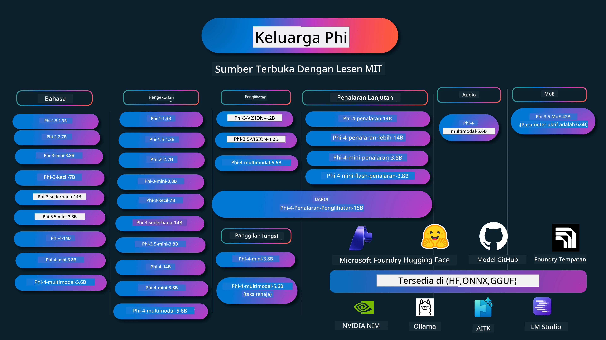

# Phi Cookbook: Contoh Amali dengan Model Phi Microsoft

[](https://codespaces.new/microsoft/phicookbook)
[](https://vscode.dev/redirect?url=vscode://ms-vscode-remote.remote-containers/cloneInVolume?url=https://github.com/microsoft/phicookbook)

[](https://GitHub.com/microsoft/phicookbook/graphs/contributors/?WT.mc_id=aiml-137032-kinfeylo)
[](https://GitHub.com/microsoft/phicookbook/issues/?WT.mc_id=aiml-137032-kinfeylo)
[](https://GitHub.com/microsoft/phicookbook/pulls/?WT.mc_id=aiml-137032-kinfeylo)
[](http://makeapullrequest.com?WT.mc_id=aiml-137032-kinfeylo)

[](https://GitHub.com/microsoft/phicookbook/watchers/?WT.mc_id=aiml-137032-kinfeylo)
[](https://GitHub.com/microsoft/phicookbook/network/?WT.mc_id=aiml-137032-kinfeylo)
[](https://GitHub.com/microsoft/phicookbook/stargazers/?WT.mc_id=aiml-137032-kinfeylo)

[](https://discord.com/invite/ByRwuEEgH4)

Phi ialah satu siri model AI sumber terbuka yang dibangunkan oleh Microsoft.

Phi pada masa ini adalah model bahasa kecil (SLM) yang paling berkuasa dan kos efektif, dengan penanda aras yang sangat baik dalam pelbagai bahasa, penalaran, penjanaan teks/ sembang, pengkodan, imej, audio dan senario lain.

Anda boleh menggunakan Phi di awan atau di peranti tepi, dan anda boleh dengan mudah membina aplikasi AI generatif dengan kuasa pengkomputeran yang terhad.

Ikuti langkah ini untuk memulakan penggunaan sumber ini:
1. **Fork Repositori**: Klik [](https://GitHub.com/microsoft/phicookbook/network/?WT.mc_id=aiml-137032-kinfeylo)
2. **Clone Repositori**: `git clone https://github.com/microsoft/PhiCookBook.git`
3. [**Sertai Komuniti Discord Microsoft AI dan berjumpa pakar serta pembangun lain**](https://discord.com/invite/ByRwuEEgH4?WT.mc_id=aiml-137032-kinfeylo)



### 🌐 Sokongan Pelbagai Bahasa

#### Disokong melalui GitHub Action (Automatik & Sentiasa Dikemaskini)

<!-- CO-OP TRANSLATOR LANGUAGES TABLE START -->
[Arabic](../ar/README.md) | [Bengali](../bn/README.md) | [Bulgarian](../bg/README.md) | [Burmese (Myanmar)](../my/README.md) | [Chinese (Simplified)](../zh-CN/README.md) | [Chinese (Traditional, Hong Kong)](../zh-HK/README.md) | [Chinese (Traditional, Macau)](../zh-MO/README.md) | [Chinese (Traditional, Taiwan)](../zh-TW/README.md) | [Croatian](../hr/README.md) | [Czech](../cs/README.md) | [Danish](../da/README.md) | [Dutch](../nl/README.md) | [Estonian](../et/README.md) | [Finnish](../fi/README.md) | [French](../fr/README.md) | [German](../de/README.md) | [Greek](../el/README.md) | [Hebrew](../he/README.md) | [Hindi](../hi/README.md) | [Hungarian](../hu/README.md) | [Indonesian](../id/README.md) | [Italian](../it/README.md) | [Japanese](../ja/README.md) | [Kannada](../kn/README.md) | [Khmer](../km/README.md) | [Korean](../ko/README.md) | [Lithuanian](../lt/README.md) | [Malay](./README.md) | [Malayalam](../ml/README.md) | [Marathi](../mr/README.md) | [Nepali](../ne/README.md) | [Nigerian Pidgin](../pcm/README.md) | [Norwegian](../no/README.md) | [Persian (Farsi)](../fa/README.md) | [Polish](../pl/README.md) | [Portuguese (Brazil)](../pt-BR/README.md) | [Portuguese (Portugal)](../pt-PT/README.md) | [Punjabi (Gurmukhi)](../pa/README.md) | [Romanian](../ro/README.md) | [Russian](../ru/README.md) | [Serbian (Cyrillic)](../sr/README.md) | [Slovak](../sk/README.md) | [Slovenian](../sl/README.md) | [Spanish](../es/README.md) | [Swahili](../sw/README.md) | [Swedish](../sv/README.md) | [Tagalog (Filipino)](../tl/README.md) | [Tamil](../ta/README.md) | [Telugu](../te/README.md) | [Thai](../th/README.md) | [Turkish](../tr/README.md) | [Ukrainian](../uk/README.md) | [Urdu](../ur/README.md) | [Vietnamese](../vi/README.md)

> **Lebih suka Clone Secara Tempatan?**
>
> Repositori ini merangkumi lebih 50 terjemahan bahasa yang secara signifikan meningkatkan saiz muat turun. Untuk clone tanpa terjemahan, gunakan sparse checkout:
>
> **Bash / macOS / Linux:**
> ```bash
> git clone --filter=blob:none --sparse https://github.com/microsoft/PhiCookBook.git
> cd PhiCookBook
> git sparse-checkout set --no-cone '/*' '!translations' '!translated_images'
> ```
>
> **CMD (Windows):**
> ```cmd
> git clone --filter=blob:none --sparse https://github.com/microsoft/PhiCookBook.git
> cd PhiCookBook
> git sparse-checkout set --no-cone "/*" "!translations" "!translated_images"
> ```
>
> Ini memberikan anda semua yang anda perlukan untuk menyelesaikan kursus dengan muat turun yang jauh lebih pantas.
<!-- CO-OP TRANSLATOR LANGUAGES TABLE END -->

## Jadual Kandungan

- Pengenalan
  - [Selamat datang ke Keluarga Phi](./md/01.Introduction/01/01.PhiFamily.md)
  - [Menyiapkan persekitaran anda](./md/01.Introduction/01/01.EnvironmentSetup.md)
  - [Memahami Teknologi Utama](./md/01.Introduction/01/01.Understandingtech.md)
  - [Keselamatan AI untuk Model Phi](./md/01.Introduction/01/01.AISafety.md)
  - [Sokongan Perkakasan Phi](./md/01.Introduction/01/01.Hardwaresupport.md)
  - [Model Phi & Ketersediaan merentasi platform](./md/01.Introduction/01/01.Edgeandcloud.md)
  - [Menggunakan Guidance-ai dan Phi](./md/01.Introduction/01/01.Guidance.md)
  - [Model Marketplace GitHub](https://github.com/marketplace/models)
  - [Katalog Model AI Azure](https://ai.azure.com)

- Inferens Phi dalam persekitaran berbeza
    -  [Hugging face](./md/01.Introduction/02/01.HF.md)
    -  [Model GitHub](./md/01.Introduction/02/02.GitHubModel.md)
    -  [Katalog Model Microsoft Foundry](./md/01.Introduction/02/03.AzureAIFoundry.md)
    -  [Ollama](./md/01.Introduction/02/04.Ollama.md)
    -  [AI Toolkit VSCode (AITK)](./md/01.Introduction/02/05.AITK.md)
    -  [NVIDIA NIM](./md/01.Introduction/02/06.NVIDIA.md)
    -  [Foundry Lokal](./md/01.Introduction/02/07.FoundryLocal.md)

- Inferens Keluarga Phi
    - [Inferens Phi dalam iOS](./md/01.Introduction/03/iOS_Inference.md)
    - [Inferens Phi dalam Android](./md/01.Introduction/03/Android_Inference.md)
    - [Inferens Phi dalam Jetson](./md/01.Introduction/03/Jetson_Inference.md)
    - [Inferens Phi dalam PC AI](./md/01.Introduction/03/AIPC_Inference.md)
    - [Inferens Phi dengan Rangka Kerja Apple MLX](./md/01.Introduction/03/MLX_Inference.md)
    - [Inferens Phi dalam Server Tempatan](./md/01.Introduction/03/Local_Server_Inference.md)
    - [Inferens Phi dalam Server Jauh menggunakan AI Toolkit](./md/01.Introduction/03/Remote_Interence.md)
    - [Inferens Phi dengan Rust](./md/01.Introduction/03/Rust_Inference.md)
    - [Inferens Phi--Vision secara Tempatan](./md/01.Introduction/03/Vision_Inference.md)
    - [Inferens Phi dengan Kaito AKS, Kontena Azure (sokongan rasmi)](./md/01.Introduction/03/Kaito_Inference.md)
-  [Pengukuran Keluarga Phi](./md/01.Introduction/04/QuantifyingPhi.md)
    - [Pengukuran Phi-3.5 / 4 menggunakan llama.cpp](./md/01.Introduction/04/UsingLlamacppQuantifyingPhi.md)
    - [Pengukuran Phi-3.5 / 4 menggunakan Sambungan AI Generatif untuk onnxruntime](./md/01.Introduction/04/UsingORTGenAIQuantifyingPhi.md)
    - [Pengukuran Phi-3.5 / 4 menggunakan Intel OpenVINO](./md/01.Introduction/04/UsingIntelOpenVINOQuantifyingPhi.md)
    - [Pengukuran Phi-3.5 / 4 menggunakan Rangka Kerja Apple MLX](./md/01.Introduction/04/UsingAppleMLXQuantifyingPhi.md)

-  Penilaian Phi
    - [AI Bertanggungjawab](./md/01.Introduction/05/ResponsibleAI.md)
    - [Microsoft Foundry untuk Penilaian](./md/01.Introduction/05/AIFoundry.md)
    - [Menggunakan Promptflow untuk Penilaian](./md/01.Introduction/05/Promptflow.md)
 
- RAG dengan Azure AI Search
    - [Cara menggunakan Phi-4-mini dan Phi-4-multimodal (RAG) dengan Azure AI Search](https://github.com/microsoft/PhiCookBook/blob/main/code/06.E2E/E2E_Phi-4-RAG-Azure-AI-Search.ipynb)
    - [Hibrid Tempatan Zero-Awan RAG dengan SQLite FTS5 dan phi-4-mini](https://github.com/microsoft/PhiCookBook/blob/main/code/06.E2E/E2E_Phi-4-mini_Local_Hybrid_RAG_SQLite_FTS5.ipynb)

- Contoh pembangunan aplikasi Phi
  - Aplikasi Teks & Sembang
    - Contoh Phi-4 
      - [📓] [Sembang Dengan Model Phi-4-mini ONNX](./md/02.Application/01.TextAndChat/Phi4/ChatWithPhi4ONNX/README.md)
      - [Sembang dengan Model Phi-4 ONNX tempatan .NET](../../md/04.HOL/dotnet/src/LabsPhi4-Chat-01OnnxRuntime)
      - [Aplikasi Konsol Sembang .NET dengan Phi-4 ONNX menggunakan Sementic Kernel](../../md/04.HOL/dotnet/src/LabsPhi4-Chat-02SK)

    - Phi-3 / 3.5 Contoh
      - [Chatbot Tempatan dalam pelayar menggunakan Phi3, ONNX Runtime Web dan WebGPU](https://github.com/microsoft/onnxruntime-inference-examples/tree/main/js/chat)
      - [OpenVino Chat](./md/02.Application/01.TextAndChat/Phi3/E2E_OpenVino_Chat.md)
      - [Model Pelbagai - Phi-3-mini Interaktif dan OpenAI Whisper](./md/02.Application/01.TextAndChat/Phi3/E2E_Phi-3-mini_with_whisper.md)
      - [MLFlow - Membina pembalut dan menggunakan Phi-3 dengan MLFlow](./md//02.Application/01.TextAndChat/Phi3/E2E_Phi-3-MLflow.md)
      - [Pengoptimuman Model - Cara mengoptimumkan model Phi-3-min untuk ONNX Runtime Web dengan Olive](https://github.com/microsoft/Olive/tree/main/examples/phi3)
      - [Aplikasi WinUI3 dengan Phi-3 mini-4k-instruct-onnx](https://github.com/microsoft/Phi3-Chat-WinUI3-Sample/)
      -[Contoh Aplikasi Nota Diperkasa AI Model Pelbagai WinUI3](https://github.com/microsoft/ai-powered-notes-winui3-sample)
      - [Laraskan halus dan Integrasi model Phi-3 tersuai dengan Prompt flow](./md/02.Application/01.TextAndChat/Phi3/E2E_Phi-3-FineTuning_PromptFlow_Integration.md)
      - [Laraskan halus dan Integrasi model Phi-3 tersuai dengan Prompt flow dalam Microsoft Foundry](./md/02.Application/01.TextAndChat/Phi3/E2E_Phi-3-FineTuning_PromptFlow_Integration_AIFoundry.md)
      - [Nilai Model Phi-3 / Phi-3.5 yang Dilaras Halus dalam Microsoft Foundry dengan Fokus pada Prinsip AI Bertanggungjawab Microsoft](./md/02.Application/01.TextAndChat/Phi3/E2E_Phi-3-Evaluation_AIFoundry.md)
      - [📓] [Contoh ramalan bahasa Phi-3.5-mini-instruct (Cina/Inggeris)](./md/02.Application/01.TextAndChat/Phi3/phi3-instruct-demo.ipynb)
      - [Phi-3.5-Instruct WebGPU RAG Chatbot](./md/02.Application/01.TextAndChat/Phi3/WebGPUWithPhi35Readme.md)
      - [Menggunakan Windows GPU untuk mencipta penyelesaian Prompt flow dengan Phi-3.5-Instruct ONNX](./md/02.Application/01.TextAndChat/Phi3/UsingPromptFlowWithONNX.md)
      - [Menggunakan Microsoft Phi-3.5 tflite untuk mencipta aplikasi Android](./md/02.Application/01.TextAndChat/Phi3/UsingPhi35TFLiteCreateAndroidApp.md)
      - [Contoh Q&A .NET menggunakan model ONNX Phi-3 tempatan menggunakan Microsoft.ML.OnnxRuntime](../../md/04.HOL/dotnet/src/LabsPhi301)
      - [Aplikasi sembang konsol .NET dengan Semantic Kernel dan Phi-3](../../md/04.HOL/dotnet/src/LabsPhi302)

  - Contoh Berasaskan Kod Azure AI Inference SDK
    - Contoh Phi-4
      - [📓] [Jana kod projek menggunakan Phi-4-multimodal](./md/02.Application/02.Code/Phi4/GenProjectCode/README.md)
    - Contoh Phi-3 / 3.5
      - [Bina GitHub Copilot Chat Visual Studio Code anda sendiri dengan Microsoft Phi-3 Family](./md/02.Application/02.Code/Phi3/VSCodeExt/README.md)
      - [Cipta Ejen Copilot Sembang Visual Studio Code sendiri dengan Phi-3.5 oleh Model GitHub](/md/02.Application/02.Code/Phi3/CreateVSCodeChatAgentWithGitHubModels.md)

  - Contoh Penalaran Lanjutan
    - Contoh Phi-4
      - [📓] [Contoh Phi-4-mini-reasoning atau Phi-4-reasoning](./md/02.Application/03.AdvancedReasoning/Phi4/AdvancedResoningPhi4mini/README.md)
      - [📓] [Laraskan halus Phi-4-mini-reasoning dengan Microsoft Olive](./md/02.Application/03.AdvancedReasoning/Phi4/AdvancedResoningPhi4mini/olive_ft_phi_4_reasoning_with_medicaldata.ipynb)
      - [📓] [Laraskan halus Phi-4-mini-reasoning dengan Apple MLX](./md/02.Application/03.AdvancedReasoning/Phi4/AdvancedResoningPhi4mini/mlx_ft_phi_4_reasoning_with_medicaldata.ipynb)
      - [📓] [Phi-4-mini-reasoning dengan Model GitHub](./md/02.Application/02.Code/Phi4r/github_models_inference.ipynb)
      - [📓] [Phi-4-mini-reasoning dengan Model Microsoft Foundry](./md/02.Application/02.Code/Phi4r/azure_models_inference.ipynb)
  - Demo
      - [Demo Phi-4-mini dihoskan di Hugging Face Spaces](https://huggingface.co/spaces/microsoft/phi-4-mini?WT.mc_id=aiml-137032-kinfeylo)
      - [Demo Phi-4-multimodal dihoskan di Hugging Face Spaces](https://huggingface.co/spaces/microsoft/phi-4-multimodal?WT.mc_id=aiml-137032-kinfeylo)
  - Contoh Visi
    - Contoh Phi-4
      - [📓] [Gunakan Phi-4-multimodal untuk membaca imej dan jana kod](./md/02.Application/04.Vision/Phi4/CreateFrontend/README.md)
    - Contoh Phi-3 / 3.5
      -  [📓][Phi-3-vision-Teks imej ke teks](./md/02.Application/04.Vision/Phi3/E2E_Phi-3-vision-image-text-to-text-online-endpoint.ipynb)
      - [Phi-3-vision-ONNX](https://onnxruntime.ai/docs/genai/tutorials/phi3-v.html)
      - [📓][Phi-3-vision CLIP Embedding](./md/02.Application/04.Vision/Phi3/E2E_Phi-3-vision-image-text-to-text-online-endpoint.ipynb)
      - [DEMO: Kitar Semula Phi-3](https://github.com/jennifermarsman/PhiRecycling/)
      - [Phi-3-vision - Pembantu bahasa visual - dengan Phi3-Vision dan OpenVINO](https://docs.openvino.ai/nightly/notebooks/phi-3-vision-with-output.html)
      - [Phi-3 Vision Nvidia NIM](./md/02.Application/04.Vision/Phi3/E2E_Nvidia_NIM_Vision.md)
      - [Phi-3 Vision OpenVino](./md/02.Application/04.Vision/Phi3/E2E_OpenVino_Phi3Vision.md)
      - [📓][Phi-3.5 Vision contoh multi-frame atau multi-imej](./md/02.Application/04.Vision/Phi3/phi3-vision-demo.ipynb)
      - [Model ONNX Tempatan Phi-3 Vision menggunakan Microsoft.ML.OnnxRuntime .NET](../../md/04.HOL/dotnet/src/LabsPhi303)
      - [Model ONNX Tempatan Phi-3 Vision berasaskan Menu menggunakan Microsoft.ML.OnnxRuntime .NET](../../md/04.HOL/dotnet/src/LabsPhi304)

  - Contoh Penalaran-Visi
    - Phi-4-Reasoning-Vision-15B
      - [📓] [Menggunakan Phi-4-Reasoning-Vision-15B untuk mengesan jaywalking](./md/02.Application/10.ReasoningVision/Phi_4_reasoning_vision_15b_Jaywalking.ipynb)
      - [📓] [Menggunakan Phi-4-Reasoning-Vision-15B untuk matematik](./md/02.Application/10.ReasoningVision/Phi_4_reasoning_vision_15b_Math.ipynb)
      - [📓] [Menggunakan Phi-4-Reasoning-Vision-15B untuk mengesan UI](./md/02.Application/10.ReasoningVision/Phi_4_reasoning_vision_15b_ui.ipynb)

  - Contoh Matematik
    - Contoh Phi-4-Mini-Flash-Reasoning-Instruct  [Demo Matematik dengan Phi-4-Mini-Flash-Reasoning-Instruct](./md/02.Application/09.Math/MathDemo.ipynb)

  - Contoh Audio
    - Contoh Phi-4
      - [📓] [Mengekstrak transkrip audio menggunakan Phi-4-multimodal](./md/02.Application/05.Audio/Phi4/Transciption/README.md)
      - [📓] [Contoh Audio Phi-4-multimodal](./md/02.Application/05.Audio/Phi4/Siri/demo.ipynb)
      - [📓] [Contoh Terjemahan Ucapan Phi-4-multimodal](./md/02.Application/05.Audio/Phi4/Translate/demo.ipynb)
      - [Aplikasi konsol .NET menggunakan Audio Phi-4-multimodal untuk menganalisis fail audio dan menjana transkrip](../../md/04.HOL/dotnet/src/LabsPhi4-MultiModal-02Audio)

  - Contoh MOE
    - Contoh Phi-3 / 3.5
      - [📓] [Model Campuran Pakar Phi-3.5 (MoEs) Contoh Media Sosial](./md/02.Application/06.MoE/Phi3/phi3_moe_demo.ipynb)
      - [📓] [Membina Saluran Retrieval-Augmented Generation (RAG) dengan NVIDIA NIM Phi-3 MOE, Azure AI Search, dan LlamaIndex](./md/02.Application/06.MoE/Phi3/azure-ai-search-nvidia-rag.ipynb)
      - 
  - Contoh Panggilan Fungsi
    - Contoh Phi-4 🆕
      -  [📓] [Menggunakan Panggilan Fungsi Dengan Phi-4-mini](./md/02.Application/07.FunctionCalling/Phi4/FunctionCallingBasic/README.md)
      -  [📓] [Menggunakan Panggilan Fungsi untuk mencipta pelbagai ejen Dengan Phi-4-mini](./md/02.Application/07.FunctionCalling/Phi4/Multiagents/Phi_4_mini_multiagent.ipynb)
      -  [📓] [Menggunakan Panggilan Fungsi dengan Ollama](./md/02.Application/07.FunctionCalling/Phi4/Ollama/ollama_functioncalling.ipynb)
      -  [📓] [Menggunakan Panggilan Fungsi dengan ONNX](./md/02.Application/07.FunctionCalling/Phi4/ONNX/onnx_parallel_functioncalling.ipynb)
  - Contoh Campuran Multimodal
    - Contoh Phi-4 🆕
      -  [📓] [Menggunakan Phi-4-multimodal sebagai wartawan Teknologi](./md/02.Application/08.Multimodel/Phi4/TechJournalist/phi_4_mm_audio_text_publish_news.ipynb)
      - [Aplikasi konsol .NET menggunakan Phi-4-multimodal untuk menganalisis imej](../../md/04.HOL/dotnet/src/LabsPhi4-MultiModal-01Images)

- Laraskan Halus Sampel Phi
  - [Senario Laraskan Halus](./md/03.FineTuning/FineTuning_Scenarios.md)
  - [Laraskan Halus vs RAG](./md/03.FineTuning/FineTuning_vs_RAG.md)
  - [Laraskan Halus Biarkan Phi-3 menjadi pakar industri](./md/03.FineTuning/LetPhi3gotoIndustriy.md)
  - [Laraskan Halus Phi-3 dengan AI Toolkit untuk VS Code](./md/03.FineTuning/Finetuning_VSCodeaitoolkit.md)
  - [Laraskan Halus Phi-3 dengan Perkhidmatan Pembelajaran Mesin Azure](./md/03.FineTuning/Introduce_AzureML.md)
  - [Laraskan Halus Phi-3 dengan Lora](./md/03.FineTuning/FineTuning_Lora.md)
  - [Laraskan Halus Phi-3 dengan QLora](./md/03.FineTuning/FineTuning_Qlora.md)
  - [Laraskan Halus Phi-3 dengan Microsoft Foundry](./md/03.FineTuning/FineTuning_AIFoundry.md)
  - [Laraskan Halus Phi-3 dengan Azure ML CLI/SDK](./md/03.FineTuning/FineTuning_MLSDK.md)
  - [Laraskan Halus dengan Microsoft Olive](./md/03.FineTuning/FineTuning_MicrosoftOlive.md)
  - [Laraskan Halus dengan Makmal Praktikal Microsoft Olive](./md/03.FineTuning/olive-lab/readme.md)
  - [Laraskan Halus Phi-3-vision dengan Weights and Bias](./md/03.FineTuning/FineTuning_Phi-3-visionWandB.md)

  - [Penalaan Halus Phi-3 dengan Rangka Kerja Apple MLX](./md/03.FineTuning/FineTuning_MLX.md)
  - [Penalaan Halus Phi-3-vision (sokongan rasmi)](./md/03.FineTuning/FineTuning_Vision.md)
  - [Penalaan Halus Phi-3 dengan Kaito AKS , Kontena Azure (Sokongan Rasmi)](./md/03.FineTuning/FineTuning_Kaito.md)
  - [Penalaan Halus Phi-3 dan Vision 3.5](https://github.com/2U1/Phi3-Vision-Finetune)

- Makmal Praktikal
  - [Meneroka model terkini: LLM, SLM, pembangunan tempatan dan banyak lagi](https://github.com/microsoft/aitour-exploring-cutting-edge-models)
  - [Membuka Potensi NLP: Penalaan Halus dengan Microsoft Olive](https://github.com/azure/Ignite_FineTuning_workshop)

- Kertas Penyelidikan Akademik dan Penerbitan
  - [Buku Teks Adalah Semua Yang Anda Perlu II: laporan teknikal phi-1.5](https://arxiv.org/abs/2309.05463)
  - [Laporan Teknikal Phi-3: Model Bahasa Berkemampuan Tinggi Secara Tempatan di Telefon Anda](https://arxiv.org/abs/2404.14219)
  - [Laporan Teknikal Phi-4](https://arxiv.org/abs/2412.08905)
  - [Laporan Teknikal Phi-4-Mini: Model Bahasa Multimodal Kompak tetapi Berkuasa melalui Campuran LoRA](https://arxiv.org/abs/2503.01743)
  - [Mengoptimumkan Model Bahasa Kecil untuk Panggilan Fungsi Dalam Kenderaan](https://arxiv.org/abs/2501.02342)
  - [(WhyPHI) Penalaan Halus PHI-3 untuk Penjawaban Soalan Pilihan Berganda: Metodologi, Keputusan, dan Cabaran](https://arxiv.org/abs/2501.01588)
  - [Laporan Teknikal Rasional Phi-4](https://www.microsoft.com/en-us/research/wp-content/uploads/2025/04/phi_4_reasoning.pdf)
  - [Laporan Teknikal Rasional Mini Phi-4](https://huggingface.co/microsoft/Phi-4-mini-reasoning/blob/main/Phi-4-Mini-Reasoning.pdf)

## Menggunakan Model Phi

### Phi di Microsoft Foundry

Anda boleh mempelajari cara menggunakan Microsoft Phi dan membina penyelesaian E2E pada pelbagai peranti perkakasan anda. Untuk mengalami Phi sendiri, mulakan dengan bermain dengan model dan menyesuaikan Phi untuk senario anda menggunakan [Katalog Model AI Microsoft Foundry Azure](https://aka.ms/phi3-azure-ai) anda boleh belajar lebih lanjut di Memulakan dengan [Microsoft Foundry](/md/02.QuickStart/AzureAIFoundry_QuickStart.md)

**Tempat Bermain**
Setiap model mempunyai tempat bermain khusus untuk menguji model [Azure AI Playground](https://aka.ms/try-phi3).

### Phi di Model GitHub

Anda boleh mempelajari cara menggunakan Microsoft Phi dan membina penyelesaian E2E pada pelbagai peranti perkakasan anda. Untuk mengalami Phi sendiri, mulakan dengan bermain dengan model dan menyesuaikan Phi untuk senario anda menggunakan [Katalog Model GitHub](https://github.com/marketplace/models?WT.mc_id=aiml-137032-kinfeylo) anda boleh belajar lebih lanjut di Memulakan dengan [Katalog Model GitHub](/md/02.QuickStart/GitHubModel_QuickStart.md)

**Tempat Bermain**
Setiap model mempunyai tempat bermain khusus untuk menguji model [playground](/md/02.QuickStart/GitHubModel_QuickStart.md).

### Phi di Hugging Face

Anda juga boleh mencari model di [Hugging Face](https://huggingface.co/microsoft)

**Tempat Bermain**
 [Tempat bermain Hugging Chat](https://huggingface.co/chat/models/microsoft/Phi-3-mini-4k-instruct)

 ## 🎒 Kursus Lain

Pasukan kami menghasilkan kursus lain! Semak:

<!-- CO-OP TRANSLATOR OTHER COURSES START -->
### LangChain
[](https://aka.ms/langchain4j-for-beginners)
[](https://aka.ms/langchainjs-for-beginners?WT.mc_id=m365-94501-dwahlin)
[](https://github.com/microsoft/langchain-for-beginners?WT.mc_id=m365-94501-dwahlin)
---

### Azure / Edge / MCP / Agen
[](https://github.com/microsoft/AZD-for-beginners?WT.mc_id=academic-105485-koreyst)
[](https://github.com/microsoft/edgeai-for-beginners?WT.mc_id=academic-105485-koreyst)
[](https://github.com/microsoft/mcp-for-beginners?WT.mc_id=academic-105485-koreyst)
[](https://github.com/microsoft/ai-agents-for-beginners?WT.mc_id=academic-105485-koreyst)

---
 
### Siri AI Generatif
[](https://github.com/microsoft/generative-ai-for-beginners?WT.mc_id=academic-105485-koreyst)
[-9333EA?style=for-the-badge&labelColor=E5E7EB&color=9333EA)](https://github.com/microsoft/Generative-AI-for-beginners-dotnet?WT.mc_id=academic-105485-koreyst)
[-C084FC?style=for-the-badge&labelColor=E5E7EB&color=C084FC)](https://github.com/microsoft/generative-ai-for-beginners-java?WT.mc_id=academic-105485-koreyst)
[-E879F9?style=for-the-badge&labelColor=E5E7EB&color=E879F9)](https://github.com/microsoft/generative-ai-with-javascript?WT.mc_id=academic-105485-koreyst)

---
 
### Pembelajaran Teras
[](https://aka.ms/ml-beginners?WT.mc_id=academic-105485-koreyst)
[](https://aka.ms/datascience-beginners?WT.mc_id=academic-105485-koreyst)
[](https://aka.ms/ai-beginners?WT.mc_id=academic-105485-koreyst)
[](https://github.com/microsoft/Security-101?WT.mc_id=academic-96948-sayoung)
[](https://aka.ms/webdev-beginners?WT.mc_id=academic-105485-koreyst)
[](https://aka.ms/iot-beginners?WT.mc_id=academic-105485-koreyst)
[](https://github.com/microsoft/xr-development-for-beginners?WT.mc_id=academic-105485-koreyst)

---
 
### Siri Copilot
[](https://aka.ms/GitHubCopilotAI?WT.mc_id=academic-105485-koreyst)
[](https://github.com/microsoft/mastering-github-copilot-for-dotnet-csharp-developers?WT.mc_id=academic-105485-koreyst)
[](https://github.com/microsoft/CopilotAdventures?WT.mc_id=academic-105485-koreyst)
<!-- CO-OP TRANSLATOR OTHER COURSES END -->

## AI Bertanggungjawab 

Microsoft komited untuk membantu pelanggan kami menggunakan produk AI kami secara bertanggungjawab, berkongsi pembelajaran kami, dan membina perkongsian berasaskan kepercayaan melalui alat seperti Nota Ketelusan dan Penilaian Impak. Banyak sumber ini boleh didapati di [https://aka.ms/RAI](https://aka.ms/RAI).
Pendekatan Microsoft terhadap AI bertanggungjawab adalah berasaskan prinsip AI kami iaitu keadilan, kebolehpercayaan dan keselamatan, privasi dan keselamatan, keterangkuman, ketelusan, dan akauntabiliti.

Model bahasa semula jadi, imej, dan ucapan skala besar - seperti yang digunakan dalam contoh ini - berpotensi untuk berkelakuan dengan cara yang tidak adil, tidak boleh dipercayai, atau menyinggung, yang boleh menyebabkan kemudaratan. Sila rujuk [Nota Ketelusan perkhidmatan Azure OpenAI](https://learn.microsoft.com/legal/cognitive-services/openai/transparency-note?tabs=text) untuk dimaklumkan mengenai risiko dan had.


Pendekatan yang disyorkan untuk mengurangkan risiko ini adalah dengan memasukkan sistem keselamatan dalam seni bina anda yang dapat mengesan dan menghalang tingkah laku berbahaya. [Azure AI Content Safety](https://learn.microsoft.com/azure/ai-services/content-safety/overview) menyediakan lapisan perlindungan bebas, mampu mengesan kandungan berbahaya yang dihasilkan oleh pengguna dan AI dalam aplikasi dan perkhidmatan. Azure AI Content Safety merangkumi API teks dan imej yang membolehkan anda mengesan bahan yang berbahaya. Dalam Microsoft Foundry, perkhidmatan Content Safety membolehkan anda melihat, meneroka dan mencuba contoh kod untuk mengesan kandungan berbahaya merentasi pelbagai modaliti. Dokumentasi [quickstart berikut](https://learn.microsoft.com/azure/ai-services/content-safety/quickstart-text?tabs=visual-studio%2Clinux&pivots=programming-language-rest) membimbing anda melalui permintaan kepada perkhidmatan.

Satu lagi aspek yang perlu diambil kira adalah prestasi keseluruhan aplikasi. Dengan aplikasi multi-modal dan multi-model, kami menganggap prestasi bermaksud sistem berfungsi seperti yang anda dan pengguna anda jangkakan, termasuk tidak menghasilkan output berbahaya. Adalah penting untuk menilai prestasi aplikasi keseluruhan anda menggunakan [Penilai Prestasi dan Kualiti serta Penilai Risiko dan Keselamatan](https://learn.microsoft.com/azure/ai-studio/concepts/evaluation-metrics-built-in). Anda juga mempunyai keupayaan untuk mencipta dan menilai dengan [penilai tersuai](https://learn.microsoft.com/azure/ai-studio/how-to/develop/evaluate-sdk#custom-evaluators).

Anda boleh menilai aplikasi AI anda dalam persekitaran pembangunan anda menggunakan [Azure AI Evaluation SDK](https://microsoft.github.io/promptflow/index.html). Dengan dataset ujian atau sasaran, generasi aplikasi AI generatif anda diukur secara kuantitatif dengan penilai terbina dalam atau penilai tersuai pilihan anda. Untuk memulakan dengan azure ai evaluation sdk untuk menilai sistem anda, anda boleh mengikuti [panduan permulaan cepat](https://learn.microsoft.com/azure/ai-studio/how-to/develop/flow-evaluate-sdk). Setelah anda menjalankan penilaian, anda boleh [memvisualisasikan keputusan dalam Microsoft Foundry](https://learn.microsoft.com/azure/ai-studio/how-to/evaluate-flow-results). 

## Cap Dagangan

Projek ini mungkin mengandungi cap dagangan atau logo untuk projek, produk, atau perkhidmatan. Penggunaan sah cap dagangan atau logo Microsoft tertakluk kepada dan mesti mengikuti [Garis Panduan Cap Dagangan & Jenama Microsoft](https://www.microsoft.com/legal/intellectualproperty/trademarks/usage/general).
Penggunaan cap dagangan atau logo Microsoft dalam versi projek yang diubah tidak boleh menyebabkan kekeliruan atau memberikan gambaran tajaan Microsoft. Sebarang penggunaan cap dagangan atau logo pihak ketiga tertakluk kepada polisi pihak ketiga tersebut.

## Mendapatkan Bantuan

Jika anda tersekat atau mempunyai sebarang soalan mengenai pembinaan aplikasi AI, sertai:

[](https://aka.ms/foundry/discord)

Jika anda mempunyai maklum balas produk atau ralat semasa membina lawati:

[](https://aka.ms/foundry/forum)

---

<!-- CO-OP TRANSLATOR DISCLAIMER START -->
**Penafian**:
Dokumen ini telah diterjemahkan menggunakan perkhidmatan terjemahan AI [Co-op Translator](https://github.com/Azure/co-op-translator). Walaupun kami berusaha untuk ketepatan, sila ambil maklum bahawa terjemahan automatik mungkin mengandungi kesilapan atau ketidaktepatan. Dokumen asal dalam bahasa asalnya harus dianggap sebagai sumber yang sahih. Untuk maklumat penting, terjemahan oleh manusia profesional adalah disyorkan. Kami tidak bertanggungjawab terhadap sebarang salah faham atau salah tafsir yang timbul daripada penggunaan terjemahan ini.
<!-- CO-OP TRANSLATOR DISCLAIMER END -->