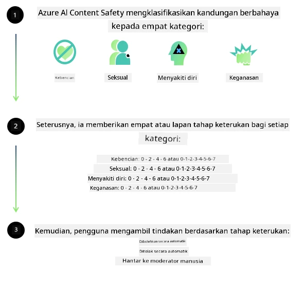
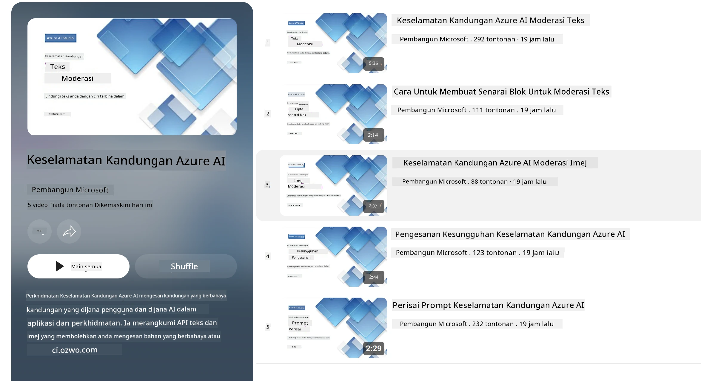

# Keselamatan AI untuk model Phi
Keluarga model Phi dibangunkan selaras dengan [Standard AI Bertanggungjawab Microsoft](https://www.microsoft.com/ai/principles-and-approach#responsible-ai-standard), yang merupakan satu set keperluan seluruh syarikat berdasarkan enam prinsip berikut: akauntabiliti, ketelusan, keadilan, kebolehpercayaan dan keselamatan, privasi dan keselamatan, serta inklusiviti yang membentuk [prinsip AI Bertanggungjawab Microsoft](https://www.microsoft.com/ai/responsible-ai). 

Seperti model Phi sebelumnya, pendekatan penilaian keselamatan pelbagai aspek dan keselamatan pasca-latihan telah diambil, dengan langkah tambahan diambil untuk mengambil kira kemampuan pelbagai bahasa bagi pelepasan ini. Pendekatan kami terhadap latihan keselamatan dan penilaian termasuk ujian merentasi pelbagai bahasa dan kategori risiko diterangkan dalam [Kertas Pasca-Latihan Keselamatan Phi](https://arxiv.org/abs/2407.13833). Walaupun model Phi mendapat manfaat daripada pendekatan ini, pembangun harus menggunakan amalan terbaik AI bertanggungjawab, termasuk pemetaan, pengukuran, dan mitigasi risiko yang berkaitan dengan kes penggunaan spesifik serta konteks budaya dan linguistik mereka.

## Amalan Terbaik

Seperti model lain, keluarga model Phi berpotensi berkelakuan dengan cara yang tidak adil, tidak boleh dipercayai, atau menyinggung.

Beberapa tingkah laku terhad SLM dan LLM yang anda perlu sedar termasuk:

- **Kualiti Perkhidmatan:** Model Phi dilatih terutamanya pada teks Bahasa Inggeris. Bahasa selain daripada Bahasa Inggeris akan mengalami prestasi yang lebih buruk. Variasi bahasa Inggeris dengan representasi lebih sedikit dalam data latihan mungkin mengalami prestasi yang lebih buruk berbanding Bahasa Inggeris Amerika standard.
- **Representasi Kemudaratan & Perpetuasi Stereotaip:** Model ini boleh mewakili kumpulan orang secara berlebihan atau kurang, menghapuskan representasi sesetengah kumpulan, atau mengukuhkan stereotaip yang merendahkan atau negatif. Walaupun terdapat keselamatan pasca-latihan, had ini mungkin masih wujud disebabkan tahap representasi yang berlainan bagi kumpulan yang berbeza atau kebanyakan contoh stereotaip negatif dalam data latihan yang mencerminkan corak dunia sebenar dan berat sebelah masyarakat.
- **Kandungan Tidak Sesuai atau Menyinggung:** Model ini mungkin menghasilkan jenis kandungan tidak sesuai atau menyinggung yang lain, yang mungkin menjadikannya tidak sesuai digunakan dalam konteks sensitif tanpa mitigasi tambahan yang khusus untuk kes penggunaan tersebut.
  Kebolehpercayaan Maklumat: Model bahasa boleh menjana kandungan yang tidak masuk akal atau mereka kandungan yang mungkin kedengaran munasabah tetapi tidak tepat atau sudah lapuk.
- **Skop Terhad untuk Kod:** Majoriti data latihan Phi-3 adalah berasaskan Python dan menggunakan pakej biasa seperti "typing, math, random, collections, datetime, itertools". Jika model menjana skrip Python yang menggunakan pakej lain atau skrip dalam bahasa lain, kami sangat mengesyorkan pengguna mengesahkan semua penggunaan API secara manual.

Pembangun harus menggunakan amalan terbaik AI bertanggungjawab dan bertanggungjawab memastikan bahawa kes penggunaan spesifik mematuhi undang-undang dan peraturan yang berkaitan (contohnya privasi, perdagangan, dan lain-lain). 

## Pertimbangan AI Bertanggungjawab

Seperti model bahasa lain, model siri Phi berpotensi berkelakuan dengan cara yang tidak adil, tidak boleh dipercayai, atau menyinggung. Beberapa tingkah laku terhad yang perlu diberi perhatian termasuk:

**Kualiti Perkhidmatan:** Model Phi dilatih terutamanya pada teks Bahasa Inggeris. Bahasa selain daripada Bahasa Inggeris akan mengalami prestasi yang lebih buruk. Variasi bahasa Inggeris dengan representasi lebih sedikit dalam data latihan mungkin mengalami prestasi yang lebih buruk berbanding Bahasa Inggeris Amerika standard.

**Representasi Kemudaratan & Perpetuasi Stereotaip:** Model ini boleh mewakili kumpulan orang secara berlebihan atau kurang, menghapuskan representasi sesetengah kumpulan, atau mengukuhkan stereotaip yang merendahkan atau negatif. Walaupun terdapat keselamatan pasca-latihan, had ini mungkin masih wujud disebabkan tahap representasi yang berlainan bagi kumpulan yang berbeza atau kebanyakan contoh stereotaip negatif dalam data latihan yang mencerminkan corak dunia sebenar dan berat sebelah masyarakat.

**Kandungan Tidak Sesuai atau Menyinggung:** Model ini mungkin menghasilkan jenis kandungan tidak sesuai atau menyinggung yang lain, yang mungkin menjadikannya tidak sesuai digunakan dalam konteks sensitif tanpa mitigasi tambahan yang khusus untuk kes penggunaan tersebut.
  Kebolehpercayaan Maklumat: Model bahasa boleh menjana kandungan yang tidak masuk akal atau mereka kandungan yang mungkin kedengaran munasabah tetapi tidak tepat atau sudah lapuk.

**Skop Terhad untuk Kod:** Majoriti data latihan Phi-3 adalah berasaskan Python dan menggunakan pakej biasa seperti "typing, math, random, collections, datetime, itertools". Jika model menjana skrip Python yang menggunakan pakej lain atau skrip dalam bahasa lain, kami sangat mengesyorkan pengguna mengesahkan semua penggunaan API secara manual.

Pembangun harus menggunakan amalan terbaik AI bertanggungjawab dan bertanggungjawab memastikan bahawa kes penggunaan spesifik mematuhi undang-undang dan peraturan yang berkaitan (contohnya privasi, perdagangan, dan lain-lain). Kawasan penting untuk pertimbangan termasuk:

**Peruntukan:** Model mungkin tidak sesuai untuk senario yang boleh memberi kesan besar terhadap status undang-undang atau peruntukan sumber atau peluang hidup (contoh: perumahan, pekerjaan, kredit, dan lain-lain) tanpa penilaian lanjut dan teknik pembetulan bias tambahan.

**Senario Berisiko Tinggi:** Pembangun harus menilai kesesuaian penggunaan model dalam senario berisiko tinggi di mana output yang tidak adil, tidak boleh dipercayai, atau menyinggung mungkin sangat mahal atau menyebabkan kemudaratan. Ini termasuk memberikan nasihat dalam bidang sensitif atau pakar di mana ketepatan dan kebolehpercayaan adalah kritikal (contoh: nasihat undang-undang atau kesihatan). Langkah keselamatan tambahan harus dilaksanakan di peringkat aplikasi mengikut konteks pelaksanaan.

**Maklumat Salah:** Model mungkin menghasilkan maklumat yang tidak tepat. Pembangun harus mengikuti amalan ketelusan terbaik dan memaklumkan pengguna akhir bahawa mereka berinteraksi dengan sistem AI. Di peringkat aplikasi, pembangun boleh membina mekanisme maklum balas dan saluran untuk mengasaskan respons berdasarkan maklumat kontekstual spesifik kes penggunaan, suatu teknik yang dikenali sebagai Penghasilan dengan Pencarian Tambahan (RAG).

**Penjanaan Kandungan Berbahaya:** Pembangun harus menilai output mengikut konteksnya dan menggunakan pengklasifikasi keselamatan yang tersedia atau penyelesaian khusus yang sesuai untuk kes penggunaan mereka.

**Penyalahgunaan:** Bentuk penyalahgunaan lain seperti penipuan, spam, atau penghasilan perisian hasad mungkin berlaku, dan pembangun harus memastikan aplikasi mereka tidak melanggar undang-undang dan peraturan yang berkuat kuasa.

### Penalaan Halus dan Keselamatan Kandungan AI

Selepas melaksanakan penalaan halus pada model, kami sangat mengesyorkan menggunakan langkah-langkah [Azure AI Content Safety](https://learn.microsoft.com/azure/ai-services/content-safety/overview) untuk memantau kandungan yang dijana oleh model, mengenal pasti dan menyekat risiko, ancaman, dan isu kualiti yang berpotensi.

[Azure AI Content Safety](https://learn.microsoft.com/azure/ai-services/content-safety/overview) menyokong kandungan teks dan imej. Ia boleh digunakan di awan, bekas terputus sambungan, dan pada peranti tepi/terbenam.

## Gambaran Keseluruhan Azure AI Content Safety

Azure AI Content Safety bukanlah satu penyelesaian satu-saiz-untuk-semua; ia boleh disesuaikan untuk sejajar dengan dasar khusus perniagaan. Selain itu, model pelbagai bahasa membolehkannya memahami pelbagai bahasa serentak.

- **Azure AI Content Safety**
- **Microsoft Developer**
- **5 video**

Perkhidmatan Azure AI Content Safety mengesan kandungan berbahaya yang dihasilkan pengguna dan AI dalam aplikasi dan perkhidmatan. Ia termasuk API teks dan imej yang membolehkan anda mengesan bahan yang berbahaya atau tidak sesuai.

[Senarai Main AI Content Safety](https://www.youtube.com/playlist?list=PLlrxD0HtieHjaQ9bJjyp1T7FeCbmVcPkQ)

---

<!-- CO-OP TRANSLATOR DISCLAIMER START -->
**Penafian**:  
Dokumen ini telah diterjemahkan menggunakan perkhidmatan terjemahan AI [Co-op Translator](https://github.com/Azure/co-op-translator). Walaupun kami berusaha untuk ketepatan, harap maklum bahawa terjemahan automatik mungkin mengandungi kesilapan atau ketidaktepatan. Dokumen asal dalam bahasa asalnya harus dianggap sebagai sumber yang sahih. Untuk maklumat penting, terjemahan manusia profesional adalah disyorkan. Kami tidak bertanggungjawab terhadap sebarang salah faham atau salah tafsir yang timbul daripada penggunaan terjemahan ini.
<!-- CO-OP TRANSLATOR DISCLAIMER END -->