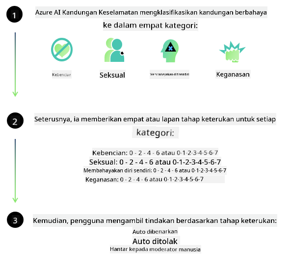

<!--
CO_OP_TRANSLATOR_METADATA:
{
  "original_hash": "c8273672cc57df2be675407a1383aaf0",
  "translation_date": "2025-07-16T17:51:10+00:00",
  "source_file": "md/01.Introduction/01/01.AISafety.md",
  "language_code": "ms"
}
-->
# Keselamatan AI untuk model Phi  
Keluarga model Phi dibangunkan selaras dengan [Microsoft Responsible AI Standard](https://query.prod.cms.rt.microsoft.com/cms/api/am/binary/RE5cmFl), iaitu satu set keperluan syarikat yang berasaskan enam prinsip berikut: akauntabiliti, ketelusan, keadilan, kebolehpercayaan dan keselamatan, privasi dan keselamatan, serta keterangkuman yang membentuk [prinsip AI Bertanggungjawab Microsoft](https://www.microsoft.com/ai/responsible-ai).

Seperti model Phi sebelum ini, pendekatan penilaian keselamatan berbilang aspek dan keselamatan selepas latihan telah digunakan, dengan langkah tambahan diambil untuk mengambil kira keupayaan pelbagai bahasa dalam keluaran ini. Pendekatan kami terhadap latihan keselamatan dan penilaian termasuk ujian merentas pelbagai bahasa dan kategori risiko diterangkan dalam [Phi Safety Post-Training Paper](https://arxiv.org/abs/2407.13833). Walaupun model Phi mendapat manfaat daripada pendekatan ini, pembangun harus mengamalkan amalan AI bertanggungjawab yang terbaik, termasuk memetakan, mengukur, dan mengurangkan risiko yang berkaitan dengan kes penggunaan serta konteks budaya dan bahasa mereka.

## Amalan Terbaik

Seperti model lain, keluarga model Phi berpotensi berkelakuan dengan cara yang tidak adil, tidak boleh dipercayai, atau menyinggung perasaan.

Beberapa tingkah laku terhad SLM dan LLM yang perlu anda sedari termasuk:

- **Kualiti Perkhidmatan:** Model Phi dilatih terutamanya menggunakan teks bahasa Inggeris. Bahasa selain Inggeris akan mengalami prestasi yang lebih rendah. Varian bahasa Inggeris yang kurang diwakili dalam data latihan mungkin mengalami prestasi yang lebih rendah berbanding bahasa Inggeris Amerika standard.  
- **Perwakilan Kemudaratan & Peneguhan Stereotaip:** Model ini boleh mewakili kumpulan orang secara berlebihan atau kurang, menghapuskan perwakilan sesetengah kumpulan, atau mengukuhkan stereotaip yang merendahkan atau negatif. Walaupun selepas latihan keselamatan, had ini mungkin masih wujud disebabkan tahap perwakilan yang berbeza bagi kumpulan yang berlainan atau kekerapan contoh stereotaip negatif dalam data latihan yang mencerminkan corak dunia sebenar dan bias masyarakat.  
- **Kandungan Tidak Sesuai atau Menyinggung:** Model ini mungkin menghasilkan jenis kandungan tidak sesuai atau menyinggung lain, yang mungkin menjadikannya tidak sesuai digunakan dalam konteks sensitif tanpa mitigasi tambahan yang khusus untuk kes penggunaan tersebut.  
- **Kebolehpercayaan Maklumat:** Model bahasa boleh menghasilkan kandungan yang tidak masuk akal atau mereka cipta kandungan yang mungkin kedengaran munasabah tetapi tidak tepat atau sudah lapuk.  
- **Skop Terhad untuk Kod:** Majoriti data latihan Phi-3 berasaskan Python dan menggunakan pakej biasa seperti "typing, math, random, collections, datetime, itertools". Jika model menghasilkan skrip Python yang menggunakan pakej lain atau skrip dalam bahasa lain, kami sangat mengesyorkan pengguna mengesahkan secara manual semua penggunaan API.

Pembangun harus mengamalkan amalan AI bertanggungjawab yang terbaik dan bertanggungjawab memastikan kes penggunaan tertentu mematuhi undang-undang dan peraturan yang berkaitan (contoh: privasi, perdagangan, dan lain-lain).

## Pertimbangan AI Bertanggungjawab

Seperti model bahasa lain, model siri Phi berpotensi berkelakuan dengan cara yang tidak adil, tidak boleh dipercayai, atau menyinggung perasaan. Beberapa tingkah laku terhad yang perlu diberi perhatian termasuk:

**Kualiti Perkhidmatan:** Model Phi dilatih terutamanya menggunakan teks bahasa Inggeris. Bahasa selain Inggeris akan mengalami prestasi yang lebih rendah. Varian bahasa Inggeris yang kurang diwakili dalam data latihan mungkin mengalami prestasi yang lebih rendah berbanding bahasa Inggeris Amerika standard.

**Perwakilan Kemudaratan & Peneguhan Stereotaip:** Model ini boleh mewakili kumpulan orang secara berlebihan atau kurang, menghapuskan perwakilan sesetengah kumpulan, atau mengukuhkan stereotaip yang merendahkan atau negatif. Walaupun selepas latihan keselamatan, had ini mungkin masih wujud disebabkan tahap perwakilan yang berbeza bagi kumpulan yang berlainan atau kekerapan contoh stereotaip negatif dalam data latihan yang mencerminkan corak dunia sebenar dan bias masyarakat.

**Kandungan Tidak Sesuai atau Menyinggung:** Model ini mungkin menghasilkan jenis kandungan tidak sesuai atau menyinggung lain, yang mungkin menjadikannya tidak sesuai digunakan dalam konteks sensitif tanpa mitigasi tambahan yang khusus untuk kes penggunaan tersebut.  
**Kebolehpercayaan Maklumat:** Model bahasa boleh menghasilkan kandungan yang tidak masuk akal atau mereka cipta kandungan yang mungkin kedengaran munasabah tetapi tidak tepat atau sudah lapuk.

**Skop Terhad untuk Kod:** Majoriti data latihan Phi-3 berasaskan Python dan menggunakan pakej biasa seperti "typing, math, random, collections, datetime, itertools". Jika model menghasilkan skrip Python yang menggunakan pakej lain atau skrip dalam bahasa lain, kami sangat mengesyorkan pengguna mengesahkan secara manual semua penggunaan API.

Pembangun harus mengamalkan amalan AI bertanggungjawab yang terbaik dan bertanggungjawab memastikan kes penggunaan tertentu mematuhi undang-undang dan peraturan yang berkaitan (contoh: privasi, perdagangan, dan lain-lain). Kawasan penting untuk dipertimbangkan termasuk:

**Peruntukan:** Model mungkin tidak sesuai untuk senario yang boleh memberi impak besar terhadap status undang-undang atau peruntukan sumber atau peluang hidup (contoh: perumahan, pekerjaan, kredit, dan lain-lain) tanpa penilaian lanjut dan teknik debiasing tambahan.

**Senario Berisiko Tinggi:** Pembangun harus menilai kesesuaian penggunaan model dalam senario berisiko tinggi di mana output yang tidak adil, tidak boleh dipercayai, atau menyinggung boleh menyebabkan kos yang sangat tinggi atau kemudaratan. Ini termasuk memberi nasihat dalam bidang sensitif atau pakar di mana ketepatan dan kebolehpercayaan adalah kritikal (contoh: nasihat undang-undang atau kesihatan). Langkah keselamatan tambahan harus dilaksanakan di peringkat aplikasi mengikut konteks penggunaan.

**Maklumat Salah:** Model mungkin menghasilkan maklumat yang tidak tepat. Pembangun harus mengamalkan amalan ketelusan terbaik dan memaklumkan pengguna akhir bahawa mereka berinteraksi dengan sistem AI. Di peringkat aplikasi, pembangun boleh membina mekanisme maklum balas dan saluran untuk mengukuhkan respons berdasarkan maklumat kontekstual khusus kes penggunaan, satu teknik yang dikenali sebagai Retrieval Augmented Generation (RAG).

**Penghasilan Kandungan Berbahaya:** Pembangun harus menilai output mengikut konteks dan menggunakan pengelasan keselamatan yang tersedia atau penyelesaian khusus yang sesuai untuk kes penggunaan mereka.

**Penyalahgunaan:** Bentuk penyalahgunaan lain seperti penipuan, spam, atau penghasilan perisian hasad mungkin berlaku, dan pembangun harus memastikan aplikasi mereka tidak melanggar undang-undang dan peraturan yang berkuat kuasa.

### Penalaan Halus dan Keselamatan Kandungan AI

Selepas menala halus model, kami sangat mengesyorkan menggunakan langkah [Azure AI Content Safety](https://learn.microsoft.com/azure/ai-services/content-safety/overview) untuk memantau kandungan yang dihasilkan oleh model, mengenal pasti dan menyekat risiko, ancaman, dan isu kualiti yang berpotensi.

[Azure AI Content Safety](https://learn.microsoft.com/azure/ai-services/content-safety/overview) menyokong kandungan teks dan imej. Ia boleh digunakan di awan, bekas terputus sambungan, dan pada peranti tepi/terbenam.

## Gambaran Keseluruhan Azure AI Content Safety

Azure AI Content Safety bukan penyelesaian satu saiz untuk semua; ia boleh disesuaikan mengikut polisi khusus perniagaan. Selain itu, model pelbagai bahasa membolehkannya memahami pelbagai bahasa serentak.

- **Azure AI Content Safety**  
- **Microsoft Developer**  
- **5 video**

Perkhidmatan Azure AI Content Safety mengesan kandungan berbahaya yang dihasilkan pengguna dan AI dalam aplikasi dan perkhidmatan. Ia merangkumi API teks dan imej yang membolehkan anda mengesan bahan yang berbahaya atau tidak sesuai.

[Senarai Main AI Content Safety](https://www.youtube.com/playlist?list=PLlrxD0HtieHjaQ9bJjyp1T7FeCbmVcPkQ)

**Penafian**:  
Dokumen ini telah diterjemahkan menggunakan perkhidmatan terjemahan AI [Co-op Translator](https://github.com/Azure/co-op-translator). Walaupun kami berusaha untuk ketepatan, sila ambil perhatian bahawa terjemahan automatik mungkin mengandungi kesilapan atau ketidaktepatan. Dokumen asal dalam bahasa asalnya harus dianggap sebagai sumber yang sahih. Untuk maklumat penting, terjemahan profesional oleh manusia adalah disyorkan. Kami tidak bertanggungjawab atas sebarang salah faham atau salah tafsir yang timbul daripada penggunaan terjemahan ini.