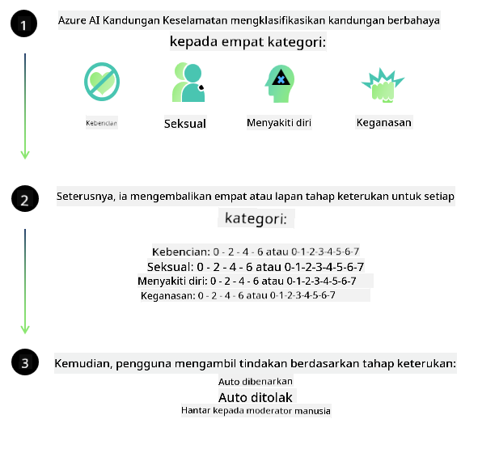

<!--
CO_OP_TRANSLATOR_METADATA:
{
  "original_hash": "c8273672cc57df2be675407a1383aaf0",
  "translation_date": "2025-05-09T06:12:57+00:00",
  "source_file": "md/01.Introduction/01/01.AISafety.md",
  "language_code": "ms"
}
-->
# أمان الذكاء الاصطناعي لنماذج Phi  
تم تطوير عائلة نماذج Phi وفقًا لـ [معيار الذكاء الاصطناعي المسؤول من Microsoft](https://query.prod.cms.rt.microsoft.com/cms/api/am/binary/RE5cmFl)، وهو مجموعة متطلبات على مستوى الشركة تستند إلى المبادئ الستة التالية: المساءلة، الشفافية، العدالة، الاعتمادية والسلامة، الخصوصية والأمان، والشمولية التي تشكل [مبادئ الذكاء الاصطناعي المسؤول من Microsoft](https://www.microsoft.com/ai/responsible-ai).

مثل نماذج Phi السابقة، تم اعتماد تقييم أمان متعدد الأوجه ونهج أمان بعد التدريب، مع اتخاذ تدابير إضافية لأخذ القدرات متعددة اللغات في هذا الإصدار في الاعتبار. يوضح نهجنا في تدريب الأمان والتقييمات، بما في ذلك الاختبار عبر لغات وفئات مخاطر متعددة، في [ورقة أمان Phi بعد التدريب](https://arxiv.org/abs/2407.13833). بينما تستفيد نماذج Phi من هذا النهج، يجب على المطورين تطبيق أفضل ممارسات الذكاء الاصطناعي المسؤول، بما في ذلك رسم خرائط المخاطر وقياسها والتخفيف منها المرتبطة بحالة الاستخدام والسياق الثقافي واللغوي الخاص بهم.

## أفضل الممارسات

مثل النماذج الأخرى، يمكن لعائلة نماذج Phi أن تتصرف بطرق قد تكون غير عادلة أو غير موثوقة أو مسيئة.

بعض السلوكيات المحدودة لنماذج SLM وLLM التي يجب أن تكون على دراية بها تشمل:

- **جودة الخدمة:** تم تدريب نماذج Phi أساسًا على نصوص باللغة الإنجليزية. ستشهد اللغات غير الإنجليزية أداءً أقل جودة، كما أن لهجات اللغة الإنجليزية التي تمثل أقل في بيانات التدريب قد تعاني من أداء أقل مقارنةً بالإنجليزية الأمريكية القياسية.  
- **تمثيل الأضرار واستمرار الصور النمطية:** يمكن لهذه النماذج أن تمثل مجموعات من الناس بشكل مفرط أو ناقص، أو تمحو تمثيل بعض المجموعات، أو تعزز الصور النمطية السلبية أو المهينة. على الرغم من التدريب الأمني بعد التدريب، قد تستمر هذه القيود بسبب مستويات التمثيل المختلفة للمجموعات المختلفة أو انتشار أمثلة الصور النمطية السلبية في بيانات التدريب التي تعكس أنماطًا واقعية وتحاملات مجتمعية.  
- **المحتوى غير المناسب أو المسيء:** قد تنتج هذه النماذج أنواعًا أخرى من المحتوى غير المناسب أو المسيء، مما قد يجعل من غير المناسب نشرها في سياقات حساسة دون تدابير إضافية خاصة بحالة الاستخدام.  
- **موثوقية المعلومات:** يمكن لنماذج اللغة أن تولد محتوى غير منطقي أو تختلق محتوى قد يبدو معقولًا لكنه غير دقيق أو قديم.  
- **نطاق محدود للبرمجة:** معظم بيانات تدريب Phi-3 تعتمد على Python وتستخدم حزمًا شائعة مثل "typing, math, random, collections, datetime, itertools". إذا قام النموذج بإنشاء سكريبتات Python تستخدم حزمًا أخرى أو سكريبتات بلغات أخرى، نوصي بشدة بأن يتحقق المستخدمون يدويًا من جميع استخدامات API.

يجب على المطورين تطبيق أفضل ممارسات الذكاء الاصطناعي المسؤول ويتحملون مسؤولية التأكد من أن حالة الاستخدام المحددة تتوافق مع القوانين واللوائح ذات الصلة (مثل الخصوصية، التجارة، إلخ).

## اعتبارات الذكاء الاصطناعي المسؤول

مثل النماذج اللغوية الأخرى، يمكن أن تتصرف نماذج سلسلة Phi بطرق قد تكون غير عادلة أو غير موثوقة أو مسيئة. بعض السلوكيات المحدودة التي يجب الانتباه إليها تشمل:

**جودة الخدمة:** تم تدريب نماذج Phi بشكل رئيسي على نصوص باللغة الإنجليزية. ستشهد اللغات غير الإنجليزية أداء أقل. لهجات اللغة الإنجليزية التي تمثل أقل في بيانات التدريب قد تعاني من أداء أقل مقارنةً بالإنجليزية الأمريكية القياسية.

**تمثيل الأضرار واستمرار الصور النمطية:** يمكن لهذه النماذج أن تمثل مجموعات من الناس بشكل مفرط أو ناقص، أو تمحو تمثيل بعض المجموعات، أو تعزز الصور النمطية السلبية أو المهينة. على الرغم من التدريب الأمني بعد التدريب، قد تستمر هذه القيود بسبب مستويات التمثيل المختلفة للمجموعات المختلفة أو انتشار أمثلة الصور النمطية السلبية في بيانات التدريب التي تعكس أنماطًا واقعية وتحاملات مجتمعية.

**المحتوى غير المناسب أو المسيء:** قد تنتج هذه النماذج أنواعًا أخرى من المحتوى غير المناسب أو المسيء، مما قد يجعل من غير المناسب نشرها في سياقات حساسة دون تدابير إضافية خاصة بحالة الاستخدام.  
- **موثوقية المعلومات:** يمكن لنماذج اللغة أن تولد محتوى غير منطقي أو تختلق محتوى قد يبدو معقولًا لكنه غير دقيق أو قديم.

**نطاق محدود للبرمجة:** معظم بيانات تدريب Phi-3 تعتمد على Python وتستخدم حزمًا شائعة مثل "typing, math, random, collections, datetime, itertools". إذا قام النموذج بإنشاء سكريبتات Python تستخدم حزمًا أخرى أو سكريبتات بلغات أخرى، نوصي بشدة بأن يتحقق المستخدمون يدويًا من جميع استخدامات API.

يجب على المطورين تطبيق أفضل ممارسات الذكاء الاصطناعي المسؤول ويتحملون مسؤولية التأكد من أن حالة الاستخدام المحددة تتوافق مع القوانين واللوائح ذات الصلة (مثل الخصوصية، التجارة، إلخ). المجالات المهمة للنظر تشمل:

**التخصيص:** قد لا تكون النماذج مناسبة للسيناريوهات التي يمكن أن تؤثر بشكل كبير على الوضع القانوني أو تخصيص الموارد أو فرص الحياة (مثل: السكن، التوظيف، الائتمان، إلخ) دون تقييمات إضافية وتقنيات إزالة الانحياز.

**السيناريوهات عالية المخاطر:** يجب على المطورين تقييم ملاءمة استخدام النماذج في السيناريوهات عالية المخاطر حيث يمكن أن تكون المخرجات غير العادلة أو غير الموثوقة أو المسيئة مكلفة للغاية أو تؤدي إلى ضرر. يشمل ذلك تقديم النصائح في المجالات الحساسة أو المتخصصة حيث الدقة والموثوقية ضرورية (مثل: النصائح القانونية أو الصحية). يجب تنفيذ تدابير حماية إضافية على مستوى التطبيق وفقًا لسياق النشر.

**المعلومات المضللة:** قد تنتج النماذج معلومات غير دقيقة. يجب على المطورين اتباع أفضل ممارسات الشفافية وإبلاغ المستخدمين النهائيين بأنهم يتفاعلون مع نظام ذكاء اصطناعي. على مستوى التطبيق، يمكن للمطورين بناء آليات تغذية راجعة وخطوط أنابيب لتأسيس الردود على معلومات سياقية خاصة بحالة الاستخدام، وهي تقنية تعرف باسم الاسترجاع المعزز بالتوليد (RAG).

**توليد المحتوى الضار:** يجب على المطورين تقييم المخرجات في سياقها واستخدام مصنفات الأمان المتاحة أو حلول مخصصة مناسبة لحالة الاستخدام.

**سوء الاستخدام:** قد تكون هناك أشكال أخرى من سوء الاستخدام مثل الاحتيال، البريد المزعج، أو إنتاج البرمجيات الخبيثة، ويجب على المطورين التأكد من أن تطبيقاتهم لا تنتهك القوانين واللوائح المعمول بها.

### التخصيص الدقيق وأمان محتوى الذكاء الاصطناعي

بعد تخصيص النموذج، نوصي بشدة باستخدام تدابير [Azure AI Content Safety](https://learn.microsoft.com/azure/ai-services/content-safety/overview) لمراقبة المحتوى الذي تنتجه النماذج، والتعرف على المخاطر المحتملة والتهديدات وقضايا الجودة ومنعها.

يدعم [Azure AI Content Safety](https://learn.microsoft.com/azure/ai-services/content-safety/overview) كلًا من محتوى النص والصورة. يمكن نشره في السحابة، والحاويات المنفصلة، وعلى الأجهزة الطرفية/المدمجة.

## نظرة عامة على Azure AI Content Safety

لا يعد Azure AI Content Safety حلًا موحدًا للجميع؛ يمكن تخصيصه ليتوافق مع سياسات الأعمال الخاصة. بالإضافة إلى ذلك، تمكن نماذجها متعددة اللغات من فهم عدة لغات في آن واحد.

- **Azure AI Content Safety**  
- **Microsoft Developer**  
- **5 فيديوهات**

يكتشف خدمة Azure AI Content Safety المحتوى الضار الذي ينشئه المستخدمون أو الذكاء الاصطناعي في التطبيقات والخدمات. تشمل الخدمة واجهات برمجة التطبيقات للنص والصورة التي تتيح لك اكتشاف المواد الضارة أو غير المناسبة.

[قائمة تشغيل AI Content Safety](https://www.youtube.com/playlist?list=PLlrxD0HtieHjaQ9bJjyp1T7FeCbmVcPkQ)

**Penafian**:  
Dokumen ini telah diterjemahkan menggunakan perkhidmatan terjemahan AI [Co-op Translator](https://github.com/Azure/co-op-translator). Walaupun kami berusaha untuk ketepatan, sila ambil maklum bahawa terjemahan automatik mungkin mengandungi kesilapan atau ketidaktepatan. Dokumen asal dalam bahasa asalnya harus dianggap sebagai sumber yang sahih. Untuk maklumat penting, terjemahan profesional oleh manusia adalah disyorkan. Kami tidak bertanggungjawab terhadap sebarang salah faham atau salah tafsir yang timbul daripada penggunaan terjemahan ini.