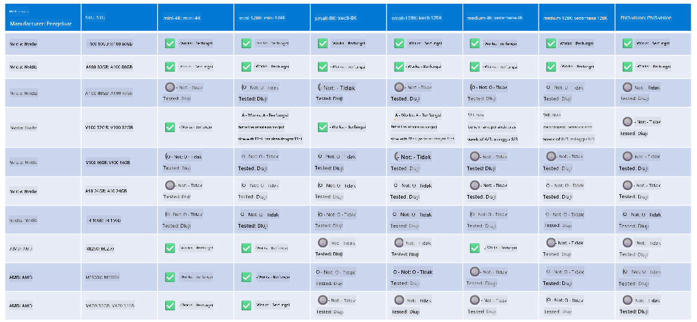

<!--
CO_OP_TRANSLATOR_METADATA:
{
  "original_hash": "8cdc17ce0f10535da30b53d23fe1a795",
  "translation_date": "2025-05-09T07:52:08+00:00",
  "source_file": "md/01.Introduction/01/01.Hardwaresupport.md",
  "language_code": "ms"
}
-->
# دعم أجهزة Phi

تم تحسين Microsoft Phi لـ ONNX Runtime ويدعم Windows DirectML. يعمل بشكل جيد عبر أنواع مختلفة من الأجهزة، بما في ذلك وحدات معالجة الرسومات (GPU)، ووحدات المعالجة المركزية (CPU)، وحتى الأجهزة المحمولة.

## أجهزة الجهاز  
تشمل الأجهزة المدعومة بشكل خاص:

- GPU SKU: RTX 4090 (DirectML)
- GPU SKU: 1 A100 80GB (CUDA)
- CPU SKU: Standard F64s v2 (64 vCPUs، 128 GiB ذاكرة)

## إصدار الأجهزة المحمولة

- أندرويد - Samsung Galaxy S21
- Apple iPhone 14 أو أحدث بمعالج A16/A17

## مواصفات أجهزة Phi

- الحد الأدنى من التكوين المطلوب.
- ويندوز: GPU يدعم DirectX 12 وذاكرة RAM مجمعة لا تقل عن 4 جيجابايت

CUDA: NVIDIA GPU مع قدرة حسابية >= 7.02



## تشغيل onnxruntime على عدة وحدات GPU

نماذج Phi ONNX المتاحة حالياً تدعم GPU واحد فقط. من الممكن دعم تعدد وحدات GPU لنموذج Phi، لكن ORT مع وحدتي GPU لا يضمن زيادة في الأداء مقارنة بتشغيل مثيلين من ort. يرجى مراجعة [ONNX Runtime](https://onnxruntime.ai/) لأحدث التحديثات.

في [Build 2024 فريق GenAI ONNX](https://youtu.be/WLW4SE8M9i8?si=EtG04UwDvcjunyfC) أعلنوا أنهم فعّلوا تعدد المثيلات بدلاً من تعدد وحدات GPU لنماذج Phi.

حالياً، يتيح لك هذا تشغيل مثيل واحد من onnnxruntime أو onnxruntime-genai باستخدام متغير البيئة CUDA_VISIBLE_DEVICES كما يلي.

```Python
CUDA_VISIBLE_DEVICES=0 python infer.py
CUDA_VISIBLE_DEVICES=1 python infer.py
```

لا تتردد في استكشاف Phi أكثر في [Azure AI Foundry](https://ai.azure.com)

**Penafian**:  
Dokumen ini telah diterjemahkan menggunakan perkhidmatan terjemahan AI [Co-op Translator](https://github.com/Azure/co-op-translator). Walaupun kami berusaha untuk ketepatan, sila ambil maklum bahawa terjemahan automatik mungkin mengandungi kesilapan atau ketidaktepatan. Dokumen asal dalam bahasa asalnya harus dianggap sebagai sumber yang sahih. Untuk maklumat penting, terjemahan profesional oleh manusia adalah disyorkan. Kami tidak bertanggungjawab atas sebarang salah faham atau salah tafsir yang timbul daripada penggunaan terjemahan ini.