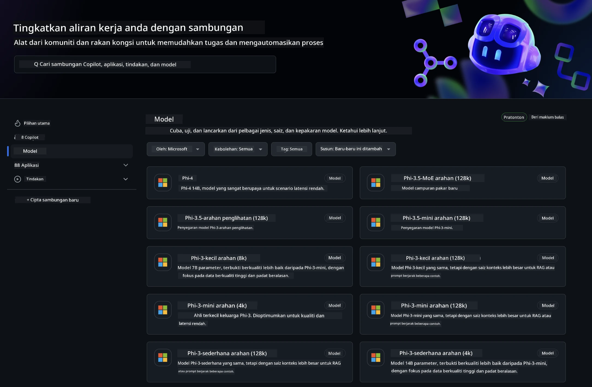
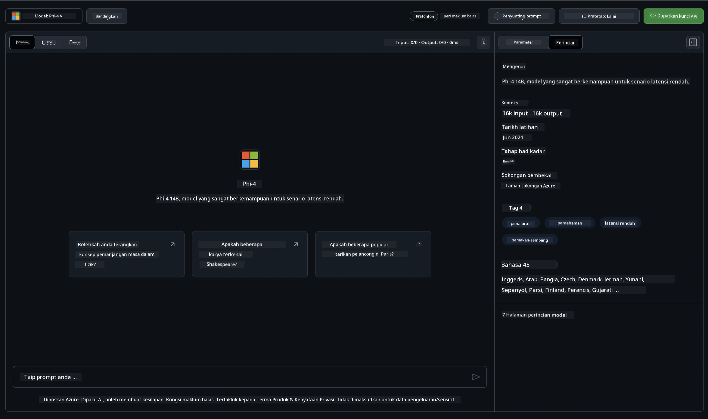
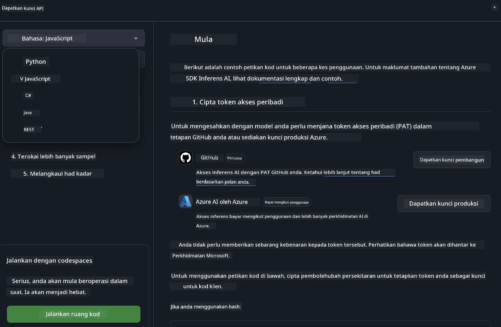
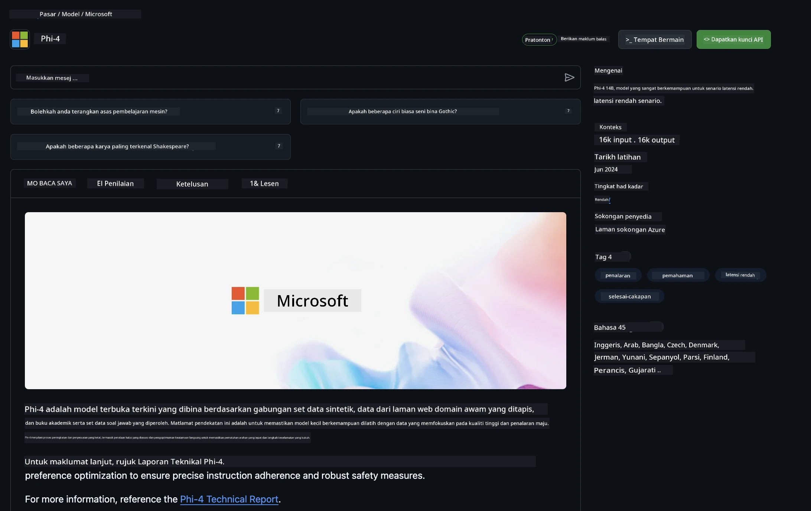

## Keluarga Phi dalam GitHub Models

Selamat datang ke [GitHub Models](https://github.com/marketplace/models)! Kami telah menyediakan segala-galanya untuk anda meneroka Model AI yang dihoskan di Azure AI.



Untuk maklumat lanjut mengenai Model yang tersedia di GitHub Models, sila lawati [GitHub Model Marketplace](https://github.com/marketplace/models)

## Model Tersedia

Setiap model mempunyai ruang permainan khusus dan kod contoh



### Keluarga Phi dalam Katalog Model GitHub

- [Phi-4](https://github.com/marketplace/models/azureml/Phi-4)

- [Phi-3.5-MoE instruct (128k)](https://github.com/marketplace/models/azureml/Phi-3-5-MoE-instruct)

- [Phi-3.5-vision instruct (128k)](https://github.com/marketplace/models/azureml/Phi-3-5-vision-instruct)

- [Phi-3.5-mini instruct (128k)](https://github.com/marketplace/models/azureml/Phi-3-5-mini-instruct)

- [Phi-3-Medium-128k-Instruct](https://github.com/marketplace/models/azureml/Phi-3-medium-128k-instruct)

- [Phi-3-medium-4k-instruct](https://github.com/marketplace/models/azureml/Phi-3-medium-4k-instruct)

- [Phi-3-mini-128k-instruct](https://github.com/marketplace/models/azureml/Phi-3-mini-128k-instruct)

- [Phi-3-mini-4k-instruct](https://github.com/marketplace/models/azureml/Phi-3-mini-4k-instruct)

- [Phi-3-small-128k-instruct](https://github.com/marketplace/models/azureml/Phi-3-small-128k-instruct)

- [Phi-3-small-8k-instruct](https://github.com/marketplace/models/azureml/Phi-3-small-8k-instruct)

## Memulakan

Terdapat beberapa contoh asas yang sedia untuk anda jalankan. Anda boleh menemui mereka dalam direktori samples. Jika anda ingin terus ke bahasa kegemaran anda, contoh-contoh tersebut boleh didapati dalam Bahasa berikut:

- Python
- JavaScript
- C#
- Java
- cURL

Terdapat juga Persekitaran Codespaces khusus untuk menjalankan contoh dan model.



## Kod Contoh

Di bawah adalah petikan kod contoh untuk beberapa kes penggunaan. Untuk maklumat tambahan mengenai Azure AI Inference SDK, sila rujuk dokumentasi penuh dan contoh.

## Persediaan

1. Cipta token akses peribadi  
Anda tidak perlu memberikan sebarang kebenaran kepada token tersebut. Perlu diingat bahawa token ini akan dihantar ke perkhidmatan Microsoft.

Untuk menggunakan petikan kod di bawah, cipta pembolehubah persekitaran untuk menetapkan token anda sebagai kunci untuk kod klien.

Jika anda menggunakan bash:  
```
export GITHUB_TOKEN="<your-github-token-goes-here>"
```  
Jika anda menggunakan powershell:  

```
$Env:GITHUB_TOKEN="<your-github-token-goes-here>"
```  

Jika anda menggunakan command prompt Windows:  

```
set GITHUB_TOKEN=<your-github-token-goes-here>
```  

## Contoh Python

### Pasang kebergantungan  
Pasang Azure AI Inference SDK menggunakan pip (Memerlukan: Python >=3.8):

```
pip install azure-ai-inference
```  
### Jalankan contoh kod asas

Contoh ini menunjukkan panggilan asas ke API chat completion. Ia menggunakan titik akhir inferens model AI GitHub dan token GitHub anda. Panggilan ini adalah secara segerak.

```python
import os
from azure.ai.inference import ChatCompletionsClient
from azure.ai.inference.models import SystemMessage, UserMessage
from azure.core.credentials import AzureKeyCredential

endpoint = "https://models.inference.ai.azure.com"
model_name = "Phi-4"
token = os.environ["GITHUB_TOKEN"]

client = ChatCompletionsClient(
    endpoint=endpoint,
    credential=AzureKeyCredential(token),
)

response = client.complete(
    messages=[
        UserMessage(content="I have $20,000 in my savings account, where I receive a 4% profit per year and payments twice a year. Can you please tell me how long it will take for me to become a millionaire? Also, can you please explain the math step by step as if you were explaining it to an uneducated person?"),
    ],
    temperature=0.4,
    top_p=1.0,
    max_tokens=2048,
    model=model_name
)

print(response.choices[0].message.content)
```

### Jalankan perbualan berbilang pusingan

Contoh ini menunjukkan perbualan berbilang pusingan dengan API chat completion. Apabila menggunakan model untuk aplikasi chat, anda perlu mengurus sejarah perbualan tersebut dan menghantar mesej terkini ke model.

```
import os
from azure.ai.inference import ChatCompletionsClient
from azure.ai.inference.models import AssistantMessage, SystemMessage, UserMessage
from azure.core.credentials import AzureKeyCredential

token = os.environ["GITHUB_TOKEN"]
endpoint = "https://models.inference.ai.azure.com"
# Replace Model_Name
model_name = "Phi-4"

client = ChatCompletionsClient(
    endpoint=endpoint,
    credential=AzureKeyCredential(token),
)

messages = [
    SystemMessage(content="You are a helpful assistant."),
    UserMessage(content="What is the capital of France?"),
    AssistantMessage(content="The capital of France is Paris."),
    UserMessage(content="What about Spain?"),
]

response = client.complete(messages=messages, model=model_name)

print(response.choices[0].message.content)
```

### Alirkan output

Untuk pengalaman pengguna yang lebih baik, anda ingin mengalirkan respons model supaya token pertama muncul lebih awal dan anda tidak perlu menunggu respons yang panjang.

```
import os
from azure.ai.inference import ChatCompletionsClient
from azure.ai.inference.models import SystemMessage, UserMessage
from azure.core.credentials import AzureKeyCredential

token = os.environ["GITHUB_TOKEN"]
endpoint = "https://models.inference.ai.azure.com"
# Replace Model_Name
model_name = "Phi-4"

client = ChatCompletionsClient(
    endpoint=endpoint,
    credential=AzureKeyCredential(token),
)

response = client.complete(
    stream=True,
    messages=[
        SystemMessage(content="You are a helpful assistant."),
        UserMessage(content="Give me 5 good reasons why I should exercise every day."),
    ],
    model=model_name,
)

for update in response:
    if update.choices:
        print(update.choices[0].delta.content or "", end="")

client.close()
```

## Penggunaan PERCUMA dan Had Kadar untuk GitHub Models



[Had kadar untuk playground dan penggunaan API percuma](https://docs.github.com/en/github-models/prototyping-with-ai-models#rate-limits) bertujuan untuk membantu anda bereksperimen dengan model dan membuat prototaip aplikasi AI anda. Untuk penggunaan melebihi had tersebut, dan untuk mengembangkan aplikasi anda, anda mesti menyediakan sumber dari akaun Azure, dan mengesahkan dari situ dan bukannya menggunakan token akses peribadi GitHub anda. Anda tidak perlu mengubah apa-apa dalam kod anda. Gunakan pautan ini untuk mengetahui cara melebihi had tahap percuma dalam Azure AI.

### Pendedahan

Ingat bahawa apabila berinteraksi dengan model, anda sedang bereksperimen dengan AI, jadi kesilapan kandungan mungkin berlaku.

Ciri ini tertakluk kepada pelbagai had (termasuk permintaan per minit, permintaan per hari, token per permintaan, dan permintaan serentak) dan tidak direka untuk kes penggunaan produksi.

GitHub Models menggunakan Azure AI Content Safety. Penapis ini tidak boleh dimatikan sebagai sebahagian daripada pengalaman GitHub Models. Jika anda memilih untuk menggunakan model melalui perkhidmatan berbayar, sila konfigurasikan penapis kandungan anda mengikut keperluan anda.

Perkhidmatan ini tertakluk kepada Terma Pra-siaran GitHub.

**Penafian**:  
Dokumen ini telah diterjemahkan menggunakan perkhidmatan terjemahan AI [Co-op Translator](https://github.com/Azure/co-op-translator). Walaupun kami berusaha untuk ketepatan, sila ambil maklum bahawa terjemahan automatik mungkin mengandungi kesilapan atau ketidaktepatan. Dokumen asal dalam bahasa asalnya harus dianggap sebagai sumber yang sahih. Untuk maklumat penting, terjemahan profesional oleh manusia adalah disyorkan. Kami tidak bertanggungjawab atas sebarang salah faham atau salah tafsir yang timbul daripada penggunaan terjemahan ini.