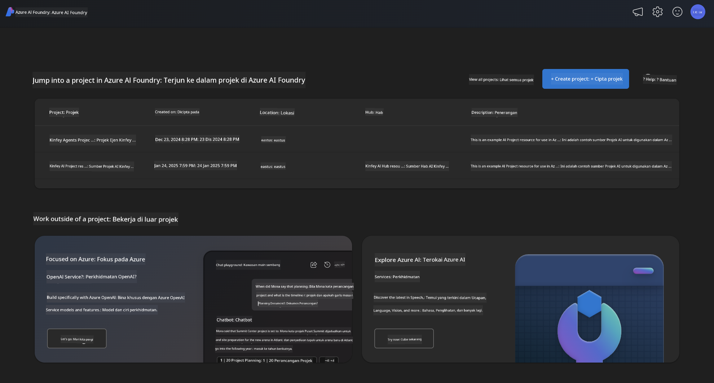

<!--
CO_OP_TRANSLATOR_METADATA:
{
  "original_hash": "3ae21dc5554e888defbe57946ee995ee",
  "translation_date": "2025-07-16T19:10:31+00:00",
  "source_file": "md/01.Introduction/02/03.AzureAIFoundry.md",
  "language_code": "ms"
}
-->
## Keluarga Phi dalam Azure AI Foundry

[Azure AI Foundry](https://ai.azure.com) adalah platform yang dipercayai yang membolehkan pembangun memacu inovasi dan membentuk masa depan dengan AI secara selamat, terjamin, dan bertanggungjawab.

[Azure AI Foundry](https://ai.azure.com) direka untuk pembangun supaya dapat:

- Membangunkan aplikasi AI generatif pada platform bertaraf perusahaan.
- Meneroka, membina, menguji, dan melancarkan menggunakan alat AI terkini dan model ML, berasaskan amalan AI yang bertanggungjawab.
- Bekerjasama dengan pasukan untuk keseluruhan kitar hayat pembangunan aplikasi.

Dengan Azure AI Foundry, anda boleh meneroka pelbagai model, perkhidmatan dan keupayaan, serta mula membina aplikasi AI yang paling sesuai dengan matlamat anda. Platform Azure AI Foundry memudahkan skala untuk mengubah bukti konsep menjadi aplikasi pengeluaran sepenuhnya dengan mudah. Pemantauan dan penambahbaikan berterusan menyokong kejayaan jangka panjang.



Selain menggunakan Perkhidmatan Azure AOAI dalam Azure AI Foundry, anda juga boleh menggunakan model pihak ketiga dalam Katalog Model Azure AI Foundry. Ini adalah pilihan yang baik jika anda ingin menggunakan Azure AI Foundry sebagai platform penyelesaian AI anda.

Kita boleh melancarkan Model Keluarga Phi dengan cepat melalui Katalog Model dalam Azure AI Foundry

[Model Microsoft Phi dalam Model Azure AI Foundry](https://ai.azure.com/explore/models/?selectedCollection=phi)


### **Melancarkan Phi-4 dalam Azure AI Foundry**


### **Menguji Phi-4 dalam Azure AI Foundry Playground**


### **Menjalankan Kod Python untuk memanggil Azure AI Foundry Phi-4**

```python

import os  
import base64
from openai import AzureOpenAI  
from azure.identity import DefaultAzureCredential, get_bearer_token_provider  
        
endpoint = os.getenv("ENDPOINT_URL", "Your Azure AOAI Service Endpoint")  
deployment = os.getenv("DEPLOYMENT_NAME", "Phi-4")  
      
token_provider = get_bearer_token_provider(  
    DefaultAzureCredential(),  
    "https://cognitiveservices.azure.com/.default"  
)  
  
client = AzureOpenAI(  
    azure_endpoint=endpoint,  
    azure_ad_token_provider=token_provider,  
    api_version="2024-05-01-preview",  
)  
  

chat_prompt = [
    {
        "role": "system",
        "content": "You are an AI assistant that helps people find information."
    },
    {
        "role": "user",
        "content": "can you introduce yourself"
    }
] 
    
# Include speech result if speech is enabled  
messages = chat_prompt 

completion = client.chat.completions.create(  
    model=deployment,  
    messages=messages,
    max_tokens=800,  
    temperature=0.7,  
    top_p=0.95,  
    frequency_penalty=0,  
    presence_penalty=0,
    stop=None,  
    stream=False  
)  
  
print(completion.to_json())  

```

**Penafian**:  
Dokumen ini telah diterjemahkan menggunakan perkhidmatan terjemahan AI [Co-op Translator](https://github.com/Azure/co-op-translator). Walaupun kami berusaha untuk ketepatan, sila ambil maklum bahawa terjemahan automatik mungkin mengandungi kesilapan atau ketidaktepatan. Dokumen asal dalam bahasa asalnya harus dianggap sebagai sumber yang sahih. Untuk maklumat penting, terjemahan profesional oleh manusia adalah disyorkan. Kami tidak bertanggungjawab atas sebarang salah faham atau salah tafsir yang timbul daripada penggunaan terjemahan ini.