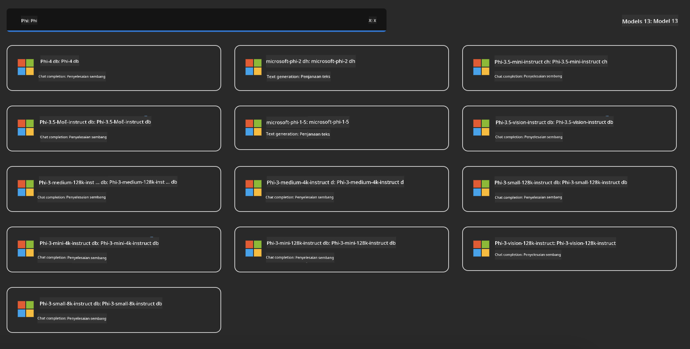
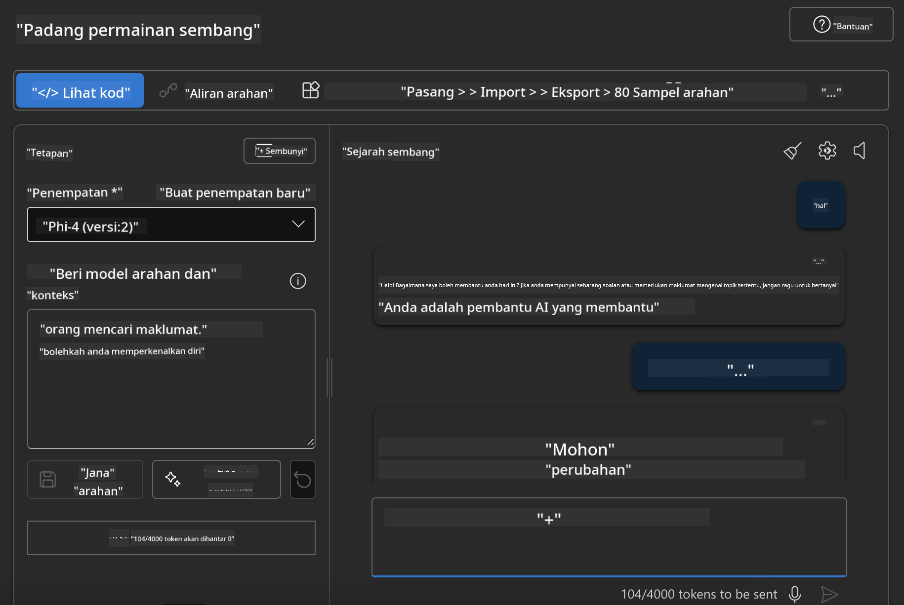

<!--
CO_OP_TRANSLATOR_METADATA:
{
  "original_hash": "3ae21dc5554e888defbe57946ee995ee",
  "translation_date": "2025-05-09T09:08:00+00:00",
  "source_file": "md/01.Introduction/02/03.AzureAIFoundry.md",
  "language_code": "ms"
}
-->
## Phi Family في Azure AI Foundry

[Azure AI Foundry](https://ai.azure.com) هي منصة موثوقة تتيح للمطورين دفع عجلة الابتكار وتشكيل المستقبل باستخدام الذكاء الاصطناعي بطريقة آمنة، محمية، ومسؤولة.

[Azure AI Foundry](https://ai.azure.com) مصممة للمطورين لـ:

- بناء تطبيقات الذكاء الاصطناعي التوليدية على منصة بمستوى المؤسسات.
- استكشاف، بناء، اختبار، ونشر باستخدام أدوات الذكاء الاصطناعي المتطورة ونماذج التعلم الآلي، مع الالتزام بممارسات الذكاء الاصطناعي المسؤولة.
- التعاون مع فريق طوال دورة حياة تطوير التطبيق.

مع Azure AI Foundry، يمكنك استكشاف مجموعة واسعة من النماذج، الخدمات، والقدرات، والبدء في بناء تطبيقات الذكاء الاصطناعي التي تلبي أهدافك بشكل أفضل. تسهل منصة Azure AI Foundry التوسع لتحويل نماذج إثبات المفهوم إلى تطبيقات إنتاج كاملة بسهولة. كما تدعم المراقبة المستمرة والتحسين لتحقيق النجاح على المدى الطويل.


بالإضافة إلى استخدام Azure AOAI Service في Azure AI Foundry، يمكنك أيضاً استخدام نماذج الطرف الثالث في Azure AI Foundry Model Catalog. هذا خيار جيد إذا كنت ترغب في استخدام Azure AI Foundry كمنصة لحلول الذكاء الاصطناعي الخاصة بك.

يمكننا نشر نماذج Phi Family بسرعة من خلال Model Catalog في Azure AI Foundry

[Microsoft Phi Models in Azure AI Foundry Models](https://ai.azure.com/explore/models/?selectedCollection=phi)



### **نشر Phi-4 في Azure AI Foundry**


### **اختبار Phi-4 في Azure AI Foundry Playground**



### **تشغيل كود Python لاستدعاء Azure AI Foundry Phi-4**

```python

import os  
import base64
from openai import AzureOpenAI  
from azure.identity import DefaultAzureCredential, get_bearer_token_provider  
        
endpoint = os.getenv("ENDPOINT_URL", "Your Azure AOAI Service Endpoint")  
deployment = os.getenv("DEPLOYMENT_NAME", "Phi-4")  
      
token_provider = get_bearer_token_provider(  
    DefaultAzureCredential(),  
    "https://cognitiveservices.azure.com/.default"  
)  
  
client = AzureOpenAI(  
    azure_endpoint=endpoint,  
    azure_ad_token_provider=token_provider,  
    api_version="2024-05-01-preview",  
)  
  

chat_prompt = [
    {
        "role": "system",
        "content": "You are an AI assistant that helps people find information."
    },
    {
        "role": "user",
        "content": "can you introduce yourself"
    }
] 
    
# Include speech result if speech is enabled  
messages = chat_prompt 

completion = client.chat.completions.create(  
    model=deployment,  
    messages=messages,
    max_tokens=800,  
    temperature=0.7,  
    top_p=0.95,  
    frequency_penalty=0,  
    presence_penalty=0,
    stop=None,  
    stream=False  
)  
  
print(completion.to_json())  

```

**Penafian**:  
Dokumen ini telah diterjemahkan menggunakan perkhidmatan terjemahan AI [Co-op Translator](https://github.com/Azure/co-op-translator). Walaupun kami berusaha untuk ketepatan, sila maklum bahawa terjemahan automatik mungkin mengandungi kesilapan atau ketidaktepatan. Dokumen asal dalam bahasa asalnya hendaklah dianggap sebagai sumber yang sahih. Untuk maklumat penting, terjemahan profesional oleh manusia adalah disyorkan. Kami tidak bertanggungjawab atas sebarang salah faham atau salah tafsir yang timbul daripada penggunaan terjemahan ini.