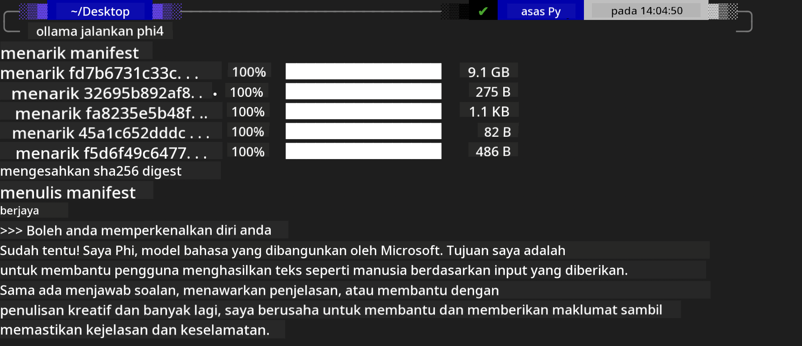

<!--
CO_OP_TRANSLATOR_METADATA:
{
  "original_hash": "0b38834693bb497f96bf53f0d941f9a1",
  "translation_date": "2025-05-09T09:20:32+00:00",
  "source_file": "md/01.Introduction/02/04.Ollama.md",
  "language_code": "ms"
}
-->
## Phi Family in Ollama


[Ollama](https://ollama.com) позволяет большему количеству людей напрямую развертывать открытые LLM или SLM с помощью простых скриптов, а также создавать API для поддержки локальных сценариев приложений Copilot.

## **1. Установка**

Ollama поддерживает работу на Windows, macOS и Linux. Вы можете установить Ollama по этой ссылке ([https://ollama.com/download](https://ollama.com/download)). После успешной установки вы можете напрямую использовать скрипт Ollama для вызова Phi-3 через терминал. Все [доступные библиотеки в Ollama](https://ollama.com/library) можно посмотреть по ссылке. Если вы откроете этот репозиторий в Codespace, Ollama уже будет установлен.

```bash

ollama run phi4

```

> [!NOTE]
> При первом запуске модель будет скачана автоматически. Конечно, вы также можете указать заранее скачанную модель Phi-4. В качестве примера приведена команда для WSL. После успешного скачивания модели вы сможете взаимодействовать с ней напрямую в терминале.



## **2. Вызов API phi-4 из Ollama**

Если вы хотите вызвать API Phi-4, созданный ollama, используйте эту команду в терминале для запуска сервера Ollama.

```bash

ollama serve

```

> [!NOTE]
> При работе на MacOS или Linux может возникнуть ошибка **"Error: listen tcp 127.0.0.1:11434: bind: address already in use"**. Эта ошибка появляется при попытке запуска команды. Вы можете проигнорировать её, так как обычно это значит, что сервер уже запущен, или остановить и перезапустить Ollama:

**macOS**

```bash

brew services restart ollama

```

**Linux**

```bash

sudo systemctl stop ollama

```

Ollama поддерживает два API: generate и chat. Вы можете вызывать API модели Ollama по необходимости, отправляя запросы на локальный сервис, работающий на порту 11434.

**Chat**

```bash

curl http://127.0.0.1:11434/api/chat -d '{
  "model": "phi3",
  "messages": [
    {
      "role": "system",
      "content": "Your are a python developer."
    },
    {
      "role": "user",
      "content": "Help me generate a bubble algorithm"
    }
  ],
  "stream": false
  
}'

This is the result in Postman


## Additional Resources

Check the list of available models in Ollama in [their library](https://ollama.com/library).

Pull your model from the Ollama server using this command

```bash
ollama pull phi4
```

Run the model using this command

```bash
ollama run phi4
```

***Note:*** Visit this link [https://github.com/ollama/ollama/blob/main/docs/api.md](https://github.com/ollama/ollama/blob/main/docs/api.md) to learn more

## Calling Ollama from Python

You can use `requests` or `urllib3` to make requests to the local server endpoints used above. However, a popular way to use Ollama in Python is via the [openai](https://pypi.org/project/openai/) SDK, since Ollama provides OpenAI-compatible server endpoints as well.

Here is an example for phi3-mini:

```python
import openai

client = openai.OpenAI(
    base_url="http://localhost:11434/v1",
    api_key="nokeyneeded",
)

response = client.chat.completions.create(
    model="phi4",
    temperature=0.7,
    n=1,
    messages=[
        {"role": "system", "content": "You are a helpful assistant."},
        {"role": "user", "content": "Write a haiku about a hungry cat"},
    ],
)

print("Response:")
print(response.choices[0].message.content)
```

## Calling Ollama from JavaScript 

```javascript
// Пример суммирования файла с помощью Phi-4
script({
    model: "ollama:phi4",
    title: "Summarize with Phi-4",
    system: ["system"],
})

// Пример суммирования
const file = def("FILE", env.files)
$`Summarize ${file} in a single paragraph.`
```

## Calling Ollama from C#

Create a new C# Console application and add the following NuGet package:

```bash
dotnet add package Microsoft.SemanticKernel --version 1.34.0
```

Then replace this code in the `Program.cs` file

```csharp
using Microsoft.SemanticKernel;
using Microsoft.SemanticKernel.ChatCompletion;

// добавляем сервис chat completion с использованием локального эндпоинта ollama
#pragma warning disable SKEXP0001, SKEXP0003, SKEXP0010, SKEXP0011, SKEXP0050, SKEXP0052
builder.AddOpenAIChatCompletion(
    modelId: "phi4",
    endpoint: new Uri("http://localhost:11434/"),
    apiKey: "non required");

// отправляем простой запрос в чат-сервис
string prompt = "Write a joke about kittens";
var response = await kernel.InvokePromptAsync(prompt);
Console.WriteLine(response.GetValue<string>());
```

Run the app with the command:

```bash
dotnet run


**Penafian**:  
Dokumen ini telah diterjemahkan menggunakan perkhidmatan terjemahan AI [Co-op Translator](https://github.com/Azure/co-op-translator). Walaupun kami berusaha untuk ketepatan, sila maklum bahawa terjemahan automatik mungkin mengandungi kesilapan atau ketidaktepatan. Dokumen asal dalam bahasa asalnya harus dianggap sebagai sumber yang sahih. Untuk maklumat penting, terjemahan profesional oleh manusia adalah disyorkan. Kami tidak bertanggungjawab atas sebarang salah faham atau tafsiran yang salah yang timbul daripada penggunaan terjemahan ini.