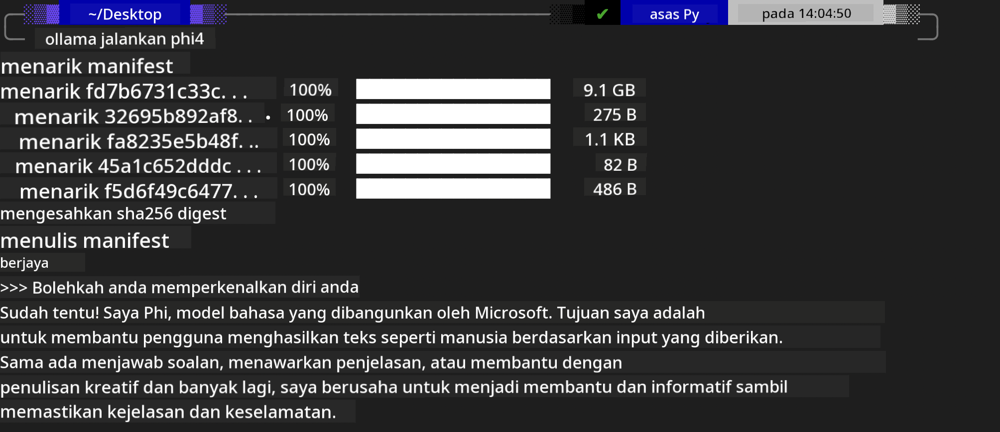

<!--
CO_OP_TRANSLATOR_METADATA:
{
  "original_hash": "2aa35f3c8b437fd5dc9995d53909d495",
  "translation_date": "2025-12-21T12:50:13+00:00",
  "source_file": "md/01.Introduction/02/04.Ollama.md",
  "language_code": "ms"
}
-->
## Keluarga Phi dalam Ollama


[Ollama](https://ollama.com) membolehkan lebih ramai orang menyebarkan LLM atau SLM sumber terbuka secara langsung melalui skrip mudah, dan juga boleh membina API untuk membantu senario aplikasi Copilot tempatan.

## **1. Pemasangan**

Ollama menyokong berjalan di Windows, macOS, dan Linux. Anda boleh memasang Ollama melalui pautan ini ([https://ollama.com/download](https://ollama.com/download)). Selepas pemasangan berjaya, anda boleh terus menggunakan skrip Ollama untuk memanggil Phi-3 melalui tetingkap terminal. Anda boleh melihat semua [perpustakaan yang tersedia di Ollama](https://ollama.com/library). Jika anda membuka repositori ini dalam Codespace, ia sudah akan mempunyai Ollama dipasang.

```bash

ollama run phi4

```

> [!NOTE]
> Model akan dimuat turun terlebih dahulu apabila anda menjalankannya buat kali pertama. Sudah tentu, anda juga boleh menentukan model Phi-4 yang telah dimuat turun secara langsung. Kami mengambil WSL sebagai contoh untuk menjalankan arahan. Selepas model berjaya dimuat turun, anda boleh berinteraksi terus dalam terminal.



## **2. Panggil API phi-4 daripada Ollama**

Jika anda ingin memanggil API Phi-4 yang dihasilkan oleh Ollama, anda boleh menggunakan arahan ini dalam terminal untuk memulakan pelayan Ollama.

```bash

ollama serve

```

> [!NOTE]
> Jika menjalankan MacOS atau Linux, sila ambil perhatian bahawa anda mungkin akan menghadapi ralat berikut **"Error: listen tcp 127.0.0.1:11434: bind: address already in use"** Anda mungkin mendapat ralat ini apabila menjalankan arahan. Anda boleh mengabaikan ralat itu, kerana ia biasanya menunjukkan pelayan sudah berjalan, atau anda boleh menghentikan dan memulakan semula Ollama:

**macOS**

```bash

brew services restart ollama

```

**Linux**

```bash

sudo systemctl stop ollama

```

Ollama menyokong dua API: generate dan chat. Anda boleh memanggil API model yang disediakan oleh Ollama mengikut keperluan anda, dengan menghantar permintaan ke perkhidmatan tempatan yang berjalan pada port 11434.

**Chat**

```bash

curl http://127.0.0.1:11434/api/chat -d '{
  "model": "phi3",
  "messages": [
    {
      "role": "system",
      "content": "Your are a python developer."
    },
    {
      "role": "user",
      "content": "Help me generate a bubble algorithm"
    }
  ],
  "stream": false
  
}'
```

Ini adalah hasil dalam Postman


## Sumber Tambahan

Semak senarai model yang tersedia di Ollama dalam [perpustakaan mereka](https://ollama.com/library).

Tarik model anda dari pelayan Ollama menggunakan arahan ini

```bash
ollama pull phi4
```

Jalankan model menggunakan arahan ini

```bash
ollama run phi4
```

***Note:*** Lawati pautan ini [https://github.com/ollama/ollama/blob/main/docs/api.md](https://github.com/ollama/ollama/blob/main/docs/api.md) untuk mengetahui lebih lanjut

## Memanggil Ollama dari Python

Anda boleh menggunakan `requests` atau `urllib3` untuk membuat permintaan ke titik akhir pelayan tempatan yang digunakan di atas. Walau bagaimanapun, cara popular untuk menggunakan Ollama dalam Python adalah melalui SDK [openai](https://pypi.org/project/openai/), kerana Ollama juga menyediakan titik akhir pelayan yang serasi dengan OpenAI.

Berikut adalah contoh untuk phi3-mini:

```python
import openai

client = openai.OpenAI(
    base_url="http://localhost:11434/v1",
    api_key="nokeyneeded",
)

response = client.chat.completions.create(
    model="phi4",
    temperature=0.7,
    n=1,
    messages=[
        {"role": "system", "content": "You are a helpful assistant."},
        {"role": "user", "content": "Write a haiku about a hungry cat"},
    ],
)

print("Response:")
print(response.choices[0].message.content)
```

## Memanggil Ollama dari JavaScript 
```javascript
// Contoh meringkaskan fail dengan Phi-4
script({
    model: "ollama:phi4",
    title: "Summarize with Phi-4",
    system: ["system"],
})

// Contoh meringkaskan
const file = def("FILE", env.files)
$`Summarize ${file} in a single paragraph.`
```

## Memanggil Ollama dari C#

Cipta aplikasi Console C# baru dan tambah pakej NuGet berikut:

```bash
dotnet add package Microsoft.SemanticKernel --version 1.34.0
```

Kemudian gantikan kod ini dalam fail `Program.cs`

```csharp
using Microsoft.SemanticKernel;
using Microsoft.SemanticKernel.ChatCompletion;

// add chat completion service using the local ollama server endpoint
#pragma warning disable SKEXP0001, SKEXP0003, SKEXP0010, SKEXP0011, SKEXP0050, SKEXP0052
builder.AddOpenAIChatCompletion(
    modelId: "phi4",
    endpoint: new Uri("http://localhost:11434/"),
    apiKey: "non required");

// invoke a simple prompt to the chat service
string prompt = "Write a joke about kittens";
var response = await kernel.InvokePromptAsync(prompt);
Console.WriteLine(response.GetValue<string>());
```

Jalankan aplikasi dengan arahan:

```bash
dotnet run
```

---

<!-- CO-OP TRANSLATOR DISCLAIMER START -->
Penafian:
Dokumen ini telah diterjemahkan menggunakan perkhidmatan terjemahan AI Co-op Translator (https://github.com/Azure/co-op-translator). Walaupun kami berusaha untuk ketepatan, sila ambil maklum bahawa terjemahan automatik mungkin mengandungi ralat atau ketidaktepatan. Dokumen asal dalam bahasa asalnya hendaklah dianggap sebagai sumber rujukan yang sahih. Bagi maklumat yang kritikal, disyorkan terjemahan profesional oleh penterjemah manusia. Kami tidak bertanggungjawab terhadap sebarang salah faham atau salah tafsiran yang timbul daripada penggunaan terjemahan ini.
<!-- CO-OP TRANSLATOR DISCLAIMER END -->