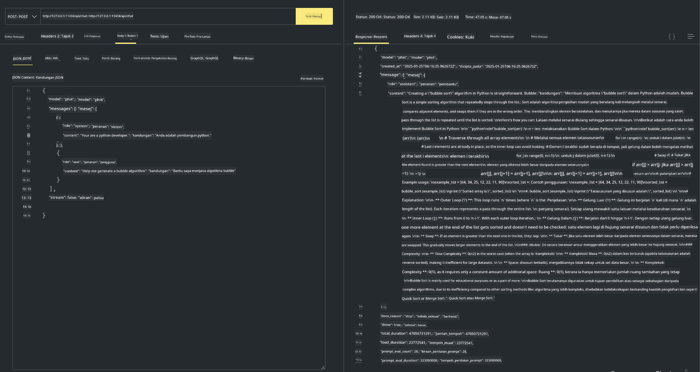

<!--
CO_OP_TRANSLATOR_METADATA:
{
  "original_hash": "0b38834693bb497f96bf53f0d941f9a1",
  "translation_date": "2025-07-16T19:17:49+00:00",
  "source_file": "md/01.Introduction/02/04.Ollama.md",
  "language_code": "ms"
}
-->
## Keluarga Phi dalam Ollama


[Ollama](https://ollama.com) membolehkan lebih ramai orang untuk terus menggunakan LLM atau SLM sumber terbuka melalui skrip mudah, dan juga boleh membina API untuk membantu senario aplikasi Copilot tempatan.

## **1. Pemasangan**

Ollama menyokong penggunaan pada Windows, macOS, dan Linux. Anda boleh memasang Ollama melalui pautan ini ([https://ollama.com/download](https://ollama.com/download)). Selepas pemasangan berjaya, anda boleh terus menggunakan skrip Ollama untuk memanggil Phi-3 melalui tetingkap terminal. Anda boleh melihat semua [perpustakaan yang tersedia dalam Ollama](https://ollama.com/library). Jika anda membuka repositori ini dalam Codespace, Ollama sudah dipasang.

```bash

ollama run phi4

```

> [!NOTE]
> Model akan dimuat turun terlebih dahulu apabila anda menjalankannya buat kali pertama. Sudah tentu, anda juga boleh terus menentukan model Phi-4 yang telah dimuat turun. Kami menggunakan WSL sebagai contoh untuk menjalankan arahan. Selepas model berjaya dimuat turun, anda boleh berinteraksi terus di terminal.


## **2. Memanggil API phi-4 dari Ollama**

Jika anda ingin memanggil API Phi-4 yang dijana oleh ollama, anda boleh menggunakan arahan ini di terminal untuk memulakan pelayan Ollama.

```bash

ollama serve

```

> [!NOTE]
> Jika menggunakan MacOS atau Linux, sila ambil perhatian bahawa anda mungkin menghadapi ralat berikut **"Error: listen tcp 127.0.0.1:11434: bind: address already in use"** Anda mungkin mendapat ralat ini semasa menjalankan arahan. Anda boleh abaikan ralat tersebut, kerana biasanya ia menunjukkan pelayan sudah berjalan, atau anda boleh hentikan dan mulakan semula Ollama:

**macOS**

```bash

brew services restart ollama

```

**Linux**

```bash

sudo systemctl stop ollama

```

Ollama menyokong dua API: generate dan chat. Anda boleh memanggil API model yang disediakan oleh Ollama mengikut keperluan anda, dengan menghantar permintaan ke perkhidmatan tempatan yang berjalan pada port 11434.

**Chat**

```bash

curl http://127.0.0.1:11434/api/chat -d '{
  "model": "phi3",
  "messages": [
    {
      "role": "system",
      "content": "Your are a python developer."
    },
    {
      "role": "user",
      "content": "Help me generate a bubble algorithm"
    }
  ],
  "stream": false
  
}'

This is the result in Postman



## Additional Resources

Check the list of available models in Ollama in [their library](https://ollama.com/library).

Pull your model from the Ollama server using this command

```bash
ollama pull phi4
```

Run the model using this command

```bash
ollama run phi4
```

***Note:*** Visit this link [https://github.com/ollama/ollama/blob/main/docs/api.md](https://github.com/ollama/ollama/blob/main/docs/api.md) to learn more

## Calling Ollama from Python

You can use `requests` or `urllib3` to make requests to the local server endpoints used above. However, a popular way to use Ollama in Python is via the [openai](https://pypi.org/project/openai/) SDK, since Ollama provides OpenAI-compatible server endpoints as well.

Here is an example for phi3-mini:

```python
import openai

client = openai.OpenAI(
    base_url="http://localhost:11434/v1",
    api_key="nokeyneeded",
)

response = client.chat.completions.create(
    model="phi4",
    temperature=0.7,
    n=1,
    messages=[
        {"role": "system", "content": "You are a helpful assistant."},
        {"role": "user", "content": "Write a haiku about a hungry cat"},
    ],
)

print("Response:")
print(response.choices[0].message.content)
```

## Calling Ollama from JavaScript 

```javascript
// Contoh untuk Meringkaskan fail dengan Phi-4
script({
    model: "ollama:phi4",
    title: "Ringkasan dengan Phi-4",
    system: ["system"],
})

// Contoh ringkasan
const file = def("FILE", env.files)
$`Ringkaskan ${file} dalam satu perenggan.`
```

## Calling Ollama from C#

Create a new C# Console application and add the following NuGet package:

```bash
dotnet add package Microsoft.SemanticKernel --version 1.34.0
```

Then replace this code in the `Program.cs` file

```csharp
using Microsoft.SemanticKernel;
using Microsoft.SemanticKernel.ChatCompletion;

// tambah perkhidmatan chat completion menggunakan endpoint pelayan ollama tempatan
#pragma warning disable SKEXP0001, SKEXP0003, SKEXP0010, SKEXP0011, SKEXP0050, SKEXP0052
builder.AddOpenAIChatCompletion(
    modelId: "phi4",
    endpoint: new Uri("http://localhost:11434/"),
    apiKey: "non required");

// panggil prompt ringkas ke perkhidmatan chat
string prompt = "Write a joke about kittens";
var response = await kernel.InvokePromptAsync(prompt);
Console.WriteLine(response.GetValue<string>());
```

Run the app with the command:

```bash
dotnet run


**Penafian**:  
Dokumen ini telah diterjemahkan menggunakan perkhidmatan terjemahan AI [Co-op Translator](https://github.com/Azure/co-op-translator). Walaupun kami berusaha untuk ketepatan, sila ambil maklum bahawa terjemahan automatik mungkin mengandungi kesilapan atau ketidaktepatan. Dokumen asal dalam bahasa asalnya harus dianggap sebagai sumber yang sahih. Untuk maklumat penting, terjemahan profesional oleh manusia adalah disyorkan. Kami tidak bertanggungjawab atas sebarang salah faham atau salah tafsir yang timbul daripada penggunaan terjemahan ini.