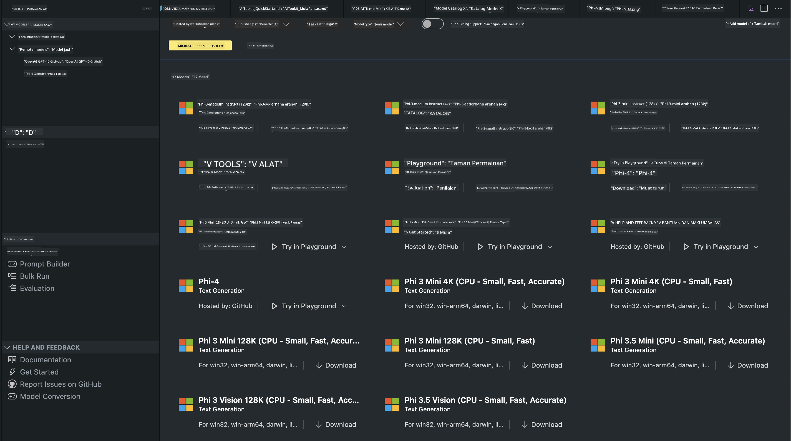
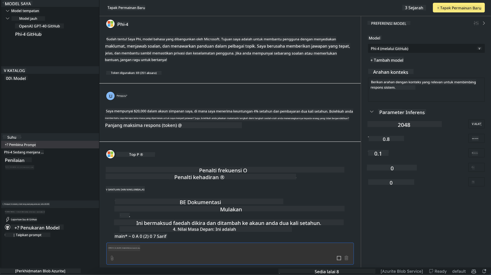

<!--
CO_OP_TRANSLATOR_METADATA:
{
  "original_hash": "4951d458c0b60c02cd1e751b40903877",
  "translation_date": "2025-05-09T09:41:12+00:00",
  "source_file": "md/01.Introduction/02/05.AITK.md",
  "language_code": "ms"
}
-->
# Phi Family in AITK

[AI Toolkit for VS Code](https://marketplace.visualstudio.com/items?itemName=ms-windows-ai-studio.windows-ai-studio) מקל על פיתוח אפליקציות מבוססות AI גנרטיבי על ידי איחוד כלים ומודלים מתקדמים מה-Azure AI Foundry Catalog ומקטלוגים נוספים כמו Hugging Face. תוכל לגלוש בקטלוג המודלים של AI שמופעל על ידי GitHub Models ו-Azure AI Foundry Model Catalogs, להוריד אותם מקומית או מרחוק, לבצע כוונון עדין, לבדוק ולהשתמש בהם באפליקציה שלך.

גרסת התצוגה המקדימה של AI Toolkit תופעל מקומית. האינפרנציה המקומית או כוונון עדין תלויים במודל שבחרת, וייתכן שתצטרך GPU כמו NVIDIA CUDA GPU. ניתן גם להריץ ישירות מודלים מ-GitHub עם AITK.

## התחלה

[למידע נוסף על התקנת Windows subsystem for Linux](https://learn.microsoft.com/windows/wsl/install?WT.mc_id=aiml-137032-kinfeylo)

ו-[שינוי ההפצה ברירת המחדל](https://learn.microsoft.com/windows/wsl/install#change-the-default-linux-distribution-installed).

[מאגר GitHub של AI Toolkit](https://github.com/microsoft/vscode-ai-toolkit/)

- Windows, Linux, macOS
  
- עבור כוונון עדין ב-Windows ו-Linux, תזדקק ל-Nvidia GPU. בנוסף, **Windows** דורש subsystem for Linux עם הפצת Ubuntu 18.4 ומעלה. [למידע נוסף על התקנת Windows subsystem for Linux](https://learn.microsoft.com/windows/wsl/install) ו-[שינוי ההפצה ברירת המחדל](https://learn.microsoft.com/windows/wsl/install#change-the-default-linux-distribution-installed).

### התקנת AI Toolkit

AI Toolkit מגיע כהרחבה של [Visual Studio Code](https://code.visualstudio.com/docs/setup/additional-components#_vs-code-extensions), לכן יש להתקין קודם [VS Code](https://code.visualstudio.com/docs/setup/windows?WT.mc_id=aiml-137032-kinfeylo) ולהוריד את AI Toolkit מ-[VS Marketplace](https://marketplace.visualstudio.com/items?itemName=ms-windows-ai-studio.windows-ai-studio).
[AI Toolkit זמין ב-Visual Studio Marketplace](https://marketplace.visualstudio.com/items?itemName=ms-windows-ai-studio.windows-ai-studio) וניתן להתקינו כמו כל הרחבה אחרת ל-VS Code.

אם אינך מכיר את תהליך התקנת הרחבות ל-VS Code, פעל לפי השלבים הבאים:

### התחברות

1. בסרגל הפעילות ב-VS Code בחר ב-**Extensions**
1. בשורת החיפוש של ההרחבות הקלד "AI Toolkit"
1. בחר ב-"AI Toolkit for Visual Studio code"
1. בחר **Install**

כעת אתה מוכן להשתמש בהרחבה!

תתבקש להתחבר ל-GitHub, לכן לחץ על "Allow" כדי להמשיך. תועבר לדף ההתחברות של GitHub.

התחבר ופעל לפי השלבים. לאחר השלמת התהליך בהצלחה, תועבר חזרה ל-VS Code.

עם התקנת ההרחבה תראה את סמל AI Toolkit מופיע בסרגל הפעילות.

בוא נחקור את הפעולות הזמינות!

### פעולות זמינות

סרגל הצד הראשי של AI Toolkit מאורגן ל-

- **Models**
- **Resources**
- **Playground**  
- **Fine-tuning**
- **Evaluation**

זמינים תחת Resources. כדי להתחיל בחר **Model Catalog**.

### הורדת מודל מהקטלוג

כשתפעיל את AI Toolkit מסרגל הצד של VS Code, תוכל לבחור באפשרויות הבאות:



- מצא מודל נתמך ב-**Model Catalog** והורד אותו מקומית
- בדוק אינפרנציה של המודל ב-**Model Playground**
- בצע כוונון עדין למודל באופן מקומי או מרחוק ב-**Model Fine-tuning**
- פרוס מודלים מכווננים לענן דרך פלטת הפקודות של AI Toolkit
- הערכת מודלים

> [!NOTE]
>
> **GPU לעומת CPU**
>
> תבחין שכרטיסי המודל מציגים את גודל המודל, הפלטפורמה וסוג המאיץ (CPU, GPU). לביצועים מיטביים על **מכשירי Windows עם לפחות GPU אחד**, בחר בגרסאות מודל שמיועדות רק ל-Windows.
>
> כך תבטיח שהמודל מותאם למאיץ DirectML.
>
> שמות המודלים הם בפורמט
>
> - `{model_name}-{accelerator}-{quantization}-{format}`.
>
> כדי לבדוק אם יש לך GPU במכשיר Windows, פתח את **Task Manager** ואז בחר בכרטיסיית **Performance**. אם יש לך GPU, הם יופיעו תחת שמות כמו "GPU 0" או "GPU 1".

### הרצת המודל ב-playground

לאחר הגדרת כל הפרמטרים, לחץ על **Generate Project**.

כאשר המודל ירד, בחר **Load in Playground** בכרטיס המודל בקטלוג:

- אתחל את הורדת המודל
- התקן את כל התלויות והדרישות
- צור סביבת עבודה ב-VS Code



### שימוש ב-REST API באפליקציה שלך

AI Toolkit מגיע עם שרת REST API מקומי **בפורט 5272** שמשתמש ב-[פורמט OpenAI chat completions](https://platform.openai.com/docs/api-reference/chat/create).

כך תוכל לבדוק את האפליקציה שלך מקומית בלי להסתמך על שירות AI בענן. לדוגמה, קובץ JSON הבא מציג כיצד להגדיר את גוף הבקשה:

```json
{
    "model": "Phi-4",
    "messages": [
        {
            "role": "user",
            "content": "what is the golden ratio?"
        }
    ],
    "temperature": 0.7,
    "top_p": 1,
    "top_k": 10,
    "max_tokens": 100,
    "stream": true
}
```

ניתן לבדוק את REST API באמצעות (למשל) [Postman](https://www.postman.com/) או כלי CURL:

```bash
curl -vX POST http://127.0.0.1:5272/v1/chat/completions -H 'Content-Type: application/json' -d @body.json
```

### שימוש בספריית OpenAI ל-Python

```python
from openai import OpenAI

client = OpenAI(
    base_url="http://127.0.0.1:5272/v1/", 
    api_key="x" # required for the API but not used
)

chat_completion = client.chat.completions.create(
    messages=[
        {
            "role": "user",
            "content": "what is the golden ratio?",
        }
    ],
    model="Phi-4",
)

print(chat_completion.choices[0].message.content)
```

### שימוש בספריית Azure OpenAI ל-.NET

הוסף את [ספריית Azure OpenAI ל-.NET](https://www.nuget.org/packages/Azure.AI.OpenAI/) לפרויקט שלך באמצעות NuGet:

```bash
dotnet add {project_name} package Azure.AI.OpenAI --version 1.0.0-beta.17
```

הוסף קובץ C# בשם **OverridePolicy.cs** לפרויקט והדבק בו את הקוד הבא:

```csharp
// OverridePolicy.cs
using Azure.Core.Pipeline;
using Azure.Core;

internal partial class OverrideRequestUriPolicy(Uri overrideUri)
    : HttpPipelineSynchronousPolicy
{
    private readonly Uri _overrideUri = overrideUri;

    public override void OnSendingRequest(HttpMessage message)
    {
        message.Request.Uri.Reset(_overrideUri);
    }
}
```

לאחר מכן, הדבק את הקוד הבא בקובץ **Program.cs** שלך:

```csharp
// Program.cs
using Azure.AI.OpenAI;

Uri localhostUri = new("http://localhost:5272/v1/chat/completions");

OpenAIClientOptions clientOptions = new();
clientOptions.AddPolicy(
    new OverrideRequestUriPolicy(localhostUri),
    Azure.Core.HttpPipelinePosition.BeforeTransport);
OpenAIClient client = new(openAIApiKey: "unused", clientOptions);

ChatCompletionsOptions options = new()
{
    DeploymentName = "Phi-4",
    Messages =
    {
        new ChatRequestSystemMessage("You are a helpful assistant. Be brief and succinct."),
        new ChatRequestUserMessage("What is the golden ratio?"),
    }
};

StreamingResponse<StreamingChatCompletionsUpdate> streamingChatResponse
    = await client.GetChatCompletionsStreamingAsync(options);

await foreach (StreamingChatCompletionsUpdate chatChunk in streamingChatResponse)
{
    Console.Write(chatChunk.ContentUpdate);
}
```


## כוונון עדין עם AI Toolkit

- התחל בגילוי מודלים ו-playground.
- כוונון עדין ואינפרנציה באמצעות משאבי מחשוב מקומיים.
- כוונון עדין ואינפרנציה מרחוק באמצעות משאבי Azure

[Fine Tuning with AI Toolkit](../../03.FineTuning/Finetuning_VSCodeaitoolkit.md)

## משאבי שאלות ותשובות ל-AI Toolkit

עיין ב-[דף השאלות והתשובות שלנו](https://github.com/microsoft/vscode-ai-toolkit/blob/main/archive/QA.md) לבעיות נפוצות ופתרונות שלהן

**Penafian**:  
Dokumen ini telah diterjemahkan menggunakan perkhidmatan terjemahan AI [Co-op Translator](https://github.com/Azure/co-op-translator). Walaupun kami berusaha untuk ketepatan, sila ambil perhatian bahawa terjemahan automatik mungkin mengandungi kesilapan atau ketidaktepatan. Dokumen asal dalam bahasa asalnya harus dianggap sebagai sumber yang sahih. Untuk maklumat penting, terjemahan profesional oleh manusia adalah disyorkan. Kami tidak bertanggungjawab atas sebarang salah faham atau salah tafsir yang timbul daripada penggunaan terjemahan ini.