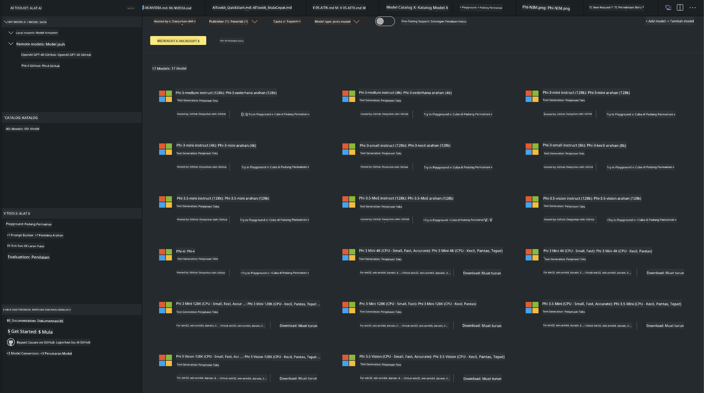
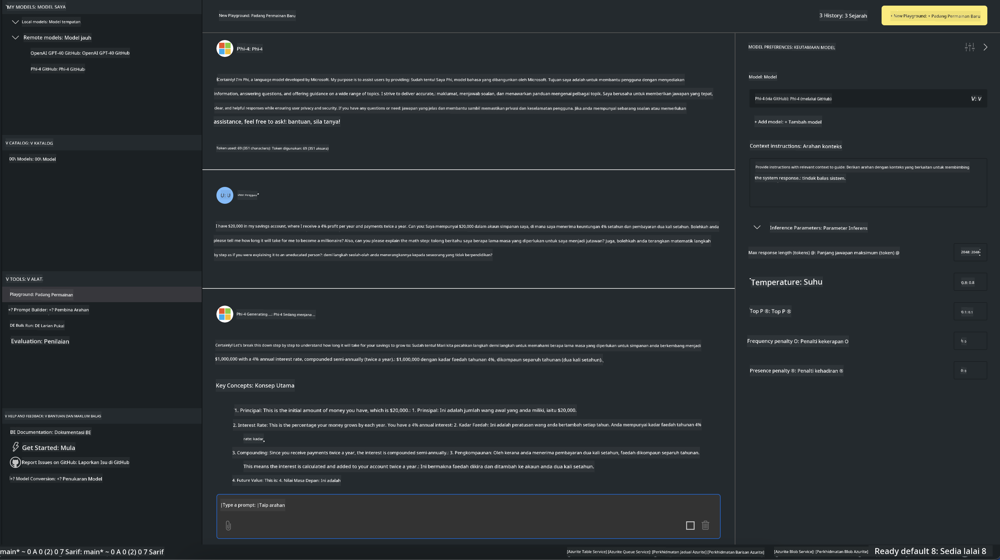

<!--
CO_OP_TRANSLATOR_METADATA:
{
  "original_hash": "4951d458c0b60c02cd1e751b40903877",
  "translation_date": "2025-07-16T19:28:44+00:00",
  "source_file": "md/01.Introduction/02/05.AITK.md",
  "language_code": "ms"
}
-->
# Keluarga Phi dalam AITK

[AI Toolkit untuk VS Code](https://marketplace.visualstudio.com/items?itemName=ms-windows-ai-studio.windows-ai-studio) memudahkan pembangunan aplikasi AI generatif dengan menggabungkan alat pembangunan AI terkini dan model dari Azure AI Foundry Catalog serta katalog lain seperti Hugging Face. Anda boleh melayari katalog model AI yang dikuasakan oleh GitHub Models dan Azure AI Foundry Model Catalogs, memuat turun secara tempatan atau jauh, melatih semula, menguji dan menggunakannya dalam aplikasi anda.

AI Toolkit Preview akan dijalankan secara tempatan. Inferens tempatan atau latihan semula bergantung pada model yang anda pilih, anda mungkin memerlukan GPU seperti NVIDIA CUDA GPU. Anda juga boleh menjalankan GitHub Models terus dengan AITK.

## Mula

[Ketahui lebih lanjut cara memasang Windows subsystem untuk Linux](https://learn.microsoft.com/windows/wsl/install?WT.mc_id=aiml-137032-kinfeylo)

dan [menukar pengedaran lalai](https://learn.microsoft.com/windows/wsl/install#change-the-default-linux-distribution-installed).

[Repositori GitHub AI Toolkit](https://github.com/microsoft/vscode-ai-toolkit/)

- Windows, Linux, macOS
  
- Untuk latihan semula pada Windows dan Linux, anda memerlukan GPU Nvidia. Selain itu, **Windows** memerlukan subsystem untuk Linux dengan distro Ubuntu 18.4 atau lebih baru. [Ketahui lebih lanjut cara memasang Windows subsystem untuk Linux](https://learn.microsoft.com/windows/wsl/install) dan [menukar pengedaran lalai](https://learn.microsoft.com/windows/wsl/install#change-the-default-linux-distribution-installed).

### Pasang AI Toolkit

AI Toolkit dihantar sebagai [Sambungan Visual Studio Code](https://code.visualstudio.com/docs/setup/additional-components#_vs-code-extensions), jadi anda perlu memasang [VS Code](https://code.visualstudio.com/docs/setup/windows?WT.mc_id=aiml-137032-kinfeylo) terlebih dahulu, dan muat turun AI Toolkit dari [VS Marketplace](https://marketplace.visualstudio.com/items?itemName=ms-windows-ai-studio.windows-ai-studio).  
[AI Toolkit tersedia di Visual Studio Marketplace](https://marketplace.visualstudio.com/items?itemName=ms-windows-ai-studio.windows-ai-studio) dan boleh dipasang seperti mana-mana sambungan VS Code lain.

Jika anda tidak biasa dengan pemasangan sambungan VS Code, ikut langkah berikut:

### Log Masuk

1. Dalam Bar Aktiviti di VS Code pilih **Extensions**  
1. Dalam bar carian Extensions taip "AI Toolkit"  
1. Pilih "AI Toolkit for Visual Studio code"  
1. Pilih **Install**

Sekarang, anda sudah bersedia untuk menggunakan sambungan ini!

Anda akan diminta untuk log masuk ke GitHub, jadi sila klik "Allow" untuk meneruskan. Anda akan diarahkan ke halaman log masuk GitHub.

Sila log masuk dan ikut langkah proses. Setelah berjaya, anda akan diarahkan kembali ke VS Code.

Setelah sambungan dipasang, ikon AI Toolkit akan muncul di Bar Aktiviti anda.

Mari terokai tindakan yang tersedia!

### Tindakan Tersedia

Bar sisi utama AI Toolkit disusun kepada  

- **Models**  
- **Resources**  
- **Playground**  
- **Fine-tuning**  
- **Evaluation**

Tersedia dalam bahagian Resources. Untuk mula, pilih **Model Catalog**.

### Muat turun model dari katalog

Apabila melancarkan AI Toolkit dari bar sisi VS Code, anda boleh memilih daripada pilihan berikut:



- Cari model yang disokong dari **Model Catalog** dan muat turun secara tempatan  
- Uji inferens model dalam **Model Playground**  
- Latih semula model secara tempatan atau jauh dalam **Model Fine-tuning**  
- Sebarkan model yang telah dilatih semula ke awan melalui command palette untuk AI Toolkit  
- Penilaian model

> [!NOTE]
>
> **GPU Vs CPU**
>
> Anda akan perasan bahawa kad model menunjukkan saiz model, platform dan jenis pemecut (CPU, GPU). Untuk prestasi optimum pada **peranti Windows yang mempunyai sekurang-kurangnya satu GPU**, pilih versi model yang hanya menyasarkan Windows.
>
> Ini memastikan anda mempunyai model yang dioptimumkan untuk pemecut DirectML.
>
> Nama model adalah dalam format
>
> - `{model_name}-{accelerator}-{quantization}-{format}`.
>
>Untuk memeriksa sama ada anda mempunyai GPU pada peranti Windows anda, buka **Task Manager** dan pilih tab **Performance**. Jika anda mempunyai GPU, ia akan disenaraikan di bawah nama seperti "GPU 0" atau "GPU 1".

### Jalankan model dalam playground

Setelah semua parameter ditetapkan, klik **Generate Project**.

Setelah model anda dimuat turun, pilih **Load in Playground** pada kad model dalam katalog:

- Mulakan muat turun model  
- Pasang semua keperluan dan pergantungan  
- Cipta ruang kerja VS Code



### Gunakan REST API dalam aplikasi anda

AI Toolkit dilengkapi dengan pelayan web REST API tempatan **pada port 5272** yang menggunakan [format OpenAI chat completions](https://platform.openai.com/docs/api-reference/chat/create).

Ini membolehkan anda menguji aplikasi anda secara tempatan tanpa perlu bergantung pada perkhidmatan model AI awan. Contohnya, fail JSON berikut menunjukkan cara mengkonfigurasi badan permintaan:

```json
{
    "model": "Phi-4",
    "messages": [
        {
            "role": "user",
            "content": "what is the golden ratio?"
        }
    ],
    "temperature": 0.7,
    "top_p": 1,
    "top_k": 10,
    "max_tokens": 100,
    "stream": true
}
```

Anda boleh menguji REST API menggunakan (contohnya) [Postman](https://www.postman.com/) atau utiliti CURL (Client URL):

```bash
curl -vX POST http://127.0.0.1:5272/v1/chat/completions -H 'Content-Type: application/json' -d @body.json
```

### Menggunakan perpustakaan klien OpenAI untuk Python

```python
from openai import OpenAI

client = OpenAI(
    base_url="http://127.0.0.1:5272/v1/", 
    api_key="x" # required for the API but not used
)

chat_completion = client.chat.completions.create(
    messages=[
        {
            "role": "user",
            "content": "what is the golden ratio?",
        }
    ],
    model="Phi-4",
)

print(chat_completion.choices[0].message.content)
```

### Menggunakan perpustakaan klien Azure OpenAI untuk .NET

Tambah [perpustakaan klien Azure OpenAI untuk .NET](https://www.nuget.org/packages/Azure.AI.OpenAI/) ke projek anda menggunakan NuGet:

```bash
dotnet add {project_name} package Azure.AI.OpenAI --version 1.0.0-beta.17
```

Tambah fail C# bernama **OverridePolicy.cs** ke projek anda dan tampal kod berikut:

```csharp
// OverridePolicy.cs
using Azure.Core.Pipeline;
using Azure.Core;

internal partial class OverrideRequestUriPolicy(Uri overrideUri)
    : HttpPipelineSynchronousPolicy
{
    private readonly Uri _overrideUri = overrideUri;

    public override void OnSendingRequest(HttpMessage message)
    {
        message.Request.Uri.Reset(_overrideUri);
    }
}
```

Seterusnya, tampal kod berikut ke dalam fail **Program.cs** anda:

```csharp
// Program.cs
using Azure.AI.OpenAI;

Uri localhostUri = new("http://localhost:5272/v1/chat/completions");

OpenAIClientOptions clientOptions = new();
clientOptions.AddPolicy(
    new OverrideRequestUriPolicy(localhostUri),
    Azure.Core.HttpPipelinePosition.BeforeTransport);
OpenAIClient client = new(openAIApiKey: "unused", clientOptions);

ChatCompletionsOptions options = new()
{
    DeploymentName = "Phi-4",
    Messages =
    {
        new ChatRequestSystemMessage("You are a helpful assistant. Be brief and succinct."),
        new ChatRequestUserMessage("What is the golden ratio?"),
    }
};

StreamingResponse<StreamingChatCompletionsUpdate> streamingChatResponse
    = await client.GetChatCompletionsStreamingAsync(options);

await foreach (StreamingChatCompletionsUpdate chatChunk in streamingChatResponse)
{
    Console.Write(chatChunk.ContentUpdate);
}
```


## Latihan Semula dengan AI Toolkit

- Mulakan dengan penemuan model dan playground.  
- Latihan semula model dan inferens menggunakan sumber pengkomputeran tempatan.  
- Latihan semula dan inferens jauh menggunakan sumber Azure

[Latihan Semula dengan AI Toolkit](../../03.FineTuning/Finetuning_VSCodeaitoolkit.md)

## Sumber Soalan & Jawapan AI Toolkit

Sila rujuk [halaman Soalan & Jawapan kami](https://github.com/microsoft/vscode-ai-toolkit/blob/main/archive/QA.md) untuk isu dan penyelesaian yang paling biasa

**Penafian**:  
Dokumen ini telah diterjemahkan menggunakan perkhidmatan terjemahan AI [Co-op Translator](https://github.com/Azure/co-op-translator). Walaupun kami berusaha untuk ketepatan, sila ambil maklum bahawa terjemahan automatik mungkin mengandungi kesilapan atau ketidaktepatan. Dokumen asal dalam bahasa asalnya harus dianggap sebagai sumber yang sahih. Untuk maklumat penting, terjemahan profesional oleh manusia adalah disyorkan. Kami tidak bertanggungjawab atas sebarang salah faham atau salah tafsir yang timbul daripada penggunaan terjemahan ini.